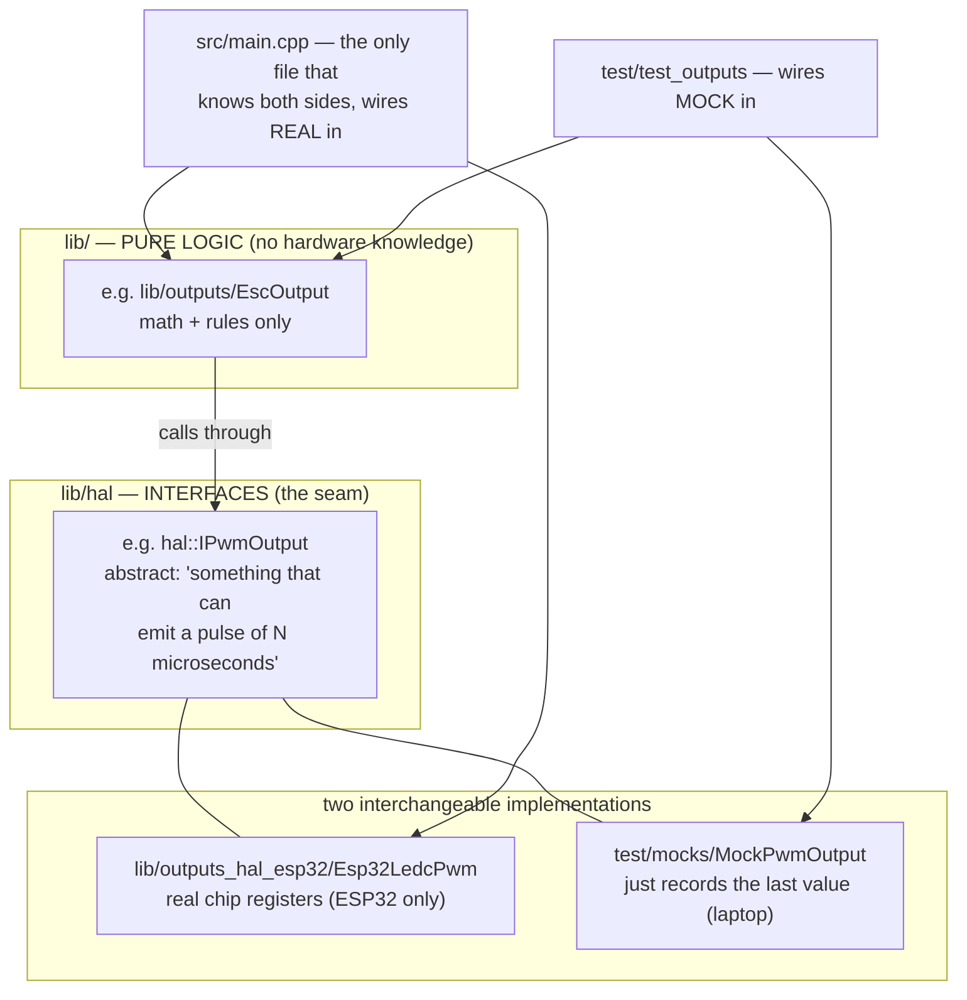
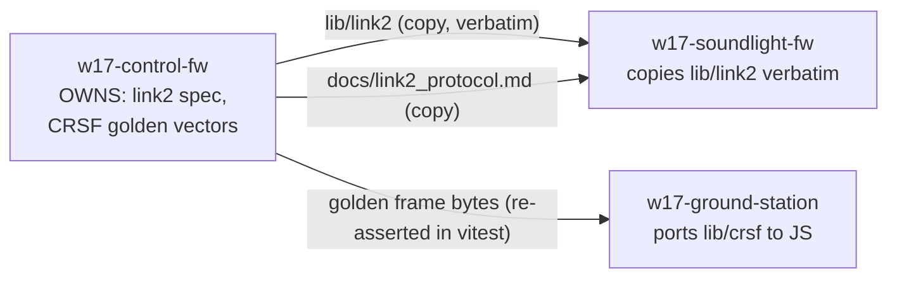

# 02 — Repository Map

How the code in all three repos is organized, and — more important — *why* it's organized
that way. Once you understand the pattern in §1 you can navigate any module without help.

## 1. The house pattern: pure logic + thin hardware shells

**[C]** Stated as a rule in `w17-control-fw/CLAUDE.md` §5 ("no ESP32/Arduino headers in
the pure-logic files") and `w17-soundlight-fw/CLAUDE.md`; verified in the tree.

Both firmware repos split every feature into up to three pieces:



Why this matters to you as a learner:

- You can read and *run* `lib/gearbox`, `lib/failsafe`, `lib/ers`, the whole sound
  synthesizer, etc. on your Mac. The hardware-specific code is a thin, boring layer.
- The pattern has a name in general software engineering — *dependency inversion* /
  *ports and adapters* — but you don't need the theory; you'll see the same three-file
  shape repeated a dozen times.

Standard shapes inside every `lib/<module>/`:

```
lib/gearbox/
├── include/gearbox/Gearbox.hpp   ← public header: what the module offers
├── src/Gearbox.cpp               ← implementation
└── library.json                  ← PlatformIO metadata (name, build rules)
```

## 2. `w17-control-fw` — the control board

```
w17-control-fw/
├── CLAUDE.md            founding brief: hardware, spec, safety rules
├── platformio.ini       build config: 4 environments (see chapter 11)
├── wokwi.toml, diagram.json   virtual-hardware simulation (chapter 11)
├── docs/                the documentation home (chapter 05)
├── src/
│   ├── main.cpp         THE entry point (~403 lines): wires everything, runs the loop
│   └── SimCrsfFeeder.{hpp,cpp}   scripted fake radio for the simulator build only
├── lib/                 one folder per module — the heart of the repo
└── test/                one folder per module's Unity test suite + shared mocks
```

### The pure-logic libraries (all laptop-runnable)

| Library | Central classes/functions | Job (one line) |
|---|---|---|
| `lib/config` | `pinmap::k*Pin` constants | Every GPIO number, in one header (`PinMap.hpp`) |
| `lib/hal` | `IPwmOutput`, `IClock`, `IByteSink`, `ICharIO`, `IVoltageSensor`, `IWheelPulseSensor`, `ISettingsStore` | The hardware interfaces (seams) |
| `lib/crsf` | `CrsfFrameAssembler`, `decodeRcChannels`/`decodeLinkStatistics` (in `CrsfParser`), `CrsfReceiver`, `CrsfFrameBuilder` | Radio protocol in *and* telemetry frames out |
| `lib/channels` | `ChannelDecoder`, `ArmGate` | Raw channels → named, normalized controls; the arm safety gate |
| `lib/failsafe` | `FailsafeStateMachine` | Link healthy? → `Active`/`Safe` (the safety core) |
| `lib/gearbox` | `shapeThrottle()`, `Gearbox` | Virtual gears: per-gear power cap + expo curve |
| `lib/ers` | `ErsSystem` | F1-style energy store: boost/overtake deploy, brake/coast harvest |
| `lib/outputs` | `ServoOutput`, `EscOutput`, `DrsOutput` | Normalized commands → pulse microseconds |
| `lib/telemetry` | `BatteryMonitor`, `WheelSpeed` | Sensor readings → volts / rpm, with filtering + warnings |
| `lib/link2` | `Link2Codec` (encode/decode/assembler), `Link2Sender` | The board#1→#2 protocol |
| `lib/settings` | `Settings`, `kDefaults` | Bench-tunable values + save/load blob for flash |
| `lib/console` | `Console`, `ConsoleRunner` | The serial tuning console (`get/set/save…`) |

> Every library above now has a **line-by-line deep dive** in `code_explained/control_fw/`
> (batches C1–C10; the file↔batch map is in `source_code_progress.md`).

### The ESP32-only shells

| Library | Wraps | Used by |
|---|---|---|
| `lib/crsf_hal_esp32` (`Esp32CrsfUart`) | UART2 @ 420,000 baud (GPIO16 RX / GPIO17 TX) | radio in, telemetry out |
| `lib/outputs_hal_esp32` (`Esp32LedcPwm`) | the ESP32 "LEDC" PWM peripheral, 50 Hz | all five servo/ESC outputs |
| `lib/telemetry_hal_esp32` (`Esp32BatteryAdc`, `Esp32HallPulseCounter`) | ADC pin GPIO34; interrupt on GPIO35 | battery + wheel speed |
| `lib/link2_hal_esp32` (`Esp32Link2Uart`) | UART1 TX-only on GPIO25 | link2 to board #2 |
| `lib/settings_hal_esp32` (`Esp32NvsStore`, `Esp32SerialConsole`) | flash storage (NVS) + USB serial | tuning build only |

### Tests

`test/test_<module>/test_main.cpp` per module, `test/mocks/` shared fakes. **[C]** 147
tests total (`docs/ROADMAP.md` B2 item 8). Notable: `test_link2` contains
`test_golden_frame_bytes` pinning the exact wire bytes of the link2 protocol, and
`test_crsf` pins each outgoing telemetry frame — the ground station asserts the *same
bytes* in its own tests.

## 3. `w17-soundlight-fw` — the sound/light board

Same pattern, smaller:

| Library | Central classes | Job |
|---|---|---|
| `lib/config` | `pinmap::*` | Board #2's pins (link2 RX 16; I2S 26/25/22; LEDs 4) |
| `lib/link2` | `Link2Codec`, `Link2FrameAssembler` | **Verbatim copy** from the control repo — the protocol owner. [C] "do not fork; protocol changes happen there first" (`CLAUDE.md`) |
| `lib/link2monitor` | `Link2Monitor`, `LinkStatus` | Staleness watchdog: last good state while link Up, safe projection when Lost |
| `lib/enginesim` | `EngineSim`, `Ignition` | Virtual engine: rpm inertia, starter, rev limiter, shift blips, overrun |
| `lib/soundsynth` | `EngineSynth`, `ISampleSource` | The DSP: turns engine state into audio samples (all integer math) |
| `lib/lights` | `LightRenderer` | Pixel compositor: brake/indicators/rain/halo/hazard + gamma + power cap |
| `lib/audio_hal_esp32` | `Esp32I2sAudio` | I2S output @ 22,050 Hz to the MAX98357A |
| `lib/lights_hal_esp32` | `Esp32NeoPixelStrip` | WS2812 via the Adafruit NeoPixel library |

> Every library above now has a **line-by-line deep dive** in `code_explained/soundlight_fw/`
> (batches S1–S5; the file↔batch map is in `source_code_progress.md`).

`src/main.cpp` (142 lines) is special: it splits work across the ESP32's **two CPU
cores** — control logic on core 1, audio rendering on core 0 — sharing exactly one
atomic 32-bit word + a heartbeat (chapter 07). `src/SimLink2Feeder.{hpp,cpp}` scripts a
fake board-#1 for the standalone bench demo. Tests: 6 suites, 40 tests, including a pure
end-to-end `test_integration` (frames in → audio out).

## 4. `w17-ground-station` — the laptop app

JavaScript, not C++. Electron apps have two worlds (chapter 08): the **main process**
(Node.js — files, serial ports, child processes) and the **renderer** (a Chromium
browser page — the visible UI). They talk over IPC (inter-process messages).

```
w17-ground-station/
├── package.json          npm manifest; `main/main.js` is the entry point
├── main/                 MAIN PROCESS
│   ├── main.js           window creation, telemetry source selection, IPC push
│   ├── mediamtx.js       starts/supervises the bundled mediamtx video server
│   ├── CrsfSerialSource.js  reads CRSF telemetry from a serial port
│   ├── preload.cjs       the safe bridge exposed to the renderer
│   ├── IphoneTelemetryBridge.js + iphoneBridgeConfig.js   W2: telemetry → iPhone,
│   │                     UDP 5601, SEND-ONLY, off by default (W17_IPHONE_BRIDGE)
│   └── HeadTrackingReceiver.js + headTrackingConfig.js    W3: iPhone → Windows,
│                         UDP 5602, LOG-ONLY dead end, off by default (W17_HEADTRACK)
├── renderer/             RENDERER (the visible HUD web page)
│   ├── index.html, hud.css, hud.js   gamepad mirroring + simulated dash + overlay
│   └── whep.js           WebRTC video client
├── shared/               PURE, unit-tested logic used by both worlds
│   ├── crsf.js           CRSF decoder — a faithful JS port of the firmware's
│   ├── crsfAssembler.js  byte-stream → frames
│   ├── crsfTelemetry.js  frames → Telemetry fields
│   ├── telemetry.js      the normalized Telemetry object (contract: docs/TELEMETRY.md)
│   ├── linkState.mjs     the 4-state HUD link model (audit F2; ch08 §3)
│   ├── replaySource.js   fake telemetry for `npm run demo`
│   ├── feelConstants.js  ERS feel numbers shared with the firmware
│   ├── telemetrySnapshot.js  W2: pure iPhone-packet builder (bridge contract)
│   └── headTracking.js   W3: pure packet validator + diagnostics monitor (LOG-ONLY)
├── mediamtx/mediamtx.yml pinned server config (camera RTSP URL goes here)
├── scripts/              run/setup helpers (Electron repair, mediamtx download)
├── test/                 8 vitest suites, 118 tests (incl. the shared CRSF golden
│                         fixture, audit F3, and the no-control-path guards)
├── .github/workflows/ci.yml   npm test on Linux + a Windows packaging smoke (F2)
└── docs/                 SETUP.md (bench risks), TELEMETRY.md (contract),
                          CODESIGNING.md, windows_bridge_contract.md (implementation
                          copy — canonical lives in Codex-owned iPhone_rc) + bridge
                          readiness/test-plan notes
```

> **Inventory note (updated 2026-07-09, G0 pass):** tree re-verified file-by-file; the
> audit fixes (F2/F3/F4) and the iPhone-bridge work (W1–W3, 2026-07-07/08) added the
> files marked W2/W3/F above and grew the test suite from 20 to **118 vitest tests**
> (run this session: 118/118). The W3 head-tracking receiver is **LOG-ONLY by safety
> boundary** (it must never reach CRSF, servos, or the gimbal) and its real-device
> validation is **still pending** (open question #58). Batch placement of every file:
> `source_code_explanation_plan.md` (G1–G5b); the shared pure core now has its
> line-by-line deep dive.

> Deep dive: `shared/`'s pure core (CRSF decode, telemetry model, link state, golden
> fixture) is explained line-by-line in
> `code_explained/ground_station/01_shared_pure_core.md` (batch G1, incl. a
> JS-for-C++-readers primer); the main process + telemetry sources (`main/main.js`,
> `preload.cjs`, `mediamtx.js`, `CrsfSerialSource.js`, `shared/replaySource.js`) in
> `02_main_process_and_telemetry_sources.md` (batch G2); the renderer
> (`renderer/index.html`, `hud.css`, `hud.js`, `whep.js` — the HUD, the widget
> precedence, WHEP video, the command mirror) in `03_renderer_hud_and_whep.md`
> (batch G3, incl. a browser-concepts primer); the remaining batches G4–G5b are
> planned in `source_code_explanation_plan.md`.

## 5. Who owns what (cross-repo relationships)



**[C]** `w17-soundlight-fw/CLAUDE.md`: "copied VERBATIM … do not fork; protocol changes
happen there first." `w17-ground-station/docs/TELEMETRY.md`: "every emitted frame is
pinned by an identical golden vector in *both* the firmware … and here."

Practical consequence: if you ever want to change a protocol, the change starts in
`w17-control-fw` and propagates outward — never the reverse.

## Confirmed vs inferred

**Confirmed [C]:** the folder trees and file lists (verified by directory listing
2026-07-03); the pure-vs-HAL rule and the `lib_ignore` enforcement
(`platformio.ini [env:native]`); test counts (ROADMAP/READMEs); ownership rules (quoted
above).

**Inferred [I]:** the description of *why* the seam pattern exists (testability) is the
docs' own stated motivation, generalized. *(The old note here — "exactly what
`preload.cjs` exposes awaits the code-reading phase" — was answered by G2, 2026-07-09:
it exposes exactly three functions, `getConfig` / `onTelemetry` / `sendCommandMirror`,
as `window.groundStation`; see the G2 deep dive §3.)*

**Assumed [A]:** none of significance in this chapter.

## Questions to check your understanding

1. You want to change the ESC's neutral pulse width. Which of the three layers (pure
   lib, hal interface, esp32 shell) would you expect that constant to live in, and why?
2. Why does `platformio.ini`'s `[env:native]` list five `*_hal_esp32` libraries under
   `lib_ignore`? What would happen without it?
3. `lib/link2` exists in two repos. Which copy is authoritative, and what is the rule
   when the protocol needs a change?
4. In the ground station, why is the CRSF decoder in `shared/` rather than in `main/` or
   `renderer/`?
5. Name the four files you would open first to answer: "which GPIO pin drives the DRS
   servo, and what module decides its position?"
