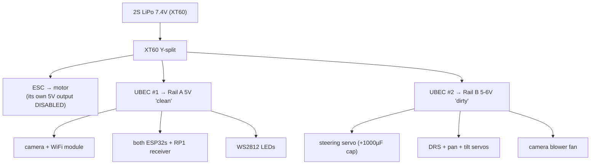

# 03 — Hardware & Electronics Basics

Every electronics concept the project uses, taught on the project's own circuits. If you
already know a section, skim its "in this project" paragraph anyway — that's where the
project-specific numbers live.

## 1. Voltage, current, ground — and why "common ground" is rule #1

Voltage is electrical *pressure* measured between two points; current is the *flow*.
Every voltage is relative to some reference point, which we call **ground (GND)**. Two
circuits can only understand each other's signals if they agree on that reference —
that's why the wiring docs repeat, in bold: **all grounds common** (battery, ESC, both
BECs, both ESP32s, camera, WiFi module, RP1). **[C]** `docs/00_BUILD_SHEET.md` packing
notes; `docs/D8_BENCH_BRINGUP.md` Phase 0.

A UART "3.3 V logic" signal (below) is literally "3.3 V *above ground*" — if two boards
don't share ground, the receiver has no idea what the sender means.

## 2. The battery: a 2S LiPo

**[C]** `docs/bill_of_materials_v2.md` §D: 2S LiPo, 7.4 V, ~1300–1500 mAh, XT60 connector.

- "2S" = two lithium-polymer cells in Series. Each cell: 4.2 V full, ~3.7 V nominal,
  ~3.0 V damage floor. So the pack: **8.4 V full, 7.4 V nominal**.
- LiPos deliver huge current but are damaged by over-discharge — hence the firmware's
  battery monitoring: warn latched after 3 s sustained below **7.0 V** (3.5 V/cell),
  cleared above **7.4 V**. **[C]** thresholds in `docs/ROADMAP.md` D5 (implemented in
  `w17-control-fw/lib/telemetry/BatteryMonitor`). Monitoring only — the firmware never
  cuts power itself (`CLAUDE.md` §6.4), because a surprise cutoff mid-corner is its own
  hazard.

## 3. Power distribution: one battery, three consumers, two rails



**[C]** `w17_wiring_assembly_atlas.html` ELEC-02; `00_BUILD_SHEET.md`.

Concepts here:

- **BEC/UBEC** ("(Universal) Battery Eliminator Circuit") = a DC-DC voltage regulator:
  takes battery voltage, outputs a steady 5 V. Two are used so that **servo noise can't
  corrupt the electronics**: motors inside servos draw sharp current spikes that drag
  their rail's voltage around; the sensitive stuff (radio, camera, microcontrollers)
  lives on its own quiet rail.
- **Decoupling capacitor**: a local energy reservoir that smooths those spikes. The
  1000 µF capacitor on the servo rail exists because the big steering servo's stall
  current would otherwise cause voltage dips ("brownouts") that reboot things. **[C]**
  build-sheet bench fix #5.
- **The isolated ESC red wire** (bench fix #1): the ESC has its *own* built-in 5-6 V BEC
  on the middle (red) wire of its servo plug. With two UBECs already powering the rails,
  connecting the ESC's red wire too would fight them ("back-feed") and can damage the
  ESC. So only signal + ground connect from ESP32 #1 to the ESC. **[C]**
  `00_BUILD_SHEET.md` fix #1; `D8_BENCH_BRINGUP.md` Phase 0.

## 4. Reading the battery: the voltage divider

The ESP32's analog input pins can only measure roughly 0–3.3 V (less, honestly — see
attenuation below). The battery is up to 8.4 V. The classic fix is a **voltage divider**:
two resistors in series across the battery; the voltage at their junction is a fixed
fraction of the input.

```
battery + ──[ 27 kΩ ]──●──[ 10 kΩ ]── GND
                       │
                       └──→ GPIO34 (ADC input)
```

The fraction is 10k / (27k + 10k) = 0.270. So 8.4 V at the battery → **2.27 V** at the
pin — comfortably inside the ADC's linear range. **[C]** `CLAUDE.md` §7,
`bill_of_materials_v2.md` "key build reminders" (which also documents why the earlier
20k/10k choice was wrong: it clipped the top of the range).

Related concepts, all present in this project:

- **ADC (analog-to-digital converter):** the peripheral that turns a pin voltage into a
  number. ESP32 ADCs are notoriously non-linear, so the firmware uses the chip's
  factory-calibrated conversion (`analogReadMilliVolts`) and adds a user trim factor
  (`batt.ppt` in the tuning console) calibrated against a multimeter. **[C]** ROADMAP D5,
  D8 Phase 8.
- **Attenuation (11 dB):** an ADC input setting that extends its usable input range to
  roughly 0–2.5 V (the divider was chosen to land in it). **[C]** `CLAUDE.md` §1.
- **Source impedance + the 100 nF capacitor:** the divider's resistors are large
  (~7.3 kΩ effective), so the ADC's sampling briefly "loads" the node and single reads
  are noisy; a small capacitor from GPIO34 to GND holds the voltage steady during
  sampling. **[C]** D8 Phase 0 ("100 nF cap GPIO34 → GND"); the firmware also burst-
  averages several reads (ROADMAP D5).

## 5. The wheel-speed sensor: Hall effect, open-collector, pull-ups

An **A3144 Hall-effect sensor** outputs a digital signal when a magnet passes it. One
magnet is glued to the rear axle → one pulse per wheel revolution.

Two ideas to understand the wiring:

- **Open-collector output:** the sensor can only *pull the line down to GND*; it cannot
  drive it high. Left alone the line would float at no defined voltage.
- **Pull-up resistor:** a resistor from the signal line to a supply gives the line a
  defined "high" when the sensor isn't pulling it low.

The trick in this project: the A3144 needs 5 V to *operate*, but the ESP32 pin must never
see 5 V. Because the output is open-collector, you can power the sensor from 5 V and
pull the *output line* up to **3.3 V** — the sensor only ever connects the line to GND,
so the pin sees clean 0 V / 3.3 V. **[C]** `CLAUDE.md` §7: "A3144: 5 V supply, 10 kΩ
pull-up to 3.3 V, open-collector output → GPIO35."

The firmware counts **rising edges** (low→high transitions, i.e., magnet leaving) in an
interrupt, with a 2 ms lockout so electrical noise or bounce can't double-count
(chapter 10 covers the math; chapter 04 covers interrupts). GPIO34/35 are "input-only"
ESP32 pins with no internal pull-ups — fine here because the pull-up is external. **[C]**
`CLAUDE.md` §1 note.

## 6. Servo PWM: the universal RC actuator signal

Every RC servo and ESC understands the same ancient signal: a pulse repeated ~50 times a
second whose **width in microseconds** encodes the command.

```
      |--- 20 ms (50 Hz) ---|
  ____        ______________         ____
 |    |______|              |_______|    |...
 1500µs pulse = center/neutral

  1000 µs  ≈ full one way (ESC: full brake/reverse region)
  1500 µs  = center (servo) / neutral (ESC)
  2000 µs  ≈ full other way (ESC: full throttle)
```

- **Steering servo:** the DS3235SG accepts a wide 500–2500 µs range for its 180° travel;
  the firmware's `ServoOutput` maps −1000…+1000 onto configurable endpoints with a trim
  offset. **[C]** `CLAUDE.md` §2.5.
- **ESC:** treats 1500 µs as neutral, above as forward, below as brake. The firmware's
  `EscOutput` also enforces a **boot arm sequence** — hold neutral ~2 s before honoring
  any throttle — because ESCs refuse to arm (and beep angrily) if powered up with a
  non-neutral command. **[C]** `CLAUDE.md` §2.5, §6.3.
- On the ESP32, these pulses are generated by the **LEDC** peripheral (a hardware PWM
  unit — "LED controller" by name, but exact enough for servos), wrapped by
  `lib/outputs_hal_esp32/Esp32LedcPwm`. Hardware generation means the pulse timing stays
  perfect even while the CPU is busy.

## 7. The ESC and brushless motor

An **ESC (electronic speed controller)** converts the PWM command into three-phase power
for a **brushless motor**. Project specifics:

- The motor is **sensored** (17.5T Rocket 540): it has tiny position sensors and a extra
  ribbon cable to the ESC, giving perfectly smooth ultra-low-speed control — chosen
  deliberately for a precision gift car. **[C]** BOM §3; `00_BUILD_SHEET.md` fix #7.
- The ESC must be configured (via its own setup procedure, not our firmware) in
  **forward/brake mode, not forward/reverse**. Reason: below-neutral PWM is *the same
  signal* for "brake" and "reverse"; the firmware's gearbox governs forward power only,
  so an ESC that interprets below-neutral as reverse would give you ungoverned reverse.
  **[C]** `lib/gearbox/Gearbox.hpp` header note; D8 Phase 7.
- "17.5T" = the motor winding's turn count — a spec-class racing motor; higher T = more
  torque-gentle, slower. **[I]** standard RC knowledge applied; the BOM picked it for
  smooth control, per its own note.

## 8. WS2812 addressable LEDs — and the 3.3 V vs 5 V problem

A **WS2812B** strip has a tiny controller chip in every LED; one **data wire** carries a
fast (800 kHz) serial stream that sets each LED's red/green/blue value individually.
That's how one GPIO pin animates a 30-LED strip.

The catch: the strip runs on 5 V and officially wants its data "high" to be ≥ 0.7 × its
supply = 3.5 V. The ESP32 outputs 3.3 V — marginally too low. The project's fixes
(pick one), **[C]** `00_BUILD_SHEET.md` fix #4 + soundlight `docs/SIMULATION.md`:

- a **1N5819 Schottky diode** in the strip's 5 V feed, dropping its supply ~0.3 V so the
  threshold falls below 3.3 V (cheap trick), or
- a proper **level shifter** (74AHCT125) that converts the data line to 5 V.

Plus: 330 Ω in series with data (kills reflections/spikes) and 1000 µF across the strip's
power (LED current steps are sharp). The strip's power budget is even enforced in
software: `LightRenderer`'s config caps brightness (~43%) so a worst-case all-amber
hazard stays within the UBEC's current headroom. **[C]** soundlight `CLAUDE.md`,
`docs/SIMULATION.md` checklist.

## 9. I2S digital audio

**I2S** is a three-wire digital audio bus: BCLK (bit clock), LRCLK (left/right word
select), DIN (data). The ESP32 streams 16-bit samples at 22,050 Hz to a **MAX98357A** —
a chip that is both DAC (digital→analog) and 3 W amplifier — which drives the speaker
directly. No analog audio wiring to get noisy. Pins: BCLK 26, LRCLK 25, DIN 22. **[C]**
`w17-soundlight-fw/lib/config/PinMap.hpp`.

The MAX98357A has strap pins (hardware configuration by tying a pin high/low/floating):
GAIN floating = 9 dB (the starting point), SD_MODE high = enabled, outputting (L+R)/2.
The firmware sends the same mono signal duplicated to both stereo slots, so any SD_MODE
strap sounds identical. **[C]** same PinMap header comments.

## 10. EMI — why the motor can lie to your sensors

**EMI (electromagnetic interference):** a brushless motor switching amps at high
frequency radiates noise that can induce phantom pulses on nearby signal wires — the
Hall sensor line being the classic victim. The project defends in layers, **[C]**
ROADMAP D5 + D8 Phase 8:

1. wiring hygiene (bench: scope the Hall line at full throttle; add 1–10 nF if ugly),
2. a 2 ms interrupt lockout (max legitimate pulse rate is ~55 Hz — anything faster is
   noise),
3. a plausibility clamp in software (readings implying > 5000 wheel rpm are discarded).

This layered defense — physical, timing, logical — is a pattern worth noticing; the
whole project treats every input as potentially lying.

## 11. The camera + WiFi module (video side, briefly)

The OpenIPC camera is a tiny Linux computer with an image sensor; it has **no radio**.
A separate USB WiFi module (BL-M8812EU2) is soldered to it by four joints (USB D+, D−,
GND, and 5 V from clean Rail A) and creates the 5.8 GHz access point the laptop joins.
Rules that protect it: antennas connected **before** power (a transmitter with no
antenna can burn its output stage), heatsink fitted before first power-on. **[C]** atlas
ELEC-06; BOM §A.1. The camera runs hot enough to need a small blower fan + printed duct
(BOM §13, `print_spec_v2.md`).

## Confirmed vs inferred

**Confirmed [C]:** every wiring/values claim cites `00_BUILD_SHEET.md`,
`bill_of_materials_v2.md`, `D8_BENCH_BRINGUP.md`, the atlas, PinMap headers, or module
headers as marked.

**Inferred [I]:** the *explanations* of why each practice works (ground reference, rail
noise, divider math, open-collector trick, EMI physics) are standard electronics applied
to the documented circuits — the docs state the practice, this chapter supplies the
theory. The 17.5T characterization is general RC knowledge.

**Assumed [A]:** all of this describes the *planned* build. Nothing is wired yet
(ROADMAP: D8 pending), so component behavior claims (e.g., ESC arming details) carry the
docs' own "bench-verify" flags.

## Questions to check your understanding

1. Why does the battery divider use 27k over 10k rather than, say, 270k over 100k or
   2.7k over 1k? (Two competing concerns — one is in §4, the other is battery drain.)
2. The Hall sensor is powered from 5 V, yet GPIO35 never sees 5 V. Explain the two facts
   about the circuit that make this safe.
3. A servo twitches and the camera reboots every time the steering slams. Which *two*
   provisions in the power design exist to prevent exactly this?
4. Why must the ESC's red wire be disconnected at ESP32 #1, but the black (ground) wire
   must NOT be?
5. What could go wrong if the ESC were configured in forward/reverse mode, given how the
   gearbox shapes only positive throttle?
6. The WS2812 data line works fine on the bench but glitches in the car. Name three
   plausible causes drawn from §8 and §10.
