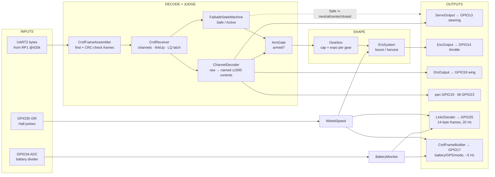

# 06 — Control Firmware Architecture (`w17-control-fw`)

The main firmware, module by module: what flows in, what decisions happen, what flows
out. No line-by-line yet — this is the architectural pass; deep dives come later.

## 1. The data-flow picture

The one-sentence version: **bytes become channels, channels become intents, intents pass
two safety judges, survivors get shaped for feel, and everything observable is reported
twice (down to board #2, up to the HUD).**

## 2. Module tour (in data-flow order)

### 2.1 `lib/crsf` — the radio's language
Three cooperating layers, deliberately separated:
- **`CrsfFrameAssembler`** — eats one byte at a time from the UART, finds frame
  boundaries (sync `0xC8`), validates CRC8; emits "frame ready" events. Framing only —
  it doesn't care what's inside (that generalization was fix A7, so telemetry frames
  interleaved by ELRS stop being miscounted as corruption).
- **`CrsfParser`** — pure functions decoding payloads: `RC_CHANNELS_PACKED` (0x16,
  16×11-bit channels) and `LINK_STATISTICS` (0x14, link quality etc.).
- **`CrsfReceiver`** — the facade `main.cpp` talks to: owns a copy of the latest
  channels, `linkUp()`, and the safety-relevant subtlety: `rxSignalsFailsafe()` is a
  **latched** flag set when a stats frame reports uplink link-quality 0, cleared *only*
  by a stats frame with LQ > 0 — never by RC frames or by time passing. **[C]** ROADMAP
  D4. Why: a misconfigured receiver in "hold position" failsafe keeps *sending RC
  frames* during signal loss; freshness alone would look healthy (finding A8).
- **`CrsfFrameBuilder`** — the reverse direction: constructs frames (canned test/sim
  input, and the outgoing telemetry: battery 0x08, GPS 0x02, flight-mode 0x21).

### 2.2 `lib/channels` — from numbers to meanings
- **`ChannelDecoder`**: a config table maps channel indexes to roles — **[C]** defaults
  (`ChannelDecoder.hpp`, bench-verify pending): steering ch1, throttle ch3, arm ch5,
  DRS ch6, gearUp ch7, gearDown ch8, pan ch9, tilt ch10, boost ch11, overtake ch12,
  driveMode ch13 (3-position). Converts raw 172…1811 to normalized −1000…+1000
  (center 992 → 0), applies invert flags, and treats switches with **hysteresis**: ON
  above +250, OFF below −250, so a jittery mid-value can't chatter. Switch edges
  (gearUp pressed *this frame*) are detected here, seeded on first decode so boot can't
  produce phantom shifts.
- **`ArmGate`**: chapter 10 §2. Armed ⇔ arm switch ON **and** throttle observed inside
  the ±60 neutral window since the last disarm. Any failsafe episode or switch-off
  disarms and demands fresh neutral.

### 2.3 `lib/failsafe` — the safety authority
`FailsafeStateMachine::update(nowMs, frameArrivedThisTick, rxFailsafeFlag) → Safe/Active`.
Full treatment in chapter 10 §1. Key behaviors: born Safe; can never leave Safe until a
real frame has arrived (the A1 latch); drops to Safe instantly on timeout (500 ms) or RX
flag; returns to Active only after 150 ms of *continuously* good link.

### 2.4 `lib/gearbox` + `lib/ers` — the feel layer
Chapter 10 §3–4 covers the math. Architecturally: both are pure, both consume the
*post-gate* throttle (so they can never move a disarmed car — `ErsSystem::applyBoost(0)`
is pinned `== 0` by a test), and both keep state deliberately across failsafe episodes
(your gear doesn't reset because the link blipped).

Drive modes (ch13 3-pos): **0 Training** (fixed gentle cap, shifts ignored),
**1 Gearbox** (default), **2 Gearbox+ERS**. **[C]** ROADMAP B2.2 — which also records
the design change: the originally-planned raw "Direct" mode was dropped since top gear
already delivers full power.

### 2.5 `lib/outputs` — intents to microseconds
- `ServoOutput`: −1000…+1000 → 500–2500 µs around a configurable center + trim; config
  rejects a trim that would push center past an endpoint (finding A11).
- `EscOutput`: −1000…+1000 → 1000–2000 µs, neutral 1500; holds neutral for
  `bootArmHoldMs` (2000) from the *first* throttle command (fix A5) so the ESC arms.
- `DrsOutput`: boolean → two configured pulse widths.
All three speak through `hal::IPwmOutput`; the real `Esp32LedcPwm::begin()` immediately
commands the safe position at attach time (fix A4), so there is no unpowered-duty gap.

### 2.6 `lib/telemetry` — believing sensors carefully
- `BatteryMonitor`: divider mV → pack mV with a trim factor; EMA smoothing (seeded from
  the first sample — no boot false alarm); low-battery warning only after 3 s sustained
  < 7.0 V, cleared > 7.4 V (sag-proof hysteresis).
- `WheelSpeed`: rpm from the ISR's measured pulse *period* (not counts-per-tick, which
  would quantize at 50 Hz); implausible readings (> 5000 rpm) rejected; on silence the
  report decays and hard-zeros after 1.5 s.

### 2.7 `lib/link2` — reporting downstream
`Link2Sender` snapshots the world every 50 ms into the 14-byte frame (chapter 09 §3).
Two design points: throttle reported is **what the ESC is actually commanded** (zero in
failsafe/disarm) so the engine sound can never contradict reality; and the braking flag
is hysteresis-filtered by the sender so board #2 can drive the brake light directly.
**Sending continues during failsafe** — board #2 needs to know, and a deliberate design
review catch removed an early-return that would have silenced it (ROADMAP D6).

### 2.8 `lib/settings` + `lib/console` — the bench tuning surface
Present only in the `esp32dev_tuning` build. `Settings` aggregates the tunables
(steering center/trim, battery calibration, gear feel table) and serializes them as a
versioned, CRC-guarded blob for NVS flash; every load failure of any kind falls back to
compiled defaults (the "never-brick chain"). `Console` implements
`get/set/save/load/reset/status/help` over dotted keys (`steer.trim`, `batt.ppt`,
`gear.2.max`); `set` mutations are only allowed while DISARMED and re-run the module's
`valid()` rules. `save` alone touches flash. The delivered gift firmware (`esp32dev`)
contains none of this — the NVS-saved tuning persists *in flash*, **but (C10 correction,
2026-07-05) the plain build has no load path: every settings include and call in `main.cpp`
sits inside `#ifdef W17_TUNING_CONSOLE`, so the delivered firmware runs compiled-in defaults
and never reads NVS.** The earlier "and still loads" claim here was wrong — an over-reading
of D8's "the NVS-saved tuning persists". See `code_explained/control_fw/10_main_integration.md`
§8 and open question #49. **[C]** ROADMAP B2.6.

## 3. `src/main.cpp` — the conductor

**[C]** (structure verified; full walkthrough reserved for the deep-dive phase):
~403 lines that (a) define every config with `static_assert(valid())`, (b) in `setup()`
construct HAL objects and hand safe initial positions to the PWM channels, (c) in
`loop()` run the cadences below, (d) under `#ifdef` add the Wokwi feeder or the console.

## 4. Timing: three cadences in one loop

**[C]** ROADMAP D6 ("main.cpp restructured to fixed cadences").

| Cadence | What runs | Why this rate |
|---|---|---|
| every pass | drain UART2 into the assembler; decode + consume switch edges on each completed frame | bytes must never back up; edges must be caught exactly once |
| 50 Hz "control tick" | failsafe update → ArmGate → gearbox/ERS → outputs | servo/ESC PWM is 50 Hz — commanding faster is pointless |
| 20 Hz | `Link2Sender` frame out | protocol nominal rate (`link2_protocol.md`) |
| ~5 Hz | telemetry frames out (battery/GPS/flightmode) | plenty for gauges; stays out of the control tick's way |

## 5. Build variants

| Env | Adds | Purpose |
|---|---|---|
| `esp32dev` | — | The gift firmware. No console, no sim code. |
| `esp32dev_sim` | `-DW17_SIM_CRSF_FEEDER` → `SimCrsfFeeder` | Wokwi demo: self-feeds scripted CRSF via a loopback wire |
| `esp32dev_tuning` | `-DW17_TUNING_CONSOLE` → console + NVS | Bench tuning |
| `native` | (host build) | The 147 unit tests |

## Confirmed vs inferred

**Confirmed [C]:** module responsibilities, constants, and design rationales cite the
module headers (read directly: failsafe, gearbox, ers, armgate, crsf frame, link2 frame)
and ROADMAP entries D2–D6, B2. Cadences, build flags: `platformio.ini` + ROADMAP D6/D7.
Channel-map defaults: ROADMAP D2 + D8 Phase 4 (explicitly "verify at bench").

**Inferred [I]:** the diagram's exact arrow set is my synthesis of the documented flows
(each individual arrow is documented; the composition is mine). Details of `main.cpp`'s
internal ordering beyond what ROADMAP states await the line-by-line pass.

**Assumed [A]:** none beyond the global "nothing bench-verified yet" caveat.

## Questions to check your understanding

1. Why must the LQ-failsafe flag be *latched* and only cleared by a good stats frame,
   rather than simply reflecting the last stats frame seen? Which physical
   misconfiguration does this defeat?
2. Trace a gear-up button press from radio wave to a changed ESC pulse. Which module
   detects the edge, which one changes state, and at which cadence does each step run?
3. The car is in failsafe and the driver holds full throttle. What does board #2's
   engine sound do, and which two design decisions (one in link2's payload semantics,
   one in main.cpp's structure) make that answer true?
4. Why does the ESC's 2 s boot hold start from the first `setThrottle()` call rather
   than from program start (fix A5)? What tiny gap did the original design leave?
5. Which build environment would you flash for each task: (a) gift delivery, (b) trimming
   steering center on the bench, (c) demonstrating failsafe behavior with no hardware?
6. Steering stays live while the car is disarmed, but throttle doesn't. Where in the
   data-flow diagram does that asymmetry live, and why is it safe (and useful)?
