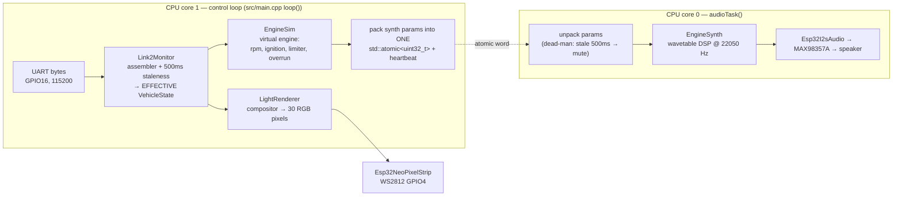

# 07 — Sound + Light Firmware Architecture (`w17-soundlight-fw`)

Board #2 turns board #1's 14-byte status frames into a living V10 soundtrack and F1
light show — and protects itself when those frames stop coming. It commands nothing;
it can only *perform*.

## 1. The pipeline

**[C]** Structure per `w17-soundlight-fw/CLAUDE.md` (module map + cross-core rule),
`README.md`, and `src/main.cpp` (includes, `audioTask`, atomics — verified by skim).

## 2. `Link2Monitor` — trust, but with an expiry date

The protocol is one-way: if the wire is cut, board #2 would otherwise keep performing
the last state forever. So the monitor wraps the frame assembler and answers two
questions every tick: *what did board #1 last say?* and *is that still believable?*

- **`LinkStatus`**: `NeverConnected` (nothing valid ever arrived — e.g. board #1 still
  booting) / `Up` / `Lost` (was up; silent ≥ 500 ms). The lights want this distinction
  as a first-class signal. **[C]** `lib/link2monitor/Link2Monitor.hpp`.
- **Per-field staleness projection** — the design decision worth studying. When the link
  is not `Up`, `state()` returns a *projected* state, not the last frame verbatim:

| Field class | On staleness | Reasoning [C, header comment] |
|---|---|---|
| Commands (throttle, steering, braking, drsOpen, armed, ersDeploying) | zeroed / cleared, `failsafe` forced **true** | a stale command must not drive anything |
| Motion telemetry (rpm) | zeroed | stale motion would keep sound/lights "moving" |
| Qualified judgments (lowBattery) and slow facts (batteryMv, gear, ersPercent, driveMode) | hold last value | board #1 already qualified them; blanking would flicker the display |

## 3. `EngineSim` — the imaginary engine

The car has a quiet brushless motor; the *drama* is synthesized. `EngineSim` maintains a
believable engine state from the effective `VehicleState`, **[C]** all constants from
`lib/enginesim/EngineSim.hpp`:

- **Ignition state machine:** `Off` (disarmed → silence) → `Cranking` (armed edge → 600 ms
  starter whir at 1800 rpm) → `Running`. Failsafe (effective `armed == false`) drops back
  to `Off` — so link loss *sounds like* the engine dying, which is exactly the right
  user feedback.
- **RPM with asymmetric inertia:** engine rpm chases a target derived from throttle
  between idle 3500 and redline 15,000 rpm, closing the gap faster on rev-up (~0.5 s
  idle→max) than rev-down (~1.2 s) — engines spin up harder than they brake.
- **Character details:** idle wobble (±120 rpm triangle so idle isn't sterile),
  gear-shift blips (rpm dips 1400 on upshift / blips up on downshift for 130 ms),
  rev limiter detection (within 250 rpm of redline at full throttle → the F1 "buzz"
  flag), and an overrun-crackle window (900 ms of pop-and-bang eligibility after a fast
  lift from high rpm).

Note the scale trick: **wheel** rpm from the car maxes ~5000, but *engine* rpm is
simulated 3500–15,000 — the range was chosen so the fundamental frequency lands where a
tiny speaker can actually reproduce it. **[C]** soundlight `CLAUDE.md` (soundsynth
bullet).

## 4. `EngineSynth` — the DSP (concepts only here)

`EngineSynth` renders audio samples: a stack of harmonic partials at the engine's
*firing frequency* (5 firings per revolution ⇒ V10 flavor), per-revolution amplitude
modulation (the "lumpy" idle), throttle-correlated noise from a **seeded LFSR**
(deterministic pseudo-random — same seed, same "random" noise, so tests can assert exact
output), a pitch-tracking ERS whine layer gated by `ersDeploying`, and parameter
smoothing so values glide instead of clicking. All integer math. Behind
`ISampleSource`, so a future PCM sample player could replace synthesis without touching
anything above. **[C]** `CLAUDE.md` module map + `lib/soundsynth/` headers.

## 5. `LightRenderer` — the compositor

Pure function: state → 30 RGB values, layered like image compositing, **[C]** soundlight
`CLAUDE.md` + `README.md`:

1. base/halo (teal when armed),
2. brake bar (from the pre-filtered `braking` flag),
3. turn indicators (swept from `steeringPercent`),
4. F1 **rain light** — flashes while ERS is *harvesting* (the real F1 2026-era cue),
5. low-battery pulse,
6. **failsafe hazard: all-amber blink overriding everything** (also shown for
   `NeverConnected`),
then a gamma lookup (perceptual brightness correction) and a brightness cap whose power
budget is enforced in the config's `valid()` (~43% — keeps worst-case all-amber inside
the UBEC's current headroom).

## 6. The dual-core design — why and how

Audio is unforgiving: 22,050 samples/second, every ~11 ms buffer must be ready or the
speaker pops. LED writes and frame parsing have their own timing quirks. The solution:
**core 0 does nothing but audio; core 1 does everything else.**

The entire shared surface between the cores (the "cross-core rule," **[C]** soundlight
`CLAUDE.md`, verbatim rule):

- one packed `std::atomic<uint32_t>` — the synth parameters (rpm, throttle, flags
  bit-packed into 32 bits), written by core 1, read by core 0;
- one heartbeat atomic.

Nothing else crosses. Synth phase state lives only in the audio task; `VehicleState`,
`EngineSim`, lights live only on core 1. Why one atomic word instead of a struct: a
32-bit atomic is indivisible on this hardware — the audio task can never observe
half-updated parameters (no locks needed, and locks are dangerous next to real-time
audio anyway).

**The dead-man switch:** if the heartbeat shows core 1 hasn't refreshed params for
~500 ms (a wedged control loop), the audio task ramps volume to zero — "a wedged control
loop must not leave the engine screaming." **[C]** `CLAUDE.md`. Count the failsafe
layers protecting the speaker alone: link staleness (monitor) → ignition Off on disarm
(enginesim) → cross-core dead-man (audio task).

## 7. Build variants + the bench demo

| Env | Purpose |
|---|---|
| `esp32dev` | real firmware (waits for board #1's frames) |
| `esp32dev_sim` | `-DW17_SIM_LINK2_FEEDER`: `SimLink2Feeder` scripts a 14 s drive — idle → revs/gears → ERS deploy → brake+harvest (rain light) → cornering (indicators) → **1 s dropout → local failsafe demo** → recovery. **[C]** `docs/SIMULATION.md` |
| `native` | 40 unit tests, incl. a full frames→audio integration test |

Its `docs/SIMULATION.md` also carries the board's bench checklist (I2S sanity on the
pinned driver version, MAX98357A straps, WS2812 fixes, "does the synth actually read as
engine on the real speaker," LED power budget).

## Confirmed vs inferred

**Confirmed [C]:** module responsibilities, all numeric constants (§3), the staleness
table (§2), the cross-core rule and dead-man (§6) — from the headers read
(`Link2Monitor.hpp`, `EngineSim.hpp`, `Link2Frame.hpp`) and the repo's CLAUDE.md/README/
SIMULATION.md.

**Inferred [I]:** the *why* narratives (audio real-time pressure, lock avoidance,
"sounds like the engine dying" as intended feedback) — standard reasoning consistent
with, but stated beyond, the docs. Exact bit layout of the packed param word awaits the
code deep-dive.

**Assumed [A]:** that synthesis quality is acceptable on the physical speaker — the
repo itself flags this as a bench question with the PCM fallback ready
(`docs/SIMULATION.md` checklist).

## Questions to check your understanding

1. The link2 wire is cut mid-drive. List what the speaker and the LEDs each do, and
   name the module + threshold responsible.
2. Why does `Link2Monitor` keep `gear` and `batteryMv` on staleness but zero `rpm`?
   What would look wrong if it were the other way round?
3. Board #1 says wheel rpm is 3200. Why doesn't the synth just make a 3200-rpm sound?
   Trace how engine rpm is actually determined.
4. Why is the noise generator *seeded* (deterministic) rather than truly random? Which
   file benefits most from that choice?
5. Explain why the synth parameters cross cores as ONE `std::atomic<uint32_t>` rather
   than four separate atomic fields. What specific artifact does this prevent?
6. Three separate mechanisms can silence the engine. Order them by how quickly they
   react to: (a) driver flips arm off, (b) board #1 hangs but UART keeps DMA-ing old
   bytes… wait — can (b) even happen on this design? Why not?
