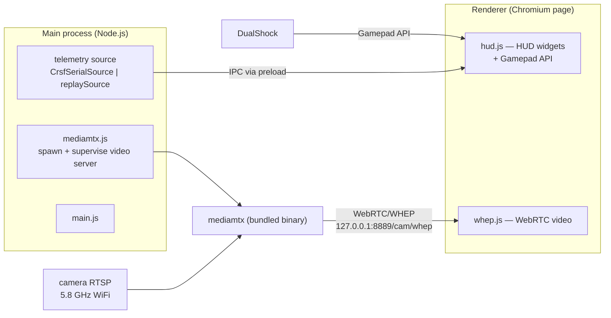

# 08 — Ground Station Architecture (`w17-ground-station`)

The laptop app: live FPV video under a Mercedes-style F1 HUD, with real car telemetry
overlaid when available. Written in JavaScript on Electron — a different world from the
firmware, so this chapter starts with the platform.

> **Deep dive:** the repo's shared pure core (the CRSF decoder port, telemetry model,
> link-state model, and the cross-repo golden fixture) is explained line-by-line in
> `code_explained/ground_station/01_shared_pure_core.md` (batch G1, with a
> JS-for-C++-readers primer); the Electron main process, mediamtx supervisor, and both
> telemetry sources in `02_main_process_and_telemetry_sources.md` (batch G2 — this
> chapter's §1/§2/§4/§6 in code form). Remaining batches G3–G5b:
> `source_code_explanation_plan.md`.

## 1. Electron in five minutes

**Electron** packages a web app with its own private Chromium browser and a Node.js
runtime, producing a desktop app. Two kinds of process:

- **Main process** (`main/main.js`) — Node.js. Can do "computer things": open windows,
  spawn child processes, read serial ports. No visible UI of its own.
- **Renderer process** (`renderer/index.html` + `hud.js`…) — a Chromium page. Draws
  everything you see; sandboxed away from the computer.
- **Preload** (`main/preload.cjs`) — a small bridge script that exposes a *chosen,
  narrow* API from main to renderer (security practice: the page can't demand arbitrary
  file/serial access; it gets only what preload publishes).
- **IPC** (inter-process communication) — how main pushes messages (here: telemetry
  snapshots) to the renderer.

**[C]** Layout/roles: `README.md` layout table; endpoint: `docs/SETUP.md` §3.

## 2. The video pipeline

Chain: **camera → RTSP → mediamtx → WebRTC/WHEP → the page's `<video>` element.**

- **RTSP** is the classic IP-camera streaming protocol; the OpenIPC camera serves it.
  Ordinary players (VLC) can open it directly, but with seconds of buffering latency.
- **WebRTC** is the browser-native real-time video stack (designed for video calls) —
  the low-latency way to show video in a Chromium page. **WHEP** is the simple
  HTTP-based handshake standard for *receiving* a WebRTC stream (`renderer/whep.js` is
  the client).
- **mediamtx** is a single-binary media server that ingests RTSP and re-serves it as
  WebRTC. It's downloaded (pinned v1.9.3) by `scripts/fetch-mediamtx.js`, configured by
  `mediamtx/mediamtx.yml` (the camera's real RTSP URL goes into `paths.cam.source` — a
  bench task), and supervised as a child process by `main/mediamtx.js`.

**The #1 risk (bench-gated):** Chromium's WebRTC generally **cannot decode H.265**
video, and the OpenIPC camera commonly defaults to H.265. Fixes in order of preference:
set the camera to H.264, else transcode with ffmpeg. VLC *can* decode H.265 — so the
zero-code fallback survives regardless. **[C]** `docs/SETUP.md` §1.

## 3. The HUD: three data sources, one display

`renderer/hud.js` draws the F1 dashboard (design lineage: the
`w17-control-fw/docs/f1_hud.html` mockup). Its widgets are fed by a *precedence* of
sources:

1. **Gamepad mirror (always available):** the browser Gamepad API reads the same
   DualShock that elrs-joystick-control uses; throttle/brake/steering/DRS/boost/
   overtake/gear are mirrored instantly. This is *display of your inputs*, not car truth.
2. **Local simulation:** speed/rpm/ERS are animated from the gamepad inputs using the
   shared feel constants (`shared/feelConstants.js`) so the dash looks alive with no car.
3. **Real telemetry (when connected):** fields present in the latest `Telemetry`
   snapshot replace their simulated counterparts. Link state is *derived on the ground*
   from link quality + staleness (`shared/linkState.mjs`, audit fix F2 closing risk R01 —
   the why and the history are chapter 12 §4/§6) into four states:
   **sim** — no source has *ever* been live → "Telemetry: sim", gamepad simulation;
   **live** — fresh telemetry, LQ > 0; **LINK LOST** — fresh telemetry but `linkQualityPct == 0`
   (the ground TX still reports link stats after the radio to the car drops); **TELEMETRY LOST**
   — a *previously-live* source went silent > 1 s → the last real values are held **dimmed**, and
   the HUD deliberately does **not** silently resume simulated numbers. (`armed`/`failsafe` are
   demo-only fields the car never transmits.) **[C]** `docs/TELEMETRY.md` "HUD link states".

Why send gear/ERS from the car at all when the HUD could mirror them? Because two
independent computations drift — a dropped shift edge desyncs the displayed gear from
the car's real gear forever. Car-authoritative values are ground truth; speed isn't
inferable on the ground at all. **[C]** TELEMETRY.md "Why gear/ERS are sent, not
mirrored."

## 4. The telemetry path (and the one hard problem)

Data path: control board builds CRSF frames (battery 0x08 @ ~5 Hz, GPS 0x02 carrying
wheel speed, FLIGHTMODE 0x21 carrying `"G3 M2 E55"`) → RP1 → ELRS radio downlink →
ground TX module → appears on the FT232's serial port. Link quality (0x14) is generated
by the TX module itself — no firmware needed. **[C]** TELEMETRY.md.

On the app side: `main/CrsfSerialSource.js` opens the port
(`W17_TELEMETRY_SOURCE=crsf-serial W17_TELEMETRY_PORT=COMx`), runs bytes through
`shared/crsfAssembler.js`, decodes with `shared/crsf.js` — a **faithful JS port of the
firmware's decoder**, pinned by the same golden byte vectors in both repos' tests — and
**merges** each frame's fields into one running snapshot (a battery frame must not blank
the speed shown from an earlier GPS frame).

**The hard problem:** on Windows a COM port is exclusive-open, and
**elrs-joystick-control must hold that port to drive the car**. Resolutions, in
preference order (**[C]** TELEMETRY.md): (1) elrs-joystick-control forwards telemetry
(verify whether it can); (2) a **com0com/hub4com** virtual splitter mirrors the physical
port to two virtual ones; (3) our app owns the port — explicitly rejected, as it would
reverse the viewer-only safety property.

## 5. Viewer-only: the safety architecture of the ground side

The app **never transmits**: it does not open the control path, and reads the gamepad
only to draw it. Drive control belongs entirely to elrs-joystick-control. Rationale
(**[C]** README): a crash/bug/freeze in a hand-built HUD app on gift day must have
zero ability to stop the car. The fallback chain is graded:

| Level | Video | Control | Needs |
|---|---|---|---|
| Full | ground station (WebRTC) | elrs-joystick-control | H.264 confirmed, mediamtx up |
| Fallback | **VLC on the raw RTSP** (survives H.265) | elrs-joystick-control | nothing from this repo |
| Bench/backup | — | TX16S handset (same bind phrase) | no PC at all |

## 6. Developer conveniences worth knowing

**[C]** README Troubleshooting + `package.json`:

- `npm run demo` — full HUD with `shared/replaySource.js` fake telemetry; no car, no
  camera needed. Your main learning tool for this repo.
- `npm start` / `npm run demo` go through `scripts/run.js`, which strips the
  `ELECTRON_RUN_AS_NODE` env var that VS Code's integrated terminal leaks (classic
  Electron-in-Electron gotcha; without it the app boots as bare Node and crashes).
- `npm run setup` repairs a blocked Electron postinstall and fetches mediamtx.
- `serialport` is an *optional* dependency and a native module (needs
  `npx electron-rebuild` to match Electron's ABI); if missing, the app still runs — the
  HUD simply stays gamepad-simulated.
- `npm run build` → Windows .exe via electron-builder; unsigned by default
  (SmartScreen will prompt once; `docs/CODESIGNING.md` covers opt-in signing).

## 7. The optional iPhone bridge (added 2026-07-08 — validation pending)

Since this chapter was first written, the repo gained an **off-by-default** iPhone
bridge (work items W1–W3): **W2** streams the normalized telemetry snapshot plus a
read-only display mirror of the HUD's gamepad/camera state to the companion iPhone HUD
as UDP/JSON on port 5601 — **send-only**, a second consumer of the existing telemetry
flow; **W3** receives the iPhone's head-tracking intent packets on UDP 5602 —
**strictly LOG-ONLY**: packets are validated, counted, and summarized to the console,
and *nothing else happens* (no CRSF, no servos, no camera pan/tilt — that mapping is
blocked until a separate safety milestone). Both are dormant unless enabled by env vars
(`W17_IPHONE_BRIDGE`, `W17_HEADTRACK`). **[C]** README + `main/main.js` +
`test/noControlPath.test.js` (structural guards that the bridge opens no control path).

Two honesty gates apply until further notice (**[C]** `open_questions.md` #58,
`../CURRENT_STATUS.md`): the bridge is **implemented + unit-tested (118/118 vitest),
NOT real-device validated** — no end-to-end run against a real iPhone has happened; and
the manual's own iPhone-bridge chapter is deliberately deferred. Line-by-line coverage
is planned as batches **G5a/G5b** (`source_code_explanation_plan.md`); the packet
contract's implementation copy is `docs/windows_bridge_contract.md` (canonical copy
lives in the Codex-owned `iPhone_rc` repo).

## Confirmed vs inferred

**Confirmed [C]:** roles of every file (README layout table), the telemetry contract
and frame mapping (TELEMETRY.md), the codec risk and fallbacks (SETUP.md), the
viewer-only rationale (README), run-script behaviors (README + package.json).

**Inferred [I]:** the Electron-anatomy explanation (§1) is platform knowledge applied
to this repo's structure *(since confirmed against the code by G2, 2026-07-09: the
main/renderer/preload/IPC roles are exactly as described, and the preload surface is
exactly three functions — G2 §2–§3)*; the precedence description in §3 says "HUD
prefers telemetry over its mirror when live," which ROADMAP B2.8 confirms in passing
("HUD needed no change — it already prefers telemetry"), but the exact widget-by-widget
precedence awaits the code pass (G2 settled the input half: each IPC push is a complete
merged snapshot, `CrsfSerialSource`'s accumulator; the renderer half is G3 — open
question #47).

**Assumed [A]:** everything that touches real hardware is bench-pending: the camera's
actual codec, the actual RTSP URL, whether elrs-joystick-control can forward telemetry,
WHEP behavior with the real stream. These are precisely SETUP.md's checklist items.

## Questions to check your understanding

1. Why do throttle and steering appear on the HUD instantly even with the car switched
   off — and why is that *not* a safety problem?
2. The HUD shows gear 3 but the car is in gear 2. Under the final design, how did the
   project make this class of bug impossible? What was the alternative and why was it
   rejected?
3. Walk a battery voltage reading from the ADC pin on ESP32 #1 to pixels on the HUD.
   Count the protocol conversions.
4. Why can't the ground station simply open COM5 alongside elrs-joystick-control on
   Windows? Name the two acceptable resolutions and the rejected one.
5. If the camera turns out to be H.265-only and unconvertible, exactly which parts of
   gift day degrade, and which don't?
6. Why does `shared/crsf.js` exist as a *port* of the firmware decoder instead of the
   project sharing one implementation — and what testing strategy keeps the two from
   drifting? (Think: different languages.)
