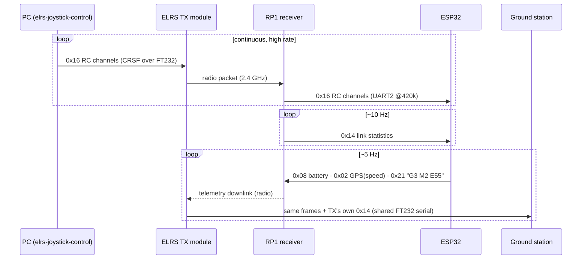

# 09 — Communication Protocols

Byte-level understanding of the three protocol families in the project: **CRSF** (radio
control + telemetry), **link2** (board #1 → board #2), and how they're kept honest
(CRCs, golden tests, staleness rules).

> Deep dives (`code_explained/`): the CRSF code line-by-line is C3+C4, link2 (sender side)
> is C8, and the telemetry senders' wiring/cadence is C10 §4.7. The link2 **receiver side**
> (board #2's copy of the codec + the `Link2Monitor` staleness watchdog) is
> `soundlight_fw/01_link2_receiver_and_protocol_compatibility.md` (S1), which also
> diff-verifies the two repos' link2 against each other. The ground-side JS decoder is
> `ground_station/01_shared_pure_core.md` (G1); how its output becomes HUD pixels
> (widget precedence + the four link states rendered) is `03_renderer_hud_and_whep.md`
> (G3).

## 0. Protocol concepts in 90 seconds

A serial link (UART) delivers a *stream of bytes* with no boundaries. A protocol adds:

- **Framing** — marking where a message starts/ends (here: a fixed start byte + a
  length byte).
- **Integrity** — detecting corrupted bytes (here: CRC-8, a checksum where each message
  produces a 1-byte fingerprint; a receiver recomputes it and rejects mismatches).
- **Semantics** — what each payload byte means, including **endianness**: the order of
  bytes in multi-byte numbers. Little-endian = low byte first (link2); big-endian = high
  byte first (CRSF telemetry payloads). Both appear in this project — always check.
- **Liveness** — detecting a *silent* link (staleness timeouts). A checksum can't help
  when nothing arrives at all.

Both protocol families here use the **same CRC-8**: polynomial 0xD5 ("CRC-8/DVB-S2"),
initial value 0, MSB-first — deliberately, so board #2 could lift the code wholesale,
with a test cross-checking the two implementations. **[C]** `docs/link2_protocol.md`;
`lib/crsf/CrsfFrame.hpp` (`kCrc8Poly = 0xD5`).

## 1. CRSF — the RC world's serial protocol

CRSF ("Crossfire") is the de-facto standard serial protocol between RC receivers and
flight controllers; ExpressLRS speaks it on both ends of the radio. In this project it
appears in **four places**: PC→TX module, RP1→ESP32 #1 (control in), ESP32 #1→RP1
(telemetry out), TX module→PC (telemetry to the HUD).

### 1.1 Frame layout

```
[sync 0xC8] [length] [type] [payload …] [crc8]
             └ counts type + payload + crc
                              crc8 covers [type + payload] only
```

**[C]** `lib/crsf/CrsfFrame.hpp` header comment. Physical layer: **420,000 baud, 8N1,
not inverted** (`kCrsfBaud`).

### 1.2 RC_CHANNELS_PACKED (type 0x16) — the control frame

16 channels × 11 bits = 176 bits = **22 bytes** of payload; total frame 26 bytes. Each
channel is a value 172…1811, center 992 (a quirky legacy scale: 172 ↔ −100%,
992 ↔ 0%, 1811 ↔ +100%). Eleven bits per channel means channel boundaries *do not
align to bytes* — decoding is a rolling bit-shift exercise, which is exactly why
`decodeRcChannels` is a pure function pounded by canned-byte tests. Sent continuously at
the ELRS packet rate (tens to hundreds of Hz) whether or not sticks move.

### 1.3 LINK_STATISTICS (type 0x14) — link health

10-byte payload of RSSI/LQ/SNR etc. (`crsf::CrsfLinkStatistics`). The two fields this
project acts on: **`uplinkLinkQuality`** (0–100%; ELRS forces **0** in a burst when the
receiver declares link loss — the trigger for the latched RX-failsafe flag, chapter 06
§2.1) — and, on the ground, the same field becomes the HUD's LQ gauge, read from the TX
module's own stats frames. Interleaved with RC frames ~10 Hz.

### 1.4 Telemetry frames the car sends (up the same wire, then over the air)

**[C]** `lib/crsf/CrsfFrame.hpp` + `w17-ground-station/docs/TELEMETRY.md`. All payloads
**big-endian** (unlike link2!):

| Type | Name | Payload | Carries |
|---|---|---|---|
| 0x08 | BATTERY | 8 B: voltage (0.1 V units, u16), current, capacity, remaining % | pack voltage + rough % |
| 0x02 | GPS | 15 B; only `groundspeed` (0.1 km/h, offset 8–9) is real | **wheel speed** (lat/lon/etc. zero) |
| 0x21 | FLIGHTMODE | NUL-terminated ASCII ≤16 B: `"G3 M2 E55"` | gear, drive mode, ERS% |

Why these odd vessels? ELRS only *relays standard telemetry frame types* — you can't
send arbitrary data. So wheel speed rides in a GPS frame's groundspeed field, and
gear/mode/ERS ride in a human-readable status string that both ends parse. **[C]**
TELEMETRY.md "Why standard frames, not MSP."

### 1.5 Sequence view



## 2. link2 — the project's own protocol

One-way UART, ESP32 #1 GPIO25 → ESP32 #2 GPIO16, **115200 8N1**, nominal **20 Hz**.
Spec: `w17-control-fw/docs/link2_protocol.md` (owner); constants:
`lib/link2/Link2Frame.hpp`.

### 2.1 Frame layout (14 bytes total)

```
offset 0   : start byte 0xA5
offset 1   : length = payload byte count (11 in v1)
offset 2-12: payload (below)
offset 13  : crc8 (poly 0xD5) over bytes [1..12] — length + payload, start excluded
```

Validation order is normative: **start → length → CRC → version**. Because CRC is
checked *before* version, a `BadVersion` result proves the frame was well-formed — i.e.
it came from a newer sender, not from corruption. And a receiver must reject an
unsupported length byte *the moment it arrives* — otherwise a corrupted length (say
0xFF) would make it buffer 255 garbage bytes, swallowing ~1 s of good frames.

### 2.2 Payload v1 (little-endian)

| off | field | type/range | semantics worth remembering |
|---|---|---|---|
| 0 | version | =1 | reject others |
| 1 | throttlePercent | int8 −100…100 | **what the ESC is actually commanded** — 0 in disarm/failsafe; negative = braking, never reverse |
| 2 | steeringPercent | int8 −100…100 | for indicators; live even disarmed |
| 3 | flags | bitfield | bit0 braking (pre-filtered), bit1 reverse (reserved 0), bit2 drsOpen, bit3 armed, bit4 failsafe, bit5 lowBattery, bit6 ersDeploying, bit7 reserved (mask, don't reject) |
| 4 | gear | 1-based 1…4 | display gear (matches the firmware gearbox numGears=4) |
| 5–6 | rpm | uint16 LE | **wheel** rpm (≤ ~5000), not engine rpm |
| 7–8 | batteryMv | uint16 LE | display garnish; the lowBattery *flag* is the authoritative judgment |
| 9 | ersPercent | 0…100 | frozen (not zeroed) outside ERS mode |
| 10 | driveMode | 0/1/2 | TRAINING / RACE (gearbox) / ERS (gearbox+ERS); unknown → treat as 1 |

### 2.3 The golden frame, decoded by hand

**[C]** pinned byte-for-byte by `test_golden_frame_bytes`
(`w17-control-fw/test/test_link2/test_main.cpp`) and the spec's worked example:

```
A5 0B 01 2A E7 4C 03 DC 05 DC 1E 3C 02 CE
│  │  │  │  │  │  │  │───│ │───│ │  │  └ CRC8 = 0xCE
│  │  │  │  │  │  │  rpm    batt │  └ driveMode 2 (ERS)
│  │  │  │  │  │  │  =0x05DC     └ ersPercent 0x3C = 60
│  │  │  │  │  │  │  =1500  =0x1EDC = 7900 mV     ← little-endian: DC 05 → 0x05DC!
│  │  │  │  │  │  └ gear 3
│  │  │  │  │  └ flags 0x4C = 01001100 = drsOpen|armed|ersDeploying
│  │  │  │  └ steering 0xE7 = −25  (int8: 0xE7 = 231 → 231−256 = −25)
│  │  │  └ throttle 0x2A = +42
│  │  └ version 1
│  └ length 0x0B = 11
└ start
```

Work through this once yourself — it exercises every §0 concept (framing, endianness,
two's-complement signed bytes, bitfields, CRC coverage).

### 2.4 Liveness: the mandatory 500 ms rule

Frames come at 20 Hz; **no CRC-valid frame for 500 ms (10 missed) ⇒ the receiver enters
local failsafe** (engine silent, hazard lights). This rule is written into the spec as a
receiver *obligation* because on a one-way link, a cut wire is indistinguishable from
"last state persists forever." Implemented by `Link2Monitor` (chapter 07 §2; line-by-line
in S1). **[C]** S1 verified this in code: the boundary is `elapsed >= 500 ms` (inclusive),
only CRC-valid frames refresh the timer (a corrupt-only stream still goes stale), and on
loss the monitor applies a *per-field projection* — commands zeroed + failsafe forced true,
rpm zeroed, but battery/gear/ERS/mode held last-known. **[C]** S5 verified the obligation's
*wiring* (`soundlight_fw/05_soundlight_main_integration.md` §4.10): board #2's `loop()`
drains the UART into the monitor on **every pass** and calls `poll(millis())` at 50 Hz, so
a silent wire is declared Lost within ~20 ms of the 500 ms boundary; the composed
consequence (engine to exact digital silence + hazard) is natively test-executed in
`test_integration`. The physical wire itself (GPIO25→GPIO16, common ground) stays bench.

## 3. The reliability strategy across all protocols

| Layer | CRSF in | link2 | CRSF telemetry |
|---|---|---|---|
| Corruption | CRC8 0xD5, bad frames rejected | same | same (checked by ground decoder) |
| Silence | failsafe FSM 500 ms + latched LQ=0 flag | 500 ms → local failsafe | HUD shows TELEMETRY LOST after 1 s, holding last real values dimmed (never silently resumes simulation — audit F2, ch08 §3; the pre-F2 behavior *was* a silent sim fallback) |
| Version skew | fixed frame types | explicit version byte, checked after CRC | fixed standard types |
| Implementation drift | — | lib copied verbatim + cross-CRC test | **golden vectors asserted in both repos** (firmware `test_build_*_frame*` ↔ ground vitest) |

The golden-vector idea deserves emphasis: the *same literal bytes* are hardcoded as
expected values in the C++ tests (sender side) and the JavaScript tests (receiver side).
Any change that alters the wire format breaks a test on whichever side wasn't updated.
**[C]** TELEMETRY.md last paragraph; ROADMAP B2 item 5/8.

## Confirmed vs inferred

**Confirmed [C]:** all frame layouts, constants, ranges, orders, and rules cite
`CrsfFrame.hpp`, `Link2Frame.hpp`, `link2_protocol.md`, and TELEMETRY.md — including
the worked example (verbatim from the spec, which is test-pinned).

**Inferred [I]:** rate figures given as "tens to hundreds of Hz" for ELRS RC frames
(depends on the configured packet rate — D8 Phase 2 characterizes it on the bench);
the pedagogical framing of §0.

**Assumed [A]:** the ~10 Hz stats cadence and LQ=0 burst behavior are ELRS
expectations that D8 Phase 2 explicitly plans to verify ("Characterize link loss").

## Questions to check your understanding

1. In the golden frame, bytes 7–8 are `DC 05`. Why does that decode to 1500 and not
   56,325? Which protocol in this project would decode the same bytes the other way?
2. The link2 CRC covers length + payload but *not* the start byte. The CRSF CRC covers
   type + payload but *not* sync or length. What is a start/sync byte for, if not
   integrity?
3. Why must a link2 receiver reject a bad length byte immediately instead of buffering
   `length` bytes and letting the CRC catch the problem?
4. Steering percent arrives as byte 0xE7. Show the arithmetic that makes it −25.
5. Why can't the car just send "speed=12.3;gear=3" as a custom telemetry string over
   ELRS? What constraint forced the GPS-frame trick, and where does the gear actually
   travel?
6. Describe how the golden-vector strategy would catch this bug: someone reorders
   `ersPercent` and `driveMode` in the firmware's encoder but only updates the firmware
   test.
