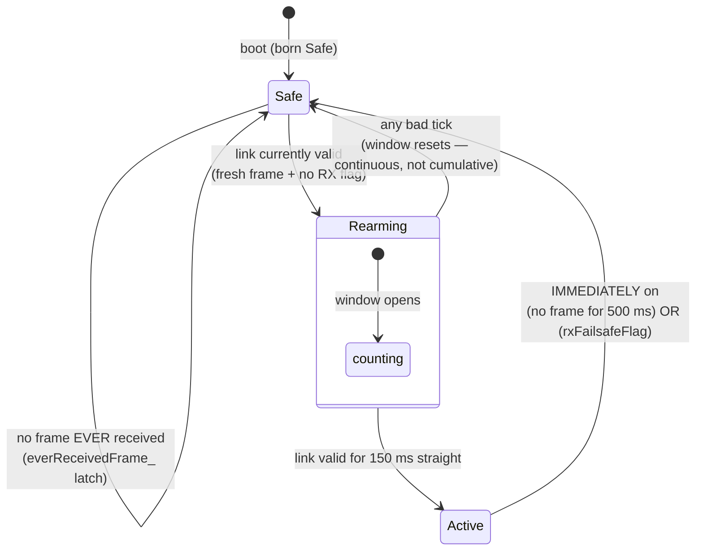

# 10 — Algorithms, State Machines & Timing

The interesting logic, explained properly. Everything here is pure code you can run on
your laptop via the test suites.

## 1. The failsafe state machine (`lib/failsafe/FailsafeStateMachine`)

The safety heart. Inputs each tick: `nowMs`, `frameArrivedThisTick`, `rxFailsafeFlag`.
Output: `Safe` or `Active`. Config: `linkTimeoutMs = 500`, `rearmConfirmMs = 150`. **[C]**
all from `FailsafeStateMachine.hpp`.

Design decisions worth absorbing:

1. **Asymmetric transitions.** Entering Safe is instant (safety direction — no
   debounce); returning to Active needs 150 ms of *continuously* good link (any single
   bad tick restarts the window), so a marginal link can't chatter the car on/off.
2. **The `everReceivedFrame_` latch (bug A1's fix).** Before the first-ever valid frame,
   the link is *unconditionally* invalid — timestamps alone can never make it look
   healthy. Without this, `lastFrameMs_ = 0` at boot made the first 500 ms look "fresh"
   and the machine went Active on garbage, slamming steering to full lock (ROADMAP A1).
   The general lesson: **absence of evidence must never satisfy a safety check.**
3. **Two independent triggers.** Frame timeout catches a *dead* link; `rxFailsafeFlag`
   (the latched LQ=0 from chapter 06 §2.1) catches a *lying* link — a receiver
   misconfigured to keep sending hold-position frames during signal loss (finding A8).

## 2. The ArmGate (`lib/channels/ArmGate`)

Rule (**[C]** `ArmGate.hpp`, implementing `CLAUDE.md` §6.2): **armed ⇔ arm switch ON ∧
throttle observed inside ±60 (of ±1000) since the gate last disarmed.** Update order
each tick: (1) switch off or `forceDisarm` (= failsafe Safe) ⇒ clear the neutral-seen
latch, disarmed; (2) else latch neutral if |throttle| ≤ 60; (3) armed = latch.

Consequences, both deliberate:

- Flipping arm ON with the stick held high does nothing until the stick centers once
  ("no arm-into-full-throttle").
- After *any* failsafe episode, re-arming requires fresh neutral — so a link recovery
  mid-panic-grip cannot snap the motor to the stick's current position (closes
  finding A3).

Note the layering: the failsafe FSM decides *link* health; the ArmGate decides *driver
intent*; `EscOutput`'s 2 s boot hold satisfies the *ESC's* own arming; and board #2 has
its own staleness failsafe. Four gates, each guarding a different failure class.

## 3. The virtual gearbox (`lib/gearbox`)

`shapeThrottle(throttle, gear)` for forward throttle (braking passes through unshaped):

1. **Expo curve** — blends linear with cubic: `out = x·(1−e) + x³·e` (integer-exact,
   endpoints preserved), where e = `expoPercent`. Softens small stick inputs without
   sacrificing the top end.
2. **Scale to the gear's cap** — multiply by `maxOutput/1000`. **Scaling, not
   clipping**: full stick travel maps onto the gear's whole range. Clipping would make
   gear 1 feel like "full throttle at 40% stick, then a dead zone" — scaling makes it
   "the whole stick is a gentler engine." **[C]** header comment.

Default table (**[C]** `Gearbox.hpp`): gear 1 {400, 50%}, gear 2 {600, 35%},
gear 3 {800, 20%}, gear 4 {1000, 0%} — gentle+curvy low gear to linear full-power top.
`valid()` enforces monotonically non-decreasing caps at compile time.

Worked example, half stick (500) in gear 1 (cap 400, expo 50%):
`shaped = 500·0.5 + 500³/1000²·0.5 = 250 + 62.5 = 312.5` → `×0.4` → **125 of 1000** —
half stick in first gear commands 12.5% throttle. Same stick in gear 4: **500**.

Statefulness: `shiftUp/shiftDown` saturate (no wraparound), and **gear survives
failsafe/disarm** — resetting it on a link blip would silently change car behavior;
the fresh-neutral rule already covers the re-arm surprise (header comment).

## 4. The ERS energy system (`lib/ers/ErsSystem`)

An F1-flavored energy store, all integer math. **[C]** all constants from
`ErsSystem.hpp`.

- **Store**: 0…1,000,000 **micro-permille** (starts full). Why so fine-grained: per-tick
  change is `rate_permille_per_sec × dt_ms`, which is *exact* in these units with no
  division — even the slowest rate (coast harvest 60‰/s over a 20 ms tick = 1200 µ‰)
  loses nothing to truncation.
- **Deploy**: boost (+18% output, drains 260‰/s) or overtake (+25%, drains 400‰/s;
  overtake wins if both held). Deploy requires *positive commanded throttle* — boost is
  a multiplier, so burning energy at zero throttle would waste it for nothing; and
  `applyBoost(0) == 0` is a test-pinned invariant (boost can never bypass the arm gate).
- **Harvest**: braking 110‰/s, coasting (|throttle| ≤ 100 while moving) 60‰/s — both
  **gated on wheel rpm > 0**: a parked car never creeps energy, but regen while rolling
  to a stop works.
- **Freeze semantics**: outside ERS mode (or in failsafe) the store *freezes* (not
  zeroes) and the internal clock re-seeds continuously, so reactivation never sees a
  dt gap; a boost switch held through a failsafe episode can neither drain energy nor
  report "deploying."
- **Stall guard**: dt clamped to 100 ms — one late tick can't dump seconds of charge.
- In top gear (cap already 1000) boost does nothing — deliberate F1 flavor: ERS punches
  out of corners in low gears; DRS is the top-speed tool (header comment).

The rates match the HUD mockup's animation constants (deploy 26%/s, harvest 11%/s,
boost ×1.18 — `docs/f1_hud.html`, mirrored in `shared/feelConstants.js`), so the
simulated dash and the real car *feel* the same.

## 5. Sensor conditioning (`lib/telemetry`)

**BatteryMonitor** — three defenses between ADC and "LOW BATTERY": **[C]** ROADMAP D5.

1. **EMA** (exponential moving average — each new sample nudges a running average)
   implemented with a scaled integer accumulator, *seeded from the first sample* so boot
   doesn't average up from zero through the warning zone (a boot false-alarm bug killed
   in design).
2. **Sustained qualification**: warn only after 3 s continuously below 7.0 V — a
   throttle-stab voltage sag isn't a low battery.
3. **Hysteresis latch**: once warned, clears only above 7.4 V — no flicker around the
   threshold. Monitoring only; never cuts power (`CLAUDE.md` §6.4).

**WheelSpeed** — rpm from ISR-timestamped pulse *periods*: **[C]** ROADMAP D5.

- Period-based, not count-based: counting pulses per 20 ms tick at ≤ ~55 Hz pulse rates
  would yield 0-or-1 counts — quantized, flapping speed. Measuring the time between
  edges gives smooth rpm at any speed.
- Plausibility clamp: > 5000 rpm ⇒ EMI, discard (chapter 03 §10).
- Silence handling: between pulses the report is capped by `60000/elapsedMs` (can't
  claim more speed than the silence allows), with a hard zero after 1.5 s — a graceful
  rolldown instead of a stuck last value.
- ISR side: 2 ms lockout (≈9× margin over the fastest legitimate pulse) absorbs bounce.

## 6. The sound board's state machines (recap pointers)

Chapter 07 covers them in context: `Link2Monitor`'s
NeverConnected→Up→Lost with per-field staleness projection; `EngineSim`'s
Off→Cranking(600 ms)→Running ignition with asymmetric rpm inertia, blips, limiter and
overrun windows; the audio dead-man (params stale ~500 ms ⇒ volume ramp to 0).

## 7. Timing architecture — the patterns that tie it together

1. **Caller-supplied time everywhere.** No module reads a clock; `update(nowMs, …)` is
   the universal signature (chapter 04 §10). Tests fabricate time; timeouts are tested
   in microseconds of real runtime.
2. **Fixed cadences, one loop** (chapter 06 §4): drain-always → 50 Hz control → 20 Hz
   link2 → ~5 Hz telemetry. Event-driven where events matter (decode + shift edges per
   *frame*, not per tick — a per-tick check would re-fire one button press dozens of
   times; caught in design review, ROADMAP D3).
3. **dt clamps on integrators** (`ErsSystem::kMaxDtMs = 100`): anything that
   accumulates `rate × dt` must bound dt, or one hiccup becomes a physics glitch.
4. **Staleness thresholds ~10× the update period**: link2 500 ms @ 20 Hz; CRSF 500 ms
   at ELRS rates; HUD 1 s at ~5 Hz telemetry. Missing one or two frames is weather;
   missing ten is a dead link. **[I]** — the ratio is my observation; each individual
   threshold is documented.
5. **Wraparound accepted knowingly**: `millis()` wraps at 49.7 days; irrelevant for RC
   sessions (ROADMAP A10 — noted, accepted, commented).

## Confirmed vs inferred

**Confirmed [C]:** every constant and rule in §1–§5 comes from the module headers (read
in full: failsafe, ArmGate, Gearbox, ErsSystem) or ROADMAP D-entries as cited; the state
diagram transitions restate the failsafe header's documented behavior.

**Inferred [I]:** the worked gearbox arithmetic (§3) applies the header's documented
formula — exact rounding behavior in integer code may differ by ±1 until the
line-by-line pass; the "four gates, four failure classes" framing (§2) and the 10×
staleness observation (§7.4) are my syntheses.

**Assumed [A]:** none — this chapter is entirely about laptop-verifiable logic.

## Questions to check your understanding

1. Why is dropping into Safe instant but climbing to Active debounced by 150 ms? What
   bad behavior appears if you reverse the asymmetry?
2. The rearm window is "continuous, not cumulative." Construct a link pattern that a
   cumulative counter would (wrongly) accept.
3. Half stick in gear 2 (cap 600, expo 35%): compute the shaped output. Then explain in
   feel terms why scale-not-clip means "gear 2 at full stick" ≠ "gear 4 at 60% stick"
   even though both command 600.
4. Why does ERS harvest require wheel rpm > 0, and what silly exploit does it prevent
   on a workbench?
5. The battery reads 7.3 V. Is the low-battery warning on? (Careful — the answer is
   "depends." On what?)
6. Why does `WheelSpeed` measure pulse periods instead of counting pulses per tick?
   What would the speedometer look like at low speed with the counting design?
7. Find the three places in this chapter where a value is deliberately *frozen or
   latched* rather than reset, and give the one-line safety reason for each.
