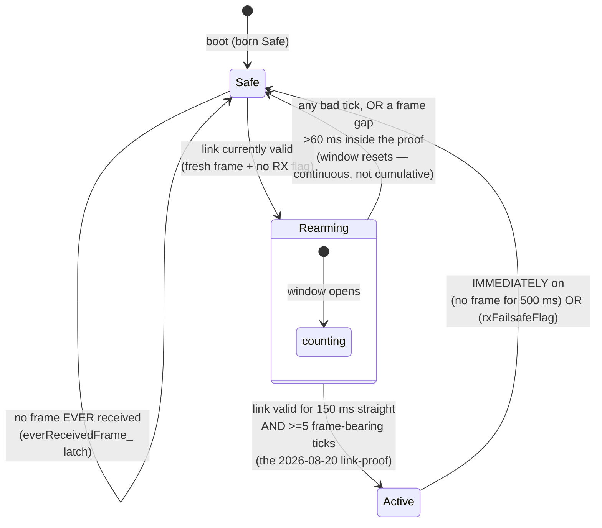

# 10 — Algorithms, State Machines & Timing

The interesting logic, explained properly. Everything here is pure code you can run on
your laptop via the test suites.

> Deep dives (`code_explained/control_fw/`): failsafe → C1, ArmGate/decoder → C5,
> gearbox+ERS → C6, sensor conditioning → C7; how the loop wires and schedules them all
> → C10.

## 1. The failsafe state machine (`lib/failsafe/FailsafeStateMachine`)

The safety heart. Inputs each tick: `nowMs`, `frameArrivedThisTick`, `rxFailsafeFlag`.
Output: `Safe` or `Active`. Config: `linkTimeoutMs = 500`, `rearmConfirmMs = 150`. **[C]**
all from `FailsafeStateMachine.hpp`.

```mermaid
stateDiagram-v2
  [*] --> Safe : boot (born Safe)
  Safe --> Safe : no frame EVER received<br/>(everReceivedFrame_ latch)
  Safe --> Rearming : link currently valid<br/>(fresh frame + no RX flag)
  state Rearming {
    [*] --> counting : window opens
  }
  Rearming --> Safe : any bad tick, OR a frame gap<br/>>60 ms inside the proof<br/>(window resets — continuous, not cumulative)
  Rearming --> Active : link valid for 150 ms straight<br/>AND >=5 frame-bearing ticks<br/>(the 2026-08-20 link-proof)
  Active --> Safe : IMMEDIATELY on<br/>(no frame for 500 ms) OR (rxFailsafeFlag)
```

Design decisions worth absorbing:

1. **Asymmetric transitions.** Entering Safe is instant (safety direction — no
   debounce); returning to Active needs 150 ms of *continuously* good link (any single
   bad tick restarts the window), so a marginal link can't chatter the car on/off.
2. **The `everReceivedFrame_` latch (bug A1's fix).** Before the first-ever valid frame,
   the link is *unconditionally* invalid — timestamps alone can never make it look
   healthy. Without this, `lastFrameMs_ = 0` at boot made the first 500 ms look "fresh"
   and the machine went Active on garbage, slamming steering to full lock (ROADMAP A1).
   The general lesson: **absence of evidence must never satisfy a safety check.**
3. **Two independent triggers.** Frame timeout catches a *dead* link; `rxFailsafeFlag`
   (the latched LQ=0 from chapter 06 §2.1) catches a *lying* link — a receiver
   misconfigured to keep sending hold-position frames during signal loss (finding A8).
4. **The link-proof requirement, added 2026-08-20 — the timestamp alone used to be
   enough.** Before this hardening, one CRC-valid frame timestamped the link "fresh"
   for the *entire* 150 ms confirm window, and the FSM would then sit `Active` on that
   stale timestamp until `linkTimeoutMs` (500 ms) finally elapsed — so a single garbage
   frame that happened to pass CRC8 (1-in-256 odds per candidate frame), followed by
   total silence, could still produce **~350 ms** (500 − 150) of `Active` with no real
   link behind it. Leaving `Safe` now additionally requires a **proof built from actual
   arrivals**, gated only on the *entry* to `Active` (every path *into* `Safe` —
   timeout, RX flag, the never-received latch — is untouched, so loss detection is
   exactly as fast as before): **≥5 update() ticks that each saw a valid frame**
   (`rearmMinFrameTicks`), inside the same confirm window, **with no gap between
   consecutive valid frames wider than 60 ms** (`rearmMaxFrameGapMs`) — a wider gap
   discards the count and the proof restarts from the next real frame. At the 50 Hz
   control tick and this repo's assumed link cadence (50–250 Hz CRSF), a healthy link
   makes essentially every tick a frame tick, so 150 ms offers 8–9 chances and 5
   leaves margin for jitter while one lone frame (count 1) can never satisfy it; 60 ms
   is 3 tick periods (a healthy link's observed gaps run 20–40 ms) and, by
   construction (`Config::valid()`), always no greater than the confirm window and
   strictly less than the loss timeout (`rearmMaxFrameGapMs <= rearmConfirmMs` and
   `< linkTimeoutMs` — the strict bound is only against the timeout). **[C]**
   `FailsafeStateMachine.hpp:9-63` (the header's own comment block explains the
   reasoning nearly verbatim, including the ~350 ms figure at line 24); verified live
   in `src/main.cpp` and `CLAUDE.md`'s "Leaving Safe requires a LINK PROOF" line.

### 1a. The gimbal's own failsafe behavior — decay-to-center, not hold-last

A separate, smaller failsafe concern this chapter used to skip: what do the
stick-driven pan/tilt gimbal axes (ch9/ch10, source-agnostic — never the iPhone) do
*while* the FSM above is `Safe`? **Vision decision 11 (2026-08-16), merged 2026-08-17,
now live on `main`:** they **decay to center** instead of holding whatever direction
they last pointed — the previously shipped behavior. `failsafe::GimbalDecay`, one
instance per axis, implements the pure slew (**[C]**
`lib/failsafe/include/failsafe/GimbalDecay.hpp`; wired in `src/main.cpp` alongside
`panDecay`/`tiltDecay`):

- **Link OK, not slewing:** transparent passthrough — normal stick aiming is *not*
  rate-limited; outside a failsafe episode the gimbal behaves exactly as if this
  module didn't exist.
- **Failsafe engaged:** the output walks from wherever it was toward center (0) at a
  configured rate, then holds center. The live stick command is ignored while
  engaged (redundant with `main.cpp` already freezing `controls` during an outage,
  by design).
- **Failsafe releases:** the output walks toward the *live* stick command at the same
  rate rather than snapping to it — even if the stick moved during the outage — then
  passthrough resumes.
- **Rate:** default `fullToCenterMs = 2000` (full deflection to center in 2 s — a
  visible glide, never a snap; floor 100 ms, ceiling 20 s), persisted in the Settings
  v2 blob and bench-tunable as `gimbal.decay` on the console (chapter 06 §2.8).

This closes what was watch item W3 in the 2026-08-17 staleness report (then still on
an unmerged branch). One structural note the decay module's own header calls out:
**it only shapes pan/tilt** — steering, throttle, and DRS failsafe semantics are
untouched by this class, by design and test-pinned.

## 2. The ArmGate (`lib/channels/ArmGate`)

Base rule (**[C]** `ArmGate.hpp`, implementing `CLAUDE.md` §6.2): **armed ⇔ arm switch ON
∧ throttle observed inside ±60 (of ±1000) since the gate last disarmed.** Update order
each tick: (1) switch off or `forceDisarm` (= failsafe Safe) ⇒ clear the neutral-seen
latch, disarmed; (2) else latch neutral if |throttle| ≤ 60; (3) armed = latch.

**The 2026-08-20 re-arm invariant — a second, stronger latch on top of the base rule.**
The base rule alone still had a gap the owner closed the same day: after a failsafe
episode ends, "throttle back to neutral" was the *only* thing standing between a
still-taped-on arm switch and a live motor. `ArmGate` now carries a second latch,
`switchToggleRequired_`, set on *any* tick where `forceDisarm && armSwitchOn` (a
failsafe episode caught the switch on), and cleared **only** by observing the switch go
OFF. While the latch holds, the gate stays disarmed regardless of throttle — so:

- Recovery + neutral stick + switch-still-on **never** re-arms. The driver must be seen
  flipping the switch OFF (clearing the latch) and back ON (plus fresh neutral, the base
  rule) — one deliberate two-step ritual, not a passive "wait for the stick to settle."
- The latch is **level-driven**, so an OFF→ON toggle completed entirely *during* the
  outage doesn't count: the ON tick is still `forceDisarm` (still Safe) and re-latches
  itself. The arming edge must land on a tick the FSM already reports proven-Safe — the
  fail-closed direction, always.
- Booting with the switch already ON is treated exactly like a caught episode (the FSM
  boots `Safe`, so the very first decoded switch-on tick sets the latch): first arm after
  power-up always demands one deliberate OFF→ON toggle. Booting with the switch OFF (the
  normal case) never sets the latch, so the very first arm is unchanged.

Consequences of the base rule, both still true and both still deliberate:

- Flipping arm ON with the stick held high does nothing until the stick centers once
  ("no arm-into-full-throttle").
- Even *without* a failsafe episode, any disarm (switch off) clears the neutral-seen
  latch — so a link recovery mid-panic-grip cannot snap the motor to the stick's current
  position (closes finding A3).

Note the layering: the failsafe FSM decides *link* health; the ArmGate decides *driver
intent* (now via two latches, not one); `EscOutput`'s 2 s boot hold satisfies the *ESC's*
own arming; and board #2 has its own staleness failsafe. Four gates, each guarding a
different failure class. **[C]** `lib/channels/src/ArmGate.cpp:13-38`,
`lib/channels/include/channels/ArmGate.hpp` (header contract, quoted above nearly
verbatim — it is unusually explicit about its own edge cases).

## 3. The virtual gearbox (`lib/gearbox`)

`shapeThrottle(throttle, gear)` for forward throttle (braking passes through unshaped):

1. **Expo curve** — blends linear with cubic: `out = x·(1−e) + x³·e` (integer-exact,
   endpoints preserved), where e = `expoPercent`. Softens small stick inputs without
   sacrificing the top end.
2. **Scale to the gear's cap** — multiply by `maxOutput/1000`. **Scaling, not
   clipping**: full stick travel maps onto the gear's whole range. Clipping would make
   gear 1 feel like "full throttle at 40% stick, then a dead zone" — scaling makes it
   "the whole stick is a gentler engine." **[C]** header comment.

Default table (**[C]** `Gearbox.hpp`): gear 1 {400, 50%}, gear 2 {600, 35%},
gear 3 {800, 20%}, gear 4 {1000, 0%} — gentle+curvy low gear to linear full-power top.
`valid()` enforces monotonically non-decreasing caps at compile time.

Worked example, half stick (500) in gear 1 (cap 400, expo 50%):
`shaped = 500·0.5 + 500³/1000²·0.5 = 250 + 62.5 = 312.5` → `×0.4` → **125 of 1000** —
half stick in first gear commands 12.5% throttle. Same stick in gear 4: **500**.

Statefulness: `shiftUp/shiftDown` saturate (no wraparound), and **gear survives
failsafe/disarm** — resetting it on a link blip would silently change car behavior;
the fresh-neutral rule already covers the re-arm surprise (header comment).

## 4. The ERS energy system (`lib/ers/ErsSystem`)

An F1-flavored energy store, all integer math. **[C]** all constants from
`ErsSystem.hpp`.

- **Store**: 0…1,000,000 **micro-permille** (starts full). Why so fine-grained: per-tick
  change is `rate_permille_per_sec × dt_ms`, which is *exact* in these units with no
  division — even the slowest rate (coast harvest 60‰/s over a 20 ms tick = 1200 µ‰)
  loses nothing to truncation.
- **Deploy**: boost (+18% output, drains 260‰/s) or overtake (+25%, drains 400‰/s;
  overtake wins if both held). Deploy requires *positive commanded throttle* — boost is
  a multiplier, so burning energy at zero throttle would waste it for nothing; and
  `applyBoost(0) == 0` is a test-pinned invariant (boost can never bypass the arm gate).
- **Harvest**: braking 110‰/s, coasting (|throttle| ≤ 100 while moving) 60‰/s — both
  **gated on wheel rpm > 0**: a parked car never creeps energy, but regen while rolling
  to a stop works.
- **Freeze semantics**: outside ERS mode (or in failsafe) the store *freezes* (not
  zeroes) and the internal clock re-seeds continuously, so reactivation never sees a
  dt gap; a boost switch held through a failsafe episode can neither drain energy nor
  report "deploying."
- **Stall guard**: dt clamped to 100 ms — one late tick can't dump seconds of charge.
- In top gear (cap already 1000) boost does nothing — deliberate F1 flavor: ERS punches
  out of corners in low gears; DRS is the top-speed tool (header comment).

The rates match the HUD mockup's animation constants (deploy 26%/s, harvest 11%/s,
boost ×1.18 — `docs/f1_hud.html`, mirrored in `shared/feelConstants.js`), so the
simulated dash and the real car *feel* the same.

## 5. Sensor conditioning (`lib/telemetry`)

**BatteryMonitor** — three defenses between ADC and "LOW BATTERY": **[C]** ROADMAP D5.

1. **EMA** (exponential moving average — each new sample nudges a running average)
   implemented with a scaled integer accumulator, *seeded from the first sample* so boot
   doesn't average up from zero through the warning zone (a boot false-alarm bug killed
   in design).
2. **Sustained qualification**: warn only after 3 s continuously below 7.0 V — a
   throttle-stab voltage sag isn't a low battery.
3. **Hysteresis latch**: once warned, clears only above 7.4 V — no flicker around the
   threshold. Monitoring only; never cuts power (`CLAUDE.md` §6.4).

**WheelSpeed** — rpm from ISR-timestamped pulse *periods*: **[C]** ROADMAP D5.

- Period-based, not count-based: counting pulses per 20 ms tick at ≤ ~55 Hz pulse rates
  would yield 0-or-1 counts — quantized, flapping speed. Measuring the time between
  edges gives smooth rpm at any speed.
- Plausibility clamp: > 5000 rpm ⇒ EMI, discard (chapter 03 §10).
- Silence handling: between pulses the report is capped by `60000/elapsedMs` (can't
  claim more speed than the silence allows), with a hard zero after 1.5 s — a graceful
  rolldown instead of a stuck last value.
- ISR side: 2 ms lockout (≈9× margin over the fastest legitimate pulse) absorbs bounce.

## 6. The sound board's state machines (recap pointers)

Chapter 07 covers them in context: `Link2Monitor`'s
NeverConnected→Up→Lost with per-field staleness projection; `EngineSim`'s
Off→Cranking(600 ms)→Running ignition with asymmetric rpm inertia, blips, limiter and
overrun windows; the audio dead-man (params stale > 500 ms ⇒ forced `volume = 0` —
note silence on board #2 is always *volume* 0, not rpm 0; rpm 0 alone does not silence
the synth). Honest scope: the dead-man branch lives in soundlight's `main.cpp`, which
no test build compiles, so it has **never executed anywhere** — a priority bench check
(open question #57; chapter 07 §6).

## 7. Timing architecture — the patterns that tie it together

1. **Caller-supplied time everywhere.** No module reads a clock; `update(nowMs, …)` is
   the universal signature (chapter 04 §10). Tests fabricate time; timeouts are tested
   in microseconds of real runtime.
2. **Fixed cadences, one loop** (chapter 06 §4): drain-always → 50 Hz control → 20 Hz
   link2 → ~5 Hz telemetry. Event-driven where events matter (decode + shift edges per
   *frame*, not per tick — a per-tick check would re-fire one button press dozens of
   times; caught in design review, ROADMAP D3).
3. **dt clamps on integrators** (`ErsSystem::kMaxDtMs = 100`): anything that
   accumulates `rate × dt` must bound dt, or one hiccup becomes a physics glitch.
4. **Staleness thresholds ~10× the update period**: link2 500 ms @ 20 Hz; CRSF 500 ms
   at ELRS rates; HUD 1 s at ~5 Hz telemetry. Missing one or two frames is weather;
   missing ten is a dead link. **[I]** — the ratio is my observation; each individual
   threshold is documented.
5. **Wraparound accepted knowingly**: `millis()` wraps at 49.7 days; irrelevant for RC
   sessions (ROADMAP A10 — noted, accepted, commented).

## Confirmed vs inferred

**Confirmed [C]:** every constant and rule in §1–§5 comes from the module headers (read
in full: failsafe, ArmGate, Gearbox, ErsSystem) or ROADMAP D-entries as cited; the state
diagram transitions restate the failsafe header's documented behavior.

**Inferred [I]:** the worked gearbox arithmetic (§3) applies the header's documented
formula — the C6 deep dive re-derived the integer math line-by-line and confirmed the
§3 example **exact** (125; no ±1 drift — open question #44 closed); the "four gates,
four failure classes" framing (§2) and the 10× staleness observation (§7.4) are my
syntheses.

**Assumed [A]:** none — this chapter is entirely about laptop-verifiable logic.

## Questions to check your understanding

1. Why is dropping into Safe instant but climbing to Active debounced by 150 ms? What
   bad behavior appears if you reverse the asymmetry?
2. The rearm window is "continuous, not cumulative." Construct a link pattern that a
   cumulative counter would (wrongly) accept.
3. Half stick in gear 2 (cap 600, expo 35%): compute the shaped output. Then explain in
   feel terms why scale-not-clip means "gear 2 at full stick" ≠ "gear 4 at 60% stick"
   even though both command 600.
4. Why does ERS harvest require wheel rpm > 0, and what silly exploit does it prevent
   on a workbench?
5. The battery reads 7.3 V. Is the low-battery warning on? (Careful — the answer is
   "depends." On what?)
6. Why does `WheelSpeed` measure pulse periods instead of counting pulses per tick?
   What would the speedometer look like at low speed with the counting design?
7. Find the three places in this chapter where a value is deliberately *frozen or
   latched* rather than reset, and give the one-line safety reason for each.
