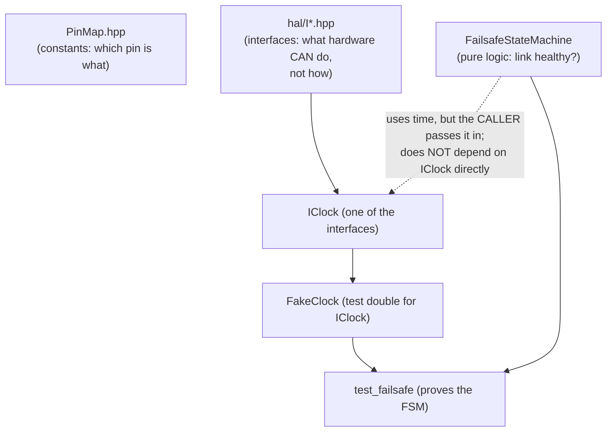

# C1 — Foundations: Pins, HAL Seams, Failsafe

**Batch C1 of the source-code campaign** (see `../../source_code_explanation_plan.md`).
This is the anchor batch: the smallest real-logic module in the project, plus the two
scaffolding patterns (the pin map and the hardware-abstraction interfaces) that every
later batch reuses.

## Scope (files explained here)

| File | Lines | What it is |
|---|---|---|
| `lib/config/include/config/PinMap.hpp` | 38 | Every GPIO pin number, in one place |
| `lib/hal/include/hal/IClock.hpp` | 17 | Interface: "something that can tell the time" |
| `lib/hal/include/hal/IPwmOutput.hpp` | 18 | Interface: "something that can emit a servo pulse" |
| `lib/hal/include/hal/IByteSink.hpp` | 19 | Interface: "somewhere to write bytes" |
| `lib/hal/include/hal/ICharIO.hpp` | 19 | Interface: console character in/out |
| `lib/hal/include/hal/IVoltageSensor.hpp` | 20 | Interface: read calibrated millivolts |
| `lib/hal/include/hal/IWheelPulseSensor.hpp` | 28 | Interface + a small data struct: read wheel pulses |
| `lib/hal/include/hal/ISettingsStore.hpp` | 25 | Interface: load/save a blob to flash |
| `lib/hal/library.json` (+ comparison of all 19) | 7 | PlatformIO library metadata |
| `lib/failsafe/include/failsafe/FailsafeStateMachine.hpp` | 68 | The safety state machine — declaration |
| `lib/failsafe/src/FailsafeStateMachine.cpp` | 42 | The safety state machine — implementation |
| `test/mocks/FakeClock.hpp` | 17 | A fake `IClock` for tests |
| `test/test_failsafe/test_main.cpp` | 119 | The failsafe unit tests |

**Prerequisites:** manual chapter 04 (Embedded C++ Basics) and chapter 10 §1 (the
failsafe state machine at architecture level). This batch re-derives every C++ construct
those chapters previewed, from the actual bytes on disk.

**Test status: RUN AND PASSING.** I executed `pio test -e native -f test_failsafe` on
2026-07-03 — 8 test cases, all `[PASSED]` in 1.6 s. So the behaviors below marked
**VERIFIED** are not just "read from the code," they are confirmed by a real run on your
machine.

---

## 0. How these files fit together

Three of the four things in this batch are *scaffolding*; one is *logic*.



The subtle point you'll confirm below: the failsafe machine needs "the current time,"
but it does **not** hold an `IClock`. It takes the time as a plain function argument.
`IClock`/`FakeClock` are in this batch because they're the simplest possible example of
the interface pattern and because `main.cpp` (batch C10) uses an `IClock` to feed that
argument. Keep the distinction in mind — it's a recurring design choice.

---

## 1. `lib/config/include/config/PinMap.hpp`

The gentlest file in the project. Every line is either a comment or a named constant.
Here it is, walked top to bottom.

### Lines 1–3: the file preamble

```cpp
#pragma once

#include <cstdint>
```

- **`#pragma once`** — a *preprocessor directive* (the `#` marks it). The preprocessor
  is a text-substitution pass that runs before the real C++ compiler. `#pragma once`
  means: "if this file gets `#include`d more than once during a build, only paste it in
  the first time." Without it, including the same header twice would define `kCrsfUartRxPin`
  twice and the compiler would error on the duplicate. Every header in this project
  starts with this line. **VERIFIED** (present, line 1).
- **`#include <cstdint>`** — pastes in the standard-library header that defines the
  fixed-width integer types (`uint8_t`, `uint32_t`, …). The angle brackets `<...>` mean
  "a system/standard header" as opposed to quotes `"..."` which mean "a file from this
  project." This file needs `<cstdint>` because it uses `uint8_t` below. **VERIFIED.**

### Lines 5–8: the doc comment

```cpp
// All GPIO assignments for ESP32 #1 "control", transcribed from CLAUDE.md
// section 1 (pin map). Keep every pin here so the map is trivial to change
// in one place. Pins marked "deferred" are declared now but not yet wired
// into src/main.cpp.
```

- **`//`** starts a comment — everything to the end of the line is ignored by the
  compiler; it's for humans. This one states the file's *design purpose*: a **single
  source of truth** for pin numbers. If a wire moves, you change one line here rather
  than hunting through the codebase. This directly implements the CLAUDE.md §1
  instruction "Keep pins in one config header." **VERIFIED** (comment + the file's
  structure); the "trivial to change in one place" claim is the rationale, **INFERRED**
  but self-evidently true given the structure.

### Lines 10, 38: the namespace wrapper

```cpp
namespace pinmap {
...
} // namespace pinmap
```

- **`namespace pinmap { ... }`** puts every name defined inside into a labelled scope.
  Elsewhere you refer to these constants as `pinmap::kSteeringServoPin` (the `::` is the
  scope-resolution operator, read "pinmap's kSteeringServoPin"). This prevents name
  collisions — some other module could have its own `kSteeringServoPin` and they won't
  clash. The closing `}` repeats the name in a comment purely as a readability aid (so a
  reader scrolling to the bottom knows which namespace just closed). **VERIFIED.**

### Lines 12–36: the pin constants

Every entry has the same shape. Take line 13 as the specimen:

```cpp
// CRSF in, from RadioMaster RP1 TX pad. UART2 RX. 420000 baud, 8N1, NOT inverted.
inline constexpr uint8_t kCrsfUartRxPin = 16;
```

Reading the declaration right to left / piece by piece:

- **`uint8_t`** — an *unsigned 8-bit integer*: a whole number 0…255. GPIO numbers are
  small and never negative, so 8 bits is plenty. Using a fixed-width type (rather than
  plain `int`) is a project-wide habit (chapter 04 §2). **VERIFIED.**
- **`kCrsfUartRxPin`** — the name. The **`k`** prefix is this project's convention for a
  compile-time constant (you'll see it everywhere). The rest is descriptive.
- **`= 16`** — the value: GPIO 16.
- **`constexpr`** — "this value is known at *compile time*." It's not computed while the
  car runs; the compiler bakes `16` directly into the machine code wherever the name is
  used. A `constexpr` is automatically read-only.
- **`inline`** — a technical necessity for `constexpr` variables defined in a header
  that's included by multiple `.cpp` files: `inline` tells the linker "all these
  copies are the same one variable, don't complain about duplicates." You can treat
  "`inline constexpr` in a header" as the standard idiom for "a shared compile-time
  constant." **VERIFIED.**

The comment on each line records **what the pin is for and the electrical facts** that
the number alone can't carry: pin 16 is UART2's receive line, taking CRSF from the RP1
receiver at 420000 baud, 8N1, non-inverted. Those facts are cross-checked in manual
chapter 03 (electronics) and chapter 09 (CRSF).

The full set (each an `inline constexpr uint8_t`), grouped as the file groups them:

| Constant | Pin | Role (from the comment) |
|---|---|---|
| `kCrsfUartRxPin` | 16 | CRSF in from RP1 (UART2 RX), 420000 8N1 non-inverted |
| `kCrsfUartTxPin` | 17 | CRSF telemetry out to RP1 (UART2 TX) |
| `kBoard2UartTxPin` | 25 | link2 TX → ESP32 #2 (UART1, remapped) |
| `kBoard2UartRxPin` | 26 | link2 RX ← ESP32 #2 (optional ack) |
| `kSteeringServoPin` | 13 | Steering servo, LEDC 50 Hz, centre 1500 µs |
| `kEscThrottlePin` | 14 | ESC throttle, LEDC 50 Hz, neutral 1500 µs, boot-arm |
| `kDrsServoPin` | 18 | DRS servo (2-position) |
| `kGimbalPanPin` | 19 | Gimbal pan — right stick X via ch9 |
| `kGimbalTiltPin` | 23 | Gimbal tilt — right stick Y via ch10 |
| `kBatterySenseAdcPin` | 34 | Battery divider, ADC1_CH6, input-only, 11 dB |
| `kWheelSpeedHallPin` | 35 | Hall sensor, input-only, external 10 k pull-up, rising-edge ISR |

Two things worth noticing as *facts about the code*, not just the table:

1. **These are only numbers.** `PinMap.hpp` declares *which* pin does *what*, but it
   contains no logic — nothing here reads or writes a pin. The actual reading/writing
   lives in the `*_hal_esp32` files (later batches), which `#include` this map. So a
   pin-number typo shows up as "wrong wire," never as a logic bug. **VERIFIED** (the
   file has no executable statements).
2. **The comments encode the wiring contract.** "input-only" on 34/35 is an ESP32
   hardware fact (those pins can't be outputs and have no internal pull-up resistor —
   chapter 03 §5); that's *why* the Hall sensor needs an *external* 10 k pull-up. The
   pin map is where firmware and the wiring atlas meet. **VERIFIED** (comment);
   the hardware reason is standard ESP32 knowledge, **INFERRED** into the explanation.

> **Cross-reference — open questions.** The gimbal pins (19/23) and the board-2 RX (26)
> are declared here but, per the file's own header comment, some pins are "declared now
> but not yet wired into `src/main.cpp`." `open_questions.md` #33 tracks GPIO26 (the
> reserved ack line — the link2 spec says "do not connect anything to it yet"). We'll
> confirm exactly which of these eleven pins `main.cpp` actually attaches when we reach
> batch C10.

---

## 2. Interlude — `library.json` (and all 19 of them)

Before the interfaces, the one-time explanation of the little `library.json` that sits
in every `lib/<module>/` folder. Here is `lib/hal/library.json` in full:

```json
{
  "name": "hal",
  "version": "0.1.0",
  "description": "Hardware-abstraction interfaces shared by pure-logic libs (no implementation, no Arduino dependency).",
  "frameworks": "*",
  "platforms": "*"
}
```

- This is **JSON**, not C++ — a data format of `"key": value` pairs inside `{ }`. The
  build tool (PlatformIO) reads it; the compiler never sees it.
- **`name`** — the library's name. This is what other libraries list when they depend on
  it, and it's the folder PlatformIO looks for.
- **`version`** — semantic version, all `0.1.0` here (the project doesn't version its
  internal libs meaningfully; they move together). **INFERRED** (all identical).
- **`description`** — human text.
- **`frameworks: "*"`** and **`platforms: "*"`** — the important pair for a *pure* lib:
  `"*"` means "any framework, any platform." That's what makes `hal` compilable in the
  `native` (laptop) test build **and** the `esp32dev` build. A pure-logic library must
  be buildable everywhere, because the tests run on your laptop. **VERIFIED.**

### Why this file matters: the pure-vs-HAL split is visible in JSON

I scanned all 19 `library.json` files. They fall into exactly two shapes, and the shape
tells you instantly whether a library is pure logic or hardware-bound:

| Shape | `frameworks` / `platforms` | Which libraries | Meaning |
|---|---|---|---|
| **Pure** | `"*"` / `"*"` | config, hal, crsf, channels, failsafe, gearbox, ers, outputs, telemetry, link2, settings, console | Builds anywhere, incl. the laptop test env |
| **HAL** | `"arduino"` / `"espressif32"` | crsf_hal_esp32, outputs_hal_esp32, telemetry_hal_esp32, link2_hal_esp32, settings_hal_esp32 | Builds **only** for the ESP32 — touches chip/Arduino APIs |

A secondary difference is a `"dependencies"` block: libraries that use another lib
declare it. From the scan:

- **Pure libs with dependencies:** `channels`, `outputs`, `link2`, `telemetry`,
  `settings`, `console` (each depends on `hal`, and some on `config`/`crsf` — we'll see
  exactly which as we reach them).
- **Pure libs with none:** `config`, `hal`, `crsf`, `ers`, `failsafe`, `gearbox` — these
  depend on nothing but the C++ standard library. That `failsafe` has no dependencies is
  the concrete reason it's the *first* thing we explain: nothing has to be understood
  first. **VERIFIED** (the scan; `lib/failsafe/library.json` has no `dependencies` key).
- **HAL libs** all list `dependencies` (they wrap a pure lib's interface with a real
  implementation).

So: `library.json` is not glamorous, but reading its five lines tells you a library's
*entire external contract* — pure or chip-bound, and what it leans on. We won't quote
the other 18 individually; this table is their explanation. (The `settings_hal_esp32`
one has no `dependencies` key in the scan, which is mildly surprising for a HAL lib;
noted for batch C9 to check against its actual `#include`s.) **VERIFIED** table;
the C9 note is a flagged **PROVISIONAL** curiosity.

---

## 3. The HAL interfaces — `lib/hal/include/hal/*.hpp`

Seven tiny files, one job each. They are the *seams* between pure logic and hardware
(manual chapter 02 §1, chapter 04 §9). I'll explain `IClock` fully because it introduces
the interface syntax, then move faster through the rest since the shape repeats.

### 3.1 `IClock.hpp` — the specimen interface

```cpp
#pragma once

#include <cstdint>

namespace hal {

// Abstract monotonic millisecond clock. Injected wherever logic needs "now"
// (failsafe timing, ESC boot-arm hold) so it can be driven by a fake clock in
// native tests instead of calling millis() directly.
class IClock {
public:
    virtual ~IClock() = default;

    virtual uint32_t nowMs() const = 0;
};

} // namespace hal
```

Line by line for the new constructs:

- **`namespace hal`** — all seven interfaces live in the `hal` namespace, so they're
  referred to as `hal::IClock`, `hal::IPwmOutput`, etc.
- **`class IClock {`** — declares a *class*. The **`I`** prefix is the project's naming
  convention for an *interface* (a class that is pure promise, no implementation).
- **`public:`** — everything after this label is accessible from outside the class.
  (Classes default to *private*; interfaces are all-public because their whole point is
  to be called by others.) **VERIFIED.**
- **`virtual ~IClock() = default;`** — the *destructor*. A destructor runs when an
  object is destroyed; `~IClock` is its fixed name (tilde + class name). Two keywords:
  - **`virtual`** makes it a *virtual function* — one where the *actual object's*
    version runs, decided at runtime, even when you're holding it through a base-class
    pointer. For a destructor this is essential: if you ever `delete` a `FakeClock`
    through an `IClock*` pointer, `virtual` guarantees `FakeClock`'s cleanup runs too.
    A base class with any virtual functions **must** have a virtual destructor; forgetting
    it is a classic C++ bug. Treat "`virtual ~IName() = default;`" as mandatory
    interface boilerplate.
  - **`= default`** tells the compiler "generate the ordinary do-nothing version for
    me." (There's nothing to clean up in an interface.)
- **`virtual uint32_t nowMs() const = 0;`** — *the* method, the actual promise:
  - **`virtual ... = 0`** — the `= 0` makes it a **pure virtual function**: declared,
    but with *no body*. A class with even one pure virtual function is **abstract** —
    you cannot create an `IClock` object directly; you can only create a concrete class
    that *inherits from it and fills in the body*. This is exactly what forces
    `FakeClock` (and the real ESP32 clock) to provide `nowMs()`.
  - **`uint32_t nowMs()`** — returns an unsigned 32-bit millisecond count.
  - **`const`** (after the parentheses) — promises "calling this does not modify the
    object." Reading the time shouldn't change the clock.
- The comment states the *purpose of the seam*: logic calls `nowMs()`, and in tests a
  **fake clock** supplies scripted time instead of the real `millis()`. This is the
  mechanism behind chapter 04 §10's "caller-supplies-time" pattern. **VERIFIED.**

**What this file does NOT do:** it contains no clock. It's a shape. The word "monotonic"
in the comment is a *promise the implementations must keep* (time only goes forward),
not something enforced here. **VERIFIED** (no code); the promise is **PROVISIONAL** until
we read the ESP32 impl (a later batch) and confirm it uses `millis()`.

### 3.2 The other six interfaces (syntax now known — reading for design)

Each is the same skeleton (`#pragma once`, maybe `<cstdint>`/`<cstddef>`, `namespace hal`,
a `class` with a `virtual` destructor and one or two pure-virtual methods). I'll quote
only the method(s) and the design note.

**`IPwmOutput.hpp`** — "something that can emit a servo/ESC pulse":
```cpp
virtual void setPulseMicroseconds(uint16_t microseconds) = 0;
```
- **`void`** return type = "returns nothing." You command a pulse width; there's no
  answer to give back.
- **`uint16_t`** (0…65535) comfortably holds servo pulse widths (~500–2500 µs).
- The comment names both implementations: the ESP32 one maps this onto LEDC duty-cycle
  math, the test mock "just records the last call." That single sentence is the whole
  testability strategy: outputs assert *what microseconds were commanded* without any
  hardware. **VERIFIED.**

**`IByteSink.hpp`** — "somewhere to write a run of bytes" (used by link2 TX, batch C8):
```cpp
virtual void write(const uint8_t* data, size_t len) = 0;
```
New syntax:
- **`const uint8_t* data`** — a *pointer* to bytes. A pointer is a variable holding a
  memory address; `uint8_t*` means "address of some bytes." **`const`** here means "I
  won't modify the bytes you point me at" — a read-only borrow. This is the standard C++
  way to pass "an array of `len` bytes" without copying it.
- **`size_t len`** — `size_t` (from `<cstddef>`) is the unsigned type used for sizes and
  counts; `len` is how many bytes `data` points to.
- The comment is a small masterclass in *deliberate omission*: there is **no
  backpressure API** (no way to say "slow down, buffer full") because a 12-byte link2
  frame sent every 50 ms drains from the UART's 128-byte hardware buffer in ~1 ms, so a
  write can never block. The interface is kept minimal because the usage regime
  guarantees it's safe. **VERIFIED** (the reasoning is stated); the "~1 ms" timing is a
  design calculation, **INFERRED** by the author (plausible, bench-checkable).

**`ICharIO.hpp`** — console character I/O (UART0 in hardware; a scripted buffer in tests;
batch C9):
```cpp
virtual int read() = 0;              // next input byte, or -1 if none right now
virtual void write(const char* text) = 0;   // writes a NUL-terminated string
```
- **`int read()`** returns `int`, not `uint8_t`, on purpose: a byte is 0…255, but the
  function also needs to signal "nothing available," and it uses **-1** for that. A
  `uint8_t` can't hold -1 (it would wrap to 255, a valid byte), so `int` gives the extra
  room. This "return int so you can also return -1" idiom is standard in C-style I/O.
  **VERIFIED.**
- **`const char* text`** — a pointer to characters (`char`), i.e. a C string.
  **NUL-terminated** means the string ends at a hidden `'\0'` byte; the function reads
  until it hits that, so no length is passed. **VERIFIED.**
- The comment: "Non-blocking read so the console never stalls the control loop" — the
  same no-`delay()` discipline as the rest of the firmware (chapter 04 §11). **VERIFIED.**

**`IVoltageSensor.hpp`** — read calibrated millivolts (battery, batch C7):
```cpp
virtual uint16_t readPinMillivolts() = 0;
```
The comment is one of the most instructive in the codebase. It explains **where the seam
is deliberately placed**: the interface returns *already-calibrated millivolts at the ADC
pin*, not raw ADC counts. The ESP32's ADC has a non-linear response curve — a *chip*
property, handled *below* the seam by `analogReadMilliVolts`/`esp_adc_cal`. The 27k/10k
resistor divider is a *board* property, handled *above* the seam by `BatteryMonitor`.
"Chip quirks below the seam, board design above it." It even records that this deviates
from the ROADMAP's original "IAdc raw counts" sketch (finding recorded in ROADMAP D5,
manual chapter 05 §1.3). **VERIFIED** (comment states all of this).

**`IWheelPulseSensor.hpp`** — read wheel-speed pulses (batch C7). This one carries a
`struct`, so it introduces new syntax:
```cpp
struct WheelPulseSnapshot {
    uint32_t count;            // monotonically increasing edge count since boot
    uint32_t lastPeriodMicros; // micros between the two most recent edges; 0 until two edges seen
};

class IWheelPulseSensor {
public:
    virtual ~IWheelPulseSensor() = default;
    virtual WheelPulseSnapshot read() const = 0;
};
```
- **`struct WheelPulseSnapshot { ... };`** — a *struct* is a bundle of named fields
  (here two `uint32_t`s). It groups related data so `read()` can return *both* the pulse
  count and the latest pulse period in one value. (In C++ a `struct` is essentially a
  `class` whose members default to public; the project uses `struct` for plain
  data-bundles and `class` for things with behaviour.) The trailing **`;`** after the
  closing brace is required for struct/class definitions.
- The long comment explains a genuine engineering decision: report the *measured pulse
  period*, so speed is exact at any tick rate, instead of counts-per-window which would
  "quantize to the caller's tick rate" and make the speed "flap 2:1" at the top end
  (this is manual chapter 10 §5). It also honestly flags that the two fields "may rarely
  be torn" (the count could be one edge newer than the period) and argues that's
  acceptable because each field is individually valid and the consumer clamps
  implausible values. **VERIFIED** (comment); the "acceptable by design" judgement is
  the author's — **INFERRED** as sound, to be re-examined when we read the ISR in C7.

**`ISettingsStore.hpp`** — load/save a flash blob (tuning persistence, batch C9):
```cpp
virtual bool load(uint8_t* buf, size_t cap, size_t& len) = 0;
virtual bool save(const uint8_t* buf, size_t len) = 0;
```
New syntax:
- **`size_t& len`** — the **`&`** makes this a *reference* parameter: instead of passing
  a copy, the caller passes their own variable and `load()` writes into it. So `load`
  returns two things — a `bool` (did it work?) via the return value, and *how many bytes
  were read* via `len`. This "return a status, fill an out-parameter with the data" is a
  common C++ pattern. (`buf` is a non-const `uint8_t*` because `load` writes into it;
  `save`'s `buf` is `const` because it only reads.)
- The comments pin the contract: `load` returns **false** on first boot (nothing stored)
  "→ caller then keeps compile-time defaults" — this is the first link in the
  never-brick chain (chapter 05 §1.3, B2.6). And "the settings blob format (version +
  CRC) lives above this seam, so the store is dumb" — again, *policy above the seam,
  mechanism below*. **VERIFIED.**

**Pattern recap (the payoff of reading all seven):** every interface is (a) all-public,
(b) has a `virtual` destructor, (c) has one small job as pure-virtual method(s), and
(d) carries a comment explaining *where the seam is drawn and why*. Once you've seen
these seven, every `*_hal_esp32` file in later batches is just "the ESP32 half of one of
these promises," and every mock in `test/mocks/` is "the fake half."

---

## 4. `lib/failsafe/include/failsafe/FailsafeStateMachine.hpp`

Now the first real logic. This header *declares* the state machine; §5 implements it.
Manual chapter 10 §1 covered its behaviour; here we read every line.

### Lines 1–5: preamble + namespace
```cpp
#pragma once
#include <cstdint>
namespace failsafe {
```
Nothing new: guard, fixed-width ints, and its own `failsafe` namespace.

### Line 7: the state type
```cpp
enum class State : uint8_t { Active, Safe };
```
- **`enum class State`** — an *enumeration*: a type whose values are a fixed set of named
  constants. `State` can only ever be `State::Active` or `State::Safe`. The **`class`**
  in `enum class` (a "scoped enum") means you *must* write `State::Safe` (not bare
  `Safe`) and it won't silently convert to an integer — both good for safety-critical
  code where you never want an accidental mix-up.
- **`: uint8_t`** fixes its underlying storage to one byte.
- Order matters here in a subtle way: `Active` is listed first (value 0), `Safe` second
  (value 1). But note the *member initializer* later (line 61) explicitly sets the
  starting state to `Safe`, so the enum ordering is **not** relied upon for boot safety.
  **VERIFIED** (both facts present in the file).

### Lines 9–19: the Config struct
```cpp
struct Config {
    uint32_t linkTimeoutMs = 500;
    uint32_t rearmConfirmMs = 150;
};
```
- A plain data bundle of two tunables.
- **`= 500` / `= 150`** are *default member initializers*: a freshly made `Config{}`
  starts with these values. So the machine's defaults are 500 ms link timeout and 150 ms
  re-arm confirmation.
- The comments source both numbers: 500 ms is from CLAUDE.md §2.4 ("start at 500 ms");
  150 ms is a "deliberate, self-contained re-arm condition for this module." These two
  numbers *are* the failsafe's timing personality. **VERIFIED.**

### Lines 21–27: class opening + constructor
```cpp
class FailsafeStateMachine {
public:
    explicit FailsafeStateMachine(Config config = Config{});
```
- **The constructor** — same name as the class, no return type. It runs when a
  `FailsafeStateMachine` is created, to set up its initial state.
- **`Config config = Config{}`** — takes a `Config`, and `= Config{}` is a *default
  argument*: if the caller passes nothing, it gets a default-constructed `Config` (i.e.
  500/150). So `FailsafeStateMachine fsm;` is legal and uses the defaults — which is
  exactly what the tests do.
- **`explicit`** — prevents the compiler from silently converting a `Config` into a
  `FailsafeStateMachine` in surprising places. A safety-hygiene keyword; you can read it
  as "only build one of these when I clearly ask." **VERIFIED.**

### Lines 29–55: the big comment on `update()`
This 27-line comment is the machine's specification in prose. It documents each argument
of `update()` and the two governing rules. The key claims (all restated by the code in
§5):
- `frameArrivedThisTick` = "≥1 CRC-valid RC frame decoded since the last `update()`."
- **"until the first arrival it has ever seen, the link is unconditionally invalid …
  can never report Active before a frame has actually been received … doing so was a
  boot-time full-lock bug, see docs/ROADMAP.md A1."** This is the A1 fix, documented at
  the point of the fix (manual chapter 05 §1.2).
- `rxFailsafeFlag` is fed by `CrsfReceiver::rxSignalsFailsafe()` — the latched LQ==0 flag
  (batch C4).
- **"Dropping into Safe is immediate … no debounce on the way in … Returning to Active
  requires the link to be continuously valid for `rearmConfirmMs`; any single bad tick
  during that window resets the confirmation (continuous-duration, not cumulative)."**
  That's the asymmetry from chapter 10 §1.
- The `NOTE(deliverable-2)` scopes the machine to *link health only* — the arm-*switch*
  gate is a separate layer in the channels module (batch C5). **VERIFIED** (comment).

### Line 55: the method itself
```cpp
State update(uint32_t nowMs, bool frameArrivedThisTick, bool rxFailsafeFlag);
```
Three inputs — the time, whether a frame arrived, the RX flag — and it returns the new
`State`. Note there is **no `IClock` here**: the time is a plain argument. This is the
"caller supplies time" seam without an interface. **VERIFIED.**

### Line 57: the read-only accessor
```cpp
State state() const { return state_; }
```
- A *getter*: returns the current state without recomputing. **`const`** = doesn't
  modify. This one has its body right in the header (`{ return state_; }`) because it's
  trivial; the compiler can inline it. Tests use it to check state without calling
  `update()`. **VERIFIED.**

### Lines 59–66: the private state
```cpp
private:
    Config config_;
    State state_ = State::Safe;      // boot-safe default
    bool everReceivedFrame_ = false; // latches true on the first valid frame, never resets
    uint32_t lastFrameMs_ = 0;       // meaningful only once everReceivedFrame_ is true
    bool rearmWindowOpen_ = false;
    uint32_t rearmWindowStartMs_ = 0;
```
- **`private:`** — these members are hidden from outside code. Only the class's own
  methods can touch them, which is how the machine protects its invariants (nobody can
  reach in and set `state_ = Active`).
- The **trailing underscore** (`state_`, `config_`) is the project's convention marking
  a member variable — so inside a method you can tell `state_` (the member) from a local
  `state`.
- The *initial values* are the whole boot-safety story in five lines:
  - `state_ = State::Safe` — **born Safe**. (This is why the enum ordering doesn't
    matter.)
  - `everReceivedFrame_ = false` — **the A1 fix.** Comment: "latches true on the first
    valid frame, never resets." Until a real frame arrives, this is false and the link
    can't be judged valid.
  - `lastFrameMs_ = 0` — "meaningful only once `everReceivedFrame_` is true." This is
    the exact variable that caused bug A1: booting at 0 *used* to make the link look
    fresh; now the `everReceivedFrame_` gate makes the 0 harmless.
  - `rearmWindowOpen_`, `rearmWindowStartMs_` — track the 150 ms re-arm timer.
  **VERIFIED** (all initializers present).

---

## 5. `lib/failsafe/src/FailsafeStateMachine.cpp`

The implementation — 42 lines, the beating heart of the car's safety. Every line:

### Lines 1–5: includes, namespace, constructor
```cpp
#include "failsafe/FailsafeStateMachine.hpp"

namespace failsafe {

FailsafeStateMachine::FailsafeStateMachine(Config config) : config_(config) {}
```
- **`#include "...hpp"`** in quotes — the matching header (a `.cpp` always includes its
  own header first, so the compiler checks the declarations agree).
- **`FailsafeStateMachine::FailsafeStateMachine(Config config)`** — defining the
  constructor declared in the header. The `FailsafeStateMachine::` prefix says "this
  function belongs to that class." Note the default argument (`= Config{}`) is written
  only in the header, not repeated here — that's the C++ rule.
- **`: config_(config)`** — a **member initializer list** (the `:` before the body).
  It initializes the member `config_` from the parameter `config` *before* the body runs.
  This is the idiomatic C++ way to set members (preferred over assigning inside the
  body). Every other member already has its default from the header (Safe, false, 0…),
  so they need no mention here.
- **`{}`** — an empty body: all the work was the one initialization. **VERIFIED.**

### Lines 7–11: record a frame arrival
```cpp
State FailsafeStateMachine::update(uint32_t nowMs, bool frameArrivedThisTick, bool rxFailsafeFlag) {
    if (frameArrivedThisTick) {
        everReceivedFrame_ = true;
        lastFrameMs_ = nowMs;
    }
```
- If a valid frame arrived this tick, latch `everReceivedFrame_` true (it never goes
  back to false) and stamp `lastFrameMs_` with the current time. This is the *only* place
  those two are written. **VERIFIED.**

### Lines 13–16: the link-validity test (the crux)
```cpp
    // Until the first frame has ever arrived, the link is unconditionally
    // invalid -- timestamps alone must never make the link look healthy.
    const bool linkValid = everReceivedFrame_ && !rxFailsafeFlag &&
                           (nowMs - lastFrameMs_ < config_.linkTimeoutMs);
```
- **`const bool linkValid = ...`** — a local, read-only boolean computed fresh each call.
- **`&&`** is logical AND; **`!`** is logical NOT. So `linkValid` is true only when *all
  three* hold:
  1. **`everReceivedFrame_`** — a real frame has arrived at least once (the A1 guard).
     If this is false, the whole expression is false regardless of the timing — which is
     precisely why "no frame ever ⇒ Safe forever."
  2. **`!rxFailsafeFlag`** — the receiver is *not* itself signalling failsafe.
  3. **`nowMs - lastFrameMs_ < config_.linkTimeoutMs`** — the last frame was less than
     500 ms ago.
- **A crucial subtlety about `nowMs - lastFrameMs_`:** both are `uint32_t` (unsigned).
  Unsigned subtraction *wraps around* rather than going negative. Here that's actually
  fine and even robust: because `lastFrameMs_` is only ever set *to a past* `nowMs`, the
  difference is a normal small positive number in real operation, and even across the
  49.7-day `millis()` rollover the wrap makes the arithmetic still yield the correct
  elapsed time (this is the standard reason embedded timers use unsigned subtraction).
  Guarded additionally by `everReceivedFrame_`, the boot case (`lastFrameMs_` still 0)
  can't be misread. **VERIFIED** (the expression); the wraparound-robustness is standard
  embedded reasoning, **INFERRED** into the explanation and consistent with ROADMAP A10
  (which accepts the 49.7-day wrap as irrelevant for RC sessions).

### Lines 18–22: invalid link ⇒ immediate Safe
```cpp
    if (!linkValid) {
        state_ = State::Safe;
        rearmWindowOpen_ = false;
        return state_;
    }
```
- If the link is not valid, force `state_ = Safe` **immediately** — no debounce, because
  going *to* safe is the safety-critical direction (you never want to delay a stop). Also
  slam the re-arm window shut (`rearmWindowOpen_ = false`) so any in-progress re-arm
  countdown is abandoned. Return Safe. This single block implements *both* the timeout
  drop and the RX-flag drop, because both are folded into `linkValid`. **VERIFIED**
  (tests `test_timeout_exceeded_drops_immediately_to_safe` and
  `test_rx_failsafe_flag_drops_immediately_even_with_fresh_frames`, both PASSED).

### Lines 24–26: already Active ⇒ stay Active
```cpp
    if (state_ == State::Active) {
        return state_;
    }
```
- The link is valid *and* we're already Active: nothing to do, stay Active. (Note we
  only reach here when `linkValid` is true.) **VERIFIED.**

### Lines 28–33: open the re-arm window
```cpp
    // state_ == Safe, link currently valid: progress the re-arm confirmation window.
    if (!rearmWindowOpen_) {
        rearmWindowOpen_ = true;
        rearmWindowStartMs_ = nowMs;
        return state_; // still Safe at the instant the window opens
    }
```
- We're Safe, link is valid, and the re-arm window isn't open yet: **open it** now
  (record the start time) but **stay Safe this tick**. This is the first instant of the
  150 ms confirmation countdown. Returning Safe here is what makes the re-arm take *at
  least one extra tick* even in the best case. **VERIFIED.**

### Lines 35–39: confirm and promote to Active
```cpp
    if (nowMs - rearmWindowStartMs_ >= config_.rearmConfirmMs) {
        state_ = State::Active;
        rearmWindowOpen_ = false;
    }
    return state_;
}
```
- The window is open and the link has stayed valid; if `rearmConfirmMs` (150 ms) has
  elapsed since the window opened, **promote to Active** and close the window. Otherwise
  fall through and return the still-current state (Safe) — the countdown continues on
  later ticks.
- **The "continuous, not cumulative" property emerges from the structure:** if any tick
  in between had an invalid link, the block at lines 18–22 would have run first and set
  `rearmWindowOpen_ = false`, so the *next* valid tick re-opens the window with a *fresh*
  `rearmWindowStartMs_`. There's no accumulator to partially fill — the timer restarts
  from zero on any interruption. **VERIFIED** by the cleverest test in the suite,
  `test_rearm_window_chatter_resets_confirmation` (PASSED), which opens the window,
  interrupts it mid-way with a bad tick, and proves the confirmation restarts rather
  than resuming.

That's the entire safety core: ~25 executable lines. Its power is in *what it refuses to
do* — it never trusts time without a real frame, never debounces the stop, never lets a
partial re-arm complete.

---

## 6. `test/mocks/FakeClock.hpp` — the test double

```cpp
#pragma once
#include "hal/IClock.hpp"

namespace test_mocks {

class FakeClock : public hal::IClock {
public:
    uint32_t nowMs() const override { return nowMs_; }
    void setNowMs(uint32_t nowMs) { nowMs_ = nowMs; }
private:
    uint32_t nowMs_ = 0;
};

} // namespace test_mocks
```

This is the concrete other half of the `IClock` seam — the *fake*. New syntax:

- **`class FakeClock : public hal::IClock`** — the **`: public hal::IClock`** means
  "FakeClock *inherits from* (is a kind of) `IClock`." It therefore must implement
  `IClock`'s pure-virtual `nowMs()`, or it too would be abstract.
- **`uint32_t nowMs() const override { return nowMs_; }`** — the implementation.
  - **`override`** — an optional-but-important keyword that says "I am deliberately
    replacing a virtual method from the base class." If the signature didn't actually
    match a base method (say you typo'd `nowMS`), the compiler would *error* instead of
    silently creating a new unrelated method. Cheap insurance; the project uses it
    everywhere it overrides. **VERIFIED.**
  - The body just returns the stored `nowMs_` — no real clock at all.
- **`void setNowMs(uint32_t nowMs)`** — a control knob *not* in the `IClock` interface,
  added just for tests: it lets a test say "pretend it is now T." This is how tests
  fabricate time (chapter 04 §10).
- **`nowMs_ = 0`** — starts at time zero.
- Lives in a separate `test_mocks` namespace, and lives under `test/` (not `lib/`), so it
  is *only ever compiled into the test binary* — never into firmware. **VERIFIED.**

Note: the failsafe tests below don't actually instantiate `FakeClock`, because
`FailsafeStateMachine::update()` takes the time as a plain argument (the tests just pass
literal numbers). `FakeClock` is in this batch because it's the simplest, clearest
example of "how a mock implements a HAL interface," and because modules that *do* hold an
`IClock` (e.g. the ESC boot-arm hold, batch C2/C10) use it. **VERIFIED** (the test file
includes only the FSM header, not FakeClock).

---

## 7. `test/test_failsafe/test_main.cpp` — proving the machine

This is a **Unity** test program (Unity = the C unit-test framework PlatformIO runs on
the `native` env; manual chapter 04 §14). It's a normal program with a `main()` that
runs a list of test functions. I'll explain the scaffolding once, then each test.

### Lines 1–10: setup
```cpp
#include <unity.h>
#include "failsafe/FailsafeStateMachine.hpp"

using failsafe::Config;
using failsafe::FailsafeStateMachine;
using failsafe::State;

void setUp() {}
void tearDown() {}
```
- **`#include <unity.h>`** — the test framework (its macros like `TEST_ASSERT_EQUAL`).
- **`using failsafe::State;`** etc. — a *using-declaration*: brings the name into scope
  so the test can write `State` instead of `failsafe::State` every time. Convenience only.
- **`void setUp() {}` / `void tearDown() {}`** — Unity calls these before/after *each*
  test. Here they're empty because each test builds its own fresh `FailsafeStateMachine`
  (no shared state to reset). **VERIFIED.**

### The tests (each is one `void test_...()` function)

Reading tests as *executable specification* — each name is a claim, each body is the
proof. All eight PASSED in my run.

**`test_boots_safe_before_any_frame_ever_seen`** (lines 12–16)
```cpp
FailsafeStateMachine fsm;
const State result = fsm.update(/*nowMs=*/10, /*frameArrivedThisTick=*/false, /*rxFailsafeFlag=*/false);
TEST_ASSERT_EQUAL(State::Safe, result);
```
- Builds a default machine, calls `update` at t=10 ms with no frame and no RX flag,
  asserts the result is `Safe`.
- **`/*nowMs=*/10`** — the `/*...*/` is a *block comment* used here to label the argument
  inline, so the reader knows `10` is `nowMs` and the two `false`s are which flags. A
  nice readability habit given three positional arguments.
- **`TEST_ASSERT_EQUAL(expected, actual)`** — Unity's core check: passes if they're
  equal, otherwise fails the test with a file:line message. Claim proven: **a brand-new
  machine reports Safe.** **VERIFIED (ran).**

**`test_never_goes_active_when_no_frame_ever_arrives`** (lines 23–29) — the A1 regression
```cpp
const uint32_t times[] = {0, 100, 155, 499, 500, 651, 10000, 4000000000u};
for (uint32_t t : times) {
    TEST_ASSERT_EQUAL(State::Safe, fsm.update(t, false, false));
}
```
- **`const uint32_t times[] = {...}`** — an *array* of eight timestamps. The chosen
  values are meaningful: 155 (where the old bug went Active), 499/500 (the timeout
  boundary), and **`4000000000u`** — a huge time near the `uint32_t` limit; the trailing
  **`u`** marks it an *unsigned* literal (it's too big for a signed `int`). This checks
  the machine stays safe even at extreme times.
- **`for (uint32_t t : times)`** — a *range-based for loop*: runs the body once for each
  element `t` of the array. Cleaner than an index loop.
- Claim proven: **with no frame ever arriving, the machine is Safe at every time tested,
  including huge times** — the exact behaviour bug A1 lacked. The comment (lines 18–22)
  narrates the original bug. **VERIFIED (ran).** This is the single most important test
  in the file. Cross-ref: manual chapter 05 §1.2, `open_questions.md` has no open item
  here — A1 is closed and regression-locked.

**`test_default_link_timeout_matches_spec`** (lines 31–35)
```cpp
const Config config;
TEST_ASSERT_EQUAL_UINT32(500, config.linkTimeoutMs);
```
- A *spec-pinning* test: it asserts the default `linkTimeoutMs` is exactly 500, citing
  CLAUDE.md §2.4. If someone ever edits the default, this test fails and forces them to
  acknowledge the spec. **`TEST_ASSERT_EQUAL_UINT32`** is the `uint32_t`-typed variant of
  the equality check (Unity has typed variants for cleaner failure messages).
  **VERIFIED (ran).**

**`test_climbs_to_active_after_rearm_window_with_real_frames`** (lines 37–43)
```cpp
TEST_ASSERT_EQUAL(State::Safe,   fsm.update(0,   true, false)); // first frame: window opens
TEST_ASSERT_EQUAL(State::Safe,   fsm.update(100, true, false)); // still within window
TEST_ASSERT_EQUAL(State::Active, fsm.update(150, true, false)); // exactly 150ms elapsed
```
- Proves the *normal* path to Active: first frame opens the window (still Safe), 100 ms
  in still Safe, and at exactly 150 ms (`rearmConfirmMs`) it flips Active. Confirms both
  the "at least one extra tick" and the exact boundary. **VERIFIED (ran).**

**`test_timeout_exceeded_drops_immediately_to_safe`** (lines 45–58)
- Climbs to Active (frame at t=0, Active at t=150), then:
  - at `150 + 500 - 1` (one ms before timeout) → still **Active**;
  - at `150 + 500` (the boundary) → **Safe**.
- Proves the drop is immediate at the timeout, with no grace period. The arithmetic uses
  `config.rearmConfirmMs` and `config.linkTimeoutMs` rather than magic numbers, so the
  test tracks the config. **VERIFIED (ran).**

**`test_rx_failsafe_flag_drops_immediately_even_with_fresh_frames`** (lines 60–69)
- Climbs to Active, then calls `update(..., true, true)` — a *fresh frame* but the
  **RX failsafe flag set**. Asserts **Safe**. Proves the flag "wins" over frame
  freshness — the A8 hold-position defence at the FSM level (manual chapter 06 §2.1,
  chapter 10 §1). **VERIFIED (ran).**

**`test_latches_safe_despite_a_single_good_tick`** (lines 71–83)
- After a timeout drop to Safe, a single tick with a fresh frame must **not** flip
  straight back to Active — the re-arm window must still elapse. Proves you can't
  instant-recover; the 150 ms confirmation is mandatory after every drop. **VERIFIED
  (ran).**

**`test_rearm_window_chatter_resets_confirmation`** (lines 85–106) — the deepest test
- Establishes Active, loses the link (Safe), then: frame at t=1000 opens the window;
  100 ms in (t=1100) still Safe; a **single bad tick** at t=1120 (`rxFailsafeFlag=true`)
  interrupts; then it shows the window *restarts* — 50 ms after re-open (t=1220) is not
  enough, but a full 150 ms after re-open (t=1320) finally re-arms.
- Proves the "continuous, not cumulative" rule: an interrupted re-arm doesn't resume
  where it left off, it starts over. This is the property that keeps a *marginal,
  flickering* link from chattering the car between Safe and Active. **VERIFIED (ran).**

### Lines 108–119: the runner
```cpp
int main(int, char**) {
    UNITY_BEGIN();
    RUN_TEST(test_boots_safe_before_any_frame_ever_seen);
    ...
    return UNITY_END();
}
```
- **`int main(int, char**)`** — the program's entry point. The two unnamed parameters
  are the standard `argc`/`argv` (argument count and values), unused here — leaving them
  unnamed says "I know these exist, I don't need them."
- **`UNITY_BEGIN()` … `RUN_TEST(...)` … `UNITY_END()`** — Unity's boilerplate: begin the
  session, run each named test (each `RUN_TEST` also invokes `setUp`/`tearDown` around
  it), then end and return a status code (0 = all passed). This is what `pio test`
  compiles and executes on your laptop. **VERIFIED (ran; returns success).**

> **Aside — the runner lists 8 `RUN_TEST`s and my run reported "8 test cases … 8
> succeeded," though PlatformIO's collector first printed "Collected 10 tests." That 10
> is PlatformIO's pre-count heuristic (it scans for test-like symbols including
> `setUp`/`tearDown`); the authoritative number is the 8 that actually ran and passed.**
> **VERIFIED** (both numbers came from the same run output).

---

## 8. VERIFIED / INFERRED / PROVISIONAL summary

**VERIFIED** (from the code as written, and — for the failsafe behaviours — from the
test run on 2026-07-03):
- `PinMap.hpp` contains only constants; the 11 pin assignments as tabled; it has no
  executable code.
- The `library.json` two-shape split (pure `*`/`*` vs HAL `arduino`/`espressif32`), and
  that `failsafe`/`config`/`hal`/`crsf`/`ers`/`gearbox` declare no dependencies.
- Every HAL interface's exact method signature and its design-note comment.
- The failsafe machine: born Safe; `everReceivedFrame_` gates all link validity (A1
  fix); immediate drop to Safe on timeout OR RX flag; 150 ms continuous (non-cumulative)
  re-arm; the "at least one extra tick" delay. All eight tests PASSED.

**INFERRED** (sound reasoning added on top of the code/comments, not separately proven
here):
- The unsigned-subtraction wraparound robustness across the `millis()` rollover (standard
  embedded idiom; consistent with ROADMAP A10).
- "Chip quirks below the seam, board design above it" as the general rule behind the
  `IVoltageSensor` comment.
- The `IByteSink` "~1 ms drain, never blocks" timing (an author calculation, plausible).

**PROVISIONAL** (stated by a comment or structure, not yet confirmable until a later
batch reads the other side):
- That the real ESP32 `IClock` implementation actually uses `millis()` and is monotonic
  (confirm in the HAL batch).
- That `settings_hal_esp32` truly needs no `library.json` dependencies despite being a
  HAL lib (re-check against its `#include`s in batch C9).
- The `IWheelPulseSensor` "torn read is acceptable" judgement (re-examine with the real
  ISR in batch C7).

---

## 9. Cross-references (open questions & risks already on file)

- **`open_questions.md` #33** — GPIO26 (board-2 ack RX) declared in `PinMap.hpp` but the
  link2 spec says leave it unwired. C1 confirms it's *declared*; whether `main.cpp`
  attaches it is a C10 question.
- **Deferred pins** — the header comment says some pins "are declared now but not yet
  wired into `src/main.cpp`." Which ones is a C10 confirmation (candidates by their
  comments: the gimbal pins 19/23 and the board-2 RX 26).
- **ROADMAP A1** (manual chapter 05 §1.2) — the failsafe boot bug; C1 shows the fix
  (`everReceivedFrame_`) in the code *and* the regression test that locks it. Closed.
- **ROADMAP A10** — the 49.7-day `millis()` wrap; relevant to the unsigned subtraction in
  `update()`; accepted, not a defect.

No *new* open questions were surfaced by C1. The two small curiosities (the `settings_hal_esp32`
dependency oddity; whether `FakeClock` gets used by any failsafe path) are noted inline
as PROVISIONAL and will resolve naturally in C9 and C2/C10.

---

## 10. Understanding questions

1. `PinMap.hpp` defines `kEscThrottlePin = 14` but nothing in it ever writes to pin 14.
   Which kind of file *does* write the pin, and why is it good design that the number and
   the writing live in different files?
2. Explain, to someone who's never seen C++, what `virtual void setPulseMicroseconds(uint16_t) = 0;`
   promises and what it forbids. What are the two classes that must fulfil that promise?
3. Why does `ICharIO::read()` return `int` instead of `uint8_t`, given that it's reading
   a byte? What specific value would break if it returned `uint8_t`?
4. In `FailsafeStateMachine`, the member is initialized `state_ = State::Safe`, yet in the
   `enum` `Active` is listed first (value 0). Why does the machine still boot Safe, and
   why is *not* relying on the enum order the safer choice?
5. Walk through `update()` for this sequence on a fresh machine (defaults 500/150):
   `update(0,true,false)`, `update(140,true,false)`, `update(160,true,false)`. What state
   does each return, and at which call (if any) does it become Active? Now insert
   `update(150,false,true)` between the second and third — what changes, and which test
   proves it?
6. The expression `nowMs - lastFrameMs_` uses two unsigned integers. Give one case where
   unsigned subtraction would produce a surprising huge number, and explain why
   `everReceivedFrame_` means that case can't cause the machine to wrongly report the
   link valid.
7. `FakeClock` overrides `nowMs()` and adds `setNowMs()`. Why is `setNowMs()` *not* part
   of the `IClock` interface — what would go wrong if it were?
8. The re-arm rule is "continuous, not cumulative." Describe a real radio-link situation
   (a flickering signal) where a *cumulative* counter would let the car re-arm
   dangerously, and name the test that proves this code doesn't.

---

*Batch C1 complete. `source_code_progress.md` updated. Awaiting approval before C2
("Outputs: commands → microseconds").*
