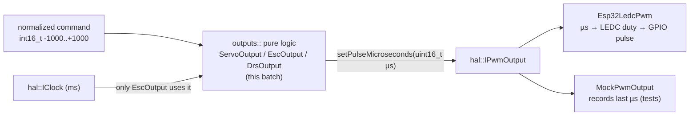

# C2 — Outputs: Commands → Microseconds

**Batch C2 of the source-code campaign** (see `../../source_code_explanation_plan.md`).
This is the *output* half of the car: three small pure-logic classes that turn abstract
commands (−1000…+1000, or a boolean) into **servo pulse widths in microseconds**, plus
the one ESP32 file that actually makes electrical pulses on a pin, plus the test double
and the tests.

Everything here builds directly on C1: these classes talk to hardware only through
`hal::IPwmOutput` (the "emit a pulse of N microseconds" interface) and `hal::IClock`
(the "what time is it" interface). If §3.1/§9 of C1 are fuzzy, re-read them first.

## Scope (files explained here)

| File | Lines | What it is |
|---|---|---|
| `lib/outputs/include/outputs/ServoOutput.hpp` | 47 | Steering-style servo: position → µs |
| `lib/outputs/src/ServoOutput.cpp` | 33 | …its scaling implementation |
| `lib/outputs/include/outputs/EscOutput.hpp` | 59 | ESC throttle + the boot-arm hold |
| `lib/outputs/src/EscOutput.cpp` | 47 | …its scaling + hold implementation |
| `lib/outputs/include/outputs/DrsOutput.hpp` | 26 | 2-position DRS wing flap |
| `lib/outputs/src/DrsOutput.cpp` | 11 | …its trivial implementation |
| `lib/outputs_hal_esp32/include/outputs_hal_esp32/Esp32LedcPwm.hpp` | 37 | ESP32 LEDC PWM — declaration |
| `lib/outputs_hal_esp32/src/Esp32LedcPwm.cpp` | 20 | …LEDC duty-cycle math (the only hardware file) |
| `test/mocks/MockPwmOutput.hpp` | 18 | Fake `IPwmOutput` that records the last µs |
| `test/test_outputs/test_main.cpp` | 173 | The outputs unit tests |

**Prerequisites:** C1 (the `IPwmOutput`/`IClock` seams, `constexpr valid()`, the
member-initializer and interface syntax); manual chapter 03 §6 (servo PWM / the LEDC
peripheral) and chapter 06 §2.5.

**Test status: RUN AND PASSING.** I executed `pio test -e native -f test_outputs` on
2026-07-03 — 10 test cases, all `[PASSED]` in 1.5 s. Behaviours marked **VERIFIED** below
are confirmed by that run.

---

## 0. The one idea in this batch: two number systems

Every output in the car speaks **two** number systems, and this batch is the translator
between them. Keep them straight — the task brief rightly warns about mixing units:

| System | Range | Meaning | Where it lives |
|---|---|---|---|
| **Normalized command** | −1000 … +1000 (or a `bool`) | "full one way … centre … full the other" | the pure `outputs::` logic (input) |
| **Pulse width** | ~500 … 2500 **microseconds** (µs) | the actual RC servo signal (chapter 03 §6) | the `IPwmOutput` seam (output) |

And a **third** unit appears only inside the ESC's timer: **milliseconds** (ms) for the
2-second boot-arm hold. So this batch touches all three: `int16_t` command → `uint16_t`
microseconds → (ESP32) duty cycle, with a `uint32_t` millisecond timer gating the ESC.
Confusing µs with ms here would be a real bug; the code is careful, and so is this doc.



---

## 1. `lib/outputs/include/outputs/ServoOutput.hpp`

The steering servo's brain. Turns a position −1000…+1000 into microseconds.

### Lines 1–7: preamble
```cpp
#pragma once
#include <cstdint>
#include "hal/IPwmOutput.hpp"
namespace outputs {
```
- The include-guard and `<cstdint>` are familiar from C1.
- **`#include "hal/IPwmOutput.hpp"`** — this pure module depends on the *interface* from
  C1, not on any ESP32 code. That single include is what keeps `ServoOutput` testable on
  your laptop. (Recall from C1: `library.json` for `outputs` lists a dependency on
  `hal`; this is that dependency in the source.) **VERIFIED.**
- Everything lives in the `outputs` namespace.

### Lines 9–23: the ServoConfig struct (and its `valid()`)
```cpp
struct ServoConfig {
    uint16_t minMicros = 500;     // physical endpoint, configurable per servo
    uint16_t maxMicros = 2500;    // physical endpoint, configurable per servo
    uint16_t centerMicros = 1500; // center, before trim. CLAUDE.md section 1: steering center 1500us
    int16_t trimMicros = 0;       // signed trim offset added to center, operator-tunable on the bench

    constexpr bool valid() const {
        const int32_t trimmedCenter = static_cast<int32_t>(centerMicros) + trimMicros;
        return minMicros < maxMicros && centerMicros > minMicros && centerMicros < maxMicros &&
               trimmedCenter > minMicros && trimmedCenter < maxMicros;
    }
};
```
- Four tunables, each with a default (the *default member initializer* pattern from C1):
  endpoints 500 and 2500 µs, centre 1500 µs, trim 0.
- **`int16_t trimMicros`** is *signed* (note: not `uint16_t`) because a trim can be
  negative — you might need to nudge centre left *or* right to make the wheels sit
  straight. This is the only signed field.
- **`constexpr bool valid() const`** — the compile-time validity check from C1 §4/§6,
  here guarding a real safety property (review finding **A11**, manual chapter 05 §1.2):
  - **`static_cast<int32_t>(centerMicros)`** — a *cast*: temporarily views `centerMicros`
    as a 32-bit signed integer. Why: `centerMicros` is `uint16_t` and `trimMicros` is
    `int16_t`; adding them in a wider *signed* type avoids any unsigned-wraparound or
    overflow surprise before comparing. Widening to `int32_t` before mixed-sign
    arithmetic is a recurring safety habit you'll see all over this batch.
  - The returned condition demands: endpoints ordered (`min < max`), the raw centre
    strictly inside them, **and the trimmed centre (`center + trim`) still strictly
    inside them.** That last clause is the A11 fix: a trim large enough to shove the
    effective centre past an endpoint would "invert direction / peg the servo," so such a
    config simply won't validate. **VERIFIED** (the code); the A11 linkage is stated in
    the comment.
- **Important nuance:** `valid()` is defined here but this file does **not** call
  `static_assert` on it — nothing in ServoOutput forces validation. The guarantee is only
  as strong as *whoever constructs a ServoConfig* choosing to check `valid()`. In
  practice `main.cpp` (batch C10) `static_assert`s the default config, and the tuning
  console (C9) calls `valid()` on every `set`. So: **the guard exists, but its
  enforcement lives in the callers, not here.** **VERIFIED** (no `static_assert` in this
  file); which callers enforce it is **PROVISIONAL** until C9/C10.

### Lines 25–45: the ServoOutput class
```cpp
class ServoOutput {
public:
    ServoOutput(hal::IPwmOutput& pwm, ServoConfig config = ServoConfig{});
    void setPosition(int16_t normalizedPosition);
    void setConfig(const ServoConfig& config) { config_ = config; }
    const ServoConfig& config() const { return config_; }
private:
    hal::IPwmOutput& pwm_;
    ServoConfig config_;
};
```
- **`ServoOutput(hal::IPwmOutput& pwm, ServoConfig config = ServoConfig{})`** — the
  constructor takes the PWM seam *by reference* (**`&`**) and a config (defaulting to the
  defaults). Taking `hal::IPwmOutput&` — a reference to the interface — is the crux of
  the seam: ServoOutput is handed *some* PWM output and neither knows nor cares whether
  it's a real LEDC channel or a mock (C1 §9). **VERIFIED.**
- **`void setPosition(int16_t normalizedPosition)`** — the one real method; §1-impl below.
  Its doc comment pins the contract: −1000 = full one way, 0 = centre (+trim), +1000 =
  full the other way, and "out-of-range input is clamped defensively before scaling."
- **`setConfig`/`config`** — a runtime setter/getter for bench tuning (used by the
  console, C9). The comment notes it's a "pure config-copy; no state to reset" and
  "caller is responsible for having validated the config" — i.e. `setConfig` itself does
  **not** call `valid()`. Same pattern as ServoConfig: mechanism here, policy in the
  caller. **VERIFIED.**
- **`private:`** members: a **reference** to the PWM (`pwm_`) and the config copy. A
  reference member means the ServoOutput does not own the PWM object — it borrows one
  that must outlive it. (In this firmware the PWM objects are globals in `main.cpp`, so
  they outlive everything.) **VERIFIED** (reference member); the lifetime reasoning is
  **INFERRED** and will be concretely confirmed in C10.

---

## 2. `lib/outputs/src/ServoOutput.cpp` — the scaling math

This is the first real arithmetic in the campaign. Read it slowly; the ESC reuses the
same shape.

### Line 5: constructor
```cpp
ServoOutput::ServoOutput(hal::IPwmOutput& pwm, ServoConfig config) : pwm_(pwm), config_(config) {}
```
- Member-initializer list (C1 §5): bind the reference `pwm_` to the passed-in `pwm`, copy
  the config, empty body. **Note a reference member *must* be set in the initializer
  list** — you can't assign a reference after the fact — which is another reason this
  pattern is used. **VERIFIED.**

### Lines 7–13: clamp the input
```cpp
void ServoOutput::setPosition(int16_t normalizedPosition) {
    int32_t clamped = normalizedPosition;
    if (clamped > 1000) {
        clamped = 1000;
    } else if (clamped < -1000) {
        clamped = -1000;
    }
```
- The `int16_t` input is copied into a **wider `int32_t`** (`clamped`) first. Why wider:
  the scaling below multiplies `clamped` by up to ~2000, and 1000 × 2000 = 2,000,000
  overflows a 16-bit range but fits comfortably in 32 bits. Widen-before-multiply is the
  standard integer-safety move; you'll see it in every scaler here. **VERIFIED.**
- Then clamp to [−1000, +1000]. This is the "defensive clamp" the header promised — the
  logic never trusts that the caller stayed in range (a garbage 5000 becomes 1000).
  **VERIFIED** (test `test_servo_clamps_out_of_range_input`, PASSED).

### Line 15: the trimmed centre
```cpp
    const int32_t center = static_cast<int32_t>(config_.centerMicros) + config_.trimMicros;
```
- The effective centre = configured centre + trim, computed in `int32_t` (same widening
  habit). With defaults that's 1500 + 0 = 1500. With a +50 trim it's 1550. **VERIFIED**
  (test `test_servo_trim_shifts_center` expects 1550, PASSED).

### Lines 16–21: the two-sided linear scale (the heart)
```cpp
    int32_t micros;
    if (clamped >= 0) {
        micros = center + (clamped * (static_cast<int32_t>(config_.maxMicros) - center)) / 1000;
    } else {
        micros = center + (clamped * (center - static_cast<int32_t>(config_.minMicros))) / 1000;
    }
```
This maps −1000…+1000 onto [minMicros … centre … maxMicros] as **two independent linear
segments meeting at the centre**. Why two segments instead of one straight line: because
trim can move the centre *off* the geometric middle, so the distance from centre to
`maxMicros` differs from centre to `minMicros`. Each side gets its own slope so that:
- **positive side:** at `clamped = +1000`, `micros = center + (maxMicros − center) = maxMicros` exactly;
- **negative side:** at `clamped = −1000`, `micros = center + (−1)(center − minMicros) = minMicros` exactly.

So **the endpoints are hit exactly**, and the centre (0) maps exactly to `center`,
*regardless of trim*. Worked examples with defaults (centre 1500, min 500, max 2500):

| `clamped` | formula | µs |
|---|---|---|
| 0 | 1500 + 0 | **1500** |
| +1000 | 1500 + (1000·(2500−1500))/1000 = 1500+1000 | **2500** |
| +500 | 1500 + (500·1000)/1000 = 1500+500 | **2000** |
| −1000 | 1500 + (−1000·(1500−500))/1000 = 1500−1000 | **500** |
| −500 | 1500 + (−500·1000)/1000 = 1500−500 | **1000** |

- **The `/1000`** happens *after* the multiply (widened to `int32_t`), so precision is
  kept until the final integer division. **Integer division truncates toward zero**
  (chapter 04 §2), so intermediate positions can be off by up to a microsecond or two —
  but the endpoints and centre are always exact because their numerators divide evenly.
  For a steering servo, sub-microsecond rounding is far below what the mechanism can
  resolve, so this is a non-issue. **VERIFIED** (endpoints/centre exact — tests
  `test_servo_center_position_default_config`, `test_servo_endpoint_positions`, PASSED);
  the "off by a µs or two mid-travel" is **INFERRED** arithmetic (true of integer scaling
  generally), not separately tested.

### Lines 23–30: defensive endpoint clamp + emit
```cpp
    if (micros < config_.minMicros) {
        micros = config_.minMicros;
    } else if (micros > config_.maxMicros) {
        micros = config_.maxMicros;
    }
    pwm_.setPulseMicroseconds(static_cast<uint16_t>(micros));
}
```
- A second, **belt-and-suspenders** clamp: even if a bad (unvalidated) config or trim
  pushed the computed `micros` past an endpoint, the servo is never commanded outside its
  physical [min, max]. Given a *valid* config the two-sided scaling already stays in
  range, so this only bites when `valid()` was skipped — a defensive layer behind the A11
  guard. **VERIFIED** (code).
- **`static_cast<uint16_t>(micros)`** — the final value is narrowed back to `uint16_t` to
  match `setPulseMicroseconds`'s parameter type. Safe here because the clamp guarantees
  `micros` is within [minMicros, maxMicros] ⊆ 0…65535. **VERIFIED.**
- Finally the µs are pushed through the seam. In tests that lands in `MockPwmOutput`; on
  the car it lands in `Esp32LedcPwm` (§7). ServoOutput itself never touches a pin.

---

## 3. `lib/outputs/include/outputs/EscOutput.hpp` — throttle + the boot-arm hold

The ESC output reuses the servo's two-sided scaling but adds one safety-critical feature:
the **boot-arm hold**. This header's comments are unusually rich; they encode two
review findings.

### Lines 1–6: preamble
```cpp
#include "hal/IClock.hpp"
#include "hal/IPwmOutput.hpp"
```
- Note the extra include: **`IClock`**. Unlike the servo and DRS, the ESC needs to know
  *time* (for the hold), so it depends on both seams. **VERIFIED.**

### Lines 10–18: EscConfig
```cpp
struct EscConfig {
    uint16_t minMicros = 1000;     // ESC throttle full-reverse/min endpoint
    uint16_t maxMicros = 2000;     // ESC throttle full-forward/max endpoint
    uint16_t neutralMicros = 1500; // ESC neutral -- most ESCs require this to arm
    uint32_t bootArmHoldMs = 2000; // hold neutral this long, measured from the FIRST
                                   // setThrottle() call ...
};
```
- Endpoints **1000/2000** (narrower than the servo's 500/2500 — a standard ESC throttle
  range), neutral **1500**, and **`bootArmHoldMs = 2000`** — a *millisecond* value
  (`uint32_t`), the 2-second neutral hold. **Watch the unit:** this one number is in ms;
  everything else in the struct is µs. **VERIFIED.**
- **No `valid()` here.** Unlike `ServoConfig`, `EscConfig` (and `DrsConfig` below) carry
  no validity method — there's no trim-past-endpoint hazard to guard. A factual
  asymmetry worth noticing: only the servo config needed A11 protection. **VERIFIED**
  (the struct has no `valid()`).

### Lines 20–33: the class comment — findings A5 and the two "arm" concepts
The header comment makes two things explicit:
1. **The hold is anchored to the first `setThrottle()` call, not to construction (finding
   A5).** Why it matters: `EscOutput` is a *global* in `main.cpp`, so C++ constructs it
   during **static initialization** — before `setup()` runs and before the PWM pin is
   even attached. If the 2 s timer started at construction, it could partly or fully
   elapse *before the ESC ever saw a neutral pulse*, defeating the arm sequence. Anchoring
   to the first actual command fixes that (manual chapter 05 §1.2, finding A5). **VERIFIED**
   (comment + the code in §4 + regression test `test_esc_hold_starts_at_first_command_not_construction`, PASSED).
2. **Two different "arm" concepts.** This class implements only the **ESC's electrical
   boot-arm** (CLAUDE.md §6.3 — hold neutral so the ESC's own firmware arms). The
   higher-level **arm-switch gate** (CLAUDE.md §6.2 — throttle stays neutral until the
   driver's arm switch is ON and the stick has been seen at neutral) is a *separate* layer
   in the channels module (batch C5). Don't conflate them. **VERIFIED** (comment).

### Lines 35–49: constructor + methods
```cpp
    EscOutput(hal::IPwmOutput& pwm, hal::IClock& clock, EscConfig config = EscConfig{});
    void setThrottle(int16_t normalizedThrottle);
    bool isArmed() const;
```
- The constructor takes **both** seams by reference. The comment states the reason the
  clock is injected: "so the boot-arm timer is testable with a fake clock — no `delay()`
  in the control path." This is exactly the C1 pattern: the ESC never calls `millis()`
  itself; time comes through `IClock`, and tests feed a `FakeClock` (chapter 04 §10).
  **VERIFIED.**
- **`isArmed() const`** — reports whether the hold has elapsed. Its comment pins two edge
  behaviours: it's **inclusive** (armed at the exact tick where elapsed == hold), and
  **always false before `setThrottle()` has ever been called.** Both are tested. **VERIFIED.**

### Lines 51–57: private state
```cpp
    hal::IPwmOutput& pwm_;
    hal::IClock& clock_;
    EscConfig config_;
    bool armHoldStarted_ = false;
    uint32_t armHoldStartMs_ = 0;
```
- Two reference members (both seams) and two state fields tracking the hold: a latch
  (`armHoldStarted_`, like `everReceivedFrame_` in the failsafe machine) and the start
  timestamp. Both default to "not started." **VERIFIED.**

---

## 4. `lib/outputs/src/EscOutput.cpp` — the implementation

### Lines 5–10: constructor + `isArmed()`
```cpp
EscOutput::EscOutput(hal::IPwmOutput& pwm, hal::IClock& clock, EscConfig config)
    : pwm_(pwm), clock_(clock), config_(config) {}

bool EscOutput::isArmed() const {
    return armHoldStarted_ && (clock_.nowMs() - armHoldStartMs_) >= config_.bootArmHoldMs;
}
```
- `isArmed()` is true only when (a) the hold has been started **and** (b) at least
  `bootArmHoldMs` have elapsed since it started. The **`>=`** is what makes the boundary
  *inclusive* (armed exactly at elapsed == hold). **VERIFIED** (test
  `test_esc_boundary_tick_exactly_at_boot_arm_hold_is_armed`, PASSED).
- **Unit + wraparound care:** both `clock_.nowMs()` and `armHoldStartMs_` are
  milliseconds in `uint32_t`; the subtraction is compared against a ms hold. Same unsigned
  subtraction as the failsafe machine — correct *provided the clock is monotonic*
  (`nowMs()` never goes backward), which the `IClock` contract promises. If a clock ever
  ran backward, `now − start` would wrap to a huge number and wrongly report "armed"; the
  monotonic guarantee is what rules that out. **VERIFIED** (the arithmetic); the
  monotonic dependency is **PROVISIONAL** until the ESP32 `IClock` impl is read (it should
  wrap `millis()`), same open item flagged in C1.

### Lines 12–21: start the hold, gate on it
```cpp
void EscOutput::setThrottle(int16_t normalizedThrottle) {
    if (!armHoldStarted_) {
        armHoldStarted_ = true;
        armHoldStartMs_ = clock_.nowMs();
    }

    if (!isArmed()) {
        pwm_.setPulseMicroseconds(config_.neutralMicros);
        return;
    }
```
- **First call ever:** the latch flips and `armHoldStartMs_` records "now" — this is the
  A5 anchor (the hold starts *here*, at first command, not at construction). **VERIFIED.**
- **While not yet armed:** it writes **neutral (1500 µs)** and returns *immediately*,
  ignoring the requested throttle entirely. This is the whole safety point: for the first
  2 s of commanding, **any** requested value — even full throttle — produces neutral. A
  transmitter powered on with the stick jammed forward cannot spin the motor during the
  hold. **VERIFIED** (test `test_esc_holds_neutral_before_boot_arm_elapses`: requests
  1000 at t=1999 ms, gets 1500 and `isArmed()==false`, PASSED).

### Lines 23–44: same two-sided scale as the servo, around neutral
```cpp
    int32_t clamped = normalizedThrottle;
    if (clamped > 1000) { clamped = 1000; }
    else if (clamped < -1000) { clamped = -1000; }

    const int32_t neutral = config_.neutralMicros;
    int32_t micros;
    if (clamped >= 0) {
        micros = neutral + (clamped * (static_cast<int32_t>(config_.maxMicros) - neutral)) / 1000;
    } else {
        micros = neutral + (clamped * (neutral - static_cast<int32_t>(config_.minMicros))) / 1000;
    }
    if (micros < config_.minMicros) { micros = config_.minMicros; }
    else if (micros > config_.maxMicros) { micros = config_.maxMicros; }
    pwm_.setPulseMicroseconds(static_cast<uint16_t>(micros));
}
```
- Once armed, this is **identical in structure** to ServoOutput's scaler, with `neutral`
  playing the role of `center` (there is no trim for the ESC). With defaults
  (neutral 1500, min 1000, max 2000):

| `clamped` | µs | meaning |
|---|---|---|
| 0 | **1500** | neutral (stopped) |
| +1000 | **2000** | full forward |
| −1000 | **1000** | full brake/reverse region |
| +500 | **1750** | half forward |

- **Safety-relevant mapping detail (task brief: "command-to-output mapping"):** a
  *negative* commanded throttle maps into the **1000–1500 µs** band, which on this ESC is
  the **brake** region — the car is configured **forward/brake, not forward/reverse**
  (D8 Phase 7; `Gearbox.hpp` note, batch C6). So "−1000" here means *full brake*, not
  reverse. The gearbox (C6) shapes only *positive* throttle and passes brake/reverse
  through unshaped, which is why this scaler treats both sides symmetrically but the
  *meaning* of the negative side is brake. **VERIFIED** (the scaler code + endpoints);
  the "brake not reverse" interpretation depends on the **ESC's own configuration**,
  which is a bench setting — **PROVISIONAL / hardware-dependent**, tracked in
  `open_questions.md` #29 (ESC characterization) and D8 Phase 7.

---

## 5. `lib/outputs/include/outputs/DrsOutput.hpp` + `6.` its `.cpp`

The simplest output: a two-position wing flap.
```cpp
struct DrsConfig {
    uint16_t closedMicros = 1000; // wing closed position, servo-specific, tune on bench
    uint16_t openMicros = 2000;   // wing open position, servo-specific, tune on bench
};

// 2-position DRS wing-flap output. Closed is the failsafe-safe position.
class DrsOutput {
public:
    DrsOutput(hal::IPwmOutput& pwm, DrsConfig config = DrsConfig{});
    void setOpen(bool open);
private:
    hal::IPwmOutput& pwm_;
    DrsConfig config_;
};
```
```cpp
void DrsOutput::setOpen(bool open) {
    pwm_.setPulseMicroseconds(open ? config_.openMicros : config_.closedMicros);
}
```
- No scaling at all — DRS is binary, so it just picks one of two configured pulse widths.
- **`open ? config_.openMicros : config_.closedMicros`** — the *ternary conditional
  operator* (first appearance in the campaign): `condition ? valueIfTrue : valueIfFalse`.
  Reads as "if `open`, use `openMicros` (2000), else `closedMicros` (1000)." **VERIFIED**
  (test `test_drs_open_and_closed_positions`, PASSED).
- **Safety note in the comment: "Closed is the failsafe-safe position."** So on failsafe,
  higher-level code drives DRS *closed* (1000 µs) — the wing retracts. This matches the
  link2/failsafe state where `drsOpen` is cleared. `DrsOutput` itself has no notion of
  failsafe; it just faithfully renders `open`/`closed`. The "closed is safe" *policy* is
  applied by the caller (C10). **VERIFIED** (comment); the caller behaviour is
  **PROVISIONAL** until C10.
- Note again: `DrsConfig` has **no `valid()`** — two independent pulse widths, nothing to
  invalidate.

---

## 7. `lib/outputs_hal_esp32/…/Esp32LedcPwm.hpp` + `.cpp` — the only hardware file

Everything above is pure and laptop-testable. *This* is the one file in the batch that
touches the ESP32, implementing `hal::IPwmOutput` with the chip's **LEDC** peripheral
(chapter 03 §6: LEDC = the ESP32's hardware PWM generator; hardware-generated pulses stay
perfectly timed even while the CPU is busy).

### Header, lines 12–35
```cpp
class Esp32LedcPwm : public hal::IPwmOutput {
public:
    Esp32LedcPwm(uint8_t pin, uint8_t channel);
    void begin(uint16_t initialPulseMicros);
    void setPulseMicroseconds(uint16_t microseconds) override;
private:
    static constexpr uint32_t kFrequencyHz = 50;
    static constexpr uint8_t kResolutionBits = 16;
    static constexpr uint32_t kPeriodMicros = 1000000UL / kFrequencyHz; // 20000us
    static constexpr uint32_t kMaxDuty = (1UL << kResolutionBits) - 1;
    uint8_t pin_;
    uint8_t channel_;
};
```
- **`: public hal::IPwmOutput`** — the "real half" of the seam (C1 §6 showed the fake half,
  `MockPwmOutput`). It `override`s `setPulseMicroseconds`. **VERIFIED.**
- Constructor takes a **pin** and an **LEDC channel** (0–15). The header comment notes
  "each PWM output needs a distinct channel" — so the five outputs (steering, ESC, DRS,
  pan, tilt) each get their own LEDC channel in `main.cpp` (C10). **VERIFIED** (comment);
  the channel assignments are a C10 detail.
- **`begin(uint16_t initialPulseMicros)`** — the A4 fix (manual chapter 05 §1.2). Its
  comment: LEDC, once configured, "idles at duty 0 — no pulses at all — until the first
  `setPulseMicroseconds()`." That means a freshly-attached channel outputs *silence*, and
  whether that's safe depends on who calls what first. `begin()` fixes it by attaching the
  pin **and immediately commanding a known-safe position** (servo centre / ESC neutral /
  DRS closed). Safe-at-attach, not safe-if-you-remember-to-command. **VERIFIED** (code +
  comment + finding A4).
- The four **`static constexpr`** constants define the PWM regime and the µs→duty math:
  - **`kFrequencyHz = 50`** — 50 Hz, the standard analog-servo/ESC rate (20 ms period).
  - **`kResolutionBits = 16`** — the LEDC counter is 16 bits, so one period is divided
    into 65536 steps.
  - **`kPeriodMicros = 1000000UL / kFrequencyHz`** — one period in microseconds. The
    comment says `// 20000us`; let's confirm: 1,000,000 µs per second ÷ 50 Hz = **20000 µs
    = 20 ms**. ✔ The **`UL`** suffix makes `1000000` an *unsigned long* literal so the
    division happens in a wide unsigned type (no overflow, no truncation surprise).
    **VERIFIED** (arithmetic).
  - **`kMaxDuty = (1UL << kResolutionBits) - 1`** — `1 << 16` is 65536, minus 1 = **65535**,
    the maximum 16-bit duty value (full period). **`<<`** is the left-shift bit operator
    (chapter 04 §13); `1 << 16` = 2^16. **VERIFIED** (arithmetic).

### Implementation, lines 7–18
```cpp
Esp32LedcPwm::Esp32LedcPwm(uint8_t pin, uint8_t channel) : pin_(pin), channel_(channel) {}

void Esp32LedcPwm::begin(uint16_t initialPulseMicros) {
    ledcSetup(channel_, kFrequencyHz, kResolutionBits);
    ledcAttachPin(pin_, channel_);
    setPulseMicroseconds(initialPulseMicros);
}

void Esp32LedcPwm::setPulseMicroseconds(uint16_t microseconds) {
    const uint32_t duty = (static_cast<uint32_t>(microseconds) * kMaxDuty) / kPeriodMicros;
    ledcWrite(channel_, duty);
}
```
- **`#include <Arduino.h>`** (line 3 of the .cpp) — the Arduino framework header. Its
  presence is the *marker* of a HAL file: no pure `lib/outputs` file includes it; this one
  does, which is exactly why it can only build for the ESP32 (recall the `library.json`
  `frameworks: "arduino"` shape from C1 §2). **VERIFIED.**
- **`begin()`**: `ledcSetup(channel, 50Hz, 16bits)` configures the channel's timer,
  `ledcAttachPin(pin, channel)` routes it to the GPIO, then it *immediately* commands the
  safe initial pulse (A4). Order matters: configure → attach → command-safe. **VERIFIED.**
- **`setPulseMicroseconds()` — the µs→duty conversion, the numeric crux:**
  ```
  duty = microseconds * 65535 / 20000
  ```
  This converts a pulse *width in µs* into the *fraction of the 20 ms period* expressed in
  0…65535 counts. Worked examples (the exact values the car will emit):

  | µs | duty = µs·65535/20000 (integer) | duty ÷ 65535 | as % of period |
  |---|---|---|---|
  | 1000 (ESC min) | 3276 | 0.04999 | ~5.0 % |
  | 1500 (neutral/centre) | 4915 | 0.07500 | 7.5 % |
  | 2000 (ESC max) | 6553 | 0.09999 | ~10.0 % |
  | 500 (servo min) | 1638 | 0.02500 | 2.5 % |
  | 2500 (servo max) | 8191 | 0.12499 | ~12.5 % |

  So a 1500 µs pulse is a 7.5 % duty cycle at 50 Hz — precisely the classic servo neutral.
  The **`static_cast<uint32_t>(microseconds)`** before multiplying is essential: without
  widening, `microseconds * kMaxDuty` for 2500 µs would be 2500 × 65535 ≈ 164 million,
  which overflows 16 bits; in `uint32_t` it fits with vast room. The division by
  `kPeriodMicros` (20000) comes last, preserving precision. **VERIFIED** (arithmetic;
  and the pure side is exercised by tests via the mock — see §9). The *electrical* result
  on a real servo is **PROVISIONAL / hardware-dependent** (no ESP32 has been flashed yet;
  this is a D8-bench item, and Wokwi Stage-2 per manual chapter 11 §5).

> **A note on what is and isn't tested.** `Esp32LedcPwm` includes `<Arduino.h>` and calls
> `ledcSetup/ledcAttachPin/ledcWrite`, none of which exist in the `native` build — so this
> file is **never compiled into the unit tests** (recall from C1 that `platformio.ini`'s
> `native` env `lib_ignore`s the `*_hal_esp32` libs). The µs→duty formula's correctness is
> therefore verified here **by hand** (the table above), not by an automated test. Its
> real behaviour awaits Wokwi/bench. **VERIFIED** (that it's excluded from tests);
> the formula is **VERIFIED by hand**, the electrical output **PROVISIONAL**.

---

## 8. `test/mocks/MockPwmOutput.hpp` — the recording fake

```cpp
class MockPwmOutput : public hal::IPwmOutput {
public:
    void setPulseMicroseconds(uint16_t microseconds) override {
        lastMicroseconds = microseconds;
        callCount += 1;
    }
    uint16_t lastMicroseconds = 0;
    unsigned callCount = 0;
};
```
- The "fake half" of the `IPwmOutput` seam — the counterpart to `Esp32LedcPwm`. Instead of
  driving a pin, it just **remembers** the last microseconds it was asked to emit and
  counts calls. That is the entire testability trick: a test drives a `ServoOutput`/
  `EscOutput`/`DrsOutput` and then asserts `pwm.lastMicroseconds == <expected>` — checking
  the *commanded* value with zero hardware (C1 §9; the `IPwmOutput` comment predicted
  exactly this). **VERIFIED.**
- **`unsigned callCount`** — first appearance of bare **`unsigned`** (i.e. `unsigned int`)
  in the campaign; here it just tallies calls. (The tests in this batch happen not to
  assert on `callCount`, but it's available.) **VERIFIED** (not referenced by C2 tests).
- Public data members (no getters) because a mock is a throwaway inspection tool, not a
  guarded object. Lives in `test_mocks`, under `test/`, so never in firmware. **VERIFIED.**

---

## 9. `test/test_outputs/test_main.cpp` — proving the scalers

Same Unity structure as C1 §7. It includes the three output headers plus **both** mocks
(`FakeClock` from C1, `MockPwmOutput` from §8) — the ESC tests need a fake clock to drive
the boot-arm timer. Ten tests; all PASSED in my run. Reading each as a spec claim:

**Servo tests**
- `test_servo_center_position_default_config` — `setPosition(0)` → **1500 µs**. Centre maps
  to centre. **VERIFIED (ran).**
- `test_servo_endpoint_positions` — `−1000` → **500 µs**, `+1000` → **2500 µs**. Endpoints
  exact. **VERIFIED (ran).**
- `test_servo_trim_shifts_center` — with `trimMicros = 50`, `setPosition(0)` → **1550 µs**.
  Trim shifts the centre (§2 line 15). **VERIFIED (ran).**
- `test_servo_clamps_out_of_range_input` — `5000` → **2500**, `−5000` → **500**. The
  defensive input clamp holds. **VERIFIED (ran).**

**ESC tests** (each builds a `FakeClock`, sets a time, and drives the hold)
- `test_esc_holds_neutral_before_boot_arm_elapses` — first command at t=0 starts the hold;
  at t=**1999 ms** a full-throttle (`1000`) request still yields **1500 µs** and
  `isArmed()==false`. The 2 s hold is honoured; full throttle during it is neutralized.
  **VERIFIED (ran).**
- `test_esc_passes_through_after_boot_arm_elapses` — hold starts at t=0; at t=**2500 ms**,
  `1000` → **2000 µs** and `isArmed()==true`. After the hold, throttle passes through.
  **VERIFIED (ran).**
- `test_esc_neutral_requested_pre_arm_is_still_neutral` — first (and only) command at
  t=500 requests `0`; output **1500 µs**. (Even a *neutral* request during the hold is
  neutral — trivially, but it confirms the hold path doesn't special-case neutral.)
  **VERIFIED (ran).**
- `test_esc_boundary_tick_exactly_at_boot_arm_hold_is_armed` — hold starts at t=1000
  (`bootArmHoldMs = 2000`); at t=**3000** (exactly elapsed == 2000) it is **armed** and
  `1000` → **2000 µs**. Proves the **inclusive** boundary (`>=`). **VERIFIED (ran).**
- `test_esc_hold_starts_at_first_command_not_construction` — **the A5 regression.**
  Construct at t=0, assert not armed; jump the clock to t=**5000** and issue the *first*
  command — the hold starts *now*, so still neutral/not-armed; only at t=**7000** (5000 +
  2000) does it arm and pass 2000 µs. Proves the hold is anchored to first command, not to
  construction — the exact defect A5 fixed. **VERIFIED (ran).**

**DRS test**
- `test_drs_open_and_closed_positions` — `setOpen(true)` → **2000 µs**, `setOpen(false)` →
  **1000 µs**. **VERIFIED (ran).**

The runner (`main`) lists all ten `RUN_TEST`s; `pio test` reported "10 test cases: 10
succeeded." **VERIFIED (ran).**

---

## 10. VERIFIED / INFERRED / PROVISIONAL summary

**VERIFIED** (from the code, and — for the pure logic — the test run on 2026-07-03):
- ServoOutput: two-sided linear scale mapping −1000/0/+1000 → min/center(+trim)/max
  **exactly** at those three points; defensive input clamp and defensive endpoint clamp;
  `ServoConfig::valid()` enforces the A11 trim-past-endpoint rule (but only when a caller
  invokes it — no `static_assert` in this file).
- EscOutput: same scaler around neutral; the boot-arm hold writes neutral for
  `bootArmHoldMs` from the **first** `setThrottle()` (A5), inclusive boundary (`>=`),
  latch pattern; full throttle during the hold ⇒ neutral.
- DrsOutput: binary open/closed pulse selection; "closed is the failsafe-safe position."
- `Esp32LedcPwm`: 50 Hz / 16-bit LEDC; `kPeriodMicros = 20000`, `kMaxDuty = 65535`; the
  µs→duty formula `µs·65535/20000` (verified by hand: 1500 µs ⇒ 7.5 % duty); `begin()`
  commands a safe pulse at attach (A4); this file is excluded from the native tests.
- MockPwmOutput records `lastMicroseconds`/`callCount`; the whole test strategy asserts
  commanded microseconds with no hardware.

**INFERRED** (sound reasoning atop the code, not separately proven):
- Mid-travel positions can round by a µs or two due to integer division (endpoints/centre
  are exact); negligible for servos.
- The reference members (`pwm_`, `clock_`) borrow objects that must outlive the output —
  true by construction in `main.cpp` (confirm in C10).
- Widening to `int32_t`/`uint32_t` before multiplying prevents overflow — standard, and
  the specific products here (≤ ~2,000,000 for the scalers, ~164,000,000 for the duty)
  fit comfortably.

**PROVISIONAL** (stated by comment/structure or hardware-dependent; confirm later):
- The ESC `IClock` monotonic assumption behind the unsigned `now − start` (confirm when
  the ESP32 `IClock` impl is read — same open item as C1).
- Which callers actually enforce `ServoConfig::valid()` and drive DRS "closed on failsafe"
  (batches C9/C10).
- The **electrical** behaviour of the LEDC output on a real servo/ESC, and the "negative
  throttle = brake, not reverse" mapping — both depend on hardware/ESC configuration not
  yet on the bench.

---

## 11. Cross-references (open questions & risks already on file)

- **`open_questions.md` #29** — ESC characterization (arming timing, forward/brake vs
  forward/reverse). C2 shows the firmware *emits* 1000–2000 µs with neutral 1500 and a 2 s
  hold; whether the ESC arms on that and treats <1500 as brake is the bench question. D8
  Phase 7.
- **ROADMAP A4** (chapter 05 §1.2) — LEDC idles at duty 0; C2 shows the fix in
  `Esp32LedcPwm::begin(initialPulseMicros)`.
- **ROADMAP A5** (chapter 05 §1.2) — boot-arm anchored to construction; C2 shows the fix
  (anchor to first `setThrottle()`) in code *and* in the dedicated regression test.
- **ROADMAP A11** (chapter 05 §1.2) — trim past an endpoint; C2 shows the guard in
  `ServoConfig::valid()` (and the defensive endpoint clamp behind it).
- **C1 carry-over** — the `IClock`-is-monotonic assumption reused by `EscOutput::isArmed()`;
  still PROVISIONAL until the ESP32 clock impl (a later HAL batch).

No *new* open questions surfaced by C2. One small observation logged for later: only
`ServoConfig` has a `valid()` (A11); `EscConfig`/`DrsConfig` intentionally don't — worth
remembering when we reach the tuning console (C9), which validates on every `set`.

---

## 12. Understanding questions

1. A steering `ServoConfig` has `centerMicros = 1500`, `minMicros = 500`, `maxMicros = 2500`,
   `trimMicros = 0`. What microseconds does `setPosition(+250)` command? Now set
   `trimMicros = 100` and recompute `setPosition(+250)` — does the *positive* side's step
   size change, and why (think about which endpoint the positive side scales toward)?
2. Why does `ServoOutput` scale the positive and negative halves with **separate**
   formulas instead of one straight line from `minMicros` to `maxMicros`? What would break
   with a single line once `trimMicros ≠ 0`?
3. The ESC is commanded `setThrottle(1000)` 0.5 s after boot. What pulse width comes out,
   and why? What single design decision (and which review finding) makes the answer *not*
   "2000 µs"?
4. `EscOutput::isArmed()` uses `(clock_.nowMs() - armHoldStartMs_) >= bootArmHoldMs` with
   unsigned integers. Under what (disallowed) clock behaviour would this wrongly return
   `true`, and which property of `IClock` rules that out?
5. Convert by hand: what LEDC duty value (0…65535) does `Esp32LedcPwm` write for a 1000 µs
   pulse at 50 Hz / 16-bit? Show the arithmetic, and state the duty as a percentage of the
   20 ms period.
6. `ServoConfig` has a `valid()` method but `EscConfig` and `DrsConfig` do not. Explain why
   only the servo config needs one (name the specific hazard), and say where `valid()` is
   actually *enforced* — is it in `ServoOutput`?
7. Why is `Esp32LedcPwm.cpp` never run by `pio test -e native`? What in the project's build
   configuration excludes it, and how is its µs→duty formula checked instead?
8. The DRS comment says "closed is the failsafe-safe position," yet `DrsOutput` contains no
   failsafe logic at all. Whose job is it to send DRS closed during failsafe, and how does
   that reach `DrsOutput`?

---

*Batch C2 complete. `source_code_progress.md` updated. Awaiting approval before C3
("CRSF I: framing + channel decoding").*
