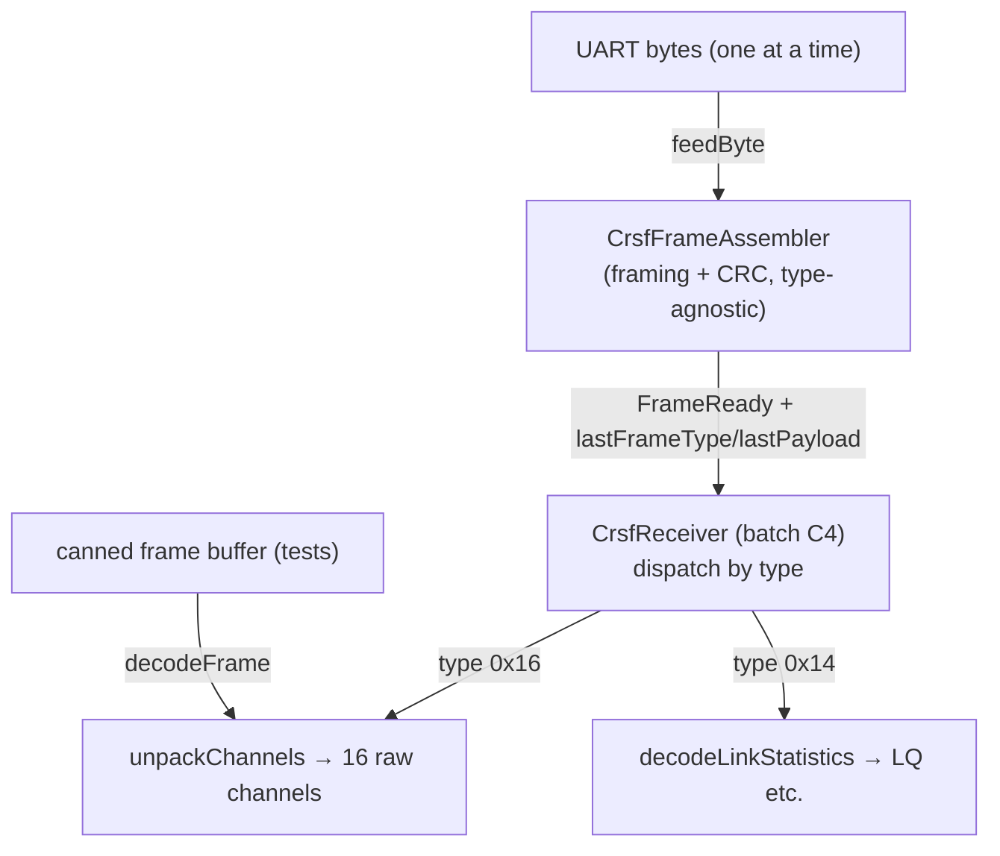

# C3 — CRSF I: Framing + Channel Decoding

**Batch C3 of the source-code campaign** (see `../../source_code_explanation_plan.md`).
This is the *input* side of the radio link: the code that turns a raw stream of bytes
arriving on the UART into validated CRSF frames, and unpacks the 16 RC channels out of
their tightly bit-packed payload. It is the **hardest bit-math in the project** (★★★★),
so this document is deliberately slow and shows worked examples for every non-obvious
operation.

Manual chapter 09 §1 covered CRSF at protocol level; here we read the code line by line.

## Scope (files explained here)

| File | Lines | What it is |
|---|---|---|
| `lib/crsf/include/crsf/CrsfFrame.hpp` | 104 | CRSF constants, frame layout, the two payload structs, result enums |
| `lib/crsf/include/crsf/CrsfFrameAssembler.hpp` | 54 | Byte-stream → frame boundary finder + CRC gate (declaration) |
| `lib/crsf/src/CrsfFrameAssembler.cpp` | 59 | …its 3-state framing machine |
| `lib/crsf/include/crsf/CrsfParser.hpp` | 34 | Pure decode functions (declarations) |
| `lib/crsf/src/CrsfParser.cpp` | 88 | CRC8, the 11-bit channel unpacker, frame decode, link-stats decode |

**Not in this batch:** `test/test_crsf/test_main.cpp` is scheduled for **C4** (it also
covers the receiver facade and frame builders). But it *exercises* all the C3 functions,
so I ran it — see the test note below — and mark C3 behaviour **VERIFIED** where a C3
function is directly asserted.

**Prerequisites:** C1 (constants, structs, enums, `constexpr`), C2 (casts, widening);
manual chapter 04 §13 (bits/shifts/masks) and chapter 09 §1 (CRSF frames).

**Test status: test-backed.** `pio test -e native -f test_crsf` on 2026-07-03 → **29/29
PASSED** (1.4 s). The C3-relevant cases among them (listed in §7) directly assert
`decodeFrame`, `unpackChannels`, `computeCrc8`, `decodeLinkStatistics`, and the
assembler. Line-by-line reading of that test file is deferred to C4, but its *pass/fail*
result backs the VERIFIED labels here.

---

## 0. Two framing concepts, and a warning about endianness

Two jobs live in this batch, and it's worth separating them up front:

1. **Framing** (`CrsfFrameAssembler`) — "where does one message start and end in this
   endless byte stream, and is it intact?" It answers with a `FeedResult` per byte and
   never looks *inside* the payload. Type-agnostic on purpose.
2. **Decoding** (`CrsfParser`) — "given a complete, isolated frame, what do the payload
   bytes *mean*?" This is where the 11-bit channel unpacking lives.

**Endianness warning (the task brief flags byte order — here is the precise truth):**

- The **RC channel payload is a little-endian *bit*stream.** Overall bit 0 is bit 0 (the
  LSB) of `payload[0]`; each channel's low bits come first. This is what `unpackChannels`
  handles, and it's the only endianness that matters *inside C3*.
- The **CRSF telemetry payloads** (battery `0x08`, GPS `0x02`) are **big-endian** — but
  those are only *documented* as constants in `CrsfFrame.hpp`; their encoding lives in the
  frame *builders* (batch C4) and their decoding on the ground station (batch G1). **No
  big-endian multi-byte decoding happens in C3.** `decodeLinkStatistics` copies single
  bytes only, so it has no byte-order at all.

Do not let the "big-endian" comments in `CrsfFrame.hpp` mislead you about the *channel*
data: channels are little-endian bit packing. Keep the two straight.

---

## 1. `lib/crsf/include/crsf/CrsfFrame.hpp` — the protocol's vocabulary

Pure constants and data shapes; no logic. This is where every magic number of CRSF is
named once.

### Lines 1–14: the frame-layout comment
```cpp
// Frame layout: [sync 0xC8][length][type][payload...][crc8]
//   - `length` counts everything after itself: type + payload + crc.
//   - CRC8 (poly 0xD5) is computed over [type + payload] only -- not the sync
//     byte, not the length byte, not the crc byte itself.
```
Memorize this; every function below is an expression of it. Three subtleties that trip
beginners:
- **`length` does not count itself or the sync byte.** It counts `type + payload + crc`.
  So the *total on-wire size* is `2 + length` (the 2 being sync + length). This "+2"
  appears verbatim in the code.
- **The CRC covers `type + payload` only** — not sync, not length, not the CRC byte. So
  the CRC is computed over `length − 1` bytes (everything `length` counts except the CRC
  itself).
- The **sync byte doubles as an address byte** (0xC8 = "to a flight controller / companion
  MCU"). For us it's just "a frame starts here." **VERIFIED** (comment; used consistently
  in code below).

### Lines 20–52: the type/constant bytes
```cpp
inline constexpr uint8_t kSyncByte = 0xC8;
inline constexpr uint8_t kFrameTypeRcChannelsPacked = 0x16;
inline constexpr uint8_t kFrameTypeLinkStatistics = 0x14;
inline constexpr uint8_t kFrameTypeBattery = 0x08;   inline constexpr size_t kBatteryPayloadLen = 8;
inline constexpr uint8_t kFrameTypeGps = 0x02;       inline constexpr size_t kGpsPayloadLen = 15;
inline constexpr uint8_t kFrameTypeFlightMode = 0x21; inline constexpr size_t kFlightModeMaxLen = 16;
inline constexpr uint8_t kCrc8Poly = 0xD5;
```
- `inline constexpr` shared compile-time constants (C1 §1). The `k`-prefix convention
  continues.
- **The frame types are the CRSF "message IDs":** `0x16` RC channels (the one C3 actually
  decodes into channels), `0x14` link statistics, and three *telemetry-out* types
  (`0x08` battery, `0x02` GPS, `0x21` flight-mode) whose payload lengths/encodings are
  documented here but *built* in C4. The comments record their layouts (battery/GPS are
  **big-endian**, flight-mode is a NUL-terminated ASCII string) — again, decoded
  elsewhere. **VERIFIED** (constants); the layouts are documentation cross-referenced to
  CLAUDE.md §2.1/§2.6 — their *encoding* is a C4 claim.
- **`kCrc8Poly = 0xD5`** — the CRC-8/DVB-S2 polynomial (chapter 09 §0). Same value the
  link2 protocol reuses (batch C8). **VERIFIED.**

### Lines 54–71: RC-channel sizing + ranges (the numbers behind the bit math)
```cpp
inline constexpr size_t kRcChannelsPayloadLen = 22;   // 16 channels * 11 bits = 176 bits = 22 bytes
inline constexpr size_t kNumChannels = 16;
inline constexpr uint8_t kRcChannelsLengthByte = 1 + static_cast<uint8_t>(kRcChannelsPayloadLen) + 1; // = 24
inline constexpr size_t kRcChannelsFrameLen = 2 + kRcChannelsLengthByte;   // = 26
inline constexpr uint16_t kChannelRawMin = 172;     // -100%
inline constexpr uint16_t kChannelRawCenter = 992;  //  0%
inline constexpr uint16_t kChannelRawMax = 1811;    // +100%
inline constexpr uint32_t kCrsfBaud = 420000;
```
Let's confirm each number, because the code relies on them exactly:
- **22 bytes payload:** 16 channels × 11 bits = **176 bits**, and 176 ÷ 8 = **22 bytes**
  exactly (no padding). This clean division is why the packing has no waste. **VERIFIED**
  (arithmetic).
- **`kRcChannelsLengthByte = 1 + 22 + 1 = 24`:** the `length` byte for an RC frame counts
  type(1) + payload(22) + crc(1) = **24**. **VERIFIED.**
- **`kRcChannelsFrameLen = 2 + 24 = 26`:** the whole frame on the wire is sync(1) +
  length(1) + 24 = **26 bytes**. **VERIFIED.**
- **Raw channel range 172 / 992 / 1811:** the CRSF convention (−100% / 0% / +100%). An
  11-bit field can hold 0…2047, and this range sits inside it. These feed the channel
  *decoder* module (batch C5), not C3 — C3 just extracts the raw 11-bit numbers. **VERIFIED**
  (constants).
- **`kCrsfBaud = 420000`** — the UART rate (chapter 03 §2, chapter 09 §1). Used by the
  ESP32 UART HAL (batch C4), not here. **VERIFIED.**

### Lines 73–94: the two payload structs
```cpp
struct RcChannelsFrame { uint16_t channels[kNumChannels]; };   // 16 raw 11-bit values

struct CrsfLinkStatistics {
    uint8_t uplinkRssiAnt1 = 0;    // dBm * -1 (75 means -75 dBm)
    uint8_t uplinkRssiAnt2 = 0;
    uint8_t uplinkLinkQuality = 0; // 0-100 %; ELRS forces 0 on link loss
    int8_t  uplinkSnr = 0;         // signed dB
    uint8_t activeAntenna = 0;
    uint8_t rfMode = 0;            // ELRS overloads with packet-rate index -- store raw
    uint8_t uplinkTxPower = 0;     // enum index, not mW -- store raw
    uint8_t downlinkRssi = 0;
    uint8_t downlinkLinkQuality = 0;
    int8_t  downlinkSnr = 0;
};
```
- `RcChannelsFrame` is just an array of 16 `uint16_t` — each channel needs 11 bits, and
  `uint16_t` (16 bits) is the smallest standard type that holds 11 bits. **VERIFIED.**
- `CrsfLinkStatistics` mirrors the 10-byte link-stats payload field for field. The two
  **`int8_t`** fields (`uplinkSnr`, `downlinkSnr`) are *signed* because SNR (signal-to-noise
  ratio) can be negative dB; the RSSI fields are `uint8_t` storing "dBm × −1" (so 75 means
  −75 dBm — a positive byte encoding a negative dBm). The one field the failsafe cares
  about is **`uplinkLinkQuality`** ("ELRS forces 0 on link loss") — that becomes the
  latched RX-failsafe flag in the receiver facade (batch C4). **VERIFIED** (struct +
  comments); the failsafe use is a C4 claim.

### Lines 96–102: the decode-result enum
```cpp
enum class DecodeResult : uint8_t {
    Ok, BadSync, BadLength, UnsupportedType, CrcMismatch,
};
```
- A scoped enum (C1 §7) naming every way `decodeFrame` can fail. Returning a *reason*
  (not just a bool) lets callers/tests distinguish "wrong sync" from "bad CRC" from
  "unsupported type" — and the tests assert specific reasons. **VERIFIED** (used by
  `decodeFrame`; asserted by `test_decode_rejects_*`).

---

## 2. `CrsfFrameAssembler.hpp` — the framing contract

### Lines 7–17: the class comment (two design decisions)
Two things the assembler *deliberately* does:
1. **Type-agnostic:** "FrameReady means a CRC-valid frame of ANY type." ELRS interleaves
   `LINK_STATISTICS` (and other telemetry) with RC frames; those are *valid traffic, not
   corruption*. Treating a non-`0x16` frame as invalid was review finding **A7** (manual
   chapter 05 §1.2); the assembler was generalized to framing+CRC only, and *interpreting*
   the type is the caller's (receiver's) job. **VERIFIED** (comment + test
   `test_assembler_accepts_unknown_type_with_valid_crc`, PASSED).
2. **Self-resynchronizing:** "On any framing/CRC failure the assembler resets and
   resynchronizes on the next sync byte." So one bad frame can't wedge it forever.
   **VERIFIED** (comment + `reset()` in the .cpp + test
   `test_assembler_resyncs_after_corrupted_frame`, PASSED).

### Lines 20–35: the public interface
```cpp
enum class FeedResult : uint8_t { Incomplete, FrameReady, FrameInvalid };
FeedResult feedByte(uint8_t b);

uint8_t lastFrameType() const { return lastFrameType_; }
const uint8_t* lastPayload() const { return buffer_ + 3; }
uint8_t lastPayloadLen() const { return lastPayloadLen_; }
```
- **`feedByte(b)`** is the whole input surface: the caller pushes **one byte at a time**
  as it arrives from the UART, and each call returns whether a frame just completed. This
  byte-at-a-time design is what lets it run in the main loop without buffering the UART
  itself. **VERIFIED.**
- The three accessors expose the last good frame. **Read the lifetime warning in the
  comment carefully:** they're valid *only immediately after* a `FrameReady`, and *only
  until the next `feedByte()`*, because **`lastPayload()` returns `buffer_ + 3` — a
  pointer into the internal buffer that the next byte starts overwriting.** So the caller
  must copy out anything it wants to keep. (This exact contract is why review finding
  **A6** told `main.cpp` to copy channels out on `FrameReady`, chapter 05 §1.2.)
  - **`buffer_ + 3`** is *pointer arithmetic*: `buffer_` is the address of the frame
    buffer; `+ 3` skips sync(1) + length(1) + type(1) to point at the first payload byte.
    So `lastPayload()` points at `payload[0]`. **VERIFIED** (matches the layout).

### Lines 37–52: private state
```cpp
enum class State : uint8_t { WaitingForSync, ReadingLength, ReadingPayload };
static constexpr size_t kMaxFrameLen = 64;   // CRSF caps a frame at 64 bytes on the wire
void reset();
State state_ = State::WaitingForSync;
uint8_t buffer_[kMaxFrameLen] = {};
size_t bufferLen_ = 0;
uint8_t expectedLength_ = 0; // frame[1]; total frame size = 2 + expectedLength_
uint8_t lastFrameType_ = 0;
uint8_t lastPayloadLen_ = 0;
```
- A **3-state machine**: waiting for the start byte, reading the length byte, then reading
  the rest. (Same "state machine" idea as the failsafe FSM in C1, but here framing a byte
  stream.)
- **`buffer_[kMaxFrameLen] = {}`** — a 64-byte array, `= {}` zero-initializes it. 64 is the
  CRSF maximum frame size, so the buffer can hold any legal frame. **VERIFIED.**
- **`expectedLength_`** caches the `length` byte; the comment restates "total frame size =
  2 + expectedLength_". The two `lastFrameType_`/`lastPayloadLen_` fields are *snapshots*
  taken before `reset()` so the accessors survive the reset. **VERIFIED.**

---

## 3. `CrsfFrameAssembler.cpp` — the framing machine, byte by byte

This is a **`switch` on `state_`** (first `switch` in the campaign — it's a multi-way
branch: "run the block matching `state_`"). Each incoming byte advances the machine.

### `WaitingForSync` (lines 8–15)
```cpp
case State::WaitingForSync:
    if (b != kSyncByte) {
        return FeedResult::Incomplete;
    }
    buffer_[0] = b;
    bufferLen_ = 1;
    state_ = State::ReadingLength;
    return FeedResult::Incomplete;
```
- Discard everything until a **`0xC8`** sync byte appears — *this is the resynchronization
  mechanism*. Any garbage (or the tail of a corrupted frame) is silently dropped here.
- On seeing sync: store it at `buffer_[0]`, set length 1, advance to `ReadingLength`. Still
  `Incomplete` (a frame is starting, not done). **VERIFIED** (test
  `test_assembler_ignores_garbage_without_sync_byte`, PASSED).

### `ReadingLength` (lines 17–28)
```cpp
case State::ReadingLength: {
    buffer_[1] = b;
    bufferLen_ = 2;
    expectedLength_ = b;
    const size_t totalFrameLen = 2 + static_cast<size_t>(expectedLength_);
    if (expectedLength_ < 2 || totalFrameLen > kMaxFrameLen) {
        reset();
        return FeedResult::FrameInvalid;
    }
    state_ = State::ReadingPayload;
    return FeedResult::Incomplete;
}
```
- Store the length byte, remember it in `expectedLength_`, and compute `totalFrameLen =
  2 + length`.
- **Two length sanity checks, both important:**
  - **`expectedLength_ < 2`** → invalid. Why 2: `length` must count at least a type byte
    and a CRC byte (the minimum meaningful frame), so anything below 2 is garbage.
  - **`totalFrameLen > kMaxFrameLen` (64)** → invalid. A corrupted length like `0xFF` would
    claim a 257-byte frame; rejecting it *immediately* stops the machine from swallowing
    hundreds of following bytes. (This is the same "reject an impossible length at once"
    discipline the link2 spec mandates, chapter 09 §2 — here for CRSF.)
  - Note `64` is **allowed** (the test is `> 64`, not `≥`); `buffer_` is exactly 64 bytes,
    indices 0…63, so a 64-byte frame fits. **VERIFIED** (bounds).
- On failure it `reset()`s and returns `FrameInvalid` (so the caller learns a boundary was
  found but rejected, and the machine is back to hunting for sync). **VERIFIED.**
- The **`{ }` around this case** create a local scope so `totalFrameLen` can be declared
  inside a `switch` case (C++ requires a block to declare a variable in a case).

### `ReadingPayload` (lines 30–48) — completion + CRC
```cpp
case State::ReadingPayload: {
    buffer_[bufferLen_++] = b;
    const size_t totalFrameLen = 2 + static_cast<size_t>(expectedLength_);
    if (bufferLen_ < totalFrameLen) {
        return FeedResult::Incomplete;
    }

    const uint8_t crcSpan = expectedLength_ - 1;             // type + payload
    const uint8_t receivedCrc = buffer_[2 + crcSpan];        // the last byte
    const uint8_t computedCrc = computeCrc8(buffer_ + 2, crcSpan);

    lastFrameType_ = buffer_[2];
    lastPayloadLen_ = static_cast<uint8_t>(expectedLength_ - 2); // minus type, minus crc
    reset();
    return computedCrc == receivedCrc ? FeedResult::FrameReady : FeedResult::FrameInvalid;
}
```
- **`buffer_[bufferLen_++] = b;`** — append the byte, then increment `bufferLen_`. The
  **post-increment `++`** stores at the *old* `bufferLen_` and *then* bumps it. So bytes
  land at indices 2, 3, 4, … (payload starts after sync+length). Since `totalFrameLen ≤ 64`
  and `buffer_` is 64 bytes, this never overruns. **VERIFIED** (bounds argument).
- **Not complete yet** (`bufferLen_ < totalFrameLen`) → keep feeding. Once
  `bufferLen_ == totalFrameLen`, the whole frame is buffered.
- **The CRC arithmetic (be precise here):**
  - **`crcSpan = expectedLength_ − 1`** = "type + payload" (everything `length` counts
    *except* the CRC byte). For an RC frame: `24 − 1 = 23` bytes.
  - **`receivedCrc = buffer_[2 + crcSpan]`** — index `2 + crcSpan` is sync(0)+length(1)
    then `crcSpan` bytes of type+payload → lands on the CRC byte (the last byte). For an
    RC frame: `buffer_[2 + 23] = buffer_[25]` (the 26th byte). **VERIFIED.**
  - **`computedCrc = computeCrc8(buffer_ + 2, crcSpan)`** — CRC over the `crcSpan` bytes
    starting at `buffer_ + 2` (the *type* byte). So it hashes exactly `[type + payload]`,
    matching the spec. **VERIFIED** (§4 explains `computeCrc8`).
- **`lastPayloadLen_ = expectedLength_ − 2`** — payload length = length minus type(1)
  minus crc(1). For RC: `24 − 2 = 22`. Snapshotted *before* `reset()`. **VERIFIED.**
- **`reset()` then return** — the machine is cleaned up for the next frame, and the result
  is `FrameReady` iff the CRC matched, else `FrameInvalid`. Note the frame is *always*
  reset, valid or not — a bad CRC also sends it back to hunting for sync. **VERIFIED**
  (tests `test_assembler_frames_rc_frame_fed_byte_by_byte`,
  `test_assembler_rejects_corrupted_link_stats`, PASSED).

### `reset()` (lines 53–57) and the resync limitation (A9)
```cpp
void CrsfFrameAssembler::reset() {
    state_ = State::WaitingForSync;
    bufferLen_ = 0;
    expectedLength_ = 0;
}
```
- Back to square one. **Note the accepted limitation (review finding A9, chapter 05 §1.2):**
  after a bad frame, the machine waits for the *next* sync byte — so if a `0xC8` happened
  to sit *inside* the corrupted bytes already consumed, it is **not** rescanned, and one
  extra frame may be lost before resync. ROADMAP quantified this as ≤1 frame per
  corruption at 50–250 Hz and **accepted** it. So "resyncs on the next sync byte" is exact;
  "rescans every possible boundary" is *not* what it does. **VERIFIED** (code behaviour +
  A9); the ≤1-frame cost is ROADMAP's **INFERRED** estimate.
- The trailing `return FeedResult::Incomplete; // unreachable` after the `switch` exists
  only because C++ requires the function to return on all paths; every real case already
  returns. **VERIFIED.**

---

## 4. `CrsfParser.cpp` — the decoders (the bit-math core)

Four functions, declared in `CrsfParser.hpp` with careful comments (the header notes
`computeCrc8` is "bit-by-bit MSB-first, no lookup table — favors readability over speed"
and that `unpackChannels` treats the payload as a "little-endian bitstream").

### 4.1 `computeCrc8` — the checksum (lines 5–15)
```cpp
uint8_t computeCrc8(const uint8_t* data, size_t len) {
    uint8_t crc = 0;
    for (size_t i = 0; i < len; ++i) {
        crc ^= data[i];
        for (int bit = 0; bit < 8; ++bit) {
            crc = (crc & 0x80) ? static_cast<uint8_t>((crc << 1) ^ kCrc8Poly)
                                : static_cast<uint8_t>(crc << 1);
        }
    }
    return crc;
}
```
This is a textbook **bit-by-bit CRC-8**, MSB-first, initial value 0, no reflection, no
final XOR. Precisely:
- Start `crc = 0`.
- For each data byte: **`crc ^= data[i]`** — XOR (`^`) the byte into `crc`.
- Then run 8 bit-steps. Each step:
  - **`crc & 0x80`** tests the **top bit** (bit 7; `0x80` = `1000_0000`). This is the bit
    about to shift out — the "MSB-first" part.
  - If it's set: **`(crc << 1) ^ kCrc8Poly`** — shift left one (bringing in a 0 at the
    bottom), then XOR the polynomial `0xD5`.
  - If it's clear: **`crc << 1`** — just shift left.
  - **`static_cast<uint8_t>(...)`** truncates back to 8 bits. This matters: `crc << 1`
    promotes to `int` and can produce a 9-bit value (e.g. `0xFF << 1 = 0x1FE`); the cast
    discards the overflow bit (bit 8), which is exactly the bit we already tested with
    `& 0x80`. So the truncation is *correct*, not lossy. **VERIFIED** (algorithm).

**Small worked example (first 4 bit-steps of one byte)** — hashing a single byte `0x16`
(the RC type) starting from `crc = 0`:
```
crc ^= 0x16            -> crc = 0x16  (0001 0110)
bit0: 0x16 & 0x80 = 0  -> crc = 0x16<<1 = 0x2C
bit1: 0x2C & 0x80 = 0  -> crc = 0x58
bit2: 0x58 & 0x80 = 0  -> crc = 0xB0
bit3: 0xB0 & 0x80 = 0x80 (set) -> (0xB0<<1)=0x160, ^0xD5 = 0x1B5, cast to uint8 -> 0xB5
... (4 more bit-steps) ...
```
(Full 8-step-per-byte hashing of a real 23-byte span is what the code does for every RC
frame; doing all of it by hand is error-prone, so I do **not** claim a by-hand CRC of a
whole frame here.)

**How the CRC's correctness is actually established (VERIFIED, honestly):**
- **Known-answer test:** `test_crc8_known_answer_test_vector` (PASSED) checks the algorithm
  against a fixed expected value. The CRSF/DVB-S2 catalog check value is CRC of ASCII
  `"123456789"` = **0xBC** (chapter 09 §0; also the link2 spec pins this). A known-answer
  test is the standard, reliable way to verify a CRC implementation — far more trustworthy
  than eyeballing bit-steps.
- **Round-trip tests:** `test_decode_valid_frame_roundtrips_channels` and the assembler
  tests build frames whose CRC this same function must accept, and mutate a byte to prove
  it *rejects* (`test_decode_rejects_bad_crc`). All PASSED.
So: **CRC correctness is VERIFIED by tests**, and the per-bit mechanics above are the
explanation of *how* it computes, not the proof that it's right.

### 4.2 `unpackChannels` — 16 × 11-bit little-endian extraction (lines 17–37)
This is the hardest function in the batch. Read it with the mental model: **the 22-byte
payload is one long string of 176 bits; channel `c` occupies bits `[11c … 11c+10]`, with
bit `11c` being that channel's *least-significant* bit.**

```cpp
for (size_t ch = 0; ch < kNumChannels; ++ch) {
    const size_t bitPos    = ch * 11;
    const size_t byteIdx   = bitPos / 8;
    const size_t bitOffset = bitPos % 8;

    uint32_t chunk = static_cast<uint32_t>(payload[byteIdx]);
    if (byteIdx + 1 < kRcChannelsPayloadLen) {
        chunk |= static_cast<uint32_t>(payload[byteIdx + 1]) << 8;
    }
    if (byteIdx + 2 < kRcChannelsPayloadLen) {
        chunk |= static_cast<uint32_t>(payload[byteIdx + 2]) << 16;
    }

    outChannels[ch] = static_cast<uint16_t>((chunk >> bitOffset) & 0x07FFu);
}
```
Step by step:
- **`bitPos = ch * 11`** — the overall bit index where channel `ch` *starts* (its LSB).
  Channel 0 → bit 0, channel 1 → bit 11, channel 2 → bit 22, …
- **`byteIdx = bitPos / 8`** — which byte that starting bit lives in (integer division).
- **`bitOffset = bitPos % 8`** — how far into that byte (0…7) the starting bit sits
  (modulo).
- **Assemble a little-endian window of up to 3 bytes** into a 32-bit `chunk`:
  - `chunk = payload[byteIdx]` (the low byte),
  - `| payload[byteIdx+1] << 8` (next byte into bits 8…15),
  - `| payload[byteIdx+2] << 16` (next byte into bits 16…23).
  - **`|=`** is bitwise-OR-assign; **`<< 8` / `<< 16`** place each successive byte higher.
    Because byte `byteIdx` goes in the *low* position, this is **little-endian** assembly:
    `chunk`'s bit `k` equals overall bit `byteIdx*8 + k`. **VERIFIED** (matches the
    "little-endian bitstream" comment).
  - **Why up to 3 bytes:** an 11-bit field starting at `bitOffset` spans bits
    `[bitOffset … bitOffset+10]`. If `bitOffset` is 6 or 7, `bitOffset+10` reaches 16 or 17
    — into the *third* byte. So three bytes are needed in the worst case. The two `if`
    bounds checks (`byteIdx+1 < 22`, `byteIdx+2 < 22`) prevent reading past the 22-byte
    payload — crucial for the last channels, where `byteIdx+2` would be out of range
    (channel 15 starts at bit 165, `byteIdx = 20`, and its 11 bits fit within bytes 20–21,
    so byte 22 must *not* be read). **VERIFIED** (bounds + the header's own note about
    channel 15).
- **Extract:** **`(chunk >> bitOffset) & 0x07FFu`**:
  - `>> bitOffset` slides the channel's LSB (at `chunk` bit `bitOffset`) down to bit 0.
  - `& 0x07FF` keeps exactly the low **11 bits** (`0x07FF` = `0000_0111_1111_1111` = 11
    ones = 2047). Everything above bit 10 (bits belonging to the *next* channel) is masked
    off. The **`u`** suffix makes the mask unsigned. **VERIFIED.**
  - Cast to `uint16_t` to store in the channel array.

**Full worked example — the canonical "all channels centered (992)" frame.** I derived
the payload from first principles; it matches the well-known CRSF all-center pattern
`E0 03 1F F8 …`.

First, 992 in 11 bits. `992 = 512+256+128+64+32 = 2⁹+2⁸+2⁷+2⁶+2⁵`, so bit5…bit9 are 1,
the rest 0:
```
992 = bit10..bit0 = 0 1 1 1 1 1 0 0 0 0 0   (LSB on the right)
```
Now lay channel 0 (bits 0–10) then channel 1 (bits 11–21) into the little-endian byte
stream. Working out the first four payload bytes (all channels = 992) gives:
```
payload[0] = 0xE0   payload[1] = 0x03   payload[2] = 0x1F   payload[3] = 0xF8 ...
```
(Check `payload[0]`: overall bits 0–7 are channel 0's bits 0–7 = `0,0,0,0,0,1,1,1`;
as a byte with bit0 = LSB that is `1110_0000` = `0xE0`. ✔)

**Decode channel 0** (`ch=0`): `bitPos=0`, `byteIdx=0`, `bitOffset=0`.
```
chunk = 0xE0 | (0x03<<8) | (0x1F<<16) = 0x1F03E0
(chunk >> 0) & 0x7FF = 0x1F03E0 & 0x7FF = 0x3E0 = 992   ✔
```

**Decode channel 1** (`ch=1`): `bitPos=11`, `byteIdx=1`, `bitOffset=3`.
```
chunk = payload[1] | (payload[2]<<8) | (payload[3]<<16)
      = 0x03 | (0x1F<<8) | (0xF8<<16) = 0xF81F03
(chunk >> 3) & 0x7FF = 0x1F03E0 & 0x7FF = 0x3E0 = 992   ✔
```
(The `>> 3` on `0xF81F03` gives `0x1F03E0`; masking the low 11 bits yields `0x3E0 = 992`.)

So both channels decode to 992, exactly as the "all centered" frame should. This is what
`test_decode_all_channels_at_center` asserts across all 16 channels — **VERIFIED (ran)**.
The endpoint values (172 / 1811) are covered by `test_decode_endpoint_values` (PASSED),
and a mixed-value round trip by `test_decode_valid_frame_roundtrips_channels` (PASSED).

### 4.3 `decodeLinkStatistics` — plain byte copy (lines 39–51)
```cpp
out.uplinkRssiAnt1   = payload[0];
out.uplinkRssiAnt2   = payload[1];
out.uplinkLinkQuality= payload[2];
out.uplinkSnr        = static_cast<int8_t>(payload[3]);
out.activeAntenna    = payload[4];
out.rfMode           = payload[5];
out.uplinkTxPower    = payload[6];
out.downlinkRssi     = payload[7];
out.downlinkLinkQuality = payload[8];
out.downlinkSnr      = static_cast<int8_t>(payload[9]);
```
- No bit math at all — the 10 link-stats bytes map one-to-one onto the struct fields.
- The **`static_cast<int8_t>`** on bytes 3 and 9 reinterprets a byte (0…255) as a *signed*
  value (−128…127) — the two's-complement reinterpretation for the SNR fields. E.g. a wire
  byte `0xF6` (246) becomes `−10` dB. **VERIFIED** (test
  `test_decode_link_statistics_field_mapping`, PASSED).
- The header comment stresses the caller "must have verified the payload length and CRC"
  first — this function trusts it's handed exactly 10 valid bytes. That verification is the
  receiver's job (batch C4). **VERIFIED** (comment; contract enforced upstream).

### 4.4 `decodeFrame` — validate then unpack an isolated RC frame (lines 53–86)
This is the "all-in-one" decoder used by tests (and available to callers) when a frame is
*already* isolated in a buffer — as opposed to the streaming assembler. It re-does the
framing checks defensively and then unpacks.
```cpp
if (frameLen < 4)                      return DecodeResult::BadLength;   // need at least sync+len+type+crc
if (frame[0] != kSyncByte)             return DecodeResult::BadSync;
const uint8_t length = frame[1];
if (length < 2)                        return DecodeResult::BadLength;
if (frameLen != 2 + (size_t)length)    return DecodeResult::BadLength;   // buffer size must match declared length
const uint8_t type = frame[2];
if (type != kFrameTypeRcChannelsPacked) return DecodeResult::UnsupportedType;
if (length != kRcChannelsLengthByte)   return DecodeResult::BadLength;   // RC frame length must be exactly 24
const uint8_t* payload = frame + 3;
const uint8_t receivedCrc = frame[3 + kRcChannelsPayloadLen];            // frame[25]
const uint8_t computedCrc = computeCrc8(frame + 2, 1 + kRcChannelsPayloadLen); // over 23 bytes
if (computedCrc != receivedCrc)        return DecodeResult::CrcMismatch;
unpackChannels(payload, out.channels);
return DecodeResult::Ok;
```
- **The ordering of checks is deliberate** (mirrors the CRSF spec's validation order):
  size → sync → length sanity → size-matches-length → type → RC-specific length → CRC →
  unpack. Each returns a *specific* `DecodeResult`, which the tests assert individually
  (`test_decode_rejects_bad_sync`, `_wrong_type`, `_bad_crc`, `_too_short_buffer`, all
  PASSED). **VERIFIED.**
- **CRC span here:** `computeCrc8(frame + 2, 1 + 22)` = 23 bytes of `[type + payload]`,
  and `receivedCrc = frame[3 + 22] = frame[25]` — identical to the assembler's computation
  (§3). Two code paths, same CRC contract, cross-checked by the shared tests. **VERIFIED.**
- **On any failure `out` is left untouched** (the header promises this) — the channels are
  only written on the final `unpackChannels` after every check passed. So a rejected frame
  never corrupts the caller's channel array. **VERIFIED** (structure; the `out`-untouched
  guarantee is by construction — nothing writes `out` before the last line).
- **`decodeFrame` only accepts type `0x16`** (RC channels): a link-stats frame fed here
  returns `UnsupportedType`. That's fine — `decodeFrame` is the *RC* decoder; link-stats
  goes through the assembler + `decodeLinkStatistics` path (via the receiver, C4). Don't
  confuse the type-agnostic *assembler* with the RC-only *`decodeFrame`*. **VERIFIED.**

---

## 5. How the two paths fit together (and what's still ahead)


- In production, bytes stream through the **assembler**, and the **receiver** (C4) looks at
  `lastFrameType()` to decide whether to call `unpackChannels` or `decodeLinkStatistics`.
- `decodeFrame` is the self-contained RC decoder used mostly by tests and any caller that
  already has a full frame. It duplicates the framing checks so it's safe standalone.
- **What C3 does NOT do:** it produces *raw* 11-bit channel numbers (172…1811). Turning
  those into named, normalized controls (steering, throttle, the ±1000 scale, switch
  hysteresis) is the **channels** module, batch **C5**. And the receiver facade + the LQ
  failsafe latch + the telemetry frame *builders* are batch **C4**.

---

## 6. VERIFIED / INFERRED / PROVISIONAL summary

**VERIFIED** (from the code, and backed by the `test_crsf` run on 2026-07-03 for the C3
functions it asserts):
- Frame layout constants: RC payload 22 bytes, `length` byte 24, whole frame 26 bytes;
  CRC covers `[type+payload]` = `length−1` bytes.
- Assembler: 3-state framing; rejects `length < 2` and `2+length > 64` immediately;
  completes on `bufferLen == 2+length`; CRC over `buffer_+2` for `length−1` bytes; snapshots
  type/payloadLen before `reset()`; type-agnostic `FrameReady` (A7); resyncs on next sync
  after any failure (A9).
- `computeCrc8`: bit-by-bit MSB-first, poly `0xD5`, init 0 — correctness established by the
  known-answer + round-trip tests.
- `unpackChannels`: little-endian bit extraction, `ch*11` bit positions, up-to-3-byte
  window with bounds guards, `>> bitOffset` then `& 0x7FF`; worked example (all-992 →
  `E0 03 1F F8…`) decodes correctly, matching `test_decode_all_channels_at_center`.
- `decodeLinkStatistics`: 1:1 byte copy, signed SNR fields.
- `decodeFrame`: ordered validation returning specific `DecodeResult`s; `out` untouched on
  failure; RC-only (type `0x16`).

**INFERRED** (reasoning atop the code, not a separate proof):
- The A9 "≤1 lost frame per corruption" cost is ROADMAP's estimate, not measured here.
- The per-bit CRC trace in §4.1 is illustrative; the *proof* of CRC correctness is the
  known-answer test, not the hand trace.
- The canonical `E0 03 1F F8` bytes were derived by hand from "all channels = 992"; the
  derivation is shown, but the authoritative check is the passing decode test.

**PROVISIONAL** (not confirmable from C3 alone; later batches / hardware):
- The big-endian telemetry payload *encodings* (battery/GPS/flight-mode) — only their
  constants live here; encoding is C4, decoding is G1.
- That `uplinkLinkQuality == 0` actually drives the failsafe latch — that logic is in the
  receiver (C4).
- Real UART framing behaviour at 420000 baud on hardware (the assembler is pure; the UART
  HAL is C4; end-to-end timing is a bench/Wokwi item).

---

## 7. Cross-references (open questions & risks already on file)

- **ROADMAP A7** (chapter 05 §1.2) — telemetry frames miscounted as corruption; C3 shows
  the fix: the assembler is type-agnostic (`FrameReady` for any CRC-valid type).
- **ROADMAP A9** (chapter 05 §1.2) — assembler discards buffered bytes on failure and only
  resyncs on the next sync byte; C3 shows exactly that in `reset()` + `WaitingForSync`.
  Accepted limitation, not a defect.
- **ROADMAP A6** (chapter 05 §1.2) — the accessor lifetime contract (`lastPayload()` points
  into a buffer overwritten by the next byte); C3 shows the contract in the header; the
  "copy out on FrameReady" obligation lands in `main.cpp` (batch C10).
- **`open_questions.md` #27** — ELRS link-loss characterization (the LQ=0 burst) is a bench
  item; C3 defines the *field* (`uplinkLinkQuality`), the *reaction* is C4.
- **The `test_crsf` file itself** is scheduled for line-by-line reading in **C4** (it mixes
  C3 decode tests with C4 receiver/builder tests). C3 relies on its *result* (29/29
  PASSED), not yet its walkthrough.

The C3-relevant passing tests (run 2026-07-03): `test_crc8_known_answer_test_vector`,
`test_decode_valid_frame_roundtrips_channels`, `test_decode_all_channels_at_center`,
`test_decode_endpoint_values`, `test_decode_rejects_bad_crc`, `test_decode_rejects_bad_sync`,
`test_decode_rejects_wrong_type`, `test_decode_rejects_too_short_buffer`,
`test_decode_link_statistics_field_mapping`,
`test_assembler_frames_rc_frame_fed_byte_by_byte`,
`test_assembler_ignores_garbage_without_sync_byte`,
`test_assembler_resyncs_after_corrupted_frame`,
`test_assembler_accepts_crc_valid_link_stats`,
`test_assembler_rejects_corrupted_link_stats`,
`test_assembler_accepts_unknown_type_with_valid_crc`.

No new open questions surfaced by C3.

---

## 8. Understanding questions

1. A CRSF `length` byte reads `0x18` (24). How many bytes is the whole frame on the wire,
   how many bytes does the CRC cover, and at which buffer index does the CRC byte sit?
2. The assembler is "type-agnostic." What does `feedByte` return for a CRC-valid
   `LINK_STATISTICS` (0x14) frame, and why is that the *correct* behaviour rather than a
   bug? Which review finding made it so?
3. In `unpackChannels`, why does the code assemble **three** bytes into `chunk` for some
   channels but guard the third with `byteIdx + 2 < 22`? Give a channel index where the
   third byte is needed and one where reading it would go out of bounds.
4. Decode channel 2 from the all-centered payload (`payload[2]=0x1F`, `payload[3]=0xF8`,
   `payload[4]=0xC0`): compute `bitPos`, `byteIdx`, `bitOffset`, assemble `chunk`, and show
   that `(chunk >> bitOffset) & 0x7FF` = 992.
5. Why is `& 0x07FF` exactly the right mask to extract one channel, and what would
   `& 0x0FFF` (12 bits) do wrong?
6. `decodeFrame` checks `frame[0]`, then `length`, then `type`, then CRC — in that order.
   Why validate the CRC *last*, and what does it mean that "`out` is left untouched on any
   failure"?
7. The CRC step casts `(crc << 1)` back to `uint8_t`. What bit is thrown away by that
   cast, and why is throwing it away correct (hint: what did `crc & 0x80` already test)?
8. The RC channel payload is a *little-endian bitstream*, but `CrsfFrame.hpp` also mentions
   *big-endian* telemetry payloads. Which functions in C3 touch big-endian data, and what
   is the honest answer?

---

*Batch C3 complete. `source_code_progress.md` updated. Awaiting approval before C4
("CRSF II: receiver facade + frame building", which also walks the `test_crsf` file).*
