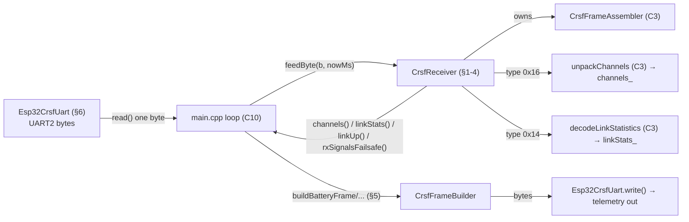

# C4 — CRSF II: Receiver Facade + Frame Building

**Batch C4 of the source-code campaign** (see `../../source_code_explanation_plan.md`).
C3 gave us the low-level pieces: the byte-stream *assembler* and the pure *parser*
functions. C4 assembles them into the thing `main.cpp` actually uses — the
**`CrsfReceiver` facade** — plus the *inverse* direction (**frame builders** for
telemetry-out and tests), the **ESP32 UART wrapper**, and the full **`test_crsf`** suite.

The two headline behaviours to watch (task brief): the **LQ-failsafe latch** (how the
receiver decides the RX is signalling link loss) and the **big-endian telemetry frame
building** (which resolves a PROVISIONAL item left open in C3).

> **C10 resolution note (2026-07-05).** The wiring items this doc marked PROVISIONAL are now
> source-verified in `main.cpp` (see `10_main_integration.md` §11): GPIO16/17 **are** injected
> from `PinMap.hpp` (§2.2 there); `rxSignalsFailsafe()` **is** fed into the FSM's
> `rxFailsafeFlag` every control tick (§4.8); and `read()` **is** guarded by
> `available() > 0` in the loop's drain (§4.3). "VERIFIED (source + build)" — the composition
> itself has no automated test.

## Scope (files explained here)

| File | Lines | What it is |
|---|---|---|
| `lib/crsf/include/crsf/CrsfReceiver.hpp` | 65 | The receiver facade: channels, link-up, LQ-failsafe latch (declaration) |
| `lib/crsf/src/CrsfReceiver.cpp` | 43 | …dispatch a CRC-valid frame by type |
| `lib/crsf/include/crsf/CrsfFrameBuilder.hpp` | 118 | Header-only: pack channels + build every CRSF frame type (parser inverse) |
| `lib/crsf_hal_esp32/include/crsf_hal_esp32/Esp32CrsfUart.hpp` | 34 | ESP32 UART2 wrapper (declaration) |
| `lib/crsf_hal_esp32/src/Esp32CrsfUart.cpp` | 27 | …Serial2 calls (the hardware file) |
| `test/test_crsf/test_main.cpp` | 541 | The full CRSF test suite (29 tests) |

**Prerequisites:** C3 (assembler, parser, CRC, channel packing, the `DecodeResult`/frame
constants). I will *reference* C3 rather than re-derive it. Also C1 (failsafe FSM, for the
"who is the authority" contrast) and C2 (the HAL-file pattern).

**Test status: RUN AND PASSING.** `pio test -e native -f test_crsf` on 2026-07-03 →
**29/29 PASSED** (0.8 s). C4 walks the whole file; behaviours are **VERIFIED** by that run.

---

## 0. Where the receiver sits (the whole CRSF picture, completed)

C3 ended with this gap: the assembler produces "a CRC-valid frame of *some* type" and
exposes a **volatile** view (`lastPayload()` points into a buffer the next byte
overwrites). Something must (a) look at the type, (b) decode the right payload, and (c)
keep a **stable copy** the control loop can read across a tick. That something is
`CrsfReceiver`.



So C4 covers **both arrows** in/out of the car's radio: parsing *in* (receiver) and
building *out* (builders), plus the UART that carries both.

---

## 1. `CrsfReceiver.hpp` — the facade interface

### Lines 8–13: what a "facade" is here
The class comment calls this a "receiver facade per CLAUDE.md §2.1." A **facade** is a
single, friendly object that hides several lower-level parts behind one interface — here
it *owns* the assembler and presents four clean questions to `main.cpp`: what are the
channels, is the link up, when was the last frame, is the RX signalling failsafe.

- Note the deliberate deviation stated in the comment: **timestamps are milliseconds**,
  not the spec's "lastFrameMicros." Reason given: "the whole codebase is ms-based and
  micros wraps in ~71 min." (Check: `micros()` is `uint32_t` microseconds, wrapping at
  2³² µs ≈ 4295 s ≈ **71.6 min** — a plausible session length, so µs would be risky; ms
  wraps at ~49.7 days.) **VERIFIED** (comment + the arithmetic).

### Lines 15–20: the per-byte result enum
```cpp
enum class ByteResult : uint8_t {
    None,         // nothing new (mid-frame, unknown type, or ignored frame)
    NewRcFrame,   // channels() was just updated
    NewLinkStats, // linkStats() was just updated
    CorruptFrame  // framing/CRC failure (assembler resyncs automatically)
};
```
- Every `feedByte` call answers with one of these four. `None` deliberately covers three
  different "nothing actionable happened" cases (mid-frame, a valid-but-unknown type, or a
  known type with a wrong length). `main.cpp` reacts to `NewRcFrame` (run the control
  chain) and can log `CorruptFrame`. **VERIFIED** (used in §2 + tests).

### Lines 22–31: the stable accessors
```cpp
ByteResult feedByte(uint8_t b, uint32_t nowMs);
const RcChannelsFrame& channels() const { return channels_; }
const CrsfLinkStatistics& linkStats() const { return linkStats_; }
bool hasEverReceivedRcFrame() const { return everRcFrame_; }
uint32_t lastRcFrameMs() const { return lastRcFrameMs_; }
```
- **The crucial contrast with C3:** `channels()` and `linkStats()` return references to
  **owned member copies** (`channels_`, `linkStats_`), not into the assembler's transient
  buffer. The comment: "stable between feedByte() calls … so callers may hold references
  across a loop tick." This is the direct fix for the **A6** contract-of-`lastPayload()`
  hazard from C3 — the receiver copies the data out, so the control loop can safely read it
  even after more bytes arrive. **VERIFIED** (member copies + test
  `test_receiver_dispatches_rc_and_stats_interleaved`, PASSED).

### Lines 33–46: `rxSignalsFailsafe()` — the LQ latch (read this twice)
```cpp
bool rxSignalsFailsafe() const {
    return everLinkStats_ && linkStats_.uplinkLinkQuality == 0;
}
```
The comment is a design essay; the code is one line. Both matter. In plain terms:
- **CRSF has no explicit "failsafe" bit.** ELRS *convention*: while connected the RX
  sends `LINK_STATISTICS` (~10 Hz); when it declares link loss it sends a short forced
  burst of stats with **uplink LQ = 0**, then usually goes silent.
- So "the RX is signalling failsafe" is expressed as **"the most recent link-stats frame
  reported LQ 0"** (and we've seen at least one stats frame, hence `everLinkStats_`).
- **Why this *is* a latch even though there's no dedicated latch variable** — this is the
  subtle part. `linkStats_` is only ever overwritten inside the stats-frame branch of
  `feedByte` (§2). **RC frames never touch it.** So once a LQ=0 stats frame lands,
  `linkStats_.uplinkLinkQuality` stays 0 until *another stats frame* replaces it. The
  "latch" is the **persistence of `linkStats_`**, not a boolean flag. Consequences, all
  deliberate (comment):
  - **RC frames cannot clear it** — they don't modify `linkStats_`.
  - **Staleness cannot clear it** — `rxSignalsFailsafe()` takes no time argument; nothing
    expires. It clears *only* when a stats frame with LQ > 0 arrives.
  - This defeats the **"Set Position" hazard** (finding A8): a misconfigured RX that keeps
    emitting hold-position RC frames during an outage can't fake link health, because only
    a genuine LQ>0 stats frame (which real recovery brings within ~100 ms) clears it.
- The comment notes this "intentionally diverges from Betaflight, whose ~250 ms stats
  staleness window only zeroes OSD display values, not failsafe." **VERIFIED** (mechanism
  is exactly the one line; the latch behaviour is proven by three tests in §7).

### Lines 48–54: `linkUp()` — reporting, NOT authority
```cpp
bool linkUp(uint32_t nowMs, uint32_t timeoutMs = 500) const {
    return everRcFrame_ && (nowMs - lastRcFrameMs_) < timeoutMs && !rxSignalsFailsafe();
}
```
- A convenience health summary for telemetry/link2 reporting: true iff we've had an RC
  frame, the last one is fresh (< 500 ms), and the RX isn't signalling failsafe.
- **The comment is emphatic and important:** this is "NOT the actuation authority: the
  `FailsafeStateMachine` remains the sole decider of safe-vs-active." So there are *two*
  link-health judgements in the firmware — `linkUp()` (for what to *report*) and the C1
  failsafe FSM (for what to *do*). They use similar inputs but are deliberately separate;
  never confuse `linkUp()` for the safety gate. **VERIFIED** (comment + test
  `test_receiver_link_up_summary`, PASSED).
- **Unit/wraparound note:** `(nowMs - lastRcFrameMs_)` is the same unsigned-subtraction
  idiom as C1's failsafe and C2's ESC hold — correct given a monotonic ms clock; the
  `everRcFrame_` guard makes the boot case (lastRcFrameMs_ = 0) harmless.

### Lines 56–63: private state
```cpp
CrsfFrameAssembler assembler_;
RcChannelsFrame channels_{};
CrsfLinkStatistics linkStats_{};
bool everRcFrame_ = false;
bool everLinkStats_ = false;
uint32_t lastRcFrameMs_ = 0;
```
- The receiver **owns** an assembler (composition — it *has-a* assembler). The two `{}`
  value-initialize the copies to zero. Two "ever" latches (like `everReceivedFrame_` in the
  failsafe machine) guard the "we've seen at least one" preconditions. **VERIFIED.**

---

## 2. `CrsfReceiver.cpp` — dispatch by type

```cpp
const CrsfFrameAssembler::FeedResult result = assembler_.feedByte(b);
if (result == ...::Incomplete)   return ByteResult::None;
if (result == ...::FrameInvalid) return ByteResult::CorruptFrame;

switch (assembler_.lastFrameType()) {
    case kFrameTypeRcChannelsPacked:
        if (assembler_.lastPayloadLen() != kRcChannelsPayloadLen) return ByteResult::None;
        unpackChannels(assembler_.lastPayload(), channels_.channels);
        everRcFrame_ = true;
        lastRcFrameMs_ = nowMs;
        return ByteResult::NewRcFrame;

    case kFrameTypeLinkStatistics:
        if (assembler_.lastPayloadLen() != kLinkStatisticsPayloadLen) return ByteResult::None;
        decodeLinkStatistics(assembler_.lastPayload(), linkStats_);
        everLinkStats_ = true;
        return ByteResult::NewLinkStats;

    default:
        return ByteResult::None; // other CRC-valid telemetry: ignored
}
```
- **The delegation:** every byte goes first to the C3 assembler. `Incomplete` → `None`;
  `FrameInvalid` → `CorruptFrame`. Only on `FrameReady` does the receiver look at the type.
- **Per-type length validation — the second half of the A7 story.** When the assembler
  became type-agnostic (C3), it stopped checking that a payload's length matches its type.
  The receiver re-adds that check *per type*: an RC frame is decoded **only if
  `lastPayloadLen() == 22`**, link-stats **only if `== 10`**. "A CRC-valid frame with the
  wrong length for its claimed type is ignored, not trusted." This is exactly what
  `test_receiver_ignores_known_type_with_wrong_payload_length` proves (an RC-typed frame
  with an 11-byte payload → `None`, `hasEverReceivedRcFrame()` stays false). **VERIFIED
  (ran).**
- **`lastRcFrameMs_ = nowMs` is set ONLY in the RC branch** — not for stats, not for other
  types. This is the mechanism behind "stats don't extend the failsafe timeout": a LQ=0
  stats burst during an outage must not look like a fresh RC frame. `test_receiver_stats_
  do_not_bump_rc_frame_time` (RC at 100, stats at 500 → `lastRcFrameMs()` == 100) proves
  it. **VERIFIED (ran).**
- **The `default` case:** other valid telemetry (GPS, battery, …) is CRC-checked by the
  assembler and then *silently ignored* here — it changes no receiver state and returns
  `None`. `test_receiver_unknown_type_changes_nothing` proves a GPS frame leaves channels,
  `lastRcFrameMs_`, and the failsafe flag untouched. **VERIFIED (ran).**

---

## 3. The LQ-failsafe latch, end to end (why the tests are shaped as they are)

Because the task flags this specifically, here is the latch's full life cycle, each step
tied to its test:

| Step | What happens to `linkStats_.uplinkLinkQuality` | `rxSignalsFailsafe()` | Test |
|---|---|---|---|
| boot, no stats yet | (unset; `everLinkStats_` false) | **false** | `..._latches_on_zero_lq` (first assert) |
| LQ=0 stats frame arrives | set to **0** | **true** (latched) | `..._latches_on_zero_lq` |
| ~5 s of RC frames, no new stats | unchanged (RC frames don't touch it) → **0** | **true** (stays) | `..._survives_rc_frames_without_fresh_stats` |
| LQ=70 stats frame arrives | overwritten to **70** | **false** (cleared) | `..._clears_on_good_stats` |

The key insight to carry away: **the receiver has no timer for the LQ latch.** Its
"memory" is simply that `linkStats_` persists until the next stats frame. That's why a
flood of RC frames — even *fresh, well-formed* ones — cannot revive the link in the
receiver's eyes. **VERIFIED (all three tests ran).**

**How this feeds the actual safety gate (cross-batch):** in `main.cpp` (C10),
`receiver.rxSignalsFailsafe()` is passed as the `rxFailsafeFlag` argument to
`FailsafeStateMachine::update()` (C1). So the latch here becomes one of the two triggers
that force the FSM to `Safe` (the other being the frame timeout). C1's
`test_rx_failsafe_flag_drops_immediately_even_with_fresh_frames` is the matching
downstream proof. **VERIFIED** (the C1 test) / the *wiring* between them is a **C10** claim.

---

## 4. `CrsfFrameBuilder.hpp` — the inverse direction (telemetry-out + tests)

Header-only (`inline` functions), pure, and — per its top comment — used by "the native
unit tests and the Wokwi sim feeder; the production firmware only ever parses" **except**
for the telemetry-out builders (battery/GPS/flight-mode), which `main.cpp` does use to
send data up to the HUD. It `#include`s `<cstring>` for `memset`/`memcpy`.

### 4.1 `packChannels` — the exact inverse of C3's `unpackChannels`
```cpp
std::memset(payload, 0, kRcChannelsPayloadLen);
for (size_t ch = 0; ch < kNumChannels; ++ch) {
    const size_t bitPos = ch * 11;
    const uint16_t value = channels[ch] & 0x07FF;
    for (int bit = 0; bit < 11; ++bit) {
        if ((value & (1u << bit)) == 0) continue;
        const size_t overallBit = bitPos + static_cast<size_t>(bit);
        payload[overallBit / 8] |= static_cast<uint8_t>(1u << (overallBit % 8));
    }
}
```
- **`std::memset(payload, 0, 22)`** — fills all 22 bytes with 0 first (so we only need to
  *set* the 1-bits). `memset(dest, value, count)` is the standard "fill memory" function.
- For each channel, mask to 11 bits (`& 0x07FF`), then for each set bit, compute its
  **overall bit index** (`bitPos + bit`) and set that bit in the right payload byte:
  `payload[overallBit/8] |= 1 << (overallBit%8)`. This is precisely the LSB-first,
  little-endian layout C3's unpacker reads — **`byte = overallBit/8`, `bit within byte =
  overallBit%8`** — just going the other way. **`1u << bit`** builds a single-bit mask;
  **`value & (1u << bit)`** tests bit `bit`. **VERIFIED** (round-trip tests §7 confirm
  pack∘unpack == identity).
- Why this matters: the tests build frames with `packChannels` and then decode them with
  C3's `unpackChannels`; a passing round trip proves *both* directions agree on the bit
  order. So the C3 "little-endian bitstream" claim is now double-checked from both sides.

### 4.2 `buildFrame` — the generic framer
```cpp
outFrame[0] = kSyncByte;
outFrame[1] = static_cast<uint8_t>(payloadLen + 2); // type + payload + crc
outFrame[2] = type;
std::memcpy(outFrame + 3, payload, payloadLen);
outFrame[3 + payloadLen] = computeCrc8(outFrame + 2, 1 + payloadLen);
return 4 + static_cast<size_t>(payloadLen);
```
- Builds `[sync][length][type][payload][crc]` exactly per the C3 layout:
  - `length = payloadLen + 2` (counts type + payload + crc — the C3 rule).
  - **`std::memcpy(outFrame + 3, payload, payloadLen)`** copies the payload after the
    3-byte header (`memcpy(dest, src, count)`).
  - **CRC over `[type + payload]`** = `computeCrc8(outFrame + 2, 1 + payloadLen)` — the
    same span C3's decoder checks (`1` for the type byte + `payloadLen`). Placed at
    `outFrame[3 + payloadLen]` (the byte right after the payload). **This is the encoder
    using C3's `computeCrc8`, so builder and parser share one CRC** — the frames it makes
    are exactly the frames the parser accepts. **VERIFIED** (build tests check `frame[crc]
    == computeCrc8(frame+2, 1+payloadLen)`, and round-trip tests decode the results).
  - Returns total length `4 + payloadLen` (= 2 header + payload + 1 crc… wait: 2 + 1 +
    payloadLen + 1 = payloadLen + 4 ✔).

### 4.3 The typed builders — and the big-endian resolution
`buildRcChannelsFrame` (packs channels, calls `buildFrame` with type 0x16) and
`buildLinkStatisticsFrame` (lays the 10 stats bytes, casting the signed SNR fields back to
`uint8_t`) are the inverses of C3's decoders. The three **telemetry-out** builders are the
new material, and they settle the endianness question C3 left PROVISIONAL:

- **`buildBatteryFrame` (0x08) — BIG-endian.** Each multi-byte field is written **high
  byte first**:
  ```cpp
  voltageDeciVolt >> 8, voltageDeciVolt & 0xFF,   // hi, lo
  ...
  (capacityMah >> 16) & 0xFF, (capacityMah >> 8) & 0xFF, capacityMah & 0xFF, // 24-bit hi..lo
  remainingPct
  ```
  So voltage 79 (0x004F) → bytes `0x00, 0x4F`; capacity 0x0004D2 → `0x00, 0x04, 0xD2`.
  **This is big-endian, the opposite of link2's little-endian and of the CRSF channel
  *bit* order** (task brief: byte order). **VERIFIED** (`test_build_battery_frame_bytes`
  and `test_build_battery_frame_capacity_is_24bit_be`, both ran — byte math below in §7).
  → **This resolves the C3 PROVISIONAL** ("big-endian telemetry encoding — confirm in C4").
- **`buildGpsFrame` (0x02) — BIG-endian**, 15-byte payload; the car only fills
  `groundspeedKmhX10` (wheel speed ×10) and the altitude 1000-m baseline, zeroing
  lat/lon/heading/sats. **VERIFIED** (`test_build_gps_frame_groundspeed_be`).
- **`buildFlightModeFrame` (0x21) — an ASCII string with the NUL counted in the payload:**
  ```cpp
  while (text[len] != '\0' && len < kFlightModeMaxLen - 1) { payload[len] = text[len]; ++len; }
  payload[len++] = 0; // NUL terminator, counted
  ```
  Copies characters until the source NUL or the 15-char cap (`kFlightModeMaxLen - 1`), then
  appends a NUL and counts it in the payload length. So `"G3 M2 E55"` (9 chars) → 10-byte
  payload; a 20-char string truncates to 15 chars + NUL = 16. **VERIFIED**
  (`test_build_flight_mode_frame_string_nul_terminated`,
  `..._truncates_overlong`). This is the `"G<gear> M<mode> E<ers>"` status string the HUD
  parses (chapter 09 §1.4, TELEMETRY.md).

---

## 5. `Esp32CrsfUart` — the UART wrapper (the hardware file)

```cpp
void Esp32CrsfUart::begin() { Serial2.begin(crsf::kCrsfBaud, SERIAL_8N1, rxPin_, txPin_); }
int  Esp32CrsfUart::available() const { return Serial2.available(); }
uint8_t Esp32CrsfUart::read() { return static_cast<uint8_t>(Serial2.read()); }
void Esp32CrsfUart::write(const uint8_t* data, size_t len) { Serial2.write(data, len); }
```
- Includes `<Arduino.h>` → the marker of a HAL file (like `Esp32LedcPwm` in C2); builds
  only for the ESP32, excluded from `native` tests.
- **`begin()`** configures **UART2 (`Serial2`)** for CRSF: `kCrsfBaud` (420000) and
  `SERIAL_8N1` are **hardcoded here** (**VERIFIED**), while the RX/TX pins are the
  `rxPin_`/`txPin_` the constructor was *given* — this file does **not** reference
  `PinMap.hpp`. That `main.cpp` passes the pin-map's GPIO16 (RX) / GPIO17 (TX) is a
  **C10 wiring claim** (**PROVISIONAL** until C10), not something this file guarantees.
- **`available()`/`read()`** are the byte source `main.cpp` drains into the receiver. Note
  the header contract: **"Caller must check `available() > 0` first."** `Serial2.read()`
  returns `int` (−1 if empty); the unconditional `static_cast<uint8_t>` would turn −1 into
  `0xFF` (a bogus byte) if called on an empty UART, so the caller must guard. **VERIFIED**
  (code + comment; the guard is a C10 obligation).
- **`write()`** sends bytes out UART2 **TX (GPIO17 → RP1 RX pad)** — this is how the
  telemetry frames from §4 reach the HUD. The comment notes TX is a separate pad from RX,
  so outbound telemetry "never collides with inbound RC-frame parsing." **VERIFIED**
  (comment; same UART, separate directions).

**Design note worth pausing on:** unlike `Esp32LedcPwm` (which implements the
`hal::IPwmOutput` *interface*), **`Esp32CrsfUart` implements no `hal::` interface** —
`main.cpp` calls it directly, and the pure CRSF logic is tested by feeding bytes straight
into `CrsfReceiver::feedByte`. There's no need for a UART seam: the *parsing* is already
pure and testable with canned bytes, so the UART is "just a byte pump" main.cpp owns.
Contrast this with the output side, where the seam was needed to *assert commanded values*.
**INFERRED** (the reasoning; the fact that it implements no interface is **VERIFIED** —
the class derives from nothing).

---

## 6. `test_crsf/test_main.cpp` — the full suite (541 lines, 29 tests)

Now the file itself. I explain the **helpers** and go deep on the **C4** tests (receiver +
builders); the **C3** tests (pure decode + assembler) were behaviour-explained in C3, so I
summarize them and only note test *mechanics* here (per the batch rules — no full C3
re-explanation).

### 6.1 Helpers (lines 17–63, an anonymous namespace)
- **`namespace { ... }`** — an *anonymous namespace*: everything inside has "internal
  linkage," i.e. is private to this file. The project uses it for test-local helpers.
- **`buildValidFrame`** wraps `crsf::buildRcChannelsFrame` (§4) — a canned RC frame.
- **`buildLinkStatsFrame(uplinkLq, out)`** fills a `CrsfLinkStatistics` with fixed sentinel
  values (RSSI 75/108, SNR −10 which "encodes as 0xF6: pins signed-byte handling",
  antenna 1, etc.), sets the given LQ, and calls `buildLinkStatisticsFrame`. So tests can
  make a stats frame with any LQ. **VERIFIED** (used throughout).
- **`fillChannels(ch, value)`** sets all 16 channels to one value.
- **`feedAll(receiver, data, len, nowMs)`** feeds a whole buffer byte-by-byte and returns
  the **last non-`None`** result — since tests feed one frame at a time, that's "this
  frame's outcome." This models exactly how `main.cpp` streams bytes. **VERIFIED.**

### 6.2 Pure-function + assembler tests (C3 behaviour — summarized)
Lines 70–285 are the C3 tests (I explained their *behaviour* in C3 §7). As test mechanics:
they build a frame with the §4 builders, optionally corrupt a byte, and assert a specific
`DecodeResult`/`FeedResult`. Two worth re-noting for how they're written:
- `test_decode_rejects_bad_crc` (lines 113–124) plants a **sentinel** `out.channels[0] =
  0xBEEF` and asserts it's *unchanged* after a `CrcMismatch` — proving C3's "`out` left
  untouched on failure." **VERIFIED (ran).**
- `test_crc8_known_answer_test_vector` (lines 155–160) is the **`"123456789"` → `0xBC`**
  check that anchors CRC correctness (referenced in C3 §4.1). Confirmed present and
  passing. **VERIFIED (ran).**

The rest in this range: round-trip channel decode, all-center, endpoints, bad sync/type/
short buffer, link-stats field mapping (SNR `0xF6` → −10), and the assembler framing/
resync/type-agnostic/wrong-length tests. All **PASSED**; all are C3 subjects.

### 6.3 Receiver tests (C4 — detailed)
- **`test_receiver_dispatches_rc_and_stats_interleaved`** (289–310): feed an RC frame
  (t=100) then a stats frame (t=110); assert channels are still the RC values *and*
  `linkStats().uplinkLinkQuality == 95`. Proves the **owned-copy** guarantee (A6): the
  stats frame flowed through the *shared assembler buffer* without disturbing the
  receiver's channel copy. **VERIFIED (ran).**
- **`test_receiver_stats_do_not_bump_rc_frame_time`** (312–327): RC at 100, stats at 500,
  assert `lastRcFrameMs() == 100`. The failsafe-timeout mechanism must not be extended by
  stats. **VERIFIED (ran).**
- **`test_receiver_failsafe_flag_latches_on_zero_lq`** (329–338): no stats → false; LQ=0
  stats → true. **VERIFIED (ran).**
- **`test_receiver_failsafe_flag_survives_rc_frames_without_fresh_stats`** (340–359): the
  headline A8 test. LQ=0 stats, then a `for (t = 110; t < 5000; t += 20)` loop feeding
  ~5 s of hold-position RC frames; assert `rxSignalsFailsafe()` **still true**. Proves RC
  frames can't clear the latch. **VERIFIED (ran).**
- **`test_receiver_failsafe_flag_clears_on_good_stats`** (361–373): LQ=0 → true, then LQ=70
  → false. Only a good stats frame clears it. **VERIFIED (ran).**
- **`test_receiver_ignores_known_type_with_wrong_payload_length`** (375–388): an RC-typed
  frame with an 11-byte payload → `None`, `hasEverReceivedRcFrame()` false. The per-type
  length check (§2). **VERIFIED (ran).**
- **`test_receiver_unknown_type_changes_nothing`** (390–408): after an RC frame, a GPS
  (0x02) frame → `None`, and channels/`lastRcFrameMs_`/failsafe flag all unchanged.
  **VERIFIED (ran).**
- **`test_receiver_reports_corrupt_frames`** (410–418): corrupt a stats CRC → `CorruptFrame`.
  **VERIFIED (ran).**
- **`test_receiver_link_up_summary`** (420–439): `linkUp(0)` false (nothing yet); fresh RC →
  `linkUp(200)` true; `linkUp(700)` false (stale > 500); then LQ=0 stats + fresh RC →
  `linkUp(230)` **false** (latch overrides freshness). Proves `linkUp()`'s three-way
  condition. **VERIFIED (ran).**

### 6.4 Builder tests (C4 — detailed, with the byte math)
These assert *exact bytes*, so they double as a spec for the wire format. Frame layout
recap: `frame[0]`=sync, `[1]`=length, `[2]`=type, `[3..3+payloadLen-1]`=payload,
`[3+payloadLen]`=crc.

- **`test_build_battery_frame_bytes`** (441–456): `buildBatteryFrame(79, 0, 0, 72)`.
  - `n == 12` (4 + 8). `frame[1] == 10` (payloadLen 8 + 2). `frame[2] == 0x08`.
  - voltage 79 = **0x004F** big-endian → `frame[3] == 0x00` (hi), `frame[4] == 0x4F` (lo).
  - `frame[10] == 72` (remaining %, the last payload byte). `frame[11] ==
    computeCrc8(frame+2, 9)`. All the indices line up with `payloadLen = 8`. **VERIFIED
    (ran).**
- **`test_build_battery_frame_capacity_is_24bit_be`** (458–464): capacity `0x0004D2` →
  `frame[7]==0x00, frame[8]==0x04, frame[9]==0xD2` — the 24-bit big-endian split. **VERIFIED
  (ran).**
- **`test_build_gps_frame_groundspeed_be`** (466–482): `buildGpsFrame(0,0,361,0,1000,0)`.
  - groundspeed 361 = **0x0169** at payload offset 8–9 → **frame 11–12**:
    `frame[11]==0x01, frame[12]==0x69`. (Payload offset 8 → frame index `3+8 = 11`.)
  - altitude 1000 = **0x03E8** at payload offset 12–13 → **frame 15–16**:
    `frame[15]==0x03, frame[16]==0xE8`. CRC at `frame[18]` (payloadLen 15 → `3+15`).
    **VERIFIED (ran).**
- **`test_build_flight_mode_frame_string_nul_terminated`** (484–498): `"G3 M2 E55"` (9
  chars) → payloadLen **10** (9 + NUL). `n == 14`. `frame[3]=='G'`, `frame[11]=='5'` (last
  char, index `3+8`), `frame[12]==0x00` (NUL, index `3+9`), CRC at `frame[13]`. **VERIFIED
  (ran).**
- **`test_build_flight_mode_frame_truncates_overlong`** (500–507): a 20-char string
  truncates to 15 chars + NUL = 16-byte payload; `n == 4 + 16 = 20`; `frame[3+14]=='O'`
  (15th char kept), `frame[3+15]==0x00` (NUL). **VERIFIED (ran).**

### 6.5 The runner (509–541)
`main` runs all 29 `RUN_TEST`s. `UNITY_END()` returns success. The build tests are listed
first, then decode, then assembler, then receiver — but order doesn't matter since each
test builds its own state. **VERIFIED (ran; 29/29).**

---

## 7. VERIFIED / INFERRED / PROVISIONAL summary

**VERIFIED** (from the code, and the `test_crsf` run 2026-07-03):
- Receiver dispatch: delegates to the C3 assembler; `Incomplete`→`None`,
  `FrameInvalid`→`CorruptFrame`; on `FrameReady`, decodes RC/link-stats **only when the
  per-type payload length matches**, ignores other valid types; `lastRcFrameMs_` bumped
  only on RC frames; channels/linkStats kept as **owned copies** (A6).
- LQ-failsafe latch: `rxSignalsFailsafe()` = `everLinkStats_ && uplinkLinkQuality == 0`;
  latches on a LQ=0 stats frame, survives arbitrary RC traffic, has no time-expiry, clears
  only on a LQ>0 stats frame (A8). Feeds the FSM's `rxFailsafeFlag` (wiring is C10).
- `linkUp()` = ever-RC ∧ fresh(<500 ms) ∧ ¬failsafe; explicitly **reporting only**, not the
  actuation authority.
- Builders: `buildFrame` produces `[sync][len][type][payload][crc]` with `len = payloadLen
  + 2` and CRC over `[type+payload]` via the *same* `computeCrc8` the parser uses;
  `packChannels` is the exact LSB-first inverse of C3's unpacker (round-trip verified);
  **battery and GPS telemetry payloads are big-endian** (resolves the C3 PROVISIONAL);
  flight-mode is an ASCII string with a counted NUL, truncated to 15 chars.
- `Esp32CrsfUart`: UART2 @ 420000 8N1, RX 16 / TX 17; implements no `hal::` interface.

**INFERRED** (reasoning atop code/comments):
- Why the CRSF UART needs no seam (parsing is already pure) — the design rationale.
- The ~71-min micros wrap figure (arithmetic on the comment's claim).

**PROVISIONAL** (not confirmable from C4 alone):
- The `main.cpp` wiring that passes `rxSignalsFailsafe()` into the FSM and guards
  `read()` with `available()` — batch **C10**.
- Real UART behaviour at 420000 baud on hardware, and the actual ELRS LQ=0 burst
  count/cadence — bench (`open_questions.md` #27, D8 Phase 2).
- That the ground station's `decodeBattery`/`decodeGps`/`parseFlightMode` accept these
  exact bytes — batch **G1** (though the shared golden vectors strongly imply it).

---

## 8. Cross-references (open questions & risks already on file)

- **ROADMAP A6** (chapter 05 §1.2) — the volatile-`lastPayload()` hazard; C4 shows the fix:
  the receiver keeps **owned copies** (`test_receiver_dispatches_rc_and_stats_interleaved`).
- **ROADMAP A7** (chapter 05 §1.2) — the second half: per-type length validation moved into
  the receiver when the assembler went type-agnostic
  (`test_receiver_ignores_known_type_with_wrong_payload_length`).
- **ROADMAP A8** (chapter 05 §1.2) — the "Set Position" hold-position hazard; C4 shows the
  LQ latch that defeats it (three receiver tests).
- **C3 PROVISIONAL resolved** — big-endian telemetry payload encoding is now VERIFIED by
  the battery/GPS build tests.
- **`open_questions.md` #27** — ELRS link-loss characterization (LQ=0 burst) remains a bench
  item; C4 defines the *reaction* (the latch), the *stimulus* timing is hardware.
- **C10 forward-links** — the `rxSignalsFailsafe()`→FSM wiring and the `available()`-guarded
  `read()` loop.

No new open questions surfaced by C4.

---

## 9. Understanding questions

1. `rxSignalsFailsafe()` is a single expression with no timer, yet the comment calls it a
   "latch." In your own words, what physically makes it behave like a latch, and which one
   member variable is doing the "remembering"?
2. After a LQ=0 stats burst, the RX (misconfigured) keeps sending perfectly valid RC frames
   for 5 seconds. Does `rxSignalsFailsafe()` become false? Does `linkUp()` become true?
   Explain both, and name the review finding this defends against.
3. Why is `lastRcFrameMs_` updated in the RC branch of `feedByte` but *not* in the
   link-stats branch? What safety property would break if stats also bumped it?
4. A CRC-valid frame arrives with type `0x16` but a 20-byte payload. Trace what
   `feedByte` returns and what receiver state changes. Which finding made this check live
   in the receiver rather than the assembler?
5. `buildFrame` sets `outFrame[1] = payloadLen + 2`. Why `+2`, and over exactly which
   bytes does `computeCrc8(outFrame + 2, 1 + payloadLen)` run? Relate both to the C3 frame
   layout.
6. `buildBatteryFrame` writes voltage 79 as bytes `0x00, 0x4F`. Is that big- or
   little-endian, and how does it differ from how link2 (batch C8 / chapter 09) will encode
   a 16-bit value? Why can the *same* `computeCrc8` still be used?
7. `Esp32CrsfUart::read()` casts `Serial2.read()` to `uint8_t`. What wrong byte would a
   caller get if it called `read()` when `available() == 0`, and whose job is it to prevent
   that?
8. `Esp32LedcPwm` (C2) implements the `hal::IPwmOutput` interface, but `Esp32CrsfUart`
   implements no interface at all. Give the design reason: why does the output side need a
   seam for testing while the CRSF-input side does not?

---

*Batch C4 complete. `source_code_progress.md` updated. Awaiting approval before C5
("Channels: mapping + arm gate").*
