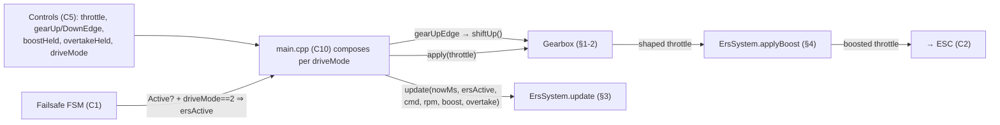

# C6 — Feel: Gearbox + ERS

**Batch C6 of the source-code campaign** (see `../../source_code_explanation_plan.md`).
C5 produced a driver's intent — a `throttle` in ±1000, gear-shift edges, `boostHeld`/
`overtakeHeld` switches, and a `driveMode`. C6 is the **"feel" layer**: the *virtual
gearbox* that shapes throttle per gear, and the *ERS* (Energy Recovery System) that adds a
temporary boost and models an F1 energy store. Both are pure math; both are consumed by
`main.cpp` (C10).

**Same safety framing as C5:** *neither class in C6 commands an output.* `Gearbox::apply`
and `ErsSystem::applyBoost` return an `int16_t`; `ErsSystem::update` mutates internal
energy. The chain **throttle → ArmGate (C5) → Gearbox → ERS → ESC (C2)** is assembled in
C10. So "boost raises the ceiling" really means "returns a bigger number that C10 then
sends to the ESC." Real vehicle behaviour stays **PROVISIONAL** unless a test or the C2
output path backs it.

> **C10 resolution note (2026-07-05).** The C10 wiring claims of this doc are now
> source-verified in `main.cpp` (see `10_main_integration.md` §2.4, §4.5, §4.8, §11): the
> three drive modes are wired exactly as the §2 table anticipated — 0 = fixed
> `shapeThrottle({400, 50})` (Training), 1/2 = `virtualGearbox.apply()`, with **no raw
> pass-through** (the main.cpp comment: top gear already IS full power; authority stays
> monotone along the switch); `ersActive = (FSM Active) && driveMode == 2`, updated **every**
> tick with the post-arm-gate pre-boost throttle; boost applied **after** the gate; shifts run
> on decode edges un-gated by failsafe, and nothing ever resets the gear ("gear survives
> failsafe" is now system-level). One nuance: shifts also run **in Training mode** — output
> unaffected, but gearbox state (and the displayed gear) changes.

## Scope (files explained here)

| File | Lines | What it is |
|---|---|---|
| `lib/gearbox/include/gearbox/Gearbox.hpp` | 99 | Gear params, config, `shapeThrottle`, `Gearbox` class (declaration) |
| `lib/gearbox/src/Gearbox.cpp` | 74 | The expo+scale shaping and gear-shift logic |
| `lib/ers/include/ers/ErsSystem.hpp` | 92 | ERS config + class (declaration) |
| `lib/ers/src/ErsSystem.cpp` | 68 | The energy integrator + boost multiplier |
| `test/test_gearbox/test_main.cpp` | 179 | 14 gearbox tests |
| `test/test_ers/test_main.cpp` | 198 | 14 ERS tests |

**Prerequisites:** C5 (the `Controls`: `throttle`, gear edges, `boostHeld`/`overtakeHeld`,
`driveMode`), C1 (the failsafe FSM `Active`/`Safe` states — used by the ERS `ersActive`
gate), C2 (the ESC's µs mapping + the "negative = brake, not reverse" note). I reference,
not re-explain, these.

**Test status: RUN AND PASSING.** `pio test -e native -f test_gearbox -f test_ers` on
2026-07-03 → **28/28 PASSED** (gearbox 14, ERS 14). Behaviours marked **VERIFIED** are
backed by that run.

---

## 0. Where C6 sits, and what "drive mode" actually selects



**Crucial:** *neither C6 module reads `driveMode` directly.* The `Gearbox` has no mode
input; `ErsSystem` takes a pre-computed `ersActive` bool. The three drive modes from C5
are realized by **how C10 wires these modules**, per ROADMAP B2.2:

| driveMode | What C10 does (PROVISIONAL — the wiring is C10) |
|---|---|
| 0 Training | Fixed gentle gear, **gear-shift edges ignored**, ERS inactive |
| 1 Gearbox | Normal gearbox (shifts honoured), ERS inactive |
| 2 Gearbox+ERS | Normal gearbox **and** `ersActive = true` (with a healthy link) |

So this batch explains the *mechanisms*; the mode-to-behaviour mapping is a C10 claim.
**VERIFIED**: the modules are mode-agnostic mechanisms. **PROVISIONAL**: that C10 selects
between them per `driveMode` (ROADMAP B2.2 records the intent).

---

## 1. `Gearbox.hpp` — the shape of a gear

### Lines 10–13: `GearParams` — one gear's feel
```cpp
struct GearParams {
    int16_t maxOutput;   // ceiling on forward throttle for this gear, 0..1000
    uint8_t expoPercent; // 0 = linear, 100 = full cubic expo (softens small inputs)
};
```
- Two numbers define a gear: a **maxOutput** (the top of this gear's forward throttle, on
  the ±1000 scale) and an **expoPercent** (how much to curve the response — 0 straight
  line, 100 full cubic). **VERIFIED.**

### Lines 15–47: `GearboxConfig` — the default 4-gear table + `valid()`
```cpp
struct GearboxConfig {
    static constexpr size_t kMaxGears = 6;
    GearParams gears[kMaxGears] = {
        {400, 50}, {600, 35}, {800, 20}, {1000, 0},
    };
    uint8_t numGears = 4;
    uint8_t initialGear = 0; // 0-based
    constexpr bool valid() const { ... }
};
```
- **`static constexpr size_t kMaxGears = 6`** — a compile-time constant *inside* the struct
  (a "static member"): the array is always sized 6, but only `numGears` of them are used.
- **The default table (the car's out-of-box feel):** gear 1 `{400, 50}` (cap 40% power,
  strong expo — gentle), gear 2 `{600, 35}`, gear 3 `{800, 20}`, gear 4 `{1000, 0}` (full
  power, linear). `numGears = 4`, `initialGear = 0` (0-based, so **boots in gear 1**;
  display gear = index + 1). **These are "pure feel values — tune freely on the bench."**
  **VERIFIED** (defaults) / their *tuning* is a bench task, not a correctness claim.
- **`valid()` — the monotonicity guard:**
  ```cpp
  if (numGears < 1 || numGears > kMaxGears || initialGear >= numGears) return false;
  for each gear i:
      if maxOutput < 1 || maxOutput > 1000 || expoPercent > 100 return false;
      if i > 0 && gears[i].maxOutput < gears[i-1].maxOutput return false;  // non-decreasing
  return true;
  ```
  Checks gear count/initial in range, each gear's fields in range, **and that maxOutput is
  non-decreasing across gears** ("low gears gentle, top gear full — a non-monotone table is
  almost certainly a config typo"). Like the other configs, `valid()` is meant to be
  `static_assert`ed at the definition site (C10). **VERIFIED** (`test_default_config_is_valid`;
  `test_config_rejects_bad_values` covers zero gears, 7 gears, bad initial, zero/over
  maxOutput, expo 101, and a *decreasing* gear `{300 after 400}`).

### Lines 49–62: `shapeThrottle` — the free function (declaration + its critical comment)
The header comment states the algorithm and two safety-relevant facts:
- **Forward (x > 0): expo curve, then SCALED by `maxOutput`** — "scaling rather than
  clipping so full stick travel maps onto the gear's whole range." Clipping would flat-line
  the top of the stick in low gears; scaling makes the *whole* stick a gentler response.
- **"Expo preserves endpoints: x=1000 always shapes to exactly maxOutput."**
- **Brake/reverse (x ≤ 0): passes through unshaped** — and the important note (cross-ref
  C2): in a forward/reverse-with-brake ESC mode "reverse is indistinguishable from brake at
  the PWM level, so reverse would be ungoverned by the gearbox — run the ESC in
  **forward/brake** mode." So the gearbox deliberately does **not** limit negative throttle;
  the safety of that rests on the ESC being configured forward/brake (a bench setting).
  **VERIFIED** (the code passes negatives through) / the ESC-mode dependency is
  **PROVISIONAL / hardware** (open q #29, D8 Phase 7).

### Lines 64–97: the `Gearbox` class + the "gear survives failsafe" decision
```cpp
class Gearbox {
public:
    explicit Gearbox(GearboxConfig config = GearboxConfig{});
    void shiftUp();   void shiftDown();   void setGear(uint8_t gear);
    void setConfig(const GearboxConfig& config);
    uint8_t currentGear() const { return currentGear_; }
    const GearboxConfig& config() const { return config_; }
    int16_t apply(int16_t normalizedThrottle) const;
private:
    GearboxConfig config_;
    uint8_t currentGear_;
};
```
- A small stateful object: it holds the config and the current gear index.
- **Design decision (header comment): the gear is NOT reset by failsafe or disarm.** "The
  re-arm surprise is already closed by `ArmGate` (fresh throttle-neutral required after every
  episode), and resetting would silently change the car's behavior after a brief link blip."
  So after a momentary link loss you're still in the same gear. **VERIFIED** at the module
  level (the class has *no* failsafe input and no reset-on-failsafe path — nothing can reset
  the gear except an explicit `shift*`/`setGear`). **PROVISIONAL**: that C10 doesn't reset it
  either (ROADMAP D3 says it doesn't).

---

## 2. `Gearbox.cpp` — the expo+scale math and shifting

### Lines 5–26: `shapeThrottle` — the heart
```cpp
int16_t shapeThrottle(int16_t normalizedThrottle, const GearParams& gear) {
    int32_t x = normalizedThrottle;
    if (x > 1000) x = 1000; else if (x < -1000) x = -1000;   // clamp (trusts no caller)

    if (x <= 0) return static_cast<int16_t>(x);              // brake/reverse: unshaped

    const int32_t x3 = (x * x * x) / 1000000;                // cube, back to 0..1000
    const int32_t expo = gear.expoPercent;
    const int32_t shaped = (expo * x3 + (100 - expo) * x) / 100;  // expo blend
    return static_cast<int16_t>((shaped * gear.maxOutput) / 1000); // scale to the gear
}
```
Walk it carefully:

1. **Widen + clamp.** `x` is a 32-bit copy (needed because `x*x*x` reaches 10⁹ — far past
   16 bits); clamp to [−1000, 1000] since the function "trusts no caller." **VERIFIED**
   (`test_out_of_range_input_is_clamped`: 1100 → capped; −1100 → −1000).
2. **Brake/reverse pass-through.** `x ≤ 0` returns `x` unchanged — *in every gear*.
   **VERIFIED** (`test_negative_throttle_passes_through_unshaped_in_every_gear`: −1000 and
   −500 pass through for all 4 default gears). Note `x == 0` also returns 0 (0 is "≤ 0").
3. **The cube, normalized.** `x3 = x³ / 1,000,000`. Why divide by 10⁶: to keep the cube on
   the same 0…1000 scale. At x=1000, `1000³ = 10⁹`, `/10⁶ = 1000` — so **x3 == 1000 at full
   stick** (the endpoint-exact property). At x=500, `500³ = 1.25×10⁸`, `/10⁶ = 125`.
   **VERIFIED** (`test_full_expo_midpoint_value`: gear `{1000,100}`, x=500 → 125).
4. **The expo blend.** `shaped = (expo·x3 + (100−expo)·x) / 100` — a weighted average of the
   pure cube `x3` and the linear `x`, weighted by `expoPercent`:
   - expo = 0 → `shaped = (0 + 100·x)/100 = x` (pure linear).
   - expo = 100 → `shaped = (100·x3)/100 = x3` (pure cubic).
   - **Endpoint-exact for any expo:** at x=1000, x3=1000, so `shaped = (expo·1000 +
     (100−expo)·1000)/100 = 1000`. **VERIFIED** (`test_expo_preserves_full_throttle_endpoint`:
     gear `{800, expo}` → 800 for expo ∈ {0, 50, 100}).
   - Expo *softens the middle*: at x=500, expo 50 gives less than linear. **VERIFIED**
     (`test_expo_softens_midpoint_versus_linear`).
5. **Scale to the gear.** `output = shaped · maxOutput / 1000`. Because `shaped` is on
   0…1000 and hits 1000 at full stick, full stick maps to exactly `maxOutput`. Worked
   examples with the linear gear `{600, 0}` (**VERIFIED** `test_linear_gear_scales_exactly`):

   | x | shaped (expo 0 → =x) | output = shaped·600/1000 |
   |---|---|---|
   | 1000 | 1000 | **600** |
   | 500 | 500 | **300** |
   | 0 | (brake path) | **0** |

   And `apply` in gear 0 `{400,50}`: x=1000 → x3=1000 → shaped=1000 → `1000·400/1000 = 400`;
   gear 3 `{1000,0}` → 1000. **VERIFIED** (`test_apply_follows_current_gear`).
- **Integer truncation** everywhere (`/1000000`, `/100`, `/1000`) biases outputs slightly
  *down* — never up — and never reverses, so the shaped curve is **monotonic
  non-decreasing**. **VERIFIED** (`test_output_is_monotonic_nondecreasing` sweeps x in steps
  of 7 and asserts `out ≥ previous`).

### Lines 28–54: constructor + shifting (saturating, no wrap)
```cpp
Gearbox::Gearbox(GearboxConfig config) : config_(config) {
    // clamp numGears into [1, kMaxGears], initialGear into [0, numGears-1]
    currentGear_ = config_.initialGear;
}
void Gearbox::shiftUp()   { if (currentGear_ + 1 < config_.numGears) currentGear_ += 1; }
void Gearbox::shiftDown() { if (currentGear_ > 0) currentGear_ -= 1; }
void Gearbox::setGear(uint8_t gear) {
    currentGear_ = (gear < config_.numGears) ? gear : static_cast<uint8_t>(config_.numGears - 1);
}
```
- The constructor **defensively clamps** even though `valid()` is the real guard — "a
  bypassed assert cannot produce an out-of-range gear index." **VERIFIED**
  (`test_constructor_clamps_out_of_range_config`: initialGear 10 → clamps to 3).
- **`shiftUp`/`shiftDown` saturate, no wraparound**: up stops at `numGears-1`, down at 0.
  Note the bound is `numGears` (the *configured* count), **not** `kMaxGears` (the array
  size) — so a 4-gear box saturates at 3, never wandering into unused array slots.
  **VERIFIED** (`test_shift_up_down_and_saturation`: down at 0 stays 0; three ups reach 3;
  a fourth stays 3).
- **`setGear`** jumps directly, clamped to the top gear (the "future 3-pos gear selector"
  path). **VERIFIED** (`test_set_gear_direct_and_clamped`: 9 → 3). **VERIFIED**
  (`test_initial_gear_respected`).

### Lines 56–72: `setConfig` (bench tuning) + `apply`
```cpp
void Gearbox::setConfig(const GearboxConfig& config) {
    config_ = config;  // + re-clamp numGears
    if (currentGear_ >= config_.numGears) currentGear_ = numGears - 1;  // re-clamp CURRENT gear
    // deliberately does NOT reset to initialGear
}
int16_t Gearbox::apply(int16_t normalizedThrottle) const {
    return shapeThrottle(normalizedThrottle, config_.gears[currentGear_]);
}
```
- `setConfig` (used by the tuning console, C9) swaps the table but **keeps the current gear**
  (only re-clamping if the new table has fewer gears) — "a table edit must not silently
  change which gear the car is in." **VERIFIED** (code; console wiring is C9).
- **`apply`** is the one-liner the control loop calls: shape the throttle with the *current*
  gear's params. **VERIFIED.**

---

## 3. `ErsSystem` — the energy store (`update`)

ERS models an F1 energy store you *deploy* (spend for a power boost) and *harvest*
(recharge while braking/coasting). Two methods: `update` (advance the store each tick) and
`applyBoost` (multiply throttle while deploying, §4).

### `ErsConfig` defaults (all rates in **permille-of-full per second**)
```cpp
uint16_t deployRatePermille = 260;      // boost drain 26%/s
uint16_t overtakeRatePermille = 400;    // overtake drain 40%/s (deeper)
uint16_t harvestBrakeRatePermille = 110;// brake regen 11%/s
uint16_t harvestCoastRatePermille = 60; // coast regen 6%/s
uint16_t boostBonusPermille = 180;      // +18% output while boosting
uint16_t overtakeBonusPermille = 250;   // +25% (gear 3 cap 800 → exactly 1000)
int16_t brakeThreshold = -40;           // commanded ≤ this = braking
int16_t coastThreshold = 100;           // |commanded| ≤ this (while moving) = coasting
```
- The rates match the HUD model (`docs/f1_hud.html`: deploy 26%/s, harvest 11%/s, boost
  ×1.18) so the simulated dash and the car agree (chapter 05 §7, chapter 10 §4). **VERIFIED**
  (defaults) / their *feel* is design intent.
- **`valid()`** bounds every rate/bonus and requires `brakeThreshold < 0`, `0 < coastThreshold
  ≤ 500`. **VERIFIED** (`test_config_valid_rejects_bad_values`: zero deploy rate, bonus 1001,
  positive brakeThreshold all rejected).

### The micro-permille store (the reason for the odd units)
```cpp
static constexpr int32_t kFullMicroPermille = 1000000;  // full store
int32_t energyMicroPermille_ = kFullMicroPermille;      // starts FULL
uint8_t energyPercent() const { return energyMicroPermille_ / 10000; }
```
- The store is counted in **micro-permille** (millionths of full): full = 1,000,000; 1% =
  10,000. It **starts full**. **VERIFIED** (`test_starts_full`: 100%, not deploying).
- **Why micro-permille — the elegant part.** Per-tick change is `rate(permille/s) ×
  dtMs(ms)`, computed with **no division**. Dimensionally: `permille/s × ms = permille ×
  (ms/1000 s) → ×1000 to reach micro-permille` — the two factors of 1000 (permille→micro,
  s→ms) cancel, so **micro-permille change = rate × dtMs exactly**. This avoids the
  truncation a plain permille accumulator would suffer (e.g. coast 60 permille/s over a
  20 ms tick = 1.2 permille/tick, which a permille counter would truncate to 1 — a ~17%
  error). **VERIFIED** (`test_coast_harvest_exact_slow_rate` pins 54% where a truncating
  accumulator would give less).

### `update` — the per-tick integrator
```cpp
void ErsSystem::update(uint32_t nowMs, bool ersActive, int16_t commandedThrottle,
                       uint16_t wheelRpm, bool boostHeld, bool overtakeHeld) {
    activeBonusPermille_ = 0;                       // (A) no bonus unless we deploy this tick

    if (!seeded_ || !ersActive) {                   // (B) frozen: re-seed clock, energy holds
        seeded_ = true; lastMs_ = nowMs; return;
    }

    uint32_t dtMs = nowMs - lastMs_; lastMs_ = nowMs;
    if (dtMs > kMaxDtMs) dtMs = kMaxDtMs;           // (C) stall clamp, 100 ms

    const bool wantsDeploy = (boostHeld || overtakeHeld) && commandedThrottle > 0;
    if (wantsDeploy && energyMicroPermille_ > 0) {  // (D) DEPLOY
        const uint16_t rate = overtakeHeld ? config_.overtakeRatePermille : config_.deployRatePermille;
        const int32_t drain = rate * dtMs;
        energyMicroPermille_ = (drain >= energyMicroPermille_) ? 0 : energyMicroPermille_ - drain;
        activeBonusPermille_ = overtakeHeld ? config_.overtakeBonusPermille : config_.boostBonusPermille;
        return;
    }

    if (wheelRpm == 0) return;                      // (E) no motion, no regen

    uint16_t harvestRate = 0;                       // (F) HARVEST
    if (commandedThrottle <= config_.brakeThreshold) harvestRate = config_.harvestBrakeRatePermille;
    else if (commandedThrottle >= -config_.coastThreshold && commandedThrottle <= config_.coastThreshold)
        harvestRate = config_.harvestCoastRatePermille;
    if (harvestRate > 0) {
        energyMicroPermille_ += harvestRate * dtMs;
        if (energyMicroPermille_ > kFullMicroPermille) energyMicroPermille_ = kFullMicroPermille;
    }
}
```
Step by step, with the safety-relevant gates:

- **(A)** `activeBonusPermille_` is cleared *first thing every tick*, so `deploying()` is
  false unless block (D) sets it this tick — the boost never "sticks."
- **(B) Freeze + clock re-seed.** If not yet seeded, or `ersActive` is false, the store
  **freezes** (no energy change) but `lastMs_` is updated to now, so a later reactivation
  sees a *one-tick* dt, not a huge gap. **`ersActive` is computed by C10** as "drive mode ==
  Gearbox+ERS **and** the link is healthy" (the header says "mode == GearboxErs AND failsafe
  is Active" — where the FSM's `Active` state means *link healthy, not in failsafe*; see the
  naming note below). So outside mode 2, or during a failsafe, ERS is inert — "a stale boost
  switch held through a failsafe episode can neither drain energy nor report deploying."
  **VERIFIED** (`test_freeze_preserves_energy_and_clock`: 30 s frozen with boost held →
  energy unchanged at 74%, not deploying; reactivation drains only one tick → 73%).
  **PROVISIONAL**: that C10 computes `ersActive` from `driveMode` + FSM state.
  > **Naming note (avoid confusion):** in the failsafe FSM (C1), `State::Active` = *the link
  > is good* and `State::Safe` = *failsafe engaged*. So "failsafe is Active" in the ERS
  > header means "the FSM is in its Active (healthy) state," i.e. **not** in failsafe. ERS
  > runs only with a healthy link.
- **(C) Stall clamp.** `dtMs` is capped at `kMaxDtMs = 100`, so "one late tick must not dump
  seconds of drain/harvest." **VERIFIED** (`test_dt_stall_clamp`: a 5 s gap while boosting
  drains only 100 ms worth = 2.6% → 97%).
- **(D) Deploy.** `wantsDeploy = (boostHeld || overtakeHeld) && commandedThrottle > 0`. Two
  gates: a switch held, **and positive commanded throttle** ("boost is multiplicative, so
  draining at zero/negative throttle would spend energy for nothing"). If also `energy > 0`,
  drain at the boost or overtake rate (**overtake wins** when both held) and set this tick's
  bonus. The drain saturates at 0 (never negative). **VERIFIED** (`test_deploy_drains_at_
  exact_rate`: 1 s boost → 74%; `test_overtake_drains_faster_and_wins_over_boost`: both held
  → 40%/s → 60%; `test_no_deploy_without_positive_throttle`: cmd 0 or −500 → not deploying;
  `test_empty_store_stops_deploying`: drained to 0 → not deploying). Note the bonus applies
  on the tick that *empties* the store (there was energy at tick start), then stops.
- **(E) No motion, no regen.** If `wheelRpm == 0`, return before harvesting — "a parked car
  never creeps energy." **VERIFIED** (`test_harvest_requires_motion`: braking at rpm 0 →
  unchanged 74%; braking at rpm 800 → +11% → 85%).
- **(F) Harvest.** Classify the *commanded* throttle: `≤ −40` = braking (11%/s), else within
  `[−100, 100]` = coasting (6%/s); otherwise no harvest. Add `rate × dtMs`, cap at full.
  **VERIFIED** (`test_coast_harvest_exact_slow_rate`, `test_energy_caps_at_full`: 4 s braking
  from full stays 100%). Note the deploy gate (positive throttle) and harvest bands
  (negative/near-zero) are mutually exclusive by construction.

### The interaction with C5 inputs (what `update` is fed)
`update` takes `commandedThrottle`, `wheelRpm`, `boostHeld`, `overtakeHeld`, `ersActive` —
all assembled by C10 from earlier batches:
- `boostHeld`/`overtakeHeld` are the **C5 `Controls` held switches** (ch11/ch12).
- `commandedThrottle` is documented as "**post-arm-gate, pre-boost** value (0 while
  disarmed)" on the ±1000 scale (per `ErsConfig`'s "same ±1000 scale" comment) — i.e. the
  arm-gated stick throttle, so a *disarmed* car feeds 0 and can neither deploy nor
  brake-harvest-by-command. **VERIFIED** (the module uses whatever it's given; the tests feed
  raw ±1000 values). **PROVISIONAL**: that C10 actually passes the arm-gated throttle and the
  real `wheelRpm` (from telemetry, C7).

---

## 4. `ErsSystem::applyBoost` — spending the store on throttle

```cpp
int16_t ErsSystem::applyBoost(int16_t shapedThrottle) const {
    if (activeBonusPermille_ == 0 || shapedThrottle <= 0) return shapedThrottle;
    int32_t boosted = static_cast<int32_t>(shapedThrottle) * (1000 + activeBonusPermille_) / 1000;
    if (boosted > 1000) boosted = 1000;
    return static_cast<int16_t>(boosted);
}
```
- **This is applied to the *post-gearbox* (shaped) throttle** (§0 diagram), *not* the raw
  stick — so boost raises the gear's ceiling.
- **The HARD INVARIANT (test-pinned):** if there's no active bonus **or** `shapedThrottle ≤
  0`, it returns the input unchanged. So `applyBoost(0) == 0` and negatives pass through —
  "the boost is purely multiplicative, so it can never bypass the arm gate or touch
  braking." This is the safety keystone: *given* that a disarmed car's throttle is gated to
  0 upstream (C5 ArmGate → C10), the shaped throttle is 0 and boost can't turn 0 into
  anything but 0 — so ERS can never move a disarmed car. **VERIFIED** for the invariant
  (`test_apply_boost_zero_and_negative_invariant`: `applyBoost(0)==0`, `applyBoost(-600)==
  -600`); the "disarmed ⇒ throttle 0" step is **PROVISIONAL** (C10 wiring, as in §3).
- **The multiply + clamp.** `boosted = shaped × (1000 + bonus)/1000`, clamped to 1000.
  Worked (boost bonus 180 = +18%, **VERIFIED** `test_apply_boost_multiplies_and_clamps`):

  | shaped | ×1.18 | clamped |
  |---|---|---|
  | 400 (gear 1 cap) | 472 | **472** |
  | 800 (gear 3 cap) | 944 | **944** |
  | 900 | 1062 | **1000** |
  | 1000 (top gear) | 1180 | **1000** (no headroom) |

- **Overtake (+25%) is tuned so gear 3's cap of 800 boosts to exactly 1000.** **VERIFIED**
  (`test_overtake_bonus_hits_exactly_full_in_gear_three`: `applyBoost(800) == 1000`).
- **The F1 flavour, stated in the header:** in **top gear (cap already 1000) boost does
  nothing** — "ERS punches out of corners in lower gears, DRS is the top-speed tool." So
  boost is most useful in the lower/mid gears where there's headroom. **VERIFIED** (the
  1000→1000 clamp above).

---

## 5. The two test files (28 tests)

Both follow the Unity pattern. The ERS suite adds a helper:
- **`runTicks(e, n, cmd, rpm, boost, overtake, startMs=0)`** seeds at `startMs`, then runs
  `n` ticks 20 ms apart with the given inputs and `ersActive = true` — modelling the 50 Hz
  control tick. Returns the last timestamp. (This is why the tests reason in "50 ticks × 20
  ms = 1 s.")

Test coverage (all **VERIFIED (ran)**, 28/28):
- **Gearbox** (§1–2): config validity + monotonicity guard; constructor clamp; linear
  scaling; monotonic output; expo endpoint-exactness, midpoint value, and softening;
  brake pass-through in every gear; input clamp; initial gear; saturating shifts; `setGear`
  clamp; `apply` follows the current gear.
- **ERS** (§3–4): starts full; deploy drains at the exact rate; overtake drains faster and
  wins; no deploy without positive throttle; harvest requires motion; exact coast harvest
  (the micro-permille pin); caps at full; empty store stops deploying; freeze preserves
  energy + clock; dt stall clamp; boost multiply/clamp; the zero/negative invariant;
  overtake→exactly-full in gear 3; config validity.

No `main.cpp`, hardware, or ESP32 file is involved — pure logic, fully host-tested.

---

## 6. VERIFIED / INFERRED / PROVISIONAL summary

**VERIFIED** (code + the 2026-07-03 run):
- Gearbox: default table `{400,50}{600,35}{800,20}{1000,0}`, boots gear 0; `valid()` enforces
  ranges + non-decreasing caps; `shapeThrottle` = expo blend (endpoint-exact) then scale to
  `maxOutput`; brake/reverse (x ≤ 0) passes through unshaped in every gear; output monotonic;
  saturating shifts bounded by `numGears`; gear survives at the module level (no reset path);
  `setConfig` keeps the current gear.
- ERS: micro-permille store starts full; drain/harvest = `rate × dtMs` exactly; freeze +
  clock re-seed when `!ersActive`; 100 ms stall clamp; deploy needs a held switch **and**
  positive throttle **and** energy > 0 (overtake wins); harvest needs motion and a
  brake/coast band; caps at full; `applyBoost` multiplies positive shaped throttle by
  1+bonus, clamps to 1000, and the invariant `applyBoost(0)==0` / negatives pass through.

**INFERRED** (reasoning atop code/comments):
- The micro-permille "two 1000s cancel" derivation (the code relies on it; the dimensional
  explanation is mine, consistent with the header + the exact-rate tests).
- "Boost most useful in low/mid gears" — a consequence of the top-gear clamp, stated by the
  header.

**PROVISIONAL** (depends on C10 / hardware / later batches):
- That C10 realizes the three **drive modes** by selecting/wiring these mechanisms
  (Training = fixed gear + shifts ignored; mode 2 sets `ersActive`) — ROADMAP B2.2 intent.
- That C10 (a) calls `shiftUp/Down` on C5 gear edges, (b) computes `ersActive = driveMode==2
  && FSM==Active`, (c) feeds `update` the arm-gated throttle + real wheel rpm (C7), and (d)
  applies the chain `ArmGate → Gearbox.apply → ERS.applyBoost → ESC`.
- **Real vehicle feel** (how a gear or a boost actually drives) — no hardware yet; the ESC's
  forward/brake configuration underpins the "brake pass-through is safe" claim (open q #29,
  D8 Phase 7).

---

## 7. Cross-references (open questions & risks already on file)

- **ROADMAP D3** (chapter 05 §1.3) — the gearbox module; C6 is that module. D3's "gear
  survives failsafe" and "shift edges consumed inside the frame-arrived block" are the C10
  wiring this batch relies on.
- **ROADMAP B2.2** (chapter 05 §1.3) — ERS + the three drive modes; the "no raw Direct mode"
  decision (top gear already IS full power); the link2 v1 amendment carrying `ersPercent`/
  `driveMode` (relevant in C8).
- **CLAUDE.md §2.3** — the gearbox spec (max-output cap + expo); **§2** ERS is a Phase-2
  extension.
- **C5 back-links** — `boostHeld`/`overtakeHeld`/gear edges/`driveMode` come from
  `ChannelDecoder`; the arm-gated throttle from `ArmGate`. **C2 back-link** — negative
  throttle's "brake not reverse" meaning + the ESC forward/brake requirement (open q #29).
  **C7 forward-link** — `wheelRpm` comes from the telemetry `WheelSpeed` module.

No new open questions surfaced by C6.

---

## 8. Understanding questions

1. In gear 1 `{400, 50}`, compute `shapeThrottle(1000, gear)` and `shapeThrottle(500, gear)`
   step by step (x3, shaped, then the maxOutput scale). Why is the full-stick answer exactly
   400 regardless of the expo value?
2. The gearbox passes negative throttle through **unshaped in every gear**. What safety
   assumption (about the ESC) makes that acceptable, and which batch/bench item verifies it?
   What would go wrong if the ESC were in forward/reverse mode?
3. Why does the ERS store count in *micro*-permille instead of plain permille? Use the coast
   case (60 permille/s, 20 ms tick) to show the error a permille accumulator would make over
   1 second.
4. `ErsSystem::update` clears `activeBonusPermille_` at the very top of every tick. What
   behaviour would break if it *didn't* — describe the tick sequence where the bug would
   show.
5. A driver in mode 2 holds boost with the stick at full while the link drops into failsafe
   for 3 seconds, then recovers. Trace what happens to the energy store and to `deploying()`
   during and after — and name the two mechanisms (freeze + clock re-seed) that produce that
   answer.
6. `applyBoost(0)` returns 0 and `applyBoost(-600)` returns −600. Explain why this "hard
   invariant" is what stops ERS from ever moving a *disarmed* car, tracing throttle from the
   arm gate (C5) through the gearbox to `applyBoost`.
7. Overtake bonus is +25% and gear 3's cap is 800. Why were these numbers chosen together,
   and what does boost do in top gear (cap 1000)? What F1 tool covers top-end instead?
8. Neither the `Gearbox` nor the `ErsSystem` reads `driveMode`. So where do the three drive
   modes actually "happen," and why is the mode-to-behaviour mapping marked PROVISIONAL in
   this batch?

---

*Batch C6 complete. `source_code_progress.md` updated. Awaiting approval before C7
("Telemetry sensors").*
