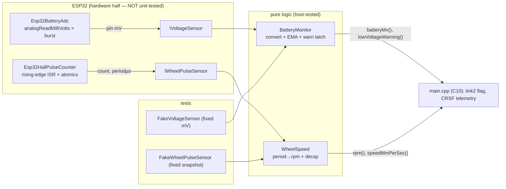

# C7 — Telemetry Sensors

**Batch C7 of the source-code campaign** (see `../../source_code_explanation_plan.md`).
The car has two physical sensors: a **battery-voltage divider** (into an ADC pin) and a
**Hall-effect wheel-speed pickup** (a magnet + an interrupt). C7 is the software that
turns their noisy, raw signals into clean numbers — smoothed battery millivolts + a
latching low-voltage warning, and a wheel RPM computed from pulse *periods*. It's the
concurrency deep-end of the control firmware: the Hall input runs in an **interrupt** and
crosses into the main loop through **atomics**.

> **C10 resolution note (2026-07-05).** The wiring items are now source-verified in
> `main.cpp` (see `10_main_integration.md` §2.7, §4.6, §4.8, §11): ADC on GPIO34 / Hall on
> GPIO35 as designed; `sample()` called at exactly 100 ms (the cadence the EMA-shift tau math
> assumes) and `update()` once per 50 Hz tick; and "monitoring only" is now a **whole-program**
> fact — the low-voltage warning's sole consumer is the link2 `lowBattery` flag; no code path
> reduces or cuts throttle. Electrical claims (eFuse cal #30, Hall EMI #31) remain hardware.

**Two framing points to hold:**
1. *These modules are monitoring-only.* `BatteryMonitor` never cuts power (CLAUDE.md §6.4:
   "warn, never cut"); `WheelSpeed` just reports a number. Neither commands an output. The
   RPM feeds the ERS harvest gate (C6) and the link2/telemetry reports; the battery
   warning feeds a flag. So there is no "safety actuation" here to over-claim.
2. *There is no current sensor.* The project measures battery **voltage** only. (The CRSF
   battery frame in C4 has a "current" field, but it's always sent as 0 — see §5.)

## Scope (files explained here)

| File | Lines | What it is |
|---|---|---|
| `lib/telemetry/include/telemetry/BatteryMonitor.hpp` | 86 | Battery config + monitor class (declaration) |
| `lib/telemetry/src/BatteryMonitor.cpp` | 65 | Divider conversion, EMA smoothing, warning latch |
| `lib/telemetry/include/telemetry/WheelSpeed.hpp` | 61 | Wheel-speed config + class (declaration) |
| `lib/telemetry/src/WheelSpeed.cpp` | 57 | Period→RPM, plausibility clamp, graceful decay |
| `lib/telemetry_hal_esp32/…/Esp32BatteryAdc.{hpp,cpp}` | 49 | The ESP32 ADC read (hardware) |
| `lib/telemetry_hal_esp32/…/Esp32HallPulseCounter.{hpp,cpp}` | 84 | The Hall **ISR** + atomics (hardware) |
| `test/mocks/FakeVoltageSensor.hpp`, `FakeWheelPulseSensor.hpp` | 28 | Test doubles for the two sensor seams |
| `test/test_telemetry/test_main.cpp` | 286 | 16 tests |

**Prerequisites:** C1 (the `IVoltageSensor` / `IWheelPulseSensor` seams + `WheelPulseSnapshot`
struct — the "chip quirks below the seam" placement, and the "torn read acceptable" note),
C6 (the ERS harvest gate that consumes `rpm`). Referenced, not re-explained.

**Test status: RUN AND PASSING.** `pio test -e native -f test_telemetry` on 2026-07-03 →
**16/16 PASSED** (1.4 s). Behaviours marked **VERIFIED** are backed by that run. **Note:
the two `*_hal_esp32` files (ADC + Hall ISR) are excluded from the native tests** (they
include `<Arduino.h>`), so their real electrical/timing behaviour is **PROVISIONAL** —
verified only at the bench (D8 Phase 8; open questions #30, #31).

---

## 0. The two seams, and which half is tested



This is the C1 seam pattern again: the pure modules are exercised by fakes; the real ADC
and ISR are the untested "other half." So everything about *numbers* is VERIFIED by tests;
everything about *electrical reality* (ADC accuracy, EMI, interrupt timing) is PROVISIONAL.

---

## 1. `BatteryMonitor.hpp` — config + the monitoring contract

### Lines 9–43: `BatteryConfig` (mind every unit)
```cpp
struct BatteryConfig {
    uint16_t dividerNum = 37;      // Vbat = Vpin * (27k+10k)/10k = Vpin * 37/10
    uint16_t dividerDen = 10;
    uint16_t calibrationPpt = 1000;// multimeter trim, parts-per-thousand (1000 = ×1.000)
    uint8_t  emaShift = 3;         // EMA smoothing as a power of two (tau ~0.8s at 100ms)
    uint16_t warnMv = 7000;        // low-voltage threshold (3.5 V/cell on 2S)
    uint32_t warnDelayMs = 3000;   // must stay below warnMv this long to latch
    uint16_t warnClearHysteresisMv = 400; // clears only above warnMv + this
    constexpr bool valid() const { ... }
};
```
Units, spelled out (the task asks for care here):
- **The divider ratio `37/10 = 3.7`.** The physical divider is 27 kΩ (battery→node) + 10 kΩ
  (node→GND), so the pin sees `Vbat × 10/37`, and we scale *back up* by `37/10`. `dividerNum
  = 27+10 = 37`, `dividerDen = 10`. **VERIFIED** (matches CLAUDE.md §7 / chapter 03 §4).
- **`calibrationPpt` is parts-per-thousand**: 1000 = no trim, 1010 = "read 1% low, multiply
  by 1.010." Trimmed against a multimeter on the bench. **VERIFIED** (defaults) / the *actual
  trim value* is a bench result (open q #30, D8 Phase 8).
- **`warnMv = 7000` mV = 7.0 V = 3.5 V/cell** on a 2S pack — a *loaded* low threshold.
- Everything is millivolts + milliseconds; there is **no current, no wattage** — voltage
  only.
- **`valid()` includes two overflow guards** (unusual and worth noting):
  ```cpp
  3300ull * dividerNum * calibrationPpt <= 0xFFFFFFFFull &&          // fits uint32
  (3300ull * dividerNum * calibrationPpt) / (dividerDen * 1000ull) <= 0xFFFFull  // fits uint16
  ```
  `3300` is the max pin mV; the check proves the §2 conversion `pinMv × dividerNum ×
  calibrationPpt` can't overflow `uint32_t`, and the battery result fits `uint16_t`. The
  **`ull` suffix** forces the *check itself* to compute in 64-bit so it can't overflow while
  testing for overflow. A compile-time-checkable guard (`static_assert`ed in C10). **VERIFIED**
  (`test_battery_config_valid_rejects_bad_values`).

### Lines 45–84: the class + the "monitoring only" contract
- `sample(nowMs)` (call ~every 100 ms), `batteryMv()` (smoothed, 0 until first sample),
  `lowVoltageWarning()` (latching). **The warning is advisory** — the comment and CLAUDE.md
  §6.4 stress "warn, never cut." Unlike failsafe, a low battery never stops the car.
  **VERIFIED** (the class only reports; nothing here actuates).
- **`setConfig`** (bench tuning, C9): if `emaShift` changes, it forces a re-seed (`seeded_ =
  false`) because the accumulator's scale would be stale; a `calibrationPpt` change just
  converges over the EMA. **VERIFIED** (code) / console wiring is C9.
- Private state: `seeded_`, `emaAccumulator_` (battery mV **scaled by 2^emaShift**),
  `warning_`, `belowSince_`, `belowSinceMs_`.

---

## 2. `BatteryMonitor.cpp` — conversion, EMA, warning

### Lines 8–16: `convertPinToBatteryMv` — one rounded combined division
```cpp
uint16_t convertPinToBatteryMv(uint16_t pinMv) const {
    const uint32_t numerator   = pinMv * dividerNum * calibrationPpt; // all widened to uint32
    const uint32_t denominator = dividerDen * 1000u;                  // = 10000 by default
    return (numerator + denominator / 2) / denominator;              // round-half-up
}
```
- **Battery mV = `pinMv × (dividerNum/dividerDen) × (calibrationPpt/1000)`**, done as **one
  division** rather than two: the comment notes "chaining two truncating divides (divider
  first, trim second) would lose up to ~4 mV." So both scalings are multiplied into the
  numerator, and one `denominator = dividerDen × 1000` divides once.
- **`+ denominator/2` is round-half-up** (add half a divisor before the integer divide).
- Worked (**VERIFIED** `test_battery_divider_conversion`): `pinMv = 2270`, defaults →
  `numerator = 2270 × 37 × 1000 = 83,990,000`; `denominator = 10,000`;
  `(83,990,000 + 5000)/10,000 = 83,995,000/10,000 = 8399` → **8399 mV ≈ 8.4 V**. Matches the
  "8.4 V reads ~2270 mV at the pin" design point.
- With trim (**VERIFIED** `test_battery_calibration_trim`): `calibrationPpt = 1010`, `pinMv
  = 2270` → `(2270 × 37 × 1010 + 5000)/10000 = 84,834,900/10000 = 8483` mV.
- **This is where the ADC's units become the battery's units.** Everything upstream (§7 ADC)
  is *pin* millivolts; everything downstream is *battery* millivolts.

### Lines 18–25 + 27–41: the scaled-accumulator EMA (a real subtlety)
An **EMA** (exponential moving average) smooths noise by blending each new sample into a
running average. This code uses a **scaled-accumulator** form, and the choice matters.
```cpp
uint16_t batteryMv() const {                 // rounded readout
    return (emaAccumulator_ + (1u << (emaShift - 1))) >> emaShift;  // (acc + half) / 2^shift
}
void sample(uint32_t nowMs) {
    const uint16_t s = convertPinToBatteryMv(sensor_.readPinMillivolts());
    if (!seeded_) {
        emaAccumulator_ = s << emaShift;     // SEED: acc = s × 2^shift  → readout == s exactly
        seeded_ = true;
    } else {
        emaAccumulator_ += s - (emaAccumulator_ >> emaShift);  // acc += sample − acc/2^shift
    }
    ... // warning logic below
}
```
- **`emaAccumulator_` holds the average × 2^emaShift** (with `emaShift = 3`, ×8). The readout
  `batteryMv()` divides back down with round-half-up (`+ 1<<(shift-1)`).
- **Seed from the first sample** (`acc = s << shift`) so `batteryMv()` is *exact immediately*
  — no "climb from zero" boot artifact that would both misreport voltage and fire a spurious
  low-voltage warning for the first second. **VERIFIED** (`test_battery_ema_seeds_from_first_
  sample`: first sample → exact `7400`, warning false; and `batteryMv() == 0` before any
  sample).
- **Why the `acc += sample − (acc >> shift)` form (not the "naive" `(avg×(2^s−1)+sample)>>s`).**
  The naive EMA re-truncates the average every tick, so against a *rising* input it can
  **stall up to `2^shift − 1` counts below** the true value forever. The scaled-accumulator
  form keeps full resolution in `acc` and converges **exactly**. **VERIFIED**
  (`test_battery_ema_converges_exactly_upward`: seed 6660, then step to 8140, sample for
  ~10 s → `batteryMv() == 8140` **exactly**). This is a genuine numerical-correctness point,
  not cosmetic.
  - *Convergence sketch:* at the target, `sample == acc >> shift`, so `acc += sample − sample
    = acc` — a fixed point; approaching from below, each step adds a shrinking positive delta
    that reaches the target and then adds 0.

### Lines 43–63: the latching low-voltage warning (time-qualified + hysteresis)
```cpp
const uint16_t smoothed = batteryMv();
if (warning_) {                                      // already warned:
    if (smoothed > warnMv + warnClearHysteresisMv) { // clear only above 7400
        warning_ = false; belowSince_ = false;
    }
    return;
}
if (smoothed < warnMv) {                             // below 7000:
    if (!belowSince_) { belowSince_ = true; belowSinceMs_ = nowMs; }   // start the clock
    else if (nowMs - belowSinceMs_ >= warnDelayMs) warning_ = true;    // sustained ≥3s → latch
} else {
    belowSince_ = false;                             // recovered before 3s → it was sag, reset
}
```
Three defenses, all on the **smoothed** value (chapter 10 §5):
1. **Time qualification.** The warning latches only after the smoothed voltage stays below
   `warnMv` **continuously for `warnDelayMs` (3 s)**. A throttle-stab sag that dips under for
   a second and recovers resets `belowSince_` and never warns. **VERIFIED**
   (`test_battery_warning_requires_sustained_low`: below for >3 s → latches;
   `test_battery_brief_sag_does_not_warn`: a ~1.5 s dip → no warning).
2. **Latch.** Once set, `warning_` stays set until explicitly cleared — it doesn't flicker
   with the voltage.
3. **Hysteresis clear.** It clears only when smoothed rises **above `warnMv + 400` (7400)** —
   "sag recovery is often > 200 mV." Recovering only into the 7000–7400 band keeps the
   warning on. **VERIFIED** (`test_battery_warning_clears_only_above_hysteresis`: recover to
   7215 → still warned; recover to 8140 → clears).
- **The measured value never actuates.** The worst it does is set a bool. **VERIFIED.**

---

## 3. `WheelSpeed.hpp` / `.cpp` — RPM from pulse *periods* (mind µs vs ms)

### Config (`WheelSpeedConfig`)
```cpp
uint8_t  magnetsPerRev = 1;         // one axle magnet → one pulse per wheel revolution
uint16_t wheelCircumferenceMm = 201;// 64 mm-OD F104 tyre ≈ 201 mm rolling circumference
uint16_t zeroSpeedTimeoutMs = 1500; // no pulse this long → report 0
uint16_t maxPlausibleRpm = 5000;    // above this = EMI/glitch, clamp
```
- **`magnetsPerRev = 1`**: one magnet on the axle → one Hall pulse per revolution (CLAUDE.md
  §7). **VERIFIED** (default). **`wheelCircumferenceMm = 201`**: used only by
  `speedMmPerSec`. **`maxPlausibleRpm = 5000`**: the plausibility clamp. The source comment
  puts the car's real top speed at ~55 rev/s (≈ 3300 rpm); the clamp sits *above* that, at
  5000 rpm (≈ 83 rev/s), so a period implying more than 5000 rpm is EMI/glitch, not motion
  (chapter 03 §10). **VERIFIED**
  (defaults) / real EMI behaviour is a bench item (open q #31).

### The two speed conversions (units are the trap here)
```cpp
uint16_t speedMmPerSec() const {
    return reportedRpm_ * wheelCircumferenceMm / 60;  // rev/min × mm/rev ÷ 60 s/min = mm/s
}
```
- **VERIFIED** (`test_wheel_rpm_from_pulse_period`: 3000 rpm × 201 mm / 60 = **10050 mm/s**).

### `update` — period→RPM, plausibility clamp, graceful decay
```cpp
void WheelSpeed::update(uint32_t nowMs) {
    const WheelPulseSnapshot s = sensor_.read();   // {count, lastPeriodMicros}

    if (!seeded_) { seeded_ = true; lastCount_ = s.count; lastPulseSeenMs_ = nowMs; return; }

    if (s.count != lastCount_) {                   // ── a NEW pulse since last update ──
        lastCount_ = s.count; lastPulseSeenMs_ = nowMs;
        if (s.lastPeriodMicros != 0) {             // (0 until two edges exist)
            const uint32_t revPeriodMicros = s.lastPeriodMicros * magnetsPerRev;
            uint32_t rpm = 60000000u / revPeriodMicros;      // µs/min ÷ µs/rev = rev/min
            if (rpm > maxPlausibleRpm) rpm = maxPlausibleRpm; // EMI clamp
            measuredRpm_ = rpm;
        }
        reportedRpm_ = measuredRpm_;
        return;
    }

    // ── no new pulse: graceful decay ──
    const uint32_t elapsedMs = nowMs - lastPulseSeenMs_;
    if (elapsedMs >= zeroSpeedTimeoutMs) { measuredRpm_ = 0; reportedRpm_ = 0; return; }
    if (elapsedMs > 0) {
        const uint32_t impliedCeilingRpm = 60000u / (elapsedMs * magnetsPerRev); // ms/min ÷ ms
        if (impliedCeilingRpm < reportedRpm_) reportedRpm_ = impliedCeilingRpm;
    }
}
```
Line by line, with the unit care the brief demands:

- **First update only seeds** (like C1's `everReceivedFrame_`): the counter may already be
  nonzero (the wheel spun before construction), so the first update records the count without
  computing a speed — no bogus startup spike. **VERIFIED** (`test_wheel_first_update_seeds_
  without_spike`: snapshot `{500, 20000}` → rpm 0).
- **New pulse ⇒ RPM from the *measured period*.** `lastPeriodMicros` is in **microseconds**.
  `revPeriodMicros = period × magnetsPerRev` is the time for one full revolution. **`rpm =
  60,000,000 / revPeriodMicros`** — the `60,000,000` is **microseconds per minute** (60 s ×
  1,000,000 µs). So a 20,000 µs (20 ms) period at 1 magnet = `60,000,000 / 20,000 = 3000
  rpm`. **VERIFIED** (`test_wheel_rpm_from_pulse_period`). Period-based (not counts-per-tick)
  is exact at any update cadence — the C1 `IWheelPulseSensor` rationale (chapter 10 §5).
- **First-ever edge has no period** (`lastPeriodMicros == 0` until two edges exist): keep the
  previous value (0). **VERIFIED** (`test_wheel_first_ever_edge_has_no_period`: `{1, 0}` →
  rpm 0).
- **Plausibility clamp.** A 6000 µs period claims `60,000,000/6000 = 10000 rpm` → clamped to
  `maxPlausibleRpm = 5000`. That's EMI, not motion. **VERIFIED** (`test_wheel_implausible_
  period_is_clamped`).
- **Graceful decay — a different constant, `60,000` (ms/min).** When *no* new pulse arrives,
  the wheel might be slowing, so the report is capped by "if it were still turning that fast,
  we'd have seen a pulse by now": with `elapsedMs` since the last pulse, the speed is **at
  most `60,000 / (elapsedMs × magnetsPerRev)` rpm** — here `60,000` is **milliseconds per
  minute** (because `elapsedMs` is in ms, unlike the period which is in µs). **Watch this:
  the same "rpm from a time" idea uses 60,000,000 for a µs period and 60,000 for an ms
  elapsed — different units, different constant.** The ceiling only ever *lowers*
  `reportedRpm_` (the `if (impliedCeilingRpm < reportedRpm_)` guard), so it decays smoothly
  instead of holding then dropping to 0. **VERIFIED** (`test_wheel_decays_gracefully_while_
  silent`: from 600 rpm, at +200/+500/+1000 ms → 300/120/60, then timeout → 0):

  | elapsedMs | ceiling = 60000/elapsedMs | reportedRpm_ |
  |---|---|---|
  | 200 | 300 | 300 |
  | 500 | 120 | 120 |
  | 1000 | 60 | 60 |
  | 1500 (≥ timeout) | — | **0** |
- **Timeout hard-zero** at `zeroSpeedTimeoutMs = 1500` truncates the asymptotic tail.
  **VERIFIED** (`test_wheel_zero_speed_after_timeout`).
- **A late real pulse resets to its true (long) period.** After decaying to 200, a pulse with
  a 300 ms period → `60,000,000/300,000 = 200 rpm`. **VERIFIED** (`test_wheel_new_pulse_after_
  decay_reports_true_period`).
- All time deltas use **unsigned subtraction** (`nowMs - lastPulseSeenMs_`), the same
  `millis()`-wraparound-safe idiom as C1/C2/C4 (correct given a monotonic clock).

---

## 4. `Esp32HallPulseCounter` — the ISR + atomics (the concurrency deep-end)

This is the hardware half of the wheel sensor, and the most concurrency-sensitive file in
the control firmware. It is **excluded from the native tests** (includes `<Arduino.h>`), so
everything here is source-verified + reasoned, **not** unit-tested.

### The data + the concurrency model (header)
```cpp
std::atomic<uint32_t> count_{0};        // written by ISR, read by loop()
std::atomic<uint32_t> lastPeriodUs_{0}; // written by ISR, read by loop()
uint32_t lastEdgeUs_ = 0;               // ISR-only
bool     edgeSeen_ = false;             // ISR-only
```
- **An interrupt (ISR)** is code the hardware runs *immediately* when an event happens (here:
  a rising edge on the Hall pin), pausing `loop()` mid-instruction. So `count_`/`lastPeriodUs_`
  can be written by the ISR *at any moment*, including while `loop()` is reading them via
  `read()`. That's a classic **shared-data race**.
- **`std::atomic<uint32_t>`** makes each 32-bit read/write **indivisible** — `loop()` can
  never observe a *half-written* value (a "torn read"). This is the correct tool; it's the
  same idea as the soundlight cross-core atomic (chapter 07 §6), here between ISR and loop
  rather than between cores.
- **Why `std::memory_order_relaxed`.** Relaxed = "guarantee atomicity, but no ordering
  fences between different atomics." That's exactly enough here: `count_` and `lastPeriodUs_`
  are independent single words, and the C1 `IWheelPulseSensor` contract *already* documents
  that the pair "may rarely be torn" (count one edge newer than period) and that the consumer
  (WheelSpeed) clamps implausible values. So no cross-variable ordering is needed, and relaxed
  is the cheapest atomic — on the ESP32's Xtensa core an aligned 32-bit access is naturally
  atomic anyway, so this is essentially free. **VERIFIED** (the code uses relaxed) / that
  "torn is acceptable" is the design judgement flagged PROVISIONAL in C1, still bench-relevant.
- **Why atomic and NOT `volatile`** — the header says it outright ("no volatile-data-race
  ambiguity"). A common C/C++ misconception is that `volatile` makes ISR-shared data safe. It
  does **not**: `volatile` prevents the *compiler* from caching/eliding a read, but provides
  **no atomicity and does not prevent a data race** (which is undefined behaviour in C++).
  `std::atomic` provides both. `volatile` is for memory-mapped hardware registers; `atomic`
  is for concurrency. This is an important teaching point. **VERIFIED** (the file uses atomic).
- **`lastEdgeUs_` / `edgeSeen_` are ISR-only** — touched *only* inside `onEdge()`, never by
  `loop()`. Same-source GPIO interrupts don't re-enter themselves, so these need no atomicity;
  plain `uint32_t`/`bool` is correct. **VERIFIED** (only referenced in `onEdge`).

### `begin` + the trampoline (the .cpp)
```cpp
void begin() {
    pinMode(pin_, INPUT);                 // input-only GPIO35, EXTERNAL 10k pull-up (no internal)
    attachInterruptArg(digitalPinToInterrupt(pin_), &isrTrampoline, this, RISING);
}
static void IRAM_ATTR isrTrampoline(void* arg) {
    static_cast<Esp32HallPulseCounter*>(arg)->onEdge();
}
```
- **`pinMode(pin_, INPUT)` with no internal pull** — GPIO35 is input-only and has no internal
  pull-ups anyway; the Hall line's pull-up is the external 10 kΩ to 3.3 V (C1 §3.2, chapter 03
  §5). **VERIFIED** (comment + `INPUT`).
- **The trampoline pattern.** `attachInterruptArg` wants a plain C function pointer
  `void(*)(void*)` — a non-static C++ member function can't be one. So a **static** function
  receives `this` as the `arg` and forwards to the member `onEdge()`. Standard "callback into
  an object" idiom. **VERIFIED.**
- **`IRAM_ATTR`** places the ISR (and trampoline) in RAM, not flash. Required because during a
  flash operation (e.g. an NVS settings write, C9) the flash cache is disabled, and executing
  an ISR from flash then would crash the chip. The comment states this. **VERIFIED** (attribute
  present).
- **`RISING`** — count low→high transitions (the magnet leaving, through the pull-up), matching
  the C1 contract and the Wokwi "counts on release" model (chapter 05 §9 / 11 §5).

### `onEdge` — debounce, period, count
```cpp
void IRAM_ATTR onEdge() {
    const uint32_t nowUs = micros();
    if (edgeSeen_ && (nowUs - lastEdgeUs_) < kLockoutUs) return;   // 2ms lockout: EMI/bounce
    if (edgeSeen_) lastPeriodUs_.store(nowUs - lastEdgeUs_, relaxed); // period between edges
    lastEdgeUs_ = nowUs;
    edgeSeen_ = true;
    count_.fetch_add(1, relaxed);                                   // atomic increment
}
```
- **The 2 ms lockout (`kLockoutUs = 2000`).** Edges closer than 2 ms are ignored as EMI/bounce
  — real pulses are ≥ 18 ms apart at the car's top speed, so 2 ms is a **9× margin**. The
  header explains *why* the input is glitchy: the A3144's electrical edge is slow (10 kΩ
  pull-up into wiring capacitance), GPIO35 has no Schmitt trigger, and ESC EMI can ride a slow
  edge and double-count. This is the software layer of the layered EMI defense (chapter 03 §10,
  ROADMAP D5). **VERIFIED** (the lockout code) / real EMI rejection is a bench item (open q #31,
  D8 Phase 8 — scope the line at full throttle, add 1–10 nF if ugly).
  > **The lockout and the plausibility clamp are two *different* thresholds — and neither is a
  > verified EMI guarantee (PROVISIONAL / hardware).** Convert each to a pulse *period* (1
  > magnet):
  > - The `5000` rpm plausibility clamp (WheelSpeed, §3) corresponds to a period of
  >   `60,000,000 / 5000 = 12,000 µs = 12 ms`, and **5000 rpm = ~83.3 rev/s**.
  > - The source comment separately estimates the car's **real top speed at ~55 rev/s ≈ 3300
  >   rpm** (~18 ms period). So the top-speed estimate (~55 rev/s) and the clamp value (5000 rpm
  >   = ~83.3 rev/s) are **not the same physical threshold** — the clamp sits *above* top speed.
  > - The **2 ms ISR lockout is much looser than the 5000 rpm clamp**: 2 ms =
  >   `60,000,000 / 2000 = 30,000` rpm-equivalent, so the ISR only *hard-rejects* edges implying
  >   **> 30,000 rpm** (closer than 2 ms). An EMI edge landing **2–12 ms** after a real one
  >   *passes* the lockout and is counted as a real pulse; WheelSpeed then only caps the
  >   *reported* rpm at 5000 — it does **not** un-count the spurious edge or restore the true
  >   period. So **the 2 ms lockout does not by itself reject all EMI edges between the clamp
  >   period (12 ms) and the lockout period (2 ms)**; those two layers overlap only partially.
  > - Treat this as a **hardware-validation item, not a verified physical guarantee** — whether
  >   such residual EMI actually occurs, and whether a snubber cap is needed, is bench-only
  >   (open q #31, D8 Phase 8; the layered defense in chapter 03 §10).
- **Period then count.** If a previous edge exists, store `nowUs − lastEdgeUs_` as the period;
  then update `lastEdgeUs_`, and `fetch_add(1)` the count. `fetch_add` is an atomic
  read-modify-write increment. **VERIFIED** (code).
- **`read()`** loads both atomics (relaxed) into a `WheelPulseSnapshot` — the value `WheelSpeed`
  consumes. **VERIFIED** (matches the C1 seam).

---

## 5. `Esp32BatteryAdc` — the ADC read (hardware)

```cpp
void begin() { analogSetPinAttenuation(pin_, ADC_11db); }        // 0..~2450 mV usable
uint16_t readPinMillivolts() override {
    uint32_t sumMv = 0;
    for (int i = 0; i < kReadsPerSample; ++i) sumMv += analogReadMilliVolts(pin_); // burst of 4
    return sumMv / kReadsPerSample;                               // average
}
```
- **`analogReadMilliVolts`** (not raw `analogRead`) — the eFuse-calibrated read that returns
  *millivolts* and handles the ESP32 ADC's nonlinearity **below** the `IVoltageSensor` seam
  (exactly the "chip quirks below the seam, board divider above it" split from C1 §3.2).
- **11 dB attenuation** extends the usable input range to ~0–2450 mV, chosen so the divider's
  ~2270 mV (at 8.4 V) sits comfortably inside it (chapter 03 §4). **VERIFIED** (comment / the
  constant `ADC_11db`).
- **Burst-average of 4 reads** because the divider's ~7.3 kΩ source impedance makes single
  ESP32 ADC reads noisy (chapter 03 §4, the 100 nF cap is the hardware half of the same fix).
  **VERIFIED** (the loop).
- **PROVISIONAL / hardware:** the real accuracy needs the bench **two-point calibration**
  (~6.5 V and 8.4 V vs a multimeter → set `calibrationPpt`), and logging which eFuse cal type
  the chip reports (open q #30, D8 Phase 8). This file is excluded from the native tests, so
  none of its electrical behaviour is test-backed.
- **No current.** There is no current-sense hardware or reading anywhere — the CRSF battery
  telemetry frame's "current" field (C4) is populated with 0.

---

## 6. The fakes + the tests (16 tests)

- **`FakeVoltageSensor`** returns a settable `pinMillivolts`; **`FakeWheelPulseSensor`** returns
  a settable `snapshot{count, lastPeriodMicros}`. These are the "other half" of the two seams
  for tests — they replace the ADC and the ISR with plain fields, so the pure modules run on
  the host. **VERIFIED** (trivial doubles).
- Coverage (all **VERIFIED (ran)**, 16/16): battery conversion + trim; EMA seed + exact upward
  convergence; the warning's sustained-low latch, brief-sag rejection, and hysteresis clear;
  battery `valid()`; wheel seed-without-spike, period→rpm + mm/s, first-edge-no-period,
  plausibility clamp, timeout-zero, graceful decay, late-pulse-true-period, wheel `valid()`.
- **What the tests do NOT cover:** anything in the two `*_hal_esp32` files — the ADC read, the
  interrupt, the atomics, the debounce, the EMI. Those are hardware-only.

---

## 7. VERIFIED / INFERRED / PROVISIONAL summary

**VERIFIED** (code + the 2026-07-03 run):
- Battery: `Vbat = pinMv × 37/10 × ppt/1000` via one round-half-up division (8399 mV at 2270
  pin mV); scaled-accumulator EMA seeded from the first sample and converging *exactly* upward;
  warning latches only after 3 s continuously below 7000 mV, ignores brief sag, clears only
  above 7400 mV; overflow-guarded `valid()`; monitoring-only (never actuates).
- Wheel: first update seeds without a spike; RPM = `60,000,000 / (periodµs × magnets)`
  (3000 rpm at 20 ms); mm/s = `rpm × circ / 60`; first-edge-no-period keeps prior value;
  plausibility clamp at 5000; graceful decay ceiling `60,000 / elapsedMs`; hard-zero at 1500
  ms; late pulse reports its true period.
- HAL (source-verified, not run): the Hall ISR uses `std::atomic` (relaxed) for the ISR↔loop
  shared count/period, `IRAM_ATTR`, the trampoline+`this` pattern, a 2 ms debounce lockout, and
  external-pull-up `INPUT`; the ADC uses calibrated `analogReadMilliVolts` at 11 dB with a
  4-read burst average. That these are the correct *mechanisms* is VERIFIED from source.

**INFERRED** (reasoning atop code/comments):
- The µs-vs-ms constant explanation (`60,000,000` for a µs period, `60,000` for ms elapsed) —
  derived from the code + units; consistent with the tests.
- "relaxed atomics are free on Xtensa aligned 32-bit access" — standard ESP32 knowledge behind
  the comment's "lock-free single-word accesses."
- The volatile-vs-atomic teaching point — standard C++ concurrency, matching the header's claim.

**PROVISIONAL** (not test-backed; bench / hardware):
- **All electrical/timing reality**: real ADC accuracy (needs the two-point calibration → the
  actual `calibrationPpt`), real EMI rejection (scope the Hall line at full throttle), actual
  interrupt latency and that the 2 ms lockout suffices, and that atomics behave as reasoned on
  the physical chip. Open questions #30 (ADC cal) and #31 (Hall EMI); D8 Phase 8.
- That `main.cpp` (C10) calls `sample()`/`update()` at the intended cadences and routes
  `batteryMv()`/`lowVoltageWarning()`/`rpm()` into link2 + CRSF telemetry (C8/C4) and the ERS
  harvest gate (C6).

---

## 8. Cross-references (open questions & risks already on file)

- **`open_questions.md` #30** — ADC two-point calibration + eFuse cal type (D8 Phase 8); C7
  shows where `calibrationPpt` and `analogReadMilliVolts` live.
- **`open_questions.md` #31** — Hall EMI at full throttle (scope, add 1–10 nF); C7 shows the
  software defenses (2 ms lockout + 5000-rpm clamp) that back up the hardware fix.
- **ROADMAP D5** (chapter 05 §1.3) — the telemetry module; C7 is that module. D5's "period not
  counts" and "EMA seeded from first sample" and "IRAM_ATTR ISR with atomics" are all here.
- **C1 back-links** — `IVoltageSensor` (calibrated mV, seam placement) and `IWheelPulseSensor`
  (`WheelPulseSnapshot`, "torn read acceptable"). **C6 forward-link** — `rpm()` gates ERS
  harvest (no motion, no regen). **C4/C8** — `batteryMv`/`rpm` feed the CRSF battery/GPS frames
  and the link2 payload.

No new open questions surfaced by C7.

---

## 9. Understanding questions

1. The pin reads 2270 mV. Show the exact arithmetic `convertPinToBatteryMv` uses (numerator,
   denominator, rounding) to get 8399 mV. Why is it done as *one* division instead of dividing
   by the divider and then by the trim?
2. Why does the EMA **seed** from the first sample instead of starting at 0? Name the *two*
   bad things that a start-at-0 EMA would cause in the first second after boot.
3. The battery dips to 6.3 V for 2 seconds during a hard launch, then recovers to 7.8 V. Does
   `lowVoltageWarning()` latch? Which config value and which member variable decide the answer?
4. RPM is computed as `60,000,000 / periodµs`, but the graceful-decay ceiling uses `60,000 /
   elapsedMs`. Explain why the two constants differ by exactly 1000 — what unit is each "time"
   measured in?
5. `count_` is `std::atomic<uint32_t>` but `lastEdgeUs_` is a plain `uint32_t`. Explain why one
   needs to be atomic and the other doesn't — who writes and who reads each?
6. The header says the code uses `std::atomic`, "no volatile-data-race ambiguity." What does
   `volatile` actually guarantee, what does it *not* guarantee, and why is `atomic` the right
   tool for ISR↔loop sharing?
7. The Hall ISR ignores edges closer than 2 ms. Where does the "2 ms" safety margin come from
   (what is the shortest real pulse period), and what physical effect is it rejecting?
8. Neither `BatteryMonitor` nor `WheelSpeed` can stop the car, even on a low battery. Contrast
   this with the failsafe FSM (C1): why is battery "monitoring only" a deliberate safety
   choice rather than an oversight?

---

*Batch C7 complete. `source_code_progress.md` updated. Awaiting approval before C8
("link2: the outbound protocol").*
