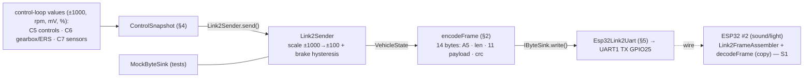

# C8 — link2: The Outbound Protocol

**Batch C8 of the source-code campaign** (see `../../source_code_explanation_plan.md`).
This is the car's *other* radio-free wire: a **one-way UART from ESP32 #1 (control) to
ESP32 #2 (sound/light)** carrying the whole vehicle state 20 times a second. C8 is the
control board's side: the frame format, the encoder/decoder, the byte-stream assembler,
the sender (which scales control-loop units into the wire format and applies brake-light
hysteresis), and the ESP32 UART. It reuses the *exact CRC-8 algorithm* from C3/C4 — on
purpose.

> **C10 resolution note (2026-07-05).** The C10 wiring claims are now source-verified in
> `main.cpp` (see `10_main_integration.md` §2.8, §4.8, §4.9, §11): GPIO25 **is** the pin
> injected into `Esp32Link2Uart`; the sender runs at exactly 20 Hz (50 ms) **unconditionally**
> — the Safe branch has no early return, so frames keep flowing during failsafe; and the
> snapshot's `commandedThrottle` is literally the value passed to `esc.setThrottle()` (sound
> tracks the motor, not the stick). Cross-repo compatibility with the sound/light board
> remains PROVISIONAL until S1's diff-verify.

**A compatibility note up front (the brief stresses this).** The link2 spec is *owned by
this repo*; the sound/light board is documented to copy `lib/link2` **verbatim**. But
this batch reads **only the control-repo files**, so I can VERIFY the format + round-trip
*within this repo* (encode↔decode, golden bytes, CRC cross-check), and the sound/light
receiver's actual decoding of these bytes stays **PROVISIONAL until batch S1 diff-verifies
the copy**. I flag that boundary wherever it matters.

## Scope (files explained here)

| File | Lines | What it is |
|---|---|---|
| `lib/link2/include/link2/Link2Frame.hpp` | 76 | Constants, flag bits, `VehicleState`, `DecodeResult` |
| `lib/link2/include/link2/Link2Codec.hpp` | 45 | `computeCrc8`, `encodeFrame`, `decodeFrame`, `Link2FrameAssembler` (decl) |
| `lib/link2/src/Link2Codec.cpp` | 117 | …the CRC, encode, decode, and 3-state assembler |
| `lib/link2/include/link2/Link2Sender.hpp` | 50 | `ControlSnapshot`, sender config, `Link2Sender` (decl) |
| `lib/link2/src/Link2Sender.cpp` | 52 | ±1000→±100 scaling, brake hysteresis, encode+write |
| `lib/link2_hal_esp32/…/Esp32Link2Uart.{hpp,cpp}` | 46 | UART1 TX-only sink (hardware) |
| `test/mocks/MockByteSink.hpp` | 25 | Test double capturing the written bytes |
| `test/test_link2/test_main.cpp` | 317 | 13 tests (incl. the golden frame) |

**Prerequisites:** C3 (the CRSF `computeCrc8` — link2 duplicates the *same* algorithm),
C4 (the CRSF frame builders + the "big-endian telemetry" contrast — link2 is little-endian),
C5/C6/C7 (the fields link2 carries: throttle/steering/gear/mode from C5/C6, rpm/battery from
C7, ERS from C6). Also chapter 09 §2 (the protocol at spec level — this batch is the code
behind it). Referenced, not re-explained.

**Test status: RUN AND PASSING.** `pio test -e native -f test_link2` on 2026-07-03 →
**13/13 PASSED** (1.8 s). Behaviours marked **VERIFIED** are backed by that run. The
`Esp32Link2Uart` file includes `<Arduino.h>` and is **excluded from the native tests**, so
its electrical behaviour is PROVISIONAL (bench).

---

## 0. The whole shape, and where the bytes come from



link2 is the mirror image of the CRSF *input* side (C3/C4): there the car **parses** an
inbound stream; here it **builds and sends** an outbound one. The values it carries were
all produced by earlier batches — this batch is where they're serialized.

---

## 1. `Link2Frame.hpp` — the wire format (byte order matters)

### Lines 37–49: constants + flag bits
```cpp
inline constexpr uint8_t kStartByte = 0xA5;
inline constexpr uint8_t kProtocolVersion = 1;
inline constexpr size_t  kPayloadLen = 11;
inline constexpr size_t  kFrameLen = 3 + kPayloadLen;   // = 14  (start + length + payload + crc)

inline constexpr uint8_t kFlagBraking     = 1u << 0;    // 0x01
inline constexpr uint8_t kFlagReverse     = 1u << 1;    // 0x02  (reserved, always 0 in v1)
inline constexpr uint8_t kFlagDrsOpen     = 1u << 2;    // 0x04
inline constexpr uint8_t kFlagArmed       = 1u << 3;    // 0x08
inline constexpr uint8_t kFlagFailsafe    = 1u << 4;    // 0x10
inline constexpr uint8_t kFlagLowBattery  = 1u << 5;    // 0x20
inline constexpr uint8_t kFlagErsDeploying= 1u << 6;    // 0x40
```
- **`kFrameLen = 3 + kPayloadLen = 14`.** The "3" = start(1) + length(1) + crc(1); the
  payload is 11 bytes. So a frame is **14 bytes on the wire**. (Note: the header comment at
  the top of the file, and the UART comments in §5, still say "12 bytes" — that's a **stale
  comment** from when the payload was 9 bytes, before the ROADMAP B2.2 amendment grew it to
  11 → frame 14; the *code* `kFrameLen` is authoritative and = 14. Same stale "12" flagged in
  the C1 review of `IByteSink`.) **VERIFIED** (`kFrameLen` value; the test array is 14 bytes).
- **Flag bits are single-bit masks** (`1u << n`, the idiom from C4's `packChannels`). Bit 1
  (`kFlagReverse`) is **reserved and always 0** — the ESC runs forward/brake, so there is no
  reverse (cross-ref C2/C6). **VERIFIED** (each mask; `test_each_flag_bit_pinned`).

### The frame layout, absolute vs payload-relative indices (a beginner trap)
The header comment lists the payload as `[0] version, [1] throttle, …` — those are
**payload-relative** indices. The *code* (§2) writes **frame-absolute** indices, where the
payload starts at byte 2 (after start + length). Keep them straight:

| Frame byte | Field | Type / units | Source batch |
|---|---|---|---|
| 0 | start `0xA5` | — | — |
| 1 | length = 11 | payload byte count | — |
| 2 | version = 1 | — | — |
| 3 | throttlePercent | int8 −100…+100 (**commanded**, not stick) | C5→C6 (post-gearbox/ERS) |
| 4 | steeringPercent | int8 −100…+100 | C5 |
| 5 | flags | bitfield (above) | C5/C6/C7 |
| 6 | gear | uint8, **1-based** display gear | C6 |
| 7–8 | rpm | uint16 **little-endian**, wheel rpm | C7 |
| 9–10 | batteryMv | uint16 **little-endian**, 2S pack mV | C7 |
| 11 | ersPercent | uint8 0…100 | C6 |
| 12 | driveMode | uint8 0/1/2 | C5 |
| 13 | crc8 | over bytes [1..12] (length + payload) | — |

- **Byte order (the brief's focus): link2 multi-byte fields are LITTLE-endian** (low byte
  first) — the *opposite* of the CRSF telemetry frames in C4, which were big-endian. So rpm
  1500 = `0x05DC` is sent as `DC 05` (low, high). Do not carry C4's big-endian habit here.
  **VERIFIED** (§2 + the golden frame).
- **throttlePercent is "what the ESC is ACTUALLY commanded"** (0 while disarmed/failsafe,
  including after ERS boost), so board #2's engine sound tracks the *motor*, not the stick.
  This is the C6→C2 commanded value, not the raw C5 stick. **VERIFIED** (semantics documented;
  the sender feeds `commandedThrottle`, §4).

### Lines 51–66: `VehicleState` (the decoded/target struct) — mind the defaults
```cpp
struct VehicleState {
    int8_t throttlePercent = 0;  int8_t steeringPercent = 0;
    bool braking=false; bool reverse=false; bool drsOpen=false; bool armed=false;
    bool failsafe = true;        // boot-safe default: never report a phantom Active
    bool lowBattery=false; bool ersDeploying=false;
    uint8_t gear = 1;            // 1-based
    uint16_t rpm = 0; uint16_t batteryMv = 0;
    uint8_t ersPercent = 100;    // store starts full
    uint8_t driveMode = 1;       // Gearbox
};
```
- **The defaults are the safe/idle state**: `failsafe = true` (a default/boot frame says
  "I'm in failsafe" — never a phantom "armed and active"), `gear = 1`, `ersPercent = 100`,
  `driveMode = 1`. Same safe-default philosophy as C5's `Controls` and C6. **VERIFIED.**

### Lines 68–74: `DecodeResult`
`Ok / BadStart / BadLength / CrcMismatch / BadVersion`. The comment pins the crucial
ordering guarantee: **CRC is checked before version**, so a corrupted version byte reports
`CrcMismatch`, and `BadVersion` means *exactly* "a well-formed frame from a newer sender"
(§2). Same idea as CRSF's `DecodeResult`, and chapter 09 §2.1. **VERIFIED** (used in §2).

---

## 2. `Link2Codec.cpp` — CRC, encode, decode, assembler

### Lines 5–15: `computeCrc8` — the *same* algorithm as CRSF, duplicated on purpose
```cpp
uint8_t computeCrc8(const uint8_t* data, size_t len) {
    uint8_t crc = 0;
    for (...) { crc ^= data[i];
        for (int bit = 0; bit < 8; ++bit)
            crc = (crc & 0x80) ? (uint8_t)((crc << 1) ^ 0xD5) : (uint8_t)(crc << 1);
    }
    return crc;
}
```
- **Byte-for-byte identical** to `crsf::computeCrc8` (C3 §4.1): bit-by-bit, MSB-first, poly
  `0xD5`, init 0. The header explains the duplication: `lib/link2` must be **liftable
  wholesale into the board-#2 project with no dependency on `lib/crsf`**, so the CRC lives
  here too. So CRC correctness is VERIFIED without hand-computation, on three independent
  legs: (1) the code is **byte-for-byte identical** to `crsf::computeCrc8` (source-verified);
  (2) `test_golden_frame_bytes` pins link2's *own* CRC output directly (byte `0xCE`, §2 below);
  and (3) `test_crc_matches_crsf_implementation` confirms link2 and crsf agree **on the golden
  payload**. (crsf's algorithm is *separately* known-answer-verified against `"123456789"→0xBC`
  in C3 — but that's a **different input**, so the guarantee here rests on the identical code +
  link2's own pinned output, *not* on transitivity through that known-answer test.) I do **not**
  hand-compute a frame CRC (same honesty as C3). **VERIFIED (ran).**

### Lines 17–41: `encodeFrame` — building the 14 bytes
```cpp
out[0] = kStartByte;                 out[1] = kPayloadLen;      out[2] = kProtocolVersion;
out[3] = (uint8_t)state.throttlePercent;   out[4] = (uint8_t)state.steeringPercent;
uint8_t flags = 0;
if (state.braking)      flags |= kFlagBraking;   ... if (state.ersDeploying) flags |= kFlagErsDeploying;
out[5] = flags;                      out[6] = state.gear;
out[7] = (uint8_t)(state.rpm & 0xFF);        out[8]  = (uint8_t)(state.rpm >> 8);        // LE
out[9] = (uint8_t)(state.batteryMv & 0xFF);  out[10] = (uint8_t)(state.batteryMv >> 8);  // LE
out[11] = state.ersPercent;          out[12] = state.driveMode;
out[13] = computeCrc8(out + 1, 1 + kPayloadLen);   // CRC over [length + payload] = bytes [1..12]
return kFrameLen;                    // 14
```
- **Signed → byte:** `(uint8_t)state.throttlePercent` reinterprets an `int8_t` (−100…+100) as
  its raw byte (two's complement), e.g. −25 → `0xE7`. The decoder reverses it. **VERIFIED.**
- **Flags OR-packing:** each true field OR's in its mask; `reverse` is included but the sender
  always sets it false (§4). **VERIFIED** (`test_each_flag_bit_pinned` sets one field at a time
  and checks `frame[5]` equals that single mask).
- **Little-endian split:** `& 0xFF` low byte first, `>> 8` high byte — for both rpm and
  batteryMv. **VERIFIED** (golden frame, §below).
- **CRC span:** `computeCrc8(out + 1, 1 + kPayloadLen)` = 12 bytes = `[length + payload]`
  (bytes 1..12), placed at `out[13]`. **The start byte is excluded** (it's a framing marker,
  not integrity-covered — same as CRSF, chapter 09). **VERIFIED.**

**The golden frame** (`test_golden_frame_bytes`, pinned byte-for-byte and *mirrored in
`docs/link2_protocol.md`* — chapter 09 §2.3, which I decoded by hand there):
```
A5 0B 01 2A E7 4C 03 DC 05 DC 1E 3C 02 CE
│  │  │  │  │  │  │  └──┴ rpm 1500 (LE) │  │  │  └ crc8 0xCE
│  │  │  │  │  │  └ gear 3        └──┴ batt 7900 (LE)  └ driveMode 2
│  │  │  │  │  └ flags 0x4C = drsOpen|armed|ersDeploying (0x04|0x08|0x40)
│  │  │  │  └ steering 0xE7 = −25       └ ersPercent 0x3C = 60
│  │  │  └ throttle 0x2A = +42
│  │  └ version 1
│  └ length 0x0B = 11
└ start
```
- Note the **little-endian** fields read "backwards": `DC 05` = `0x05DC` = 1500; `DC 1E` =
  `0x1EDC` = 7900. **VERIFIED (ran).** The comment on the test is the compatibility keystone:
  *"If this test breaks, the protocol changed and the doc + board #2 must change with it."*
  — the golden frame is the human-maintained contract between this repo, the protocol doc, and
  board #2.

### Lines 43–77: `decodeFrame` — validate, then reassemble (the receiver's job too)
```cpp
if (len < 4)                                 return BadLength;
if (data[0] != kStartByte)                   return BadStart;
if (data[1] != kPayloadLen || len != kFrameLen) return BadLength;
if (computeCrc8(data + 1, 1 + kPayloadLen) != data[kFrameLen-1]) return CrcMismatch;
if (data[2] != kProtocolVersion)             return BadVersion;   // well-formed, just newer
... // then extract fields
out.rpm       = (uint16_t)(data[7] | (data[8]  << 8));  // LE reassemble
out.batteryMv = (uint16_t)(data[9] | (data[10] << 8));
```
- **Validation order: start → length → CRC → version** (the spec's mandated order, chapter 09
  §2.1). Because CRC precedes version, a bit-flip in the version byte is caught as
  `CrcMismatch`, and `BadVersion` provably means "a valid frame from a newer protocol." Two
  tests pin this: corrupt version *without* fixing CRC → `CrcMismatch`; corrupt version *with*
  a recomputed CRC → `BadVersion`. **VERIFIED** (`test_decode_validation_order_crc_before_version`).
- **Little-endian reassembly:** `data[7] | (data[8] << 8)` — low byte OR (high byte shifted up
  8). Mirror of the encode split. **VERIFIED** (`test_encode_decode_roundtrip` round-trips all
  fields, including rpm 65535 and batteryMv 8400).
- **`out` untouched on failure:** every `out.*` write is *after* all checks pass, so a rejected
  frame never corrupts the caller's state. **VERIFIED** (`test_decode_leaves_out_untouched_on_
  failure`: sentinel `gear = 42` survives a CRC failure).
- **This is `decodeFrame`, used by board #2 too** (via the assembler below). So the control
  board contains the *decoder* even though it only *sends* — because the shared `lib/link2` is
  built to be lifted whole into board #2 (which needs the decoder). **VERIFIED** (present) /
  that board #2 uses this exact code is the S1 diff-verify.

### Lines 79–115: `Link2FrameAssembler` — the byte-stream framer (receiver side)
```cpp
switch (state_) {
  case WaitingForStart: if (b != kStartByte) return Incomplete;  // resync marker
                        buffer_[0]=b; bufferLen_=1; state_=ReadingLength; return Incomplete;
  case ReadingLength:   if (b != kPayloadLen) {                  // HARD-REJECT bad length NOW
                            state_=WaitingForStart; bufferLen_=0; return FrameInvalid; }
                        buffer_[1]=b; bufferLen_=2; state_=ReadingBody; return Incomplete;
  case ReadingBody:     buffer_[bufferLen_++]=b;
                        if (bufferLen_ < kFrameLen) return Incomplete;
                        result = decodeFrame(buffer_, bufferLen_, lastState_);
                        state_=WaitingForStart; bufferLen_=0;
                        return result==Ok ? FrameReady : FrameInvalid;
}
```
A 3-state machine mirroring CRSF's assembler (C3), with one link2-specific strictness:
- **The length byte is hard-rejected the instant it isn't 11.** CRSF accepted a *range* of
  lengths (2…64); link2 v1 has exactly one legal length (11), so anything else is rejected
  immediately — "otherwise one corrupt `0xFF` length byte would swallow ~1 s of following
  frames before resync." This implements the spec's mandatory receiver rule (chapter 09 §2.1).
  **VERIFIED** (`test_assembler_hard_rejects_bad_length_byte_immediately`: `0xFF` after start →
  `FrameInvalid` immediately, and a good frame right after still decodes).
- **Resync + the `0xA5`-inside-payload subtlety.** On any failure it returns to
  `WaitingForStart` and waits for the next `0xA5`. But `0xA5` can appear *inside* a payload —
  e.g. `throttlePercent = −91` encodes as byte `0xA5`. If a false sync latches onto such a
  byte, the resulting mis-framed buffer fails CRC and resyncs; the stream recovers within a
  frame or two (same accepted ≤1-frame-loss limitation as CRSF's A9). **VERIFIED**
  (`test_assembler_resyncs_after_corruption_with_start_byte_in_payload`, which feeds exactly
  the `−91`/`0xA5` case).
- Byte-by-byte with `Incomplete` until the 14th byte, then `FrameReady`/`FrameInvalid`.
  **VERIFIED** (`test_assembler_frame_byte_by_byte`).

---

## 3. `Link2Sender` — control-loop units → wire units

### `Link2Sender.hpp`: `ControlSnapshot` + brake-light hysteresis config
```cpp
struct ControlSnapshot {              // everything main.cpp knows at send time, in ±1000 units
    int16_t commandedThrottle = 0;    // what esc.setThrottle() actually received
    int16_t steering = 0; ... uint8_t driveMode = 1;
};
struct Link2SenderConfig {
    int16_t brakeOnBelow = -40;       // brake light ON below -40
    int16_t brakeOffAbove = -20;      // OFF at/above -20
    constexpr bool valid() const { return brakeOnBelow < brakeOffAbove; }
};
```
- **`ControlSnapshot` is in control-loop units (±1000)** — the raw form of the values from
  C5/C6/C7 — while the *wire* uses ±100 percent. The sender is the unit converter. **VERIFIED.**
- **Brake-light hysteresis** on the commanded throttle: a single hard threshold "would flicker
  the brake LED at 20 Hz on stick noise around it," so ON below −40 / OFF at/above −20, holding
  in between. The comment is careful to say this is a *different knob* from ArmGate's ±60
  neutral window (C5) — this one only decides "does the brake light look right," not safety.
  Note `brakeOnBelow = −40` matches the ERS `brakeThreshold` (C6) so the brake light and
  brake-harvest broadly agree. **VERIFIED** (config; behaviour in §below).

### `Link2Sender.cpp`: scale, hysteresis, encode, write
```cpp
int8_t toPercent(int16_t normalized) {           // ±1000 → ±100, clamped
    int16_t percent = normalized / 10;
    if (percent > 100) percent = 100; else if (percent < -100) percent = -100;
    return (int8_t)percent;
}
void Link2Sender::send(const ControlSnapshot& s) {
    if (s.commandedThrottle < config_.brakeOnBelow)       brakingActive_ = true;
    else if (s.commandedThrottle >= config_.brakeOffAbove) brakingActive_ = false;
    // else hold (hysteresis)

    VehicleState st;
    st.throttlePercent = toPercent(s.commandedThrottle);
    st.steeringPercent = toPercent(s.steering);
    st.braking = brakingActive_;   st.reverse = false;   // reserved
    st.drsOpen = s.drsOpen; ... st.driveMode = s.driveMode;

    uint8_t frame[kFrameLen];
    encodeFrame(st, frame);
    sink_.write(frame, kFrameLen);
}
```
- **`toPercent`: divide by 10, clamp ±100.** `420 → 42`, `−250 → −25`. Integer division
  truncates toward zero (loses sub-10 precision — fine for a display percent). **VERIFIED.**
- **The brake hysteresis is a stateful latch** (`brakingActive_`), same shape as C5's switch
  hysteresis: below −40 sets on, at/above −20 sets off, the band holds. **VERIFIED**
  (`test_sender_braking_hysteresis`: −30 (start)→off, −41→on, −30 (band)→holds on, −20→off).
- **`reverse` is always false** (reserved). **VERIFIED.**
- **One `send()` = one encoded frame written to the sink.** `test_sender_writes_one_frame`
  feeds a snapshot equivalent to the golden state (throttle 420→42, steering −250→−25, braking
  off) and asserts the written bytes **equal the golden frame** — closing the loop:
  ControlSnapshot → VehicleState → 14 bytes == the pinned contract. **VERIFIED (ran).**
- **The sender always sends, even in failsafe.** `send()` has no early-return; main.cpp calls
  it at 20 Hz regardless of state (ROADMAP D6, chapter 06 §2.7). A failsafe frame carries
  `failsafe = true` and `throttlePercent = 0` — so board #2 *hears* the failsafe (and shows
  hazards) rather than going silent. That's distinct from board #2's own **staleness** failsafe
  (if the wire is cut, board #2 gets *no* frames and fails safe locally after 500 ms). Two
  independent mechanisms. **VERIFIED** (no early-return) / board #2's staleness handling is S1.

---

## 4. `Esp32Link2Uart` — the TX-only UART (hardware)

```cpp
void begin() { Serial1.begin(115200, SERIAL_8N1, /*rxPin=*/-1, txPin_); }   // TX only
void write(const uint8_t* data, size_t len) override { Serial1.write(data, len); }
```
- **Implements `hal::IByteSink`** (`class Esp32Link2Uart : public hal::IByteSink`) — so
  `Link2Sender` takes a `hal::IByteSink&` and gets the real UART on hardware, a `MockByteSink`
  in tests. **This is a design contrast with C4's `Esp32CrsfUart`, which implemented no
  interface**: the CRSF *builders* were tested standalone and main.cpp wrote their bytes
  directly, but `Link2Sender` *combines* build + write, so it needs a mockable sink to assert
  the exact bytes. The seam exists because the *logic that writes* needs testing. **VERIFIED**
  (it derives from `IByteSink`; `MockByteSink` is the fake half).
- **115200 8N1, TX only (`rxPin = -1`).** The comment: the RX/ack channel (GPIO26) is
  deliberately *not opened* — an open undriven input would collect noise and fire pointless RX
  interrupts; GPIO26 stays reserved (cross-ref C1 `PinMap`, open q #33). **VERIFIED** (the
  `-1`).
- **Baud/format are hardcoded here (VERIFIED); the TX pin is a constructor argument.** Same as
  C4: this file does **not** reference `PinMap` — that main.cpp passes the pin-map's GPIO25 is
  a **C10 wiring claim (PROVISIONAL)**. The comment "remap is mandatory: UART1's default pins
  are the flash pins" is *why* the pin must be set (using UART1's defaults would clobber flash).
- **Stale "12-byte" comment again.** The header says "one 12-byte frame every 50 ms" — the real
  frame is 14 bytes (§1). The *argument* (14 ≪ 128-byte FIFO, drains ~1 ms, never blocks) holds;
  only the number is stale. **VERIFIED** discrepancy; PROVISIONAL that it truly never blocks on
  hardware (bench).
- **Excluded from native tests** (`<Arduino.h>`), so all electrical behaviour is PROVISIONAL.

---

## 5. `MockByteSink` + the test suite (13 tests)

- **`MockByteSink`** captures the last `write()` into a 64-byte buffer (`lastWrite`,
  `lastWriteLen`, `writeCount`), clamping length defensively. It's the fake half of the
  `IByteSink` seam — how tests read the exact bytes the sender produced. **VERIFIED.**
- Coverage (all **VERIFIED (ran)**, 13/13): the golden frame; **CRC == crsf's CRC**; full
  encode↔decode round-trip; each flag bit pinned; decode rejects bad start / bad length / short
  buffer; validation-order CRC-before-version; `out` untouched on failure; assembler byte-by-
  byte; assembler hard-rejects bad length; assembler resync with `0xA5` in payload; sender
  writes one golden frame; sender brake hysteresis.
- **Not covered by tests:** the ESP32 UART (`Esp32Link2Uart`) and — importantly — **the
  sound/light receiver's decoding** (that's a different repo, batch S1). So *within this repo*
  the protocol is thoroughly VERIFIED; *cross-repo* compatibility is PROVISIONAL until S1.

---

## 6. VERIFIED / INFERRED / PROVISIONAL summary

**VERIFIED** (control-repo source + the 2026-07-03 run):
- Frame = 14 bytes `[A5][len=11][11-byte payload][crc8]`; payload layout and field types as
  tabled; multi-byte fields **little-endian** (contrast C4's big-endian CRSF telemetry).
- `computeCrc8` is byte-identical to `crsf::computeCrc8` and cross-checked by test; CRC covers
  `[length + payload]` (start excluded), placed last.
- `encodeFrame` produces the pinned **golden frame**; `decodeFrame` validates start→length→CRC→
  version (so `BadVersion` ⇒ well-formed newer frame), reassembles little-endian, leaves `out`
  untouched on failure; the assembler hard-rejects any non-11 length immediately and resyncs
  (incl. the `0xA5`-in-payload case).
- `Link2Sender` scales ±1000→±100 (÷10 clamp), applies brake-light hysteresis (−40 on / −20
  off, latched), always sends (even in failsafe), and its output equals the golden frame.
- `Esp32Link2Uart` implements `IByteSink`, opens UART1 TX-only at 115200 8N1 (`rx = −1`);
  `MockByteSink` is the test double.

**INFERRED** (reasoning atop code/comments):
- The two-failsafe-mechanisms distinction (the `failsafe` *flag* vs board #2's *staleness*
  timeout) — the flag path is VERIFIED here; the staleness path is board #2 (S1).
- The seam-vs-no-seam design contrast with C4's `Esp32CrsfUart` — the stated rationale.

**PROVISIONAL** (not confirmable from C8 alone; later batches / hardware):
- **Cross-repo compatibility**: that board #2's `lib/link2` is a byte-compatible verbatim copy
  and decodes these exact frames — **VERIFIED only once batch S1 diff-verifies the copy**. The
  design intent (verbatim copy + shared golden frame in the protocol doc) *strongly implies* it,
  but per the strict rule it is not yet VERIFIED-on-both-sides.
- That `main.cpp` (C10) builds the `ControlSnapshot` from the real C5/C6/C7 values, passes
  GPIO25 to the UART, and calls `send()` at 20 Hz.
- The UART's real electrical behaviour (never-blocks, 115200 timing) — bench.

---

## 7. Cross-references (open questions & risks already on file)

- **Chapter 09 §2** — the link2 protocol at spec level; C8 is the code behind it, and the
  golden frame here is the same one decoded by hand there.
- **ROADMAP D6** (chapter 05 §1.3) — the link2 module; the "keeps transmitting during failsafe"
  and "hard-reject bad length" decisions are here in code. **ROADMAP B2.2** — the payload 9→11
  amendment (why `kFrameLen` is 14, not the stale "12" in comments).
- **`open_questions.md` #33** — GPIO26 (the reserved ack RX) is deliberately unopened here
  (`rx = −1`); C8 shows that decision in `Esp32Link2Uart`.
- **C1 back-links** — `IByteSink` (the seam; the "no backpressure, never blocks" rationale and
  the same stale "12-byte" comment). **C3/C4** — the shared CRC-8 and the little-endian-vs-big-
  endian contrast. **C5/C6/C7** — the sources of every field. **S1 forward-link** — diff-verify
  the sound/light copy of `lib/link2` and its `Link2Monitor` staleness failsafe.

No new open questions surfaced by C8. (The stale "12-byte" UART comment is a known,
already-logged cosmetic issue, not a new item.)

---

## 8. Understanding questions

1. A link2 rpm field reads `DC 05` on the wire. What decimal value is that, and why is it *not*
   56,325? Which C4 frame family would decode the same two bytes the other way, and why is link2
   different?
2. `encodeFrame` computes the CRC as `computeCrc8(out + 1, 1 + kPayloadLen)`. Which frame bytes
   does that cover, which one does it deliberately *exclude*, and where is the result stored?
3. The decoder checks CRC *before* version. Construct the two version-byte scenarios that yield
   `CrcMismatch` vs `BadVersion`, and explain why that ordering makes `BadVersion` a trustworthy
   "newer sender" signal.
4. `throttlePercent = −91` encodes as the byte `0xA5` — the same value as the start byte. Why
   doesn't that corrupt the stream, and which test exercises exactly this case?
5. The assembler rejects any length byte that isn't 11 *the moment it arrives*. What failure does
   that prevent, and how does link2's length check differ from CRSF's (C3) — and why?
6. Trace `Link2Sender::send()` for `commandedThrottle = 420`, `steering = -250`, `drsOpen = true`,
   `armed = true`, `failsafe = false`, `ersDeploying = true`, gear 3, rpm 1500, batt 7900, ers 60,
   mode 2. Which 14 bytes come out, and why is the braking flag 0?
7. The car is in failsafe. Does `Link2Sender` stop sending? What does the frame's `failsafe` flag
   and `throttlePercent` read, and how is this different from the *other* failsafe that protects
   board #2 if the wire is cut?
8. This whole batch VERIFIES the protocol *within the control repo*. What single thing must batch
   S1 confirm before we can call the control↔sound-light protocol compatibility VERIFIED rather
   than PROVISIONAL?

---

*Batch C8 complete. `source_code_progress.md` updated. Awaiting approval before C9
("Settings + console").*
