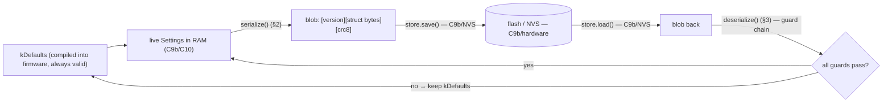

# C9a — Settings: Persistence (the "never-brick" format)

**Batch C9a of the source-code campaign** (the first half of the approved C9 split; see
`../../source_code_explanation_plan.md` and the split note in `../../source_code_progress.md`).
This part covers the **persistence *format*** — the `Settings` struct that bundles the
bench-tunable config, how it's turned into a byte "blob" for flash, and the **guarded load**
that refuses to apply a bad blob. It does **not** cover the tuning console, the NVS flash
store, or the serial I/O — those are **C9b**.

**One-sentence framing:** C9a is *data + format + validation*. There is no live object here,
no flash, no console — just a plain struct, a serializer, and a deserializer with a strict
guard chain. Who *holds* the settings in RAM, who *saves* them to flash, and who *edits* them
is all C9b/C10.

## Scope (files explained here)

| File | Lines | What it is |
|---|---|---|
| `lib/settings/include/settings/Settings.hpp` | 54 | The `Settings` struct, `kDefaults`, blob constants, function declarations |
| `lib/settings/src/Settings.cpp` | 49 | `computeCrc8`, `serialize`, `deserialize` |
| `test/test_settings/test_main.cpp` | 96 | 7 tests |

**`test/mocks/MockSettingsStore.hpp` is NOT explained here** — I checked, and `test_settings`
does not include or use it (it includes only `settings/Settings.hpp` and `crsf/CrsfParser.hpp`).
So the store mock moves to **C9b**, where the actual store seam (`ISettingsStore`) is used.

**Prerequisites (brief reminders below, so you don't need perfect recall):**
- **C2 §1** — `outputs::ServoConfig` (steering endpoints/center/**trim**) and its `valid()`
  (the A11 "trim can't push center past an endpoint" guard).
- **C6 §1** — `gearbox::GearboxConfig` (the gear feel table) and its `valid()` (ranges +
  non-decreasing caps).
- **C7 §1** — `telemetry::BatteryConfig` (divider, **calibrationPpt**, EMA, warn) and its
  `valid()` (ranges + overflow bounds).
- **C3 §4.1 / C8 §2** — the bit-by-bit CRC-8 (poly `0xD5`) used by CRSF and link2.
- **C4/C8** — the `constexpr valid()` + `static_assert` "invalid config can't compile" pattern.

**Test status: RUN AND PASSING.** `pio test -e native -f test_settings` on 2026-07-03 →
**7/7 PASSED** (1.5 s). Behaviours marked **VERIFIED** are backed by that run.

---

## 0. The shape of the problem (and where C9a stops)

The car has some values you tune **on the bench** (steering trim, battery calibration, gear
feel) that should **survive a power cycle**. Storing them means: (a) pack the live values into
a byte buffer ("blob"), (b) write that to flash, (c) on next boot read it back and *decide
whether to trust it*. C9a is (a) and (c)'s *decision logic* — the format and the guard chain.
(b), the actual flash write/read, and the console that edits the values, are **C9b**.



Everything in **grey-boxed** words above (`store.save`, NVS, flash, the live RAM object, the
console) is **C9b/C10/hardware**. The two green functions — `serialize` and `deserialize` — and
the `Settings`/`kDefaults`/blob-constants are C9a.

---

## 1. `Settings.hpp` — the struct, the defaults, the blob format

### Lines 1–8: preamble + the three sub-config includes
```cpp
#pragma once
#include <cstddef>   // size_t
#include <cstdint>   // fixed-width ints

#include "gearbox/Gearbox.hpp"           // gearbox::GearboxConfig  (C6)
#include "outputs/ServoOutput.hpp"       // outputs::ServoConfig     (C2)
#include "telemetry/BatteryMonitor.hpp"  // telemetry::BatteryConfig (C7)
```
- Include-guard + fixed-width-int headers (the C1 basics). New here: this pure library
  **depends on three *other* pure libraries** (`gearbox`, `outputs`, `telemetry`) — it reuses
  their config structs rather than redefining them. That's why `settings/library.json` lists
  `outputs`, `gearbox`, `telemetry` as dependencies (we saw this during the C9 split
  inspection). **VERIFIED** (the includes).

### Lines 17–28: `struct Settings` — the tunable subset + composed `valid()`
```cpp
struct Settings {
    outputs::ServoConfig    steering{};   // C2: min/max/center/trim microseconds
    gearbox::GearboxConfig  gearbox{};    // C6: the gear feel table
    telemetry::BatteryConfig battery{};   // C7: divider/calibrationPpt/EMA/warn

    constexpr bool valid() const {
        return steering.valid() && gearbox.valid() && battery.valid();
    }
};
```
- **`Settings` bundles three config structs** — one each from C2, C6, C7. The `{}` after each
  member is **value-initialization**: each sub-config is default-constructed with *its own*
  defaults (ServoConfig → center 1500 / trim 0 …, GearboxConfig → the 4-gear table,
  BatteryConfig → divider 37/10, calibrationPpt 1000 …). So a fresh `Settings{}` is "the whole
  tunable config at its factory defaults." **VERIFIED.**
- **This is only the *tunable subset*.** The comment is explicit: only "steering, battery
  calibration, gear feel" are here; "ESC endpoints / failsafe / channel map are deliberately
  NOT tunable" (ROADMAP item 6). So the persistable config is a *deliberately chosen slice* of
  the firmware's total config — you can't persist (and therefore can't accidentally corrupt via
  a blob) the safety-critical things like the failsafe timeout or the channel map. **VERIFIED**
  (the struct has exactly these three members; the *rationale* is the documented comment).
- **`constexpr bool valid()` composes the three sub-config `valid()`s with `&&`.** Reminder of
  what each sub-`valid()` enforces (from earlier batches — don't re-derive):
  - `steering.valid()` (C2 §1): endpoints ordered, and the **trimmed** center still strictly
    inside the endpoints (the A11 guard — a trim that shoves center past an endpoint is
    rejected).
  - `gearbox.valid()` (C6 §1): gear count/initial in range, each gear's `maxOutput`/`expo` in
    range, and `maxOutput` **non-decreasing** across gears.
  - `battery.valid()` (C7 §1): `dividerDen != 0`, `calibrationPpt ∈ [900,1100]`, `emaShift ∈
    [1,6]`, positive hysteresis/delay, and the two multiply-overflow bounds.
  - **`constexpr`** means this whole composed check can run *at compile time* — which the next
    lines exploit. **VERIFIED** (the composition; `test_defaults_are_valid` runs it).

### Lines 30–34: `kDefaults` + the composed `static_assert`
```cpp
inline constexpr Settings kDefaults{};
static_assert(kDefaults.valid(), "default Settings are invalid");
```
- **`kDefaults`** is a *compile-time constant* `Settings` at factory values — this is the
  "always-available, always-valid" config **compiled into the firmware binary**. It exists
  independent of any flash. (`inline constexpr` = a shared compile-time constant in a header,
  the C1 §1 idiom.)
- **`static_assert(kDefaults.valid(), ...)`** — a *compile-time* check: if the factory defaults
  were ever edited into something invalid (e.g. a gear table that isn't monotone), **the
  firmware would fail to build** with that message. The comment says this is "the safety net
  that used to live as per-module asserts in main.cpp" — i.e. instead of scattering
  `static_assert(...valid())` per config in `main.cpp`, the *tunable subset*'s check is
  consolidated here as one composed assert. **VERIFIED** (the assert compiles → the defaults are
  valid); whether `main.cpp` *also* still asserts other (non-tunable) configs is a **C10** detail.

### Lines 36–44: the blob format constants + the CRC declaration (read carefully)
```cpp
// Versioned blob format: [version][struct bytes][crc8], CRC over [version + struct bytes].
inline constexpr uint8_t kBlobVersion = 1;
inline constexpr size_t  kBlobLen = 1 + sizeof(Settings) + 1;

uint8_t computeCrc8(const uint8_t* data, size_t len);
```
This is the **on-flash layout**, and it is *different in kind* from the link2/CRSF wire formats
— be precise:
- **The blob is `[version (1 byte)][struct bytes][crc8 (1 byte)]`.** The "struct bytes" are a
  **raw copy of the whole `Settings` struct** (§2), *not* a field-by-field serialization.
- **`kBlobVersion = 1`** — a format version. The comment: "Bump `kBlobVersion` on ANY layout
  change so an old persisted blob fails the version check and falls back to defaults." So the
  version byte is how a *new* firmware refuses an *old* firmware's blob.
- **`kBlobLen = 1 + sizeof(Settings) + 1`** — version(1) + struct + crc(1). **Crucial subtlety:
  `sizeof(Settings)` is a compile-time number the *compiler* chooses** based on the three
  sub-structs' sizes **and their alignment padding**. The source never states it numerically,
  and **neither will I** — it is build/compiler-dependent, and pinning a number would be
  guessing. What matters is the *design consequence* below. **VERIFIED** (`kBlobLen` is defined
  this way); the exact numeric `sizeof` is **not stated by the source** → I don't claim one.
- **`computeCrc8` is declared here, defined in §2** — and yes, it is the *same* poly-`0xD5`
  CRC-8 as CRSF (C3) and link2 (C8), **duplicated a third time**. The comment says why:
  "DUPLICATED here so `lib/settings` stays dependency-light (a test cross-checks it against
  crsf)." I confirm the identity from source + test in §2 — **I do not merely assume it**.

### Lines 46–52: `serialize` / `deserialize` declarations + the guard-order comment
```cpp
size_t serialize(const Settings& s, uint8_t out[kBlobLen]);        // → kBlobLen
bool   deserialize(const uint8_t* data, size_t len, Settings& out);// validation:
//   length -> CRC -> version -> Settings::valid(); true only if ALL pass;
//   on any failure `out` is left untouched (caller keeps kDefaults).
```
- The header *states the guard order up front*: **length → CRC → version → `valid()`**, all
  must pass, and **`out` is untouched on any failure**. §3 shows the code matches exactly.
  **VERIFIED** (in §3).

---

## 2. `Settings.cpp` — CRC, serialize (and *why the layout is a raw struct copy*)

### Lines 7–17: `computeCrc8` — the third copy of the 0xD5 CRC
```cpp
uint8_t computeCrc8(const uint8_t* data, size_t len) {
    uint8_t crc = 0;
    for (size_t i = 0; i < len; ++i) {
        crc ^= data[i];
        for (int bit = 0; bit < 8; ++bit)
            crc = (crc & 0x80) ? (uint8_t)((crc << 1) ^ 0xD5) : (uint8_t)(crc << 1);
    }
    return crc;
}
```
- **Byte-for-byte identical** to `crsf::computeCrc8` (C3 §4.1) and `link2::computeCrc8` (C8 §2):
  init 0, bit-by-bit, MSB-first (`crc & 0x80`), poly `0xD5`, truncate-to-8-bits each step. (If
  the shift/XOR/`& 0x80` mechanics are fuzzy, C3 §4.1 walks a few bit-steps; I don't repeat that
  here.)
- **Is it *really* the same checksum? The source proves it two ways, so this is VERIFIED, not
  assumed** (the batch rule says don't assume without proof):
  1. The code is identical (above).
  2. `test_crc_matches_crsf_implementation` asserts `settings::computeCrc8("123456789") ==
     crsf::computeCrc8("123456789")` — and C3 separately known-answer-verified crsf's on that
     input (`→ 0xBC`). So settings' CRC produces the standard CRC-8/DVB-S2 value there.
  So: **VERIFIED** that settings uses the same `0xD5` CRC-8 — on the basis of identical source +
  the cross-check test (same-input), *not* on transitivity through a different input. It is a
  self-contained *copy* (settings does not depend on `lib/crsf`; the test includes crsf only for
  the cross-check).

### Lines 19–27: `serialize` — version, **raw struct memcpy**, CRC
```cpp
size_t serialize(const Settings& s, uint8_t out[kBlobLen]) {
    out[0] = kBlobVersion;                                   // [version]
    std::memcpy(out + 1, &s, sizeof(Settings));             // [struct bytes] — RAW COPY
    out[kBlobLen - 1] = computeCrc8(out, 1 + sizeof(Settings)); // [crc] over version+struct
    return kBlobLen;
}
```
- **`out[0] = kBlobVersion`** — the version byte first.
- **`std::memcpy(out + 1, &s, sizeof(Settings))`** — this is the important line. `memcpy(dest,
  src, n)` copies `n` raw bytes. Here it copies the **entire `Settings` object's memory
  image** — every member, *including any alignment padding the compiler inserted between them* —
  straight into the blob. This is **not** the field-by-field, little-endian, portable
  serialization that link2/CRSF used (C8 §2). It's a "dump the struct's bytes" approach.
  - **Why that's OK here (the header comment's argument):** "Both writer and reader are the same
    firmware build, so a raw struct copy with natural alignment is deterministic; the version
    byte guards against cross-build layout drift." In plain terms: the *same* firmware that wrote
    the blob will read it back, so whatever byte layout the compiler chose (member order,
    padding) is identical on both ends. If a *different* build (with a changed struct, hence
    different `sizeof`/layout) tried to read it, the length check (`kBlobLen` differs) or the
    version byte or the CRC would catch the mismatch and reject it (§3). **VERIFIED** (the code +
    the guard chain that backs the claim).
  - **Consequence — the blob is NOT a documented/portable wire format.** Unlike the link2 golden
    frame (whose bytes are pinned and shared with board #2), the settings blob's exact bytes are
    *whatever this compiler produced* and are meaningful only to this build. So there is **no
    "golden blob" test pinning exact bytes** — and correctly so. (Contrast C8's golden frame.)
- **`out[kBlobLen - 1] = computeCrc8(out, 1 + sizeof(Settings))`** — the CRC is computed over
  `1 + sizeof(Settings)` bytes = **`[version + struct bytes]`** (i.e. everything except the CRC
  byte itself) and stored in the last byte. **Note the difference from link2/CRSF:** there the
  CRC excluded the framing/start byte; here there is *no* start/framing byte (the blob isn't a
  stream, it's a fixed buffer), so the CRC covers the version byte too — literally "the whole
  blob except its own last byte." **VERIFIED.**
- Returns `kBlobLen`. **VERIFIED** (`test_roundtrip` asserts `serialize(...) == kBlobLen`).

---

## 3. `Settings.cpp` — `deserialize`, the never-brick guard chain

```cpp
bool deserialize(const uint8_t* data, size_t len, Settings& out) {
    if (len != kBlobLen) return false;                               // (1) LENGTH
    const uint8_t receivedCrc = data[kBlobLen - 1];
    if (computeCrc8(data, 1 + sizeof(Settings)) != receivedCrc) return false; // (2) CRC
    if (data[0] != kBlobVersion) return false;                       // (3) VERSION
    Settings candidate;
    std::memcpy(&candidate, data + 1, sizeof(Settings));            // copy into a LOCAL
    if (!candidate.valid()) return false;                            // (4) VALID()
    out = candidate;                                                 // apply ONLY if all passed
    return true;
}
```
The four guards, in order — this is "the never-brick chain":

1. **Length** (`len != kBlobLen`). Rejects: an empty read (**first boot**, `len == 0`), a
   truncated read, or a blob from a build whose `sizeof(Settings)` differs. **Because this check
   is first, `data` is never dereferenced when it's `nullptr`/too short** — the function returns
   before touching `data[...]`. **VERIFIED** (`test_empty_and_truncated_rejected`:
   `deserialize(nullptr, 0, out)` → false, and `deserialize(blob, kBlobLen-1, out)` → false).
2. **CRC** (`computeCrc8(data, 1 + sizeof(Settings)) != data[last]`). Recompute the checksum over
   `[version + struct]` and compare to the stored byte. Rejects **corruption** (a flipped bit
   anywhere in version-or-struct). **VERIFIED** (`test_corrupt_blob_rejected`: flip one struct
   byte → false).
3. **Version** (`data[0] != kBlobVersion`). Rejects a blob whose *format version* differs — an
   **older or newer** firmware's layout. Note this is checked **after** CRC, so a *bit-flip in
   the version byte* is caught as a CRC mismatch (corruption), and a version rejection means a
   *well-formed blob from a different format version* — the same "CRC-before-version ⇒ a version
   rejection is not corruption" logic as link2 (C8 §2). **VERIFIED** (`test_wrong_version_rejected`:
   set version to 0x77 *and recompute the CRC* so CRC passes → still rejected on version).
4. **`valid()`** (`!candidate.valid()`). The bytes are copied into a **local `candidate`**, and
   only if `candidate.valid()` passes is `out` assigned. This catches a blob that is
   *uncorrupted and same-version* but holds **out-of-range values** — e.g. a steering trim of
   30000 that would push center past the endpoint (A11). CRC can't catch that (the bytes are
   "intact", just semantically bad — perhaps written by a buggy edit or an accepted-then-later-
   tightened range). **VERIFIED** (`test_crc_valid_but_out_of_range_rejected`).

- **`out` is untouched on every failure.** Each early `return false` happens *before* `out` is
  written; the only write is the final `out = candidate` after all four pass. So the caller's
  existing `Settings` (which holds `kDefaults`) is never clobbered by a rejected blob.
  **VERIFIED** (`test_corrupt_blob_rejected` plants a sentinel `out.steering.trimMicros = 999`
  and confirms it survives a rejected load).

### What "never-brick" means — and, carefully, what it does NOT mean
**VERIFIED (means):** *the deserialize path can never hand back invalid settings to apply.* Any
blob that is empty, truncated, wrong-length, corrupt, wrong-version, or in-range-failing is
rejected, and the caller keeps the compiled-in, statically-guaranteed-valid `kDefaults`. So the
firmware always runs with a valid tunable config, no matter what garbage is (or isn't) in flash.
That's the "you can't persist a config that bricks the car" guarantee.

**It does NOT mean (be precise):**
- It does **not** mean a bad blob is *repaired or applied* — it means it's *discarded* in favor
  of defaults. (Your saved trim is silently lost if the blob goes bad; that's the safe trade.)
- It does **not** guarantee anything about the *rest* of the firmware bricking (bad code, a
  botched flash of the program image, hardware faults). It's scoped to the **settings-load path
  only**.
- It does **not** prove the flash actually returned these bytes, or that `main.cpp` calls
  `deserialize` and applies its result, or that a `save` actually persisted — those are
  **C9b/C10/hardware** (the `ISettingsStore` + `Esp32NvsStore` + main-loop wiring).
- It is **native-test-proven only for the pure logic** here; NVS wear, partial writes, and real
  flash behaviour are **not** exercised by `test_settings` (see §5). **PROVISIONAL / hardware.**

### RAM settings vs persistent settings; compiled-in vs loaded (the mental model)
- **Compiled into the firmware:** `kDefaults` — a `constexpr` baked into the binary, proven valid
  at compile time. Always present, never read from flash.
- **Loaded from storage:** a blob → `deserialize` → *if it passes all four guards*, its values
  replace the live config; otherwise `kDefaults` stands.
- **RAM ("live") settings vs persistent:** C9a defines the *format* and *validation*. The **live
  RAM `Settings` object** that main.cpp holds, the console that **edits it in RAM** (`set`), and
  the **explicit `save` that writes it to NVS** — that whole lifecycle is **C9b/C10**. C9a is the
  serializer/validator those layers call; it has no state, no store, no console.

---

## 4. `test_settings/test_main.cpp` — every test, every assertion

Includes: `settings/Settings.hpp` (the module) and `crsf/CrsfParser.hpp` (only for the CRC
cross-check). **No `MockSettingsStore`** (so that mock is C9b). `setUp`/`tearDown` are empty
(each test builds its own state). 7 tests, all **PASSED**.

1. **`test_defaults_are_valid`** — `TEST_ASSERT_TRUE(kDefaults.valid())`. The *runtime* echo of
   the compile-time `static_assert`: confirms the factory defaults compose to valid. (If this
   ever failed, the build would already have failed at the `static_assert`.) **VERIFIED (ran).**
2. **`test_roundtrip`** — start from `kDefaults`, change three *valid* fields
   (`steering.trimMicros = 42`, `battery.calibrationPpt = 1015`, `gearbox.gears[0].maxOutput =
   450`), `serialize` into `blob` (assert it returns `kBlobLen`), then `deserialize` (assert it
   returns `true`) and check all three fields come back exactly (`42`, `1015`, `450`). Proves
   **format fidelity**: what you serialize is what you get back. (The three values are chosen to
   stay *valid* — trim 42 keeps center inside endpoints; ppt 1015 ∈ [900,1100]; gear0 max 450 <
   gear1's 600 so still non-decreasing — otherwise guard (4) would reject and the test would
   fail.) **VERIFIED (ran).**
3. **`test_corrupt_blob_rejected`** — serialize `kDefaults`, then `blob[5] ^= 0xFF` (flip a
   struct byte). Plant a sentinel `out.steering.trimMicros = 999`. Assert `deserialize` returns
   `false` **and** the sentinel `999` is *unchanged*. Proves guard (2) (CRC catches corruption)
   **and** the "`out` untouched on failure" property. **VERIFIED (ran).**
4. **`test_wrong_version_rejected`** — serialize `kDefaults`, set `blob[0] = 0x77` (bump the
   version), then **recompute and fix the CRC** (`blob[last] = computeCrc8(blob, 1 +
   sizeof(Settings))`) so the CRC *passes*. Assert `deserialize` still returns `false`. Proves
   guard (3) is **independent of** guard (2): a well-formed, correctly-checksummed blob from a
   different format version is still refused. **VERIFIED (ran).**
5. **`test_empty_and_truncated_rejected`** — `deserialize(nullptr, 0, out)` → `false` (first
   boot: no data — and safe, because the length check returns before dereferencing the null
   pointer); then serialize a good blob and call `deserialize(blob, kBlobLen - 1, out)` → `false`
   (truncated length). Proves guard (1). **VERIFIED (ran).**
6. **`test_crc_valid_but_out_of_range_rejected`** — set `steering.trimMicros = 30000` (invalid:
   trim shoves center past the max endpoint, A11), `serialize` it (so the blob has a **correct**
   CRC for these *invalid* bytes), assert the precondition `s.valid() == false`, then assert
   `deserialize` returns `false`. Proves guard (4): a blob that passes length+CRC+version can
   *still* be rejected for holding out-of-range values — the reason CRC alone isn't enough.
   **VERIFIED (ran).**
7. **`test_crc_matches_crsf_implementation`** — `settings::computeCrc8("123456789") ==
   crsf::computeCrc8("123456789")`. Proves the settings CRC is the *same algorithm* as crsf's
   (which C3 pinned to `0xBC` on this input). **VERIFIED (ran).** This is the source-backed proof
   that lets §2 say "same CRC" rather than assume it.

**The runner** (`main`) runs all 7 `RUN_TEST`s and returns `UNITY_END()`. No hardware, no flash,
no console — pure logic on the host. **VERIFIED (ran; 7/7).**

---

## 5. VERIFIED / INFERRED / PROVISIONAL summary

**VERIFIED** (source + the 2026-07-03 run):
- `Settings` bundles exactly `ServoConfig` (C2) + `GearboxConfig` (C6) + `BatteryConfig` (C7);
  its `valid()` is the `&&` of the three sub-`valid()`s.
- `kDefaults` is a compile-time constant guarded by `static_assert(kDefaults.valid())`.
- Blob layout is `[version][raw struct bytes][crc8]`; `kBlobLen = 1 + sizeof(Settings) + 1`;
  CRC over `[version + struct]`.
- `computeCrc8` is the same `0xD5` CRC-8 as CRSF/link2 (proven by identical source + the
  cross-check test on `"123456789"`), duplicated so `lib/settings` needs no `lib/crsf` dependency.
- `serialize` = version + raw `memcpy` of the struct + CRC, returns `kBlobLen`.
- `deserialize` guard chain **length → CRC → version → valid()**, all-must-pass, `out` untouched
  on any failure; each guard's rejection is individually test-pinned; the length-first order makes
  a null/short buffer safe.
- "Never-brick" = the deserialize path never applies invalid settings → the firmware always has a
  valid tunable config (defaults if the blob is anything-wrong).

**INFERRED** (reasoning from the code/comments):
- The *raw struct copy is deterministic only within one build* — stated by the comment and made
  safe by the length/version/CRC guards; I reason (not compute) that a different build's differing
  `sizeof`/padding is what those guards catch.
- That the exact `sizeof(Settings)` / blob byte count is compiler/alignment-dependent — hence *no
  numeric size or golden-blob* is (or should be) pinned. (Contrast C8's portable, byte-pinned
  wire format.)

**PROVISIONAL / requires C9b or hardware:**
- **The whole flash side:** that `Esp32NvsStore` (NVS/Preferences) actually stores/returns these
  bytes, survives power loss, and handles wear/partial writes — **C9b + real ESP32**.
- **The lifecycle wiring:** that `ConsoleRunner`/`main.cpp` load the blob at boot, call
  `deserialize`, apply the result (or keep defaults), and only `save` on an explicit command —
  **C9b/C10**.
- **RAM-vs-persistent semantics** (`set` edits RAM, only `save` writes flash; edits gated on
  DISARMED; console compiled out of the gift firmware) — **all C9b**.
- Real cross-build behaviour (does a version bump + reflash correctly fall back to defaults on a
  real device with a real old blob in NVS?) — **hardware**, D8-adjacent.

---

## 6. Cross-references (open questions & risks already on file)
- **ROADMAP item 6 / B2.6** (chapter 05 §1.3) — the settings + console feature; C9a is the
  persistence-format half. "Tunable subset only" and the "never-brick guard chain" are here in
  code.
- **C1 PROVISIONAL curiosity** (`settings_hal_esp32` had no `library.json` deps despite being a
  HAL lib) — **still open; resolved in C9b** when those files are read. C9a is the *pure*
  `settings` lib, a different library from `settings_hal_esp32`.
- **C2/C6/C7 back-links** — the three sub-configs and their `valid()` rules; C8 back-link — the
  shared `0xD5` CRC and the CRC-before-version validation idea.
- **C9b forward-links** — `MockSettingsStore` (unused by `test_settings`, so deferred here),
  `ISettingsStore`, `Esp32NvsStore`, the console, and the RAM-vs-flash lifecycle.

No new *design* open questions surfaced by C9a. One **hardware-validation** item was logged for
tracking (`open_questions.md` #34a): verify on a real ESP32 that save→power-cycle preserves the
tuned values, and that a version-bump + reflash falls back to defaults with an old blob in NVS
(D8 Phase 6/8; depends on C9b's `Esp32NvsStore`). The `settings_hal_esp32` library.json curiosity
remains a C9b item, already logged since C1.

---

## 7. Batch close-out (as requested)

### 1. What C9a proves
- The **persistence *format*** is correct and round-trips: `serialize`→`deserialize` preserves the
  tunable values (test 2), and the format is `[version][raw struct][crc8]`.
- The **guard chain** rejects *every* bad-blob class — empty/first-boot, truncated, corrupt,
  wrong-version, and CRC-valid-but-out-of-range — and never touches the caller's settings on
  failure (tests 3–6).
- The **checksum is genuinely the CRC-8/DVB-S2 `0xD5`** (source-identical + cross-checked, test 7),
  not merely assumed.
- The **compile-time net** holds: `kDefaults` is valid (test 1 / the `static_assert`).

### 2. What C9a does NOT prove
- It does **not** prove anything about **flash**: not that bytes are stored, retrieved, durable,
  or wear-safe. `test_settings` never touches a store.
- It does **not** prove the **lifecycle**: nothing here loads at boot, applies, or saves — those
  callers are C9b/C10.
- It does **not** pin **exact blob bytes** (and shouldn't — the raw struct layout is
  build-specific).
- "Never-brick" is **only** about the settings-load decision, not about the firmware being
  un-brickable in general.

### 3. What must wait for C9b
- `MockSettingsStore` (the fake store) and the real `ISettingsStore` seam.
- `Esp32NvsStore` (NVS/Preferences) and `Esp32SerialConsole` (UART0).
- `Console` / `ConsoleRunner`: the `get/set/save/load/reset/status/help` grammar, **DISARMED
  gating**, **`set` = RAM-only vs `save` = flash**, per-`set` re-`valid()`, and the resolution of
  the C1 `settings_hal_esp32` library.json curiosity.

### 4. What must wait for real ESP32 hardware
- That NVS actually persists across power cycles and reflashes, and behaves on wear/partial write.
- That a **version bump + reflash** correctly makes a *real* device fall back to defaults when an
  old blob sits in NVS (the whole reason for the version byte).
- Bench tuning end-to-end (edit over the console → `save` → power-cycle → values survive) — D8
  Phase 6/8 territory.

### 5. Understanding questions
1. `Settings::valid()` is `steering.valid() && gearbox.valid() && battery.valid()`. If you set
   `gearbox.gears[1].maxOutput` below `gears[0]`'s, which sub-`valid()` fails, and at which of the
   four `deserialize` guards would a serialized-then-loaded blob of it be rejected?
2. The blob stores the `Settings` struct as a **raw `memcpy`**, not field-by-field like link2.
   Why is that safe for flash but would be *wrong* for the link2 wire to board #2? What single
   byte, plus two guards, catches a cross-build layout change?
3. `deserialize(nullptr, 0, out)` returns `false` without crashing. Which guard makes that safe,
   and what would go wrong if the CRC check ran first instead?
4. Test 4 bumps the version **and fixes the CRC**, yet the blob is still rejected. What does that
   prove about the relationship between the CRC guard and the version guard?
5. Test 6 builds a blob whose CRC is *correct* but whose values are out of range, and it's
   rejected. Which guard catches it, and why is the CRC guard alone insufficient for safety?
6. Distinguish precisely: what is *compiled into* the firmware, versus *loaded from* flash, versus
   held in *RAM and editable*? Which of those three does C9a actually contain code for?
7. State one thing "never-brick" guarantees and two things it explicitly does not.

### 6. Concepts that deserve extra teaching later
- **Struct memory layout, `sizeof`, alignment & padding** — C9a leans on "the compiler lays out
  the struct deterministically within one build." A short later note on *why* `sizeof(Settings)`
  isn't just the sum of member sizes (alignment/padding), and why that makes the blob non-portable
  (vs. link2's explicit serialization), would pay off.
- **CRC vs. semantic validity** — the test-6 distinction (a "checksum-valid but invalid-values"
  blob) is a subtle, important idea: integrity ≠ correctness. Worth a dedicated cross-cutting note
  alongside chapter 09's protocol family.
- **Serialization strategies** — field-by-field portable (link2/CRSF) vs. raw-struct same-build
  (settings): a compact compare-and-contrast would consolidate three batches (C3/C8/C9a).
- **Versioned formats & forward/backward compatibility** — the "bump the version, old blob falls
  back to defaults" pattern is reusable; a general note (with the link2 `BadVersion` case) would
  help.
- **NVS / flash wear & the never-brick discipline** — deferred to C9b/hardware, but a later
  conceptual primer on why flash needs versioned, checksummed, validated blobs (not raw writes)
  would tie C9a's *why* to the C9b *how*.

---

*Batch C9a complete. `source_code_progress.md`, `glossary.md`, and `open_questions.md` updated.
Awaiting approval before C9b ("Console + tuning HAL").*
