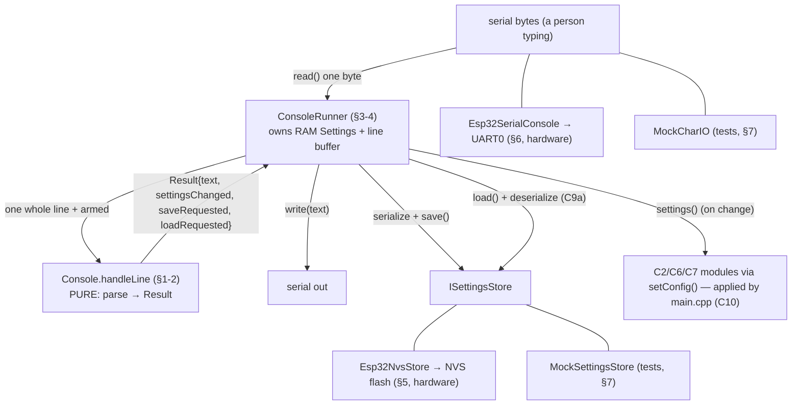

# C9b — Console + Tuning HAL + Settings-Store Integration

**Batch C9b of the source-code campaign** (the second half of the approved C9 split; C9a is
`09a_settings_persistence.md`, and the beginner concept notes are `09a_concept_teaching_notes.md`).
C9a gave us the persistence **format** (the `Settings` struct, `serialize`/`deserialize`, the
never-brick guard chain). C9b is everything that *uses* it: the **bench tuning console** that lets
you type commands to read/change settings, the **runner** that wires the console to real I/O and
storage, the two **ESP32 hardware halves** (NVS flash store + UART0 serial), the **test doubles**,
and the console/settings tests.

**One-sentence framing:** C9b is *the command interface + the storage plumbing*. The pure
`Console` decides what a typed line means (and returns a description of what to do); the
`ConsoleRunner` performs the I/O and storage; the ESP32 files are the real serial/flash; the mocks
stand in for them in tests. **Whether `main.cpp` actually constructs any of this, and passes the
real arm-state, is C10** — marked PROVISIONAL throughout.

## Scope (files explained here)

| File | Lines | What it is |
|---|---|---|
| `lib/console/include/console/Console.hpp` | 40 | The pure command handler's declaration (`Result`, grammar) |
| `lib/console/src/Console.cpp` | 209 | Tokenizer, parsers, and the `handleLine` command logic |
| `lib/console/include/console/ConsoleRunner.hpp` | 46 | Glue: owns RAM Settings + line buffer, holds the two seams |
| `lib/console/src/ConsoleRunner.cpp` | 76 | Boot-load, non-blocking line assembly, save/load plumbing |
| `lib/settings_hal_esp32/…/Esp32NvsStore.{hpp,cpp}` | 55 | ESP32 flash store (Arduino Preferences/NVS) — hardware |
| `lib/settings_hal_esp32/…/Esp32SerialConsole.{hpp,cpp}` | 32 | UART0 (USB serial) char I/O — hardware |
| `test/mocks/MockCharIO.hpp` | 37 | Scripted char-I/O test double |
| `test/mocks/MockSettingsStore.hpp` | 45 | In-memory store test double |
| `test/test_console/test_main.cpp` | 227 | 15 tests |

**Prerequisites (brief reminders — you don't need perfect recall):**
- **C9a** — `Settings`, `kDefaults`, `serialize`/`deserialize`, the four-guard never-brick chain,
  and "integrity (CRC) ≠ correctness (`valid()`)."
- **C1 §3.2** — the two seams this batch plugs into: `hal::ICharIO` (non-blocking `read()`
  returning −1 when empty; `write(const char*)`) and `hal::ISettingsStore` (`load`/`save` a blob).
- **C2/C6/C7** — the tunable sub-configs and their `setConfig()` methods (steering trim, gear
  table, battery calibration) that the console feeds.

**Test status: RUN AND PASSING.** `pio test -e native -f test_console` on 2026-07-03 →
**15/15 PASSED** (4.2 s). Behaviours marked **VERIFIED** are backed by that run. The two
`settings_hal_esp32` files include `<Arduino.h>`/`<Preferences.h>` and are **excluded from the
native tests**, so their flash/serial behaviour is **PROVISIONAL / hardware**.

---

## 0. The layered picture (who does what)



The clean split to hold onto:
- **`Console`** is *pure decision*: line in → `Result` out. It never does I/O or storage; it only
  *mutates the caller's RAM `Settings`* for `set`/`reset`, and *flags* `save`/`load`.
- **`ConsoleRunner`** is *plumbing*: it reads bytes, assembles lines, calls `Console`, and acts on
  the flags (write to the store, print text).
- **The HAL files** are the real serial/flash; **the mocks** are their stand-ins.

---

## 1. `Console.hpp` — the pure command handler's contract

```cpp
inline constexpr size_t kMaxOutput = 512;   // longest response (help)
inline constexpr size_t kMaxLine   = 96;    // reject longer input lines (flood guard)

struct Result {
    char text[kMaxOutput] = {0};    // human-readable response to print
    bool settingsChanged = false;   // RAM Settings were mutated (caller re-applies live)
    bool saveRequested = false;     // persist current RAM Settings to NVS
    bool loadRequested = false;     // reload from NVS into RAM Settings
};

class Console {
public:
    Result handleLine(const char* line, settings::Settings& s, bool armed) const;
};
```
- **`Result` is how a *pure* function "asks" for side effects.** `Console` can't touch flash or
  serial, so instead of *doing* a save it *reports* "the caller should save" via `saveRequested`.
  `settingsChanged` says "I mutated your RAM `Settings`, re-apply them to the live modules";
  `loadRequested` says "reload from storage." The runner (§4) reads these flags and acts.
  **VERIFIED** (the struct; used in §2/§4).
- **`handleLine(line, s, armed)`** — the single entry point. `line` is one command line (already
  assembled by the runner). **`settings::Settings& s`** is the caller's RAM settings, taken **by
  reference** so `set`/`reset` can mutate it in place. **`armed`** gates mutations. The method is
  **`const`** — `Console` itself holds no state; all state lives in the caller's `s`. **VERIFIED.**
- The header comment states the whole **grammar** (also printed by `help`):
  `help | status | get <key> | set <key> <value> | save | load | reset`, keys `steer.center`
  `steer.trim` `batt.ppt` `gear.<N>.max` `gear.<N>.expo`, channels **read-only**, and: *`armed`
  gates set/save/load/reset (tuning is pit-lane only); get/status/help always allowed; every `set`
  runs the sub-config's `valid()`.* All of this is implemented in §2. **VERIFIED.**

---

## 2. `Console.cpp` — parsing + the command logic

### 2.1 The anonymous-namespace helpers (string parsing — new syntax here)
The file opens with four file-local helpers in an **anonymous namespace** (C4 §6.1 reminder:
`namespace { ... }` = private to this file). They introduce several C string functions — explained
on first appearance.

**`tokEq` — compare a token to a literal**
```cpp
bool tokEq(const char* start, const char* end, const char* lit) {
    const size_t n = static_cast<size_t>(end - start);
    return std::strlen(lit) == n && std::strncmp(start, lit, n) == 0;
}
```
- A "token" is a `[start, end)` half-open pointer range into the line (no copying). **`end -
  start`** is *pointer arithmetic*: subtracting two pointers into the same array gives the number
  of elements between them — here the token length `n`.
- **`std::strlen(lit)`** returns the length of a NUL-terminated C string (counts chars up to the
  `'\0'`). **`std::strncmp(a, b, n)`** compares the first `n` bytes of two strings, returning `0`
  if they're equal. So `tokEq` is true iff the literal's length equals the token's length **and**
  the first `n` bytes match — i.e. the token is *exactly* that word (not a prefix). **VERIFIED.**

**`tokenize` — split a line into up to N token ranges (no copying, no `strtok`)**
```cpp
int tokenize(const char* line, const char* starts[], const char* ends[], int maxTok) {
    int n = 0; const char* p = line;
    while (*p && n < maxTok) {
        while (*p == ' ' || *p == '\t') ++p;   // skip leading spaces/tabs
        if (!*p) break;                          // end of line
        starts[n] = p;                           // token begins here
        while (*p && *p != ' ' && *p != '\t') ++p; // walk to next space
        ends[n] = p;                             // token ends here (exclusive)
        ++n;
    }
    return n;
}
```
- **`*p`** dereferences the pointer — the character it points at. **`while (*p)`** loops until the
  NUL terminator (`'\0'` is falsy). **`++p`** advances to the next character.
- It records each token as a `starts[i]`/`ends[i]` pointer pair — it never copies or modifies the
  line (unlike `strtok`, which writes NULs into the string). Returns the token count. **VERIFIED.**

**`say` — write a fixed message into `Result.text` safely**
```cpp
void say(Result& r, const char* msg) { std::snprintf(r.text, kMaxOutput, "%s", msg); }
```
- **`std::snprintf(dest, size, format, ...)`** is a *bounded* formatted print: it writes at most
  `size-1` characters plus a NUL into `dest`, so it **can't overflow** `r.text` even if `msg` is
  huge. `"%s"` just copies the string. (This bounded form is the safe cousin of `sprintf`, which
  has no size limit and is a classic overflow bug.) **VERIFIED.**

**`parseInt` — parse a clean signed integer token**
```cpp
bool parseInt(const char* start, const char* end, long& out) {
    char buf[24]; const size_t n = end - start;
    if (n == 0 || n >= sizeof(buf)) return false;         // empty or too long
    std::memcpy(buf, start, n); buf[n] = '\0';            // copy token + NUL-terminate
    char* endptr = nullptr;
    out = std::strtol(buf, &endptr, 10);                  // base-10 parse
    return endptr == buf + n;                             // consumed the WHOLE token?
}
```
- The token isn't NUL-terminated (it's a slice of the line), so it's copied into a local `buf` and
  terminated. `memcpy` is the raw byte copy (C8/C9a reminder).
- **`std::strtol(str, &endptr, 10)`** parses a `long` in base 10, and sets `endptr` to the first
  character it *couldn't* parse. The check **`endptr == buf + n`** means "strtol consumed every
  byte of the token" — so `"40"` parses, but `"40x"` or `"4 0"` is rejected (endptr wouldn't reach
  the end). This rejects junk that `atoi` would silently accept. **VERIFIED.**

**`parseGearIndex` — pull the gear number out of a `gear.<N>.suffix` key**
```cpp
int parseGearIndex(const char* start, const char* end, const char** suffix) {
    const size_t n = end - start;
    if (n < 8 || std::strncmp(start, "gear.", 5) != 0) return 0;  // not "gear.N.x"
    const char* p = start + 5;                                     // just past "gear."
    int gear = 0;
    if (p >= end || *p < '1' || *p > '9') return 0;                // need a 1-9 digit
    while (p < end && *p >= '0' && *p <= '9') { gear = gear*10 + (*p - '0'); ++p; }
    if (p >= end || *p != '.') return 0;                           // need a '.' after the number
    *suffix = p + 1;                                               // point at "max"/"expo"
    return gear;
}
```
- Recognises keys shaped `gear.<N>.<something>`. It requires a leading `gear.`, then a first digit
  1–9 (so `gear.0.` is rejected — gears are 1-based), then accumulates digits into `gear` with the
  classic **`gear = gear*10 + (*p - '0')`** idiom (`*p - '0'` turns the character `'7'` into the
  number 7). It requires a `.` after the number and sets `*suffix` to the part after it. Returns
  the 1-based gear number, or `0` if the token isn't a gear key at all. **VERIFIED**
  (`test_gear_monotonicity_enforced_at_set`, `test_gear_index_out_of_range`).
  - **`const char** suffix`** is a *pointer to a pointer*: the caller passes the address of its own
    `const char*` so this function can set where it points. (An "output parameter" for a pointer.)

### 2.2 `handleLine` — the command dispatcher (walk it in order)
```cpp
Result Console::handleLine(const char* line, settings::Settings& s, bool armed) const {
    Result r;
    const char* starts[4]; const char* ends[4];
    const int nt = tokenize(line, starts, ends, 4);   // up to 4 tokens
    if (nt == 0) { r.text[0] = '\0'; return r; }       // blank line → nothing
    const char* c0 = starts[0]; const char* c0e = ends[0];   // first token = the command
```
- Up to 4 tokens (`set gear.2.max 300` is the longest legal shape — command, key, value = 3, with
  one spare). Blank line → empty result. `c0`/`c0e` is the command word. **VERIFIED.**

**`help` and `status` (always allowed):**
```cpp
if (tokEq(c0,c0e,"help")) { say(r, "commands: ... keys: ... note: ..."); return r; }
if (tokEq(c0,c0e,"status")) { std::snprintf(r.text, kMaxOutput, "armed=%d ... channels(read-only): ...",
                                            armed?1:0, s.steering.centerMicros, ...); return r; }
```
- `help` prints the grammar. `status` prints the live values with `snprintf` and `%d`/`%u`
  format specifiers (`%d` = signed int, `%u` = unsigned int). **Note (a real limitation):** the
  channel indices in `status` are printed as **hard-coded literals** `0u, 2u, 4u, 5u` (steer/thr/
  arm/drs), *not* read from the live channel map — because the channel map is **not part of
  `Settings`** (it's not tunable, per C9a). So `status` shows the *default* channel numbers as a
  reminder; if you remapped channels in `ChannelDecoder.hpp` (C5), `status` would still show the
  defaults. **VERIFIED** (they're literals) — this is a display convenience, and "channels are
  read-only" is literally true because they aren't in `Settings`. **VERIFIED.**

**The DISARMED gate (the safety keystone of this batch):**
```cpp
const bool isSet = tokEq(c0,c0e,"set");
const bool isGet = tokEq(c0,c0e,"get");
if (isGet && nt < 2) { say(r,"usage: get <key>"); return r; }

if ((isSet || tokEq(c0,c0e,"save") || tokEq(c0,c0e,"load") || tokEq(c0,c0e,"reset")) && armed) {
    say(r,"refused: disarm to change settings (tuning is a pit-lane activity)");
    return r;
}
```
- **The four *mutating* commands — `set`, `save`, `load`, `reset` — are refused while `armed`.**
  `get`/`status`/`help` fall through (always allowed). This is checked *before* any of them runs,
  so an armed car can be inspected but never re-tuned. **VERIFIED** (`test_set_refused_while_armed`:
  `set` armed → text "refused", `settingsChanged` false, value unchanged; `test_get_allowed_while_
  armed`: `get` armed → works). **PROVISIONAL:** that `armed` reflects the *real* arm state — the
  caller supplies it; main.cpp wiring is C10.

**`save` / `load` / `reset`:**
```cpp
if (tokEq(c0,c0e,"save")) { r.saveRequested = true; say(r,"saving to flash"); return r; }
if (tokEq(c0,c0e,"load")) { r.loadRequested = true; say(r,"reloading from flash"); return r; }
if (tokEq(c0,c0e,"reset")) { s = settings::kDefaults; r.settingsChanged = true;
                             say(r,"reverted to defaults (RAM only; type 'save' to persist)"); return r; }
```
- **`save` only *flags* the request** (`saveRequested = true`) — it does not touch flash. The
  runner (§4) does the actual serialize+store. Same for **`load`** (`loadRequested`).
- **`reset` reverts the RAM settings to `kDefaults` *in place*** (`s = kDefaults`) and flags
  `settingsChanged` — but note it does **not** set `saveRequested`. So `reset` is a *RAM-only*
  revert; the message tells you to `save` if you want it to persist. **VERIFIED**
  (`test_reset_reverts_ram_only`: after `reset`, `settingsChanged` true, `saveRequested` **false**,
  trim back to 0).
- **`load` vs `reset` (the distinction the brief asks for):** `load` pulls the **saved** blob back
  from flash into RAM (whatever you last `save`d); `reset` goes to the **compile-time defaults**
  (`kDefaults`), ignoring flash. Both are RAM operations; neither persists on its own.

**`unknown command`:**
```cpp
if (!isSet && !isGet) { say(r,"unknown command (try 'help')"); return r; }
```
- Anything that wasn't help/status/save/load/reset/get/set is unknown. **VERIFIED**
  (`test_unknown_command_and_key`).

**Key resolution + the trial-copy set (the *per-set validation*):**
```cpp
const char* k = starts[1]; const char* ke = ends[1];   // the key token
long v = 0;
if (isSet) {
    if (nt < 3 || !parseInt(starts[2], ends[2], v)) { say(r,"usage: set <key> <integer>"); return r; }
}
settings::Settings next = s;   // TRIAL COPY — mutations land here first
bool matched = false;
```
- For `set`, the value token must parse as a clean integer (`parseInt`), else usage error.
- **`settings::Settings next = s;`** — the crucial safety move: a `set` mutates a **copy** `next`,
  not the live `s`. The live `s` is only overwritten *after* validation passes. **VERIFIED.**

```cpp
if (tokEq(k,ke,"steer.center")) { matched = true;
    if (isSet) next.steering.centerMicros = (uint16_t)v;
    else std::snprintf(r.text, kMaxOutput, "steer.center=%u", s.steering.centerMicros);
} else if (tokEq(k,ke,"steer.trim")) { ... next.steering.trimMicros = (int16_t)v; ... }
  else if (tokEq(k,ke,"batt.ppt"))   { ... next.battery.calibrationPpt = (uint16_t)v; ... }
  else {
    const char* suffix = nullptr;
    const int gear = parseGearIndex(k, ke, &suffix);
    if (gear >= 1 && gear <= s.gearbox.numGears) {
        const int idx = gear - 1;
        if (tokEq(suffix, ke, "max"))  { ... next.gearbox.gears[idx].maxOutput  = (int16_t)v; ... }
        else if (tokEq(suffix, ke, "expo")) { ... next.gearbox.gears[idx].expoPercent = (uint8_t)v; ... }
    } else if (gear != 0) { say(r,"gear index out of range"); return r; }
  }
```
- Each recognised key either **writes into `next`** (for `set`) or **prints the current value from
  `s`** (for `get`). Note `get` reads from the *live* `s`, `set` writes to the *copy* `next`.
- Gear keys go through `parseGearIndex`; the gear must be `1..numGears` (so `gear.9` on a 4-gear
  box is "out of range"; `gear.0` never parses). The `1-based gear → 0-based idx` conversion is
  `idx = gear - 1`. **VERIFIED** (`test_gear_index_out_of_range`).

```cpp
if (!matched) { say(r,"unknown key (try 'help')"); return r; }

if (isSet) {
    if (!next.valid()) { say(r,"rejected: value out of range / would violate config invariants"); return r; }
    s = next;                       // COMMIT only after valid()
    r.settingsChanged = true;
    say(r,"ok (RAM only; type 'save' to persist)");
}
return r;
```
- **The per-set validation (answering the brief's "are invalid values rejected before changing
  RAM?"): YES.** The mutated **copy** `next` is validated with `next.valid()` (the C9a aggregate:
  `steering.valid() && gearbox.valid() && battery.valid()`). If invalid, the function returns
  *without* `s = next` — so the **live RAM settings are never touched by an invalid value.** Only a
  valid `next` is committed. **VERIFIED** by two tests:
  - `test_out_of_range_rejected`: `set steer.trim 2000` → `next.valid()` fails (center 1500 + trim
    2000 = 3500 > max 2500, the A11 rule), so `settingsChanged` false and `s.steering.trimMicros`
    stays 0.
  - `test_gear_monotonicity_enforced_at_set`: `set gear.2.max 300` makes gear2 (600→300) fall below
    gear1 (400), breaking the non-decreasing rule → rejected; then `set gear.1.max 350` is valid
    (350 < 600) → accepted, `gears[0].maxOutput == 350`.
- **`set` = RAM-only** (the "ok (RAM only; type 'save' to persist)" message). It changes the live
  RAM `Settings`; it does *not* persist. Persisting is a separate `save`. **VERIFIED.**

---

## 3. `ConsoleRunner.hpp` — the glue that owns state + seams

```cpp
class ConsoleRunner {
public:
    ConsoleRunner(hal::ICharIO& io, hal::ISettingsStore& store)
        : io_(io), store_(store), settings_(settings::kDefaults) {}
    void loadAtBoot();
    bool poll(bool armed);
    const settings::Settings& settings() const { return settings_; }
private:
    void runLine(bool armed, bool& changedOut);
    hal::ICharIO& io_;
    hal::ISettingsStore& store_;
    Console console_;
    settings::Settings settings_;
    char line_[kMaxLine + 2] = {0};
    size_t len_ = 0;
    bool overflow_ = false;
};
```
- **The runner *owns* the live RAM `Settings`** (`settings_`, started at `kDefaults`) and the line
  buffer; it *borrows* the two seams by reference (`io_`, `store_`). In tests those are the mocks;
  in main.cpp (C10) they're `Esp32SerialConsole` + `Esp32NvsStore`. It holds a `Console` by value
  (`console_`) since `Console` is stateless. **VERIFIED.**
- The comment states the C10 contract: *"main.cpp keeps only the module wiring — it applies
  `settings()` to the live modules whenever `poll()` reports a change."* So the runner reports
  *"settings changed"*; **main.cpp** calls each module's `setConfig()` to apply them live.
  **PROVISIONAL** (that wiring is C10; the `setConfig()` methods themselves are tested — §7).
- `line_[kMaxLine + 2]` = 98 bytes: room for up to 96 chars + a NUL + slack. **VERIFIED.**

---

## 4. `ConsoleRunner.cpp` — boot-load, line assembly, save/load plumbing

### 4.1 `loadAtBoot` — pull persisted settings once at startup
```cpp
void ConsoleRunner::loadAtBoot() {
    uint8_t buf[settings::kBlobLen]; size_t len = 0; settings::Settings loaded;
    if (store_.load(buf, sizeof(buf), len) && settings::deserialize(buf, len, loaded)) {
        settings_ = loaded;  io_.write("[tune] loaded settings from flash\r\n");
    } else {
        settings_ = settings::kDefaults;  io_.write("[tune] using defaults (no valid saved settings)\r\n");
    }
}
```
- Asks the store for the blob, then runs it through the **C9a guard chain** (`deserialize`). The
  **`&&` short-circuits**: if `store_.load` fails (first boot — no data), `deserialize` isn't even
  called. If load succeeds but `deserialize` rejects (corrupt / wrong-version / out-of-range) →
  the else branch → **`kDefaults`.** Either failure path keeps a valid config — **never-brick,
  end to end** (C9a). **VERIFIED (logic; via the mock store)** — `test_runner_boot_loads_saved`
  exercises the success path; the empty-store default path runs in the other runner tests'
  `loadAtBoot()`.

### 4.2 `poll` — non-blocking, one line at a time
```cpp
bool ConsoleRunner::poll(bool armed) {
    bool changed = false;
    for (int c = io_.read(); c >= 0; c = io_.read()) {   // drain all available bytes
        if (c == '\r') continue;                          // tolerate CRLF
        if (c == '\n') {
            line_[len_] = '\0';
            if (overflow_) { io_.write("line too long, ignored\r\n"); overflow_ = false; }
            else runLine(armed, changed);
            len_ = 0; continue;
        }
        if (len_ < kMaxLine) line_[len_++] = (char)c;
        else overflow_ = true;                            // flood guard
    }
    return changed;
}
```
- **Non-blocking**: `io_.read()` returns −1 when no byte is available, ending the loop. So `poll`
  processes whatever has arrived and returns — it never waits (the no-`delay()` discipline, C1).
  This is why it's called "once per loop pass, outside the control tick."
- **Line assembly**: bytes accumulate into `line_` until a `'\n'`; `'\r'` is ignored so terminals
  sending `\r\n` work. On newline, the line is NUL-terminated and run (unless it overflowed).
- **Flood guard**: if a line exceeds `kMaxLine` (96), `overflow_` latches and further chars are
  discarded until the newline, which then prints "line too long, ignored" and drops the line —
  the buffer can never overrun. **VERIFIED** (`test_runner_overlong_line_discarded`).
- **Returns `changed`** — true if any line this pass mutated the RAM settings (so main.cpp
  re-applies). **VERIFIED.**

### 4.3 `runLine` — call the pure Console, then act on the flags
```cpp
void ConsoleRunner::runLine(bool armed, bool& changedOut) {
    Result r = console_.handleLine(line_, settings_, armed);

    if (r.saveRequested) {
        uint8_t buf[settings::kBlobLen];
        const size_t n = settings::serialize(settings_, buf);           // RAM → blob (C9a)
        io_.write(store_.save(buf, n) ? "saved\r\n" : "SAVE FAILED\r\n");
        return;
    }
    if (r.loadRequested) {
        uint8_t buf[settings::kBlobLen]; size_t len = 0; settings::Settings loaded;
        if (store_.load(buf, sizeof(buf), len) && settings::deserialize(buf, len, loaded)) {
            settings_ = loaded; changedOut = true; io_.write("loaded\r\n");
        } else io_.write("no valid saved settings\r\n");
        return;
    }
    if (r.text[0] != '\0') { io_.write(r.text); io_.write("\r\n"); }   // normal output
    if (r.settingsChanged) changedOut = true;
}
```
- **This is where the flags become actions.** The pure `Console` only *decided*; the runner *does*:
  - **`save`**: `serialize` the current RAM settings (C9a) and hand the blob to `store_.save`. It
    reports **"saved"** or **"SAVE FAILED"** from the store's boolean return. **What if save
    fails?** The store returns false → "SAVE FAILED" is printed and **the RAM settings are
    unchanged** (nothing was lost; the persist just didn't happen). **VERIFIED** logic;
    `test_runner_set_then_save_persists` proves the *success* path (serialize → `store.save` →
    `saveCount == 1` → the stored blob deserializes back to the set value). The save-*failure*
    branch is source-verified but not exercised (the mock only fails on an impossibly large blob).
  - **`load`**: `store_.load` + `deserialize` into a **local** `loaded`; only on success is
    `settings_` overwritten and `changedOut` set. **What if load fails?** RAM is untouched ("no
    valid saved settings" printed). Never-brick again. **VERIFIED** logic (mock-backed).
  - **Otherwise** (get/set/reset/status/help): print `r.text` and propagate `settingsChanged`.
- **`set` vs `save` cleanly separated:** `set` changed `settings_` inside `handleLine` (RAM);
  `save` here serializes that RAM state to the store. Two steps, two commands. **VERIFIED**
  (`test_runner_set_then_save_persists`: `"set steer.trim 30\nsave\n"` → RAM trim 30, then the
  stored blob round-trips to 30).

---

## 5. `Esp32NvsStore` — the real flash store (hardware; PROVISIONAL)

```cpp
class Esp32NvsStore : public hal::ISettingsStore {
    bool load(uint8_t* buf, size_t cap, size_t& len) override;
    bool save(const uint8_t* buf, size_t len) override;
    static constexpr const char* kNamespace = "w17tune";
    static constexpr const char* kKey = "settings";
};
```
```cpp
bool Esp32NvsStore::load(uint8_t* buf, size_t cap, size_t& len) {
    Preferences prefs;
    if (!prefs.begin(kNamespace, /*readOnly=*/true)) return false;  // namespace absent = first boot
    const size_t stored = prefs.getBytesLength(kKey);
    if (stored == 0 || stored > cap) { prefs.end(); return false; }
    len = prefs.getBytes(kKey, buf, cap);
    prefs.end();
    return len == stored;
}
bool Esp32NvsStore::save(const uint8_t* buf, size_t len) {
    Preferences prefs;
    if (!prefs.begin(kNamespace, /*readOnly=*/false)) return false;
    const size_t written = prefs.putBytes(kKey, buf, len);
    prefs.end();
    return written == len;
}
```
- **The real half of the `ISettingsStore` seam.** It stores the C9a blob as one named entry
  (namespace `"w17tune"`, key `"settings"`) using the Arduino **`Preferences`** library, which is a
  friendly wrapper over the ESP32's **NVS** (Non-Volatile Storage — the managed flash "key→value
  drawer" from the C9a concept notes). **VERIFIED** (source) that it maps `load`/`save` onto
  `getBytes`/`putBytes`.
- **Wear/locking discipline (comment):** it opens NVS **read-only** for `load` and **read-write
  only inside `save`**, and closes (`end()`) immediately — minimizing how long the flash is held
  open and how often it's opened for writing. **VERIFIED** (the `readOnly` flags).
- **The failure returns are what make never-brick real on hardware:** `load` returns false on
  first boot (namespace absent), on empty data, on too-large data, or on a short read — and the
  runner turns any false into "use defaults." **VERIFIED** (source logic).
- **PROVISIONAL / hardware:** this file includes `<Preferences.h>` and is **excluded from the
  native tests.** So *that NVS actually persists across power cycles, survives flash wear and
  partial writes, and that `Preferences` behaves as assumed* is **not** proven here — it's a bench
  item (`open_questions.md` #34a, D8 Phase 6/8).

> **Resolving the long-standing C1 curiosity.** Since C1 we'd noted that `settings_hal_esp32`'s
> `library.json` has **no `dependencies` key**, unlike the other `*_hal_esp32` libs. Reading it
> now: it's `frameworks: "arduino" / platforms: "espressif32"` with no `dependencies`. The two
> classes only `#include "hal/ISettingsStore.hpp"` / `"hal/ICharIO.hpp"` (the pure interface
> headers) plus framework headers. PlatformIO's Library Dependency Finder auto-discovers the `hal`
> library from those `#include`s, so the missing explicit `dependencies` entry is a **harmless
> stylistic inconsistency**, not a bug — the tuning build compiles (ROADMAP B2.6: `esp32dev_tuning`
> builds clean). **INFERRED** (standard PlatformIO LDF behaviour) + **VERIFIED** the key is absent;
> that it compiles on the real toolchain is per ROADMAP, i.e. **PROVISIONAL-until-a-bench-build**
> from our pure-native vantage.

---

## 6. `Esp32SerialConsole` — the real UART0 char I/O (hardware; PROVISIONAL)

```cpp
class Esp32SerialConsole : public hal::ICharIO {
    void begin(unsigned long baud = 115200);
    int  read() override;
    void write(const char* text) override;
};
void Esp32SerialConsole::begin(unsigned long baud) { Serial.begin(baud); }
int  Esp32SerialConsole::read()  { return Serial.available() > 0 ? Serial.read() : -1; } // non-blocking
void Esp32SerialConsole::write(const char* text) { Serial.print(text); }
```
- **The real half of the `ICharIO` seam** over **UART0** (the ESP32's USB-serial port). `read()`
  honours the C1 contract: return the next byte, or **−1 when nothing is available** (via
  `Serial.available() > 0 ? ... : -1`) — non-blocking, so `poll` never stalls. `write` prints a C
  string. **VERIFIED** (source).
- **Comment: the console is a *tuning-build-only* thing.** "The real firmware otherwise opens no
  UART0 — this is only constructed under the `W17_TUNING_CONSOLE` build flag." So the **delivered
  gift firmware (plain `esp32dev`) has no console surface at all** (matching ROADMAP B2.6 /
  chapter 05: the gift build is console-free, but NVS-saved tuning still persists). **VERIFIED**
  (the comment) — *how* the plain gift firmware loads persisted settings without `ConsoleRunner`
  is a **C10 / main.cpp** question, not shown in C9b.
- **PROVISIONAL / hardware:** includes `<Arduino.h>`, excluded from native tests; serial timing and
  UART0 behaviour are bench items.

---

## 7. The test doubles + the 15 tests

### 7.1 `MockCharIO` (fake `ICharIO`)
```cpp
void feed(const char* s);       // queue input bytes (bounded)
int  read() override;           // drain queued bytes; -1 when empty
void write(const char* text);   // capture output (bounded, NUL-terminated)
bool outputContains(const char* needle) const;  // std::strstr(out, needle) != nullptr
void clearOutput();
```
- Scripts input with `feed(...)` and captures output for assertions. **`read()`** returns
  `static_cast<unsigned char>(in[inPos++])` — the cast to `unsigned char` matters: it stops a high
  byte (0x80–0xFF) being sign-extended to a negative `int`, which would falsely look like the −1
  "empty" signal. **`outputContains`** uses **`std::strstr(haystack, needle)`** (finds a substring,
  returns a pointer or `nullptr`) so tests can assert "the output mentions 'refused'." **VERIFIED.**

### 7.2 `MockSettingsStore` (fake `ISettingsStore`)
```cpp
bool load(uint8_t* buf, size_t cap, size_t& len) override; // false if empty or too big
bool save(const uint8_t* buf, size_t len) override;        // records blob, saveCount++
void setStored(const uint8_t* buf, size_t len);            // inject a stored state
uint8_t stored[256]; size_t storedLen; bool hasData; unsigned saveCount;
```
- An in-memory store that **starts empty** (`hasData == false` → `load` returns false → first-boot
  behaviour). `save` records the blob and bumps `saveCount`; `setStored` lets a test pre-load a
  specific blob. The public `stored`/`storedLen` fields let tests inspect what was persisted (and
  a test *could* corrupt by writing `stored[i]` directly). **VERIFIED.**
  - *Minor stale-comment note:* the header comment mentions a `corrupt()` helper, but the class has
    no such method (only `setStored`, plus the public fields). Cosmetic only; nothing depends on
    it. **VERIFIED** (no `corrupt()` exists).

### 7.3 The 15 tests (each assertion explained)
Includes the console, the runner, the three tunable modules (to test their `setConfig`), and the
mocks. `setUp`/`tearDown` empty. All **PASSED**.

**`Console::handleLine` (8 tests):**
1. **`test_get_and_set_disarmed`** — `get steer.trim` (disarmed) → text contains `steer.trim=0`
   (the default). Then `set steer.trim 40` → `settingsChanged` true and `s.steering.trimMicros ==
   40`. Basic read + write. **VERIFIED (ran).**
2. **`test_set_refused_while_armed`** — `set steer.trim 40` with `armed=true` → `settingsChanged`
   false, trim **unchanged (0)**, text contains `refused`. The DISARMED gate blocks mutation.
   **VERIFIED (ran).**
3. **`test_get_allowed_while_armed`** — `get batt.ppt` with `armed=true` → text contains
   `batt.ppt=1000`. Reads are allowed while armed. **VERIFIED (ran).**
4. **`test_out_of_range_rejected`** — `set steer.trim 2000` → rejected (`settingsChanged` false,
   trim stays 0), text contains `rejected`. Per-set `valid()` catches the trim-past-endpoint (A11)
   **on the trial copy, before RAM changes.** **VERIFIED (ran).**
5. **`test_gear_monotonicity_enforced_at_set`** — `set gear.2.max 300` (below gear1) → rejected
   (`GearboxConfig::valid()` non-decreasing rule); then `set gear.1.max 350` (valid) → accepted,
   `gears[0].maxOutput == 350`. **VERIFIED (ran).**
6. **`test_gear_index_out_of_range`** — `set gear.9.max 500` on a 4-gear box → `settingsChanged`
   false, text contains `range`. The gear-index bounds check. **VERIFIED (ran).**
7. **`test_unknown_command_and_key`** — `wibble` → text contains `unknown` (command);
   `get no.such.key` → text contains `unknown` (key). **VERIFIED (ran).**
8. **`test_reset_reverts_ram_only`** — with trim pre-set to 55, `reset` → `settingsChanged` true,
   `saveRequested` **false** (RAM only), trim back to 0. Proves `reset` reverts RAM without
   persisting. **VERIFIED (ran).**

**`ConsoleRunner` with mocks (4 tests):**
9. **`test_runner_set_then_save_persists`** — `loadAtBoot` on an empty store → defaults; feed
   `"set steer.trim 30\nsave\n"`; `poll(disarmed)` → `changed` true, `settings().steering.trimMicros
   == 30`, `store.saveCount == 1`; and the persisted `store.stored` **deserializes back to trim 30**.
   The full RAM-edit → persist → round-trip path, end to end through the seams. **VERIFIED (ran).**
10. **`test_runner_armed_blocks_and_does_not_persist`** — feed `"set steer.trim 30\n"`,
    `poll(armed=true)` → `changed` false, output contains `refused`, `settings().steering.trimMicros
    == 0`. The DISARMED gate through the runner. **VERIFIED (ran).**
11. **`test_runner_overlong_line_discarded`** — feed a `> kMaxLine` line ending in `\n` → output
    contains `too long`. The flood guard. **VERIFIED (ran).**
12. **`test_runner_boot_loads_saved`** — `setStored` a blob with `calibrationPpt = 1050`,
    `loadAtBoot` → `settings().battery.calibrationPpt == 1050`, output contains `loaded`. The
    boot-load success path. **VERIFIED (ran).**

**Module `setConfig()` (3 tests — the console→module bridge):** these verify that the tunable
modules actually *apply* a new config, which is what main.cpp (C10) does when `poll` reports a
change.
13. **`test_servo_setconfig_applies`** — `ServoOutput.setConfig(cfg with trimMicros = 100)`,
    `setPosition(0)` → `1600` µs (center 1500 + trim 100). Confirms C2's `setConfig` changes the
    live servo. **VERIFIED (ran).**
14. **`test_gearbox_setconfig_clamps_current_not_reset`** — shift to gear 3, then
    `setConfig(numGears = 2)` → `currentGear() == 1` (clamped to `numGears-1`), **not** reset to
    `initialGear` (0). Confirms C6's "a table edit doesn't silently change which gear you're in."
    **VERIFIED (ran).**
15. **`test_battery_setconfig_changes_calibration`** — sample at default ppt → `before`; then
    `setConfig(calibrationPpt = 1100)` (+10%) and sample again → `batteryMv() > before`. Confirms
    C7's `setConfig` shifts the calibration and the EMA moves toward the higher reading. **VERIFIED
    (ran).**

The runner (`main`) runs all 15 `RUN_TEST`s. **VERIFIED (ran; 15/15).**

---

## 8. Live RAM vs saved settings; set/save/load/reset — the exact semantics

The brief asks for precision here, so, consolidated (all **VERIFIED** from source + tests):

| Command | Touches RAM `settings_`? | Touches flash? | Notes |
|---|---|---|---|
| `get` / `status` / `help` | no | no | read-only; allowed even while armed |
| `set <key> <val>` | **yes, only if valid** | no | validated on a *copy* first; invalid → RAM unchanged; "RAM only, type save" |
| `save` | no | **yes (serialize + store.save)** | persists current RAM; "saved" / "SAVE FAILED" |
| `load` | **yes, only if a valid blob loads** | reads flash | pulls the *saved* values back; failure → RAM unchanged |
| `reset` | **yes (→ kDefaults)** | no | reverts to compile-time defaults; does *not* persist |
| (all four mutators) | — | — | **refused while `armed`** |

- **RAM vs saved:** `settings_` is the live copy the car runs on; the flash blob is the persisted
  copy. `set`/`reset` change RAM; `save` copies RAM→flash; `load` copies flash→RAM. They're
  deliberately separate steps so you can experiment in RAM and only commit deliberately.
- **Invalid values never reach RAM** (trial-copy + `valid()`), and **failed save/load never harm
  RAM** (locals + boolean returns) — the never-brick discipline extended from C9a's format into
  C9b's live lifecycle.

---

## 9. VERIFIED / INFERRED / PROVISIONAL summary

**VERIFIED** (source + the 2026-07-03 run):
- `Console` grammar/dispatch: help/status/get/set/save/load/reset; get/status/help always allowed;
  **set/save/load/reset refused while `armed`**; unknown command/key handled.
- The tokenizer + parsers (`tokEq`/`tokenize`/`parseInt`/`parseGearIndex`), including `parseInt`
  rejecting non-clean integers and `parseGearIndex` enforcing 1-based gears + a suffix.
- **Per-set validation on a trial copy** — invalid values are rejected *before* the live RAM
  `Settings` changes (trim-past-endpoint and gear-monotonicity both proven).
- `reset` = RAM revert to `kDefaults` (no persist); `save` flags→serialize→`store.save`; `load`
  flags→`store.load`+`deserialize` (never-brick), all with RAM untouched on failure.
- `ConsoleRunner`: boot-load with defaults fallback; non-blocking line assembly with CRLF tolerance
  and a flood guard; the save/load plumbing; returns "changed" so the caller re-applies.
- The three module `setConfig()`s apply live (servo trim, gearbox current-gear clamp, battery
  calibration).
- The mocks (`MockCharIO`, `MockSettingsStore`) behave as scripted test doubles.

**INFERRED** (reasoning atop code/comments):
- The `settings_hal_esp32` `library.json` has no `dependencies` because PlatformIO's LDF
  auto-discovers `hal` from the `#include`s — a harmless inconsistency (resolves the C1 curiosity).
- `status`'s channel indices are a *display reminder* of the defaults, not a live read (channels
  aren't in `Settings`).

**PROVISIONAL / requires C10 or hardware:**
- **All flash + serial reality:** that `Esp32NvsStore` truly persists across power cycles, survives
  wear/partial writes; that `Esp32SerialConsole`'s UART0 timing works — **hardware** (excluded from
  native tests; `open_questions.md` #34a, D8 Phase 6/8). The save-*failure* branch of `runLine` is
  source-verified but not test-exercised (the mock can't easily fail).
- **The C10 wiring:** that `main.cpp` constructs `ConsoleRunner` with the real seams, calls
  `loadAtBoot()`/`poll()` at the right cadence, passes the **true arm state** as `armed`, and calls
  each module's `setConfig()` when `poll` reports a change.
- **The gift-firmware load path:** the console is compiled out of plain `esp32dev`
  (`W17_TUNING_CONSOLE`), yet ROADMAP says NVS-saved tuning still loads — *how* the console-free
  build loads settings is a **C10 / main.cpp** question, not shown in C9b.

---

## 10. Cross-references (open questions & risks already on file)
- **ROADMAP item 6 / B2.6** (chapter 05 §1.3) — the settings + console feature. C9b is its console
  + storage half; "DISARMED gating," "set = RAM / save = NVS," and "gift firmware is console-free
  but tuning persists" all trace here.
- **`open_questions.md` #34a** — settings persistence end-to-end on real hardware (save→power-cycle,
  version-bump→reflash→defaults). C9b adds the *console + store* side; the flash proof is still
  bench.
- **C1 curiosity (`settings_hal_esp32` library.json deps)** — **RESOLVED** here (§5): benign LDF
  auto-discovery.
- **C9a back-links** — `serialize`/`deserialize`/`kBlobLen`/`kDefaults`; **C1 §3.2** — the
  `ICharIO`/`ISettingsStore` seams; **C2/C6/C7** — the sub-configs and their `setConfig()`.
- **C10 forward-links** — constructing the runner with real seams, the poll cadence, the arm-state
  source, and the setConfig application loop; the console-free gift-firmware load path.

One new tracking item was added to `open_questions.md` (see §11.4).

---

## 11. Batch close-out (as requested)

### 1. What C9b proves
- The **command grammar and dispatch** work: get/status/help are always available; set/save/load/
  reset are **refused while armed**; unknown input is handled cleanly.
- **Per-set validation is airtight**: a `set` mutates a *copy*, validates it with the C9a aggregate
  `valid()`, and only commits if valid — so an **invalid value never reaches the live RAM
  settings** (trim-past-endpoint and gear-monotonicity both proven).
- **The RAM↔flash lifecycle** is correct through the seams: `set` edits RAM; `save` serializes RAM
  and persists; `load`/`loadAtBoot` reads flash + runs the never-brick guard chain (defaults on any
  failure); `reset` reverts RAM to defaults without persisting — and **failed save/load never harms
  RAM.**
- **The runner** assembles lines non-blocking, tolerates CRLF, guards against flood lines, and
  reports changes so the caller can re-apply.
- **The tunable modules apply new configs** (servo/gearbox/battery `setConfig`), which is what
  main.cpp will call on a change.

### 2. What C9b does NOT prove
- Nothing about **real flash**: not persistence across power cycles, not wear, not partial-write
  safety, not `Preferences`/NVS behaviour. Those files are excluded from the native tests.
- Nothing about **real serial** timing/electrical behaviour (UART0).
- Not the **save-failure** branch (the mock store doesn't realistically fail).
- Not that **main.cpp** actually builds any of this, passes the true arm state, or applies
  `settings()` to the live modules.

### 3. What must wait for C10
- `main.cpp` constructing `ConsoleRunner` with `Esp32SerialConsole` + `Esp32NvsStore` (under
  `W17_TUNING_CONSOLE`), calling `loadAtBoot()` and `poll()` at the right point, sourcing the real
  **`armed`** state, and calling each module's `setConfig()` when `poll` reports a change.
- How the **console-free gift firmware** (plain `esp32dev`) loads persisted settings at boot.

### 4. What must wait for real ESP32 hardware
- That NVS actually persists a saved blob across power cycles and reflashes, and behaves under
  wear / partial writes (`open_questions.md` #34a).
- That the UART0 console reads/writes correctly at 115200 on the bench.
- End-to-end bench tuning: type `set …` → `save` → power-cycle → values survive (D8 Phase 6/8).

### 5. Understanding questions
1. Trace `set steer.trim 2000` when disarmed. Onto which object is 2000 written first, which check
   rejects it, and what is the live `s.steering.trimMicros` afterward? Why is the trial-copy step
   essential to safety?
2. Contrast `load` and `reset` precisely: which one reads flash, which one uses `kDefaults`, and
   does either persist? What must you type to make a `reset` stick?
3. Why does `Console::handleLine` only *flag* `saveRequested`/`loadRequested` instead of writing to
   flash itself? What does that buy you (think testing + purity)?
4. `parseInt` accepts `"40"` but rejects `"40x"`. Which line enforces that, and what does `endptr ==
   buf + n` mean?
5. A line of 200 `x` characters arrives. Walk through what `poll` does byte-by-byte and what the
   user sees. Why can the 98-byte `line_` buffer never overflow?
6. `set`/`save`/`load`/`reset` are refused while armed, but `get`/`status` are not. Where is that
   gate in the code, and why is this a safety choice rather than an arbitrary one? What is still
   PROVISIONAL about it until C10?
7. `test_runner_set_then_save_persists` ends by calling `deserialize(store.stored, …)`. Why is that
   a stronger assertion than just checking `store.saveCount == 1`?
8. The `Esp32NvsStore` and `Esp32SerialConsole` files pass no native tests at all. State two things
   about the real car that C9b therefore cannot prove, and where those are tracked.

### 6. Concepts that deserve extra teaching later
- **Pure-decision vs. side-effect split (the `Result`-flags pattern).** `Console` decides,
  `ConsoleRunner` acts. A short cross-cutting note on this "return a description of what to do"
  pattern (vs. doing I/O inline) would consolidate why the console is trivially testable.
- **C string parsing without a library** — pointer ranges (`[start, end)`), `strtol` + `endptr`,
  `snprintf` bounding, `strstr`. This is the densest new-syntax cluster in the campaign; a focused
  primer would help before any future text-handling code.
- **Non-blocking line assembly + flood guarding** — the `poll` pattern (drain-until-empty, latch
  overflow, CRLF tolerance) is reusable for any serial protocol; worth a standalone note.
- **The full never-brick lifecycle** — C9a proved the *format* can't brick; C9b extends it to *live
  edits* (trial-copy validation) and *failed I/O* (RAM untouched). A single diagram tying C9a+C9b
  "no path applies bad settings" would be a strong capstone.
- **Build-flag-gated features** (`W17_TUNING_CONSOLE`) — the idea that a whole subsystem is compiled
  out of the shipped firmware while its saved data still loads. Best taught with C10's `platformio.ini`.

---

*Batch C9b complete. `source_code_progress.md`, `glossary.md`, and `open_questions.md` updated.
Awaiting approval before C10 ("The conductor: main.cpp + sim + build configs").*
