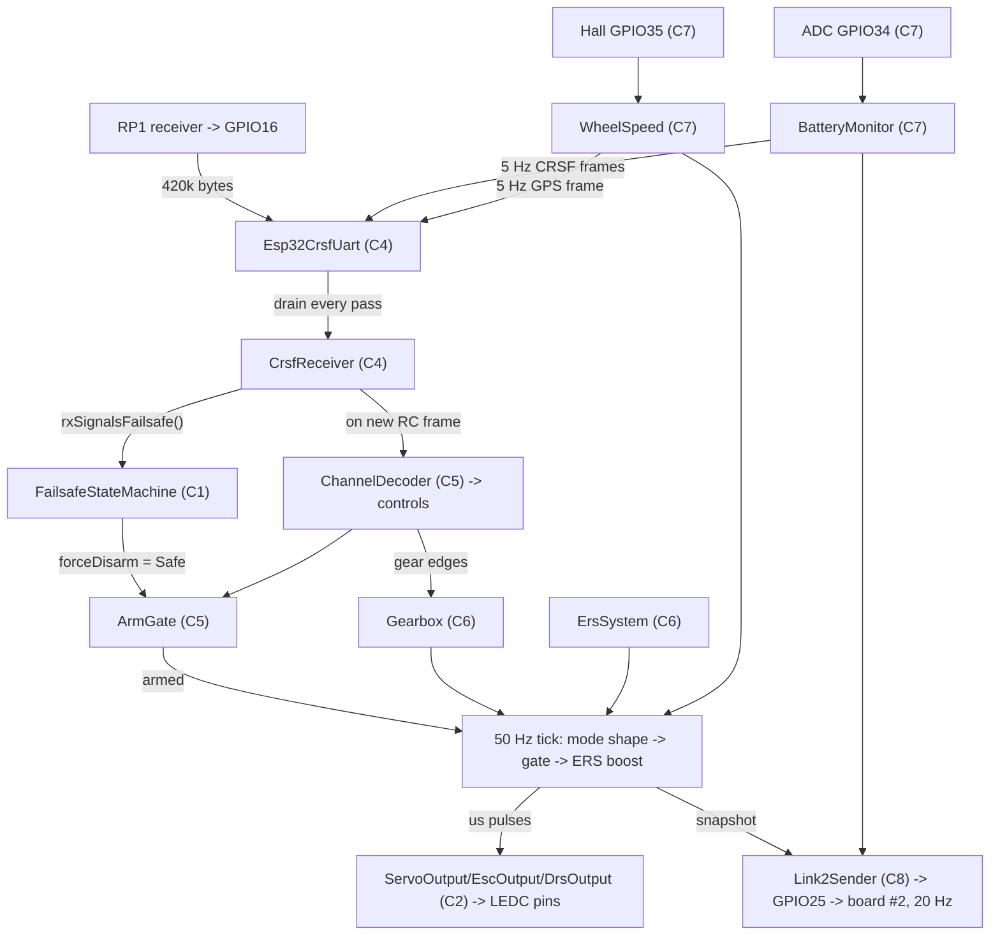

# C10 — The conductor: `main.cpp` + sim feeder + build configs

**Batch C10 of the source-code campaign** — the final control-firmware batch. Everything from
C1–C9 was a *module*: pure logic behind a seam, proven by native tests. C10 is the file that
**composes them into the actual running ESP32 program**: `src/main.cpp` constructs every object,
wires every seam to real hardware, and runs every cadence. Plus the three files that surround it:
the Wokwi demo script (`SimCrsfFeeder`), the build configuration (`platformio.ini`), and the CI
workflow (`ci.yml`).

**One-sentence framing:** C10 is *wiring and scheduling, not new mechanisms* — every behaviour
below was already proven at module level; what's new (and what resolves a long list of previous
PROVISIONAL notes) is *who calls whom, with what, in which order, how often*.

## Scope (files explained here)

| File | Lines | What it is |
|---|---|---|
| `src/main.cpp` | 403 | The conductor: globals, `setup()`, `loop()` |
| `src/SimCrsfFeeder.hpp` | 23 | Sim-only scripted CRSF feeder — interface |
| `src/SimCrsfFeeder.cpp` | 192 | The ~25 s looping demo script |
| `platformio.ini` | 58 | The four build environments |
| `.github/workflows/ci.yml` | 36 | GitHub Actions CI: tests + builds on every push |

(`wokwi.toml` / `diagram.json` were already explained line-level in chapter 05 §9.)

**Prerequisites:** everything C1–C9. Each module is *reminded*, not re-derived, with a back-link.

## Evidence status — read this carefully, it is different from every previous batch

**`main.cpp` has NO automated test.** `platformio.ini` explicitly sets `test_build_src = no`
(§7.4): the conductor is *never* compiled into the native test binary (it includes `Arduino.h`).
So the labels in this batch mean:

- **VERIFIED (source + build)** — the statement is provable by *reading* the code, and the code
  provably compiles: on **2026-07-05** I ran the full verification locally:
  - `pio test -e native` → **147/147 test cases PASSED** (all ten suites — the module behaviour
    every claim below leans on);
  - `pio run -e esp32dev` → **SUCCESS**, `pio run -e esp32dev_sim` → **SUCCESS** (the two CI
    builds), and `pio run -e esp32dev_tuning` → **SUCCESS** (not in CI; verified here).
  A successful build proves the wiring *type-checks and links* — every constructor call, every
  argument, every seam match is real. It does **not** prove runtime behaviour.
- **VERIFIED (module tests)** — the *behaviour of the called module* is pinned by a native test
  from an earlier batch (re-run today in the 147).
- **INFERRED** — a reasoned consequence of source facts.
- **PROVISIONAL** — the *composition running end-to-end* needs the Wokwi sim first-run
  (open questions #35–39) or the bench (D8). No automated test exercises `loop()` as a whole.

---

## 0. The big picture

### 0.1 Where is `main()`? The Arduino `setup()`/`loop()` model (new concept)

A desktop C++ program starts at `int main()`. An Arduino-framework program instead defines two
functions, **`setup()`** (called once at boot) and **`loop()`** (called again and again, forever).
The framework supplies the hidden `main()` for you — on ESP32 it initializes the chip, calls your
`setup()`, then calls your `loop()` in an endless loop (inside a FreeRTOS task). So:

- **Static initialization** (C4 §, finding A5 backstory): all global objects are constructed
  *before* `setup()` runs.
- **`setup()`**: one-time hardware attachment + initial safe state.
- **`loop()`**: one *pass* of the scheduler; it must return quickly (no `delay()` — the house
  rule from C1) so the next pass can run. All timing is done by comparing `millis()` timestamps.

**`millis()`** (new on the firmware side, though C7 used the pattern): the Arduino function
returning milliseconds since boot as a `uint32_t`. It wraps around after ~49.7 days
(2³² ms); all comparisons in this codebase use *unsigned subtraction* (`now - last >= period`),
which stays correct across the wrap (C7 §2 explained why). `Esp32MillisClock` (§2.1) is the
`hal::IClock` adapter over it.

### 0.2 The dataflow, one picture



### 0.3 One firmware, three builds

`platformio.ini` (§7) defines the variants; `main.cpp` selects code with **conditional
compilation** (new concept): `#ifdef NAME … #endif` keeps the enclosed lines only if the
preprocessor symbol `NAME` is defined, and the build system defines it with a `-DNAME` compiler
flag. Code inside an undefined `#ifdef` is *not compiled at all* — it isn't "skipped at runtime,"
it does not exist in the binary.

| Build (env) | Extra flag | What it adds | Who gets it |
|---|---|---|---|
| `esp32dev` | — | nothing — this is the firmware | **the delivered gift car** |
| `esp32dev_sim` | `-DW17_SIM_CRSF_FEEDER` | the scripted CRSF self-feeder + serial narration | Wokwi (validation Stage 2) |
| `esp32dev_tuning` | `-DW17_TUNING_CONSOLE` | serial console + NVS settings (C9) | the bench |

**VERIFIED (source + build)** — and the source of this batch's biggest finding (§8): in the plain
`esp32dev` build, *the entire settings subsystem does not exist*.

---

## 1. `main.cpp` lines 1–35 — includes and the two `#ifdef` blocks

```cpp
#include <Arduino.h>

#include <cstdio>
```
- **`<Arduino.h>`** — the framework header: `millis()`, `Serial`, `setup`/`loop` declarations.
  This is the first campaign file that includes it, and that is the point: *only* `main.cpp` and
  the `*_hal_esp32` libraries touch it; every pure library compiles without it (the whole reason
  147 native tests can run on a Mac). **`<cstdio>`** is for `std::snprintf` (C9b §2.1 explained
  it) — used to format the FLIGHTMODE status string (§4.7).

Lines 5–24 then include **one header per module wired below** — every batch of this campaign in
alphabetical order: `channels/ArmGate` + `ChannelDecoder` (C5), `config/PinMap` (C1),
`crsf/CrsfFrameBuilder` + `CrsfReceiver` (C4), `crsf_hal_esp32/Esp32CrsfUart` (C4),
`ers/ErsSystem` (C6), `failsafe/FailsafeStateMachine` (C1), `gearbox/Gearbox` (C6),
`hal/IClock` (C1), `link2/Link2Sender` + `link2_hal_esp32/Esp32Link2Uart` (C8),
`outputs/*` + `outputs_hal_esp32/Esp32LedcPwm` (C2), `telemetry/*` + `telemetry_hal_esp32/*`
(C7). **VERIFIED.**

```cpp
#ifdef W17_SIM_CRSF_FEEDER
#include "SimCrsfFeeder.hpp" // Wokwi Stage-2 harness, absent from real firmware
#endif

#ifdef W17_TUNING_CONSOLE
#include "console/ConsoleRunner.hpp"
#include "settings/Settings.hpp"
#include "settings_hal_esp32/Esp32NvsStore.hpp"
#include "settings_hal_esp32/Esp32SerialConsole.hpp"
#endif
```
- Even the **includes** are conditional. Consequence (a real one, not style): PlatformIO's
  Library Dependency Finder only pulls a library into the build if something includes it — so in
  the plain build the `settings`/`console`/`settings_hal_esp32` libraries are *not even linked*.
  The gift firmware contains no console **and no settings code of any kind** (§8). **VERIFIED
  (source + build).**

---

## 2. Lines 37–165 — the anonymous-namespace globals (the whole cast, constructed in order)

Everything lives in one **anonymous namespace** (C4 reminder: `namespace { … }` gives every name
*internal linkage* — private to this file, no collision with any library symbol). These are
**globals**, so they are constructed during **static initialization**, before `setup()` runs —
which is exactly why `EscOutput` anchors its boot hold to the *first call*, not construction
(finding A5, C2 §; revisited in §3.2).

### 2.1 The real clock (lines 39–43)
```cpp
class Esp32MillisClock : public hal::IClock {
public:
    uint32_t nowMs() const override { return millis(); }
};
```
The production implementation of the C1 `IClock` seam: one line, `millis()`. In tests the same
seam was `FakeClock` (C1 §6). It exists **for `EscOutput`'s boot-arm hold** (the comment says
so) — the only module holding a clock reference rather than taking `nowMs` as a parameter.
**VERIFIED.**

### 2.2 CRSF input chain (lines 45–49)
```cpp
crsf_hal_esp32::Esp32CrsfUart crsfUart(pinmap::kCrsfUartRxPin, pinmap::kCrsfUartTxPin);
crsf::CrsfReceiver crsfReceiver;
```
- **Resolves C4's PROVISIONAL**: the pins injected into `Esp32CrsfUart` are
  `kCrsfUartRxPin = 16` / `kCrsfUartTxPin = 17` from `PinMap.hpp` — exactly the CLAUDE.md §1 pin
  map (C4 could only verify baud/8N1; the pin *values* were "injected by main.cpp,
  PROVISIONAL until C10"). Now **VERIFIED (source + build)**.
- `crsfReceiver` is the C4 facade: assembler + typed dispatch + the latched-LQ failsafe signal.

### 2.3 Channel map + decoder + gate + the cached controls (lines 51–57)
```cpp
constexpr channels::ChannelMapConfig kChannelMap{};
static_assert(kChannelMap.valid(), "channel map: index out of range or bad thresholds");

channels::ChannelDecoder channelDecoder(kChannelMap);
channels::ArmGate armGate;
channels::Controls controls; // most recently decoded controls (all-neutral until a frame)
```
- **This is the "definition site" C5 promised**: the config header said *"static_assert this at
  the definition site: a wrong index must fail the build"* — and here it is. `kChannelMap{}`
  takes the **defaults** (steering ch1/idx0, throttle ch3/idx2, arm ch5/idx4, DRS ch6/idx5,
  gearUp ch7/idx6, gearDown ch8/idx7, pan ch9, tilt ch10, boost ch11, overtake ch12, driveMode
  ch13; hysteresis ±250). So the firmware **does run the default map** — C5's open point about
  *which* map main.cpp uses is resolved; whether those defaults match the real transmitter is
  still the bench item (open question #5, D8 Phase 4). **VERIFIED (source + build)** /
  **PROVISIONAL (bench)** respectively.
- **`controls` is a global cache**, not recomputed every pass: it holds the *most recently
  decoded* frame and is deliberately all-neutral before the first frame (C5 §: `Controls`
  defaults — steering/throttle 0, all switches false, **`driveMode = 1` = Gearbox**). Every
  consumer below (arm gate, shaping, gimbal, link2 driveMode) reads this cache. That
  "pre-first-frame ticks equal plain gearbox at zero throttle" behaviour is a C5 default doing
  system-level work. **VERIFIED (module tests + source).**

### 2.4 Gearbox + the drive-mode plan + ERS (lines 59–73)
```cpp
constexpr gearbox::GearboxConfig kGearboxConfig{};
static_assert(kGearboxConfig.valid(), "gearbox: bad gear table (range or non-monotonic)");
gearbox::Gearbox virtualGearbox(kGearboxConfig);

// Drive modes (3-pos switch): 0 = Training, 1 = Gearbox (mid = default, also
// what an absent channel decodes to), 2 = Gearbox+ERS. There is deliberately
// NO raw pass-through mode: gearbox top gear (cap 1000, expo 0) already IS
// full power, and power stays monotone along the switch so a bumped switch
// changes authority by one gentle step.
// Training: one fixed gentle shape, gear shifts have no effect.
constexpr gearbox::GearParams kTrainingGearParams{400, 50};

constexpr ers::ErsConfig kErsConfig{};
static_assert(kErsConfig.valid(), "ers: bad rate/bonus/threshold values");
ers::ErsSystem ersSystem(kErsConfig);
```
- The default 4-gear table (C6 §1: {400,50} {600,35} {800,20} {1000,0}), statically asserted.
- **The drive-mode comment is the design document C6 was waiting for.** C6 proved the
  *mechanisms* were mode-agnostic and marked the mode table PROVISIONAL; here is the wiring
  policy, in the source: **0 = Training, 1 = Gearbox, 2 = Gearbox+ERS**, and *no raw
  pass-through* — because top gear (cap 1000, expo 0) already **is** full power, and keeping
  power **monotone along the 3-pos switch** means a bumped switch changes authority by one
  gentle step, never a cliff. §4.8 shows the code implementing exactly this. **VERIFIED
  (source + build)** for the wiring; the *feel* is bench.
- **`kTrainingGearParams{400, 50}`** — a single `GearParams` (C6 §1 field order:
  `maxOutput = 400`, `expoPercent = 50`): Training mode is *one fixed gentle gear* — 40 %
  ceiling with strong expo — fed to the *free function* `shapeThrottle`, bypassing the stateful
  gearbox entirely (§4.8). "Gear shifts have no effect" therefore means **no effect on
  output** — see §4.5 for the nuance that shift *state* still changes.

### 2.5 FSM + clock (lines 75–77)
```cpp
failsafe::FailsafeStateMachine failsafeStateMachine;
Esp32MillisClock clock;
```
Default config: 500 ms timeout, 150 ms re-arm confirm (C1 §4). Boot state **Safe**, and
"unconditionally invalid until the first frame ever" (the A1 latch) — this is what makes the
pre-link boot safe in §3.4. **VERIFIED (module tests).**

### 2.6 Output configs + PWM channels + output objects (lines 79–98)
```cpp
constexpr outputs::ServoConfig steeringConfig{};
constexpr outputs::EscConfig escConfig{};
constexpr outputs::DrsConfig drsConfig{};
constexpr outputs::ServoConfig gimbalConfig{};

outputs_hal_esp32::Esp32LedcPwm steeringPwm(pinmap::kSteeringServoPin, /*channel=*/0);
outputs_hal_esp32::Esp32LedcPwm escPwm(pinmap::kEscThrottlePin, /*channel=*/1);
outputs_hal_esp32::Esp32LedcPwm drsPwm(pinmap::kDrsServoPin, /*channel=*/2);
outputs_hal_esp32::Esp32LedcPwm panPwm(pinmap::kGimbalPanPin, /*channel=*/3);
outputs_hal_esp32::Esp32LedcPwm tiltPwm(pinmap::kGimbalTiltPin, /*channel=*/4);

outputs::ServoOutput steering(steeringPwm, steeringConfig);
outputs::EscOutput esc(escPwm, clock, escConfig);
outputs::DrsOutput drs(drsPwm, drsConfig);
outputs::ServoOutput panServo(panPwm, gimbalConfig);
outputs::ServoOutput tiltServo(tiltPwm, gimbalConfig);
```
- The configs are **named** (not inline temporaries) *"so setup() can hand their safe positions
  to the PWM layer as the initial pulse"* — the A4 fix's other half (§3.1). Defaults: steering
  center 1500 µs / trim 0, ESC neutral 1500 µs / boot hold 2000 ms, DRS closed 1000 µs (C2 §1).
- Five PWM pins, five **distinct LEDC channels 0–4** (C2 §5 reminder: each `Esp32LedcPwm` is one
  ESP32 LEDC hardware channel at 50 Hz/16-bit; two outputs must never share a channel). Pins from
  `PinMap.hpp`: steering 13, ESC 14, DRS 18, pan 19, tilt 23. **VERIFIED (source + build).**
- `esc` is the only output taking `clock` (the boot hold). The gimbal servos reuse plain
  `ServoOutput` with default endpoints — no new mechanism.
- *Stale-comment note (same species as C1's IByteSink "12 bytes"):* `ChannelDecoder.hpp` still
  says pan/tilt are "decoded but **unwired** until the gimbal deliverable" — they are wired here
  (gimbal landed 2026-07-03, ROADMAP B3.7). Similarly `FailsafeStateMachine.hpp`'s
  "main.cpp carries a minimal neutral-latch until then" note predates `ArmGate` (C5) and no
  longer describes main.cpp. Both comments are stale, not bugs. **VERIFIED (source).**

### 2.7 Telemetry sensors (lines 100–108)
```cpp
telemetry_hal_esp32::Esp32BatteryAdc batteryAdc(pinmap::kBatterySenseAdcPin);
telemetry_hal_esp32::Esp32HallPulseCounter hallSensor(pinmap::kWheelSpeedHallPin);
telemetry::BatteryMonitor batteryMonitor(batteryAdc, kBatteryConfig);
telemetry::WheelSpeed wheelSpeed(hallSensor, kWheelSpeedConfig);
```
Battery ADC on GPIO34, Hall on GPIO35 (the input-only pins, C7/ch03), both configs statically
asserted. **Resolves C7's wiring PROVISIONAL** (pins/cadence — cadence in §4.6); the
*electrical* claims (eFuse calibration quality #30, EMI #31) remain hardware. **VERIFIED
(source + build).**

### 2.8 link2 (lines 110–113)
```cpp
constexpr link2::Link2SenderConfig kLink2Config{};
static_assert(kLink2Config.valid(), "link2: brake hysteresis thresholds inverted");
link2_hal_esp32::Esp32Link2Uart link2Uart(pinmap::kBoard2UartTxPin);
link2::Link2Sender link2Sender(link2Uart, kLink2Config);
```
**Resolves C8's PROVISIONAL**: the TX pin injected is `kBoard2UartTxPin = 25`, matching the
link2 spec; brake hysteresis −40/−20 defaults. **VERIFIED (source + build).** (Cross-repo
compatibility with board #2 is still the S1 diff-verify.)

### 2.9 The four cadences (lines 115–123) — every timing interval, and why

```cpp
constexpr uint32_t kControlPeriodMs = 20;         // 50 Hz: failsafe + outputs
constexpr uint32_t kLink2PeriodMs = 50;           // 20 Hz: state frame to board #2
constexpr uint32_t kBatterySampleIntervalMs = 100;
constexpr uint32_t kTelemetryPeriodMs = 200;      // 5 Hz: CRSF battery telemetry up to RP1
uint32_t lastControlTickMs = 0;
uint32_t lastLink2TickMs = 0;
uint32_t lastBatterySampleMs = 0;
uint32_t lastTelemetryMs = 0;
```

| Cadence | Period | Why exactly this |
|---|---|---|
| Control tick | 20 ms (50 Hz) | CLAUDE.md 2.8's floor ("fixed ≥50 Hz"), and it *matches the PWM hardware*: servo/ESC pulses repeat every 20 ms (C2), so commanding faster than 50 Hz could not reach the wire anyway |
| link2 | 50 ms (20 Hz) | the link2 spec's nominal rate (C8); 10× inside the receiver's 500 ms staleness rule, so ~9 consecutive frames must be lost before board #2 declares link loss |
| Battery sample | 100 ms (10 Hz) | the EMA config *assumes* it: "at 100 ms sampling, shift 3 gives tau ≈ 0.8 s" (C7 §2) — this line makes that assumption true |
| CRSF telemetry | 200 ms (5 Hz) | battery/speed/status change slowly; 5 Hz is plenty for a HUD and keeps the shared UART2 TX quiet |

Plus the two sim-only cadences (§5/§4.10): RC frames 20 ms, stats 100 ms, status print 500 ms.
**VERIFIED (source).** The `last…Ms` variables all start at 0 — with `millis()` near 0 at boot,
each block first fires once `nowMs` reaches its period (nothing fires at pass 0; outputs are
already safe from `setup()`).

### 2.10 `estimate2sPercent` (lines 128–135) — the percent gauge

```cpp
uint8_t estimate2sPercent(uint16_t batteryMv) {
    constexpr int32_t kEmptyMv = 6600;
    constexpr int32_t kFullMv = 8400;
    if (batteryMv <= kEmptyMv) return 0;
    if (batteryMv >= kFullMv) return 100;
    return static_cast<uint8_t>((static_cast<int32_t>(batteryMv) - kEmptyMv) * 100 /
                                (kFullMv - kEmptyMv));
}
```
A straight line from 6.6 V (0 %) to 8.4 V (100 %) for the CRSF battery frame's percent field.
The comment is honest: **voltage is the honest value; percent is a coarse gauge** — real
state-of-charge needs coulomb counting (integrating current), and there is no current sensor
(C7). Worked example: 7500 mV → (7500−6600)·100/1800 = 900·100/1800 = **50 %**. Integer division
truncates (7499 → 49 %) — fine for a gauge. Clamps outside the band. **VERIFIED (source).**

### 2.11 The two frame flags + the snapshot (lines 137–144)

```cpp
bool rcFrameSinceTick = false;

link2::ControlSnapshot controlSnapshot;
```
- **`rcFrameSinceTick`** accumulates RC-frame arrivals **between control ticks**, and is consumed
  (and reset) by the failsafe update. The comment explains why it must be *distinct* from the
  per-pass `frameArrived` flag (§4.3): merging them "would either double-decode or drop frame
  events that land between ticks." Concretely: decode must run *once per new frame* (per-pass
  flag), while the FSM must learn about *any* frame since its last update even if it arrived on a
  pass between ticks (accumulated flag). Two consumers, two lifetimes, two flags. **VERIFIED
  (source).**
- **`controlSnapshot`** is C8's `ControlSnapshot` with its **boot-safe defaults** —
  `failsafe = true`, throttle 0, armed false (C8 §: "the first frame must never report a phantom
  Active"). Until the first control tick fills it, anything sent to board #2 says "failsafe,
  neutral" — true at boot. **VERIFIED (module tests + source).**

### 2.12 The tuning-console block (lines 146–163) — only in `esp32dev_tuning`

```cpp
#ifdef W17_TUNING_CONSOLE
static_assert(settings::kDefaults.valid(), "default tunable Settings are invalid");
settings_hal_esp32::Esp32NvsStore nvsStore;
settings_hal_esp32::Esp32SerialConsole serialConsole;
console::ConsoleRunner consoleRunner(serialConsole, nvsStore);

// Push the runtime Settings into the live modules (pure config-copies; no
// state reset -- ESC arm anchor + gearbox current gear are preserved). ESC
// endpoints, failsafe, channel map are deliberately NOT tunable.
void applyTuning() {
    steering.setConfig(consoleRunner.settings().steering);
    virtualGearbox.setConfig(consoleRunner.settings().gearbox);
    batteryMonitor.setConfig(consoleRunner.settings().battery);
}
#endif
```
**This resolves C9b's biggest PROVISIONAL cluster** (its §9 "The C10 wiring"):
- `ConsoleRunner` **is** constructed with the two real seams: `Esp32SerialConsole` (UART0) +
  `Esp32NvsStore` (NVS). **VERIFIED (source + build).**
- `applyTuning()` is the "apply loop" C9b anticipated: exactly **three** `setConfig()` calls —
  steering, gearbox, battery — the three tunables. The comment re-states the C9 boundary: *ESC
  endpoints, failsafe, channel map are deliberately NOT tunable*, and the copies reset no state
  (ESC arm anchor + current gear preserved — the C9b test
  `test_gearbox_setconfig_clamps_current_not_reset` pinned that). **VERIFIED (source + module
  tests).**
- The `static_assert(settings::kDefaults.valid())` is C9a's compile-time net, *re-asserted at
  the point of use* (C9a §1 noted the comment "the safety net that used to live as per-module
  asserts in main.cpp" — here you can see main.cpp still asserts each *non-tunable* config
  separately (§2.3–2.8) and the tunable bundle once, in the only build that can change it).
- **And note what is *outside* any `#ifdef`: nothing settings-related.** See §8.

---

## 3. `setup()` (lines 167–199) — boot order, line by line

```cpp
void setup() {
#ifdef W17_SIM_CRSF_FEEDER
    Serial.begin(115200); // sim status/narration only; real firmware opens no UART0
    Serial.println("[sim] W17 control firmware -- Wokwi Stage-2 demo build");
#endif

    crsfUart.begin();
    link2Uart.begin();
    batteryAdc.begin();
    hallSensor.begin();
```
- Sim build only: UART0 opens for narration. **The real firmware opens no UART0** (same
  guarantee C9b noted for the console; the plain build's `setup()` contains no `Serial` at all).
- Then the four non-PWM `begin()`s: UART2 at 420 k (C4), UART1-TX at 115200 (C8), ADC attenuation
  setup (C7), Hall ISR attach (C7). Order among these four doesn't matter — none commands an
  actuator. **VERIFIED (source).**

### 3.1 PWM attach with explicit safe initial pulses (lines 178–184) — finding A4, closed

```cpp
    // Attach PWM with an explicit safe initial pulse (center/neutral/closed)
    // so the outputs never depend on the ordering of the calls below.
    steeringPwm.begin(steeringConfig.centerMicros);
    escPwm.begin(escConfig.neutralMicros);
    drsPwm.begin(drsConfig.closedMicros);
    panPwm.begin(gimbalConfig.centerMicros);
    tiltPwm.begin(gimbalConfig.centerMicros);
```
C2 §5 explained the mechanism (`Esp32LedcPwm::begin(initialPulseMicros)` attaches the pin *and
immediately commands the given pulse*, because LEDC otherwise idles at duty 0 = **no pulses at
all** — finding A4). C10 supplies the policy: **each channel's first-ever pulse is its safe
position** — steering center (1500), ESC neutral (1500), DRS closed (1000), gimbal centered —
*taken from the named configs*, so safety "never depends on the ordering of the calls below."
**VERIFIED (source + build);** that the ESC actually arms on this neutral is bench (D8, open
question #29).

### 3.2 First logical commands (lines 186–190) — the ESC boot hold starts *here*

```cpp
    steering.setPosition(0);
    esc.setThrottle(0); // first command: starts the ESC boot-arm hold window
    drs.setOpen(false);
    panServo.setPosition(0); // camera centered
    tiltServo.setPosition(0);
```
- Logically redundant with §3.1 (same safe positions, now via the scaling layer) — deliberate
  belt-and-suspenders, **plus one crucial side effect**: `esc.setThrottle(0)` is the **first
  `setThrottle()` call ever**, so it anchors the **2000 ms boot-arm hold** (C2: hold anchored to
  first call, *not* construction — finding A5, because construction happens in static init long
  before the ESC sees a pulse). From this moment, for 2 s, *every* throttle command becomes
  neutral regardless of value. **VERIFIED (module tests: 5 EscOutput tests incl.
  `test_esc_hold_starts_at_first_command_not_construction`; wiring source + build).**

### 3.3 Tuning-build boot (lines 192–198)

```cpp
#ifdef W17_TUNING_CONSOLE
    serialConsole.begin(115200);
    consoleRunner.loadAtBoot();
    applyTuning();
#endif
```
**Resolves C9b's boot-lifecycle PROVISIONAL**: UART0 opens (only here, only this build), then
`loadAtBoot()` — the C9b §4.1 path: NVS blob → C9a guard chain → settings or defaults — then
`applyTuning()` pushes the result into the three live modules **before `loop()` ever runs**. So
in the tuning build, a bench-saved steering trim is live from the first control tick.
**VERIFIED (source + module tests)** for the logic; that real NVS returns the blob is #34a
(hardware).

### 3.4 What happens before the first valid frame (the boot-safety timeline)

Assembling C1/C2/C5 + this file — the layered answer to "can the car move at power-on?":

| t (approx) | Event | Motor can spin? |
|---|---|---|
| 0 | Power on; static init constructs globals | No — no PWM attached, pins idle, ESC sees no pulses at all |
| ~0.3 s | `setup()`: LEDC attached, **neutral pulses flowing**; `esc.setThrottle(0)` anchors the 2 s hold | No — ESC receiving neutral (its own arming starts) |
| ~0.3–2.3 s | ESC boot hold window | No — `EscOutput` forces neutral *whatever is commanded* |
| until first RC frame | FSM: `everReceivedFrame_` false → **unconditionally Safe** (A1) | No — Safe branch commands neutral anyway |
| first frame + 150 ms | FSM confirm window (continuous validity) → Active | No — ArmGate still disarmed |
| + arm switch ON *and* throttle seen neutral | ArmGate arms | **Yes** — and only now |

Four independent layers (no pulses → forced neutral → FSM Safe → ArmGate), each already
test-pinned at module level; C10 is where you can finally see they *stack*. **VERIFIED (module
tests + source)**; end-to-end on silicon is the Wokwi SILENT phase (§5) and D8 Phase 1.

**After a reset or brownout mid-drive, the same table replays from the top** — a brownout is
just an unplanned boot. Every global is reconstructed: FSM back to Safe-until-a-frame, ESC hold
restarts (2 s of neutral), ArmGate disarmed until switch + fresh neutral, `controls` all-neutral
(driveMode = Gearbox), snapshot `failsafe = true`. Two side effects worth knowing, both benign:
the **gear resets to gear 1** (`initialGear = 0`) and the **ERS store refills to 100 %**
(`energyMicroPermille_` starts full, C6) — a brownout is a free recharge. **INFERRED** from
construction defaults (each default individually VERIFIED); brownout behaviour on real hardware
(does the ESC also reboot? does the 1000 µF cap prevent it?) is ch03/bench territory.

---

## 4. `loop()` (lines 201–403) — one pass, block by block

Structure of every pass: *always-drain input → (sim feed) → (console) → event-driven decode →
four timed blocks*. No `delay()` anywhere; every block is guarded by a timestamp comparison and
the pass falls through in microseconds when nothing is due.

### 4.1 One timestamp per pass (line 202)
```cpp
    const uint32_t nowMs = millis();
```
`millis()` is read **once** and every block uses the same `nowMs` — so one pass has one
consistent notion of "now" (a block can't see a different time than the failsafe check that
preceded it). **VERIFIED (source).**

### 4.2 Sim feed (lines 204–208, sim build only)
```cpp
#ifdef W17_SIM_CRSF_FEEDER
    simfeeder::tick(nowMs);
#endif
```
Writes the scripted CRSF bytes to Serial2 **TX**; the Wokwi diagram's loopback wire returns them
into the CRSF **RX** pin, "so everything below runs unmodified" — the firmware genuinely parses
its own feed through the real UART driver. §5 explains the script. **VERIFIED (source);** that
Wokwi's loopback actually delivers 420 k baud is open question #36.

### 4.3 Always: drain the CRSF UART (lines 210–220)

```cpp
    bool frameArrived = false;
    while (crsfUart.available() > 0) {
        const crsf::CrsfReceiver::ByteResult result =
            crsfReceiver.feedByte(static_cast<uint8_t>(crsfUart.read()), nowMs);
        frameArrived |= (result == crsf::CrsfReceiver::ByteResult::NewRcFrame);
    }
    rcFrameSinceTick |= frameArrived;
```
- **Resolves C4's "available()-guarded read()" forward-link**: `read()` is called only while
  `available() > 0`, exactly the contract `Esp32CrsfUart.hpp` demands ("caller must check").
  **VERIFIED (source + build).**
- **Why drain unconditionally, before any tick guard**: the comment does the math — at 420,000
  baud ≈ 42,000 bytes/s, the UART RX buffer fills in ~6 ms (256-byte default buffer ≈ 6.1 ms).
  If byte-draining sat behind a 20 ms tick guard, the buffer would overflow and frames would be
  lost *every tick*. Draining every pass keeps the assembler fed regardless of what else is due.
  **VERIFIED (source; arithmetic INFERRED from the 256-byte Arduino default).**
- **`|=` accumulate, not `=`**: one drain pass can complete *both* an RC frame and a stats frame
  (the comment says so); a plain assignment would let a later `None`/`NewLinkStats` result
  overwrite an earlier `NewRcFrame`. `frameArrived` is "≥1 new RC frame *this pass*" (drives
  decode, §4.5); `rcFrameSinceTick` accumulates it across passes for the FSM (§4.8). Stats
  frames need no flag here — the receiver *latches* LQ=0 internally (C4 §, A8), and the FSM
  polls `rxSignalsFailsafe()` each tick. **VERIFIED (source + module tests).**

### 4.4 Console poll (lines 222–229, tuning build only)

```cpp
#ifdef W17_TUNING_CONSOLE
    if (consoleRunner.poll(armGate.isArmed())) {
        applyTuning();
    }
#endif
```
**Resolves the last C9b PROVISIONALs:**
- `poll()` runs **every pass, outside the control tick** — non-blocking (C9b §4.2's drain-and-
  return), so typing can never stall the 50 Hz tick.
- **The `armed` flag fed to the DISARMED gate is `armGate.isArmed()` — the true arm state**, the
  same object whose verdict gates the motor (§4.8). C9b could only verify the console *obeys*
  the flag; now the flag's source is pinned. Note the semantics this buys: during a failsafe
  episode `forceDisarm` clears the gate every tick → `isArmed()` is false → the console would
  *accept* mutations — consistent, because a failsafed car is exactly as parked as a disarmed
  one (outputs forced safe). **VERIFIED (source + build).**
- On any reported change, `applyTuning()` re-pushes all three configs **immediately** — so a
  `set steer.trim 40` takes effect on the next control tick (RAM-only until `save`, per C9b).
  **VERIFIED (source + module tests).**

### 4.5 Event-driven: decode + gear edges (lines 231–248)

```cpp
    if (frameArrived) {
        controls = channelDecoder.decode(crsfReceiver.channels());

        if (controls.gearUpEdge) {
            virtualGearbox.shiftUp();
        }
        if (controls.gearDownEdge) {
            virtualGearbox.shiftDown();
        }
    }
```
This short block discharges **three** C5/C6 contracts at once:
1. **Decode on every new frame — including while failsafe is Safe.** The comment restates C5's
   reasoning verbatim: pausing decode during an outage would turn a switch moved *during* the
   outage into a phantom gear edge on recovery. The `if (frameArrived)` guard is the *only*
   condition — no failsafe check, no arm check. **Resolves C5's "decode is never paused"
   obligation. VERIFIED (source + module tests).**
2. **Edges are consumed in the same pass that produced them.** C5: edge flags are
   consume-on-read, true only in the `Controls` returned by the decode that saw the transition
   — "act on them the same tick or lose them." Since `controls` is overwritten by the *next*
   decode, the shifts happen right here, exactly once per edge. **Resolves C5's "C10 must
   consume promptly." VERIFIED (source).**
3. **Gear shifts are state, not actuation — so they are not gated on failsafe.** The comment:
   gear deliberately survives failsafe/disarm; the re-arm surprise is already closed by
   ArmGate's fresh-neutral rule. **Resolves C6's "gear survives failsafe at system level."
   VERIFIED (source + module tests).**

*Nuance worth knowing (INFERRED, source-backed):* shifts run in **every drive mode**, including
Training — Training ignores the gearbox *output* (§4.8) but the shift paddles still change
`virtualGearbox` state, and the **displayed gear** (link2 → board #2's gear sound/display, and
the FLIGHTMODE string) follows it. Flip back to Gearbox mode and you're in whatever gear you
paddled to. Not a bug — but a behaviour to expect on the bench.

### 4.6 10 Hz: battery sampling (lines 250–254)

```cpp
    if (nowMs - lastBatterySampleMs >= kBatterySampleIntervalMs) {
        lastBatterySampleMs = nowMs;
        batteryMonitor.sample(nowMs);
    }
```
The cadence the C7 EMA math assumes (100 ms × shift 3 → tau ≈ 0.8 s) — **resolves C7's cadence
PROVISIONAL**. The comment re-pins CLAUDE.md 6.4: **monitoring only** — and indeed, follow
`batteryMonitor` through this file: its outputs go to the link2 `lowBattery` flag (§4.9) and the
CRSF battery frame (§4.7). **No code path anywhere reads the warning to reduce or cut
throttle.** The "warn, never auto-cut" rule is now a whole-program **VERIFIED (source)** fact,
not just a module posture. First sample at `nowMs ≈ 100`; `batteryMv()` returns 0 before it —
which §4.7 uses.

### 4.7 5 Hz: CRSF telemetry up the ELRS downlink (lines 256–295)

Three standard CRSF frames, built with C4's `CrsfFrameBuilder` and written out UART2 TX
(GPIO17 → RP1's RX pad; the RP1 relays them over the air to the ground). TX is a separate pad
from RX, so telemetry writes "never collide with inbound RC-frame parsing" (C4). Uplink LQ needs
no frame from us — the ground TX module measures it itself (the comment says so).

**Battery frame (0x08):**
```cpp
        const uint16_t mv = batteryMonitor.batteryMv();
        if (mv > 0) { // skip until the monitor has a real reading
            uint8_t frame[4 + crsf::kBatteryPayloadLen];
            const uint16_t deciVolt = static_cast<uint16_t>(mv / 100); // mV -> 0.1V
            const size_t n = crsf::buildBatteryFrame(deciVolt, /*current*/ 0, /*capacity*/ 0,
                                                     estimate2sPercent(mv), frame);
            crsfUart.write(frame, n);
        }
```
- `mv > 0` skips the frame until the first ADC sample has seeded the EMA (C7: `batteryMv()` is 0
  before then) — better to say nothing than to report 0.0 V at boot. **VERIFIED (source).**
- `mv / 100`: millivolts → decivolts (8399 mV → 83 = 8.3 V — integer truncation, ≤ 0.1 V error,
  the frame's own resolution). Current and capacity are 0 — honest: no current sensor (C7,
  denied twice). Percent from §2.10. Buffer `4 + 8` bytes matches `buildBatteryFrame`'s
  `4 + kBatteryPayloadLen` (C4 §: big-endian payload — the C3 PROVISIONAL resolved back in C4).
  **VERIFIED (source + module tests).**

**GPS frame (0x02) — real wheel speed as groundspeed:**
```cpp
            const uint32_t mmPerSec = wheelSpeed.speedMmPerSec();
            const uint16_t speedKmhX10 = static_cast<uint16_t>((mmPerSec * 36u) / 1000u);
```
- Unit chain, worked: the CRSF GPS field wants **0.1 km/h units**. 1 mm/s = 3600 mm/h =
  3.6×10⁻³ km/h = 0.036 of a 0.1-km/h unit → multiply by 36/1000, exactly the code. Example:
  2000 mm/s (≈7.2 km/h) → 2000·36/1000 = **72** → displayed 7.2 km/h. ✓ Overflow-safe:
  `speedMmPerSec()` is uint16 (≤65535), ×36 ≤ 2.36 M, well inside uint32. lat/lon/heading/sats
  are 0 and altitude is the "1000 = 0 m" baseline (C4 explained the frame; the ground reads only
  speed). **VERIFIED (source + module tests).**

**FLIGHTMODE frame (0x21) — car-authoritative gear/mode/ERS:**
```cpp
            char status[crsf::kFlightModeMaxLen];
            std::snprintf(status, sizeof(status), "G%u M%u E%u",
                          static_cast<unsigned>(controlSnapshot.displayGear),
                          static_cast<unsigned>(controlSnapshot.driveMode),
                          static_cast<unsigned>(controlSnapshot.ersPercent));
```
- The comment carries the design: gear/mode/ERS are **computed on the car**, so the ground
  "can't infer these without drift" — the HUD *prefers these over its own mirror when a source
  is live* (that HUD-precedence claim is **G3's** to verify — open question #47; here it's the
  sender side). Format `"G3 M2 E55"`: worst case `"G6 M2 E100"` = 10 chars + NUL, comfortably
  inside `kFlightModeMaxLen = 16`; `snprintf` bounds it regardless (C9b §2.1). The values come
  from `controlSnapshot`, whose fields are refreshed at 20 Hz (§4.9) — at most 50 ms stale at
  send time, irrelevant at 5 Hz. Before the first link2 tick they are the boot-safe defaults
  (`G1 M1 E100`). **VERIFIED (source + module tests for the builder).**

Total telemetry cost: ~51 bytes per 200 ms ≈ 255 B/s on a 42,000 B/s UART — the "non-blocking
(~10 byte write)" comment refers to each write landing in the TX FIFO/buffer without waiting.
**INFERRED (buffer behaviour is the Arduino driver's).**

### 4.8 The 50 Hz control tick (lines 297–374) — the safety core, decision by decision

**The tick guard and its two deliberate imprecisions:**
```cpp
    if (nowMs - lastControlTickMs >= kControlPeriodMs) {
        lastControlTickMs = nowMs;
```
- **`last = now` (phase-accumulating) vs `last += period`**: with `last += period`, a stall (say
  a 100 ms hiccup) leaves the guard "owing" five ticks, which then fire back-to-back to catch
  up — a burst of control decisions on stale time. With `last = now`, missed time is simply
  dropped: the next tick is a full fresh period later. The comment: "nothing here integrates
  tick count" — no module counts ticks (ERS integrates *dt*, and it has its own 100 ms stall
  clamp, C6), so dropping ticks is safe and bursting is pointless. **VERIFIED (source).**
- **Worst-case failsafe latency ≈ 540 ms, derived:** a frame arriving just *after* a tick is
  reported to the FSM at the *next* tick (up to 20 ms late — the FSM records the arrival as
  fresher than it was); then the timeout crossing itself is only *checked* at ticks (up to
  another 20 ms). 500 + 20 + 20 ≈ **540 ms** worst case against the 500 ms budget — and the
  comment's clincher: actuation was already quantized to 20 ms by the 50 Hz PWM hardware, so a
  sub-tick failsafe check couldn't act any faster anyway. **VERIFIED (source; arithmetic
  checked).**

**Sensor update first:**
```cpp
        wheelSpeed.update(nowMs);
```
Once per tick, exactly the C7 contract ("call every control tick") — so the rpm the ERS reads
below is at most one tick old. **Resolves C7's cadence PROVISIONAL. VERIFIED (source).**

**The failsafe verdict — the FSM's two independent loss signals:**
```cpp
        const failsafe::State state = failsafeStateMachine.update(
            nowMs, rcFrameSinceTick, crsfReceiver.rxSignalsFailsafe());
        rcFrameSinceTick = false;
```
**This is the line C4 §
was waiting for** — `rxSignalsFailsafe()` (the latched uplink-LQ==0, C4/A8) wired into the FSM's
`rxFailsafeFlag` parameter, alongside the frame-timeout path (`rcFrameSinceTick`, consumed and
reset here — the accumulate-consume cycle from §2.11). The comment names the division of labor:
the LQ latch is "the only one that fires if the RX keeps sending hold-position RC frames" — the
misconfigured-receiver case where frames keep arriving (so no timeout) but the link is dead.
Two signals, either forces Safe, immediately (C1: no debounce on the way in). **Resolves C4's
wiring PROVISIONAL. VERIFIED (source + module tests both sides of the seam).**

**The arm gate — every tick, with failsafe authority plumbed in:**
```cpp
        const bool armed = armGate.update(controls.armSwitch, controls.throttle,
                                          /*forceDisarm=*/state == failsafe::State::Safe);
```
**Resolves C5's central PROVISIONAL** — the wiring of `forceDisarm`:
- `forceDisarm = (state == Safe)` — the FSM's verdict *disarms the gate*, which clears the
  neutral-seen latch (C5). The comment: the gate runs **every control tick** (not just on
  frames) precisely so a failsafe episode clears the latch → after recovery, **throttle must be
  observed at neutral again before the motor may run** (the fresh-neutral rule, finding A3 —
  now VERIFIED as a *system* property, not just a gate property).
- Inputs come from the cached `controls` — during an outage no decode happens, so the gate sees
  the *frozen* last switch/stick state; `forceDisarm` overrides everything anyway. **VERIFIED
  (source + module tests).**

**Mode shaping — the drive-mode table becomes code:**
```cpp
        const int16_t modeShaped =
            (controls.driveMode == 0)
                ? gearbox::shapeThrottle(controls.throttle, kTrainingGearParams)
                : virtualGearbox.apply(controls.throttle);
```
**Resolves C6's drive-mode PROVISIONAL.** Mode 0 (Training) shapes through the *free function*
with the fixed gentle params ({400, 50}) — the stateful gearbox is bypassed, so paddling has no
output effect; modes 1 *and* 2 both use `virtualGearbox.apply()` (the ERS difference comes two
lines down, not here). Note the shaping runs even while disarmed/Safe — harmless, because:

**The one line where both safety authorities gate the motor:**
```cpp
        const bool active = state == failsafe::State::Active;
        const int16_t baseCommanded = (active && armed) ? modeShaped : 0;
```
`baseCommanded` is nonzero **only if the FSM says Active AND the ArmGate says armed**. This
single line is the answer to C5's "who actually blocks throttle" and C6's "a disarmed car has
shaped throttle 0": *here*, the shaped value is discarded and replaced with 0 unless both
authorities agree. **Resolves both. VERIFIED (source + build; each authority's behaviour
module-test-pinned).**

**ERS ticks unconditionally — with the freeze semantics C6 demanded:**
```cpp
        ersSystem.update(nowMs, /*ersActive=*/active && controls.driveMode == 2,
                         baseCommanded, wheelSpeed.rpm(), controls.boostHeld,
                         controls.overtakeHeld);
```
**Resolves C6's `ersActive` PROVISIONAL**: computed exactly as the header specified —
`mode == GearboxErs AND failsafe Active`. Called **every tick in every mode** (the C6 contract),
so outside mode 2 (or in failsafe) the store freezes and re-seeds its clock — no dt gap on
reactivation, and "a stale boost switch during failsafe can neither drain energy nor report
deploying." The throttle argument is `baseCommanded` — **post-arm-gate, pre-boost**, exactly the
C6 header's demand, so deploy (which requires commanded > 0) can never fire while disarmed.
*Nuance (INFERRED, source-backed):* while **disarmed but link-Active in mode 2**, `ersActive` is
true and `baseCommanded = 0` sits in the coast band — so if the wheels are turning (rolling,
or spun by hand), the store *harvests* at coast rate. Energy trickling in while parked-but-armed-
switch-off is harmless flavor, and consistent with "harvest requires motion." **VERIFIED (source
+ module tests).**

**The Safe branch — and why there is no early return:**
```cpp
        if (state == failsafe::State::Safe) {
            steering.setPosition(0);
            esc.setThrottle(0);
            drs.setOpen(false);
            controlSnapshot.commandedThrottle = 0;
            controlSnapshot.steering = 0;
            controlSnapshot.drsOpen = false;
            controlSnapshot.armed = false;
            controlSnapshot.failsafe = true;
        }
```
- Safe = the CLAUDE.md 2.4 posture, re-commanded **every tick**: steering center, throttle
  neutral, DRS closed. The snapshot mirrors it — `failsafe = true`, everything zero — which is
  what board #2 needs to hear (hazard lights, engine to idle).
- The comment above the branch: **"No early return in the Safe branch: link2 below must keep
  transmitting during failsafe — that flag is its whole purpose."** — this resolves C8's
  "always sends in failsafe" from a sender-level fact to a *conductor-level* fact (and matches
  chapter 06 §2.7's note that a design review removed exactly such an early return, ROADMAP D6).
  **VERIFIED (source).**

**The Active branch — what is gated on what:**
```cpp
        } else {
            steering.setPosition(controls.steering);

            const int16_t commanded = ersSystem.applyBoost(baseCommanded);
            esc.setThrottle(commanded);
            drs.setOpen(controls.drsSwitch);

            controlSnapshot.commandedThrottle = commanded;
            controlSnapshot.steering = controls.steering;
            controlSnapshot.drsOpen = controls.drsSwitch;
            controlSnapshot.armed = armed;
            controlSnapshot.failsafe = false;
        }
```
- **Steering stays live while disarmed** — the comment cites CLAUDE.md 6.2 (which gates
  *throttle* only) and the bench reality: you must be able to center the wheels without arming
  the motor. **Resolves C5's steering-live PROVISIONAL. VERIFIED (source).**
- **Boost is applied AFTER the gate**: `commanded = applyBoost(baseCommanded)`. The comment
  invokes the C6 hard invariant — `applyBoost(0) == 0`, test-pinned, purely multiplicative — so
  applying it post-gate **cannot bypass the gate** (0 stays 0; negatives/brake pass untouched).
  Outside mode 2 `activeBonusPermille_` is 0, so `applyBoost` is an identity — that's why modes
  1 and 2 could share `modeShaped`. This `commanded` value is *simultaneously* what
  `esc.setThrottle()` receives and what the snapshot reports — the C8 "engine sound tracks the
  motor, not the stick" guarantee, wired. **Resolves C6 + C8 PROVISIONALs. VERIFIED (source +
  module tests).**
- **DRS follows its switch whenever the link is Active — armed or not.** Like steering, DRS is
  not throttle, so 6.2 doesn't gate it (INFERRED rationale; the gating structure itself is
  VERIFIED source). A disarmed car with the DRS switch on will open its wing — harmless aero
  flap, closed again by any failsafe.

**The gimbal — deliberately outside the safety gates (lines 367–373):**
```cpp
        panServo.setPosition(controls.pan);
        tiltServo.setPosition(controls.tilt);
```
Runs every tick *after* the if/else — so in **both** Safe and Active. The comment argues the
safety call: aiming a camera is harmless armed or disarmed; and during failsafe `controls` is
frozen (no decode), so the camera **holds its last aim** rather than snapping to center —
keeping the FPV picture steady through a link blip. Right stick → ch9/ch10 per the channel map.
**VERIFIED (source);** the "harmless" judgment is design rationale, not a tested property.

### 4.9 20 Hz: the link2 frame (lines 376–388)

```cpp
    if (nowMs - lastLink2TickMs >= kLink2PeriodMs) {
        lastLink2TickMs = nowMs;

        controlSnapshot.lowBattery = batteryMonitor.lowVoltageWarning();
        controlSnapshot.displayGear = static_cast<uint8_t>(virtualGearbox.currentGear() + 1);
        controlSnapshot.rpm = wheelSpeed.rpm();
        controlSnapshot.batteryMv = batteryMonitor.batteryMv();
        controlSnapshot.ersPercent = ersSystem.energyPercent();
        controlSnapshot.ersDeploying = ersSystem.deploying();
        controlSnapshot.driveMode = controls.driveMode;
        link2Sender.send(controlSnapshot);
    }
```
- The snapshot's fields split cleanly in two: the **control-tick fields** (commandedThrottle,
  steering, drsOpen, armed, failsafe) were written by the last 50 Hz tick — they are *what was
  actually commanded*; the **send-time fields** (lowBattery, gear, rpm, batteryMv, ersPercent,
  ersDeploying, driveMode) are sampled fresh here at 20 Hz. `displayGear = currentGear() + 1`
  is the 0-based → 1-based conversion (C6/C8). **VERIFIED (source + module tests: the C8 golden
  frame pins `send()`'s output for a known snapshot).**
- `lowBattery` is the **only consumer** of `lowVoltageWarning()` — completing §4.6's
  "monitoring only" proof: the warning's entire effect is a flag bit to the sound/light board.
  **VERIFIED (source).**
- This block runs unconditionally every 50 ms — in failsafe, disarmed, before the first frame
  (boot-safe defaults) — the C8 staleness contract's sender half: board #2's 500 ms dead-man
  only trips if the *wire* or *this board* dies, not because we went quiet on purpose.
  **Resolves C8's cadence + always-sends PROVISIONALs (sender side; receiver side is S1).**

### 4.10 2 Hz sim status print (lines 390–402, sim build only)

```cpp
    static uint32_t lastStatusPrintMs = 0;
    if (nowMs - lastStatusPrintMs >= 500) {
        lastStatusPrintMs = nowMs;
        Serial.printf("[state] failsafe=%d armed=%d mode=%u gear=%u thr=%d steer=%d ...",
                      ...);
    }
```
- **`static` inside a function** (new C++ concept): a *function-local static* is initialized
  once — the first time execution reaches it — and **keeps its value across calls** (it lives in
  static storage, not on the stack). Here it gives `loop()` a private "last printed" timestamp
  without another file-level global. Same `now - last >= period` pattern as everything else.
- `Serial.printf` prints the live state (failsafe/armed/mode/1-based gear/commanded
  throttle/steering/ERS %/deploy flag/rpm/battery/lowBatt) — the `[state]` lines
  SIMULATION.md's demo table refers to. Sim build only. **VERIFIED (source).**

---

## 5. `SimCrsfFeeder` — the scripted 25-second demo (sim build only)

### 5.1 Shape of the module
The **whole `.cpp` is wrapped in `#ifdef W17_SIM_CRSF_FEEDER`** (and the header's contents too)
— so in any other build the translation unit compiles to *nothing*. The public surface is one
function: `simfeeder::tick(nowMs)`, called at the top of `loop()`. It uses C4's
`CrsfFrameBuilder` (the "test/simulation support" builders — the production firmware "only ever
parses", and indeed §4 never builds an RC frame). **VERIFIED (source + build).**

### 5.2 The constants (lines 18–31)
```cpp
constexpr uint32_t kCycleMs = 25000;
constexpr uint16_t kOff = crsf::kChannelRawMin;     // 172, switch off / full left
constexpr uint16_t kOn = crsf::kChannelRawMax;      // 1811, switch on / full right
constexpr uint16_t kMid = crsf::kChannelRawCenter;  // 992, stick center
```
plus channel indices **matching the `ChannelMapConfig` defaults exactly** (steering 0, throttle
2, arm 4, DRS 5, gearUp 6, gearDown 7, boost 10, overtake 11, driveMode 12). The file-top
comment explains why switches sit at the full extremes 172/1811: the decoder's hysteresis is
±250 *on the normalized value* and the first decode **seeds from levels** (C5) — half-travel
values would cause missed or phantom edges. **VERIFIED (source).**

### 5.3 The two little math helpers (lines 34–47)
```cpp
uint32_t trianglePermille(uint32_t t, uint32_t periodMs) {
    const uint32_t phase = t % periodMs;
    const uint32_t half = periodMs / 2;
    return (phase < half) ? (phase * 1000 / half) : ((periodMs - phase) * 1000 / half);
}
```
A **triangle wave**: over one period the value ramps 0→1000 in the first half and 1000→0 in the
second (`%` = remainder = position within the period). Worked: period 2000 ms, t=500 → phase
500 < 1000 → 500·1000/1000 = **500**; t=1500 → (2000−1500)·1000/1000 = **500** on the way down. ✓
```cpp
uint16_t analogRaw(int32_t permille) {
    if (permille >= 0) return kMid + permille * (kOn - kMid) / 1000;
    return kMid + permille * (kMid - kOff) / 1000;
}
```
Signed per-mille → raw, **piecewise around center with the same anchors as the decoder** (C5's
992−172 = 820 below center, 1811−992 = 819 above), so +1000 hits exactly 1811 and −1000 exactly
172 — the demo lands on the decoder's exact endpoints. Worked: analogRaw(600) = 992 + 600·819/
1000 = 992 + 491 = **1483**; analogRaw(−800) = 992 − 800·820/1000 = 992 − 656 = **336**.
**VERIFIED (source; arithmetic checked).**

### 5.4 `computePhase` — the script (lines 49–148), phase by phase

`PhaseOutput` bundles: a phase `name` (for the narration print), `sendRc`/`sendStats` (either
stream can be cut — that's how outages are staged), the stats `uplinkLq`, and all 16 raw
channels. The function starts from a **neutral baseline** — everything `kMid`, all switches
`kOff`, driveMode `kMid` (= Gearbox, "the demo's baseline mode") — then `t = nowMs % 25000`
selects the phase overrides. Each phase demonstrates one earlier-batch safety property, live:

| t (s) | Phase | Channels/streams | Demonstrates (batch) |
|---|---|---|---|
| 0–2 | `SILENT` | no RC, no stats | boot-safe: never-received-a-frame latch (C1/A1) on cycle 1; ordinary timeout on later cycles |
| 2–5 | `DISARMED_STEERING` | steering sweeps ±800 (triangle 1.5 s), arm OFF | steering live while disarmed; ESC stays neutral (§4.8 / C5) |
| 5–6.5 | `ARM_BLOCKED` | arm ON, throttle at analogRaw(600) | ArmGate refuses arm-into-throttle (C5/A3) — deliberately **>5 s after boot** so it's the gate, *not* the ESC's 2 s hold, being demonstrated |
| 6.5–8 | `ARM_NEUTRAL` | arm ON, throttle centered | fresh-neutral satisfied → arms |
| 8–15 | `DRIVING` | throttle triangle 0–1000 (2 s), steering ±400 (3 s); gear-up pulses at 9 s & 12 s (100 ms wide); DRS 10–14 s; at 13–14.5 s driveMode→`kOn` (mode 2) + boost held | gearbox caps rising per shift (C6); DRS switch (C2); ERS deploy draining ~26 %/s past the gear cap (C6) |
| 15–17.5 | `TIMEOUT_OUTAGE` | both streams cut, **no LQ=0** | the pure frame-timeout path, ~0.5 s delayed drop (C1) — distinct from the LQ path |
| 17.5–19 | `RECOVERY_1` | streams back, LQ=100, arm ON | LQ latch clears **only on good stats** (C4/A8); ~150 ms confirm window (C1) then re-arm |
| 19–21 | `HOLD_POSITION_FAILSAFE` | **LQ=0 stats while RC frames keep flowing** at throttle 500 | the A8 mitigation: instant drop despite fresh frames — "D7's most valuable demonstration" |
| 21–23 | `RECOVERY_2` | LQ=100, arm ON, throttle held 500 until t=22 s, then center | fresh-neutral rule: blocked until the stick centers (C5/A3) |
| 23–25 | `COOLDOWN` | two gear-down pulses (23.2 s, 24.2 s) | resets to gear 1 so cycles don't ratchet the gear up — *because* gear survives failsafe (C6) |

**This table matches `docs/SIMULATION.md`'s demo table exactly** (phase names, boundaries, and
the watch-for notes) — **resolving open question #48**: the doc's phase table and the
implementation agree; neither drifted. **VERIFIED (source-to-doc comparison).**

### 5.5 `tick()` — the two sender cadences (lines 154–188)

```cpp
void tick(uint32_t nowMs) {
    static uint32_t lastRcMs = 0;
    static uint32_t lastStatsMs = 0;
    static const char* lastPhaseName = nullptr;

    const PhaseOutput phase = computePhase(nowMs % kCycleMs);

    if (phase.name != lastPhaseName) { ... Serial.printf("[sim] phase: %s\n", ...); }

    if (phase.sendStats && nowMs - lastStatsMs >= 100) { ... buildLinkStatisticsFrame ... Serial2.write(...); }
    if (phase.sendRc && nowMs - lastRcMs >= 20) { ... buildRcChannelsFrame ... Serial2.write(...); }
}
```
- Three function-local statics (§4.10's concept, put to work): the two cadence timestamps and
  the last phase name. The phase-transition print compares **pointers** (`name != lastPhaseName`)
  — legitimate here because each phase's name is a distinct string literal with a stable address;
  it's an identity check, not a text comparison. **VERIFIED (source).**
- **Stats at 10 Hz, RC at 50 Hz — the real RP1's rates** (C4: LINK_STATISTICS ~10 Hz), and
  **stats are written before RC**, both in code order and (on a phase change) within the same
  tick. The comment gives the reason: recovery depends on an LQ>0 stats frame reaching the
  receiver *no later than* the first recovered RC frame — because the LQ latch "clears ONLY on
  good stats, RC frames alone can never clear it" (C4/A8). Sending RC first on recovery would
  leave the latch set for up to 100 ms — harmless but messy; the ordering makes the demo crisp.
  **VERIFIED (source).**
- Stats content: plausible RSSI/SNR values (−60/−65 dBm as wire-format positives, SNR 9, rfMode
  4) with `uplinkLinkQuality = phase.uplinkLq` doing the actual work; a 16-byte buffer for the
  14-byte frame. RC frames: `buildRcChannelsFrame(phase.ch, frame)` into a
  `kRcChannelsFrameLen` = 26-byte buffer. Both written to **Serial2** — the same UART the parser
  reads; the loopback wire is in `diagram.json` (ch05 §9). **VERIFIED (source + module tests
  for the builders).**

---

## 6. What runs when — the whole program on one page

| Every pass (always) | Event-driven | 50 Hz | 20 Hz | 10 Hz | 5 Hz | 2 Hz (sim) |
|---|---|---|---|---|---|---|
| drain CRSF UART; (sim: feed script); (tuning: console poll) | on new RC frame: decode + consume gear edges | wheel speed; FSM; arm gate; mode shape; gate; ERS; outputs (or Safe); gimbal | complete + send link2 snapshot | battery sample | CRSF battery + GPS + FLIGHTMODE up | `[state]` print |

Reading order within one pass **is** the safety argument: input is never starved (drain first),
decisions are made on the freshest decode, the FSM verdict computed this tick gates this tick's
outputs, and reporting (link2/CRSF-telemetry) reads what was *actually commanded*, never the
stick. **VERIFIED (source).**

---

## 7. `platformio.ini` — the four environments, line by line

**INI format** (new concept): `[section]` headers with `key = value` lines; PlatformIO treats
each `[env:NAME]` section as a buildable environment (`pio run -e NAME`). `;` starts a comment.

### 7.1 `[platformio]` + `[env:esp32dev]` (lines 4–17)
```ini
[platformio]
default_envs = esp32dev

[env:esp32dev]
platform = espressif32
board = esp32dev
framework = arduino
monitor_speed = 115200
build_flags =
    -std=gnu++17
    -Wall
    -Wextra
build_unflags =
    -std=gnu++11
```
- `default_envs`: a bare `pio run` builds the gift firmware.
- `platform/board/framework`: the ESP32 toolchain + Arduino core for the DevKit.
  `monitor_speed = 115200` is what `pio device monitor` uses (matches the sim/console bauds).
- **`-std=gnu++17` + unflag `-std=gnu++11`**: the Arduino-ESP32 platform defaults to C++11;
  this codebase uses C++17 features (e.g. `inline constexpr` variables — C1 §1). `build_unflags`
  *removes* the platform's own flag so the two don't conflict on the compiler command line.
  **`-Wall -Wextra`**: enable (nearly) all warnings — the "readable over clever, I review diffs"
  discipline, mechanized. **VERIFIED (source).**

### 7.2 `[env:esp32dev_sim]` + `[env:esp32dev_tuning]` (lines 23–36) — the `extends` trap
```ini
[env:esp32dev_sim]
extends = env:esp32dev
build_flags =
    ${env:esp32dev.build_flags}
    -DW17_SIM_CRSF_FEEDER
```
- `extends` inherits every key from the parent env — **except that re-declaring a key REPLACES
  it, it does not append**. Hence the `${env:esp32dev.build_flags}` **interpolation** (paste the
  parent's value here) before adding `-DW17_SIM_CRSF_FEEDER`; without it, the child would
  silently *lose* `-std=gnu++17 -Wall -Wextra`. The comment calls the interpolation "mandatory"
  for exactly this reason. `-D<NAME>` defines the preprocessor symbol (§0.3) — this is where the
  `#ifdef`s in `main.cpp` get their switch thrown. `esp32dev_tuning` is identical with
  `-DW17_TUNING_CONSOLE`. **VERIFIED (source; all three envs built successfully 2026-07-05).**

### 7.3 `[env:native]` (lines 41–57) — how the pure/hardware split is *enforced*
```ini
[env:native]
platform = native
build_flags = -std=gnu++17 -Wall -Wextra
test_framework = unity
test_build_src = no
lib_ignore =
    crsf_hal_esp32
    outputs_hal_esp32
    telemetry_hal_esp32
    link2_hal_esp32
    settings_hal_esp32
```
This finally names the *mechanism* behind a phrase used since C2 — "excluded from the native
tests" — it is **two mechanisms, belt and suspenders** (the comment's own words):
1. **`test_build_src = no`** — never compile `src/` (i.e. `main.cpp` + `SimCrsfFeeder.cpp`) into
   the test binary. This is *why `main.cpp` has no native test*: it includes `Arduino.h`, which
   doesn't exist on the host. Explicit rather than relying on a version-specific default.
2. **`lib_ignore`** — hard-exclude all five `*_hal_esp32` libraries from this env's Library
   Dependency Finder, "even if something accidentally includes them." So a test that mistakenly
   included a HAL header would fail to build, loudly.
`platform = native` compiles with the host's own compiler; `test_framework = unity` is the C
test framework every `test_main.cpp` used (C1). **VERIFIED (source; the 147-test run is this
env working).**

---

## 8. THE FINDING — the gift build does not load saved tuning (correction to C9b/glossary)

Assemble three source facts, all VERIFIED above:
1. In `main.cpp`, **every** settings-related line — includes (§1), `Esp32NvsStore` /
   `ConsoleRunner` / `applyTuning` (§2.12), and the boot `loadAtBoot()`+`applyTuning()` (§3.3) —
   sits inside `#ifdef W17_TUNING_CONSOLE`. There is **no other** settings/NVS code in `src/`.
2. Plain `[env:esp32dev]` does not define `W17_TUNING_CONSOLE` (§7); ROADMAP B2.6: "the
   delivered gift firmware builds plain `esp32dev`."
3. Conditional includes mean the settings libraries are not even *linked* into the plain build
   (§1).

**Conclusion (VERIFIED, source + build): the delivered gift firmware has no code path that reads
NVS.** A blob `save`d by the tuning build *persists in flash* (reflashing the app doesn't erase
the NVS partition) — but the plain build never looks: it runs the **compiled-in defaults**
(`ServoConfig{}`, `GearboxConfig{}`, `BatteryConfig{}`, §2).

- The repo's own wording is technically accurate and was over-read: `D8_BENCH_BRINGUP.md`
  ("reflash … plain `esp32dev` … — the NVS-saved tuning **persists**") and ROADMAP B2.6 say
  *persists*, never *loads*. The manual hardened "persists" into "still loads" in the glossary
  and chapter 06 — **wrong**, now corrected (correction notes added to `glossary.md`
  [W17_TUNING_CONSOLE], chapter 06 §2.8, chapter 05 Phase 11, the C9b doc, and the C9b concept
  notes; open question #34b updated).
- **The practical consequence for the project** (the reason this matters, not just bookkeeping):
  if the bench workflow is "tune over the console → `save` → before gifting, reflash plain
  `esp32dev`" (D8's last checklist item), then **the delivered car loses the bench tuning** —
  trim, battery calibration, gear feel all revert to compiled defaults. To deliver tuned
  behaviour you must either (a) transcribe the tuned values into the source-code defaults and
  rebuild plain, (b) ship the `esp32dev_tuning` build (accepting an open UART0 console), or
  (c) add a load-only NVS path to the plain build (a code change). Which is *intended* is an
  owner decision — logged as **new open question #49**.

---

## 9. `.github/workflows/ci.yml` — the CI pipeline, line by line (resolves open question #46, control half)

**Concepts** (new): *GitHub Actions* runs workflows — YAML files under `.github/workflows/` —
on repository events. A **workflow** has triggers (`on:`), **jobs** (each on a fresh virtual
machine, the **runner**), and **steps** (either `uses:` a published action or `run:` a shell
command). YAML expresses the nesting by indentation.

```yaml
name: CI
on:
  push:
    branches: [main]
  pull_request:
```
Runs on every push to `main` and on every pull request — nothing lands unchecked. **VERIFIED
(source).**

```yaml
jobs:
  build-and-test:
    runs-on: ubuntu-latest
    steps:
      - uses: actions/checkout@v4
      - uses: actions/setup-python@v5
        with:
          python-version: '3.11'
      - name: Cache PlatformIO
        uses: actions/cache@v4
        with:
          path: |
            ~/.platformio
            ~/.cache/pip
          key: pio-${{ runner.os }}-${{ hashFiles('platformio.ini') }}
      - name: Install PlatformIO
        run: pip install platformio
```
One job on an Ubuntu runner: check out the repo; install Python 3.11 (PlatformIO is a Python
tool); **cache** `~/.platformio` (toolchains, frameworks — hundreds of MB) keyed on
`hashFiles('platformio.ini')` — the key changes exactly when the build config changes, so the
cache is reused until then (`${{ … }}` is Actions' expression syntax); `pip install platformio`.
**VERIFIED (source).**

```yaml
      - name: Native unit tests
        run: pio test -e native
      - name: Build firmware (esp32dev)
        run: pio run -e esp32dev
      - name: Build firmware (Wokwi sim variant)
        run: pio run -e esp32dev_sim
```
The three verification steps — **the exact commands I reproduced locally on 2026-07-05**
(147/147 PASSED; both builds SUCCESS). Any test failure or compile error fails the workflow.
- **Observation (small, deliberate note):** CI builds `esp32dev` and `esp32dev_sim` but **not
  `esp32dev_tuning`** — the tuning build could silently rot in CI's eyes. ROADMAP B2.6 records
  it building clean at the time, and I verified it builds today; still, it's a gap worth knowing
  about. **VERIFIED (source).**
- What CI **cannot** do: no ESP32 is attached to the runner, so CI proves *logic + compilation*,
  never electrical/timing behaviour — the same boundary as this whole batch. (SIMULATION.md's
  "future hook" — wokwi-cli scenario assertions in CI — would close some of that gap; not
  built.)

---

## 10. VERIFIED / INFERRED / PROVISIONAL summary

**VERIFIED (source + build — wiring facts; every referenced module behaviour re-pinned by the
147/147 run today):**
- All pin injections match `PinMap.hpp`/CLAUDE.md §1: CRSF 16/17, link2 TX 25, steering 13,
  ESC 14, DRS 18, pan 19, tilt 23, ADC 34, Hall 35; five distinct LEDC channels 0–4.
- Every config is `static_assert(valid())`-ed at its definition site (channel map, gearbox, ERS,
  battery, wheel, link2; `settings::kDefaults` in the tuning build).
- Boot: PWM attached with explicit safe initial pulses (A4); `esc.setThrottle(0)` in `setup()`
  anchors the 2 s ESC hold (A5); FSM boot-Safe until first-ever frame (A1); snapshot boot-safe
  (`failsafe = true`).
- Loop: unconditional UART drain (`available()`-guarded reads); decode exactly once per new RC
  frame including during failsafe; gear edges consumed same pass, shifts not failsafe-gated;
  `rxSignalsFailsafe()` wired into the FSM beside the frame-timeout signal; ArmGate every tick
  with `forceDisarm = (state == Safe)`; `baseCommanded = (Active && armed) ? shaped : 0`; ERS
  ticked every tick with `ersActive = Active && mode == 2` and post-gate/pre-boost throttle;
  boost applied after the gate (multiplicative invariant); Safe branch re-commands
  center/neutral/closed each tick with **no early return**; steering + DRS live while disarmed;
  gimbal ungated, holds last aim in failsafe; link2 sends unconditionally at 20 Hz reporting
  *commanded* throttle; battery warning's only consumer is the link2 flag (monitoring-only,
  whole-program); telemetry trio at 5 Hz with correct unit math (mV→dV, mm/s→0.1 km/h).
- Cadences: 20/50/100/200 ms as designed; phase-accumulating tick guard; ≈540 ms worst-case
  failsafe detection arithmetic.
- Drive modes wired exactly as C6 anticipated: 0 → fixed `shapeThrottle({400,50})`,
  1/2 → `virtualGearbox.apply()`, ERS activity only in 2; no raw pass-through (design comment).
- Tuning build: `ConsoleRunner(serialConsole, nvsStore)`; boot `loadAtBoot()` + `applyTuning()`;
  per-pass non-blocking `poll(armGate.isArmed())` (true arm state); `applyTuning` = exactly three
  `setConfig`s (steering/gearbox/battery).
- **The gift build contains no settings/NVS code at all** (§8).
- `platformio.ini`: the four envs; `extends`+interpolation; `test_build_src = no` +
  five-library `lib_ignore` (the "excluded from native tests" mechanism, named at last).
- `ci.yml`: push-to-main + PR triggers; cache keyed on `platformio.ini`; the three steps
  (reproduced locally: 147/147 + 2× SUCCESS; tuning env additionally verified locally).
- SimCrsfFeeder: channel indices match the default map; switches at raw extremes; stats-before-RC
  ordering; 50 Hz RC / 10 Hz stats; the 10-phase script **matches SIMULATION.md's table** (#48).

**INFERRED (reasoned from source):**
- The ~6 ms UART-buffer figure (256-byte Arduino default at 42 kB/s).
- Training-mode paddling still changes gearbox state → display gear can change without feel
  changing.
- Disarmed-but-Active in mode 2 harvests at coast rate while wheels turn (store trickles up).
- Brownout ⇒ full re-boot ⇒ gear back to 1, ERS refilled to 100 %.
- DRS/gimbal being armed-ungated is *rationalized* from CLAUDE.md 6.2 gating throttle only.

**PROVISIONAL (requires the Wokwi first run or hardware):**
- The **composition running end-to-end**: no automated test executes `loop()`. The sim script
  is the designed proof; its first run is open questions #35–39 (pin labels, 420 k loopback,
  pot preset, boot image, button bounce).
- Everything electrical/timing from C2/C7/C8/C9b's hardware lists: ESC arming on neutral +
  forward/brake config (#29), ADC calibration (#30), Hall EMI (#31), NVS persistence (#34a),
  UART0 console (#34b), channel map vs the real TX (#5), link2 cross-board compat (S1).
- CI actually passing on GitHub for the current head (config is read; runs happen on GitHub —
  I reproduced the steps locally instead).

---

## 11. PROVISIONAL claims from earlier batches — now resolved (wiring level)

| Batch | Claim (was PROVISIONAL) | Now | Where |
|---|---|---|---|
| C4 | GPIO16/17 injected into `Esp32CrsfUart` by main.cpp | **VERIFIED** | §2.2 |
| C4 | `rxSignalsFailsafe()` → FSM `rxFailsafeFlag` wiring | **VERIFIED** | §4.8 |
| C4 | `read()` guarded by `available()` | **VERIFIED** | §4.3 |
| C5 | channel map `static_assert` at definition site; firmware uses the defaults | **VERIFIED** (bench match still #5) | §2.3 |
| C5 | decode never paused (runs during failsafe) | **VERIFIED** | §4.5 |
| C5 | gear edges consumed same tick | **VERIFIED** | §4.5 |
| C5 | `forceDisarm` fed from FSM Safe; gate run every tick | **VERIFIED** | §4.8 |
| C5 | disarmed ⇒ motor commanded 0 (the A3 motor-side outcome) | **VERIFIED (source)** | §4.8 |
| C5 | steering live while disarmed | **VERIFIED** | §4.8 |
| C6 | the three drive modes realized by wiring; no pass-through | **VERIFIED** | §2.4, §4.8 |
| C6 | `ersActive = Active && mode==2`; post-gate pre-boost throttle; every-tick update | **VERIFIED** | §4.8 |
| C6 | gear survives failsafe at system level; C10 never resets it | **VERIFIED** | §4.5 |
| C6 | disarmed ⇒ shaped throttle 0 ⇒ `applyBoost(0)==0` chain | **VERIFIED** | §4.8 |
| C7 | `sample()` at 100 ms (EMA tau assumption), `update()` every tick | **VERIFIED** | §4.6, §4.8 |
| C7 | battery is monitoring-only *program-wide* (warning's sole consumer = link2 flag) | **VERIFIED** | §4.6, §4.9 |
| C8 | GPIO25 injected into `Esp32Link2Uart` | **VERIFIED** | §2.8 |
| C8 | 20 Hz cadence; sends unconditionally incl. failsafe (no early return) | **VERIFIED** | §4.8, §4.9 |
| C8 | snapshot reports *commanded* throttle (sound tracks motor) | **VERIFIED** | §4.8, §4.9 |
| C9b | runner built with real seams; `loadAtBoot`+apply before loop; poll cadence | **VERIFIED** | §2.12, §3.3, §4.4 |
| C9b | `armed` = the true arm state (`armGate.isArmed()`) | **VERIFIED** | §4.4 |
| C9b | `setConfig` application loop = `applyTuning()` (3 modules) | **VERIFIED** | §2.12 |
| C9b | gift-firmware NVS load path | **RESOLVED NEGATIVELY — no load path exists** (§8; corrections filed; new open question #49) | §8 |
| C1→C9b | the "excluded from native tests" mechanism | **VERIFIED** (`test_build_src=no` + `lib_ignore`) | §7.3 |
| plan | open questions #45 (main.cpp ordering), #46 (control ci.yml), #48 (sim script vs doc table) | **answered** | §4, §9, §5.4 |

---

## 12. Batch close-out (as requested)

### 1. What C10 proves
- The **composition is real and coherent**: every module from C1–C9 is constructed, wired to the
  exact pins in `PinMap.hpp`, and scheduled at the designed cadences; all of it compiles in all
  three build variants (verified locally 2026-07-05) with every config statically asserted.
- The **safety chain is wired as designed**, end to end in source: boot-safe pulses → ESC hold →
  FSM (two independent loss signals) → ArmGate (failsafe force-disarm, fresh-neutral) → single
  gating expression → post-gate multiplicative boost → Safe branch re-commanding every tick →
  link2 never silenced.
- The **drive-mode policy** exists and is implemented (Training fixed-shape / Gearbox / +ERS; no
  pass-through; monotone authority along the switch).
- The **tuning lifecycle** is fully wired in the tuning build (boot load → apply; per-pass poll
  gated on the true arm state; immediate re-apply on change).
- The **sim script faithfully implements** SIMULATION.md's 10-phase demo, each phase targeting a
  specific proven safety property.
- CI runs the native suite + two firmware builds on every push; the same steps pass locally
  today (147/147, SUCCESS ×3 including tuning).

### 2. What C10 does NOT prove
- **Any runtime behaviour of the composed program.** `main.cpp` is excluded from the test build;
  no automated test calls `setup()`/`loop()`. Composition-level claims are source+build-verified
  only.
- Anything **electrical or timing-real**: that the ESC arms, servos center, the 420 k UART
  decodes, NVS persists, the ADC reads true, Hall edges are clean — the entire D8 checklist.
- That **Wokwi runs the sim** as scripted (platform facts, #35–39).
- That **board #2 understands** the link2 stream (S1's diff-verify + the soundlight batches).
- That **CI is green on GitHub right now** (steps reproduced locally instead).

### 3. Previous PROVISIONAL claims now VERIFIED
See the table in §11 — 20+ items across C4/C5/C6/C7/C8/C9b, plus open questions #45, #46
(control half), #48 answered, and the native-exclusion mechanism named. Resolution notes have
been added to the affected earlier docs.

### 4. Claims that remain hardware-validation-only
- ESC: arming on 2 s neutral, forward/brake mode configuration (#29) — **the gearbox's
  brake-passthrough safety rests on this** (C6).
- Channel map vs the real transmitter (#5, D8 Phase 4) — arm switch polarity above all.
- ELRS link-loss characterization (#27): LQ=0 burst behaviour, "No Pulses" mode on the RP1
  (#26) — the FSM's two-signal design assumes both.
- Battery ADC eFuse calibration + two-point trim (#30); Hall EMI at full throttle (#31).
- NVS persistence + version-bump fallback (#34a); UART0 console on the bench (#34b).
- Wokwi platform facts (#35–39). Link2 on the wire to a real board #2 (S-batches + bench).

### 5. Highest-risk hardware bring-up assumptions (ranked judgment, [I])
1. **ESC behaviour** (#29): the boot hold length (2000 ms), neutral = 1500 µs arming, and
   forward/brake (not forward/reverse) mode are all assumed from Hobbywing conventions — and the
   brake/reverse distinction is load-bearing for C6's ungoverned-reverse concern.
2. **RP1 failsafe mode "No Pulses"** (#26/A8): if the receiver holds position instead, the
   LQ-latch path is the *only* thing that saves the car — it's designed for exactly that, but
   the RX's actual LQ=0 burst behaviour (#27) is unmeasured.
3. **Channel map / switch polarity** (#5): a reversed arm channel would make the car
   arm-switch-ON by default — caught by D8 Phase 4's explicit check, but only if that check runs.
4. **420,000 baud CRSF on UART2** (#36 for Wokwi, bench for real): all input depends on it.
5. **The gift-build tuning gap** (§8/#49): not electrical, but the highest-risk *workflow*
   assumption — believing bench tuning carries into the delivered firmware when it doesn't.

### 6. Understanding questions
1. Trace a power-on with the transmitter off: name the four independent layers that each keep
   the motor from spinning, and the moment each one stands down.
2. Why must the CRSF UART be drained on *every* `loop()` pass rather than inside the 50 Hz tick?
   What is the ~6 ms figure and where does it come from?
3. `rcFrameSinceTick` and `frameArrived` both mean "an RC frame came." Why two flags? What
   breaks with only one (both failure modes)?
4. During a link outage the arm switch is flipped OFF and back ON. On recovery, does the car
   arm by itself? Walk the exact chain (decode freeze → `forceDisarm` → latch → fresh-neutral).
5. Why is the boost applied *after* the arm-gate expression, and which test-pinned invariant
   makes that ordering safe rather than merely stylistic?
6. In Training mode you press gear-up three times. What changes immediately, what doesn't, and
   what surprise awaits when you flip to Gearbox mode?
7. Why does the Safe branch have no `return`? What downstream consumer would an early return
   starve, and what is that consumer's own 500 ms rule?
8. Derive the ≈540 ms worst-case failsafe detection from the 500 ms budget and the 20 ms tick.
   Why is `last = now` preferred over `last += period` in the tick guard here?
9. The gift build is flashed after bench tuning per D8's checklist. What settings does the
   delivered car actually run, and why? Name the three delivery options.
10. Which one line of `main.cpp` combines both safety authorities (FSM + ArmGate) into the motor
    decision, and what value does it produce when either says no?

### 7. Concepts that deserve extra teaching later
- **The Arduino runtime model** (hidden `main()`, `setup()`/`loop()`, one FreeRTOS task) — and
  how "cooperative scheduling by timestamp guards" compares to interrupts (C7) and to RTOS tasks
  (coming in soundlight S5's dual-core main).
- **Cooperative scheduling patterns**: phase-accumulating vs catch-up tick guards, per-pass vs
  event-driven vs timed work, and why "no `delay()`" is the prime directive.
- **Conditional compilation as architecture**: `#ifdef` + `-D` flags + LDF interaction — how a
  feature can be *absent* rather than *disabled*, and the testing/shipping consequences (§8 is
  the cautionary tale).
- **Function-local statics** vs globals vs members — the three homes for persistent state seen
  in this file.
- **Composition-level verification**: why 147 green module tests + a clean build still prove
  nothing about `loop()`'s emergent behaviour; sim scripts and bench checklists as the
  integration-test tier (and wokwi-cli scenario assertions as the automatable future).
- **CI pipelines**: triggers, runners, caching, and the honest boundary of hardware-free CI.

---

*Batch C10 complete — the w17-control-fw campaign's explanation phase is done (all 10 batches).
`source_code_progress.md`, `glossary.md`, `open_questions.md` updated; C10-resolution notes
added to the C4–C9b docs; corrections filed for the gift-build/NVS claim (§8). Awaiting approval
before the next step (manual standardization or S1).*
