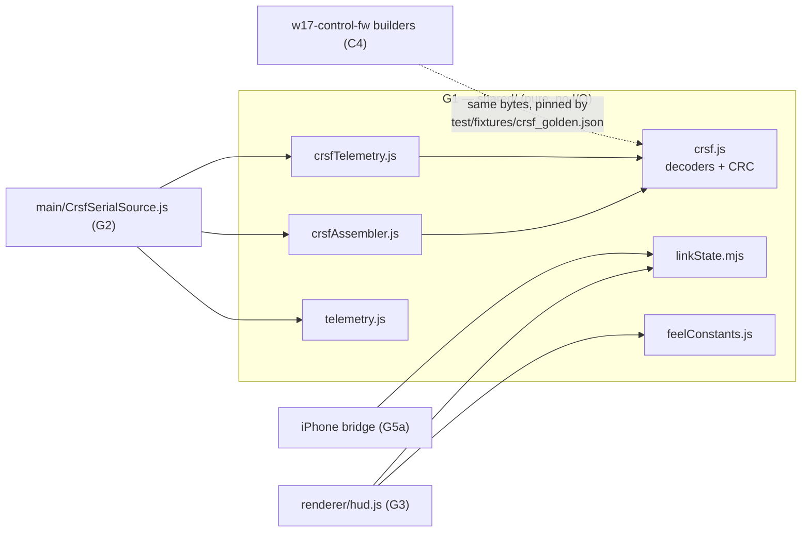

# G1 — Shared Pure Core (JS): CRSF decode, telemetry model, link state

First ground-station batch — and the manual's first JavaScript. §1 is a compact
"JS for a C++ reader" primer; every later JS batch assumes it.

## 0. Scope

| File | Lines | What it is |
|---|---|---|
| `shared/telemetry.js` | 50 | The normalized `Telemetry` typedef + `TelemetrySource` base class (the observer seam) |
| `shared/feelConstants.js` | 13 | Display-feel numbers shared with the firmware's `ErsConfig`/gearbox |
| `shared/crsf.js` | 169 | CRSF wire-format decode — the JS re-implementation of `w17-control-fw/lib/crsf` |
| `shared/crsfAssembler.js` | 45 | Byte-stream → frame assembler, mirroring the firmware `CrsfFrameAssembler` |
| `shared/crsfTelemetry.js` | 51 | Decoded frame → partial `Telemetry` mapper |
| `shared/linkState.mjs` | 31 | The four-state HUD link-state model (audit F2 / risk R01) |
| `test/fixtures/crsf_golden.json` | 38 | The **shared cross-repo golden vectors** (audit F3 / risk R07) |
| `test/crsf.test.js` | 152 | 13 tests: CRC KAT, frame decode, assembler, golden fixture |
| `test/crsfTelemetry.test.js` | 121 | 10 tests: mapper + end-to-end assembler→mapper, golden end-to-end |
| `test/linkState.test.js` | 72 | 9 tests: the pure link-state function + demo-timeline integration |

≈ 742 lines. Plan ID **G1** (`source_code_explanation_plan.md`). Inventory re-verified
against the tree 2026-07-09 (this batch's session).

**Test status:** `npx vitest run test/crsf.test.js test/crsfTelemetry.test.js
test/linkState.test.js` → **32/32 PASSED** (13+10+9), 2026-07-09. Full suite the same
session: **118/118 PASSED** (8 files, 347 ms).

**Label convention** (same as C/S batches): **VERIFIED** = read in source AND pinned by a
test I ran, or re-derived independently; **INFERRED** = deduced, chain given;
**PROVISIONAL** = plausible, awaiting a later batch or hardware/bench evidence.

### Where this fits



`shared/` is the ground station's analogue of the firmware's pure `lib/` modules: no
sockets, no serial port, no DOM, no clock of its own — which is exactly why all of it
runs under vitest on any machine. The I/O wrappers (serial source, Electron main,
renderer) come in G2/G3; the iPhone-bridge shared files (`telemetrySnapshot.js`,
`headTracking.js`) are deliberately **not** in this batch (G5a/G5b, see the plan).

### Prerequisites

Chapter 08 (Electron anatomy, the HUD's three data sources), chapter 09 §1/§3 (CRSF
framing and the telemetry backchannel — this batch is the **third implementation** of
that protocol knowledge, after the firmware decoder (C3/C4) and the byte-level chapter
itself), chapter 12 §4/§6 (why `linkState.mjs` and the golden fixture exist at all —
audit risks R01/R07). No prior JavaScript assumed.

---

## 1. JavaScript for a C++ reader (the 15-minute version)

You know C++ from C1–C10. JS differs in ways that matter for reading this code:

1. **No compiler, no types at compile time.** JS is run from source; a variable holds
   anything (`let x = 5; x = "five";` is legal). Where the firmware had `struct
   Telemetry`, this repo has a **JSDoc comment** (`@typedef` in `telemetry.js`) — pure
   documentation, enforced by nothing. Tests replace the type-checker.
2. **One number type.** `Number` is an IEEE-754 double — there is no `uint8_t`/`int32_t`.
   Two consequences you'll see below: byte math must **mask** (`& 0xff`) where C++ would
   truncate for free, and signed bytes need an explicit helper (`toInt8`) where C++ would
   `static_cast<int8_t>`. Bitwise operators (`<<`, `|`, `&`) internally convert to
   **32-bit integers**, so `(payload[4] << 16) | ...` for a 24-bit value is exact and safe.
3. **`const` / `let`** declare block-scoped variables (`const` = the *binding* can't be
   reassigned; the object it points to is still mutable). You will not see `var` here.
4. **Objects are dictionaries.** `{ voltageV: 7.9 }` creates an ad-hoc object; fields can
   be added/omitted freely. "Partial `Telemetry`" is idiomatic JS, not a hack: an absent
   field reads as `undefined`.
5. **`undefined` vs `null`:** `undefined` = "field not there"; `null` = "deliberately
   nothing". Both are *falsy* (as are `0`, `''`, `NaN`), which the code exploits
   (`if (!frame) return null;`). `??` (nullish coalescing) picks the right-hand side only
   for `null`/`undefined` — used in the tests (`asm.feedByte(b) ?? out`).
6. **Functions are values; arrow functions** `(s) => s.trim()` are lambdas. A function
   returned from another function **closes over** its locals — `onTelemetry` returns an
   unsubscribe closure, the JS idiom for RAII-less cleanup.
7. **Classes** exist (`class CrsfAssembler { ... }`) — sugar over prototypes; fields are
   created by assignment in the constructor; a leading `_underscore` is a *convention*
   for "private", enforced by nothing.
8. **Modules, two systems** — the one genuinely confusing thing in this repo:
   - **CommonJS (CJS)**: `require()` / `module.exports`. Synchronous, Node's original
     system. Used by `.js` files here because the **Electron main process** loads them
     and it is CJS (see the comment atop `main/main.js`, G2).
   - **ES modules (ESM)**: `import` / `export`. The standard; what browsers and vitest
     speak natively. `linkState.mjs` uses the `.mjs` extension to *opt in* to ESM because
     its consumers are the renderer page and vitest — its header comment says exactly
     this. (How the CJS main process still reaches it — a dynamic `import()` — is a G2
     story.) The *test* files are ESM (`import ... from`) and can `require`-free load
     both kinds; vitest bridges the two.
9. **`Uint8Array`** is a real byte array (the closest thing to `uint8_t[]`);
   `Uint8Array.from(array)` copies; `.slice(a, b)` returns a **copy** of `[a, b)` —
   contrast C++ `std::span`-style views; the copy is why `decodeFrame` can hand out
   `payload` safely after the assembler reuses its buffer.
10. **Template literals** `` `text ${expr}` `` are `printf`-lite; **destructuring**
    `const { SYNC_BYTE, decodeFrame } = require('./crsf.js')` unpacks named exports —
    read it as "using-declarations for a module".
11. **Regular expressions**: `/G(\d+)/` is a pattern literal — `\d+` = one-or-more
    digits, `(...)` = capture group. `re.exec(str)` returns `null` or a match array
    whose `[1]` is the first capture. First (and almost only) regex in the project —
    `parseFlightMode` below.
12. **Exceptions** (`throw new Error(...)`) exist and two decoders use them for
    too-short payloads — unlike the firmware, which returns result enums everywhere.
    The result-enum style *also* appears (`DecodeResult`) — see §4.6 for who throws
    and who returns, and why that split is safe here.

That's everything G1 needs. (Gamepad API, DOM, Promises/`async` arrive with G2/G3.)

---

## 2. `shared/telemetry.js` — the contract type + the source seam (50 lines)

### 2.1 Header comment (lines 1–14)

States the design rule the whole repo hangs on: the car sends only **car-side truths**
the ground can't infer (speed, battery, gear/mode/ERS, link quality); everything else on
the HUD comes from the gamepad + display model. Lines 10–14 are the **audit-R01 honesty
note**: `armed`/`failsafe` are **DEMO-ONLY** — the real CRSF backchannel never carries
them; only `shared/replaySource.js` sets them; real link loss is *derived* from
`linkQualityPct` + staleness (`linkState.mjs`, §7). **VERIFIED** — §4/§6 show no decoder
ever produces `armed`/`failsafe`, and ch12 §4 records where this rule came from.

### 2.2 The `Telemetry` typedef (lines 16–29)

A JSDoc `@typedef` — the JS stand-in for a C++ struct declaration (§1 item 1). Every
property is `[bracketed]` = optional. Fields: `speedKmh`, `batteryV`, `batteryPct`,
`armed`/`failsafe` (demo-only), `linkQualityPct`, `rssiDbm` (*"uplink RSSI, negative
dBm"*), `snrDb`, `gear`, `ersPct`, `driveMode`. This is the same contract table as
`docs/TELEMETRY.md` — doc and typedef agree field-for-field (**VERIFIED**, compared this
session; TELEMETRY.md's table omits `rssiDbm`/`snrDb` but they're implied by its
LINK_STATISTICS row and present in the mapper, §6).

### 2.3 `TelemetrySource` (lines 31–48)

```js
class TelemetrySource {
  constructor() { this._listeners = new Set(); }
  onTelemetry(cb) { this._listeners.add(cb); return () => this._listeners.delete(cb); }
  _emit(telemetry) { for (const cb of this._listeners) cb(telemetry); }
  start() {}
  stop() {}
}
```

- The **observer pattern** in seven lines: consumers register callbacks; implementations
  call `_emit`. `Set` (not array) makes double-subscribe harmless and delete O(1).
- `onTelemetry` returns an **unsubscribe closure** (§1 item 6) — call it to detach.
- `start()`/`stop()` are empty defaults — the "interface" is duck-typed: JS has no
  `virtual`/`= 0`; a subclass simply overrides. This class is the ground station's
  analogue of a `hal::I*` seam: `ReplaySource` (G2), `CrsfSerialSource` (G2) both extend
  it, and `main.js` (G2) consumes any of them identically.
- The comment above the class (lines 31–34) names the planned implementations, including
  a future `WebSocketSource/UdpSource` "clean path". **PROVISIONAL** — a stated intent,
  no such source exists in the tree (verified by listing).

---

## 3. `shared/feelConstants.js` — five numbers, one drift rule (13 lines)

```js
module.exports = {
  ERS_DEPLOY_PCT_PER_SEC: 26,   // ErsConfig deployRatePermille 260
  ERS_HARVEST_PCT_PER_SEC: 11,  // harvestBrakeRatePermille ~110
  ERS_BOOST_MULTIPLIER: 1.18,   // boostBonusPermille 180
  GEARS: 4,                     // matches the firmware gearbox numGears=4 (audit R05)
  TOP_SPEED_KMH: 320,           // themed; set to real measured top speed later
};
```

- The header comment is precise about what is shared: the **numbers**, NOT the
  algorithm — the firmware's ERS is an energy integrator driving an ESC (C6); the HUD's
  is a display animation (G3). Only the *rates* must match so the on-screen bar
  drains/fills like the car's.
- Cross-check against C6's `ErsConfig` (**VERIFIED**): deploy 260 ‰/s = 26 %/s ✓;
  harvest brake 110 ‰/s = 11 %/s ✓; boost +180 ‰ ⇒ ×1.18 ✓. `GEARS: 4` matches the
  firmware `numGears = 4` — this is **audit R05's** fix (the HUD once used 8 gears;
  ch12 §6).
- *"A test guards these against drift"* (line 6) — true but **narrower than it reads**:
  the guard (`test/replay.test.js`, a **G2** file, run this session as part of 118/118)
  pins only the three ERS numbers. `GEARS` is pinned indirectly (the replay test asserts
  the demo timeline tops out at gear 4) and `TOP_SPEED_KMH` not at all — it's "themed"
  by its own admission. Logged as open question **#59a** (doc-consistency, low stakes).
- `TOP_SPEED_KMH: 320` is display theming, awaiting a measured top speed —
  **hardware-gated**, joins the bench list (#59-adjacent; the car's real top speed is a
  D8 outcome).

---

## 4. `shared/crsf.js` — the protocol, third implementation (169 lines)

The most consequential file in the batch. The header comment (lines 1–11) is admirably
honest and worth quoting in spirit: this is *"a parallel reimplementation"* of
`w17-control-fw/lib/crsf`; the two sides are *"NOT one codebase — the layouts are
mirrored by hand and pinned by a shared golden fixture"*; *"there is no automated import
of the firmware's vectors, so keep the fixture in sync when the wire format changes."*
That is the whole cross-repo story: agreement is enforced by **tests on identical
bytes**, not by shared source (contrast link2's verbatim-copy strategy, S1).

### 4.1 Constants (lines 13–23)

`SYNC_BYTE = 0xc8`; frame types `RC_CHANNELS_PACKED 0x16`, `LINK_STATISTICS 0x14`,
`BATTERY 0x08`, `GPS 0x02`, `FLIGHT_MODE 0x21`; `CRC8_POLY = 0xd5`; payload lengths
10/8/15. All match the firmware's `CrsfFrame.hpp` (C3) and ch09 §1 (**VERIFIED**).

One observation: `FRAME_TYPE_RC_CHANNELS_PACKED` is exported but **used nowhere** in the
repo (grep this session — no runtime file or test references it), and no RC-channels
*decoder* exists at all. That's the viewer-only property showing up as an absence: the
ground station never looks at stick data on the wire (it mirrors the local gamepad
instead, ch08 §3), and `test/noControlPath.test.js` (G5b) additionally asserts no
*encoder* ever appears. The constant reads as documentation-by-name. **VERIFIED**
(absence checked); design intent **INFERRED**.

### 4.2 `computeCrc8` (lines 27–37) — CRC-8/DVB-S2, fourth copy in the project

```js
function computeCrc8(bytes, start = 0, len = bytes.length - start) {
  let crc = 0;
  for (let i = 0; i < len; i++) {
    crc ^= bytes[start + i];
    for (let bit = 0; bit < 8; bit++) {
      crc = crc & 0x80 ? ((crc << 1) ^ CRC8_POLY) & 0xff : (crc << 1) & 0xff;
    }
  }
  return crc;
}
```

- Same algorithm as the firmware's three self-contained C++ copies (crsf C3, link2 C8,
  settings C9a): XOR the byte in, then eight MSB-first shift/XOR-poly steps.
- **The JS twist:** in C++ the `uint8_t` register truncated overflow for free; a JS
  `Number` never overflows, so **both** branches mask with `& 0xff`. Same fix C3's
  review taught for the 9-bit intermediate (`0x160 → ^0xD5 → 0xB5`), just spelled
  explicitly. Note `crc & 0x80` tests the top bit *before* the shift — equivalent to
  C3's test-then-shift ordering.
- Default parameters (`start = 0`, `len = ...`) let callers CRC a whole buffer or a
  span — `decodeFrame` uses the span form over `[type + payload]`.
- **VERIFIED** two ways this session: the catalog known-answer `"123456789" → 0xBC`
  (same KAT the firmware pins, re-run via `node` directly), and every golden-fixture
  frame CRC-validating (§8/§9).

### 4.3 `toInt8` (lines 39–41)

`b > 127 ? b - 256 : b` — reinterprets a byte as signed, what C++ does with a cast. Used
for the two SNR fields; the golden link-stats vector pins it (`0xF6 → −10`). **VERIFIED**.

### 4.4 The payload decoders (lines 46–97)

Each takes a payload (the bytes between type and CRC), length-checks, and returns an
object. All multi-byte fields are **big-endian** — matching C4's frame *builders*
("network order", the CRSF convention; contrast link2's little-endian, C8/ch09 §2).

- **`decodeLinkStatistics`** (46–62): 10 named bytes in firmware-struct order;
  `uplinkLinkQuality` at **offset 2** is the one that matters — the comment says it
  plainly: *"the failsafe-relevant field: ELRS forces it to 0 on link loss"*
  (**PROVISIONAL** as a radio behavior — that's ELRS ecosystem knowledge, bench item
  #27/#28; what's VERIFIED is only that offset 2 is where the code and both goldens put
  LQ). SNRs go through `toInt8`.
- **`decodeBattery`** (69–79): voltage `(p[0]<<8 | p[1]) / 10` — decivolts to volts
  (**the JS type shows**: the firmware kept integer millivolts everywhere, C7; JS
  happily divides into a fractional `Number`); current likewise deci-amps; capacity is a
  **24-bit** big-endian build from three shifts; percent raw. Worked example, golden
  frame: `00 4F` → 79 dV → **7.9 V**; `48` → **72 %** (re-computed by hand ✓).
- **`decodeGps`** (88–97): consumes only 3 of the 15 bytes' fields — `speedKmh` from
  offset 8–9 (0.1 km/h units: `0x0169` = 361 → **36.1 km/h**), `altitudeM` from 12–13
  **minus the 1000 m baseline** (so `0x03E8` = 1000 → 0 m), `satellites` at 14. Lat/lon/
  heading are skipped — the car sends zeros there (C10's telemetry tick fills only
  groundspeed; the comment calls the rest "benign filler"). **VERIFIED** against C4's
  builder layout + the golden vector.
- **`decodeFlightMode`** (102–109): builds a string byte-by-byte until the NUL —
  `String.fromCharCode(b)` is the `char` cast. Returns the raw text (`"G3 M2 E55"`).

### 4.5 `parseFlightMode` (lines 113–122) — the project's first regex

```js
const g = /G(\d+)/.exec(str);
if (g) out.gear = Number(g[1]);
```

Three patterns pull `G<n>`, `M<n>`, `E<n>` out of the status string in **any order,
any spacing**, returning only what matched (a partial object again). This is the
ground half of the firmware's `snprintf("G%u M%u E%u", ...)` (C10 §4) — "we own the
parser both ends" (TELEMETRY.md). Tolerance is the point: a future firmware adding a
field (say `T<n>`) degrades gracefully to "ignored", not "parse error". **VERIFIED**
(golden flightmode test + the mapper tests).

### 4.6 `DecodeResult` + `decodeFrame` (lines 125–148)

`DecodeResult` mirrors the firmware enum by name — but as an object of **strings**
(`Ok: 'Ok'`), the debug-friendly JS idiom (a failed assertion prints `'BadSync'`, not
`1`).

`decodeFrame` validates one complete buffer `[sync][len][type][payload...][crc]`:

1. `length < 4` → `BadLength` (minimum viable frame);
2. `frame[0] !== SYNC_BYTE` → `BadSync`;
3. `length` byte counts **type+payload+crc** (the CRSF convention, ch09 §1); require
   `frame.length === 2 + length` **exactly** — a direct caller must slice precisely
   (the assembler guarantees this by construction, §5);
4. CRC over `[type + payload]` = `computeCrc8(frame, 2, length - 1)` — same span as the
   firmware (`buffer_ + 2`, `crcSpan = expectedLength_ - 1`; compared against
   `CrsfFrameAssembler.cpp` this session, **VERIFIED**);
5. success returns `{ result, type, payload }` where `payload = frame.slice(3, 2 +
   length - 1)` — a **copy** (§1 item 9), excluding type and CRC.

Validation order sync→length→CRC matches the firmware's (C3). On the §1-item-12
question — who throws, who returns codes: `decodeFrame` returns codes (wire input =
expected to be dirty), while the payload decoders **throw** on short payloads. That
would be a crash risk if reachable — but a frame that passed `decodeFrame` already has
a self-consistent length, and the mappers only feed same-typed payloads through. So the
throw is an assert-in-disguise for programmer error, not a wire-noise path.
**INFERRED** (no test feeds a short payload through the full pipeline; the direct
short-payload behavior itself is source-read).

---

## 5. `shared/crsfAssembler.js` — bytes → frames (45 lines)

The stateful streamer for the serial path (G2's `CrsfSerialSource` owns one). I compared
it side-by-side with the firmware's `CrsfFrameAssembler.cpp` this session (read-only):

| Aspect | Firmware (C3) | JS | Same? |
|---|---|---|---|
| States | `WaitingForSync/ReadingLength/ReadingPayload` enum | implicit in `_buf.length` (0 / 1 / more) | behaviorally ✓ |
| Length guard | `expectedLength_ < 2 ‖ totalFrameLen > 64` → reset | `b < 2 ‖ totalLen > MAX_FRAME_LEN(64)` → reset | ✓ identical bounds |
| CRC span | `buffer_+2`, `expectedLength_-1` bytes | `decodeFrame` recomputes the same span | ✓ |
| On bad CRC | `FrameInvalid`, state reset | `decodeFrame` ≠ Ok → return `null`, buffer cleared | ✓ |
| Bytes consumed by a failed frame | not re-scanned (reset, wait for next sync) | not re-scanned (`_buf = []`) | ✓ |
| Output | result enum + accessor methods | the decoded `{type, payload}` object or `null` | JS folds decode into assembly |

So `feedByte` returns **null while incomplete** and the decoded frame only when a
complete, CRC-valid frame lands — the JS version merges C3's assembler with the decode
step (the firmware keeps them separate because different consumers want raw frames).
The one behavioral wrinkle both sides share: a `0xC8` *inside* a discarded frame's
already-consumed bytes is lost — resync waits for the next arriving sync byte. At 5 Hz
telemetry on a quiet line, self-healing within a frame or two (**INFERRED**; the
resync-after-corruption *test* is pinned, §9.1).

Line notes: `this._buf = []` — a plain growable array of numbers (fine at 64-byte
scale); `Uint8Array.from(this._buf)` converts once at completion for `decodeFrame`;
`?? null` semantics give callers the "latest frame or nothing" contract the tests lean
on.

---

## 6. `shared/crsfTelemetry.js` — frames → partial `Telemetry` (51 lines)

`frameToTelemetry(frame)` is a type-switch returning the **partial** Telemetry each
frame type carries, or `null` for unmapped types:

- **Battery 0x08** → `{ batteryV, batteryPct }` (drops current/capacity — the car sends
  zeros; no current sensor, C7).
- **LinkStatistics 0x14** → `{ linkQualityPct, rssiDbm: -s.uplinkRssiAnt1, snrDb }`.
  The **sign flip** is the interesting line: CRSF carries uplink RSSI as a *positive
  magnitude* (75 meaning −75 dBm), so the mapper negates it once, here, and everything
  downstream thinks in real dBm. SNR is already signed (via `toInt8`). **VERIFIED**
  (test pins 70 → −70; golden pins 0x4B=75 → −75).
- **GPS 0x02** → `{ speedKmh }` **only** — altitude and satellites are decoded (§4.4)
  then deliberately dropped; the HUD has no widget for them and the car sends the
  baseline/zeros. **VERIFIED** (source; consistent with TELEMETRY.md's mapping table).
- **FlightMode 0x21** → `parseFlightMode(decodeFlightMode(payload))`, but with a guard:
  `Object.keys(f).length ? f : null` — an unparseable status string maps to `null`
  ("not telemetry"), not to an empty update.
- Anything else → `null`, and the comment states the philosophy: *"unmapped telemetry
  type -> HUD keeps simulating."*

Note what this file does **not** do: merging. One frame = one partial. The *running
snapshot* (a battery frame must not blank speed) is accumulated by `CrsfSerialSource`
(G2) — the mapper stays a pure function.

---

## 7. `shared/linkState.mjs` — four states, five inputs, one expression each (31 lines)

The audit-F2 module (risk R01 — the old HUD's link-loss indicator worked only in the
demo; ch12 §4/§6 tell that story). 24 lines of comment, 7 of code:

```js
export const TELEMETRY_FRESH_MS = 1000;

export function linkState({ nowMs, lastTelemetryMs, everLive, linkQualityPct, failsafe }) {
  if (!everLive) return 'sim';
  if (nowMs - lastTelemetryMs >= TELEMETRY_FRESH_MS) return 'telemetry-lost';
  if (failsafe || linkQualityPct === 0) return 'link-lost';
  return 'live';
}
```

- **Pure and clock-injected** — `nowMs` is a parameter, exactly the `nowMs`-as-parameter
  time seam S1's `Link2Monitor` used. No DOM, no timer: unit-testable anywhere.
- **Precedence is the design.** Read top-down: never-live wins (honest "sim" label);
  staleness beats link quality (a silent source's last LQ value is meaningless);
  only a *fresh* LQ 0 means "the radio to the car dropped" (the ground TX module keeps
  reporting LINK_STATISTICS after the car vanishes — that's *why* fresh-but-LQ-0 is
  distinguishable, ch08 §3). **VERIFIED** at the logic level by the 9 tests.
- **`everLive` makes `telemetry-lost` sticky**: once any source was live, the HUD may
  never silently resume simulated numbers — the caller (renderer, G3; bridge, G5a)
  latches `everLive` and holds the last real values dimmed. The stickiness lives in the
  *caller's latch*, not in this function (it's stateless); the test "minutes later it
  must still say telemetry-lost" pins the function's side of the bargain.
- **The `>=` staleness edge is inclusive** — at exactly 1000 ms the state is already
  `telemetry-lost`; the boundary test pins `FRESH_MS − 1` as still `live`. Same
  inclusive-edge convention as S1's `elapsed >= 500`.
- **`failsafe ||`** is the demo-only OR-trigger: the real path never sets `failsafe`
  (§2.1), so on real hardware the trigger is purely `linkQualityPct === 0`. Note the
  `===` strict equality: an **absent** LQ (`undefined === 0` is false) is NOT link-lost
  — a source that has only ever sent battery frames reads `live`, pinned by the
  "missing LQ" test. **VERIFIED**.
- Chapter 08 §3's four displayed states map 1:1 onto these return strings
  (`sim`/`live`/`link-lost`/`telemetry-lost` → "Telemetry: sim" / LQ% / LINK LOST /
  TELEMETRY LOST). How the *renderer* renders them (dimming, colors) is G3 (#47).

---

## 8. `test/fixtures/crsf_golden.json` — the cross-repo wire truth (38 lines)

Audit F3's answer to risk R07 ("three hand-synced copies of wire truth with no drift
guard", ch12 §5/§6). Four entries — `battery`, `gps`, `flightmode`, `linkStatistics` —
each carrying the **exact on-wire hex** plus the values `shared/crsf.js` must decode
from it. The `_comment` block states the contract: the vectors *"mirror the firmware
builder tests"*, naming `test_build_battery_frame_bytes`,
`test_build_gps_frame_groundspeed_be`, `test_build_flight_mode_frame_*`.

**Cross-checked against the firmware this session** (read-only, `w17-control-fw/test/
test_crsf/test_main.cpp`): battery 79 dV / 72 % with `00 4F` at payload head ✓; GPS
groundspeed 361 (`01 69` at payload 8–9) and altitude 1000 (`03 E8`) ✓; flightmode
`"G3 M2 E55"` + NUL, payloadLen 10 ✓. So the fixture's claim to mirror the firmware
tests is **VERIFIED**, not taken on faith. (The linkStatistics vector has no firmware
builder to mirror — the ground TX module generates that frame in real life; its fixture
entry says so.)

Hand-decode of the battery vector (the batch's worked example, ch09-style):

```
c8 0a 08 00 4f 00 00 00 00 00 48 4e
│  │  │  └────────┬───────────┘ └─ CRC-8/0xD5 over [type+payload] = 0x4E
│  │  │           └ payload (8): volt 0x004F=79→7.9V · curr 0 · cap 0 · 0x48=72%
│  │  └ type 0x08 BATTERY
│  └ length 0x0A = 10 = type(1) + payload(8) + crc(1)
└ sync 0xC8
```

I re-computed the CRC independently this session (`node`, the repo's own `computeCrc8`
over bytes 2..10 → `0x4E` = the frame's last byte) and decoded the frame → exactly the
fixture's `expect` values. **VERIFIED**.

What the fixture does and doesn't guard: it pins the **JS decode side** against these
frozen bytes; the firmware side is pinned by its own builder tests against the same
values. If either side drifts, its own suite fails. What nothing automates is the
*fixture-to-firmware-test* correspondence itself — the `_comment` says "keep the fixture
in sync when the wire format changes" (a discipline rule, like link2's do-not-fork).
There is no CI job diffing these bytes across repos (contrast the link2 drift-guard job,
F3's other half). **VERIFIED** (both CI files read).

---

## 9. The three test files — 32 tests, assertion by assertion

Run this session: **32/32 PASSED**. Test files are ESM (§1 item 8); both CRSF suites
define a local `buildFrame(type, payload)` helper — an *encoder in test code only*,
which is fine and deliberate: shipping code stays decode-only (the no-encoder guard in
`noControlPath.test.js` scans `shared/crsf.js` exports, not tests; G5b).

### 9.1 `test/crsf.test.js` — 13 tests

- **CRC KAT** — `"123456789"` → `0xBC`, the same catalog check value the firmware pins
  (C3): the two implementations are anchored to the same external truth.
- **decodeFrame ×4** — round-trips a link-stats frame (spot values incl. `0xF6 → −10`
  SNR); bad sync → `BadSync`; corrupted last byte → `CrcMismatch`; truncated buffer →
  `BadLength`. Each failure mode gets its own test — the enum's three failure values
  all pinned.
- **decodeBattery** — full four-field decode incl. 24-bit capacity (`0x0004D2` = 1234
  mAh — the same worked value C4's builder test used on the firmware side).
- **CrsfAssembler ×2** — byte-by-byte feed emits exactly one frame; then the resync
  test: 3 noise bytes ignored, a corrupt frame swallowed with **no emit**, and the
  next good frame still decodes — the "ignores noise and resyncs" contract of §5.
- **Golden fixture ×5** — each vector decoded to its `expect` block, plus the fifth
  ("every fixture frame is CRC-valid") which the comment correctly calls the guard of
  the **shared CRC domain** — if JS ever CRC'd a different span or poly, all four die
  at once.

### 9.2 `test/crsfTelemetry.test.js` — 10 tests

- **Mapper ×5** — battery → `batteryV/batteryPct`; link-stats → LQ + **rssiDbm sign
  flip** (70 → −70) + SNR; GPS → `speedKmh` 36.1; flightmode string → `{gear:3,
  driveMode:2, ersPct:55}` via `toEqual` (exact object — proves altitude/satellites and
  extra fields do NOT leak through); unmapped type and `null` → `null`.
- **End-to-end ×1** — noise + a battery frame through the real assembler + mapper: the
  `CrsfSerialSource` pipeline minus the serial port.
- **Golden end-to-end ×4** — every fixture vector fed **byte-by-byte** through
  assembler → mapper → HUD fields. This is the strongest single claim in the batch:
  *the firmware's exact on-wire bytes produce the expected HUD telemetry.*

### 9.3 `test/linkState.test.js` — 9 tests

- **Pure function ×7** — `sim` regardless of clock when never-live; `live` when fresh +
  LQ>0; **LQ 0 → `link-lost`** ("the real-path trigger"); `failsafe` still triggers
  (demo compatibility); stale → `telemetry-lost` **and sticky at +300 s**; the
  boundary test (`FRESH_MS − 1` still live — pinning the inclusive edge from the other
  side); **missing LQ is not link-lost** (the `=== 0` strictness).
- **Demo-timeline integration ×2** — imports `sampleTimeline`/`DEMO_TIMELINE` from
  `shared/replaySource.js` (a **G2 file** — noted as this batch's one forward
  dependency): at t=15 s the scripted loss window emits `linkQualityPct: 0`, and the
  test strips the demo's `failsafe` flag to prove **LQ=0 alone** flips the state — the
  demo exercises the same trigger the real car path will. Outside the window: `live`.
  (The timeline itself is explained in G2.)

### 9.4 What these tests prove — and don't

**Proven (laptop-level):** byte-exact protocol agreement with the frozen firmware
vectors; CRC domain/poly/span; big-endian layouts; signedness; the sign flip; assembler
framing incl. resync; the full four-state link-state truth table including both edges
and the missing-LQ case.

**Not proven — and where it waits:**
- Anything *serial*: port opening, 420 kbaud timing, byte loss under load →
  `CrsfSerialSource` (G2) is a thin untested-by-unit-tests I/O wrapper; real behavior is
  **bench** (#28: does elrs-joystick-control forward telemetry / com0com).
- Whether **ELRS actually forces LQ→0** on link loss, its stats cadence, and burst
  behavior → **bench** (#27). The ground station's whole link-lost display rests on
  this radio-ecosystem fact; the code is ready either way (any fresh LQ 0 displays).
- That the **car firmware sends** these frames at the promised cadences → C10 explains
  the sending code; end-to-end over a real radio is **bench** (D8 ground-side chain).
- Rendering: dimming, colors, widget precedence (#47) → G3.
- 32 green vitest tests are **source/test evidence only** — no hardware claim anywhere
  in this batch (nothing here touches hardware even in principle; the nearest hardware
  is the FT232 on the far side of G2).

---

## 10. Findings, labels, bookkeeping

**Summary of labels:** everything in §§2–9 marked VERIFIED is backed by source read +
the 32 tests run this session (+ the independent `node` CRC/decode re-computation, + the
firmware-side cross-reads of `CrsfFrameAssembler.cpp` and `test_crsf/test_main.cpp`).
INFERRED items: the throw-vs-result-code safety argument (§4.6), the lost-embedded-sync
self-healing rate (§5), the viewer-only reading of the unused RC-channels constant
(§4.1). PROVISIONAL/bench: ELRS LQ-zeroing behavior (#27), serial-path realities (#28),
real top speed (feel theming), everything renderer-facing (#47, G3).

**New open question:** **#59** (doc-consistency, low stakes) — (a) `feelConstants.js`
says "a test guards these against drift" but the guard covers 3 of 5 constants (§3);
(b) `FRAME_TYPE_RC_CHANNELS_PACKED` exported, referenced nowhere (§4.1) — likely
deliberate documentation-by-name; owner can confirm or drop.

**Glossary additions this batch:** CommonJS / ES modules, Regular expression, JSDoc.

**Corrections to earlier material:** none needed — ch08 §3 and ch09's protocol tables
match what the code does (checked while reading). The `armed`/`failsafe` demo-only rule
is already stated in ch08/TELEMETRY.md and holds in source.

## 11. Questions to check your understanding

1. The battery golden frame is `c8 0a 08 00 4f 00 00 00 00 00 48 4e`. Which bytes does
   the CRC cover, and why does changing the length byte alone *not* produce
   `CrcMismatch`? (What result does it produce instead, and at which check?)
2. `computeCrc8` masks with `& 0xff` in both branches. The firmware's version doesn't
   mask at all. Both are correct — why?
3. A telemetry source has delivered only battery frames for the last half-second.
   `linkQualityPct` was never set. What does `linkState` return, which single character
   in the source makes that happen, and why is that the right call?
4. The HUD shows "TELEMETRY LOST" with dimmed values. The serial cable is replugged and
   fresh frames arrive. Walk the state transitions — and explain why "sim" can never
   appear again this session.
5. Why does `frameToTelemetry` return `null` for an empty flight-mode parse instead of
   `{}`? What would a `{}` emission do downstream that `null` doesn't? (Think about the
   merge in G2.)
6. The fixture pins JS *decoding* of firmware-built bytes. Name two protocol-drift
   scenarios this catches immediately, and one it structurally cannot catch. (Hint:
   the `_comment`'s last sentence.)
7. RSSI arrives on the wire as `75`. Where exactly does it become `−75`, and why is it
   done there rather than in `decodeLinkStatistics` or the renderer?
