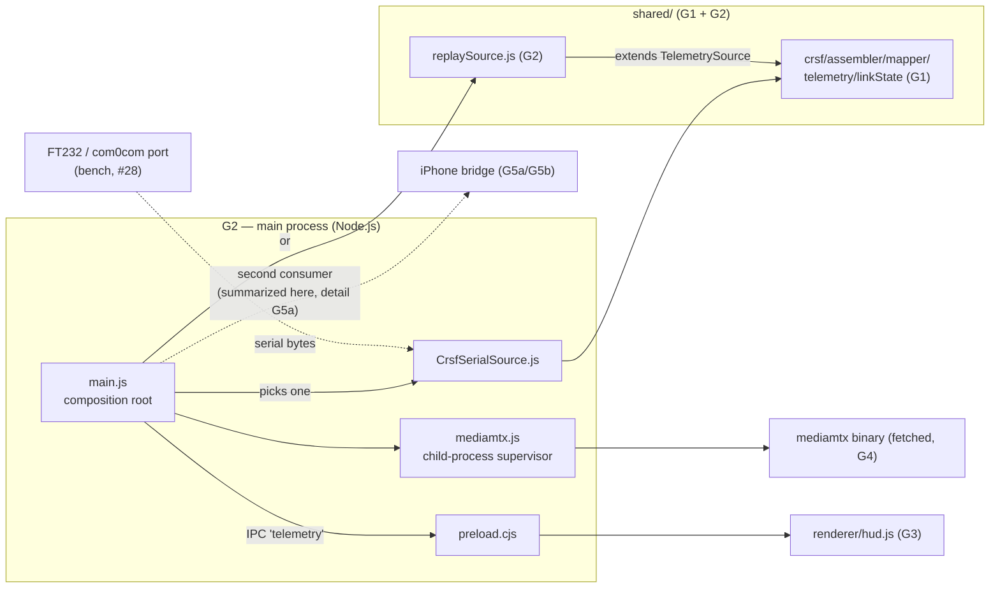

# G2 — Main Process + Telemetry Sources: Electron composition, mediamtx, serial + replay

Second ground-station batch: the **Electron main process** — the app's composition root
(the JS twin of the firmware conductors, C10/S5) — plus the two `TelemetrySource`
implementations that feed the HUD. G1's JS primer (§1 there) is assumed; §1 here adds
the Node/Electron concepts this batch needs.

## 0. Scope

| File | Lines | What it is |
|---|---|---|
| `main/main.js` | 159 | The Electron main process: window, IPC, source selection, lifecycles |
| `main/preload.cjs` | 22 | The one bridge between the sandboxed HUD page and Node |
| `main/mediamtx.js` | 54 | Child-process supervisor for the bundled mediamtx video server |
| `main/CrsfSerialSource.js` | 96 | The real telemetry source: serial port → G1's pure pipeline |
| `shared/replaySource.js` | 93 | The demo/test telemetry source: a scripted 20 s timeline |
| `test/replay.test.js` | 84 | 7 tests: timeline sampling, the replay source, the feel-constants drift guard |

≈ 508 lines. Plan ID **G2** (`source_code_explanation_plan.md`). Line counts verified
against the tree at commit `dab3039` this session (2026-07-09) — same tree as the G0
re-inventory. *(The task brief's `src/` paths were a slip: the repo's real layout is
`main/` + `shared/`, per `package.json`'s `"main": "main/main.js"`.)*

**Test status:** `npx vitest run test/replay.test.js` → **7/7 PASSED**; full suite the
same session → **118/118 PASSED** (8 files, 358 ms). Note which is which: only
`replaySource.js` has a dedicated suite — the other four G2 files have **no unit tests
at all** (§8, deliberately).

**Label convention** (same as all batches): **VERIFIED** = read in source AND pinned by
a test I ran, or re-derived independently; **INFERRED** = deduced, chain given;
**PROVISIONAL** = plausible, awaiting a later batch or hardware/bench evidence.

### Where this fits



`main.js` is to this repo what `src/main.cpp` is to the firmware repos: it constructs
everything, wires the seams, and owns the lifecycles — and, exactly like both firmware
conductors, it is **excluded from the unit-test world** (no vitest file loads it; §8).
The pure logic it delegates to (G1's core, `replaySource`'s sampler) is where the tests
live.

### Prerequisites

G1 (the JS primer + `TelemetrySource`/assembler/mapper/`linkState`), chapter 08 §1–§4
(Electron anatomy, video pipeline, telemetry path), chapter 09 §3 (the telemetry
backchannel), C10 §4 (the conductor pattern this file mirrors), chapter 12 §4 (audit
R01/R03 context). For the bridge blocks: only ch08 §7's summary is needed — the
line-by-line is deferred to G5a/G5b by plan.

---

## 1. Node + Electron concepts for this batch (primer, part 2)

Continuing G1 §1's numbering style — eight things you haven't needed until now:

1. **Node built-in modules & the `node:` prefix.** `require('node:path')`,
   `require('node:child_process')` load Node's standard library (path joining, process
   spawning). The `node:` prefix is modern style making "built-in, not from
   `node_modules`" explicit. `require('electron')` loads Electron's API — available
   only inside a running Electron app (from plain Node it returns a *path to the
   Electron binary* — a documented quirk `scripts/run.js` exploits, G4).
2. **Environment variables** are the ground station's entire configuration system —
   there is no config file. `process.env.W17_TELEMETRY_SOURCE` reads one; unset reads
   as `undefined`, so `process.env.X || 'default'` is the idiom for defaults. The
   firmware's analogue is compile-time `-D` build flags (`W17_TUNING_CONSOLE`, C10);
   env vars are the runtime, no-rebuild version. All `W17_*` knobs: README + §2.4.
3. **Promises and `async`/`await`.** A `Promise` is a value that will *arrive later*
   (the JS answer to "this I/O takes time and we never block"). `await p` inside an
   `async` function suspends that function (not the process!) until `p` resolves.
   `app.whenReady().then(async () => …)` reads: "when Electron finishes booting, run
   this function; inside it we may `await`."
4. **Dynamic `import()`** — the promised resolution of G1 §1 item 8's cliffhanger:
   CommonJS code cannot `require()` an ES module, but it *can* `await import(url)` —
   an async one-off loader that returns the module's exports. That is how the CJS main
   process reaches `shared/linkState.mjs` (§2.8). `pathToFileURL` converts a filesystem
   path to the `file://` URL form `import()` wants (and keeps Windows drive letters +
   backslashes legal — the deployment target matters here).
5. **Child processes.** `spawn(binaryPath, [args], opts)` starts another program as a
   child of this one, giving back a handle with `stdout`/`stderr` streams and an
   `exit` event. `stdio: ['ignore', 'pipe', 'pipe']` = no stdin, capture both output
   streams. Killing the parent does **not** reliably kill children — which is exactly
   why `mediamtx.js` exists (§4).
6. **Timers.** `setTimeout(fn, ms)` runs `fn` once after `ms`; `setInterval(fn, ms)`
   runs it repeatedly; both return a handle for `clearTimeout`/`clearInterval`. This is
   cooperative single-threaded scheduling — no ISRs, no races, but also nothing runs
   while other JS is running.
7. **`Buffer`** — Node's byte array (predates `Uint8Array`; is a subclass of it).
   The serial port delivers data as Buffers; `for (const b of buf)` iterates byte
   values, exactly like a `Uint8Array`.
8. **Electron's two-world security model, concretely.** The renderer page runs with
   `contextIsolation: true, nodeIntegration: false, sandbox: true` (§2.6) — it has *no*
   `require`, no filesystem, no sockets; a compromised or simply buggy page can't touch
   the machine. The **preload** script runs in a privileged middle world and uses
   `contextBridge.exposeInMainWorld` to publish a hand-picked API object into the page
   as `window.groundStation`. **IPC** comes in two flavors, both used here:
   `ipcRenderer.invoke`/`ipcMain.handle` = request/response (returns a Promise — used
   for `config:get`), and `send`/`on` = one-way fire-and-forget (used for `telemetry`
   pushes main→renderer and the `command-mirror` renderer→main).

---

## 2. `main/main.js` — the composition root (159 lines)

### 2.1 The header comment (lines 1–6)

Four facts, all load-bearing: (a) the file is **CommonJS** because *"ESM main on
Electron 31 / Node 20 crashes importing the built-in electron module"* — the
promised reason G1 §1 item 8 deferred (Electron 31 is what `package.json` pins:
`"electron": "^31.0.0"`, resolved 31.7.7); (b) it owns **window lifecycle + the
mediamtx supervisor + the telemetry source**; (c) telemetry reaches the renderer over
**a single IPC channel**; (d) the renderer is **fully sandboxed** — Node only through
the preload. Each claim is checked against the code below — all hold (**VERIFIED**).

### 2.2 Imports (lines 8–19)

Destructured Electron API (`app` = the application lifecycle, `BrowserWindow` = a
window, `ipcMain` = the main-process end of IPC), two Node built-ins (`node:path`,
`pathToFileURL` from `node:url`), then the six local modules: the supervisor, both
telemetry sources, and the four iPhone-bridge modules (`IphoneTelemetryBridge` +
`iphoneBridgeConfig`, `HeadTrackingReceiver` + `headTrackingConfig`) — those four are
**G5a/G5b territory**; this batch covers only how `main.js` *wires* them (§2.5).
Last, `feel = require('../shared/feelConstants.js')` — G1 §3's five numbers, imported
here for a reason that only becomes clear at §2.6.

`projectRoot = path.join(__dirname, '..')` (line 21): `__dirname` is the directory of
the current file (`main/`), so `projectRoot` is the repo root — path math instead of
hardcoded paths.

### 2.3 `mediamtxPaths()` (lines 23–32) — dev vs packaged

```js
const exe = process.platform === 'win32' ? 'mediamtx.exe' : 'mediamtx';
const base = app.isPackaged ? process.resourcesPath : projectRoot;
```

Two axes resolved in two lines: the binary's *name* (Windows needs `.exe`) and its
*location*. In dev the binary sits in the repo's `mediamtx/` (fetched by
`scripts/fetch-mediamtx.js`, G4); in the packaged app it ships as an **unpacked
`extraResource`** at `process.resourcesPath` — because a native binary cannot be
executed from inside the asar archive Electron packs the JS into. **VERIFIED** against
`electron-builder.yml` lines 10–15, whose comment says exactly this (the yml itself is
G4).

### 2.4 `WHEP_URL` + `chooseTelemetrySource()` (lines 34–48)

- `WHEP_URL` (line 35): `W17_WHEP_URL` override, default
  `http://127.0.0.1:8889/cam/whep` — mediamtx's default WebRTC port + the `cam` path
  from `mediamtx/mediamtx.yml`, matching SETUP.md §3 (**VERIFIED**, doc + code agree;
  the override env var appears only here, not in the README — trivia, not drift).
- `chooseTelemetrySource()` is the **source-selection seam** ch08 §4 promised:

  | `W17_TELEMETRY_SOURCE` | Returns | Meaning |
  |---|---|---|
  | `'replay'` | `new ReplaySource()` | the scripted demo (§6) — what `npm run demo` sets (via `scripts/run.js --demo`, G4: one line, `env.W17_TELEMETRY_SOURCE = 'replay'`) |
  | `'crsf-serial'` | `new CrsfSerialSource({path: W17_TELEMETRY_PORT ‖ 'COM5'/'/dev/ttyUSB0', log})` | the real ELRS backchannel (§5); port default is platform-aware |
  | unset / anything else | `null` | **no source at all** — "HUD runs fully on gamepad + display model" (the comment). Plain `npm start` lands here. |

  Both constructed objects satisfy G1 §2.3's `TelemetrySource` duck-type, and the rest
  of `main.js` never again cares which one it got — the observer seam doing its job
  (**VERIFIED**: §2.7 consumes only `onTelemetry`/`start`/`stop`).

### 2.5 The two bridge choosers (lines 50–71) — summarized, detail in G5a/G5b

Same selection pattern, applied to the iPhone bridge: `chooseIphoneBridge(linkStateFn)`
asks `iphoneBridgeConfigFromEnv` to read the `W17_IPHONE_BRIDGE`/`W17_IPHONE_ADDR`/…
env vars and returns `null` unless *fully* configured — *"with either missing … no
socket opened"*. It passes the bridge **the same pure `linkState` function the renderer
uses** — *"so both HUDs agree"* (a deliberate single-truth move; how it obtains that
function is §2.8). `chooseHeadTrackingReceiver()` likewise: `null` unless
`W17_HEADTRACK=1`. Its comment restates the workspace safety boundary verbatim:
**LOG-ONLY**, *"a dead end by construction — nothing consumes its data; it logs and
counts. It must never feed CRSF, servos, pan/tilt, telemetry, or the renderer"*.
The enforcement of that claim (`test/noControlPath.test.js`) and the modules
themselves are G5b; here just note that **wiring-wise** the receiver's output goes
nowhere in this file — constructed, `start()`ed, `stop()`ed, never read
(**VERIFIED** at the `main.js` level: no other line touches `headTracking`).
Real-device validation of the whole bridge stays **PENDING** (#58) — nothing in this
batch changes that.

Lines 73–76: the four module-level singletons (`mediamtx`, `telemetry`,
`iphoneBridge`, `headTracking`), all `null` until boot — the JS version of C10's
static-lifetime module objects, minus the static-init-order subtleties (everything
here is constructed explicitly inside `whenReady`).

### 2.6 `createWindow()` (lines 78–116) — window, security flags, the config handshake

The `BrowserWindow` options (lines 79–90): 1280×720, black background (no white flash
before the HUD paints), `autoHideMenuBar`, and the security triple —
`preload: main/preload.cjs`, `contextIsolation: true`, `nodeIntegration: false`,
`sandbox: true` (§1 item 8). This is the header comment's "fully sandboxed" claim in
the flesh (**VERIFIED**).

**`ipcMain.handle('config:get', …)` (lines 92–102)** answers the renderer's one
request/response call with three things:

- `whepUrl` — where `whep.js` (G3) should connect;
- `hasTelemetrySource: !!telemetry` — `!!` is JS's to-boolean idiom (double negation);
  tells the renderer whether *any* source object exists (how the HUD uses it is G3);
- `feel: { gears, topSpeedKmh, … }` — **and here is why `main.js` imports
  `feelConstants`**: the sandboxed renderer *cannot* `require('../shared/feelConstants.js')`
  — it has no `require`. The five numbers G1 §3 explained travel to the HUD **as IPC
  data** through this handler. One source file, one consumer path, no copy in the
  renderer (**VERIFIED**; the renderer side lands in G3).

**The telemetry fan-out (lines 104–112)** — the heart of the file:

```js
telemetry.onTelemetry((t) => {
  if (!win.isDestroyed()) win.webContents.send('telemetry', t);
  if (iphoneBridge) iphoneBridge.onTelemetry(t);
});
telemetry.start();
```

One subscription, two consumers: every emitted `Telemetry` partial-or-merged object is
(a) pushed to the renderer on the one-way `'telemetry'` channel — guarded by
`isDestroyed()` so a closed window can't crash the push — and (b) handed to the iPhone
bridge if enabled. The comment is a safety statement: *"Feeding it here never alters
the renderer push above (the HUD is untouched)"* — the bridge is a pure additional
reader (**VERIFIED** at this layer: `onTelemetry`'s return value is ignored and
nothing conditions the `send` on the bridge). Then `telemetry.start()` — the source
begins emitting only after the window exists and the listener is attached.

Line 114 `win.loadFile(projectRoot/renderer/index.html)` — the page (G3) loads last.

### 2.7 One INFERRED wrinkle: the macOS `activate` path (→ open question #60)

`ipcMain.handle` registers a **process-global** handler, but it is called inside
`createWindow()` — and `createWindow` can run twice: the `activate` listener
(lines 144–146) re-creates a window when the dock icon is clicked with all windows
closed, which is reachable **only on macOS** (on Windows/Linux, `window-all-closed` →
`app.quit()`, lines 149–151, so the app is gone first). Electron documents that
registering a second handler for the same channel **throws**. So on a Mac: close the
window → app stays alive (the `darwin` exception) → click the dock icon → `activate` →
`createWindow()` → `ipcMain.handle('config:get', …)` throws before anything else in
the function runs. The same double-run would also double-subscribe `onTelemetry` and
re-`start()` the source (harmless for `ReplaySource`, whose `start()` is
idempotent-by-guard, §6.4; unguarded in `CrsfSerialSource`, §5.3) — but the throw
happens first. **INFERRED** (source + documented Electron behavior; not executed — I
don't launch apps in a manual session). Impact honestly assessed: **zero on the
deployment target** (Windows quits on window close), an annoyance on the macOS dev
machine only. Logged as **#60a**; the clean fix (register the handler once in
`whenReady`) is a one-liner *in the read-only repo* — owner's call.

### 2.8 Boot order: `app.whenReady()` (lines 118–147)

The async boot sequence, in order — the ground station's `setup()`:

1. **mediamtx first** (lines 119–121): resolve paths, construct the supervisor,
   `start()` — video begins recovering/serving before anything else, since it has the
   longest startup (a child process).
2. **Pick the telemetry source** (line 123) — §2.4. Not started yet; `createWindow`
   starts it after the listener is wired (§2.6 — no emissions can be lost to an
   unattached observer, though nothing buffers either; INFERRED design reading).
3. **The dynamic import** (line 128): `await import(pathToFileURL(shared/linkState.mjs))`
   — §1 item 4's CJS→ESM one-off, resolving G1's "how the CJS main process still
   reaches it" cliffhanger. The comment explains *why this module is ESM at all* (its
   consumers are the renderer + vitest) and why main wants it anyway: *"so the bridge
   derives link state with the exact same logic as the HUD."* One nit: the comment
   says *"Only used when the bridge is enabled"* — the *import itself* runs
   unconditionally (harmless, a few ms; the imported function is merely unused when
   the bridge is off). Filed under #60b as a wording nit.
4. **Bridges** (lines 129–133): construct-and-start each of the two iPhone pieces iff
   its env config enables it (§2.5) — with both unset (the default, and the only
   state the manual can currently claim), **neither object exists and no UDP socket
   opens** (**VERIFIED** at wiring level: `null` short-circuits both `start()` calls).
5. **The command-mirror listener** (lines 138–140): `ipcMain.on('command-mirror', …)`
   — the **one-way** flavor (§1 item 8) — forwards the renderer's display mirror
   (throttle/brake/steering/camera *as drawn on the HUD*) to the iPhone bridge, or
   silently drops it when the bridge is off. The comment carries the safety framing:
   *"one-way: nothing is sent back, and no control state is touched."* What the
   renderer actually sends is G3 (`sendCommandMirror`, §3); what the bridge does with
   it is G5a.
6. **`createWindow()`** (line 142), then the macOS `activate` convention (§2.7).

### 2.9 Shutdown (lines 149–159)

`window-all-closed` → quit except on macOS (the platform convention). `will-quit` →
stop everything in reverse-ish order: `headTracking`, `iphoneBridge`, `telemetry`,
`mediamtx` — the comment names the real target: *"Always tear down the child + source
so nothing is orphaned"* — an orphaned mediamtx would keep port 8889/8554 hostage for
every future launch (§4's opening comment tells the same story from the other side).
Each guarded by `if (x)` since any may be `null`. **VERIFIED** (source; the *actual*
no-orphan outcome on a real quit is runtime behavior — PROVISIONAL, no test executes
lifecycles, §8).

---

## 3. `main/preload.cjs` — the whole bridge surface (22 lines)

The `.cjs` extension is meaningful: *"preload runs in a CommonJS context regardless of
the package `type`"* (the comment) — so the file opts in explicitly, the mirror image
of `linkState.mjs` opting *into* ESM (G1 §1 item 8).

`contextBridge.exposeInMainWorld('groundStation', {…})` publishes exactly **three
functions** into the page as `window.groundStation` — this is the complete list of
things the HUD can do to the machine (ch02's "exactly what `preload.cjs` exposes
awaits the code-reading phase" — now answered):

| Exposed | IPC flavor | Direction | Purpose |
|---|---|---|---|
| `getConfig()` | `invoke` → `handle` | renderer → main → back | one-shot: WHEP URL + `hasTelemetrySource` + feel constants (§2.6) |
| `onTelemetry(cb)` | `on` (subscribe) | main → renderer | telemetry pushes; **returns an unsubscribe closure** |
| `sendCommandMirror(mirror)` | `send` | renderer → main | the read-only display mirror for the iPhone bridge (§2.8 item 5) |

Two things worth savoring:

- `onTelemetry` wraps the page's callback (`(_event, telemetry) => cb(telemetry)`) so
  the page never sees the raw IPC event object, and returns
  `() => ipcRenderer.removeListener('telemetry', handler)` — the **same
  unsubscribe-closure idiom as `TelemetrySource.onTelemetry`** (G1 §2.3). The renderer
  subscribes to preload exactly the way main subscribes to a source: one pattern,
  reused across the process boundary. (The leading `_` on `_event` is the JS
  convention for "deliberately unused".)
- The `sendCommandMirror` comment repeats the safety contract at the *third* layer
  (after main.js's two): *"main only serializes it — it never feeds control, and
  nothing comes back on this channel."* Defense-in-depth by documentation; the
  structural test is G5b.

The header's claim — *"The renderer never sees ipcRenderer, require, or any Node
primitive directly"* — is the point of `contextBridge`: only the three functions cross;
they execute in the preload's world. **VERIFIED** (source; this file has no unit test —
its correctness is currently "Electron does what its docs say," §8).

---

## 4. `main/mediamtx.js` — supervising the video server (54 lines)

### 4.1 Why this file exists

The header comment: mediamtx *"ingests the camera RTSP and republishes it as
WebRTC/WHEP"* (the pipeline of ch08 §2), and *"a classic bug is an orphaned mediamtx
holding the port after the app dies — we own its lifecycle explicitly."* So:
**spawn, restart-on-crash, kill on quit, pipe logs** — a process supervisor in 54
lines. Note the boundary: this file knows *nothing about video* — codecs, RTSP URLs,
WHEP are all mediamtx's own business, configured by `mediamtx/mediamtx.yml` (G4) and
consumed by `whep.js` (G3). It only keeps a child process alive.

### 4.2 The class, member by member (lines 10–18)

Constructor stores `binaryPath`/`configPath`/`log` (default `() => {}` — a no-op
logger, the null-object pattern in one token) plus three state fields: `_proc` (the
child handle or null), `_stopping` (the shutdown latch), `_restartTimer`.

### 4.3 `start()` (lines 20–29) — graceful degradation

`existsSync(binaryPath)` first: the binary is *fetched, not committed* (29 MB,
plan §2), so a fresh clone won't have it. Missing → one helpful log line — *"run
`npm run fetch-mediamtx` (video disabled; HUD + telemetry still work)"* — and
**return**, no throw, no retry. The app's graded-degradation philosophy (ch08 §5) at
the code level: video is polish, never a prerequisite. **VERIFIED** (source).

### 4.4 `_spawn()` (lines 31–42) — run, log, restart

`spawn(binary, [configPath], { stdio: ['ignore','pipe','pipe'] })` — mediamtx takes
its config path as `argv[1]`; both output streams are piped into the logger with a
`[mediamtx]` prefix (`trimEnd()` strips the trailing newline so the prefix stays
per-line). The `exit` handler is the supervision policy:

```js
this._proc.on('exit', (code) => {
  this._proc = null;
  if (this._stopping) return;          // deliberate shutdown — stay down
  this._log(`[mediamtx] exited (code ${code}); restarting in 2s`);
  this._restartTimer = setTimeout(() => this._spawn(), 2000);
});
```

Crash → log + respawn after 2 s, forever. Note what's *absent*: no backoff, no
give-up counter — a binary that dies instantly (bad yml, port already taken by an
*earlier* orphan) restarts every 2 s and logs every 2 s, indefinitely. For a gift-day
tool that's arguably the right call (it self-heals the moment the cause clears, and
the log makes the loop visible), but it is a **design observation** worth knowing
(noted under #60c; INFERRED consequence — never executed a crash loop).

### 4.5 `stop()` (lines 44–51)

Set the latch **first**, cancel any pending respawn, `kill()` the child (SIGTERM by
default), null the handle. The latch-then-kill order matters: `kill` will fire the
`exit` handler asynchronously, and the latch is what stops that handler from
scheduling a respawn of the process we just killed. **VERIFIED** (source logic;
runtime PROVISIONAL — §8).

### 4.6 What this file proves / does not prove

It proves the *policy*: found-or-friendly-message, crash-restart, latch-guarded stop.
It proves nothing about **video**: whether mediamtx ingests the real camera (bench
#25 — H.264 vs H.265, the repo's #1 risk), whether WHEP answers at the default URL
(SETUP.md §3), whether the restart loop behaves on a real crash. No unit test loads
this file (§8). Everything hardware/runtime is **bench-gated**, exactly as SETUP.md
frames it.

---

## 5. `main/CrsfSerialSource.js` — the real source, as thin as promised (96 lines)

### 5.1 The header (lines 1–11) and the design claim

*"The parsing (assembler + mapper) is the pure, unit-tested shared/ code — this file
is just the thin I/O wrapper + reconnect, so the hardware-touching surface stays
minimal (**mirrors the repo's HAL-seam style**)."* That is the firmware's
architecture restated in JS: `CrsfSerialSource` is to `shared/crsf*` what
`Esp32CrsfUart` (C4) is to `lib/crsf` — the unportable rind around a portable core.
And like every `*_hal_esp32` file, it is **excluded from the tests** (§8). The header
also points at the port-sharing reality (TELEMETRY.md: elrs-joystick-control holds
the FT232 port exclusively; com0com or a telemetry-forward resolves it — bench #28).

### 5.2 Constructor (lines 17–34)

`extends TelemetrySource` — the second real subclass of G1 §2.3's seam. Defaults:
`baud = 420000` (the CRSF standard rate — the same number `Esp32CrsfUart` hardcodes
on the firmware side, C4 **[VERIFIED both ends]**), a no-op `log`. Owns one
`CrsfAssembler` (G1 §5) and the batch's most important comment block (lines 28–33):

> *"The car's telemetry is split across frame types … that arrive in separate frames.
> The renderer replaces its telemetry object wholesale on each push, so we accumulate
> a running merged snapshot here and emit the merge — otherwise a battery frame would
> blank out speed/gear and vice versa."*

`this._telem = {}` is that accumulator. This is the **merge** G1 §6 said the mapper
deliberately does *not* do, found in its real home — and it settles the *input half*
of open question #47: each IPC push the renderer receives is a **complete running
snapshot**, not a per-frame partial, so whatever widget precedence `hud.js` applies
(G3), it never has to re-merge frames itself. Two properties of the merge worth
stating precisely (**VERIFIED**, source):

- **Fields persist forever once seen.** Nothing ever deletes from `_telem` — if
  LINK_STATISTICS frames stop arriving, the last `linkQualityPct` stays in every
  subsequent push. That is *why* `linkState.mjs` judges staleness by **time**
  (`lastTelemetryMs`), never by field values (G1 §7) — the two designs interlock.
- **A fresh copy is emitted each time** (`this._emit({ ...this._telem })`, line 89):
  listeners get a snapshot object, not a live reference into the accumulator — no
  consumer can mutate the source's state, and each push is distinct (relevant for
  anything that compares "did it change").

### 5.3 Lifecycle: `start`/`stop`/`_scheduleReopen` (lines 36–53)

`start()` just opens. `stop()` sets the `_stopped` latch, cancels a pending reopen,
closes the port if open (empty callback — nothing to do on completion), nulls the
handle — the same latch-then-cancel-then-kill shape as the supervisor's `stop()`
(§4.5); this repo has a house style for shutdown. `_scheduleReopen()` guards on both
the latch and an already-pending timer (`error` and `close` typically both fire on a
dead port — the guard collapses them into **one** retry, not two), then retries in
2 s. (Note `start()` itself has no `if (this._port) return` idempotence guard —
harmless today since it's called once; it's the §2.7 footnote.)

### 5.4 `_open()` (lines 55–80) — the lazy require and the retry ladder

```js
try {
  ({ SerialPort } = require('serialport'));
} catch (err) {
  this._log(`[telem] serialport unavailable (…); telemetry disabled`);
  return;
}
```

**The lazy `require`** is the file's cleverest line. `serialport` is a *native*
module (C++ compiled against Electron's ABI, `npx electron-rebuild`, ch08 §6) and an
`optionalDependency` (`package.json`) — on a machine where it never built, a
top-of-file `require` would crash the whole main process at import time. Requiring it
*inside* `_open`, in a `try/catch`, converts "missing native module" into one log
line and a gamepad-only HUD — the README's promised graceful degradation, found in
source (**VERIFIED**). Note the destructuring-into-existing-variable syntax
`({ SerialPort } = …)` — the parentheses are required or JS parses the `{` as a block.

Then the ladder: constructing `new SerialPort({ path, baudRate })` may throw
synchronously (bad path) → log + retry-in-2s. Once constructed, four event handlers:
`open` (log the happy line SETUP.md §4 tells the owner to look for: *"CRSF serial
open"*), `error` → log + reopen, `close` → reopen, `data` → `_onBytes`. Unplugging
the FT232 mid-run therefore self-heals: close → 2 s loop until the port answers
again — and when it does, the HUD meanwhile showed TELEMETRY LOST via staleness
(G1 §7's model, fed by the silence). The interlock again, this time end-to-end.
**INFERRED** for the unplug narrative (no test, no bench yet); each individual
handler **VERIFIED** in source.

### 5.5 `_onBytes()` (lines 82–93) — the whole data path in eight lines

```js
for (const b of buf) {
  const frame = this._asm.feedByte(b);
  if (frame) {
    const t = frameToTelemetry(frame);
    if (t) {
      Object.assign(this._telem, t);
      this._emit({ ...this._telem });
    }
  }
}
```

Byte → assembler (G1 §5: returns `null` until a complete CRC-valid frame) → mapper
(G1 §6: returns `null` for unmapped/unparseable) → merge (`Object.assign` copies the
partial's fields onto the accumulator) → emit a copy. Every non-trivial step in that
chain is one of G1's 32 tested functions; the only *new* logic in this file is the
merge — two lines. Emission cadence note: one emit per *mapped frame*, so at the
car's ~5 Hz × 3 frame types + the TX module's LINK_STATISTICS, the renderer sees
roughly 15–20 pushes/s (**INFERRED** from ch09 §3's cadences; actual rate is bench,
#27's stats-cadence item).

### 5.6 What is and isn't proven here

**No unit test loads this file** (§8) — vitest proves the pipeline it *delegates to*
(including golden end-to-end bytes→HUD-fields, G1 §9.2), never this file's wiring of
it. Serial-port behavior (420 kbaud on a real FT232, byte bursts, sharing via
com0com, whether elrs-joystick-control can forward telemetry at all) is **bench**
(#28), and the LQ-zeroing the link-lost display rests on is **bench** (#27). The
honest summary: *the first time `CrsfSerialSource` runs against real bytes will be
on the bench — everything up to its eight-line loop is laptop-proven, the loop
itself is read-proven only.*

---

## 6. `shared/replaySource.js` — the scripted car (93 lines)

The third scripted self-feeder in the project — the ground station's sibling of
control's `SimCrsfFeeder` (C10 §5, 10 phases) and soundlight's `SimLink2Feeder`
(S5 §5, 14 s): every repo ships a fake of its upstream so it can demo itself with no
hardware. This one is the most reusable of the three: it *"doubles as the demo
backend … and a test fixture"* (header), because its clock and scheduler are
**injectable** — the JS twin of the firmware's `IClock`/`FakeClock` seam (C1 §3/§6),
solving the same problem (deterministic tests) in the same way (time as a
dependency), one language over.

### 6.1 `DEMO_TIMELINE` (lines 8–22) — a 20 s story in 9 keyframes

Each entry is a **keyframe**: a full `Telemetry` value-set at time `t` (ms into the
loop). Between keyframes, numbers interpolate (§6.2). The scripted story:

| t (s) | What the "car" does | Key values |
|---|---|---|
| 0 | parked, disarmed, Training | 0 km/h · 8.3 V/95 % · LQ 100 · gear 1 · ERS 100 · mode 0 |
| 1.5 | arms, into Race | armed · mode 1 |
| 6 | flat-out lap, ERS deploying | 180 km/h · 7.6 V (sag) · ERS 40 · gear 4 · mode 2 |
| 9 | lifts, harvesting | 90 km/h · ERS back to 75 · gear 3 · mode 1 |
| 12 | second push | 210 km/h · ERS 20 · LQ 92 · mode 2 |
| 14 | **scripted link loss** | LQ **0** · `failsafe: true` · disarmed · 0 km/h |
| 16 | still lost | (battery ticks down to 54 %) |
| 17 | recovery | 60 km/h · LQ 90 · armed · gear 2 |
| 20 | cool-down = loop end | 0 km/h · LQ 96 · gear 1 · mode 0 → wraps to t=0 |

Three things the comments pin: `armed`/`failsafe` step (never interpolate) — and this
file is **the only producer of those two fields in the entire repo** (the audit-R01
demo-only rule, verified in G1 §2.1); `driveMode` *"is an enum, not an interpolated
quantity"* and is *"scripted so the demo cycles through all three"* modes (0/1/2 =
TRAINING/RACE/ERS, the R19 canonical labels — check the table: it does, twice);
and the 14–16 s loss window is what G1's linkState integration tests sample at
t=15 000 (G1 §9.3) — the demo exercises the real `LQ === 0` trigger. Note also which
fields the timeline *never* sets: `rssiDbm`/`snrDb` — absent fields exercising the
"all fields optional" contract (TELEMETRY.md) even in the demo.

### 6.2 `sampleTimeline(timeline, ms)` (lines 24–56) — the interpolator

- `NUMERIC_FIELDS` (line 24) whitelists what interpolates: speed, battery V/%, LQ,
  gear, ERS. `lerp(a, b, f) = a + (b − a) · f` — linear interpolation, the graphics
  term (at `f=0` you get `a`, at `f=1` you get `b`, halfway between at 0.5).
- **Looping:** `period` = the last keyframe's `t` (20 000); `t = ms % period` wraps
  forever (the `period > 0` guard avoids `% 0` = `NaN` for a degenerate one-frame
  timeline). At `ms` exactly = period, `%` gives 0 — the loop restarts at keyframe 0.
- **Bracketing:** the linear scan finds the segment with `t >= lo.t && t < hi.t`
  (half-open, so exact keyframe times take the *starting* keyframe with `f = 0` —
  which is why the tests can assert exact keyframe values). Nine entries make a
  linear scan the right tool — no binary-search cleverness.
- `f = (t − lo.t) / span` (guarded against zero span), then per-field: numbers lerp,
  with one special case — **`gear` lerps then `Math.round`s**, so between gear 1
  @1.5 s and gear 4 @6 s the demo car visibly *shifts* 1→2→3→4 through the segment
  instead of showing "gear 2.37". Contrast `driveMode`, stepped whole from the
  earlier keyframe (line 54) like the booleans (lines 52–53) — two different
  discreteness strategies, each matching its field's meaning (a gearbox passes
  through gears; a mode switch doesn't pass through modes). **VERIFIED** (tests pin
  both behaviors, §7).
- Returns a fresh object each call — same no-shared-state hygiene as §5.2.

### 6.3 The `ReplaySource` class (lines 58–91)

Constructor takes the five injectables, all defaulted for production:
`timeline = DEMO_TIMELINE`, `intervalMs = 50` (20 Hz — smooth HUD animation; the
*real* backchannel is ~5 Hz per frame type, so the demo is deliberately silkier than
reality — worth knowing when the bench feels "choppier" than the demo, **INFERRED**
consequence), `clock = Date.now`, `schedule = setInterval`, `cancel = clearInterval`.
A test replaces the last three and owns time completely (§7 test 6) — `FakeClock`
in JS, as promised.

### 6.4 `start()`/`stop()` (lines 76–90)

`start()` is **idempotent by guard** (`if (this._handle) return`) — calling it twice
can't double-emit (the §2.7 contrast with `CrsfSerialSource`). It anchors `_t0` at
the current clock and schedules the tick: `elapsed = clock() − t0` →
`_emit(sampleTimeline(timeline, elapsed))`. `stop()` cancels and nulls. Simple,
and — unlike almost everything else in G2 — **fully unit-tested**, because every
side-effecting dependency is injected.

---

## 7. `test/replay.test.js` — 7 tests (84 lines)

Run this session: **7/7 PASSED**. Three describe-blocks:

### 7.1 `sampleTimeline` (5 tests)

1. **Exact keyframe values at keyframe times** — `t=0` → `batteryPct` exactly 95,
   `armed` false. Pins the half-open bracketing + `f=0` exactness (§6.2).
2. **Interpolation between keyframes** — midpoint of the 1.5–6 s segment → speed
   asserted in (40, 140). Deliberately loose bounds (the exact midpoint value is 90);
   the test pins "it interpolates," not the arithmetic — honest and drift-tolerant.
3. **Booleans step from the earlier keyframe** — `t=15 000` (inside the loss window)
   → `failsafe` true, `armed` false, `linkQualityPct` **0**. The same instant G1's
   linkState integration test samples — the two suites hold hands across the file
   boundary.
4. **`driveMode` never interpolates** — `t=7 500` (between mode 2 and mode 1) must be
   exactly 2 and an integer, *"not 1.5"* (the comment). Pins the stepped-enum rule.
5. **Looping** — `period + 500` ≡ `500` (`toBeCloseTo`, 5 digits — floats compared
   the right way). Pins the `%` wraparound.

### 7.2 `ReplaySource` (1 test)

6. **The injected-seam test** (§6.3): fake clock (`now` variable), manual scheduler
   (captures the tick function instead of scheduling it), then: `start()`, tick at
   `now=0`, tick at `now=6000` → exactly 2 emissions, and `seen[1].gear` is **4** —
   the comment ties it to the plan: *"t=6000 keyframe (canonical 4-gear demo, audit
   R05)"*. Then `stop()` → the injected `cancel` ran (`tick` is null again). One test,
   the whole lifecycle, zero real time elapsed — the payoff of injectable seams.

### 7.3 The feel-constants drift guard (1 test)

7. `ERS_DEPLOY_PCT_PER_SEC` = 26, `ERS_HARVEST_PCT_PER_SEC` = 11,
   `ERS_BOOST_MULTIPLIER` ≈ 1.18 — *"Guards against drift from
   w17-control-fw/lib/ers/ErsSystem.hpp"* (the comment). This is **the** guard G1 §3
   found to be narrower than `feelConstants.js` advertises (3 of 5 constants; `GEARS`
   only indirectly via test 6's gear-4 assertion; `TOP_SPEED_KMH` not at all) — open
   question **#59a**, unchanged by this batch, now seen from the test's side. Note
   it guards against *edits to the JS file*; nothing runs the firmware's numbers —
   cross-repo agreement remains a discipline rule (same status as the golden
   fixture's `_comment`, G1 §8).

### 7.4 What the 7 tests prove — and don't

**Proven (laptop-level):** the sampler's bracketing, interpolation, stepping, gear
rounding, and looping; the source's start/emit/stop against injected time; the three
ERS numbers.

**Not proven:** anything about **real time** (`setInterval`'s actual 50 ms cadence
under load), anything about **Electron** (that emissions reach a renderer — no test
constructs a window or IPC), anything about the other four G2 files (§8), and — as
always — **nothing about hardware**. Seven green tests here are source/test evidence
about a *simulator*; they say nothing about a real car, radio, port, or camera.

---

## 8. The G2 coverage picture: the untested I/O shell (deliberate, and familiar)

Of the five source files, **only `replaySource.js` is unit-tested**. No vitest file
imports `main.js`, `preload.cjs`, `mediamtx.js`, or `CrsfSerialSource.js`
(**VERIFIED** — checked the 8 suites' imports this session). This is the same
architecture decision, in the same place, as both firmware repos:

| Repo | Tested core | Untested shell | Mechanism |
|---|---|---|---|
| w17-control-fw | `lib/*` pure modules (147 tests) | `main.cpp` + `*_hal_esp32` | `test_build_src = no` + `lib_ignore` |
| w17-soundlight-fw | `lib/*` (40 tests) | `main.cpp` + audio/LED HAL | same |
| w17-ground-station | `shared/*` (+ bridge pures) | `main/*` — **all four G2 process files** | nothing imports them from tests |

The shell is where Electron, child processes, serial ports, and windows live — the
things a unit test would have to fake so completely the test would prove only the
fakes. The project's answer (all three repos) is: make the shell **thin and boring**,
push every decision into the tested core, and accept that the shell's first real
execution is `npm run demo` / the bench. Consequence for reading this batch: every
**VERIFIED** in §§2–5 means *source-verified* (read + cross-checked against docs/
configs), NOT test-verified — unlike G1, where most VERIFIEDs had a green assertion
behind them. Where a claim depends on runtime behavior (teardown actually orphaning
nothing, the reopen loop healing, the restart loop looping) it is marked
**PROVISIONAL/INFERRED** and waits for the demo run or the bench (#25/#27/#28) —
green vitest output cannot and does not vouch for any of it.

And the standing boundary, restated because this batch touches the files nearest to
hardware: **nothing in G2 is hardware proof.** No serial port was opened, no camera
streamed, no app launched in this session; the iPhone bridge stays implemented +
unit-tested, **NOT real-device validated** (#58); W3 remains LOG-ONLY by safety
boundary.

---

## 9. Findings, labels, bookkeeping

**Labels summary.** VERIFIED here = source read + doc/config cross-checks + (for
`replaySource.js` and the merge/emit contracts) the 7 tests run this session.
INFERRED: the macOS `activate` throw (§2.7), the unplug-self-heal narrative (§5.4),
the ~15–20 pushes/s estimate (§5.5), the demo-smoother-than-reality note (§6.3), the
restart-loop consequence (§4.4). PROVISIONAL/bench: everything runtime/hardware —
mediamtx against the real camera (#25), serial realities + port sharing (#27/#28),
teardown/no-orphan behavior, WHEP at the default URL, iPhone-bridge real-device runs
(#58).

**Open question #47 — partially answered.** The *source-side* half is now known: the
renderer receives complete merged snapshots (one per mapped frame), because
`CrsfSerialSource` accumulates and `main.js` forwards verbatim (§5.2). The
*renderer-side* half (widget-by-widget precedence in `hud.js`) remains open → G3.

**New open question #60** (small, mixed; logged in `open_questions.md`):
(a) the macOS `activate` → `createWindow` → duplicate `ipcMain.handle` throw (§2.7) —
mac-dev-only, Windows target unaffected; (b) the *"Only used when the bridge is
enabled"* comment vs the unconditional `import()` (§2.8, wording nit); (c) the
supervisor's fixed 2 s restart with no backoff/give-up (§4.4, design observation).
None affects the deployment target's happy path; the code is otherwise consistent
with every doc claim checked.

**Glossary additions this batch:** Preload / contextBridge; Child process (spawn);
Promise / async–await; Environment variable; Keyframe / lerp.

**Corrections to earlier material:** none required — ch08 §§1/4/6's descriptions
match the code (checked while reading); ch02's "exactly what `preload.cjs` exposes
awaits the code-reading phase" is now answered (pointer updated there).

## 10. Questions to check your understanding

1. You run `npm start` (not `demo`) with no `W17_*` env vars set. Walk through what
   `chooseTelemetrySource`, `chooseIphoneBridge`, and `chooseHeadTrackingReceiver`
   each return, and describe everything the app is doing five seconds later. Which
   sockets/ports are open?
2. A battery frame arrives, then a GPS frame, then another battery frame. Write out
   `_telem` after each, and explain why the renderer would show a wrong HUD if
   `CrsfSerialSource` emitted `frameToTelemetry`'s output directly.
3. `linkQualityPct` stays at 92 in every push even though the radio died a minute
   ago. Why is that *not* a bug, and which G1 module is designed around exactly this
   property? What input does it use instead of the LQ value?
4. Why does `require('serialport')` happen inside `_open()` instead of at the top of
   the file with the other requires? What would break, and on whose machine, if you
   "cleaned it up" by moving it?
5. The feel constants live in `shared/feelConstants.js`, and the renderer needs them
   — but the renderer can't `require` anything. Trace the exact path the five numbers
   take from the file to `hud.js`, naming every mechanism they cross.
6. mediamtx crashes at t=0 because port 8889 is already held by an orphan from a
   previous session. Describe the app's behavior over the next minute, and what
   happens the moment you kill the orphan. Which two lines of `mediamtx.js` produce
   that recovery?
7. In test 6, no real time passes at all, yet the test asserts behavior "at t=6000".
   Name the three injected seams that make this possible, and their firmware
   ancestor from C1.
8. `sampleTimeline` rounds `gear` but steps `driveMode`. Both are small integers —
   why do they get different treatment? What would the HUD show during the 1.5–6 s
   segment under each rule applied to each field?
