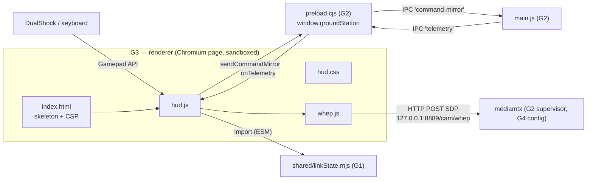

# G3 — The Renderer: HUD page, widget precedence, WHEP video, command mirror

Third ground-station batch: everything that runs **inside the Chromium page** — the
HTML skeleton, the CSS that makes it look like a Mercedes F1 pit wall, the HUD logic
(`hud.js`, the repo's largest file), and the WHEP video client. This is where open
question **#47 gets its second half answered**: the widget-by-widget rule for when the
HUD shows real telemetry, when it simulates, and when it dims. G1's JS primer (§1
there) and G2's Node/Electron primer are assumed; §1 here adds the browser concepts.

## 0. Scope

| File | Lines | What it is |
|---|---|---|
| `renderer/index.html` | 97 | The page skeleton: video underlay, HUD regions, start gate, CSP |
| `renderer/hud.css` | 137 | All styling: Mercedes palette, panels, bars, animations, the `.stale` dimming |
| `renderer/hud.js` | 295 | The HUD brain: inputs, display physics, telemetry precedence, command mirror |
| `renderer/whep.js` | 89 | Minimal WHEP client: SDP offer → mediamtx → live `<video>`, with auto-retry |

≈ 618 lines. Plan ID **G3** (`source_code_explanation_plan.md`). Line counts verified
against the tree at commit `dab3039` this session (2026-07-09) — same tree as G0/G1/G2.

**Test status:** the full suite ran this session → **118/118 PASSED** (8 files,
323 ms) — but **no vitest file imports any renderer file**. The only test that touches
them at all is `test/noControlPath.test.js`, which reads `hud.js`/`whep.js` **as text**
to assert they never import head-tracking code (a G5b guard; §9.2). What *is*
test-pinned is the pure logic the renderer delegates to: `linkState.mjs` (9 tests, G1)
and the feel constants (G2's drift guard). So, like G2: most **VERIFIED** labels below
mean *source-verified* (read + cross-checked against HTML/CSS/docs), not test-verified.

**Label convention** (same as all batches): **VERIFIED** = read in source AND pinned by
a test I ran, or re-derived independently; **INFERRED** = deduced, chain given;
**PROVISIONAL** = plausible, awaiting a later batch or hardware/bench/runtime evidence.

### Where this fits



The renderer is the **third untested shell** in this repo (after `main/`'s four files,
G2 §8) — but unlike those, it is not thin: `hud.js` carries real decisions (the
precedence rules). The project's compensation is that the *hard* logic it leans on
(`linkState`, the merge, the decoders) is all tested upstream, and the page itself is
verified by eye via `npm run demo`. §9 weighs that honestly.

### Prerequisites

G1 (JS primer; `linkState.mjs` §7; the `Telemetry` contract §2), G2 (preload's three
functions §3; the merged-snapshot IPC push §5.2; `config:get` §2.6), chapter 08
(Electron anatomy §1, video pipeline §2, the HUD's three data sources §3), chapter 12
§6 (audit fixes F2 — the honest link-loss display — and F4 — 4 gears +
TRAINING/RACE/ERS labels; both land in this batch's files).

---

## 1. Browser concepts for this batch (primer, part 3)

Continuing G1 §1 / G2 §1's numbering — nine things the renderer needs:

1. **The DOM (Document Object Model).** The browser parses HTML into a tree of live
   objects ("elements"); JS reads and mutates that tree, and the screen follows. An
   element with `id="speed"` is fetched by `document.getElementById('speed')`; setting
   `.textContent` changes its text, `.style.width` its inline style. There is no
   "redraw" call — mutate the DOM and the browser repaints. This is the renderer's
   version of `strip.setPixel(...)` + `show()` (S4), except `show()` is implicit.
2. **Events + `addEventListener`.** The browser pushes input at you:
   `addEventListener('keydown', (e) => …)` registers a callback for a named event on
   an element (or the whole page). The `e` object carries details (`e.key`). This is
   ISR-flavored thinking (C7): don't poll the keyboard; be called. (The Gamepad API,
   item 4, is the *opposite* — polled — which is why `hud.js` has both styles.)
3. **CSS classes as state flags.** `element.classList.toggle('stale', bool)` adds or
   removes a class name; the CSS file decides what that class *looks like*
   (`.stale{opacity:.35}`). The idiom throughout `render()`: JS computes booleans,
   CSS renders them — logic and looks separated.
4. **The Gamepad API.** `navigator.getGamepads()` returns the currently-connected
   controllers as arrays of `axes` (floats −1…1) and `buttons` (`{pressed, value}`).
   It is **polled** — you read the current state each frame; only connect/disconnect
   are events (`gamepadconnected`). Button/axis *indices* follow the W3C "standard
   gamepad" layout (0=✕, 1=○, 2=□, 3=△, 4/5=L1/R1, 6/7=L2/R2 with analog `value`,
   axes 0/1 = left stick, 2/3 = right stick) — that a DualShock maps this way is
   browser/OS behavior, not this repo's code (**INFERRED** platform knowledge; the
   index.html legend and code comments assume it; real-controller check is a demo-run
   item).
5. **`requestAnimationFrame(fn)`** asks the browser to call `fn` right before the next
   screen repaint (~60 Hz on a typical display, synced to the monitor). Calling it
   again inside `fn` makes a render loop that pauses when the window is hidden — the
   browser's answer to the firmware's 50 Hz tick, except the *display* sets the
   cadence, not a timer. `fn` receives a high-resolution timestamp.
6. **`performance.now()`** — a monotonic millisecond clock (fractional), unaffected by
   wall-clock changes: the browser's `millis()`. Used for the lap clock, telemetry
   staleness, and the mirror rate-limit. (Contrast `Date.now()`, wall time, used by
   `ReplaySource` in main — either works there; staleness math *wants* monotonic.)
7. **ES modules in the browser.** `<script type="module" src="hud.js">` loads the file
   as ESM — `import` works natively. This is the *reason* `linkState.mjs` is ESM
   (G1 §1 item 8): `hud.js` does `import { linkState } from '../shared/linkState.mjs'`
   straight across the folder boundary — the page and vitest load the same file the
   same way; only the CJS main process needed the dynamic-`import()` trick (G2 §2.8).
8. **Content-Security-Policy (CSP).** A page-level allowlist declaring what the page
   may load or connect to; the browser enforces it. Here it's a `<meta>` tag (§2.1) —
   defense-in-depth *inside* the sandbox Electron already provides (G2 §1 item 8).
9. **WebRTC in three sentences.** `RTCPeerConnection` is the browser's real-time
   media engine. Two peers exchange **SDP** (Session Description Protocol) text blobs
   — an **offer** ("here's what I can receive") answered by an **answer** ("here's
   what I'll send") — then media flows peer-to-peer with its own congestion control.
   **WHEP** standardizes the exchange for the receive-a-stream case as a single HTTP
   POST: body = offer SDP, response = answer SDP (ch08 §2; `whep.js` is exactly this,
   §8).

CSS-specific vocabulary (variables, `clamp()`, flexbox, `clip-path`, keyframe
animations) is explained where it appears in §3.

---

## 2. `renderer/index.html` — the skeleton (97 lines)

HTML is nested tags: `<div class="x">…</div>` makes a box the CSS can address by its
class; `id="…"` names one element uniquely for JS. Reading the file top to bottom:

### 2.1 Head (lines 1–10)

`<!DOCTYPE html>`, UTF-8, viewport — boilerplate. Line 6–7 is the interesting one, the
**CSP** (§1 item 8): `default-src 'self'` (load nothing except our own files);
`media-src 'self' blob: mediastream:` (the `<video>` may play a live WebRTC stream —
`mediastream:` is exactly that); `connect-src http://127.0.0.1:8889 http://localhost:8889`
(the page may `fetch()` **only** the local WHEP endpoint); `style-src 'self'
'unsafe-inline'` (the stylesheet + the one inline `style="…"` attribute on line 91);
`script-src 'self'` (no inline scripts — only our files run). **VERIFIED** (matches
what the page actually does: one fetch target, one inline style, module scripts only).
One consequence worth knowing: the `W17_WHEP_URL` override (G2 §2.4) can point
`whep.js` at another host, but this CSP would then **block the fetch** — the override
only really works for localhost variants unless the meta tag is edited too
(**INFERRED** from CSP semantics; never executed — logged as an observation in §10).

### 2.2 The stage and vignette (lines 12–17)

`<video id="feed" autoplay playsinline muted>` — the video underlay. `autoplay` +
`muted` matter as a pair: browsers refuse to autoplay *audible* video, muted is exempt
(the FPV feed has no audio anyway, §8.2). On top, `#feedNote` — the "WAITING FOR VIDEO
· WHEP · mediamtx" watermark shown until the stream plays (`hud.js` hides it on the
`playing` event, §7.3). Then a `.vignette` div: a purely decorative darkening gradient.

### 2.3 The HUD grid (lines 19–80)

One `.hud` overlay, two rows:

- **`.top`** — three panels: the **driver plate** (skewed teal number plate "63",
  "Russell · Mercedes-AMG Petronas" — livery theming, no logic); the **rev strip**
  (`#rev`, an empty panel `hud.js` fills with 12 dots, §4.3); the **session panel** —
  a pulsing "Live" dot, the lap clock `#clock`, the controller status `#gpStatus`
  ("No controller"), and the link status `#linkStatus` ("Telemetry: sim" — the
  four-state F2 display, §6.4).
- **`.bottom`** — three columns:
  - **left**: the big speed readout `#speed` with its unit line `#speedUnit`
    (`km/h · sim` — the honesty suffix, §6.2); THR/BRK bars (`#thr`/`#brk` are the
    fill divs); the steering slider (`#steer` dot on a track); the camera reticle
    (`#camdot` on a crosshair grid — the right-stick gimbal mirror).
  - **center**: the huge gear numeral `#gear` (starts as "N") over the drive-mode
    caption `#driveMode` (starts empty — car-authoritative only, §6.2).
  - **right**: three pills — `#boost` (Boost), `#ot` (Overtake), `#drs` (DRS); the
    battery row `#battV` (starts "--"); the ERS panel — percent `#ersPct` and the
    fill bar `#ers`.

Every `id` above reappears in `hud.js` §4.1's lookup block, one-to-one. **VERIFIED**
(cross-checked: every element `hud.js` fetches exists here; no orphans either way).

### 2.4 The start gate + demo toggle (lines 82–93)

`#gate` is a full-screen overlay: title, controller status (`#gateStatus`), a **Press
Start** button, and the controls legend — DualShock row (L-stick steer · R2 throttle ·
L2 brake · R1/L1 gear · △ DRS · ○ boost · □ overtake) and keyboard row (arrows · E/Q ·
D · B · O · Enter). The last line is the viewer-only property stated *in the UI
itself*: *"The car is driven by elrs-joystick-control. This window mirrors your inputs
and overlays telemetry — it does not command the car."* — the third place this
contract is written down (after `hud.js`'s header and preload's comment, G2 §3).
Below the gate, the `#demoBtn` "▶ Demo mode" toggle (§4.2 — note this is the page's
**local** input-script demo, *not* `npm run demo`'s replay telemetry; the two demos
are different things, §5.1).

Line 95: `<script type="module" src="hud.js">` — §1 item 7. The page has exactly one
script entry point; `whep.js` and `linkState.mjs` arrive as its imports.

---

## 3. `renderer/hud.css` — the look, and the four CSS ideas in it (137 lines)

You don't need to *write* CSS to read this file; you need four ideas:

1. **Custom properties (CSS variables)** (lines 1–8): `:root{ --teal:#00D2BE; … }`
   defines named values; `color:var(--teal)` uses them. The palette is the Mercedes
   livery: teal `#00D2BE`, carbon black, silver, plus semantic colors (red, green,
   violet for the top rev band, amber for warnings). One source for every color —
   `feelConstants.js`'s philosophy applied to paint.
2. **`clamp(min, preferred, max)`** appears on nearly every font-size:
   `font-size:clamp(46px,8.5vw,108px)` = "8.5 % of the viewport width, but never
   below 46px nor above 108px" — the whole HUD scales with the window with no JS.
3. **Flexbox** (`display:flex`) lays out rows/columns with `justify-content` /
   `align-items` / `gap` — how `.top` and `.bottom` distribute their panels.
4. **`clip-path:polygon(…)`** cuts corners off rectangles — the angular F1-broadcast
   panel shape (`.panel`, pills, bar tracks all use it). Pure decoration, but it's on
   almost every element, so recognize it.

The functional selectors — each one a state `hud.js` toggles (§1 item 3):

| Selector | What it renders | Set by |
|---|---|---|
| `.stale{opacity:.35}` | **the TELEMETRY-LOST dimming** — the file's own comment: *"Last-known real values held (dimmed) while the telemetry stream is stale ('TELEMETRY LOST') -- the HUD never silently resumes simulated numbers."* (audit F2/R01 in CSS form) | `render()` on speed/gear/mode/ERS/battery (§6.3) |
| `.link.live` (teal) / `.link.lost` (amber) | link-status line color for `live` vs `LINK LOST`/`TELEMETRY LOST` | §6.4 |
| `.gp.on` (green) | "Controller ready" | `refreshPad()` |
| `.rev i.g / .r / .v` | one rev dot lit green/red/violet | §6.2 (rev strip) |
| `.rev.redline i{animation:flash …}` | all dots strobe at redline | §6.2 |
| `.gear.shift` (violet + glow) | gear numeral flashes during a sim-mode shift | §6.2 |
| `.drivemode.m-train / .m-race / .m-ers` | mode caption color (muted/teal/violet) | §6.2 |
| `.pill.drs.on` / `.ot.on` / `.boost.on` | pill lights green/amber/bright-teal | §6.2 |
| `.ersfill.deploy{animation:ersglow…}` / `.ersfill.low` (red) | ERS bar glow while deploying (sim only) / red under 20 % | §6.2 |
| `.gate.hidden` / `.feed-note.hidden` | `display:none` — the gate after Start; the watermark once video plays | §4.2 / §7.3 |

Two animation notes: `@keyframes` blocks (`flash`, `pulse`, `ersglow`) define
looping CSS-side animations — the browser runs them with no JS per frame; and the
last line, `@media (prefers-reduced-motion:reduce){…animation:none}`, turns the
strobes off if the OS asks for reduced motion — an accessibility courtesy.
`.num{font-variant-numeric:tabular-nums}` makes digits equal-width so the speed/clock
don't jitter as values change. **VERIFIED** (all selectors cross-checked against the
class names `hud.js` toggles; none unused, none missing).

---

## 4. `renderer/hud.js` part 1 — state, wiring, and the two latches (lines 1–93)

### 4.1 The header comment (lines 1–11) — #47's answer, stated by the author

Two layers, verbatim in spirit: the **COMMAND side** (throttle/brake/steer/DRS/boost/
overtake/gear-shifts) always comes from the local gamepad/keyboard — *"the driver
commands these, so the ground already knows them with zero latency. This is a MIRROR;
it does not drive the car."* **CAR-SIDE TRUTH** (speed, battery, LQ, gear/mode/ERS)
arrives over the preload bridge and **overrides** simulated values *when present*;
link loss is **derived here** (`linkState.mjs`); with no source ever seen, a
display-only physics model animates speed/rpm/ERS. The rest of the file is this
comment executed; §6 verifies it widget by widget.

### 4.2 Element lookups + constants (lines 15–43)

- `const el = (id) => document.getElementById(id)` then one block fetching all ~20
  elements of §2.3 into constants — done **once** at load (DOM lookups are cheap but
  not free; the render loop runs at ~60 Hz).
- `DRIVE_MODES` (lines 26–30): index-matched to the car's `driveMode` field —
  0 = TRAINING (muted), 1 = RACE (teal), 2 = ERS (violet), with the comment citing the
  firmware's `ChannelDecoder`. These are the **audit-R19 canonical labels** (F4;
  ch12 §6), and the indexing matches link2/TELEMETRY.md exactly (**VERIFIED** against
  both docs + C5's decoder values).
- Rev strip (lines 32–34): 12 `<i>` elements created into `#rev` —
  `document.createElement` + `appendChild` is DOM-building from JS (why the HTML had
  an empty panel). `[...revEl.children]` snapshots them into an array.
- `FEEL` (line 37): a **local default** `{gears: 4, topSpeedKmh: 320, …}` — the same
  five numbers as `shared/feelConstants.js`, duplicated here as a *fallback* for when
  the page runs outside Electron (no `window.groundStation`, §7.4); inside the app,
  `init()` overwrites it from `config:get` (G2 §2.6 — the numbers arrive as IPC data
  because the sandboxed page can't `require`). The fallback matching the shared file
  is a small duplication the F4 commit kept aligned (`gears: 4` arrived with F4,
  git-verified this session).
- `computeCaps()` (lines 39–43): per-gear speed ceilings for the display physics —
  `caps[g] = round(topSpeed · (g/gears)^0.82)`. Re-derived this session: **[0, 103,
  181, 253, 320] km/h** for gears 1–4. The 0.82 exponent bunches the gears toward the
  top (gear 1 reaches ~a third of top speed, like a real gearbox's shortening ratios);
  it is display feel, shared with nothing (**VERIFIED** arithmetic; the *choice* is
  theming).

### 4.3 The state object + the telemetry latch (lines 45–59)

- `S` — the HUD's whole mutable state in one object: `started`, `gear`, `speed`,
  `rpm` (0…1, *position within the current gear's band*, not engine rpm), `ers`,
  the seven command values, `camPan`/`camTilt` (the right-stick gimbal mirror —
  *"car drives it via ch9/10"*, i.e. this is a picture of your stick, not of the
  gimbal), `t0` (clock anchor), `connected`.
- The three telemetry variables are G1 §7's promised caller-side latch, found in the
  flesh: `telem` (the last **merged snapshot** — G2 §5.2 guaranteed each push is
  complete), `telemFresh` (`performance.now()` of the last push), and
  `telemEverLive` — *"latched: once true, staleness shows TELEMETRY LOST, never
  sim"*. Set in exactly one place (§7.4) and never cleared. **VERIFIED** (source;
  the function it feeds is G1's 9-test-pinned `linkState`).
- `keys` (a map of currently-held keyboard keys), `prev` (last-frame button states
  for edge detection — the JS twin of C5's consume-on-read gear edges), `demo`.

### 4.4 Event wiring (lines 61–89)

- `keydown`/`keyup` maintain `keys[e.key.toLowerCase()]`; Enter calls `start()`;
  arrows/space get `e.preventDefault()` so the page doesn't scroll.
- `gamepadconnected`/`gamepaddisconnected` → `refreshPad()`; plus a 600 ms
  `setInterval(refreshPad)` belt-and-suspenders (some browsers only "discover" a pad
  after input — polling catches it; **INFERRED** motivation).
- `refreshPad()` (lines 78–87): `pad()` returns the first non-null gamepad;
  `gpEl`/`gateStatus` get text + classes ("Controller ready" / "No controller — use
  keyboard or Demo").
- The demo button toggles `demo`, restyles itself ("■ Demo running"), and calls
  `start()` — so one click from the gate straight into the scripted drive.
- `start()` (line 88): idempotent by guard (`if (S.started) return`) — sets the flag,
  anchors the lap clock, hides the gate. The `started` latch gates *input reading and
  physics* (§7.3's loop), *not* rendering — telemetry overlays draw even on the gate
  screen behind the overlay.
- Helpers (lines 91–93): `clamp`, `lerp` (as in G2 §6.2), and
  `shift(dir) = S.gear = clamp(S.gear + dir, 1, FEEL.gears)` — the local gear
  tracker, saturating exactly like the firmware gearbox's shifts (C6).

---

## 5. `hud.js` part 2 — inputs and the display physics (lines 95–159)

### 5.1 `readDemo()` (lines 95–109) — the local scripted driver

When the **page-local demo** is on, this function fakes *inputs* (contrast
`npm run demo`, which fakes *telemetry* upstream via `ReplaySource` — that one
exercises the real IPC path and flips the HUD to `live`; this one drives the sim
model directly). The script: throttle eases toward 0.9 (lifting to 0.2 near each
gear's redline), auto-upshifts at `rpm > 0.97`, brakes hard in top gear at high rpm,
drops to gear 1 when nearly stopped, sine-wave steering, gentle camera drift so the
reticle moves. **One dead branch found:** `S.drs = … && S.gear >= 5` — with
`FEEL.gears = 4` (audit F4 cut 8 gears to 4) and `shift()` clamping to `FEEL.gears`,
**gear ≥ 5 is unreachable, so the local demo never lights DRS**. Git history confirms
the diagnosis: the `>= 5` line is from the initial (8-gear-era) commit; F4 changed the
gear count around it. Display-only, zero safety impact — logged as **#61a**. (The
boost line's `S.gear >= 4` still fires in top gear.) **VERIFIED** (source + git).

### 5.2 `readInputs()` (lines 111–144) — gamepad first, keyboard fallback

With a pad present: steer from `axes[0]`, throttle/brake from buttons 7/6 (**analog**
`.value` — R2/L2 are triggers), gear from R1/L1 (5/4) with `prev`-latch edge
detection, △ (3) toggles DRS on its press edge, ○ (1) / □ (2) are boost/overtake
**held** (not toggles — deliberately matching the firmware's held-switch ERS deploy,
C6), right stick (`axes[2]/[3]`) → `camPan`/`camTilt`. Without a pad: arrows/E/Q/D/B/O
reproduce the same shape from `keys`, with the same edge latches. Every control the
firmware decodes from CRSF channels (C5) has its mirror here — same names, same
edge/held semantics, different source. **VERIFIED** (source; that a real DualShock's
buttons land on these indices is §1-item-4 platform behavior — demo-run check).

### 5.3 `updateSim(dt)` (lines 146–159) — the sim-fallback physics

The header comment is the honesty note: display-only, **NOT the firmware model** —
only the ERS rates/boost multiplier are shared constants. Per frame (`dt` in seconds):

- Ceiling: `caps[S.gear]`, ×`FEEL.ersBoostMultiplier` (1.18) while boosting (boost or
  overtake held **and** `S.ers > 0`).
- Braking beats throttle: brake > 0.05 → speed drops at `220 + brake·420` km/h/s.
  Otherwise speed lerps toward `throttle · ceiling` — approach factor `1.6·dt` up vs
  `1.1·dt` down: the same *asymmetric-inertia* idea as S2's engine (spin up harder
  than you wind down), one line instead of a module.
- `S.rpm = (speed − caps[gear−1]) / (band width)`, clamped 0…1 — "how far through
  this gear's speed band am I", which is what a rev strip actually shows.
- ERS: deploying (boosting) drains at `ersDeployPctPerSec` (26); braking or lifting
  harvests at `ersHarvestPctPerSec` (11) — **G1 §3's shared numbers doing their one
  job**: the on-screen bar drains/fills at the same *rate* as the car's real
  integrator (C6), so the simulation doesn't teach the driver a wrong feel.

**VERIFIED** (source; arithmetic re-read; the three rates are the drift-guard-pinned
constants, G2 §7.3).

---

## 6. `hud.js` part 3 — `render()`: open question #47, answered (lines 161–244)

### 6.1 The state gate (lines 164–179)

`telemetryState()` packages the latch into G1's pure function:

```js
return linkState({
  nowMs: performance.now(),
  lastTelemetryMs: telemFresh,
  everLive: telemEverLive,
  linkQualityPct: telem ? telem.linkQualityPct : undefined,
  failsafe: telem ? telem.failsafe : undefined,
});
```

— five inputs, exactly the signature G1 §7 explained; `undefined` for missing fields
rides the `=== 0` strictness (missing LQ ≠ link-lost). Then the two flags the whole
function keys on:

```js
const useTelem = state !== 'sim';
const stale = state === 'telemetry-lost';
```

`useTelem` is true in **live, link-lost, and telemetry-lost** alike — the comment
spells out why: *"In every non-sim state the panels show real values — `telem` still
holds the last merged snapshot when the stream stalls."* The design consequence: once
live, the HUD never mixes eras — it's real values (fresh or held-dimmed), never a
silent slide back to simulation. **VERIFIED** at the logic level (the underlying state
machine is G1's 9 tests; this call site is source-read).

### 6.2 The precedence, widget by widget — the #47 table

| Widget | Source rule (verbatim logic) | Fallback when absent |
|---|---|---|
| **Speed** | `useTelem && typeof telem.speedKmh === 'number' ? telem.speedKmh : S.speed` | sim, and the unit line says so: `km/h · sim` / `km/h` / `km/h · stale` |
| **Gear** | `telem.gear` if a number, else local `S.gear` | local shift tracker |
| **Drive mode** | `DRIVE_MODES[telem.driveMode]` — **telemetry only** | **blank** — *"the HUD has no local mode state — the mode is chosen upstream in elrs-joystick-control"* |
| **Rev strip + redline** | **always** local `S.rpm` | (no telemetry equivalent exists — the car transmits no engine rpm; engine rpm lives only in board #2's `EngineSim`, S2) |
| **THR / BRK / STR / CAM / DRS / Boost / Overtake pills** | **always** the local mirror (`S.*`) | (never telemetry — these *are* the command side) |
| **ERS bar + %** | `telem.ersPct` if a number, else `S.ers` | sim |
| **Battery** | `telem.batteryV` **only** | `--` (no simulated volts — there is nothing honest to show) |
| **Link line** | the four-state display (§6.4) | — |

So #47's full answer: **per-widget AND per-field.** Each telemetry-capable widget
independently checks `typeof telem.X === 'number'` — a live source that has only ever
delivered battery frames shows real volts *and* simulated speed (labeled `· sim`)
simultaneously. Three widgets are telemetry-only (mode, battery, link line), the
command widgets are mirror-only, the rev strip is sim-only, and speed/gear/ERS float
per-field. This works precisely because G2 §5.2's accumulator guarantees each push is
a complete merge — the renderer never sees a partial that would flicker fields in and
out. **VERIFIED** (source, each branch read; no test pins any of this — §9.1).

Detail notes, same lines: the gear numeral shows **"N"** when
`showSpeed < 1 && showGear === 1` (a parked car in gear 1 reads Neutral — display
flavor); the violet `shift` flash and the ERS `deploy` glow fire **only in `sim`
state** (`state === 'sim'` guards both — when real telemetry drives the values, fake
drama is suppressed); the boost/overtake pills light only while `S.ers > 0` — the
**simulated** store, even when the bar displays telemetry `ersPct` (a hair of
inconsistency: with real ERS at 0 % and sim ERS full, a held ○ still lights the pill
— cosmetic, mirror-side; noted in #61c). `battVEl` gets `.toFixed(1)` — one decimal.

### 6.3 The stale dimming (audit F2's second half)

Every telemetry-capable readout toggles the `.stale` class on the `stale` flag:
speed, gear, drive mode, ERS bar + percent, battery — six elements. The command
widgets **never** dim (your own stick position is never stale). Combined with §6.1's
`useTelem`, this renders TELEMETRY LOST exactly as ch08 §3 / TELEMETRY.md promise:
last real values, held, at 35 % opacity. Note what does *not* dim: **LINK LOST**
(fresh frames, LQ = 0) shows full-brightness real values — the ground TX is still
reporting; it's the *radio to the car* that died. The distinction between the two
alarm states is exactly "is the data current" — dimming tracks it. **VERIFIED**
(source + `.stale` CSS; end-to-end appearance is a demo-run check).

### 6.4 The link line — four states, four renderings (lines 229–237)

```js
if (state === 'link-lost')            'LINK LOST',        class 'link lost'  (amber)
else if (state === 'telemetry-lost')  'TELEMETRY LOST',   class 'link lost'  (amber)
else if (state === 'live')            `LQ ${Math.round(telem.linkQualityPct ?? 0)}%`, class 'link live' (teal)
else                                  'Telemetry: sim',   class 'link'       (muted)
```

The 1:1 mapping of G1 §7's return strings to ch08 §3's displayed states — this block
is where the glossary's "HUD link states" become pixels. One micro-nuance: in `live`
with LQ *absent* (a source that never sent link-stats), `?? 0` prints **"LQ 0 %" in
teal** — arguably odd next to LINK LOST's meaning of LQ 0, but unreachable on the real
path (the TX module always emits 0x14; the demo timeline always sets LQ) —
**INFERRED** edge-case reading, noted in #61d. Finally the lap clock: minutes/seconds/
tenths from `performance.now() − S.t0`, `String.padStart(2,'0')` for the `00:00.0`
format.

---

## 7. `hud.js` part 4 — the command mirror, the loop, and `init()` (lines 246–295)

### 7.1 `sendCommandMirror(now)` (lines 246–265) — the one renderer→main message

The header comment carries the full safety framing, fourth layer now (after hud.js's
own header, preload's, and main.js's): *"Read-only command/camera mirror for the
outbound iPhone telemetry bridge: the same display values the HUD draws, sent one-way
to main at ~20 Hz. Display only — this never drives the car (elrs-joystick-control
does), and there is no return path from the iPhone into these values."*

The mechanics: guard on `window.groundStation && .sendCommandMirror` (outside
Electron: silently do nothing); rate-limit to one send per 50 ms
(`MIRROR_SEND_PERIOD_MS` — *"~20 Hz, comfortably above the bridge's 10 Hz"*); payload
= `{throttle, brake, steering, camPan, camTilt, videoPlaying}` — commented ranges
0..1 / −1..1, plus whether the WHEP `<video>` is currently playing (§7.3 sets it).
Then preload's `send('command-mirror', …)` → `main.js`'s `ipcMain.on` → forwarded to
the iPhone bridge **iff enabled, else dropped** (G2 §2.8 item 5). What the bridge does
with it is G5a.

**What this is and is not (the honesty block):** it is a *display mirror* — a copy of
what the HUD is drawing, so a second screen (the iPhone HUD) can draw the same thing.
It is **not** a control path and **not** evidence of one: the values describe the
operator's inputs as rendered, they flow one way, main.js only serializes them
outward, and `test/noControlPath.test.js` structurally guards the surrounding files
(§9.2). It is also **not proof the mirror works end-to-end** — that's the iPhone
bridge's real-device validation, still **PENDING** (#58); and W3 (the inbound
head-tracking receiver) remains **LOG-ONLY** — nothing in this file (or the whole
renderer) imports or receives anything from it (**VERIFIED**: the noControlPath scan
of `hud.js`/`whep.js` passed this session as part of 118/118).

### 7.2–7.3 The frame loop (lines 267–275)

```js
function frame(now) {
  const dt = Math.min(0.05, (now - last) / 1000); last = now;
  if (S.started || demo) { readInputs(); updateSim(dt); }
  render();
  sendCommandMirror(now);
  requestAnimationFrame(frame);
}
requestAnimationFrame(frame);
```

The renderer's `loop()`: §1 item 5's self-rescheduling render loop. `dt` is clamped
to 50 ms — after a stall (window hidden, GC pause) the physics takes one normal-sized
step instead of a giant one: the same *drop lost time, never catch up* policy as the
firmware's tick guard (C10, glossary "Tick guard"), one `Math.min` instead of a
pattern. Inputs+physics run only after Start (or in demo); `render()` and the mirror
run always — so telemetry overlays and the (all-zero) mirror flow even on the gate
screen. **VERIFIED** (source).

### 7.4 `init()` (lines 277–295) — wiring the bridge

- `if (!window.groundStation) return` — *"opened outside Electron (bench preview)"*:
  the whole file degrades to a self-contained gamepad HUD if you just open
  `index.html` in a browser. Graceful degradation, renderer edition.
- `const cfg = await window.groundStation.getConfig()` — the one request/response
  call (G2 §2.6). `cfg.feel` merges over the local `FEEL` (spread syntax:
  `{ ...FEEL, ...cfg.feel }` — right side wins), `computeCaps()` rebuilds the gear
  bands, `S.ers = 100` resets the store. Note: `cfg.hasTelemetrySource` — the third
  field `config:get` sends — is **read by nothing** (grep-verified: `hud.js` is the
  only `getConfig` caller and never touches it). A dead config field, cousin of G1's
  unused RC-channels constant (#59b); logged as **#61b**.
- `window.groundStation.onTelemetry((t) => { telem = t; telemFresh =
  performance.now(); telemEverLive = true; })` — the entire telemetry-receive side:
  replace the snapshot, stamp the clock, latch the flag. Three assignments; every
  hard decision lives in `linkState` (G1) and the merge (G2). The unsubscribe closure
  preload returns is discarded — the subscription is for the page's lifetime
  (**INFERRED** deliberate; there is nothing to unsubscribe *for*).
- If `cfg.whepUrl`: `startWhep(feed, cfg.whepUrl, {log: console.log})` (§8), plus two
  `<video>` events — `playing` → hide the watermark, `videoPlaying = true`;
  `emptied` → show it again, `videoPlaying = false` — which feed both the on-screen
  "WAITING FOR VIDEO" note and the mirror's `videoPlaying` field.

---

## 8. `renderer/whep.js` — the video client (89 lines)

### 8.1 The header (lines 1–5)

*"Minimal WHEP client: POST an SDP offer to mediamtx's WHEP endpoint, apply the
answer, attach the inbound video track to a `<video>`. Video-only, minimum latency
(playoutDelayHint = 0), and an auto-retry loop because the 5.8 GHz FPV WiFi link drops
and a dead `<video>` must recover on its own."* Four claims; all four found in the
code below. **VERIFIED** (source).

### 8.2 `connectOnce()` (lines 12–47) — one WHEP handshake

1. `new RTCPeerConnection({ bundlePolicy: 'max-bundle' })` — §1 item 9's engine;
   max-bundle = one transport for everything (one media stream anyway).
2. `pc.addTransceiver('video', { direction: 'recvonly' })` — declare *receive-only
   video* before building the offer. The comment explains the "no audio" choice
   twice over: the FPV feed has none, *"and a dead audio track just adds handshake
   surface + latency."*
3. `pc.ontrack` — fires when the remote video track arrives: set
   `receiver.playoutDelayHint = 0` if the browser exposes it (*"minimum playout
   delay: prefer latency over smoothness for FPV"* — a nonstandard Chromium knob,
   hence the feature-test + try/catch: *"not all builds allow setting it"*), then
   `videoEl.srcObject = e.streams[0]` (a live MediaStream in place of a file URL —
   the CSP's `mediastream:` entry, §2.1) and `videoEl.play().catch(() => {})`
   (autoplay policies may reject; muted video normally plays — the catch avoids an
   unhandled-rejection crash either way).
4. `pc.onconnectionstatechange` — `failed`/`disconnected`/`closed` → `scheduleRetry()`.
5. The WHEP exchange itself: `createOffer()` → `setLocalDescription` →
   `fetch(whepUrl, { method: 'POST', headers: {'Content-Type': 'application/sdp'},
   body: offer.sdp })` → non-OK status throws `WHEP <status>` → response text is the
   answer SDP → `setRemoteDescription({type:'answer', sdp: answer})`. That is the
   *entire* WHEP protocol (§1 item 9) — one POST, two SDP blobs.

### 8.3 The retry machinery (lines 49–88)

`scheduleRetry()` guards on the `stopped` latch and an already-pending timer (the
same collapse-multiple-triggers-into-one-retry shape as `CrsfSerialSource`'s reopen,
G2 §5.3 — error and statechange can both fire), closes the old peer connection
(`cleanupPc`, with the try/catch-ignore idiom), and retries `connect()` in **1.5 s,
fixed, forever** — no backoff, no give-up, the third instance of the repo's
restart-loop house style (mediamtx 2 s, serial 2 s, WHEP 1.5 s; the #60c observation
applies here too). `connect()` wraps `connectOnce()` in try/catch: success logs
*"WHEP connected"*, failure logs and schedules. Bottom: `connect()` runs immediately
on `startWhep(…)`, and the returned `{stop()}` handle sets the latch, cancels the
timer, closes the pc — **and is never called by `hud.js`** (the stream lives as long
as the page; INFERRED deliberate, noted in #61e).

### 8.4 What this file proves / does not prove

The *logic* is source-verified: offer construction, the POST contract, the retry
latching. **Nothing about real video is proven anywhere in this repo:** whether
Chromium decodes the camera's codec (**the H.264/H.265 question, bench #25 — the
repo's #1 risk**, SETUP.md §1), whether mediamtx answers at the default URL (needs
the binary fetched + a source publishing — SETUP.md §3/§5), what the glass-to-glass
latency is, and how the retry loop behaves through a real 5.8 GHz dropout. No unit
test loads this file; no session of this manual has ever run the app. Every claim
past "the code says" is **PROVISIONAL → demo run / bench**.

---

## 9. What is tested here — and what "118/118 green" does NOT cover

### 9.1 The coverage picture, extended one more row

G2 §8's table gains its final row — all three repos, plus the renderer:

| Layer | Tested core | Untested shell |
|---|---|---|
| control-fw | `lib/*` (147) | `main.cpp` + `*_hal_esp32` |
| soundlight-fw | `lib/*` (40) | `main.cpp` + audio/LED HAL |
| ground station `main/` | `shared/*` (+ bridge pures) | all four process files |
| **ground station `renderer/`** | **`linkState.mjs` (9 tests, G1) + feel constants (G2 §7.3)** | **all four G3 files** |

But note the honest asymmetry: `main/`'s shell was *thin* — wiring around tested
logic. `hud.js` is **not thin**: the widget precedence (§6.2), the input edges
(§5.2), the sim physics (§5.3) are real decisions that live *only* here, and **no
test pins any of them** — a wrong `typeof` check or a swapped fallback would pass
118/118 and only show up on screen. The design mitigations: the one *safety-relevant*
decision (which of the four states are we in) is the tested `linkState`; everything
else is display, verified by eye (`npm run demo` — the intended check, ch08 §6). Keep
the label discipline in mind when reading §§2–8: **VERIFIED there = source-verified**;
only the linkState truth table and the three ERS rates carry test evidence.

### 9.2 The one test that touches these files

`test/noControlPath.test.js` (a **G5b** file — walked line-by-line there) includes
`../renderer/hud.js` and `../renderer/whep.js` in its module-graph scan: it reads
each runtime file **as text** and asserts it never matches `/headTracking|HeadTracking/`
— i.e. the renderer cannot even *import* the W3 receiver's code, so no future edit
can quietly pipe head-tracking intent into the page or the mirror. Ran this session
(part of 118/118). That is a *structural absence* guarantee about W3 — it proves
nothing about the renderer's own display logic (§9.1).

### 9.3 Standing boundary, restated

Nothing in G3 is hardware or runtime proof. No app was launched, no camera streamed,
no gamepad read in this session; WebRTC/video behavior is bench (#25) + demo-run;
DualShock button indices are a demo-run check; the iPhone bridge (the mirror's only
consumer) stays implemented + unit-tested, **NOT real-device validated** (#58); W3 is
LOG-ONLY, and the renderer verifiably contains no path to or from it (§9.2).

---

## 10. Findings, labels, bookkeeping

**Labels summary.** VERIFIED = source read + HTML↔CSS↔JS cross-checks + doc
cross-checks (TELEMETRY.md, SETUP.md, ch08/ch09/ch12) + the caps/`clamp` arithmetic
re-derived + git-history checks for the F4-era items — **test-backed only for**: the
linkState truth table (G1's 9 tests), the ERS rates (G2 §7.3), and the
no-head-tracking-import scan (§9.2). INFERRED: the DualShock standard-mapping
assumption (§5.2), the CSP-vs-`W17_WHEP_URL` interaction (§2.1), the pad-polling
motivation (§4.4), the live-with-missing-LQ display nuance (§6.4), the
discarded-unsubscribe and unused-`stop()` readings (§7.4, §8.3). PROVISIONAL/bench:
everything visual/runtime (demo run), all real-video behavior (#25, SETUP.md), real
serial/radio behavior feeding the states (#27/#28), iPhone-bridge end-to-end (#58).

**Open question #47 — now fully answered.** Input half: G2 (complete merged
snapshots). Renderer half: this batch, §6.2's table — per-widget, per-field
(`typeof telem.X === 'number'`), with three telemetry-only widgets, mirror-only
command widgets, a sim-only rev strip, and stale-dimming on exactly six readouts.
Annotated closed in `open_questions.md`.

**New open question #61** (small, mixed — logged in `open_questions.md`):
(a) the local demo mode's DRS branch requires `S.gear >= 5` — unreachable since F4
set 4 gears (the line predates F4; git-verified), so the "▶ Demo mode" button never
demonstrates DRS; (b) `config:get`'s `hasTelemetrySource` field is consumed by
nothing (`hud.js` is the only caller and ignores it); (c) the boost/overtake pills
gate on the *simulated* ERS store even when the bar displays telemetry `ersPct`;
(d) `live` with LQ absent would print "LQ 0%" in teal (unreachable on the real path);
(e) `startWhep`'s returned `stop()` handle is never used — page-lifetime stream —
and the CSP pins `connect-src` to localhost:8889, so a non-local `W17_WHEP_URL`
override would be blocked by the page itself. All display-layer; none affects safety
or the deployment happy path.

**Glossary additions this batch:** DOM; Event listener; Gamepad API;
requestAnimationFrame (render loop); SDP offer/answer (WebRTC handshake);
Content-Security-Policy; Command mirror.

**Corrections to earlier material:** ch09 §3's reliability table still said the HUD
"falls back to simulation after 1 s" — pre-F2 wording; corrected to the four-state
hold-dimmed behavior (the code and ch08 §3 agreed already). Ch08 §3's description
needed no change (matches the code exactly); its "Inferred" hedge on widget
precedence is now closed via this batch.

## 11. Questions to check your understanding

1. The car's battery frame arrives but nothing else, ever. For each of: speed
   readout, its unit label, gear numeral, drive-mode caption, battery volts, link
   line — say exactly what the HUD shows and why (§6.2's per-field rule).
2. Why does the rev strip *always* animate from the local simulation, even when
   telemetry is live? Where in the whole three-repo system does an "engine rpm"
   number actually exist?
3. Walk the pixels of TELEMETRY LOST: which module decides the state, which JS lines
   react, which CSS rule makes it visible, and which six elements change. Why do the
   THR/BRK bars never dim?
4. LINK LOST shows *bright* values while TELEMETRY LOST shows *dimmed* ones. What is
   the physical difference between the two situations that justifies the visual
   difference?
5. In demo mode the DRS pill never lights. Trace why, and explain what historical
   event created the dead branch (two commits are involved).
6. `hud.js` imports `linkState.mjs` directly with a static `import`, but `main.js`
   needed `await import(...)`. Why the difference? (Two module systems, two worlds —
   G1 §1 item 8, G2 §1 item 4, §1 item 7 here.)
7. Describe the complete journey of one `sendCommandMirror` payload when the iPhone
   bridge is (a) disabled, (b) enabled. At which single line does case (a) end? Why
   is neither case evidence that the car can be controlled from this window?
8. The WHEP handshake is a single HTTP POST. What is in the request body, what is in
   the response, and what happens if mediamtx isn't running when the page loads —
   what will the user see, and what will the app be doing every 1.5 s?
