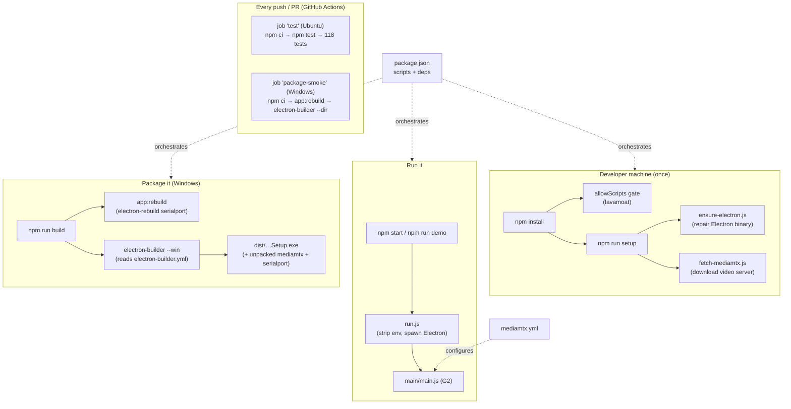

# G4 — Scripts, packaging, setup, and CI: turning the code into a deliverable app

The fourth and **last non-bridge** ground-station batch. G1–G3 explained the code that
*runs* (the shared core, the main process, the renderer). This batch explains the code
and config that **build, launch, fetch, package, and check** that code — the seven files
that make `npm install && npm run setup && npm start` produce a working app on a fresh
machine, and `npm run build` produce a Windows `.exe` you can hand to someone. It ends
the viewer-app story with the *deployment* story.

There is almost no runtime *logic* here — these are scripts and declarative config. So
this batch is lighter on algorithms and heavier on **tooling vocabulary** (npm,
package.json, Electron Builder, GitHub Actions, native-module ABIs, code signing). §1 is
a primer on all of it; §§2–8 walk the files; §9 is the honest accounting of what "CI
green" and "it packaged" do and do **not** prove.

## 0. Scope

| File | Lines | What it is |
|---|---|---|
| `package.json` | 32 | The npm manifest: name, entry point, scripts, dependencies |
| `scripts/run.js` | 19 | Cross-platform Electron launcher (`npm start` / `npm run demo`) |
| `scripts/ensure-electron.js` | 88 | Repairs a half-installed Electron binary from the download cache |
| `scripts/fetch-mediamtx.js` | 57 | Downloads the pinned mediamtx video-server binary |
| `electron-builder.yml` | 40 | Packaging config: what goes in the Windows installer, signing hooks |
| `mediamtx/mediamtx.yml` | 36 | The mediamtx server config (project-authored, hand-edited) |
| `.github/workflows/ci.yml` | 31 | Continuous-integration workflow: tests on Linux + a Windows packaging smoke |

≈ 303 lines. Plan ID **G4** (`source_code_explanation_plan.md`). Line counts verified
against the tree at commit `dab3039` this session (2026-07-09) — same tree as G0/G1/G2/G3.

**What is deliberately *not* here** (per the plan's skip table, §2 of
`source_code_explanation_plan.md`): `package-lock.json` (a generated lockfile — its
*concept* is explained in §2.4, its thousands of machine-written lines are not) and the
29 MB `mediamtx/mediamtx` binary itself (third-party, downloaded by
`fetch-mediamtx.js`, not committed, not project code). `mediamtx.yml` **is** included
because it is hand-edited project config, not generated (plan §2, "Uncertain" note).

**Test status:** the full suite ran this session → **118/118 PASSED** (8 files, 335 ms).
But **not one of these seven files is imported or executed by any vitest test** — they
are scripts and config, exercised by *running* them (`npm start`, `npm run build`) or by
CI, not by unit tests. What CI's `npm test` step runs *is* the 118 tests, and those all
belong to earlier batches: crsf/crsfTelemetry/linkState (G1), replay (G2), and
telemetrySnapshot/iphoneBridge/headTracking/noControlPath (G5a/G5b). So every
**VERIFIED** label in this batch means *source-verified* (read + cross-checked against
the docs and the code these files act on), and — new to this batch — a few claims are
verified by **having run the tools** this session (the full `npx vitest run`), while
everything about real packaging, downloading, and launching stays **PROVISIONAL** until
someone runs it on the target machine.

**Label convention** (same as all batches): **VERIFIED** = read in source AND
cross-checked (or a command I ran this session confirms it); **INFERRED** = deduced,
chain given; **PROVISIONAL** = plausible, awaiting a real run on real hardware/OS.

### Where this fits



### Prerequisites

G2 (the Electron main process — `main.js`'s dev-vs-packaged mediamtx path §2.5, the
`W17_TELEMETRY_SOURCE` env seam §2.3, the optional `serialport` native module §5;
Node/child-process primer §1), G3 (the renderer, and `whep.js`'s POST to
`127.0.0.1:8889/cam/whep` §8 — the endpoint `mediamtx.yml` defines here), chapter 08 §6
(the developer-conveniences overview these files implement), chapter 11 §7 (the CI
overview this batch turns into a line-by-line reading), chapter 12 §6 (audit fixes F2/F3
— the packaging-smoke CI job and the drift discipline).

---

## 1. Tooling primer for this batch (npm, packaging, CI)

Continuing the G1/G2/G3 primer numbering, here is every tooling concept the seven files
assume. If you know Node already, skim to §2.

1. **npm and `package.json`.** **npm** ("node package manager") is Node's build/dependency
   tool — the JS world's rough equivalent of PlatformIO for firmware (ch11 §1) or `make`.
   Every Node project has a **`package.json`** at its root: a JSON file naming the
   project, its version, its **entry point**, its **dependencies**, and a set of named
   **scripts**. `npm install` reads it and downloads dependencies into `node_modules/`;
   `npm run <name>` executes a named script. It is the single source of truth for "how do
   I run this project."

2. **npm scripts.** The `"scripts"` block maps short names to shell commands:
   `"start": "node scripts/run.js"` means `npm start` runs that command. A script can
   chain others with `&&` (run in sequence, stop on first failure) and can call
   `npm run <other>` to compose. `npm start` and `npm test` are so common they have the
   `run`-less shorthands (`npm start`, `npm test`); everything else needs `npm run <name>`.
   Scripts run with `node_modules/.bin` on the PATH, so locally-installed tools
   (`vitest`, `electron-builder`, `electron-rebuild`) are callable by bare name.

3. **Runtime vs development dependencies.** `package.json` splits dependencies by *when
   they're needed*:
   - `dependencies` — needed at **runtime**, shipped with the app.
   - `devDependencies` — needed only to **build/test/package**, never shipped.
   - `optionalDependencies` — nice-to-have; if install fails, npm continues and the app
     copes at runtime (exactly the `serialport`-may-be-missing degradation G2 §5 explained).
   This project has **zero plain `dependencies`** — a striking fact explained in §2.3.

4. **Native module + ABI.** Most npm packages are pure JavaScript and run anywhere. A
   **native module** ships C/C++ compiled to a binary `.node` file (here: `serialport`,
   which talks to OS serial-port APIs). Compiled code is built against a specific
   **ABI** (Application Binary Interface — the exact binary contract of the runtime it
   plugs into). Electron bundles its *own* build of Node with a *different* ABI than your
   system Node, so a `serialport` compiled for system Node **won't load inside Electron**
   — it must be **rebuilt** against Electron's ABI. The tool that does this is
   `@electron/rebuild` (command `electron-rebuild`); the project wires it as the
   `app:rebuild` script (§2.3, §5).

5. **Electron Builder.** `electron-builder` is the packaging tool: it takes your app
   folder + a config file (`electron-builder.yml`) and produces a distributable —
   here, a Windows installer. It handles the OS-specific plumbing (installer format,
   icons, code-signing hooks, bundling the Electron runtime). Config lives in
   `electron-builder.yml` (§6).

6. **asar, `extraResources`, `asarUnpack`.** When Electron Builder packages an app, it
   bundles your JS/HTML/CSS into a single **asar** archive (a tar-like blob the Electron
   runtime reads files out of) — faster to distribute, and mild obfuscation. Two things
   *can't* live inside an asar: **native binaries** that the OS must execute by real file
   path. So Electron Builder offers two escape hatches: `extraResources` copies whole
   folders **beside** the app (unpacked) into `resources/`, and `asarUnpack` pulls
   matching files **out** of the asar while keeping them in the app tree. This project
   uses `extraResources` for the mediamtx binary and `asarUnpack` for `serialport`'s
   `.node` (§6) — both are native executables/libraries.

7. **NSIS installer.** **NSIS** (Nullsoft Scriptable Install System) is the classic
   Windows `.exe` installer format; `electron-builder --win` with `target: nsis`
   produces a `…Setup.exe` that installs the app into Program Files with a Start-menu
   shortcut. (The alternative used in CI, `--dir`, produces just an *unpacked folder* —
   the app, no installer — which is faster and enough to prove packaging works, §8.)

8. **Code signing (`CSC_*`).** Windows warns loudly ("unknown publisher") when you run an
   unsigned downloaded `.exe`. **Code signing** attaches a cryptographic signature from a
   certificate proving who built it. Electron Builder signs automatically **if** you hand
   it a certificate through environment variables — `CSC_LINK` (path to or base64 of the
   `.pfx` cert file) and `CSC_KEY_PASSWORD` (its password) — so no secret ever lives in
   the repo. With neither set, the build is simply unsigned (§6, §7).

9. **Continuous Integration (CI), GitHub Actions, runners, jobs, artifacts.** **CI** means
   "every push automatically runs the tests/build on a clean machine, so breakage is
   caught immediately, not on gift day." **GitHub Actions** is GitHub's built-in CI: you
   put a **workflow** YAML file in `.github/workflows/`, and GitHub runs it on hosted
   virtual machines called **runners** (`ubuntu-latest`, `windows-latest`). A workflow has
   **jobs** (independent units, each on its own fresh runner), each job a list of
   **steps** (checkout code, install Node, run a command). Files a job produces can be
   uploaded as **artifacts** (downloadable build outputs) — though this workflow uploads
   none; it only checks that things pass (§8).

10. **`npm ci` vs `npm install`.** `npm ci` ("clean install") is the CI-flavored install:
    it installs **exactly** what `package-lock.json` pins, deleting any existing
    `node_modules` first, and fails if the lockfile and `package.json` disagree.
    Reproducible and strict — right for a machine; `npm install` is the developer version
    that may update the lockfile.

---

## 2. `package.json` — the manifest (32 lines)

The whole file read top to bottom. It is JSON, so every value is a string, number, object,
or boolean.

### 2.1 Identity (lines 1–5, 16–17)

- `"name": "w17-ground-station"`, `"version": "0.1.0"` — the package identity;
  `0.1.0` is honest pre-1.0 "works but young" (semantic versioning: MAJOR.MINOR.PATCH).
- `"description"` — one sentence, and it **states the viewer-only contract in the manifest
  itself**: *"Viewer-only FPV ground station … WebRTC video + gamepad-mirrored HUD +
  telemetry overlay."* The word "mirrored" is the same safety framing as the renderer's
  header and the on-screen legend (G3 §2.4) — written down a fifth place.
- `"main": "main/main.js"` — **the entry point.** When Electron launches this folder
  (`electron .`), *this* is the file it runs as the main process. This one line is why G2
  corrected the session brief's `src/` guess: the app's real layout is `main/` + `shared/`
  + `renderer/`, and `package.json` is the authority. **VERIFIED** (matches G2's whole
  batch).
- `"author"`, `"license": "MIT"` — metadata.

### 2.2 The scripts (lines 6–15) — every entry point in one table

```json
"setup":         "node scripts/ensure-electron.js && node scripts/fetch-mediamtx.js",
"start":         "node scripts/run.js",
"demo":          "node scripts/run.js --demo",
"test":          "vitest run",
"test:watch":    "vitest",
"app:rebuild":   "electron-rebuild -f -w serialport",
"build":         "npm run app:rebuild && electron-builder --win",
"fetch-mediamtx":"node scripts/fetch-mediamtx.js"
```

| Script | What it does | Explained in |
|---|---|---|
| `setup` | one-time bootstrap after `npm install`: repair Electron, then download mediamtx (chained `&&`, so a failed repair stops before the download) | §3, §4 |
| `start` | launch the real app | §3 (`run.js`) |
| `demo` | launch with replay telemetry (`--demo` → `run.js` sets `W17_TELEMETRY_SOURCE=replay`) | §3; G2 §2.3 |
| `test` | run the vitest suite **once** and exit (`run` = non-watch) — the 118 tests | §9 |
| `test:watch` | run vitest in **watch** mode (re-run on file change) — the dev inner loop | §9 |
| `app:rebuild` | rebuild the `serialport` native module against Electron's ABI (`-f` force, `-w serialport` only that module) | §1 item 4, §5 |
| `build` | package the Windows app: rebuild serialport **then** `electron-builder --win` (chained so the packaged app always ships an ABI-matched binary) | §6 |
| `fetch-mediamtx` | download the mediamtx binary on its own (a subset of `setup`) | §4 |

**VERIFIED** (each command read; `vitest run` reproduced this session → 118/118). Note the
two-demo distinction G3 §5.1 warned about: this `demo` script feeds *replay telemetry*
through the real IPC path; the renderer's on-page "▶ Demo mode" button is a *different*
thing (fake local inputs). Same word, two mechanisms.

### 2.3 Dependencies (lines 18–26) — and the zero-runtime-deps surprise

```json
"optionalDependencies": { "serialport": "^12.0.0" },
"devDependencies": {
  "@electron/rebuild": "^3.6.0",
  "electron":          "^31.0.0",
  "electron-builder":  "^24.13.3",
  "vitest":            "^2.0.0"
}
```

The striking fact: **there is no `"dependencies"` block at all.** The app's *shipped*
runtime code (`main/`, `renderer/`, `shared/`) is written in plain Node/browser JavaScript
with **no third-party runtime library** — the CRSF decoder, telemetry model, HUD, and
WHEP client are all hand-written (G1–G3). The only runtime dependency is
**`serialport`**, and it is **optional** — exactly matching G2 §5's finding that
`CrsfSerialSource` lazily `require`s it in a try/catch and degrades to a gamepad-only HUD
if it's absent. So the dependency graph *declares* the same graceful-degradation the code
implements: telemetry-over-serial is an optional add-on, everything else has no external
runtime code to break. **VERIFIED** (cross-checked against G2 §5).

Everything in `devDependencies` is a **build/test tool**, never shipped: `electron`
itself (the runtime — bundled by the packager, not a runtime dep of *your* code),
`electron-builder` (packager), `@electron/rebuild` (ABI rebuilder), `vitest` (test
runner). The `^` prefix ("caret") means "this version or any newer compatible one"
(same-MAJOR); the exact resolved versions are pinned in `package-lock.json` (§2.4).

### 2.4 `package-lock.json` and `allowScripts` (lines 27–31)

Two loose ends the manifest points at:

- **`package-lock.json`** (the file, skipped per the plan) is npm's **lockfile**: a
  machine-generated record of the *exact* version and checksum of every package (including
  dependencies-of-dependencies) that `npm install` resolved. Committing it makes installs
  reproducible — `npm ci` (§1 item 10, used by CI) installs precisely what it pins. You
  never hand-edit it; its thousands of lines are the *concept* "reproducible installs,"
  not code to read.
- `"allowScripts"` (lines 27–31): a config block for **lavamoat allow-scripts**, a
  supply-chain-security tool that, by default, **blocks npm packages from running their
  install-time scripts** (a common malware vector). This block is the allowlist —
  `electron`, `esbuild`, `fsevents` are the three packages *permitted* to run their
  postinstall. This is the direct cause of `ensure-electron.js` existing: in an
  allow-scripts environment, if Electron's own postinstall is *not* run (or is blocked),
  the Electron binary is never extracted, and the repair script (§3.2) fixes it. So this
  five-line block and one of the setup scripts are two halves of the same story.
  **VERIFIED** (the `ensure-electron.js` header comment names exactly this scenario).

---

## 3. `scripts/run.js` — the launcher (19 lines)

This is the file `npm start` and `npm run demo` actually execute. It is CommonJS (§ G1's
CJS/ESM primer): `require`, runs under Node.

### 3.1 Why it exists (the header comment, lines 1–9)

The problem it solves is a genuine Electron gotcha, worth understanding because it bites
everyone once: **VS Code is itself an Electron app**, and its integrated terminal leaks an
environment variable, **`ELECTRON_RUN_AS_NODE=1`**, into child processes. That variable
tells *any* Electron binary "boot as plain Node.js, not as an Electron app" — so
`require('electron')` inside the app returns no `app` object and the main process crashes
on startup. Launching through this script (instead of `electron .` directly) strips the
variable first, so `npm start` / `npm run demo` work **from any terminal, on any OS**.
This is the same gotcha ch08 §6 and ch11 §6 warn about — here is the code that neutralizes
it. **VERIFIED** (matches those chapters + the header comment).

### 3.2 The launch (lines 10–19)

- `const { spawn } = require('node:child_process')` — Node's child-process primitive
  (G2 §1's `spawn`). `require('electron')` **from plain Node returns the filesystem path
  to the Electron binary** (documented Electron behavior) — *that* is what we spawn. (The
  comment says so explicitly, because it looks surprising: the same `require('electron')`
  returns the API object when run *inside* Electron and a path string when run *outside*.)
- `const env = { ...process.env }` then `delete env.ELECTRON_RUN_AS_NODE` and
  `delete env.ELECTRON_NO_ATTACH_CONSOLE` — copy the current environment, remove the two
  leaked Electron variables. (`ELECTRON_NO_ATTACH_CONSOLE` is a related Windows-console
  leak; same treatment.)
- `if (process.argv.includes('--demo')) env.W17_TELEMETRY_SOURCE = 'replay'` — **this one
  line is the entire `npm run demo` mechanism.** The `--demo` flag (from the `demo` script,
  §2.2) sets the telemetry-source env var to `replay`, which `main.js`'s
  `chooseTelemetrySource()` (G2 §2.3) maps to `ReplaySource` — the scripted fake telemetry.
  No other difference between `start` and `demo`. **VERIFIED** (cross-checked against G2 §2.3).
- `const child = spawn(electronPath, ['.'], { stdio: 'inherit', env })` — launch Electron
  on the current folder (`.` → reads `package.json`'s `"main"`); `stdio: 'inherit'` wires
  the child's console straight to yours (so app logs appear in your terminal); the cleaned
  `env` is passed in.
- `child.on('close', (code) => process.exit(code ?? 0))` — when Electron exits, exit this
  launcher with the *same* code (so `npm start` reflects the app's exit status; `?? 0`
  handles a null code as success).

Nineteen lines, one job: launch Electron cleanly and forward the demo flag. No app logic.

---

## 4. `scripts/ensure-electron.js` — repair the Electron binary (88 lines)

The bigger of the two setup helpers. **It does not download Electron** — read that
carefully, because the name suggests otherwise. It **extracts an already-downloaded
Electron zip from the local cache** into `node_modules/electron/dist/`, repairing the case
where the postinstall extraction never ran (the allow-scripts scenario, §2.4). CommonJS.

### 4.1 What breaks, and what this fixes (header, lines 1–7)

Normally `npm install electron` runs a **postinstall** step that downloads Electron's
binary zip to a cache **and** extracts it into `dist/`. In environments that block install
scripts (lavamoat allow-scripts, corporate npm, `--ignore-scripts`), that step never runs,
so `require('electron')` throws *"Electron failed to install correctly."* This script
extracts deterministically, **bypassing the postinstall gate**. Run via `npm run setup`
after `npm install`.

### 4.2 The pieces (lines 9–68)

- **Paths + version** (lines 9–16): locate `node_modules/electron`, read the wanted
  `version` from *its* `package.json`, and the target `distDir` (`electron/dist`).
- `relBinary()` (lines 19–23): the platform-specific path of the actual executable inside
  `dist` — `electron.exe` on Windows, `Electron.app/Contents/MacOS/Electron` on macOS,
  `electron` on Linux. This is the string Electron's own `path.txt` stores to find its
  binary.
- `alreadyInstalled()` (lines 25–30): the idempotency guard — if `path.txt` exists **and**
  the binary it names exists in `dist`, the install is fine, return `true` (so re-running
  `setup` is a safe no-op).
- `cacheDir()` (lines 33–38): the per-platform location where `@electron/get` (Electron's
  downloader) caches zips — `~/Library/Caches/electron` (macOS),
  `%LOCALAPPDATA%\electron\Cache` (Windows), `~/.cache/electron` (Linux). This is *where a
  prior download would have landed*, even if extraction was blocked.
- `findCachedZip()` (lines 40–53): builds the expected zip name
  (`electron-v<version>-<platform>-<arch>.zip`), then walks one level of hash-named
  subdirectories in the cache looking for it. Returns the path or `null`.
- `extract(zip)` (lines 55–68): wipe + recreate `dist`, then extract using the **system**
  archiver — `tar` on Windows (bsdtar ships on Win10+), `unzip` elsewhere — with a comment
  explaining *why not* Electron's bundled `extract-zip`: it has *"proven flaky here"* on
  the macOS framework symlinks. On success, write `path.txt` with `relBinary()` so Electron
  can find its binary. Throws if the extractor is missing or fails.

### 4.3 `main()` and the honest failure (lines 70–88)

```
if (alreadyInstalled()) { log "nothing to do"; return; }
const zip = findCachedZip();
if (!zip) { error "no cached zip found. First run node_modules/electron/install.js…"; exit 1; }
extract(zip); log "done";
```

The important honest detail: **if the zip is not in the cache, this script cannot
proceed** — it prints an instruction to first run `node node_modules/electron/install.js`
(which downloads to the cache) and then re-run. So in a *fully* script-blocked install
where nothing was ever downloaded, `npm run setup` fails on this step with a clear message,
and recovery is a two-command manual sequence. This is by design (the script's job is
*extraction*, and it says so), but it is a rough edge worth knowing — logged as an
observation in §10 (**#62**). **VERIFIED** (source; the error message quotes the exact
recovery command).

---

## 5. `scripts/fetch-mediamtx.js` — download the video server (57 lines)

This one **does** download — the mediamtx binary that `main/mediamtx.js` (G2) supervises.
CommonJS; uses Node's built-in global `fetch` (Node 18+), so no download library is needed.

### 5.1 Header and the pin (lines 1–13)

The binary is **not committed** (it's 29 MB and in `.gitignore`); you run
`npm run fetch-mediamtx` (or `npm run setup`) after cloning. `MEDIAMTX_VERSION = 'v1.9.3'`
is a **pinned** version, with the comment *"PIN: verify WHEP config keys match this
release"* — because `mediamtx.yml` (§7) uses config keys that can change between mediamtx
releases, the fetched binary and the committed config must stay in lockstep. Pinning is
the same discipline as the firmware's `platform = espressif32 @ ~7.0.1` pin (ch11 §7):
freeze the third-party version so your hand-written config stays valid. **VERIFIED**
(the version matches SETUP.md §3's "pins v1.9.3").

### 5.2 Platform asset selection + download (lines 15–39)

- `assetName()` (lines 15–22): maps Node's `process.platform`/`process.arch` to
  mediamtx's release-asset naming — `win32→windows`, `darwin→darwin`, else `linux`;
  `arm64→arm64`, `x64→amd64`; extension `zip` for Windows, `tar.gz` otherwise. Returns the
  exact asset filename, e.g. `mediamtx_v1.9.3_darwin_arm64.tar.gz`.
- `main()` (lines 24–39): build the GitHub releases URL
  (`https://github.com/bluenviron/mediamtx/releases/download/<ver>/<file>`), `fetch` it,
  throw on a non-OK HTTP status, buffer the body, and stream it to a file in `mediamtx/`.

### 5.3 Extract just the binary (lines 41–52)

The release archives also ship a *sample* `mediamtx.yml`, which we must **not** overwrite
(*"our mediamtx.yml is authoritative"* — §7). So the extraction pulls **only the binary**:
`tar -xf … mediamtx.exe` (Windows) or `tar -xzf … mediamtx` (else), then `chmod 755` on
the Unix binary so it's executable. The downloaded archive is deleted afterward. **VERIFIED**
(source; the "don't clobber our config" comment matches §7's authoritative config).

### 5.4 Failure handling (lines 54–57)

`main().catch(...)` prints the error and `exit(1)` — a failed download stops with a
nonzero code (so a chained `npm run setup` surfaces the failure). What this file **cannot**
prove: that the downloaded mediamtx *actually serves WebRTC that Chromium can play* — that
is the codec question (bench #25) and the "WHEP endpoint answers" check (SETUP.md §3), both
**PROVISIONAL → bench**. Downloading the right binary is necessary, not sufficient.

---

## 6. `electron-builder.yml` — how the Windows app is packaged (40 lines)

The declarative config `electron-builder --win` reads (from `npm run build`). YAML: `key:
value`, indentation for nesting, `- item` for lists. Read top to bottom:

### 6.1 Identity + output (lines 1–4)

- `appId: com.sineeng.w17groundstation` — the reverse-DNS application identifier Windows
  uses to distinguish this app (uninstall entries, per-user data).
- `productName: W17 Ground Station` — the human-readable name (Start-menu label, window
  title default).
- `directories: { output: dist }` — packaged installers land in `dist/`.

### 6.2 What goes *in* the app (lines 5–9)

```yaml
files:
  - main/**
  - renderer/**
  - shared/**
  - package.json
```

`files` is the allowlist of what gets bundled into the asar (§1 item 6): the three source
folders and the manifest — **exactly the runtime code (G1–G3), nothing else.** No
`scripts/`, no `docs/`, no tests, no `node_modules` dev tooling. (npm's production
dependencies would be included automatically, but there are none besides the specially
handled `serialport`, §6.5.) **VERIFIED** (the three folders are precisely the G1/G2/G3
runtime files).

### 6.3 mediamtx as an unpacked resource (lines 10–15)

```yaml
extraResources:
  - from: mediamtx
    to: mediamtx
    filter: ['**/*']
```

The comment states the *why*: *"mediamtx ships as an unpacked resource (a native binary
spawned by absolute path from `process.resourcesPath` — it cannot run from inside the
asar)."* This is the packaging half of a claim G2 §2.5 made from the *code* side:
`main/mediamtx.js` computes the binary path differently in dev vs packaged builds, using
`process.resourcesPath` when packaged. **Here is where that packaged path is created** —
`extraResources` copies the whole `mediamtx/` folder (binary **and** `mediamtx.yml`) into
the app's `resources/mediamtx/`, unpacked, where the OS can execute the binary directly.
The two batches now close the loop: G2 read the path logic, G4 shows the config that makes
that path exist. **VERIFIED** (cross-checked against G2 §2.5).

### 6.4 Windows target + code signing (lines 16–32)

- `win: { target: nsis }` — build an **NSIS installer** (§1 item 7), the
  `…Setup.exe`.
- The signing block is **all optional hooks, no secrets** (§1 item 8): the comment
  documents that electron-builder signs automatically when `CSC_LINK` (cert path/base64)
  and `CSC_KEY_PASSWORD` are supplied via the environment, and *"with neither set, the
  build is unsigned and Windows shows a one-time 'unknown publisher' prompt (fine for a
  personal gift — click 'Run anyway')."*
- `rfc3161TimeStampServer: http://timestamp.digicert.com` — a **trusted timestamp** server
  so that *if* the build is signed, the signature stays valid even after the certificate
  later expires (the timestamp proves it was signed while the cert was valid). Harmless
  when unsigned.
- `signingHashAlgorithms: [sha256]` — the signature hash, when signing.
- `publisherName` is **commented out**, with a note: uncomment and set it to match the
  certificate's subject once you actually sign, otherwise an unsigned build would warn
  about a name mismatch. **VERIFIED** (matches `docs/CODESIGNING.md` — see §7).

### 6.5 serialport unpacked from the asar (lines 33–40)

```yaml
asarUnpack:
  - '**/node_modules/serialport/**'
  - '**/node_modules/@serialport/**'
```

The comment ties the whole native-module story together (and cites **audit R03**):
`serialport` is a native module that (a) must be **rebuilt against Electron's ABI** —
which is why `npm run app:rebuild` (electron-rebuild) is **chained into `npm run build`**
(§2.2), so a packaged build always ships an ABI-matched binary; and (b) must be
**unpacked from the asar** so its `.node` file can be loaded by real path at runtime
(§1 item 6). This is the packaging counterpart to G2 §5's runtime `require('serialport')`
in a try/catch: the code copes if serialport is missing, and *this config* is what makes
it present-and-loadable in a real packaged build. **VERIFIED** (cross-checked against G2 §5
+ CODESIGNING/SETUP notes on electron-rebuild).

---

## 7. `mediamtx/mediamtx.yml` — the video-server config (36 lines)

Project-authored, hand-edited config (**not** the sample the release ships — §5.3), so it
is in the campaign. It configures the mediamtx binary that `main/mediamtx.js` spawns; it
is the server side of the pipeline whose client is `renderer/whep.js` (G3 §8).

### 7.1 Header + the bench warning (lines 1–8)

The comment states mediamtx's job — *"Ingests the OpenIPC camera's RTSP stream and
republishes it as WebRTC/WHEP for the Electron renderer"* — and repeats the pin discipline
(§5.1) and the **#1 risk**: *"If the camera emits H.265, WebRTC will NOT play it in
Chromium — reconfigure the camera to H.264 or transcode."* This is the same codec warning
as ch08 §2 and SETUP.md §1 (the repo's top risk, bench #25) — stated here at the config
that would need editing.

### 7.2 WebRTC / WHEP server (lines 10–19)

- `logLevel: info`, `logDestinations: [stdout]` — mediamtx logs to stdout, which
  `main/mediamtx.js` captures (G2 §2's supervisor pipes child output).
- `webrtc: yes`, `webrtcAddress: :8889`, `webrtcLocalUDPAddress: :8189` — enable the
  WebRTC server on port **8889** (the comment: *"The renderer POSTs its SDP offer to
  http://127.0.0.1:8889/<path>/whep"*). **This is the exact endpoint `whep.js` fetches**
  (`127.0.0.1:8889/cam/whep`, G3 §8) — G4 shows the server binding, G3 showed the client
  POST. The two ends match. **VERIFIED** (cross-checked against G3 §8 + the page CSP, G3 §2.1).
- `webrtcAdditionalHosts: [127.0.0.1]` — *"Localhost only — this is a local ground-station
  bridge, not a public server."* The server is not exposed to the network; it matches the
  page's CSP pinning `connect-src` to localhost (G3 §2.1). Defense-in-depth on both ends.

### 7.3 RTSP + paths (lines 21–37)

- `rtspAddress: :8554`, `api: no` — keep the RTSP server up too (so VLC/the fallback can
  hit mediamtx and for the offline demo re-publish), and disable mediamtx's control API
  (unused, smaller surface).
- `paths.cam` — the live camera feed: `source: rtsp://192.168.1.10:554/stream0` (a
  **placeholder** RTSP URL — *"Replace the source with the real RTSP URL"*, the bench task
  from SETUP.md §2) and `sourceOnDemand: yes` (only pull the camera stream when a viewer
  actually connects — saves bandwidth when nobody's watching).
- The closing comment (lines 33–37) documents the **offline demo**: publish a local file
  into the same `cam` path via ffmpeg to *"exercise the exact WHEP path with no camera"* —
  the SETUP.md §5 rehearsal. So the same config serves live camera and offline file
  rehearsal.

**What this file proves / does not prove:** it is a valid, well-commented config with the
right ports and paths for the WHEP client. It proves **nothing** about real video: the
`source` is a placeholder, the codec question is open (#25), and no session of this manual
has run mediamtx against a real camera. Everything past "the config is correct and matches
the client" is **PROVISIONAL → bench** (SETUP.md §1/§3/§5). **VERIFIED** (config read,
ports cross-checked against whep.js + the CSP; runtime behavior PROVISIONAL).

---

## 8. `.github/workflows/ci.yml` — continuous integration (31 lines)

The workflow GitHub runs on every push to `main` and every pull request. This is the
line-by-line reading ch11 §7 promised. YAML again.

### 8.1 Triggers (lines 1–6)

```yaml
on:
  push:
    branches: [main]
  pull_request:
```

Run on pushes to `main` **and** on every pull request (to any branch). So a PR is checked
*before* merge — the point of CI. **VERIFIED**.

### 8.2 Job `test` — the unit tests on Linux (lines 8–17)

```yaml
test:
  runs-on: ubuntu-latest
  steps:
    - uses: actions/checkout@v4
    - uses: actions/setup-node@v4
      with: { node-version: '20' }
    - run: npm ci
    - run: npm test
```

A fresh Ubuntu **runner**: check out the code, install **Node 20**, `npm ci` (strict
reproducible install, §1 item 10), `npm test` (= `vitest run`, the **118 tests**). This is
the job that turns "118/118 green locally" into "118/118 green on a clean machine, every
push." **VERIFIED** (I ran `npx vitest run` this session → 118/118; CI runs the identical
command). Note the platform honesty: the tests run on **Linux**, the deliverable ships on
**Windows** — pure-logic tests are OS-independent (that's the *point* of the pure core,
G1), but this job says nothing about Windows-specific behavior. That's the second job's
reason to exist.

### 8.3 Job `package-smoke` — prove it packages on Windows (lines 19–31)

```yaml
# Packaging smoke (audit R17b/R03): prove the deliverable Windows app
# actually packages — serialport rebuilt against Electron's ABI, then an
# unpacked directory build. No installer, no signing, no publish.
package-smoke:
  runs-on: windows-latest
  steps:
    - uses: actions/checkout@v4
    - uses: actions/setup-node@v4
      with: { node-version: '20' }
    - run: npm ci
    - run: npm run app:rebuild
    - run: npx electron-builder --dir
```

This job was **added by audit fix F2** (risk R17b/R03; ch12 §6). A fresh **Windows**
runner: install, rebuild `serialport` against Electron's ABI (`app:rebuild`, §5 of this
batch / §1 item 4), then `electron-builder --dir` — an **unpacked directory build** (the
app tree, **no installer, no signing, no publish**, §1 item 7). Its job is narrow and
explicit in the comment: *prove the deliverable Windows app actually packages* — that the
native-module rebuild succeeds on Windows and Electron Builder can assemble the app. It
does **not** build the NSIS installer, sign anything, or run the app. **VERIFIED** (source;
the audit-fix lineage matches ch12 §6). The F3 drift-guard that the *firmware* repos carry
(ch11 §7, ch12) has **no** equivalent here — the ground station's only shared contract with
the firmware is the CRSF golden fixture, and that is guarded by discipline + the vitest
golden test (G1 §crsf_golden), not by a CI cross-repo diff job. (This asymmetry was noted
in G1: no CI job diffs the fixture across repos.)

### 8.4 What CI proves — and emphatically does not

CI green means, precisely: **the 118 pure-logic tests pass on Linux**, and **the app
packages (native rebuild + unpacked build) on Windows.** That is real value — it catches a
broken decoder, a broken test, a serialport-won't-rebuild regression, or an
electron-builder misconfig, automatically, before gift day.

It proves **none** of the following, and the manual must never imply otherwise:
- that video works (no camera, no mediamtx run, the H.264/H.265 codec question #25 is
  untouched — CI never launches the app);
- that serial telemetry works (no serial port, no radio — #27/#28);
- that the app *runs* at all (packaging assembles files; it does not execute the UI);
- that the installer (NSIS) or signing works (the smoke job uses `--dir`, skipping both);
- anything about a real device — the iPhone bridge stays **implemented + unit-tested, NOT
  real-device validated** (#58), and its W3 head-tracking receiver stays **LOG-ONLY** (the
  noControlPath tests that enforce this run *inside* the 118, but that's a structural
  guarantee, not a device test).

"CI is green" ≠ "the ground station works." It equals "the logic is sound and the box
packs." The gap between those is exactly SETUP.md's bench checklist. **VERIFIED**
(the job steps read; the exclusions are what the steps *don't* contain).

---

## 9. What is tested here — and the batch's honest coverage line

Restating the G2 §8 / G3 §9 coverage picture for this batch's files: **none of the seven
G4 files is unit-tested.** They are scripts and config — the kind of thing you verify by
*running*, not by asserting. The 118 tests they orchestrate belong entirely to other
batches:

| Test suite | Tests | Batch |
|---|---|---|
| `crsf.test.js` | 13 | G1 |
| `crsfTelemetry.test.js` | 10 | G1 |
| `linkState.test.js` | 9 | G1 |
| `replay.test.js` | 7 | G2 |
| `telemetrySnapshot.test.js` | 21 | G5a |
| `iphoneBridge.test.js` | 18 | G5a |
| `headTracking.test.js` | 33 | G5b |
| `noControlPath.test.js` | 7 | G5b |
| **Total** | **118** | — |

So "the full 118-test result" means: **G1–G2's pure core and G5a/G5b's bridge logic all
pass.** It does **not** mean the G4 scripts or config are correct — those are verified by
CI's *packaging* job (Windows build assembles) and by a human actually running
`npm run setup` / `npm start` / `npm run build`, none of which this manual has done. This
is the widest the "source/test-verified, not runtime-verified" gap has been in the
campaign: an entire batch of files with no direct test, whose correctness is proven only by
running the tools on a real machine. §10's labels keep that honest.

---

## 10. Findings, labels, bookkeeping

**Labels summary.** VERIFIED here = source read + cross-checks against the code these files
act on (G2's mediamtx path §6.3, G2's serialport degradation §2.3/§6.5, G3's WHEP endpoint
§7.2), against the docs (SETUP.md, CODESIGNING.md, ch08/ch11/ch12), and — new this batch —
against **commands I ran** (`npx vitest run` → 118/118, reproducing CI's `test` job). No G4
file is unit-tested (§9), so nothing here is *test-pinned* the way G1's decoder is.
INFERRED: the allow-scripts ↔ ensure-electron causal link (§2.4/§4 — stated in the script's
own comment, so nearly VERIFIED). PROVISIONAL → real run: everything about actually
downloading mediamtx (§5), extracting Electron from a real cache (§4), producing a real
`.exe` (§6), serving real video (§7), and the whole packaging job's *output* running
(§8) — none executed here.

**New open question #62 (small, works-as-designed):** `npm run setup`'s
`ensure-electron.js` **extracts from the download cache; it does not download.** In a fully
script-blocked install where Electron's binary was never fetched at all, `setup` fails on
this step and prints the two-command manual recovery (`node
node_modules/electron/install.js`, then re-run). This is by design — the script is a
*repair-from-cache* tool and its error message says exactly what to do — but it means
`npm run setup` is not always a single self-sufficient bootstrap on the most locked-down
machines. Low stakes; documented in the script itself; logged so a future "why did setup
fail?" has an answer. (§4.3.)

**Cross-references closed this batch:**
- G2 §2.5's packaged-mediamtx path is now matched to the `extraResources` config that
  creates it (§6.3).
- G2 §2.3/§5's optional-serialport degradation is now matched to `optionalDependencies` +
  `asarUnpack` + the `app:rebuild` chain (§2.3, §6.5).
- G3 §8's WHEP POST to `127.0.0.1:8889/cam/whep` is now matched to `mediamtx.yml`'s
  `webrtcAddress: :8889` + `paths.cam` (§7.2).
- ch11 §7's CI overview is now the line-by-line reading (§8).

**Glossary additions this batch:** npm / package.json; npm script; Electron Builder
(+ asar, NSIS); Native module / electron-rebuild (ABI); Code signing (CSC); allow-scripts
(lavamoat); CI runner / job.

**Standing warnings kept intact:** no hardware/video/serial/device claims anywhere —
118 green + "it packages" are source/test/CI evidence about a laptop's *logic and build*,
never about a camera, a radio, or a real iPhone (#25/#27/#28/#58); W3 stays LOG-ONLY.

---

## 11. Questions to check your understanding

1. `package.json` has **no `"dependencies"` block** — only `optionalDependencies` and
   `devDependencies`. What does that tell you about the app's runtime code, and which
   single library is the one exception (and why is it *optional* rather than required)?
2. You run `electron .` directly from VS Code's integrated terminal and the app crashes on
   startup with no `app` object. What environment variable caused it, why does VS Code of
   all terminals leak it, and which 19-line file makes `npm start` immune?
3. Trace the *entire* difference between `npm start` and `npm run demo`. At which single
   line of which file does the divergence happen, and what does it ultimately change in the
   main process (name the G2 function)?
4. `ensure-electron.js` is named as if it downloads Electron, but it does not. What does it
   actually do, what must already be true for it to succeed, and what does it tell you to
   run if that precondition is missing?
5. The mediamtx binary is bundled via `extraResources` (unpacked), but `serialport` is
   bundled via `asarUnpack`. Both are "native," so why two different mechanisms — and what
   does each one guarantee at runtime? (Think: who executes the file, and by what kind of
   path.)
6. `mediamtx.yml` sets `webrtcAddress: :8889` and `webrtcAdditionalHosts: [127.0.0.1]`.
   Point to the two places in *other* files (one from G3, one from G3's CSP) that must
   agree with those two values, and say what breaks if the port disagrees.
7. CI has two jobs on two operating systems. Why run the tests on Ubuntu but the packaging
   smoke on Windows? What does each job prove that the other cannot?
8. Your CI is green. List at least four specific things about the real ground station that
   this still proves *nothing* about — and for each, name where the real check lives
   (a bench item, an open question, or a doc section).
9. `npm run build` chains `app:rebuild` *before* `electron-builder`. What would go wrong in
   the shipped app if someone ran `electron-builder --win` alone, skipping the rebuild?
10. The firmware repos have a CI "drift guard" job that diffs shared files across repos;
    the ground station does **not**. What is the one contract the ground station shares
    with the firmware, and how is *it* kept from drifting instead (two mechanisms)?
