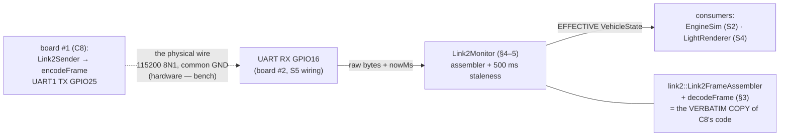

# S1 — link2 Receiver Side + Cross-Repo Protocol Compatibility

**Batch S1 of the source-code campaign** (see `../../source_code_explanation_plan.md`) —
the **first soundlight batch**, and the receiving end of the wire that batch C8 finished
sending on. Board #2 (`w17-soundlight-fw`) consumes the one-way 14-byte link2 stream from
board #1 and turns it into sound and light. This batch covers: board #2's pin map, the
**verbatim copy of `lib/link2`** (diff-verified byte-for-byte against the control repo —
the diff *is* the explanation), and the genuinely new module: **`Link2Monitor`**, the
staleness watchdog that decides *whether board #1's last words are still believable*.

**The headline result:** the copied `lib/link2` files are **byte-for-byte identical** to
the control repo's (checksums matched on all four shared files), and both repos pin the
**same golden frame** in passing native tests. C8's biggest PROVISIONAL — cross-repo
protocol compatibility — is now **VERIFIED at the source-and-test level** (§1). What still
waits for hardware: the actual wire (GPIO25 → GPIO16, electrical, §10).

## Scope (files explained here)

| File (`w17-soundlight-fw/`) | Lines | What it is |
|---|---|---|
| `lib/config/include/config/PinMap.hpp` | 30 | board #2's GPIO assignments |
| `lib/config/library.json` | 8 | pin-map lib metadata |
| `lib/link2/include/link2/Link2Frame.hpp` | 76 | **verbatim copy** — diff-verified, then referenced to C8 |
| `lib/link2/include/link2/Link2Codec.hpp` | 45 | **verbatim copy** — same |
| `lib/link2/src/Link2Codec.cpp` | 117 | **verbatim copy** — same |
| `lib/link2/library.json` | 10 | **verbatim copy** — incl. one interesting side effect (§1.4) |
| `lib/link2monitor/include/link2monitor/Link2Monitor.hpp` | 64 | the staleness watchdog — interface |
| `lib/link2monitor/src/Link2Monitor.cpp` | 57 | …implementation (the per-field projection) |
| `lib/link2monitor/library.json` | 10 | monitor lib metadata |
| `test/test_link2/test_main.cpp` | 139 | 5 receiver-focused tests — **diff-checked vs control's: a rewrite, not a copy** (§6) |
| `test/test_link2monitor/test_main.cpp` | 123 | 6 monitor tests (§7) |

**Prerequisites:** C8 (`../control_fw/08_link2_outbound_protocol.md`) — the frame format,
CRC, encoder/decoder and assembler are explained line-by-line there and **not re-explained
here** (the copy is identical; §3 gives the receiver's reading of the same code). Chapter
09 §2 (the protocol at spec level, incl. the golden frame decoded by hand). Chapter 07 §2
(the staleness table at architecture level — this batch is the code behind it).

**Test status: RUN AND PASSING (2026-07-05).**
`pio test -e native -f test_link2 -f test_link2monitor` → **11/11 PASSED** (5 + 6), and
the full soundlight suite `pio test -e native` → **40/40 PASSED** (all six suites),
matching the handoff's expectation exactly. Behaviours marked **VERIFIED** below are
backed by those runs plus the checksum diff. As always: native tests prove *logic on this
Mac*, not electrical behaviour on an ESP32.

> **S5-resolution note (2026-07-06,** `05_soundlight_main_integration.md`**):** every
> "PROVISIONAL until S5" in this doc is now resolved at source+build level. `main.cpp`
> drains `Serial2` (UART2, 115200 8N1, **RX = GPIO16, TX = −1** — GPIO17 never opened,
> §2's reserved-ack promise honored) into `monitor.feedByte(byte, millis())` on **every**
> loop pass, and calls `monitor.poll(millis())` on the 50 Hz control tick — the silent-
> link-goes-Lost heartbeat is real (§4's contract). `millis()` is the monotonic clock the
> §5 wraparound analysis assumed. The `Link2MonitorConfig` `static_assert` lives at
> `main.cpp:29–30`, as predicted (C10-style definition-site assert). Both consumers act
> on `state()` as designed: `EngineSim` (50 Hz) and `LightRenderer` (~30 Hz) receive the
> same effective state. **#50 is CLOSED (benign):** both ESP32 envs build SUCCESS and the
> LDF never resolves the dangling `hal` dep (§1.4). Still bench-only: the physical
> GPIO25→GPIO16 wire, common ground, 115200 timing (§10).

---

## 0. The whole shape — the same wire, seen from the other end



C8 ended with `Esp32Link2Uart` pushing 14 bytes onto a wire every 50 ms and a promise:
*"cross-repo compatibility is PROVISIONAL until S1 diff-verifies the copy."* This batch
is that verification, plus the one module the control repo has no counterpart for:
`Link2Monitor`. The monitor exists because the link is **one-way** — board #2 can never
ask "are you still there?", so it must decide *by clock* when to stop believing the last
frame. Chapter 09 §2.4 states the rule (no CRC-valid frame for 500 ms ⇒ local failsafe);
§5 below is the code that implements it.

---

## 1. The compatibility review — diff-verifying the verbatim copy

The soundlight brief (`w17-soundlight-fw/CLAUDE.md`) documents the design rule:
`lib/link2` is *"copied VERBATIM from w17-control-fw (do not fork; protocol changes
happen there first)"*. The plan's rule for S1: don't re-explain the copy — **diff it**.
A clean diff means C8's explanation covers this repo too; any difference is a finding.

### 1.1 Method

Two independent checks (run 2026-07-05):

1. `diff -r w17-control-fw/lib/link2 w17-soundlight-fw/lib/link2` — recursive,
   whole-directory. Output: **only two lines**, both `Only in w17-control-fw/...`:
   `Link2Sender.hpp` and `Link2Sender.cpp`. **No content differences in any shared file.**
2. `md5` checksums on each shared file — a checksum is a fingerprint of the file's exact
   bytes; two files with the same checksum are byte-for-byte identical:

| File | control md5 | soundlight md5 | Verdict |
|---|---|---|---|
| `include/link2/Link2Frame.hpp` | `174bcbd4…` | `174bcbd4…` | **IDENTICAL** |
| `include/link2/Link2Codec.hpp` | `7b11cfb9…` | `7b11cfb9…` | **IDENTICAL** |
| `src/Link2Codec.cpp` | `20347dc9…` | `20347dc9…` | **IDENTICAL** |
| `library.json` | `f710a460…` | `f710a460…` | **IDENTICAL** (see §1.4) |
| `include/link2/Link2Sender.{hpp,cpp}` | present | **absent** | expected — see below |

Also checked: `docs/link2_protocol.md` (the spec) is **byte-identical** in both repos.

**The absence of `Link2Sender` is correct, not a finding.** The sender is board #1's
job (scaling ±1000 control units to ±100 wire percent, brake-light hysteresis — C8 §3),
and it's the *only* link2 file that touches `hal::IByteSink`. Board #2 receives; it needs
the codec + assembler, not the sender. Note the copy still contains `encodeFrame` —
deliberately: the brief says *"`encodeFrame` is kept for the sim feeder"* (S5's
`SimLink2Feeder` builds frames locally for the bench demo), and every test here uses it
to construct its input frames. **VERIFIED** (diff + brief).

### 1.2 The compatibility checklist, item by item

Because the sources are byte-identical, every format property C8 verified transfers
automatically — but per the strict rule, here is each one confirmed *on the soundlight
side*, with the local evidence:

| Property | Value (both repos) | Soundlight-side evidence |
|---|---|---|
| Frame length | **14** = `kFrameLen = 3 + kPayloadLen` (`Link2Frame.hpp:40`) | checksum + `test_golden_frame_bytes` uses a 14-byte array |
| Start byte | **0xA5** (`kStartByte`, line 37) | golden frame byte [0]; `test_decode_rejections` (BadStart when it's 0x00) |
| Version | **1** (`kProtocolVersion`, line 38) | golden byte [2] = 0x01; BadVersion case in `test_decode_rejections` |
| Payload layout | 11 bytes: version, throttle, steering, flags, gear, rpm×2, batt×2, ers, mode | identical header comment + `test_decode_roundtrip` checks every field |
| Flag bits | bit0 braking … bit6 ersDeploying, bit7 reserved (lines 43–49) | golden flags byte 0x4C = drsOpen\|armed\|ersDeploying decoded correctly |
| Signed fields | throttle/steering are `int8_t`, two's complement cast (`Link2Codec.cpp:61–62`) | `test_decode_roundtrip`: byte 0xE7 → **−25** steering |
| Endianness | rpm + batteryMv **little-endian** (`data[7] \| (data[8] << 8)`, lines 72–73) | roundtrip: `DC 05` → 1500, `DC 1E` → 7900 |
| CRC coverage | poly 0xD5 over bytes **[1..12]** (length + payload), start excluded (line 54) | golden CRC 0xCE reproduced; CrcMismatch case in rejections test |
| Validation order | start → length → CRC → **version last** (lines 44–58) | `test_decode_rejections` pins CrcMismatch-before-BadVersion |
| Assembler rule | non-11 length byte hard-rejected immediately (lines 90–97) | `test_assembler_hard_rejects_bad_length_byte` |
| Staleness timeout | **500 ms** (spec obligation) | `Link2MonitorConfig::stalenessMs = 500` + boundary test (§7.3) |
| Golden frame | `A5 0B 01 2A E7 4C 03 DC 05 DC 1E 3C 02 CE` | **the identical 14 bytes are hard-coded in BOTH repos' tests**, and both suites pass |

**No mismatch found in any item. Zero findings against the protocol.** **VERIFIED**
(checksums + both repos' test runs: control 13/13 on 2026-07-03 per C8, soundlight 5/5 +
6/6 on 2026-07-05).

### 1.3 What claim level this earns — being precise about "compatible"

This is the batch's most important labeling decision, so slowly:

- **VERIFIED: source-level compatibility.** The two repos compile *the same bytes of
  source code* for the codec, and each repo's own native test suite pins *the same
  14 golden bytes*. Encoding on board #1 and decoding on board #2 cannot disagree about
  the format, because they are literally the same functions. This is what C8's
  PROVISIONAL asked for, and it is now closed.
- **Still PROVISIONAL: wire-level compatibility on hardware.** Nothing in this batch (or
  any native test) proves that a physical GPIO25 → GPIO16 wire at 115200 baud with a
  common ground actually delivers those bytes intact on real boards. That's a bench item
  (§10) — UART clock tolerance, wiring, the parasitic-powering warning from the spec.
- **Still PROVISIONAL: composition.** That board #2's `main.cpp` actually feeds UART
  bytes into `Link2Monitor::feedByte` and calls `poll()` every tick is an S5 claim
  (same boundary discipline as C8's "GPIO25 is a C10 wiring claim").

An analogy: we've proven both people memorized the same dictionary; we haven't yet proven
the phone line between them works.

### 1.4 One real finding — the copied `library.json` drags in a dangling dependency

`lib/link2/library.json` (10 lines, identical in both repos) is PlatformIO metadata:

```json
{
  "name": "link2",
  "version": "0.1.0",
  "description": "Framed vehicle-state message to the sound/light ESP32 #2. Pure,
                  self-contained (liftable into the board-#2 project wholesale);
                  only Link2Sender touches hal.",
  "frameworks": "*", "platforms": "*",
  "dependencies": { "hal": "*" }
}
```

- The `"dependencies": { "hal": "*" }` entry is correct **in the control repo**: as the
  description itself says, `Link2Sender` includes `hal/IByteSink.hpp`, so link2 needs the
  `hal` library there.
- **The soundlight repo has no `lib/hal` at all** (checked: its `lib/` holds
  audio_hal_esp32, config, enginesim, lights, lights_hal_esp32, link2, link2monitor,
  soundsynth — no `hal`), and no soundlight link2 source references `hal` (grep-confirmed;
  `Link2Sender` wasn't copied). The dependency is **dangling**: declared, but pointing at
  nothing, needed by nothing.
- **It is benign in practice**: the full native suite builds and passes 40/40, so
  PlatformIO's LDF doesn't choke on it (no file `#include`s a hal header, so the
  dependency is never exercised). And it is arguably *intentional*: the do-not-fork rule
  means the copy stays byte-identical *including metadata* — editing `library.json` to
  drop the dep would be a fork. The cost of copy discipline is one harmless stale line.
- Labels: dangling-and-unused **VERIFIED** (directory listing + grep); benign for the
  native build **VERIFIED** (40/40 run); benign for the `esp32dev` build **PROVISIONAL**
  (not built this session — S5 covers soundlight's builds + `ci.yml`). Logged as
  documentation-consistency note **#50** in `open_questions.md`.

### 1.5 A correction to C8's doc, found by this diff

C8's writeup claimed the stale "12-byte" comment lives in *"the header comment at the top
of the file"* (`Link2Frame.hpp`) as well as the UART files. **Grep shows `Link2Frame.hpp`
(both repos — they're identical) contains no "12 byte" text**; its header comment
describes the frame correctly. The stale "12-byte" comments exist only in two
control-repo files that were never part of the copy: `lib/hal/include/hal/IByteSink.hpp:9`
and `lib/link2_hal_esp32/…/Esp32Link2Uart.hpp:14` (both already flagged in C1/C8; both
sender-side). Consequence for this batch: **the copy carries no stale size comment** —
board #2's copy of the format documentation is accurate. The C8 doc has been corrected
(narrow fix, noted at its top).

---

## 2. `lib/config/…/PinMap.hpp` — board #2's 30 lines of pin choices

Board #2's whole pin policy, in the same style as C1's control-board pin map — but read
the header comment first, because it makes a point beginners miss:

```cpp
// All GPIO assignments for ESP32 #2 "sound + light". This board owns its own
// pin choices (nothing here is dictated by board #1). All non-strapping,
// none input-only. Bench-verify before soldering.
```

- **"This board owns its own pin choices"** — GPIO numbers are *per-chip*. Board #1 uses
  GPIO25 as its link2 **TX**; board #2 happens to use GPIO25 as its I2S **LRCLK**. That is
  not a conflict: they are different physical chips, each with its own GPIO25. What links
  the boards is a *wire between two pins*, not a shared number. **VERIFIED** (both pin
  maps).
- **"All non-strapping"** — ESP32 *strapping pins* (GPIO0, 2, 5, 12, 15) are sampled by
  the chip at reset to choose boot behaviour; an external device holding one high/low at
  the wrong moment can stop the chip booting. Every pin chosen here avoids that set (16,
  17, 26, 25, 22, 4 — check them against the list). Same discipline as C1. **VERIFIED**
  (pin values vs the strapping list, ch03).
- **"None input-only"** — GPIO34–39 on the ESP32 can only read (no output driver). None
  are used here, so any pin could be repurposed either direction later. **VERIFIED.**

### Lines 11–14: the link2 UART pins

```cpp
// UART from board #1 (one-way link2 stream, 115200 8N1, common ground).
inline constexpr uint8_t kLink2UartRxPin = 16;
// Reserved for the protocol's future ack channel -- NOT opened in firmware.
inline constexpr uint8_t kLink2UartTxPinReserved = 17;
```

- `inline constexpr uint8_t` — the same C++ idiom as every constant since C1: a
  compile-time constant with a fixed 8-bit unsigned type, `inline` so the header can be
  included everywhere without duplicate-symbol errors (C1 §1 explains each keyword).
- **GPIO16 = the receiving end of C8's wire.** Board #1 TX GPIO25 → board #2 RX GPIO16,
  115200 8N1, and the comment repeats the electrical prerequisite: **common ground** (a
  UART signal is a voltage *relative to ground*; two boards with unconnected grounds have
  no shared reference, and the receiver reads garbage). **VERIFIED** (constant; the wire
  itself is bench).
- **GPIO17 = the reserved ack channel's TX end.** This is the mirror of control-repo open
  question **#33** (board #1 reserves GPIO26 as a future ack **RX**, deliberately not
  opened). A future two-way upgrade would run board #2 GPIO17 TX → board #1 GPIO26 RX.
  Neither end opens the pin in firmware today — same noise-avoidance reasoning C8
  explained for the `rxPin = -1` on the sender side. **VERIFIED** (comments both repos).

### Lines 16–24: the I2S pins + amplifier strap notes

```cpp
inline constexpr uint8_t kI2sBclkPin = 26;
inline constexpr uint8_t kI2sLrclkPin = 25;
inline constexpr uint8_t kI2sDataPin = 22;
```

- **I2S** is the three-wire digital audio bus (ch03 §7, glossary): BCLK (bit clock),
  LRCLK (left/right word clock), DIN (data). These go to the MAX98357A amplifier —
  the comment calls it "the canonical Adafruit hookup," i.e. the wiring from the part's
  reference guide. Used by S5's `Esp32I2sAudio`. **VERIFIED** (constants).
- The comment block then documents the amplifier's **strap pins** — hardware
  configuration pins set by wiring, not software: `GAIN` left floating = 9 dB gain
  (solder to GND for 12 dB, VDD for 6 dB); `SD_MODE` strapped high = the amp outputs
  (L+R)/2. And one carefully-reasoned line: *"we transmit duplicated stereo so every
  SD_MODE selection sounds identical"* — the firmware sends the same samples on both
  stereo channels, so whichever channel-select mode the strap picks, the mono result is
  the same. A hardware decision absorbed in software. The power-on-pop remark (drive
  SD_MODE from a spare GPIO if it annoys) is a bench option, not current firmware.
  **VERIFIED** (comment) / audio behaviour itself is S5 + bench.

### Lines 26–28: the LED strip pin

```cpp
inline constexpr uint8_t kLedStripPin = 4;
```

- WS2812B data on GPIO4, with the build-sheet electrical fixes recalled in the comment:
  330 Ω series resistor **at the strip end** (edge-ringing damping), 1000 µF across the
  strip's 5 V/GND (inrush), 1N5819 diode on strip VDD (a level-shift trick raising the
  strip's data threshold — ch03). Used by S4's `Esp32NeoPixelStrip`. **VERIFIED**
  (constant + comments; electrical behaviour bench).

`lib/config/library.json` (8 lines) is the header-only shape from C1's comparison table:
name/version/description + `"frameworks": "*", "platforms": "*"`, **no `dependencies`**
key — nothing to resolve for a pure header. **VERIFIED.** (That's 3 of soundlight's 8
`library.json` files now covered: config here, link2 in §1.4, link2monitor in §4.)

---

## 3. The copied codec, read from the receiver's chair (reference to C8)

Per the plan, the identical files are **not re-explained** — C8 §1–2 walks
`Link2Frame.hpp` and `Link2Codec.cpp` line-by-line, and every word applies verbatim here.
What *changes* is which parts matter. The receiver's tour:

- **`VehicleState` defaults are board #2's boot state** (`Link2Frame.hpp:51–66`). On the
  sender they were "what an empty frame would say"; here they are literally *what the
  performance runs on before the first frame arrives*: `failsafe = true` (hazards, no
  engine), `throttlePercent = 0`, `gear = 1`, `ersPercent = 100`, `driveMode = 1`.
  `Link2Monitor` returns exactly this default-constructed struct while `NeverConnected`
  (§5). The comment "boot-safe default: never report a phantom Active" was written for
  precisely this consumer. **VERIFIED.**
- **`decodeFrame` + `Link2FrameAssembler` are the receiver's working half**
  (`Link2Codec.cpp:43–115`). C8 explained them as "present because the lib is liftable";
  here they are the point. The three assembler states (WaitingForStart → ReadingLength →
  ReadingBody), the immediate hard-reject of a non-11 length byte, the resync-on-0xA5
  behaviour, and `decodeFrame`'s start→length→CRC→version order with `out` untouched on
  failure — all C8 §2, all now *load-bearing for this board*. **VERIFIED** (identical
  source + this repo's own 5 tests).
- **`encodeFrame` is the receiver's test-and-sim tool** — kept per the brief for
  `SimLink2Feeder` (S5) and used by every test below to manufacture wire-perfect input
  frames without hard-coding 14 bytes each time. This is a lovely testing pattern: since
  `test_golden_frame_bytes` proves `encodeFrame` produces the pinned wire bytes, other
  tests may use `encodeFrame(state)` as a trusted frame factory. **VERIFIED.**
- **`computeCrc8`** — same 0xD5 bit-by-bit CRC (C3 §4.1, C8 §2). One coverage note: the
  control repo's `test_crc_matches_crsf_implementation` cross-check *does not exist here*
  (there's no `lib/crsf` in this repo to cross-check against — that's the whole reason the
  CRC was duplicated). Here the CRC is pinned by the golden frame's `0xCE` alone. Since
  the source is checksum-identical to the (multiply-verified) control copy, nothing is
  lost. **VERIFIED.**

One wording nuance, for honesty rather than alarm: `Link2Frame.hpp:12–14` (the copy)
summarizes the staleness obligation as *"engine to idle, hazard blink"*, the spec says
*"engine sound to idle/off"*, and the soundlight brief says *"engine to silence"*. These
are progressively stricter phrasings of the same obligation; what the firmware actually
does (link loss ⇒ effective `armed = false` ⇒ ignition `Off` ⇒ silence, per ch07 §3) sits
at the strict end and satisfies all three. Not a protocol mismatch — a comment that allows
more than the implementation takes. **VERIFIED** (texts) / the ignition path itself is S2.

---

## 4. `Link2Monitor.hpp` — the interface of "trust, with an expiry date"

The one new module of this batch: 64 lines of header, 57 of implementation, zero
hardware includes (pure logic, house rule). Its `library.json` declares
`"dependencies": { "link2": "*" }` — the monitor wraps the codec's assembler, and this
dependency (unlike §1.4's) is real and exercised. **VERIFIED.**

### Lines 12–16: `LinkStatus` — three answers to "how is the link?"

```cpp
enum class LinkStatus : uint8_t {
    NeverConnected, // no valid frame has ever arrived
    Up,             // a valid frame arrived within the staleness window
    Lost,           // was Up, then no valid frame for >= staleness window
};
```

- `enum class … : uint8_t` — a scoped enumeration stored in one byte (C1 §4 explained the
  idiom on `FailsafeStateMachine`'s states). Scoped means you must write
  `LinkStatus::Lost`, so it can't collide with other names.
- **Why three states and not a boolean?** The header's own comment answers: *"lights need
  the NeverConnected vs Lost distinction"*. The two non-Up states mean different things to
  a human looking at the car: `NeverConnected` = "board #1 hasn't spoken yet — maybe still
  booting" (normal for a second or two after power-on); `Lost` = "board #1 *was* talking
  and stopped" (a real event mid-drive — wire off, board #1 crashed). *(S4 correction,
  2026-07-05: this paragraph originally relayed ch07 §5's claim that the hazard shows
  amber for both non-Up states — S4 found the lights render them **differently**:
  `NeverConnected` gets a calm teal "waiting breathe" on the halo, and only
  `Lost`/failsafe gets the amber hazard — so the distinction is a first-class visual,
  not just debug output. See `04_lights_and_light_hal.md` §3.4 + note #54a.)* The tests
  read the intent directly instead of inferring it from projected field values.
  **VERIFIED** (enum + comment; the lights' use now VERIFIED by S4).

### Lines 18–24: `Link2MonitorConfig` — one number, spec-mandated

```cpp
struct Link2MonitorConfig {
    // Protocol mandate (docs/link2_protocol.md): no CRC-valid frame for this
    // long => local failsafe. 500 ms = 10 missed frames at the nominal 20 Hz.
    uint32_t stalenessMs = 500;
    constexpr bool valid() const { return stalenessMs > 0; }
};
```

- The house config pattern (C1 §4, C5–C9 throughout): a struct of tunables with defaults
  and a `constexpr valid()` for a definition-site `static_assert`. Here there is exactly
  one tunable, and its default is not a preference but a **protocol obligation** — the
  comment cites the spec. 500 ms at 20 Hz = 10 consecutive missed frames; one lost frame
  (50 ms gap) is nowhere near tripping it. **VERIFIED** (source + spec text, §1.2 table).
- `valid()` only demands `stalenessMs > 0` — a zero window would make *every* poll
  instantly stale (`elapsed >= 0` is always true), i.e. a permanently-failsafed board.
  The test in §7.6 pins exactly this rule. Note `valid()` does *not* enforce "must be
  500" — the config stays tunable (a bench experiment could shorten it), only nonsense is
  rejected. **VERIFIED.**
- Where's the `static_assert`? Not in this library — the assert-at-definition-site
  happens where a config *instance* is defined, i.e. `main.cpp` (S5). Same layering as
  the control repo (C10 §2). **PROVISIONAL until S5.**

### Lines 26–50: the class interface — time as a parameter, not a dependency

```cpp
class Link2Monitor {
public:
    explicit Link2Monitor(Link2MonitorConfig config = Link2MonitorConfig{});
    void feedByte(uint8_t b, uint32_t nowMs);
    void poll(uint32_t nowMs);
    LinkStatus status() const { return status_; }
    const link2::VehicleState& state() const { return effective_; }
```

- `explicit` on the constructor — forbids silent conversion from a bare config to a
  monitor (C2 explained the keyword). The `= Link2MonitorConfig{}` default argument means
  `Link2Monitor mon;` builds one with the spec's 500 ms — which is what every test does.
- **Notice what is *not* here: no `hal::IClock`.** The control repo injected time as an
  interface object (C1 §3); this module goes one simpler — **every method takes `nowMs`
  as a plain argument**. The caller (main loop, or a test) is the clock. That is the
  lightest possible seam: no interface, no mock class, tests just pass numbers
  (`mon.poll(600)`). Trade-off: the caller *must* remember to pass a consistent
  monotonic time — nothing enforces it. Board #2's `main.cpp` presumably passes
  `millis()` (**PROVISIONAL until S5**). **VERIFIED** (signatures).
- **`feedByte(b, nowMs)`** — one raw UART byte in; the comment says *"nowMs stamps a
  successfully decoded frame"*: the time argument only matters on the byte that
  *completes* a valid frame (§5). A 14-byte frame at 115200 baud occupies ~1.2 ms of
  wire time, so "the frame's timestamp = its last byte's arrival" is as precise as
  anyone needs against a 500 ms window.
- **`poll(nowMs)`** — the crucial companion, with the crucial comment: *"call every tick
  even when no bytes arrived — that is how a silent link becomes Lost."* Think about the
  cut-wire case: no bytes ⇒ `feedByte` is never called ⇒ if status were only recomputed
  in `feedByte`, a dead link would freeze the status at `Up` forever — the *exact*
  disaster the monitor exists to prevent. `poll` is the heartbeat that re-asks "is the
  last frame still fresh?" from the clock alone. **VERIFIED** (source; §7.3–7.4 tests).
- **`state()` returns the *effective* state** — the monitor's defining idea, worth
  slowing down for. It does **not** return "the last frame received." It returns *what
  the consumers should act on*: the last good frame while `Up`, but a **projected,
  per-field-sanitized version** of it once the link is not Up (§5). Consumers (EngineSim,
  LightRenderer) never see raw-but-stale commands; the sanitization happens in exactly
  one place. Returned as a `const` reference (no copy per tick; read-only). **VERIFIED.**

### Lines 52–61: the private members — the monitor's whole memory

```cpp
private:
    void recompute(uint32_t nowMs);
    Link2MonitorConfig config_;
    link2::Link2FrameAssembler assembler_;
    link2::VehicleState lastGood_{};  // last successfully decoded frame
    link2::VehicleState effective_{}; // what state() returns
    LinkStatus status_ = LinkStatus::NeverConnected;
    bool everReceived_ = false;
    uint32_t lastFrameMs_ = 0;
```

Two `VehicleState`s, and the split is the design: `lastGood_` = the truth as last heard
(never modified by staleness); `effective_` = the truth as currently *usable*. Keeping
both means recovery is trivial (a fresh frame just overwrites `lastGood_` and `effective_`
follows) and the projection is idempotent (recomputed from `lastGood_` on every call, not
applied destructively to itself). `everReceived_` starts false — the flag that separates
`NeverConnected` from `Lost` forever after the first valid frame. `{}` value-initializes
the structs to their (safe) defaults. **VERIFIED.**

---

## 5. `Link2Monitor.cpp` — 57 lines, every one of them a policy

### Lines 5–9: the constructor

```cpp
Link2Monitor::Link2Monitor(Link2MonitorConfig config) : config_(config) {
    // Boot state = never-connected local failsafe (failsafe flag set by the
    // VehicleState default).
    effective_.failsafe = true;
}
```

- `: config_(config)` is a member-initializer list (C1 §5): `config_` is built directly
  from the argument.
- The body's one line is, strictly, **redundant** — `VehicleState`'s in-struct default
  already sets `failsafe = true` (`Link2Frame.hpp:58`), and the comment even says so.
  It's belt-and-braces: the constructor *states* the safety property instead of silently
  inheriting it, so a future edit to the struct's defaults can't quietly change boot
  behaviour. Cheap insurance, self-documenting. **VERIFIED** (both the line and the
  redundancy).
- So at construction: `status_ = NeverConnected`, `effective_` = all safe defaults
  (failsafe true, throttle 0, gear 1, ers 100, mode 1). **This is the answer to "what
  does board #2 believe before the first frame ever arrives": the boot-safe
  `VehicleState`, with failsafe asserted.** Test §7.1 pins it. **VERIFIED (ran).**

### Lines 11–19: `feedByte` — bytes in, maybe a frame out

```cpp
void Link2Monitor::feedByte(uint8_t b, uint32_t nowMs) {
    const link2::Link2FrameAssembler::FeedResult result = assembler_.feedByte(b);
    if (result == link2::Link2FrameAssembler::FeedResult::FrameReady) {
        lastGood_ = assembler_.lastState();
        everReceived_ = true;
        lastFrameMs_ = nowMs;
    }
    recompute(nowMs);
}
```

Walk it byte-by-byte, because the *conditions* are the content:

- Every byte goes into the copied assembler (§3). Thirteen out of fourteen times per
  frame the result is `Incomplete` and the `if` is skipped.
- **Only `FrameReady` — a complete, CRC-valid, version-1 frame — updates anything.** The
  three updates: copy the decoded state into `lastGood_` (struct assignment copies all
  13 fields), latch `everReceived_` (one-way, never reset), stamp `lastFrameMs_`.
- **What happens on `FrameInvalid` (corrupt frame)? Nothing.** No stamp. This is the
  spec's phrase implemented literally: no **CRC-valid** frame for 500 ms ⇒ failsafe. A
  cable picking up noise that delivers a steady stream of *corrupt* bytes does **not**
  keep the link alive — garbage is silence, as far as staleness is concerned. There is no
  dedicated test for the corrupt-stream-goes-Lost scenario, but the code path is plainly
  visible: `lastFrameMs_` is written in exactly one place, behind the `FrameReady` check.
  **VERIFIED (source)**; the combined scenario is an easy exercise (question 5, §11).
- `recompute(nowMs)` runs after **every** byte, valid or not — so status transitions
  happen at the earliest possible moment (a frame completing at `nowMs` flips Lost → Up
  in the same call, no waiting for the next `poll`). Test §7.5 relies on this.
  **VERIFIED (ran).**

### Line 21: `poll` — one line, load-bearing

```cpp
void Link2Monitor::poll(uint32_t nowMs) { recompute(nowMs); }
```

The public heartbeat is just "recompute from the clock." All logic lives in one private
function so the two entry points (bytes arriving / time passing) cannot drift apart.
**VERIFIED.**

### Lines 23–55: `recompute` — the three-way decision and the projection

```cpp
void Link2Monitor::recompute(uint32_t nowMs) {
    if (!everReceived_) {
        status_ = LinkStatus::NeverConnected;
        effective_ = link2::VehicleState{}; // all-safe defaults, failsafe = true
        return;
    }
```

- **Branch 1 — never connected.** `effective_` is re-assigned a freshly
  value-initialized `VehicleState{}` (all defaults) on *every* recompute until the first
  frame. Note this means time passing can never change a `NeverConnected` monitor's
  answer — §7.1 pins that with `poll(100000)`. **VERIFIED (ran).**

```cpp
    // >= is inclusive: exactly stalenessMs since the last frame is stale.
    const bool stale = (nowMs - lastFrameMs_) >= config_.stalenessMs;
    if (!stale) {
        status_ = LinkStatus::Up;
        effective_ = lastGood_;
        return;
    }
```

- **Branch 2 — fresh.** Three beginner-relevant details in two lines:
  1. **The subtraction is `uint32_t` arithmetic.** If board #2 runs long enough for
     `millis()` to wrap past 2³²−1 (≈ 49.7 days), `nowMs` restarts near zero while
     `lastFrameMs_` is huge. Unsigned subtraction *wraps modulo 2³²*, so
     `small − huge` still yields the true elapsed difference — the standard embedded
     trick (C7 §3 used it for wheel-speed timeouts). No wraparound bug here, provided
     elapsed time between frames stays under 49.7 days — safe by 5 orders of magnitude
     against a 500 ms window. **VERIFIED** (types) — assuming the caller passes a
     monotonic-until-wrap `millis()`-style clock (**PROVISIONAL until S5**, same clock
     caveat C2 had until C10 resolved it with `Esp32MillisClock`).
  2. **`>=`, not `>`** — the comment spells it out: elapsed of *exactly* 500 ms is
     already stale. Boundary-inclusive, and §7.3 pins the exact edge (499 ms Up,
     500 ms Lost). Compare C5's ArmGate `|thr| <= 60` — this codebase consistently
     documents and tests which side owns the boundary. **VERIFIED (ran).**
  3. While fresh: `effective_ = lastGood_` — consumers see the last frame *verbatim*,
     no projection. **VERIFIED (ran)** (§7.2 reads throttle 80 / rpm 4000 straight
     through).

```cpp
    // Lost: per-field failsafe projection over the last good frame.
    status_ = LinkStatus::Lost;
    effective_ = lastGood_;
    // Commands -> safe.
    effective_.throttlePercent = 0;
    effective_.steeringPercent = 0;
    effective_.braking = false;
    effective_.reverse = false;
    effective_.drsOpen = false;
    effective_.armed = false;
    effective_.ersDeploying = false;
    effective_.failsafe = true;
    // Motion telemetry must not persist -- a stale rpm would drive the engine
    // sound and speed readout.
    effective_.rpm = 0;
    // Held last-known (garnish / latched judgments): batteryMv, lowBattery,
    // gear, ersPercent, driveMode -- left as copied from lastGood_.
```

- **Branch 3 — the projection, the design decision chapter 07 §2 tabled.** Mechanically:
  start from a full copy of `lastGood_`, then overwrite the fields that must not
  survive staleness. Field class by field class:

| Class | Fields | Projection | Why (the header's reasoning) |
|---|---|---|---|
| **Commands** | throttlePercent, steeringPercent, braking, reverse, drsOpen, armed, ersDeploying → and `failsafe` forced **true** | zeroed / cleared | *"a stale command must not drive anything."* A 500 ms-old throttle=80 means nothing about the present; acting on it would be performing a ghost's instructions. Forcing `armed = false` is what will drop the (S2) ignition machine to `Off` — link loss *sounds like* the engine dying. |
| **Motion telemetry** | rpm | zeroed | *"a stale rpm would drive the engine sound and speed readout"* — the wheels may have stopped, but frozen rpm would keep the soundtrack (and any readout) moving. Motion data is only meaningful *now*. |
| **Slow facts & latched judgments** | batteryMv, lowBattery, gear, ersPercent, driveMode | **held** (simply not overwritten) | Battery voltage doesn't change meaningfully in half a second, and `lowBattery` was already a *qualified judgment* by board #1 (3 s-sustained + hysteresis, C7) — blanking these would make displays flicker on every glitch. Holding `gear` also avoids phantom shift-blip sounds on recovery (the test comment, §7.4). |

- Note what "held" means in code: **nothing** — those five fields are simply *absent*
  from the overwrite list, so they keep the values copied from `lastGood_`. The quietest
  lines in the function are policy too, which is why the closing comment names them
  explicitly. **VERIFIED (ran)** — §7.4 asserts every one of the 13 fields on a Lost
  monitor.
- The projection runs on *every* recompute while Lost (idempotent — same input, same
  output; overwriting `effective_` from `lastGood_` each time means no accumulation).
  And `lastGood_` itself is never touched — so a single fresh frame later restores full
  fidelity instantly (§7.5). **VERIFIED (ran).**
- One deliberate contrast to notice: **`failsafe = true` here is board #2's *own local*
  judgment**, distinct from the `failsafe` *flag inside a received frame* (which is board
  #1 reporting *its* CRSF failsafe — C8 §3). Both funnel into the same effective field,
  because the consumers' correct reaction is identical; but the causes are independent
  (radio lost vs wire lost), and C8's "two independent mechanisms" note is exactly this.
  The INFERRED label C8 gave that distinction is now **VERIFIED** — both halves are in
  explained source.

---

## 6. `test/test_link2/test_main.cpp` — the diff-check: a rewrite, not a copy

The plan said "diff-check vs control's." Result: **deliberately different** — this is
not a drifted copy but a *receiver-focused rewrite*, and its own header comment says
which contract it serves: *"These tests pin the receiving-side behaviors this board
depends on; the golden frame must stay byte-identical to the sender repo's."*

**The inventory, control (13 tests) vs soundlight (5 tests):**

| Control test (C8 §5) | Soundlight equivalent | Why |
|---|---|---|
| golden_frame_bytes | **kept** (same 14 bytes, same assertions) | THE cross-repo contract |
| encode_decode_roundtrip (extreme values) | **reduced** → `test_decode_roundtrip` (golden values only) | receiver cares that decode works; extremes pinned sender-side |
| crc_matches_crsf_implementation | **dropped** | no `lib/crsf` in this repo to compare against |
| each_flag_bit_pinned | **dropped** | bit masks pinned sender-side; identical source |
| 3 separate rejection tests + validation-order | **merged** → `test_decode_rejections` (4 cases in one) | same coverage, compact |
| decode_leaves_out_untouched_on_failure | **dropped** | pinned sender-side; identical source |
| assembler_frame_byte_by_byte | **folded into** the hard-reject test's second half | still proves byte-by-byte assembly |
| assembler_hard_rejects_bad_length_byte_immediately | **kept** (slightly simplified) | a spec **receiver obligation** — must be pinned here |
| assembler_resyncs… `0xA5`-in-payload | **kept but simplified** — corrupt CRC, ordinary resync; the false-sync payload trick is *not* reproduced | see the coverage note below |
| 2 sender tests (golden write, brake hysteresis) | **dropped** | no `Link2Sender` here |

**Coverage note (honest accounting):** the *hardest* assembler case — a `0xA5` byte
legally inside a payload causing a false sync (control feeds `throttlePercent = −91`) —
is pinned **only in the sender repo**. Since the assembler source is checksum-identical,
the behaviour provably transfers; but if the copy were ever forked, this repo's own suite
would not catch a false-sync regression. Acceptable under the do-not-fork rule; worth
knowing. **VERIFIED** (test inventories both repos).

Now the file top-to-bottom:

### Lines 1–13: includes and using-declarations

`<unity.h>` (the test framework, C1 §7), `<cstring>` (`std::memcpy` for copying frames
before corrupting them), the codec header, the copy-discipline comment quoted above, and
three `using` declarations so test bodies can say `VehicleState` instead of
`link2::VehicleState`.

### Lines 15–39: the anonymous namespace — golden state + golden bytes

```cpp
namespace {
VehicleState makeGoldenState() { … }
const uint8_t kGoldenFrame[link2::kFrameLen] = {
    0xA5, 0x0B, 0x01, 0x2A, 0xE7, 0x4C, 0x03, 0xDC, 0x05, 0xDC, 0x1E, 0x3C, 0x02, 0xCE,
};
} // namespace
```

- An anonymous namespace makes these helpers file-private (C4 explained the idiom).
- `makeGoldenState()` builds field-by-field **the exact same state as control's helper**:
  throttle +42, steering −25, braking false, drsOpen/armed/ersDeploying true, failsafe
  false, lowBattery false, gear 3, rpm 1500, batteryMv 7900, ers 60, mode 2. (Diff-check:
  field-for-field identical to control's; only note `reverse` is left at its default
  `false` rather than being set — same value either way.)
- `kGoldenFrame` — the same 14 bytes as control's array (control writes them one per
  line with comments; here they're one row — cosmetic difference only, values identical,
  and chapter 09 §2.3 decodes every byte by hand). **This one array is the cross-repo
  contract in physical form: the same literals live in two repos' test suites, so
  neither side can drift without a red test.** **VERIFIED** (diff).

### Lines 41–42: `setUp`/`tearDown`

Unity requires them; empty here (every test builds its own state). (C1 §7.)

### Lines 44–48: `test_golden_frame_bytes` — the keystone

```cpp
uint8_t frame[link2::kFrameLen];
TEST_ASSERT_EQUAL_UINT32(link2::kFrameLen, link2::encodeFrame(makeGoldenState(), frame));
TEST_ASSERT_EQUAL_UINT8_ARRAY(kGoldenFrame, frame, link2::kFrameLen);
```

- Assertion 1: `encodeFrame` returns 14 (the declared frame length — return value and
  constant must agree). Folds control's two lines into one expression: the call happens
  *inside* the assert, and its return value is compared to `kFrameLen`.
- Assertion 2: `TEST_ASSERT_EQUAL_UINT8_ARRAY(expected, actual, n)` compares all 14 bytes
  and reports the first mismatching index. This is the golden-vector pattern (ch09 §3):
  exact bytes, no tolerance. If this passes in both repos — it does — the two repos
  demonstrably speak the same v1. **VERIFIED (ran).**

### Lines 50–67: `test_decode_roundtrip` — encode, decode, check all fields

Encodes the golden state, then `decodeFrame` into a fresh `out`, asserting:

- `DecodeResult::Ok` — the full validation chain (start, length, CRC, version) passes on
  a well-formed frame.
- `EQUAL_INT8(42, …)` / `EQUAL_INT8(-25, …)` — throttle and steering survive the
  int8→byte→int8 round trip; **−25 in particular proves the two's-complement signed
  interpretation** (wire byte `0xE7` = 231 unsigned; as `int8_t`, 231 − 256 = −25).
- `TRUE(drsOpen) / TRUE(armed) / TRUE(ersDeploying)` and `FALSE(failsafe)` — four flag
  bits extracted correctly from `0x4C` (and failsafe, bit 4, correctly *not* set —
  catching any off-by-one-bit error).
- `EQUAL_UINT8(3, gear)`, `EQUAL_UINT16(1500, rpm)`, `EQUAL_UINT16(7900, batteryMv)` —
  **the little-endian reassembly**: wire `DC 05` → 0x05DC = 1500, `DC 1E` → 0x1EDC =
  7900. Read backwards, per link2's LE rule (the opposite of C4's big-endian CRSF
  telemetry — the classic trap, ch09 question 1).
- `EQUAL_UINT8(60, ersPercent)`, `EQUAL_UINT8(2, driveMode)` — the last two payload
  bytes.
- Not asserted here: `braking`, `reverse`, `lowBattery` (all false in the golden state;
  their bit positions are pinned by control's per-flag test + identical source).
  **VERIFIED (ran).**

### Lines 69–93: `test_decode_rejections` — four failure modes, one test

The pattern: keep a pristine `frame`, `memcpy` it into `bad`, corrupt **one thing**,
assert the precise `DecodeResult`. Case by case:

1. `bad[0] = 0x00` → **`BadStart`** — first check, wrong start byte.
2. `bad[1] = 0x0A` (10) → **`BadLength`** — v1 has exactly one legal payload length, 11.
   (Note this makes the CRC also wrong — but length is checked *before* CRC, so
   `BadLength` is what reports. The validation-order rule cuts both ways.)
3. `bad[13] ^= 0xFF` (flip all CRC bits) → **`CrcMismatch`** — payload intact, checksum
   wrong. XOR-ing with 0xFF guarantees the byte changed.
4. The ordering proof: `bad[2] = 9` (bogus version) **and recompute the CRC** over
   `[1..12]` so the frame is internally consistent → **`BadVersion`**. Compare: version
   corrupted *without* fixing the CRC would report `CrcMismatch` (that's what case 3
   demonstrates structurally). So `BadVersion` is *provably* "a well-formed frame from a
   newer sender," per the comment — the receiver can trust that signal enough to, say,
   display "update me" instead of "noise on the wire". Same two-scenario proof as
   control's validation-order test, compressed. **VERIFIED (ran).**

### Lines 95–110: `test_assembler_hard_rejects_bad_length_byte` — the spec obligation

```cpp
TEST_ASSERT_EQUAL(…Incomplete, assembler.feedByte(link2::kStartByte));
TEST_ASSERT_EQUAL(…FrameInvalid, assembler.feedByte(0xFF));
```

- Feed a valid start byte → `Incomplete` (assembler now expects a length). Feed `0xFF` →
  **`FrameInvalid` immediately** — not after buffering 255 bytes. This is the receiver
  rule the spec makes mandatory (and the reason: a swallowed `0xFF` length would eat
  ~1 s ≈ 18 following frames before any resync — chapter 09 §2.1, C8 §2).
- Then the recovery half: feed all 14 bytes of a good frame through the same assembler —
  each returns from the loop, and after the last, `FrameReady`, with
  `lastState().throttlePercent == 42`. This folds control's separate byte-by-byte test in:
  it proves the assembler returned cleanly to `WaitingForStart` after the rejection *and*
  assembles a frame correctly byte-at-a-time. (The loop only checks the final result, not
  the 13 intermediate `Incomplete`s as control's version does — slightly weaker, still
  conclusive.) **VERIFIED (ran).**

### Lines 112–129: `test_assembler_resyncs_after_corruption`

Build a golden frame, flip its CRC byte (`corrupt[13] ^= 0xFF`), feed all 14 bytes
(the assembler consumes them, decodes at byte 14, gets `CrcMismatch` → `FrameInvalid`
internally — the test doesn't even check, that's not the point), then feed a *good*
frame and assert the final result is **`FrameReady`**: one corrupt frame costs exactly
that frame, never the stream. Note the corruption here is in the *last* byte, so the
frame boundary was never disturbed — the simple resync case. The nastier case (corruption
that causes a false start-byte sync inside a payload) lives in control's suite only, as
noted above. **VERIFIED (ran).**

### Lines 131–139: the runner

`UNITY_BEGIN()`, five `RUN_TEST`s in file order, `return UNITY_END()`. Result 2026-07-05:
**5/5 PASSED.**

---

## 7. `test/test_link2monitor/test_main.cpp` — six tests, the monitor's whole contract

### Lines 10–37: the helpers

```cpp
void feedFrame(Link2Monitor& mon, const VehicleState& s, uint32_t nowMs) {
    uint8_t frame[link2::kFrameLen];
    link2::encodeFrame(s, frame);
    for (uint8_t b : frame) { mon.feedByte(b, nowMs); }
}
```

- The frame factory in action (§3): encode a state, feed the 14 bytes one at a time —
  exactly how the monitor will meet a real UART, one byte per `feedByte`. All 14 bytes
  share one `nowMs` (fine: a test's frame arrives "instantaneously"; the stamp lands
  with the last byte either way). `for (uint8_t b : frame)` is a range-based for loop —
  iterate over every element of the array (C++11 idiom, seen in C8's tests).

```cpp
VehicleState driving() {
    s.throttlePercent = 80; s.steeringPercent = 30; s.braking = false;
    s.armed = true; s.failsafe = false;
    s.lowBattery = true; // latched judgment from board #1
    s.gear = 3; s.rpm = 4000; s.batteryMv = 7100;
    s.ersPercent = 55; s.driveMode = 2;
```

- A mid-drive snapshot, and the field choices are *test craftsmanship*: every field that
  the Lost-projection treats differently from its default is set to a **non-default,
  non-zero value**, so the projection test (§7.4) can distinguish "zeroed by the monitor"
  from "was already zero." Especially `lowBattery = true` with `batteryMv = 7100` — 7100
  mV is *above* board #1's 7000 warn threshold, yet the flag says low. Deliberate: it
  demonstrates the flag is a **latched judgment** (board #1's 3 s + hysteresis logic,
  C7) that board #2 relays without second-guessing — the mV number is garnish, the flag
  is authoritative (spec's own words, §1.2). **VERIFIED** (helper source).

### Lines 42–50: `test_boots_never_connected_and_failsafe`

```cpp
Link2Monitor mon;
TEST_ASSERT_EQUAL(LinkStatus::NeverConnected, mon.status());
TEST_ASSERT_TRUE(mon.state().failsafe);
TEST_ASSERT_EQUAL_INT8(0, mon.state().throttlePercent);
mon.poll(100000); // time passing without a frame does not change this
TEST_ASSERT_EQUAL(LinkStatus::NeverConnected, mon.status());
```

- Assertion by assertion: a default-constructed monitor is `NeverConnected`; its
  effective state has `failsafe = true` and `throttlePercent = 0` (the safe boot
  defaults, §5 branch 1). Then the subtle one: `poll(100000)` — **100 seconds** of
  nothing — and the status is *still* `NeverConnected`, not `Lost`. "Lost" is reserved
  for links that once worked (`everReceived_` gate); a board #1 that never spoke isn't
  "lost," it just hasn't arrived. This is the regression-guard for the classic bug of
  computing `nowMs - lastFrameMs_` with a never-set `lastFrameMs_ = 0` and declaring
  Lost at boot (compare control finding A1, "no frame ever ⇒ Safe" — the same lesson on
  the other board). **VERIFIED (ran).**

### Lines 52–59: `test_goes_up_on_first_frame`

Feed one `driving()` frame at t=100 ms: status `Up`; effective throttle **80** and rpm
**4000** pass through verbatim; `failsafe` **false** (the frame said so, and Up means
believe the frame). Proves: `feedByte` → assembler → `lastGood_` → `effective_` end to
end, and that the Up path applies no projection. **VERIFIED (ran).**

### Lines 61–70: `test_staleness_flips_at_exactly_the_window`

```cpp
feedFrame(mon, driving(), 100);
mon.poll(599); // 499ms elapsed: still Up
mon.poll(600); // exactly 500ms: Lost (>= is inclusive)
```

- Frame stamped at t=100. At t=599, elapsed = 499 < 500 → **Up**. At t=600, elapsed =
  exactly 500 → **Lost**, because the comparison is `>=`. One millisecond, one boundary,
  both sides pinned — this is how you test a threshold (same style as C5's ±60 inclusive
  arm window and C7's 3 s warn latch). Also quietly proves `poll()` alone (no bytes) can
  flip the status — the cut-wire path. **VERIFIED (ran).**

### Lines 72–91: `test_per_field_staleness_projection` — the design decision, pinned

Feed `driving()` at t=100, `poll(1000)` (900 ms elapsed → Lost), then assert **all
thirteen** effective fields against the three-class table:

| Assertion | Field | Class | Expected |
|---|---|---|---|
| `EQUAL_INT8(0, throttlePercent)` | command | zeroed | 80 → **0** |
| `EQUAL_INT8(0, steeringPercent)` | command | zeroed | 30 → **0** |
| `FALSE(armed)` | command | cleared | true → **false** |
| `TRUE(failsafe)` | (forced) | asserted | false → **true** |
| `EQUAL_UINT16(0, rpm)` | motion | zeroed | 4000 → **0** |
| `TRUE(lowBattery)` | latched judgment | **held** | stays true |
| `EQUAL_UINT16(7100, batteryMv)` | slow fact | **held** | stays 7100 |
| `EQUAL_UINT8(3, gear)` | slow fact | **held** | stays 3 — the comment: *"holding gear avoids phantom shift blips"* (if gear blanked to 1 and recovered to 3, S2's EngineSim would play two spurious shift sounds) |
| `EQUAL_UINT8(55, ersPercent)` | slow fact | **held** | stays 55 |
| `EQUAL_UINT8(2, driveMode)` | slow fact | **held** | stays 2 |

(braking/reverse/drsOpen/ersDeploying are cleared by the same code path; they're false in
`driving()` so asserting them would prove nothing — the source shows the writes, §5.)
This single test is chapter 07 §2's table turned into executable fact. **VERIFIED (ran).**

### Lines 93–105: `test_recovers_on_next_good_frame`

Drive at t=100, go Lost at t=1000 (asserted), then feed a *new* frame (throttle changed
to 20) at t=1100: status **Up**, effective throttle **20**, failsafe **false**. Three
things proven: recovery needs exactly **one** valid frame (no quarantine period, no
multi-frame requirement — contrast the control FSM's structured `SignalLost→Active`
path, C1 §4, which also recovers on evidence of life); the recovered state is the *new*
frame, not a resurrected `lastGood_`; and Lost is not sticky (unlike C4's LQ-latch,
which needs positive evidence to clear — here a fresh frame *is* the positive evidence).
**VERIFIED (ran).**

### Lines 107–112: `test_config_valid`

The default config is `valid()` (500 > 0); a config with `stalenessMs = 0` is not. Pins
the guard that would otherwise let a zero window silently mean "permanently failsafed"
(§4). Whether any `static_assert` actually enforces this at a definition site is S5's
`main.cpp` question. **VERIFIED (ran)** for the function; enforcement **PROVISIONAL**.

### Lines 114–123: the runner — six `RUN_TEST`s. Result 2026-07-05: **6/6 PASSED.**

---

## 8. How this closes the loop with C8

C8 ended on a boundary: *"within this repo the protocol is thoroughly VERIFIED;
cross-repo compatibility is PROVISIONAL until S1."* The ledger, claim by claim:

| C8 claim (was PROVISIONAL) | S1 verdict |
|---|---|
| Board #2's `lib/link2` is a byte-compatible verbatim copy | **VERIFIED** — checksums identical on all four shared files (§1.1) |
| Board #2 decodes the control board's exact frames | **VERIFIED at source/test level** — identical decode source + the same golden bytes pinned and passing in both suites (§1.2); *wire level still bench* |
| The "two independent failsafe mechanisms" distinction (frame's failsafe flag vs board #2's local staleness) — was INFERRED | **VERIFIED** — both mechanisms now in explained source: the flag decodes in `decodeFrame` (§3), the staleness failsafe is `Link2Monitor` (§5) |
| Board #2 "fails safe locally after 500 ms" if the wire is cut | **VERIFIED (logic)** — `stalenessMs = 500`, inclusive boundary, poll-driven (§5, §7.3) |
| "The golden frame is the human-maintained contract between this repo, the protocol doc, and board #2" | **VERIFIED** — all three copies (control test, soundlight test, spec doc) carry the same bytes; spec doc byte-identical in both repos (§1.1) |

Unchanged by S1 (still open on C8's side): the sender's UART electrical behaviour, and
GPIO25 wiring — those were C10-resolved (source) / bench (electrical) respectively.

---

## 9. VERIFIED / INFERRED / PROVISIONAL summary

**VERIFIED** (checksums + soundlight source + the 2026-07-05 runs: 5/5 + 6/6, full suite 40/40):

- `lib/link2` copy byte-identical to control's (4 files); `Link2Sender` correctly absent;
  spec doc copy byte-identical. Every §1.2 checklist item (frame length 14, start 0xA5,
  version 1, payload layout, flag bits, int8 two's-complement fields, little-endian
  rpm/batteryMv, CRC-8/0xD5 over [1..12], start→length→CRC→version order, immediate
  bad-length hard-reject, golden frame `A5 0B … CE`) — identical on both repos and
  test-pinned on this side.
- Board #2 pins: link2 RX GPIO16, reserved ack TX GPIO17, I2S 26/25/22, WS2812 GPIO4;
  all non-strapping, none input-only.
- `Link2Monitor`: boots `NeverConnected` with all-safe defaults (failsafe true, throttle
  0); only CRC-valid completed frames stamp `lastFrameMs_`; `poll` alone can flip Up →
  Lost; staleness = `elapsed >= 500 ms` inclusive (499/500 boundary pinned); Lost applies
  the per-field projection (commands zeroed + failsafe forced true; rpm zeroed;
  batteryMv/lowBattery/gear/ersPercent/driveMode held); recovery = one valid frame;
  `NeverConnected` never times into `Lost`; config `valid()` rejects a zero window.
- The dangling `hal` dependency in the copied `library.json` (unused in this repo; benign
  for the native build).
- The soundlight `test_link2` is a receiver-focused rewrite (5 tests), not a copy; the
  golden bytes are the shared literal.

**INFERRED** (reasoning atop verified facts):

- The three-phrasings note ("idle" / "idle/off" / "silence") is a comment-precision
  gradient, not a behaviour conflict — the actual silencing path is S2's ignition machine.
- Why the false-sync (`0xA5`-in-payload) test wasn't reproduced here: coverage transfers
  through source identity; a fork would reopen the gap.

**PROVISIONAL** (cannot be confirmed from S1's files; owner batch/bench named):

- Board #2's `main.cpp` wiring: that UART bytes actually reach `feedByte` with `millis()`
  as `nowMs`, that `poll` runs every tick, which core, at what cadence; the
  `static_assert` on the monitor config; how `state()` feeds EngineSim/LightRenderer —
  **S5** (consumers' semantics S2/S4).
- The dangling `hal` dep being benign for the `esp32dev` build (very likely; CI runs it) —
  **S5** (ci.yml diff).
- Everything electrical: the physical GPIO25→GPIO16 wire, common ground, 115200 timing
  tolerance between the two boards' clocks, the spec's parasitic-powering warning —
  **bench** (D8-style integration).

---

## 10. Structured close-out

### 10.1 What S1 proves

1. Control and soundlight compile **the same link2 codec source** — checksummed, not
   assumed — so the two firmwares cannot disagree about the v1 wire format.
2. Both repos' native suites **pin the same 14 golden bytes and pass** (control
   2026-07-03, soundlight 2026-07-05; full soundlight suite 40/40).
3. The receiver implements both **mandatory spec obligations**: immediate hard-reject of
   unsupported length bytes (codec test) and the 500 ms CRC-valid staleness failsafe
   (`Link2Monitor`, inclusive boundary, corrupt frames don't refresh).
4. Before any valid frame, and again after any 500 ms silence, board #2's effective state
   is **safe**: failsafe asserted, commands zero, armed false, rpm zero — with slow
   facts (battery, gear, ERS, mode) held to keep displays honest and shift-blips silent.
5. Recovery is instant and complete: one CRC-valid frame returns the link to `Up` with
   full-fidelity state.

### 10.2 What S1 does NOT prove

- That real UART bytes arrive on GPIO16 and are fed to the monitor (wiring is S5;
  electricity is bench). Native tests ran on a Mac, not an ESP32.
- That EngineSim/LightRenderer *react correctly* to the effective state (S2/S4 — e.g.
  "armed=false ⇒ ignition Off ⇒ silence" is still an architecture-level [C] from ch07,
  not yet line-verified).
- That the two boards' oscillators tolerate each other at 115200 baud, or any other
  electrical property.
- That corrupted-frames-only streams go Lost, *as a test* — the code path is
  source-verified (single write site for `lastFrameMs_`), but no test feeds a pure
  garbage stream past 500 ms.
- Anything about `esp32dev`/`esp32dev_sim` builds of this repo (not built this session).

### 10.3 C8 PROVISIONAL claims now VERIFIED

See the §8 ledger. Headline: **cross-repo protocol compatibility — C8's explicitly
flagged boundary — is VERIFIED at the source-and-test level**; C8's INFERRED
"two independent failsafe mechanisms" is upgraded to VERIFIED. A resolution note has been
added at the top of `08_link2_outbound_protocol.md`.

### 10.4 Protocol mismatches and stale comments found

- **Protocol mismatches: none.** Every checklist item identical (§1.2).
- **Finding (cosmetic, logged as #50):** the copied `lib/link2/library.json` carries a
  dangling `"hal"` dependency in the soundlight repo (no `lib/hal` exists there; nothing
  includes it; native build unaffected). A side effect of correct do-not-fork discipline.
- **Correction to our own C8 doc:** the stale "12-byte" comment was misattributed to
  `Link2Frame.hpp`'s header — it exists only in control's `IByteSink.hpp:9` and
  `Esp32Link2Uart.hpp:14`. The copy's format documentation is accurate. (C8 doc patched.)
- **Comment-precision note (no action):** "engine to idle" (copied header) vs "idle/off"
  (spec) vs "silence" (brief + actual S2 behaviour) — the implementation satisfies the
  strictest reading.

### 10.5 What waits for later soundlight batches

- **S2 (EngineSim):** how effective `armed=false` becomes ignition `Off`; what the held
  `gear` prevents (shift blips) in actual code; how `driveMode` varies engine character.
- **S4 (LightRenderer):** the hazard override for `Lost` *and* `NeverConnected`; the
  brake/indicator layers consuming the projected fields.
- **S5 (main + integration):** the monitor's real wiring (UART driver → `feedByte`,
  `poll` cadence, which core, `millis()` as `nowMs`), the definition-site
  `static_assert`, `SimLink2Feeder`'s use of the kept `encodeFrame`, the frames→audio
  integration test, `platformio.ini`, ci.yml diff (closes the soundlight half of open q
  #46), and open q **#43** (the packed atomic word) — S1 deliberately read none of it.

### 10.6 What waits for real ESP32 hardware

- The physical link: GPIO25 → GPIO16 wire + **common ground**, 115200 timing between two
  independent crystals, and the spec's parasitic-powering caution (don't drive the line
  into an unpowered board #2 for long) — D8-style bench integration.
- The reserved ack pins staying unwired (GPIO26 on board #1 — open q #33; GPIO17 here).
- I2S/MAX98357A strap behaviour (GAIN floating = 9 dB, SD_MODE pop) and WS2812 electrical
  fixes — noted in the pin map, exercised by S4/S5 code, provable only on the bench.
- A real-time sanity check that 500 ms *feels* right on the physical car (too twitchy on
  a marginal wire? too slow to kill the sound?) — a tunable, config-ready if bench says so.

### 10.7 Understanding questions

1. Two `md5` checksums matching told us more than a passing test suite would have. What
   exactly does "byte-identical source" guarantee that "both suites pass" alone would not?
2. Board #2 boots; board #1 is held in reset for two minutes. What does
   `Link2Monitor::status()` read the whole time, and why is that *not* `Lost`? Which
   member variable implements the distinction?
3. A frame arrives at t = 10,000 ms. Give the monitor's status at t = 10,499 and
   t = 10,500, and name the single character in `Link2Monitor.cpp` that decides the
   second answer.
4. During a Lost episode, which of these does `state()` report and why:
   `throttlePercent`, `rpm`, `gear`, `lowBattery`, `failsafe`? Classify each into the
   three projection classes.
5. The wire picks up interference and delivers *only corrupt frames* (CRC always wrong)
   for a full second. Trace `feedByte` → `recompute` and explain why the monitor goes
   `Lost` even though bytes are arriving constantly. Which line refuses to stamp
   `lastFrameMs_`?
6. `lowBattery` stays `true` through a Lost episode while `throttlePercent` zeroes. Give
   the design reasoning for treating them differently (hint: which board did the
   *judging*, and how old can each fact usefully be?).
7. The soundlight `test_link2` suite has 5 tests where control's has 13. Name two dropped
   tests whose coverage transfers through source identity, one dropped because its
   subject wasn't copied, and the one hard assembler case now pinned only sender-side.
8. Why does the receiver's repo still contain `encodeFrame`, and which two consumers of
   it did this batch actually see in action?
9. `nowMs` is a `uint32_t` that wraps every ~49.7 days. Show why
   `(nowMs - lastFrameMs_) >= 500` still computes the right answer just after a wrap
   (e.g. `lastFrameMs_ = 0xFFFF'FFF0`, `nowMs = 0x0000'01F4`).
10. Both a received frame's `failsafe` flag and the monitor's projection can make
    effective `failsafe` true. Describe one real-world scenario for each, and explain why
    board #2 reacts identically while the causes are independent.

### 10.8 Concepts that deserve extra teaching later

- **Unsigned wraparound arithmetic** (`nowMs - lastFrameMs_`) — used by C7 and here;
  a dedicated worked example with hex values would cement it (question 9 is a start).
- **Time injection as a parameter vs an interface** (`nowMs` argument vs `hal::IClock`) —
  two seam styles in one project; when is each the right weight?
- **Projection / effective-state pattern** — sanitizing stale data *once, centrally*
  instead of per-consumer; generalizes far beyond RC (caches, sensor fusion, UIs).
- **Copy-discipline trade-offs** — what "do not fork" buys (drift-proofing via checksums
  + golden vectors) and costs (dangling metadata, duplicated maintenance, coverage that
  lives in one repo only).
- **Checksums as identity proof** (md5 here) vs **CRC as corruption detection** (0xD5 on
  the wire) — same mathematical family, entirely different jobs and threat models.
- **Latched judgments vs raw measurements** (lowBattery flag vs batteryMv) — who should
  own a decision, and why relays shouldn't re-decide.

---

*Batch S1 complete. `source_code_progress.md`, `glossary.md`, `open_questions.md`,
chapters 07/09, and the C8 doc updated. Awaiting approval before S2 ("The virtual
engine": `lib/enginesim`).*
