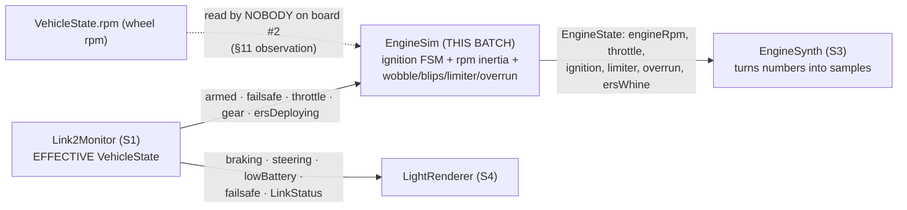

# S2 — EngineSim: The Virtual Engine

**Batch S2 of the source-code campaign** (see `../../source_code_explanation_plan.md`).
The car's real motor is a quiet brushless unit; the *drama* is synthesized. `EngineSim`
is the imagination layer: every control tick it takes the **effective** `VehicleState`
(S1's monitor output, post-staleness) and maintains a believable *engine* — with an
ignition sequence, rpm that has inertia, an idle that wobbles, gear-shift blips, a rev
limiter, and an overrun-crackle window. Its output (`EngineState`) is pure data that the
synthesizer (S3) turns into sound; it makes **no sound itself** and reads **no hardware**.

**The headline design fact:** engine rpm is **simulated from throttle, not copied from
the car's wheel rpm**. The wheel maxes out near ~5,000 rpm; a convincing engine note
needs 3,500–15,000. `EngineSim` maps commanded throttle 0–100% linearly across
idle→redline and never reads `VehicleState.rpm` at all (§3, §11 — grep-verified across
the whole repo: the received wheel-rpm field currently has *no consumer* on board #2).

## Scope (files explained here)

| File (`w17-soundlight-fw/`) | Lines | What it is |
|---|---|---|
| `lib/enginesim/include/enginesim/EngineSim.hpp` | 100 | `Ignition` enum, `EngineSimConfig`, `EngineState`, class decl |
| `lib/enginesim/src/EngineSim.cpp` | 138 | the whole engine model |
| `lib/enginesim/library.json` | 10 | metadata (depends on `link2` — real, exercised) |
| `test/test_enginesim/test_main.cpp` | 152 | 9 tests |

**Prerequisites:** S1 (`01_link2_receiver_and_protocol_compatibility.md`) — the effective
`VehicleState` and its per-field staleness projection are this module's *entire input*.
Chapter 07 §3 (the architecture-level description this batch now verifies). C6's ERS
(`../control_fw/06_feel_gearbox_and_ers.md`) — the 100 ms stall clamp reappears here, and
`ersDeploying`'s origin story lives there. No mocks are used: the module takes time as a
plain `nowMs` argument (S1's same clock seam), so tests just pass numbers.

**Test status: RUN AND PASSING (2026-07-05).**
`pio test -e native -f test_enginesim` → **9/9 PASSED** (1.7 s). Behaviours marked
**VERIFIED** are backed by that run + the source. As always: native tests prove logic on
this Mac; nothing here proves what the speaker will *sound* like (bench, open q #32).

---

## 0. Where this sits in the pipeline



Note the split: `EngineSim` feeds the **synth only**. The lights (S4) read the effective
`VehicleState` directly — they don't care about engine rpm. And of the thirteen
`VehicleState` fields, `EngineSim` reads exactly **five**: `armed`, `failsafe`,
`throttlePercent`, `gear`, `ersDeploying`. **VERIFIED** (every `state.` access in the
`.cpp`).

---

## 1. `EngineSim.hpp` — the interface

### Lines 9–14: the `Ignition` enum — three states of aliveness

```cpp
// Ignition / running state, driven by the `armed` flag from board #1.
//   Off      : disarmed -> silence.
//   Cranking : armed 0->1 -> a brief starter-whir + fire-up before idle.
//   Running  : normal idle..redline behavior.
// A failsafe (effective armed == false via the monitor) drops back to Off.
enum class Ignition : uint8_t { Off, Cranking, Running };
```

- The engine's life is a tiny state machine, and its **only driver is `armed`**. Not
  throttle, not the failsafe flag directly — `armed`. That's a beautiful consequence of
  S1's projection: when the link is lost, the monitor *forces* effective
  `armed = false`, so link loss and a deliberate disarm arrive at `EngineSim` as the
  same signal, and both produce the same correct result: engine Off. The comment names
  it: *"A failsafe (effective armed == false via the monitor) drops back to Off."*
  **VERIFIED** (the FSM in §2 keys on `state.armed` alone).
- `Cranking` exists purely for theater: real engines don't jump from silence to idle —
  a starter motor whirs at low rpm for a moment, then the engine "catches." 600 ms of
  1,800 rpm whir before idle sells the illusion. **VERIFIED** (constants below; the
  *audio* character of the whir is S3).

### Lines 16–54: `EngineSimConfig` — twelve knobs and a guard

Every number that shapes the engine's personality, with defaults. Group by group:

```cpp
uint16_t idleRpm = 3500;    // engine rpm at idle (not wheel rpm)
uint16_t maxRpm = 15000;    // redline
uint16_t crankRpm = 1800;   // starter cranking pitch, below idle
uint32_t crankMs = 600;     // cranking duration before Running
```

- **The rpm range is an audio-engineering choice**, not physics: chapter 07 §3 explains
  the 3,500–15,000 band was chosen so a V10's firing frequency lands where a tiny
  speaker can reproduce it (with 5 firings/rev, 3,500 rpm → ≈292 Hz fundamental;
  15,000 → 1,250 Hz — S3's math). `crankRpm = 1800` sits *below* idle: the starter
  whir is audibly lower-pitched than the engine catching. **VERIFIED** (values) /
  the acoustic reasoning is ch07 **[C]** + S3.

```cpp
// Asymmetric inertia, per-mille of the remaining gap closed per tick-ms:
uint16_t revUpPerMille = 6;   // ~0.5s idle->max at full throttle
uint16_t revDownPerMille = 3; // ~1.2s max->idle on lift
```

- **The single most important numbers in the file.** "Per-mille per ms" means: each
  update, rpm moves toward its target by `gap × rate × dtMs / 1000`. At the 20 ms tick
  the tests use, rev-up closes 6 × 20 / 1000 = **12 % of the remaining gap per tick**;
  rev-down closes **6 %**. Engines spin up harder than they wind down (the flywheel
  keeps them turning) — hence *asymmetric*. Full derivation of the "~0.5 s / ~1.2 s"
  comments in §2.4. **VERIFIED** (values + inertia math re-derived).

```cpp
uint16_t idleWobbleRpm = 120;   // idle wobble amplitude (rpm), triangle
uint16_t shiftBlipRpm = 1400;   // upshift dip / downshift blip magnitude
uint32_t blipMs = 130;          // blip duration
uint16_t limiterBandRpm = 250;  // within this of maxRpm at full throttle -> buzz flag
uint16_t overrunThrottleDrop = 40; // percentage-point drop in ONE tick
uint16_t overrunHighRpmPct = 60;   // only above this % of the idle..max span
uint32_t overrunMs = 900;          // crackle window length
```

- Five *character* features, each explained where its code lives (§2.5–§2.7). Note the
  comments are careful about **division of labor**: the limiter's actual on/off *buzz
  cadence* is the synth's job (S3) — `EngineSim` only raises the flag ("here we just
  detect it"). Same for overrun: the sim opens a *window*; the synth adds the gated
  noise bursts. **VERIFIED** (values; the synth halves are **PROVISIONAL until S3**).

```cpp
constexpr bool valid() const {
    return idleRpm > crankRpm && maxRpm > idleRpm &&
           revUpPerMille > 0 && revDownPerMille > 0 &&
           idleWobbleRpm < idleRpm && limiterBandRpm < (maxRpm - idleRpm) &&
           overrunHighRpmPct <= 100;
}
```

- The house `constexpr valid()` (C1 §4 pattern; S1 §4 had a one-condition version).
  Read each clause as a nonsense-rejector: crank pitch must sit below idle (the "catch"
  must rise); redline above idle (or the throttle map inverts); both inertia rates
  nonzero (a zero rate = an rpm that never moves); wobble smaller than idle (or idle
  could wobble through zero); the limiter band inside the idle→max span (or the limiter
  could trigger at idle); the overrun threshold a sane percentage. Default config passes
  — `test_config_valid` pins it plus one failure case. Where the `static_assert`
  actually fires is `main.cpp` (**PROVISIONAL until S5**, same as S1's config).
  **VERIFIED (ran)** for the function itself.

### Lines 56–64: `EngineState` — the output, pure data

```cpp
struct EngineState {
    uint16_t engineRpm = 0; // idle..max while Running, crankRpm while Cranking, 0 when Off
    uint8_t throttlePercent = 0; // pass-through of the commanded throttle (0..100)
    Ignition ignition = Ignition::Off;
    bool limiterActive = false; // pinned at redline under full throttle
    bool overrunActive = false; // in the post-lift crackle window
    bool ersWhine = false;      // ersDeploying pass-through (synth gates the whine)
};
```

- Everything S3's synth needs, nothing more: a pitch (`engineRpm`), a loudness/rasp hint
  (`throttlePercent`, re-ranged to 0..100 unsigned — negatives clamped, §2.3), a mode
  (`ignition` — the synth is silent when Off, whirs when Cranking), and three effect
  gates (limiter buzz, overrun crackles, ERS whine). Defaults are the safe boot state:
  Off, 0 rpm, all effects off. **VERIFIED** (struct) / *how* S3 uses each field is
  **PROVISIONAL until S3**.

### Lines 66–98: the class — same seams as S1

```cpp
// Virtual engine. Pure logic; time supplied by the caller. Feed it the
// EFFECTIVE VehicleState (post-staleness) each control tick.
class EngineSim {
public:
    explicit EngineSim(EngineSimConfig config = EngineSimConfig{});
    void update(uint32_t nowMs, const link2::VehicleState& state);
    const EngineState& engine() const { return out_; }
```

- The header comment is the S1→S2 contract in one line: **feed it the EFFECTIVE state**
  — i.e. `monitor.state()`, never a raw decoded frame. Everything below assumes the
  monitor already sanitized staleness (§4 walks the consequences). Time is a `nowMs`
  parameter again (no `IClock`) — the caller is the clock, tests pass integers.
  **VERIFIED** (signatures) / that `main.cpp` really wires
  `monitor.state()` → `sim.update()` with `millis()` is **PROVISIONAL until S5**.
- Private members (lines 76–97) — the engine's whole memory, worth naming now because
  §2 gives each its scene: `seeded_`/`lastMs_` (the dt bookkeeping), `ignition_` +
  `crankStartMs_` (the FSM), `rpm_` as **`int32_t`** (the internal high-resolution rpm —
  signed and wider than the `uint16_t` output so the inertia math can't wrap),
  `lastThrottle_`/`lastGear_`/`everSeenState_` (edge detection with a first-frame
  guard — S1's `everReceived_` idea again, one layer up), `blipUntilMs_`/`blipRpm_`
  (the active blip, signed), `overrunUntilMs_`, and `wobblePhase_`. **VERIFIED.**

---

## 2. `EngineSim.cpp` — the model, block by block

### Lines 5–8: two file-local constants

```cpp
constexpr uint32_t kInertiaScale = 1000; // rate is per-mille per ms
constexpr uint32_t kMaxDtMs = 100;       // stall clamp, same idea as ERS
```

- `kInertiaScale` is the "per-mille" denominator. `kMaxDtMs` caps a single tick's
  worth of time at 100 ms — **the stall clamp**, same rationale as C6's ERS: if the
  control loop hiccups for a second (debugger, a slow log line), the engine must not
  integrate one giant leap; it takes at most a 100 ms step and *loses* the rest of the
  elapsed time. Wobble and blip windows are wall-clock (`nowMs`-based) and unaffected;
  only the *inertia integration* is clamped. **VERIFIED** (source; C6 cross-ref).

### Lines 10–12: the constructor

```cpp
EngineSim::EngineSim(EngineSimConfig config) : config_(config) {
    rpm_ = config_.idleRpm;
}
```

- One deliberate oddity: the internal `rpm_` starts at **idle (3,500)** even though
  ignition starts Off. Why it doesn't matter audibly: the Off output path reports
  `engineRpm = 0` unconditionally (§2.8), so a fresh, disarmed sim is silent. Why it's
  still sensible: while Off, the target is 0, so `rpm_` quietly decays in the
  background; and the Cranking→Running transition *re-seeds* `rpm_ = idleRpm` anyway
  (§2.2), so the starting value is essentially free. **VERIFIED.**

### Lines 14–21: `targetRpm` — the throttle→rpm map

```cpp
uint16_t EngineSim::targetRpm(const link2::VehicleState& state) const {
    const int32_t span = config_.maxRpm - config_.idleRpm;
    const int32_t t = state.throttlePercent < 0 ? 0 : state.throttlePercent;
    return static_cast<uint16_t>(config_.idleRpm + span * t / 100);
}
```

Small function, three big decisions:

1. **Linear map, throttle 0..100 across idle..max.** `span = 15000 − 3500 = 11500`.
   Worked values: t=0 → 3,500 (idle); t=50 → 3500 + 11500·50/100 = **9,250**;
   t=100 → **15,000** (endpoint-exact — no truncation loss at the ends because
   11500·100/100 divides cleanly). **VERIFIED** (re-derived; the t=50 value is pinned
   by a test, §3.5).
2. **Negative throttle (braking) clamps to 0 → target = idle.** The wire allows
   −100..+100; braking is *not* engine load, so a braking engine falls to idle — which
   is also physically what a real engine does on brakes with the clutch in. **VERIFIED**
   (the ternary) — though no test drives a negative throttle (§5 coverage note).
3. **The comment restates C8's key semantic:** throttle here is *"already the
   post-gearbox/post-ERS commanded value from board #1, so the engine note tracks the
   actual motor, not the raw stick."* The whole chain: C5 stick → C6 gearbox/ERS →
   C10's one gating line → C8's `commandedThrottle` → the wire → S1's monitor → here.
   A disarmed car commands 0 → the engine note idles, no matter where the stick is.
   **VERIFIED** (comment + the C8/C10-verified sender side).

**And the deliberate absence:** no `state.rpm` anywhere. The engine does **not** follow
the wheel. The spec (`Link2Frame.hpp`: *"derive engine revs from throttlePercent or
scale this"*) offered both options; `EngineSim` chose throttle. Consequences: the engine
revs the instant throttle is commanded (no waiting for the wheel to spin up — good
theater), and a stationary car being revved… can't happen, because *commanded* throttle
is zero when disarmed and real when armed-and-driving. §11 files the repo-wide
observation. **VERIFIED** (grep: no consumer of `VehicleState.rpm` outside the codec).

### Lines 23–32: seeding and the time step

```cpp
if (!seeded_) { seeded_ = true; lastMs_ = nowMs; }
uint32_t dtMs = nowMs - lastMs_;
lastMs_ = nowMs;
if (dtMs > kMaxDtMs) { dtMs = kMaxDtMs; }
```

- **First-call seeding:** on the very first `update`, `lastMs_` is set to `nowMs`, so
  `dtMs = 0` — the first tick integrates nothing. Without this, a first call at
  `nowMs = 1,000,000` would compute a million-ms dt from the uninitialized-looking
  `lastMs_ = 0` (the same first-call-anchor idea as C2's ESC boot hold and C7's EMA
  seed). The stall clamp would catch it anyway (100 ms max), but seeding makes the
  first tick *exactly* neutral rather than accidentally-small. **VERIFIED.**
- `nowMs - lastMs_` is unsigned wraparound-safe arithmetic (S1 concept; C7). Then the
  100 ms clamp. **VERIFIED.**

### Lines 34–43: the ignition state machine (§2.2)

```cpp
if (!state.armed) {
    ignition_ = Ignition::Off;
} else if (ignition_ == Ignition::Off) {
    ignition_ = Ignition::Cranking;
    crankStartMs_ = nowMs;
} else if (ignition_ == Ignition::Cranking && (nowMs - crankStartMs_) >= config_.crankMs) {
    ignition_ = Ignition::Running;
    rpm_ = config_.idleRpm;
}
```

The complete transition table — read the `if/else` chain as priority order:

| From | Condition | To | Side effect |
|---|---|---|---|
| *any* | `!armed` | **Off** | none (highest priority — disarm/failsafe/stale always wins) |
| Off | `armed` | **Cranking** | `crankStartMs_ = nowMs` (the whir's clock starts) |
| Cranking | `armed` and ≥ 600 ms elapsed | **Running** | **`rpm_ = idleRpm`** — the "catch": rpm snaps to 3,500 |
| Cranking | `armed`, < 600 ms | stays Cranking | (falls through all branches) |
| Running | `armed` | stays Running | |

- **`!armed` is checked first and unconditionally** — from *any* state, including
  mid-crank. Disarm during the 600 ms whir kills it instantly. Re-arm afterwards starts
  a *fresh* crank (Off → Cranking resets `crankStartMs_`). **VERIFIED** (chain order).
- **The elapsed check is `>=` (inclusive)** — 600 ms exactly is enough, the same
  boundary convention as S1's staleness. And it's `nowMs - crankStartMs_`, wraparound-safe.
  **VERIFIED (ran)** — §3.2 pins still-Cranking at ~400 ms and Running after.
- **The catch: `rpm_ = idleRpm` on entering Running.** During Cranking, `rpm_` was
  drifting toward `crankRpm` (1,800); the engine "firing up" is modeled as an
  instantaneous jump to idle (3,500). Real engines do exactly this — the starter's slow
  churn suddenly becomes combustion. It also makes the post-crank behavior independent
  of what `rpm_` happened to be. **VERIFIED** (source; indirectly test-pinned by idle
  settling within 300 rpm shortly after, §3.2).

### Lines 45–56: gear-shift blip detection (§2.5)

```cpp
if (everSeenState_ && ignition_ == Ignition::Running && !state.failsafe) {
    if (state.gear > lastGear_) {
        blipRpm_ = -static_cast<int16_t>(config_.shiftBlipRpm); // upshift dip
        blipUntilMs_ = nowMs + config_.blipMs;
    } else if (state.gear < lastGear_) {
        blipRpm_ = static_cast<int16_t>(config_.shiftBlipRpm); // downshift blip
        blipUntilMs_ = nowMs + config_.blipMs;
    }
}
```

- **The physics being imitated:** on an upshift, a real engine's revs *drop* (same
  wheel speed, taller gear); on a downshift they *jump* (rev-matching). So upshift →
  `blipRpm_ = −1400` (a dip), downshift → `+1400` (a blip), each applied to the
  *audible* rpm for 130 ms (§2.8). It's an edge detector: compare this frame's `gear`
  against `lastGear_`. A second shift inside the 130 ms simply overwrites the blip (no
  stacking). **VERIFIED** (source; §3.5 pins the *absence* of a phantom blip; magnitude
  itself has no direct test — §5).
- **The three guards are the interesting part** (the comment: *"never on the first
  state seen or across a failsafe recovery: a gear delta then is not a real shift"*):
  1. `everSeenState_` — the very first state ever seen may say gear 4; comparing that
     against the initialized `lastGear_ = 1` would fire a phantom *upshift dip* at
     boot. First sight seeds, never edges — the same first-decode-seeding principle as
     C5's ChannelDecoder. **VERIFIED (ran)** (§3.5).
  2. `ignition_ == Running` — no blips while Off/Cranking (a starter doesn't
     rev-match). **VERIFIED** (source).
  3. `!state.failsafe` — while board #1 *reports* failsafe (frames flowing, flag set),
     gear deltas are not driver shifts. **VERIFIED** (source; no dedicated test — §5).
- **Why recovery can't blip — the subtle interplay with line 70:** `lastGear_` is
  updated *unconditionally every tick* (§2.3), even while the guard suppresses blips.
  So if gear changes during a failsafe (say board #1 rebooted and its gear reset to 1),
  `lastGear_` tracks it *silently*; when failsafe clears, gear == `lastGear_` and no
  edge fires. The guard gates the *detection*, never the *bookkeeping* — split those
  two and you get a phantom blip on the first clean frame. Also note S1's monitor
  **holds** gear during link-loss staleness for exactly this family of reasons (S1
  §7.4: "holding gear avoids phantom shift blips") — two layers, one intention.
  **VERIFIED** (source logic traced; the S1 half test-pinned in S1).

### Lines 58–67: overrun-crackle window detection (§2.6)

```cpp
if (everSeenState_ && ignition_ == Ignition::Running) {
    const int drop = static_cast<int>(lastThrottle_) - static_cast<int>(state.throttlePercent);
    const bool wasHigh = rpm_ >= config_.idleRpm +
                             (config_.maxRpm - config_.idleRpm) * config_.overrunHighRpmPct / 100;
    if (drop >= config_.overrunThrottleDrop && wasHigh) {
        overrunUntilMs_ = nowMs + config_.overrunMs;
    }
}
```

- **The physics being imitated:** lift off sharply from high revs and a race engine
  pops and crackles (unburnt fuel igniting in the hot exhaust — "overrun"). Two
  conditions, both must hold *in one tick*:
  1. **A fast throttle drop:** `drop ≥ 40` percentage points tick-to-tick. Note the
     `int` casts: `lastThrottle_` is unsigned, `state.throttlePercent` is signed and
     can be **negative** (braking). Both are widened to `int` first, so hard braking
     from full throttle computes `drop = 100 − (−100) = 200` — braking counts as
     (a very large) lift, which is right: brake-and-lift is exactly when crackle
     happens. **VERIFIED** (source; the negative case has no test — §5).
  2. **From high rpm:** `wasHigh` threshold = idle + span·60/100 = 3500 + 11500·0.6 =
     **10,400 rpm**, checked against `rpm_` *before* this tick's inertia update (the
     revs you were at when you lifted, not after). **VERIFIED** (re-derived).
- Result: `overrunUntilMs_ = nowMs + 900` — a 900 ms *eligibility window*. The sim
  doesn't crackle; the synth adds "gated noise bursts" while `overrunActive` (§2.8)
  reads true. A new qualifying lift re-arms the window. **VERIFIED (ran)** (§3.7).

### Lines 69–71: the bookkeeping trio

```cpp
lastThrottle_ = state.throttlePercent < 0 ? 0 : static_cast<uint8_t>(state.throttlePercent);
lastGear_ = state.gear;
everSeenState_ = true;
```

- `lastThrottle_` stores the **clamped** (≥0) throttle — it doubles as the output's
  `throttlePercent` pass-through, which is documented 0..100. (Note the asymmetry: the
  overrun `drop` above used the *raw* signed value from the current frame against the
  *clamped* previous — consistent, since braking should look like a big drop but never
  a negative baseline.) `lastGear_` unconditional (the recovery story above).
  `everSeenState_` latches forever, S1's `everReceived_` pattern. **VERIFIED.**

### Lines 73–92: rpm inertia (§2.4) — the heart

```cpp
int32_t target;
if (ignition_ == Ignition::Off)            target = 0;
else if (ignition_ == Ignition::Cranking)  target = config_.crankRpm;
else                                       target = targetRpm(state);

const int32_t gap = target - rpm_;
const uint16_t rate = (gap >= 0) ? config_.revUpPerMille : config_.revDownPerMille;
rpm_ += gap * static_cast<int32_t>(rate) * static_cast<int32_t>(dtMs) / kInertiaScale;
if ((gap >= 0 && rpm_ > target) || (gap < 0 && rpm_ < target)) rpm_ = target;
if (rpm_ < 0) rpm_ = 0;
```

Slowly, because this is the module's core math:

- **Target per ignition state:** Off → 0 (a dead engine winds down), Cranking → 1,800
  (the starter's constant churn), Running → the throttle map. **VERIFIED.**
- **Exponential approach ("chase the target"):** each tick, rpm moves by a *fraction of
  the remaining gap* — `gap × rate × dtMs / 1000`. Fractions of the gap, not fixed
  steps, so movement is fast when far away and gentle near the target — exactly how a
  first-order physical system (and a real engine) behaves. All integer math (house
  rule). **VERIFIED.**
- **The asymmetry:** `rate` is picked by the gap's *sign* — climbing (gap ≥ 0) uses
  6 ‰/ms, falling uses 3 ‰/ms. At 20 ms ticks: **12 % of the gap per tick up, 6 % down**.
- **Deriving the "~0.5 s idle→max" comment:** after n up-ticks the remaining gap is
  0.88ⁿ of the original 11,500. To get within ~500 rpm of redline: 0.88ⁿ ≤ 500/11500 ≈
  0.0435 → n ≈ 24.5 ticks ≈ **490 ms**. ✓ The "~1.2 s" down: 0.94ⁿ ≤ 0.0435 → n ≈ 50.6
  ticks ≈ 1.0 s (to within ~100 rpm, ~1.5 s) — "~1.2 s" is a fair middle reading. ✓
  **VERIFIED** (re-derived; §3.3–3.4 pin both directions).
- **The overshoot guard:** if a big `dtMs` (up to the 100 ms clamp) makes
  `rate × dtMs / 1000` exceed 1 (e.g. 6 ‰ × 100 ms = 0.6 — safe; but a config with
  `revUpPerMille = 15` at 100 ms would overshoot), rpm could cross the target and, with
  the sign-picked rate, oscillate or hold a residual. The guard snaps to the target on
  any crossing: settle, never ring. **VERIFIED** (source; not exercised by defaults —
  defensive).
- **The truncation residual (worth knowing, inaudible):** integer division truncates
  toward zero, so once `|gap| × rate × dtMs < 1000` the step becomes 0 and rpm parks
  short of the target: |gap| ≤ 8 climbing (8 × 6 × 20 = 960 < 1000) or ≤ 16 falling, at
  20 ms ticks. The engine idles at 3,492-ish, not 3,500.000 — nobody's ear can tell,
  and no test demands exactness (all use `WITHIN` tolerances). **VERIFIED** (re-derived).
- **The floor `rpm_ < 0 → 0`:** belt-and-braces; with the overshoot guard the Off
  target 0 can't be undershot anyway. **VERIFIED.**

### Lines 94–106: the Off short-circuit (§2.8a)

```cpp
// Engine Off = not spinning: report 0 immediately (the synth is silent
// when Off regardless, and this keeps engineRpm honest rather than
// trailing a slow inertial decay of a dead engine).
if (ignition_ == Ignition::Off) {
    out_.engineRpm = 0;
    out_.throttlePercent = lastThrottle_;
    out_.ignition = ignition_;
    out_.limiterActive = false;
    out_.overrunActive = false;
    out_.ersWhine = state.ersDeploying;
    return;
}
```

- **Reported rpm and internal rpm part ways here.** Internally `rpm_` still decays
  toward 0 with rev-down inertia (the code above ran); but the *output* says 0 the
  moment ignition is Off. The comment gives both reasons: the synth keys silence off
  `ignition == Off` anyway, and an honest 0 beats a phantom decaying number for any
  other consumer. So on disarm/failsafe/stale-link, **`engineRpm` snaps to 0
  instantly** — there is no audible "spin-down" from this module (if S3 fades rather
  than cuts, that's the synth's smoothing — **PROVISIONAL until S3**). **VERIFIED
  (ran)** (§3.1 asserts 0).
- Limiter and overrun are forced false when Off; `ersWhine` still passes through
  (`state.ersDeploying`) — a curiosity, since the monitor clears `ersDeploying` on
  staleness and C6's ERS needs armed+throttle to deploy, so a *true* value here while
  Off is near-impossible in practice; the pass-through is just unconditional
  bookkeeping. **VERIFIED** (source).

### Lines 108–135: composing the audible rpm (§2.8b)

```cpp
int32_t audible = rpm_;

if (ignition_ == Ignition::Running) {
    wobblePhase_ = static_cast<uint16_t>((wobblePhase_ + dtMs) % 400);
    const int32_t tri = (wobblePhase_ < 200) ? (wobblePhase_ - 100) : (300 - wobblePhase_);
    const int32_t idleness = 100 - (state.throttlePercent < 0 ? 0 : state.throttlePercent);
    audible += tri * config_.idleWobbleRpm * idleness / (100 * 100);
}
```

- **Idle wobble — why:** a dead-flat idle sounds like a test tone; real engines hunt a
  little. A small periodic wobble sells "machine," not "oscillator."
- **The triangle wave, by hand:** `wobblePhase_` accumulates elapsed ms modulo 400 — a
  **400 ms period (2.5 Hz)** wobble. The two-piece formula maps phase → value:
  phase 0 → −100, 100 → 0, 199 → +99, 200 → +100, 300 → 0, 399 → −99. So `tri` sweeps
  a triangle in ≈[−100, +100] — think of it as "percent of full wobble."
- **Scaling:** `tri × 120 × idleness / 10 000`. At idle (throttle 0, idleness 100):
  amplitude = 100 × 120 × 100 / 10 000 = **±120 rpm** — exactly `idleWobbleRpm`. At
  half throttle: ±60. At full: **0** — the wobble fades linearly as the throttle opens
  (a loaded engine doesn't hunt). Worked mid-value: phase 150 → tri = 50; at idle:
  50 × 120 × 100 / 10 000 = **+60 rpm**. **VERIFIED** (re-derived; no dedicated test —
  it's absorbed inside the ±300 idle tolerance, §5).

```cpp
out_.limiterActive = false;
if (nowMs < blipUntilMs_) audible += blipRpm_;
if (ignition_ == Ignition::Running && state.throttlePercent >= 95 &&
    rpm_ >= config_.maxRpm - config_.limiterBandRpm) {
    out_.limiterActive = true;
}
```

- **Blip application:** while `nowMs < blipUntilMs_`, the signed offset rides on top —
  an upshift *sounds like* a 1,400 rpm dip for 130 ms even though the underlying `rpm_`
  never moved (the blip is perceptual, layered like the wobble). **VERIFIED** (source).
- **Rev limiter:** `throttlePercent ≥ 95` (near-full stick) **and** base
  `rpm_ ≥ 15 000 − 250 = 14 750`. Note it checks `rpm_`, not `audible` — wobble/blip
  can't fake a limiter. The flag is the F1 "buzz" *detector*; the buzz itself (ignition
  cut bursts) is S3. **VERIFIED (ran)** (§3.6).

```cpp
if (audible < 0) audible = 0;
out_.engineRpm = static_cast<uint16_t>(audible);
out_.throttlePercent = lastThrottle_;
out_.ignition = ignition_;
out_.overrunActive = nowMs < overrunUntilMs_ && ignition_ == Ignition::Running;
out_.ersWhine = state.ersDeploying;
```

- Floor (a −1400 blip at crank rpm could theoretically dip below zero), narrow to
  `uint16_t`, and publish. `overrunActive` = inside the 900 ms window **and** still
  Running (a failsafe mid-window kills the crackle with everything else — but via the
  Off short-circuit path anyway). `ersWhine` is a straight relay of `ersDeploying`;
  the *whine sound* (pitch-tracking) is S3's. **VERIFIED (ran)** (§3.7, §3.8).

---

## 3. The test suite — nine tests, assertion by assertion

`test/test_enginesim/test_main.cpp`, 152 lines. Helpers first (lines 10–31):
`armedAt(throttle, gear = 1)` builds an armed, non-failsafe state with the given
throttle/gear; `run(e, state, count, dtMs, startMs)` advances the sim `count` ticks of
`dtMs`, returning the final time. Every test below uses **20 ms ticks** — the natural
"per control tick" cadence (50 Hz), which is also why my §2 arithmetic used it.

### 3.1 `test_off_when_disarmed`

Default `VehicleState` (armed = false — note this is *also* S1's NeverConnected boot
state, so this test doubles as "the engine is silent before the first frame"):
- After one update: `ignition == Off`. After 100 further ticks (2 s):
  still Off and `engineRpm == 0`.
- The comment "rpm decays toward 0" refers to the *internal* `rpm_` (seeded at 3,500,
  decaying toward target 0); the *output* was 0 from the very first Off tick thanks to
  the short-circuit — the test can't tell those apart, but the source can (§2.8a).
  **VERIFIED (ran).**

### 3.2 `test_cranking_then_running_on_arm`

- `armedAt(0)` at t = 20 → **Cranking** (the Off→Cranking edge fires on the first armed
  update; `crankStartMs_ = 20`).
- 20 ticks later (t = 420; elapsed 400 < 600) → **still Cranking**.
- 40 more ticks (t up to 1,220): the tick at t = 620 has elapsed exactly 600 → the
  inclusive `>=` fires → **Running**, `rpm_` snapped to 3,500. By t = 1,220 (600 ms at
  idle target) the assertion `UINT16_WITHIN(300, 3500, engineRpm)` holds — the 300
  tolerance absorbs the ±120 wobble plus the ≤8 truncation residual. **VERIFIED (ran).**

### 3.3 `test_revs_up_toward_throttle_target`

Reach Running at idle (60 ticks), then 60 ticks (1.2 s) at `armedAt(100)`:
- Per-tick gap factor 0.88; after 60 ticks 0.88⁶⁰ ≈ 0.0005 — the 11,500 gap is
  essentially gone; engineRpm ≈ 15,000 (wobble = 0 at full throttle). Assert
  `> 13000` — comfortably true. **VERIFIED (ran).**

### 3.4 `test_rev_down_is_slower_than_rev_up` — the asymmetry, measured

- From idle, **10 ticks (200 ms) at full throttle**: remaining gap ≈ 0.88¹⁰ ≈ 0.2785 of
  11,500 ≈ 3,200 → `afterRevUp` ≈ 11,800; `gained ≈ 8,300`.
- Then **10 ticks (200 ms) at throttle 0** from that point: gap ≈ −8,300 toward idle;
  remaining ≈ 0.94¹⁰ ≈ 0.5386 → shed ≈ 8,300 × 0.46 ≈ **3,800**.
- Assert `gained > shed`: 8,300 > 3,800. Same duration, same starting gap magnitude —
  the up-rate demonstrably outpaces the down-rate. This is *the* test that pins
  "asymmetric," without depending on exact constants. **VERIFIED (ran; numbers
  re-derived, ±wobble noise absorbed by the wide margin).**

### 3.5 `test_no_phantom_blip_on_first_state_or_failsafe_recovery`

- The **first state the sim ever sees** is gear 4, throttle 50 (`armedAt(50, 4)`). If
  the `everSeenState_` guard were missing, gear 4 vs the initialized `lastGear_ = 1`
  would read as an upshift → a −1,400 dip at boot.
- After 60 ticks: assert `engineRpm` within 600 of the throttle-50 target
  **9,250** (= 3500 + 11500·50/100 — the test hardcodes the same formula). A phantom
  blip inside the window would have shown as a spike; by 1.2 s any 130 ms blip is long
  gone, so what this really pins is the *settled* target math plus "nothing weird
  happened" (tolerance 600 covers ±60 wobble at half throttle + settle).
- **Honest scope note:** despite the name, the test covers only the *first-state* half.
  The `!state.failsafe` recovery guard has **no dedicated test** — it's VERIFIED
  (source) but not (ran). §5 lists it. **VERIFIED (ran)** for what it asserts.

### 3.6 `test_limiter_flag_at_redline_full_throttle`

200 ticks (4 s) at full throttle from cold: arm → crank (600 ms) → Running → pull to
redline. Assert `limiterActive == true` (throttle 100 ≥ 95, `rpm_` ≥ 14,750 ✓) and
`engineRpm` within 300 of 15,000 (wobble = 0 at full throttle; truncation residual ≤ 8).
**VERIFIED (ran).**

### 3.7 `test_overrun_window_on_fast_lift_from_high_rpm`

- 120 ticks full throttle → redline; assert `overrunActive == false` (never a drop).
- One update at `armedAt(0)`: `drop = 100 − 0 = 100 ≥ 40`, `wasHigh`: rpm_ ≈ 15,000 ≥
  10,400 ✓ → window opens; assert **true**.
- 60 more ticks (1.2 s > 900 ms): assert **false** — the window closed on schedule.
  Boundary style note: this checks "closed by 1.2 s," not the exact 900th millisecond
  (unlike S1's surgical 499/500 test) — adequate for a cosmetic window. **VERIFIED (ran).**

### 3.8 `test_ers_whine_passthrough`

`armedAt(80)` with `ersDeploying = true`, 60 ticks → `ersWhine == true`. One-line relay,
one-line test. **VERIFIED (ran).**

### 3.9 `test_config_valid`

Default config valid; `maxRpm = 1000` (below idle) invalid. One guard clause exercised
of the seven — the others are source-verified only (§5). **VERIFIED (ran).**

---

## 4. How S1's projection shapes the engine — the scenarios that matter

This is the S1→S2 seam, walked end to end. Remember: `EngineSim` is *documented* to
receive `monitor.state()` — the **effective** state (the wiring itself is S5).

| Scenario | Effective state (S1) | Engine result (S2) |
|---|---|---|
| **Boot, no frame ever** (NeverConnected) | defaults: armed=false, throttle 0, failsafe=true | Off from tick one; `engineRpm = 0`; **silent before the first valid frame** — the safe default propagates |
| **Driving normally** (Up) | frame passes through verbatim | Running; rpm chases the commanded-throttle target; blips on real shifts; all effects live |
| **Wire cut mid-drive** (Lost) | monitor zeroes commands, **armed→false**, failsafe→true, ersDeploying→false; **gear held** | `!armed` → **Off next tick**: engineRpm snaps to 0 — *link loss sounds like the engine dying* (ch07's phrase, now source-verified); no phantom blip (gear held + failsafe guard + Running guard, three layers); whine off |
| **Board #1 in RC failsafe** (frames still flowing, flag set, armed=false *in the frame*) | armed=false, failsafe=true, throttle 0 | Off — indistinguishable from disarm, which is correct: the car's motor is also commanded 0 |
| **Recovery** (one good frame) | monitor returns Up + fresh frame | armed → Off→**Cranking**: recovery restarts the 600 ms starter sequence — the engine audibly "restarts," a genuinely nice touch (an accidental-but-apt consequence of the FSM having no memory of past Running) |
| **Driver disarms at rest** | armed=false in-frame | Off, silence — same path as failsafe, by design |

Note the last row of the recovery story: because Off→Cranking has no "was I running
recently?" shortcut, *every* return from Off — first arm of the day, post-failsafe,
post-disarm — replays the starter whir. **VERIFIED** (FSM structure; the failsafe rows
additionally rest on S1's test-pinned projection).

---

## 5. What the tests do NOT cover (honest accounting)

All are **VERIFIED (source)** but have no dedicated assertion:

- The `!state.failsafe` blip guard (§3.5's name promises it; its body doesn't).
- The idle wobble (shape, period, fade-with-throttle) — only absorbed in tolerances.
- Negative-throttle paths: `targetRpm` clamping (braking → idle target) and the overrun
  `drop` arithmetic with a negative current throttle.
- Blip magnitude (±1,400) and duration (130 ms) — `EngineState` exposes no blip field,
  so a test would have to catch the transient through `engineRpm`; none does.
- The overshoot guard and the `rpm_ < 0` floor (unreachable with default config).
- The Cranking rpm value itself (target 1,800) — no test samples `engineRpm` mid-crank.
- Six of the seven `valid()` clauses.

None of these is risky enough to demand a new test (and the sources are read-only);
they're listed so nobody mistakes "9/9 green" for "everything asserted."

---

## 6. VERIFIED / INFERRED / PROVISIONAL summary

**VERIFIED** (source + the 2026-07-05 run, 9/9):

- Ignition FSM: `!armed` → Off from any state, first priority; Off→Cranking on arm
  (clock anchored); Cranking→Running at inclusive ≥600 ms with `rpm_` snapped to idle;
  every return from Off replays the crank.
- Throttle→rpm map: linear, idle+span·t/100, endpoint-exact (3,500 / 9,250 / 15,000),
  negatives clamped to idle; **wheel rpm is never read** (grep-verified repo-wide: no
  consumer of `VehicleState.rpm` outside the codec/monitor).
- Asymmetric inertia: 12 %-of-gap per 20 ms tick up, 6 % down (≈0.5 s / ≈1.0–1.2 s for
  the full sweep — comment figures check out); overshoot guard; 100 ms stall clamp;
  first-call dt = 0; ≤8/≤16 rpm truncation residual.
- Character layer: 400 ms (±120 → 0 with throttle) idle wobble; ±1,400 × 130 ms shift
  blips with triple guard (first-state / Running / not-failsafe) and unconditional
  `lastGear_` tracking; limiter flag at throttle ≥95 ∧ rpm_ ≥ 14,750 (base rpm, not
  audible); overrun window 900 ms on ≥40-point drop from ≥10,400 rpm.
- Off short-circuit: output rpm 0 immediately (internal decay hidden); limiter/overrun
  forced false; `ersWhine` relayed always.
- Config `valid()` accepts defaults, rejects inverted rpm ordering.

**INFERRED:**

- The design rationales as narrated (why crank theater, why snap-at-catch, why wobble
  fades, why braking counts toward overrun) — consistent with comments, stated beyond them.
- That the wobble/blip being *perceptual* layers (audible only) rather than physical
  (`rpm_`) is deliberate — strongly implied by the limiter reading `rpm_`.

**PROVISIONAL** (owner batch / bench named):

- That `main.cpp` feeds `monitor.state()` into `update()` with `millis()`, per tick, on
  core 1; the config `static_assert` site — **S5**.
- Every "the synth then…" claim: silence when Off, whir character when Cranking, buzz
  cadence from `limiterActive`, crackle bursts from `overrunActive`, pitch-tracked whine
  from `ersWhine`, how `engineRpm`/`throttlePercent` map to pitch/timbre — **S3**.
- Which fields survive into the packed cross-core atomic word (open q **#43**) — **S5**.
- Whether any of it *sounds* right on the MAX98357A + 4 Ω speaker — **bench** (open q
  #32; the PCM fallback seam exists for a reason).

---

## 7. Structured close-out

### 7.1 What S2 proves

1. The engine is a **pure function of the effective state + time** — five input fields,
   no hardware, no hidden clock — and is therefore fully native-testable, and fully
   *predictable* from S1's projection table.
2. Safety inheritance works: disarm, board-#1 failsafe, link loss, and pre-first-frame
   boot all collapse (via S1) into `armed == false`, and `armed == false` provably means
   **Off + engineRpm 0, immediately** — the speaker's second failsafe layer (after S1's
   staleness, before S5's dead-man) is real.
3. The rpm model is the documented one: linear throttle map (endpoint-exact),
   asymmetric exponential inertia matching the "~0.5 s up / slower down" promise, with
   settle guards.
4. The character features (wobble, blips, limiter, overrun) exist, are guarded against
   phantom triggers (first-state seeding; failsafe-aware blip suppression backed by
   unconditional gear bookkeeping), and expose exactly the flags ch07 §3 promised.
5. Engine rpm is **independent of wheel rpm** — by design and by grep.

### 7.2 What S2 does NOT prove

- Anything audible. `EngineState` is numbers; every sonic claim ("sounds like dying,"
  "V10 flavor," "starter whir") is S3's synthesis + the bench speaker.
- The wiring: that the monitor's output actually reaches `update()` at a sane cadence
  (S5), or which of these fields cross to the audio core (S5, #43).
- The untested-but-source-verified list in §5 (failsafe blip guard, wobble shape,
  negative-throttle paths, blip magnitude, guard clauses).
- Real-time behavior on the ESP32 (integer math is fast, but "fast enough alongside LED
  writes on core 1" is an S5/bench fact).

### 7.3 What waits for later soundlight batches

- **S3 (EngineSynth):** every consumer-side semantic of `EngineState` — the firing
  frequency math (engine rpm → Hz), limiter buzz cadence, overrun burst gating, whine
  pitch-tracking, parameter smoothing (does S3 smooth the snap-to-zero into a fade?).
- **S4 (LightRenderer):** confirms the lights read `VehicleState`, not `EngineState`
  (the §0 pipeline split), and whether anything lights-side consumes wheel rpm.
- **S5 (main + integration):** the wiring, the tick cadence, the atomic word (#43), the
  integration test (frames → audio) that finally exercises S1+S2+S3 as one chain, and
  the last word on the §11 wheel-rpm observation.

### 7.4 What waits for real ESP32 / audio hardware

- Synth voicing on the physical speaker (open q **#32**) — the constants here
  (3,500–15,000, wobble 120, blip 1,400) are *tuned for* a small speaker but only a
  bench session can validate them; the config struct exists so they can be re-voiced.
- I2S/MAX98357A behavior (S5's HAL + the PinMap strap notes from S1).
- Whether 600 ms of crank and 130 ms of blip *feel* right at the trackside.

### 7.5 Understanding questions

1. The car brakes hard from full throttle. Walk `targetRpm` and the overrun detector
   for that tick (throttle +100 → −100): what target does the engine chase, and does
   the crackle window open? Show both computations.
2. Why does `EngineSim` read `state.throttlePercent` but never `state.rpm`? Give the
   audio-band reason *and* name the spec sentence that authorizes the choice.
3. The link is cut mid-drive at 12,000 rpm. Trace the next `update()`: which S1
   projection field flips the FSM, what does `engineRpm` report that tick, and what
   happens to the internal `rpm_`?
4. After that failsafe, one good frame arrives with gear 3 (same as before the cut).
   Why is there no shift blip — name all three mechanisms that each independently
   prevent it (one in S1, two in S2).
5. Compute the engine rpm after exactly two 20 ms ticks of full throttle from a settled
   idle (ignore wobble): gap₀ = 11,500; apply 12 % twice, with integer truncation.
6. Why does the Cranking→Running transition *assign* `rpm_ = idleRpm` instead of
   letting inertia carry rpm from 1,800 to 3,500? What would it sound like otherwise?
7. The limiter checks `rpm_`, not the audible rpm. Construct the false-positive that
   this prevents (hint: a downshift blip near redline).
8. `lastGear_` updates every tick, but blip detection is gated. Explain why gating the
   *update* instead would create a phantom blip after failsafe — use the "board #1
   rebooted, gear reset to 1" scenario.
9. What is the steady-state error of the inertia loop at 20 ms ticks, and why doesn't
   any test notice it?
10. Name the three failsafe layers that protect the speaker (one per batch: S1, S2, and
    the S5 dead-man), and what each one specifically detects that the others can't.

### 7.6 Concepts that deserve extra teaching later

- **Exponential approach / first-order response** (`x += gap·k`) — the single most
  reusable trick in embedded UX: smoothing, ramps, filters (C7's EMA is its cousin —
  worth teaching side by side).
- **Integer fixed-point rates** ("per-mille per ms") and their truncation floors — when
  a residual matters and when it doesn't.
- **Perceptual vs physical state** — wobble and blips layered on the *audible* value
  while `rpm_` stays clean, and the limiter deliberately reading the clean one.
- **Edge detection with seeding guards** — third appearance (C5 decoder, S1 monitor,
  S2 gear blips); it's a house pattern now and deserves a unified writeup.
- **Theater state machines** — Cranking exists for *feel*, not correctness; how
  embedded systems encode showmanship without endangering safety (the `!armed` override
  is checked first for a reason).
- **The stall clamp** (`dt = min(dt, 100 ms)`) — second appearance (C6 ERS), same
  question each time: "what should time-integration do when time misbehaves?"

---

## 8. Cross-references and updates made

- **Chapter 07 §3** — every constant and behavior it described is confirmed exact
  (idle 3,500 / redline 15,000 / crank 600 ms @ 1,800 / ±120 wobble / 1,400 × 130 ms
  blips / limiter 250-band / 900 ms overrun; "~0.5 s / ~1.2 s" verified as honest
  approximations of the 6 ‰ / 3 ‰ rates). S2-verified note added there.
- **Wheel-rpm observation** filed as open-questions note **#51**: `VehicleState.rpm`
  currently has *no consumer* on board #2 (grep-verified); the monitor's "a stale rpm
  would drive the engine sound" comment is defensive/forward-looking rather than
  descriptive today. Final confirmation lands naturally in S3–S5's walkthroughs.
- **S1 back-links:** the effective-state contract (§4), the held-gear ↔ blip-guard
  interplay, the `nowMs` clock seam, `everSeenState_` as `everReceived_`'s sibling.
- **C6/C8/C10 back-links:** commanded-not-stick throttle (the §2.1 comment's chain),
  the ERS `ersDeploying` origin, the stall clamp.
- No source code was modified. New glossary terms: ignition state machine, asymmetric
  inertia, overrun, idle wobble (see `glossary.md`).

---

*Batch S2 complete. `source_code_progress.md`, `glossary.md`, `open_questions.md`, and
chapter 07 updated. Awaiting approval before S3 ("The synthesizer (DSP)" —
`lib/soundsynth`, the project's hardest math; budget a full session).*
