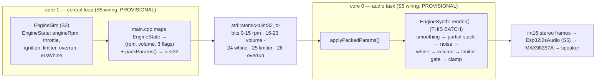

# S3 — EngineSynth: The Sound Synthesizer (DSP)

**Batch S3 of the source-code campaign** (see `../../source_code_explanation_plan.md`) —
the batch the plan rates **★★★★★, "the hardest math in the project."** `EngineSynth` is
where numbers finally become sound: 22,050 times per second it computes one signed 16-bit
sample of a V10-flavored engine note — a stack of sine-wave harmonics at the engine's
*firing frequency*, plus rpm-scaled noise, an ERS whine, a rev-limiter "ignition cut"
gate, and overrun crackle bursts — all in pure integer arithmetic, deterministic, with no
hardware in sight.

**The headline boundary fact:** the synth does **not** consume S2's `EngineState` struct.
Its entire input is **five values** — `engineRpm`, a `volume` byte, and three flags
(`ersWhine`, `limiter`, `overrun`) — designed to be packed into **one 32-bit word** that
crosses the CPU cores through a single `std::atomic<uint32_t>`. The bit layout of that
word is documented right in `EngineSynth.hpp` — **this answers open question #43** (the
layout; *who packs it and where volume comes from* is S5). Notably absent from the word:
`throttlePercent` and the `Ignition` state. Silence-when-Off is therefore **not the
synth's job** — it must arrive as `volume = 0` from the control core (**PROVISIONAL until
S5**).

**Three real findings** (detailed in §7): the repo's own `CLAUDE.md` description of this
module lags the code (no per-revolution AM exists; the noise is rpm-correlated, not
throttle-correlated); the parameter smoother's comment doesn't match its code (`>> 6`,
not "~1/1024"); and the smoother's integer truncation makes **full volume actually play
at ~75 %** and makes volume targets below 64 (approached from silence) **completely
inaudible** — verified by direct computation, logged as new open question #53.

## Scope (files explained here)

| File (`w17-soundlight-fw/`) | Lines | What it is |
|---|---|---|
| `lib/soundsynth/include/soundsynth/ISampleSource.hpp` | 24 | the audio-render seam (interface) |
| `lib/soundsynth/include/soundsynth/EngineSynth.hpp` | 118 | packed-param word, config, class declaration |
| `lib/soundsynth/src/EngineSynth.cpp` | 152 | sine table, phase math, the render loop |
| `lib/soundsynth/library.json` | 7 | metadata (header-only shape: **no dependencies key**) |
| `test/test_soundsynth/test_main.cpp` | 186 | 9 tests |

**Prerequisites:** S2 (`02_engine_simulation.md`) — `EngineState` is where the five input
values *conceptually* come from. Chapter 07 §4 and §6 (the architecture claims this batch
now checks — two of them needed correction). C3 §4 (bit shifts) helps but everything is
re-explained here. No mocks, no clock: the synth's only "time" is the sample index itself.

**Test status: RUN AND PASSING (2026-07-05).**
`pio test -e native -f test_soundsynth` → **9/9 PASSED** (1.08 s). Additionally, because
several behaviors here hinge on subtle integer truncation that the tests do *not* pin, I
compiled the repo's `EngineSynth.cpp` (read-only) into a **verification harness** in the
session scratchpad and measured: the sine table's real values and worst-case error, the
smoother's exact parking points, the true output peak at maximum settings, the
steady-state pitch, and the limiter's gating fraction. Claims backed by that run are
labeled **VERIFIED (source + harness)**. As always: native tests + harness prove *logic
on this Mac*; nothing here proves what the MAX98357A and the 3 W speaker will make of it
(bench, open q #32).

---

## 0. Where this sits — and the boundary that surprised me



Read the diagram's labels carefully, because they state this batch's most important
scoping result:

- **VERIFIED (this batch):** everything inside `render()` — the DSP itself — plus the
  `packParams`/`applyPackedParams` pair and their bit layout.
- **PROVISIONAL (S5):** everything either side of it. That `main.cpp` actually calls
  `packParams` with EngineSim's outputs, *what volume value it chooses* (there is no
  `volume` field in `EngineState` — it has to be derived, presumably from `ignition`),
  that the word really crosses cores in an atomic, the ~500 ms audio dead-man, and the
  I2S delivery. The header *says* the word is "written by the control core and read by
  the audio core through a single `std::atomic<uint32_t>`" — a design statement this
  library is built for, but the wiring lives in `src/main.cpp`.

And the input mapping, field by field (S2's `EngineState`, `EngineSim.hpp:57–64`, vs the
synth's five parameters):

| `EngineState` field (S2) | Reaches the synth? | As what |
|---|---|---|
| `engineRpm` | **yes** | packed bits 0–15 → pitch + noise loudness |
| `limiterActive` | **yes** | bit 25 → the 18 Hz ignition-cut gate |
| `overrunActive` | **yes** | bit 26 → crackle bursts |
| `ersWhine` | **yes** | bit 24 → the whine layer |
| `throttlePercent` | **no** | not in the word; the "throttle-correlated" noise is actually scaled by **rpm** (§4.7e) |
| `ignition` | **no** | not in the word; Off→silence must become `volume = 0` upstream (**PROVISIONAL S5**) |
| *(nothing)* | `volume`, bits 16–23 | **origin unknown until S5** — the one input with no `EngineState` source |

**VERIFIED** for the word's contents (`packParams`, `EngineSynth.hpp:21–27`); the mapping
column for `main.cpp` is S5.

---

## 1. A ten-minute digital-audio primer

Every idea below reappears in the code within a page, so meet them in plain words first.

**Sound, digitally.** A speaker cone moves in and out; sound is that motion over time.
Digital audio describes the motion as a list of numbers — **samples** — each one "where
the cone should be right now," taken at a fixed rate. Here a sample is an `int16_t`:
−32,768 … +32,767, where 0 is the resting cone and ±32,767 is full deflection
(**full scale**).

**Sample rate.** This project uses **22,050 samples per second** (`kSampleRateHz`). One
sample therefore represents 1/22,050 s ≈ **45.4 µs** of sound. 22,050 Hz is exactly half
of CD-quality 44,100 Hz — a common embedded choice: half the CPU work and half the data,
while still representing everything up to…

**The Nyquist limit.** A sampled signal can only faithfully contain frequencies below
*half* the sample rate — here **11,025 Hz**. Try to synthesize anything above that and it
doesn't disappear; it "folds back" as a *wrong, lower* frequency — an artifact called
**aliasing**. §4.7d checks that this synth's harmonics stay safely under the limit.

**Frequency vs pitch.** A tone that repeats f times per second has frequency f **Hz**.
Doubling f raises the pitch one octave. The engine note's frequency comes from rpm:
an engine firing 5 times per revolution at R rpm fires R/60 × 5 times per second —
the **firing frequency**, this synth's fundamental.

**Frames and stereo interleaving.** One **frame** = one sample *per channel*. Stereo
audio is stored **interleaved**: L, R, L, R, … So a buffer of N frames holds 2N
`int16_t`s, with frame f's samples at index `2f` (left) and `2f+1` (right). This board's
engine sound is mono, duplicated onto both channels (§2, and recall S1's PinMap note:
the MAX98357A's SD_MODE strap picks a channel mix, and duplicated stereo makes every
strap choice sound identical).

**Timbre, harmonics, partials.** A pure sine wave at f Hz sounds like a sterile test
tone. Real instruments (and engines) also emit energy at integer multiples of f — the
**harmonics** (2f, 3f, …). Each sine component in a synthesized stack is called a
**partial**. The *relative loudness* of the partials is the sound's **timbre** — its
character. Building a sound by summing sine partials is **additive synthesis** — exactly
what this file does.

**Clipping and saturation.** If the math produces a value outside int16's range, two
things can happen: the value **wraps** (integer overflow — a loud, horrible glitch, and
for *signed* overflow in C++, undefined behavior) or it is **clamped** to the rail
(**saturation** — a controlled "hard clip" that merely distorts). This synth budgets its
amplitudes so the sum *can't* exceed the rails (headroom, §3.4) and clamps anyway as a
last line of defense (§4.7i).

**Determinism.** "Random" noise from a *seeded* pseudo-random generator produces the
exact same sequence every run. That's a feature: a test can render the same block twice
and demand bit-identical output (§5.8).

---

## 2. `ISampleSource.hpp` — 24 lines: the render seam

```cpp
#pragma once

#include <cstddef>
#include <cstdint>

namespace soundsynth {
```

- `#pragma once` — include-guard idiom (C1 §1). `<cstddef>` provides `size_t` (the
  unsigned "count of things" type used for `frameCount`); `<cstdint>` provides the
  fixed-width `int16_t`. Everything lives in namespace `soundsynth`, the house
  one-namespace-per-lib pattern.

```cpp
// The audio-render seam. EngineSynth is the procedural implementation; a PCM
// sample player can drop in behind this exact interface later if the synth
// disappoints on the real speaker (the user's "hybrid: synth now, samples
// later" choice). render() runs on the core-0 audio task and must be
// allocation- and lock-free.
class ISampleSource {
public:
    virtual ~ISampleSource() = default;
    virtual size_t render(int16_t* out, size_t frameCount) = 0;
};
```

- **This is the same seam pattern as C1's `hal::I*` interfaces** — an abstract class
  with one pure-virtual method — but placed for a different reason. The HAL seams
  separate *logic from hardware*; this seam separates *one sound-generation strategy
  from another*. The comment names the plan: if procedural synthesis sounds bad on the
  real speaker (open q #32), a **PCM sample player** (playing back pre-recorded engine
  audio) can replace `EngineSynth` without touching anything above the seam. That's the
  "PCM fallback seam" the soundlight `SIMULATION.md` checklist mentions. **VERIFIED**
  (source + brief).
- `virtual ~ISampleSource() = default;` — a **virtual destructor**. If code ever deletes
  an implementation through an `ISampleSource*` pointer, the destructor call must
  "virtually dispatch" to the real object's destructor; without `virtual` here that
  delete would be undefined behavior. `= default` says "compiler-generated body is
  fine." Every house interface has this line (C1 §3).
- **The `render` contract**, from the comment (`ISampleSource.hpp:17–21`): fill `out`
  with `frameCount` **interleaved stereo** int16 frames — "2 samples each: L then R" —
  return frames written (`== frameCount`). Mono engine, both channels carry the same
  value. So the caller allocates `2 × frameCount` int16s. **VERIFIED** (comment +
  `EngineSynth::render`'s implementation, §4.7j).
- **"Allocation- and lock-free"** is a *real-time audio* requirement worth a beginner
  pause: the audio task must hand the I2S driver a finished buffer every ~11.6 ms
  (256 frames at 22,050 Hz — ch07 §6's "~11 ms"). A heap allocation or a mutex inside
  `render()` could block for an unbounded time (the allocator/lock holder might be busy
  on the other core), the buffer would miss its deadline, and the speaker would pop or
  stutter. `EngineSynth::render` obeys: it touches only member variables and the stack —
  no `new`, no locks, not even a function that *might* allocate. **VERIFIED** (source
  inspection of §4.7); that the audio task actually runs it under such a deadline is S5.

---

## 3. `EngineSynth.hpp` — the contract: constants, the packed word, the config

### 3.1 Lines 9–10: two compile-time constants

```cpp
inline constexpr uint32_t kSampleRateHz = 22050;
inline constexpr int kMaxPartials = 8;
```

- `inline constexpr` — the house header-constant idiom (C1 §1). 22,050 Hz is the
  system-wide sample rate; §1 explains the choice. `kMaxPartials = 8` sizes the partial
  arrays: the synth *can* run up to 8 harmonics; the default config uses 6 (§3.3).
  **VERIFIED.**

### 3.2 Lines 12–27: `packParams` — open question #43, answered

```cpp
// Packed synth parameters, written by the control core and read by the audio
// core through a single std::atomic<uint32_t> (see EngineSynth::packParams /
// applyPackedParams). One 32-bit word => torn-free lock-free hand-off.
//   bits  0..15  engineRpm      (0..65535)
//   bits 16..23  volume         (0..255, 0 = silent)
//   bit     24   ersWhine
//   bit     25   limiterActive  (redline ignition-cut buzz)
//   bit     26   overrunActive  (lift-off crackle window)
//   bits 27..31  reserved
inline constexpr uint32_t packParams(uint16_t engineRpm, uint8_t volume, bool ersWhine,
                                     bool limiter, bool overrun) {
    return static_cast<uint32_t>(engineRpm) | (static_cast<uint32_t>(volume) << 16) |
           (static_cast<uint32_t>(ersWhine ? 1u : 0u) << 24) |
           (static_cast<uint32_t>(limiter ? 1u : 0u) << 25) |
           (static_cast<uint32_t>(overrun ? 1u : 0u) << 26);
}
```

- **This comment block is the answer to open question #43** ("exact bit layout of the
  soundlight cross-core atomic parameter word"), asked back when chapter 07 was written
  from headers only. The layout: rpm in the low 16 bits, an 8-bit volume, three
  single-bit flags, five reserved bits. **VERIFIED** (header + the function body below
  it + `applyPackedParams`, §4.4). What #43's answer still lacks is S5's confirmation
  that `main.cpp` uses exactly this function on the atomic — the *layout* is now fact,
  the *usage* is design-intent.
- **Why one word at all?** The two CPU cores share memory, but a struct copied field by
  field can be read *mid-update* by the other core — "torn": new rpm with the old
  limiter flag, say. A single aligned 32-bit word is indivisible on this hardware
  (ESP32 is a 32-bit machine): a `std::atomic<uint32_t>` store/load is one machine
  operation, so the audio core sees either the whole old set or the whole new set —
  never a mixture. No mutex needed, and (per §2) a mutex would be dangerous next to
  real-time audio anyway. This is ch07 §6's "cross-core rule," now seen from the
  inside. **VERIFIED** (the design; the actual atomic is S5).
- **The packing mechanics**, operator by operator (C3 §2 introduced shifts/OR): each
  field is widened to `uint32_t`, shifted left to its bit position, and OR-ed in. Fields
  can't collide because their bit ranges are disjoint: rpm occupies bits 0–15 (a
  `uint16_t` can't exceed 65,535 = bits 0–15 by *type*), volume bits 16–23 (a `uint8_t`
  by type), each flag one bit. The `? 1u : 0u` turns a `bool` into an explicit 0-or-1
  before shifting. `constexpr` means the function can run at compile time (and is
  trivially cheap at runtime — a handful of OR/shift instructions). **VERIFIED.**
- **What is *not* in the word** (§0's table): throttle, ignition, gear — and no
  heartbeat: the dead-man's "params were refreshed recently" signal is a **separate
  heartbeat atomic** per ch07 §6 / repo CLAUDE.md, not squeezed into the reserved bits.
  **VERIFIED** for this word's contents; the heartbeat itself is S5.

### 3.3 Lines 29–58: `EngineSynthConfig` — the voice's knobs

```cpp
struct EngineSynthConfig {
    uint8_t firingsPerRev = 5;
```

- (Header comment, lines 30–34.) **The fundamental-frequency rule:** f_fire = rpm/60 ×
  firingsPerRev. rpm/60 is revolutions per *second*; × firings-per-revolution gives
  firings per second = Hz. **5 firings/rev is the "V10 flavor"**: a real V10 fires all
  ten cylinders over *two* crank revolutions (four-stroke), i.e. 5 per revolution — so
  this one number is doing honest engine physics. The comment then gives the acoustic
  reasoning chapter 07 §3 promised: with rpm spanning 3,500–15,000 (S2's range), the
  fundamental spans **291.7 Hz – 1,250 Hz** (check: 3500/60×5 = 291.66; 15000/60×5 =
  1250), which sits in "a small 3 W speaker's usable band (~300 Hz+)". Verify the
  comment's own arithmetic: ✓ "~290..1250 Hz" is exact. Its "harmonics reach ~6 kHz" is
  approximate: the highest *populated* partial is the 6th, which reaches 6 kHz at
  12,000 rpm and 7.5 kHz at redline. **VERIFIED** (values + arithmetic); the speaker's
  actual band is bench (#32).
- One consequence worth naming now: S2's **Cranking** state feeds `engineRpm = 1800`,
  so the starter whir's fundamental is 1800/60×5 = **150 Hz — below the speaker band
  the comment itself states**. The crank sound will be carried mostly by its harmonics
  (300/450/600/750/900 Hz). Constants **VERIFIED**; how audible the whir actually is =
  bench (#32). **[I]** on the acoustics.

```cpp
    int16_t partialAmp[kMaxPartials] = {2200, 4400, 5600, 4000, 2600, 1400, 0, 0};
```

- The **timbre** in eight numbers: the amplitude (in absolute int16 units, §4.7d) of
  each partial; index 0 = fundamental, index p = harmonic (p+1). The default voice:
  fundamental 2200, 2nd harmonic 4400, **3rd harmonic loudest at 5600**, then 4000,
  2600, 1400, and partials 7–8 silent. The comment explains the shape: weighted toward
  harmonics 2–4 rather than the fundamental-heavy 1/n rolloff of a sawtooth, **because
  the fundamental barely reproduces on the speaker** — putting energy where the speaker
  is (~580–3,750 Hz across the rev range) instead of wasting headroom on frequencies
  the cone can't make. Sum of defaults = 2200+4400+5600+4000+2600+1400 = **20,200**
  (needed for the headroom math below). **VERIFIED** (values; voicing wisdom is design
  intent, judged at bench).

```cpp
    int16_t noiseAmpMax = 1600; // throttle-correlated noise ceiling
    int16_t whineAmp = 2800;    // ERS whine partial amplitude
    uint8_t whinePitchEighths = 24;
    uint16_t whineRampSamples = 512;
    uint16_t limiterCutHz = 18;
```

- `noiseAmpMax = 1600` — the noise layer's ceiling, reached at 15,000 rpm (§4.7e). Note
  the comment says "throttle-correlated" but the code scales it by **rpm** — finding
  #52, §7. **VERIFIED** (value).
- `whineAmp = 2800` — the ERS whine partial's full amplitude.
- `whinePitchEighths = 24` — the whine's pitch as a multiple of the firing frequency,
  **in eighths**: 24/8 = **3.0×**. This is a tiny **fixed-point fraction**: storing
  "3.0" in an integer field by agreeing the unit is ⅛. Wanting 2.5×? Store 20. The
  comment's "crank-coupled MGU-K feel": a real F1 MGU-K (the ERS motor-generator) is
  geared to the crankshaft, so its whine *rises and falls with the engine* — tying the
  whine's pitch to the firing frequency (rather than a fixed tone) reproduces that.
  At 9,000 rpm: fund 750 Hz → whine 2,250 Hz. **VERIFIED** (value + §4.7f math).
- `whineRampSamples = 512` — the whine's fade-in/out length in **samples**: 512/22,050 ≈
  **23.2 ms**, which the comment matches to "~ one control tick" (20 ms). Why ramp at
  all: §4.7f (clicks).
- `limiterCutHz = 18` — the rev-limiter gate's rate. A real limiter works by *cutting
  ignition* in rapid bursts; 18 Hz on/off is slow enough to hear as the F1 "brap"
  buzz and fast enough to read as a limiter, not a stutter. §4.7h shows the gate.
  **VERIFIED** (values; whether 18 Hz *sounds* right = bench).

### 3.4 Lines 56–73: headroom — the no-clipping budget

```cpp
    static constexpr int16_t kHeadroomPeak = 30000;

    constexpr int32_t peakSum() const {
        int32_t s = 0;
        for (int i = 0; i < kMaxPartials; ++i) {
            s += partialAmp[i] < 0 ? -partialAmp[i] : partialAmp[i];
        }
        s += noiseAmpMax + whineAmp;
        return s;
    }

    constexpr bool valid() const {
        return firingsPerRev >= 1 && firingsPerRev <= 16 && whinePitchEighths > 0 &&
               whineRampSamples > 0 && limiterCutHz > 0 && noiseAmpMax >= 0 && whineAmp >= 0 &&
               peakSum() > 0 && peakSum() <= kHeadroomPeak;
    }
};
```

- **The headroom idea:** every layer contributes at most ± its amplitude (§4.7 shows
  each layer's math lands exactly there). If the *sum of all maximum amplitudes* stays
  under int16's rail, then even the worst case — every partial peaking simultaneously,
  noise at max, whine at full — cannot clip. `peakSum()` computes that worst case
  (absolute values, so a negative `partialAmp` — a phase-inverted partial — still
  counts its magnitude): defaults give 20,200 + 1,600 + 2,800 = **24,600**, and
  `valid()` demands ≤ 30,000, leaving 2,767 of slack below 32,767. This is a
  compile-time-checkable *proof sketch* of "no clipping," the audio analogue of C6's
  gearbox monotonicity guard. **VERIFIED** (arithmetic + `test_config_valid_and_headroom`).
- **The honest asterisk (finding, §7):** the overrun **crackle burst** multiplies the
  noise amplitude by 3 (§4.7e) — `noiseAmpMax × 3 = 4,800` — and `peakSum()` counts
  only the un-boosted 1,600. So the *guaranteed*-by-`valid()` claim is "no clipping
  outside overrun bursts." With the **defaults** the burst worst case is 20,200 + 4,800
  + 2,800 = **27,800 < 32,767** — still clip-free, verified by arithmetic — but a
  custom config could pass `valid()` yet exceed the rail during bursts; the §4.7i clamp
  is the backstop that turns that into saturation rather than wraparound. Measured
  reality is far tamer anyway: peak **17,944** at maximum settings (harness, §4.7i).
- `valid()`'s other clauses, nonsense-rejector by nonsense-rejector: `firingsPerRev`
  1–16 (0 would zero the fundamental math; 16 is a sanity cap); `whinePitchEighths > 0`
  (a 0× whine pitch is DC); `whineRampSamples > 0` (used as a divisor in §4.7f — zero
  would divide by zero); `limiterCutHz > 0` (a 0 Hz gate never cycles); amplitudes
  non-negative where sign has no meaning; `peakSum() > 0` (an all-zero voice is
  config nonsense). The house `constexpr valid()` pattern — and as with S1/S2, the
  `static_assert` at a definition site is `main.cpp`'s job (**PROVISIONAL until S5**).
  **VERIFIED (ran)** for the function (test §5.1).

### 3.5 Lines 76–116: the class declaration — two copies of every parameter

```cpp
class EngineSynth : public ISampleSource {
public:
    explicit EngineSynth(EngineSynthConfig config = EngineSynthConfig{}, uint32_t noiseSeed = 0x1234u);
    void setParams(uint16_t engineRpm, uint8_t volume, bool ersWhine, bool limiter, bool overrun);
    void applyPackedParams(uint32_t packed);
    size_t render(int16_t* out, size_t frameCount) override;
```

- `: public ISampleSource` + `override` — the synth *is* a sample source; `override`
  makes the compiler verify `render`'s signature matches the interface (C2 explained
  the keyword). Two entry points for parameters: `setParams` (plain arguments — what
  native tests call directly) and `applyPackedParams` (the unpack half of §3.2 — what
  the audio task will call after reading the atomic). The header comment says exactly
  that division. Default seed `0x1234` — any fixed nonzero value works (§4.3).
  **VERIFIED.**

```cpp
private:
    int16_t sineLookup(uint32_t phase) const;
    uint16_t nextNoise();

    EngineSynthConfig config_;

    uint32_t targetRpm_ = 0;
    uint16_t targetVolume_ = 0;
    bool ersWhine_ = false;
    bool limiter_ = false;
    bool overrun_ = false;

    int32_t smoothRpm_ = 0;
    int32_t smoothVolume_ = 0;

    uint32_t partialPhase_[kMaxPartials] = {};
    uint32_t whinePhase_ = 0;
    int32_t whineEnv_ = 0;
    uint32_t limiterPhase_ = 0;

    uint32_t noiseState_;
    uint32_t sampleCounter_ = 0;
};
```

- **The target/smooth split is the member list's big idea.** `targetRpm_` /
  `targetVolume_` hold what the control core *asked for* (updated ~50 times a second);
  `smoothRpm_` / `smoothVolume_` hold what the synth is *currently using*, glided
  toward the target a little every sample (§4.7a) so parameter steps don't click. The
  three booleans have no smoothed twin — flags flip instantly (the whine gets its own
  anti-click ramp, `whineEnv_`, instead).
- **Four phase accumulators** (`partialPhase_[8]`, `whinePhase_`, `limiterPhase_` — the
  concept arrives in §4.2): one per partial (each runs at its own frequency), one for
  the whine, and one reused as the limiter gate's low-frequency clock. `= {}`
  zero-initializes the array.
- The header's own annotation (lines 76–78) restates the cross-core rule: all of this
  state is "AUDIO-TASK-ONLY except the packed param word." Synth phase never crosses
  cores — ch07 §6's rule, visible in the data layout. **VERIFIED** (declaration).
- `noiseState_` — the noise generator's current value; note it has **no default
  initializer** here because the constructor must apply the seed-zero guard (§4.3).
- `sampleCounter_` — incremented once per rendered frame (§4.7k) and **read by nothing
  in this repo** (grep across lib + tests: written at `EngineSynth.cpp:147`, no other
  reference). Dead weight today; plausibly a debug hook or a leftover from a feature
  that didn't ship (see finding #52 — the never-implemented per-rev AM would have
  needed a time base). **VERIFIED** (unused); the *why* is **[I]**.

---

## 4. `EngineSynth.cpp` — the mechanisms

### 4.1 Lines 5–36: the sine table — one wavetable, built once

```cpp
namespace {

struct SineTable {
    int16_t v[256];
    SineTable() {
        // Float is allowed here: one-time table setup, not the render path.
        for (int i = 0; i < 256; ++i) {
            const double a = (2.0 * 3.14159265358979323846 * i) / 256.0;
            double s = 0.0;
            double x = a - 3.14159265358979323846; // center at 0 for the series
            double x2 = x * x;
            // -sin(x+pi) = sin(x); approximate sin(x) on [-pi,pi]
            s = x * (1.0 - x2 / 6.0 * (1.0 - x2 / 20.0 * (1.0 - x2 / 42.0)));
            s = -s;
            int val = static_cast<int>(s * 256.0);
            if (val > 256) val = 256;
            if (val < -256) val = -256;
            v[i] = static_cast<int16_t>(val);
        }
    }
};

const SineTable kSine;
```

*(Comment lines condensed; the original block at lines 14–27 is discussed below.)*

- **What a wavetable is.** Computing `sin()` in floating point 22,050+ times per second
  (× 7 oscillators) is expensive on a chip with no hardware floating point in its fast
  path — and the house rule (repo CLAUDE.md) bans float from render paths outright. The
  standard trick: compute one full sine cycle **once, at startup**, into a table of 256
  integer entries, then *look the values up* at render time. `kSine` is a global
  `const` object; its constructor runs during static initialization, before `main()`
  (C10's "static initialization" glossary entry — here it's harmless because the table
  depends on nothing else). The anonymous namespace makes it file-private (C4).
  **VERIFIED.**
- **The table's contents:** entry *i* holds approximately `256 · sin(2πi/256)` —
  a sine cycle at amplitude ±256, i.e. **9-bit signed** values. Why ±256 and not
  ±32,767: the render path multiplies table value × partial amplitude then shifts right
  by 8 (§4.7d), so with a ±256 table, `(±256 × amp) >> 8 = ±amp` — the table's
  amplitude and the `>> 8` cancel *exactly*, making `partialAmp` a direct "peak
  contribution in int16 units" knob. Neat integer design. **VERIFIED** (arithmetic).
- **The math inside** deserves a slow walk, because it looks scarier than it is:
  - `a = 2πi/256` — the angle for entry i, sweeping 0 → 2π across the table.
  - `x = a − π` — recenter to x ∈ [−π, π), because the polynomial used next is accurate
    *around zero*, not around π.
  - The polynomial: expand `x·(1 − x²/6·(1 − x²/20·(1 − x²/42)))` and you get exactly
    `x − x³/6 + x⁵/120 − x⁷/5040` — the **Taylor series of sin(x)** truncated after the
    x⁷ term (6 = 3!, 120 = 5!, 5040 = 7!; the nested form is *Horner's scheme*, fewer
    multiplications than computing powers separately). So `s ≈ sin(x)`.
  - `s = -s` — because the identity `sin(a) = sin(x + π) = −sin(x)` undoes the
    recentering. Net result: `s ≈ sin(a)`. ✓
  - Scale by 256, **truncate** to int (`static_cast<int>` drops the fraction), clamp to
    ±256, store.
- **How good is the approximation?** A truncated Taylor series is worst furthest from
  its center — here at x ≈ ±π (table indexes near 0). The next omitted term is x⁹/9! ≈
  0.082 at |x| = π, so entries near the wrap point are off by up to ~0.075 (after the
  x¹¹ term claws some back) → **~19 counts of 256**. Measured (harness, replicating
  this exact loop): `v[0] = −19` where a perfect table has 0; `v[255] = +11` (ideal
  −6.3); worst error **19 counts ≈ 7.4 % of full amplitude**, confined to a few entries
  around index 0; elsewhere the table is 1-count accurate (`v[64] = 255`, `v[128] = 0`,
  `v[192] = −255`). Audibly, that's a small kink in the waveform once per cycle — extra
  harmonic content, i.e. a slightly *buzzier* sine. For an engine synth, arguably
  character rather than defect; the code's own comment shrugs "good enough for a
  table." **VERIFIED (source + harness)**; whether it matters on the speaker = bench
  (#32).
- **The comment block (lines 14–27) is honest chaos** — it narrates three abandoned
  ideas ("use the standard lib at init only", "Taylor-free … is messy", "5th-order
  minimax-ish") before settling on "just do a plain series." The *code* is a 7th-order
  Taylor, not 5th-order minimax, and it never calls `std::sin` despite the comment
  mentioning it. Why avoid `<cmath>`'s `sin` at all? Two defensible reasons **[I]**:
  keeping the lib dependency-light (the comment's "dependency-free-ish"), and
  **bit-exact reproducibility** — a hand-written polynomial over IEEE doubles computes
  identically on the Mac (native tests) and the ESP32, whereas libm's `sin` may differ
  in the last bit between platforms, which would make "deterministic given a seed"
  subtly false across machines. Filed under finding #52's "comments lag the code"
  umbrella.
- **256 entries, no interpolation — is that enough?** The lookup quantizes phase to
  1/256 of a cycle (§4.5), which adds a staircase to the waveform ≈ −48 dB relative to
  the tone (rule of thumb: ~6 dB per bit of table index). Under an engine note with a
  deliberate noise layer at up to 1600/20200 ≈ −22 dB, the staircase is buried.
  Interpolation would cost a multiply per lookup for fidelity nobody would hear.
  **[I]** (standard DSP reasoning), consistent with the comment "interpolation
  unnecessary."

### 4.2 Lines 38–47: `phaseIncForMilliHz` — the phase-accumulator constant

```cpp
// Phase increment per sample for a given frequency (in milli-Hz to keep
// integer precision at low rpm). inc = freqMilliHz * 2^32 / (1000 * fs).
uint32_t phaseIncForMilliHz(uint32_t freqMilliHz) {
    return static_cast<uint32_t>((static_cast<uint64_t>(freqMilliHz) * 4294967296ull) /
                                 (1000ull * kSampleRateHz));
}
```

- **The phase accumulator — this batch's most important concept.** An oscillator needs
  to know "where in the cycle am I?" — its **phase**. Represent phase as a `uint32_t`
  where the full range 0 … 2³²−1 maps to one cycle 0 … 2π. Every sample, add a fixed
  **increment**; when the addition overflows past 2³², unsigned arithmetic wraps to 0 —
  **which is exactly correct**, because phase 2π *is* phase 0. The usual embedded
  headache (silent integer wraparound) becomes the mechanism. To play frequency f at
  sample rate fs, the accumulator must complete f wraps per fs samples:
  **inc = f × 2³² / fs.**
- **Why milli-Hz?** With integer Hz the lowest pitch step would be 1 Hz — at a 292 Hz
  idle that's a crude 0.3 % pitch staircase as rpm glides. Milli-Hz (thousandths of a
  Hz) makes the input granularity 0.001 Hz. Hence the extra ÷1000:
  inc = f_mHz × 2³² / (1000 × 22,050) = f_mHz × 2³² / 22,050,000.
- **Worked example:** 1,000 Hz (the test's pitch) = 1,000,000 mHz →
  inc = 1,000,000 × 4,294,967,296 / 22,050,000 = **194,783** (truncated). Check the
  round trip: 194,783 × 22,050 / 2³² = 999.9989 Hz. The truncation costs < 1 increment
  unit, and one unit = fs/2³² ≈ **5.13 µHz** — five *millionths* of a Hz. Frequency
  error is utterly negligible. **VERIFIED (source + arithmetic).**
- **Overflow safety:** the multiply is done in `uint64_t` (`4294967296ull` forces it).
  Largest frequency ever requested: 8th harmonic at the max representable rpm — §4.7d
  caps the realistic case at 7.5 kHz, but even a garbage rpm of 65,535 gives
  fund ≈ 5.46 MHz-milli × 8 ≈ 43.7 × 10⁶ mHz → × 2³² ≈ 1.9 × 10¹⁷, comfortably inside
  uint64 (1.8 × 10¹⁹). The *result* fits uint32 for any input below ~22 kHz — anything
  above Nyquist is wrong for other reasons first (§4.7d). **VERIFIED** (arithmetic).
- **A stale comment (finding #52):** the omitted middle of the comment says the
  constant is "computed as a scaled constant **to avoid 64-bit divide per call**:
  (2^32) / 22050000 ~= 194.98. Use 64-bit mul then div." Two nits: the code **does** a
  64-bit multiply *and divide* on every call (the "avoid" plan wasn't taken — fine on a
  test-driven host and acceptable at 22 k calls/s × ~8 oscillators on a 240 MHz ESP32,
  though hardware timing is bench territory), and the quoted constant is actually
  ≈ **194.78**, not 194.98. Neither affects correctness — the executed math is exact —
  but the comment describes code that isn't there.

### 4.3 Lines 49–50: the constructor — the seed guard

```cpp
EngineSynth::EngineSynth(EngineSynthConfig config, uint32_t noiseSeed)
    : config_(config), noiseState_(noiseSeed ? noiseSeed : 1u) {}
```

- Member-init list (C1 §5). The interesting half: `noiseSeed ? noiseSeed : 1u` — if the
  caller passes seed 0, use 1 instead. §4.6's xorshift generator has one **fixed
  point**: state 0 maps to 0 forever (every XOR-shift of zero is zero), i.e. a
  seed of 0 would silence the noise channel permanently. One ternary removes the trap.
  **VERIFIED** (source + xorshift algebra).

### 4.4 Lines 52–64: `setParams` / `applyPackedParams`

```cpp
void EngineSynth::setParams(uint16_t engineRpm, uint8_t volume, bool ersWhine, bool limiter,
                            bool overrun) {
    targetRpm_ = engineRpm;
    targetVolume_ = volume;
    ersWhine_ = ersWhine;
    limiter_ = limiter;
    overrun_ = overrun;
}

void EngineSynth::applyPackedParams(uint32_t p) {
    setParams(static_cast<uint16_t>(p & 0xFFFF), static_cast<uint8_t>((p >> 16) & 0xFF),
              (p >> 24) & 1u, (p >> 25) & 1u, (p >> 26) & 1u);
}
```

- `setParams` only writes the **targets** — nothing audible changes yet; the smoothing
  in `render()` (§4.7a) glides toward these. Flags take effect on the next sample.
- `applyPackedParams` is `packParams`'s mirror: mask out each field (`& 0xFFFF` keeps
  bits 0–15; `>> 16 & 0xFF` extracts bits 16–23; `>> N & 1` isolates one flag bit,
  and a nonzero uint converts to `true`). Line up the two functions and every
  shift/mask pairs off — the same mirror-image discipline as encode/decode in link2
  (S1 concept 2), only within one file this time, so drift is nearly impossible.
  **VERIFIED (ran)** (`test_packed_params_roundtrip`, weakly — §5.9 — plus inspection).

### 4.5 Line 66: `sineLookup`

```cpp
int16_t EngineSynth::sineLookup(uint32_t phase) const { return kSine.v[phase >> 24]; }
```

- The bridge between the 32-bit accumulator and the 256-entry table: `phase >> 24`
  keeps the **top 8 bits**, i.e. the phase's 256 coarsest subdivisions — index 0–255,
  by construction in range, no bounds check needed. The bottom 24 bits (the fine
  phase) are simply dropped: that's the −48 dB staircase quantization discussed in
  §4.1. Top-bits-not-bottom matters: the top bits change *slowly and monotonically*
  through the cycle; the bottom bits are sub-step detail. **VERIFIED.**

### 4.6 Lines 68–76: `nextNoise` — xorshift32, the seeded noise source

```cpp
uint16_t EngineSynth::nextNoise() {
    // xorshift32: deterministic given the seed, so render() is reproducible.
    uint32_t x = noiseState_;
    x ^= x << 13;
    x ^= x >> 17;
    x ^= x << 5;
    noiseState_ = x;
    return static_cast<uint16_t>(x & 0xFFFF);
}
```

- **What it is:** Marsaglia's **xorshift32** — a pseudo-random number generator built
  from three XOR-with-shifted-self steps (shift amounts 13/17/5 are one of the
  standard working triples). It's a member of the **LFSR** (linear-feedback shift
  register) family chapter 07 §4 promised: each new state is a linear (XOR) function
  of the old state's bits. Properties that matter here: (a) it visits all 2³²−1
  nonzero states before repeating — a cycle of ~4.3 billion samples ≈ 54 hours of
  audio, so no audible looping; (b) state 0 is the one fixed point (hence §4.3's
  guard); (c) it costs six ALU operations — no multiply, no division; (d) given the
  same seed it replays the identical sequence — **the property the determinism test
  buys** (§5.8): "random" noise that is bit-for-bit repeatable.
- The return keeps the low 16 bits as a `uint16_t` — a uniform-ish value 0…65,535,
  centered and scaled by the caller (§4.7e). **VERIFIED** (source; determinism
  **VERIFIED (ran)**).
- *Why not `rand()`?* Library `rand()` differs across platforms (goodbye bit-exact
  tests), needs global state (goodbye multiple independent instances), and can be
  slow. Six XOR/shifts inline beat it on every axis that matters here. **[I]**
  (standard reasoning; consistent with the comment).

### 4.7 Lines 78–150: `render()` — one sample at a time

```cpp
size_t EngineSynth::render(int16_t* out, size_t frameCount) {
    for (size_t f = 0; f < frameCount; ++f) {
```

Everything below happens **per sample**, 22,050 times per second. Layer order: smooth
params → sum partials → add noise → add whine → scale by volume → limiter gate → clamp
→ write stereo. A `frameCount` of 0 renders nothing and correctly returns 0.

#### (a) Lines 80–86: parameter smoothing — and the truncation finding

```cpp
        // --- Per-sample param smoothing (kills zipper on 50 Hz steps). ---
        // Move ~1/1024 of the gap each sample: ~23 ms time constant.
        smoothRpm_ += (static_cast<int32_t>(targetRpm_) - smoothRpm_) >> 6;
        smoothVolume_ += (static_cast<int32_t>(targetVolume_) - smoothVolume_) >> 6;

        const uint32_t rpm = smoothRpm_ < 0 ? 0 : static_cast<uint32_t>(smoothRpm_);
        const int32_t vol = smoothVolume_ < 0 ? 0 : smoothVolume_;
```

- **Zipper noise, the problem:** the control core updates targets ~50 times a second.
  If the synth *jumped* to each new value, volume would move in audible staircase
  steps ("zipper") and rpm would produce tiny clicks at every step. The fix is a
  **one-pole smoother**: every sample, move a fixed *fraction of the remaining gap*
  toward the target — `smooth += (target − smooth) >> 6`, i.e. **1/64 of the gap per
  sample**. Mathematically this is the same *exponential approach* as S2's rpm inertia
  and C7's battery EMA — the third appearance of the pattern, at the third timescale
  (per-ms, per-tick, now per-sample).
- **Time constant:** closing 1/64 per sample gives τ = 64 samples ≈ **2.9 ms**; ~95 %
  of a step completes in ~9 ms, comfortably faster than the 20 ms between control
  ticks yet far slower than one sample — steps become short glides. **VERIFIED
  (source + arithmetic).**
- **Finding #52 (stale comment):** the comment says "~1/1024 of the gap … ~23 ms time
  constant," but `>> 6` is 1/64 and ~2.9 ms. (1/1024 would be `>> 10`, τ ≈ 46 ms; a
  ~23 ms τ would be `>> 9`.) The mismatch suggests the shift was retuned without
  updating the comment. Behaviorally the code's 2.9 ms is a *fine* choice — the
  comment is what's wrong — but see the next bullet for the shift's real cost.
- **Finding #53 (truncation parking) — the batch's sharpest edge.** `>>` on a
  *positive* gap truncates downward, so once `0 < gap < 64`, the step is **0** and the
  smoother **parks short of its target**; on a *negative* gap, arithmetic shift rounds
  toward −∞, so `-1 >> 6 == -1` and the approach from above **converges exactly**.
  Measured parking points (harness, replaying the exact statement):

  | Start → target | Settles at | Meaning |
  |---|---|---|
  | 0 → 255 (volume) | **192** | "full volume" plays at 192/255 ≈ **75.3 %** |
  | 0 → 40 (volume) | **0** | volume 40 from silence: **never audible at all** |
  | 0 → 64 (volume) | 1 | barely nonzero |
  | 0 → 12000 (rpm) | **11,937** | rpm parks ≤ 63 low — pitch ~0.4 % flat (inaudible) |
  | 192 → 100, 12000 → 0 | exact | downward always lands exactly (so `volume = 0` really silences — §5.4) |

  In general: approached from below, the smoother stops up to 63 units short;
  approached from above it is exact. For rpm this is cosmetic. For **volume** it is
  material: 255 effectively means 192, and any target 1–63 requested from silence
  stays silent. Whether that's accepted voicing or an unnoticed quirk is a question
  for the owner (open question **#53**) — and it directly interacts with S5 (what
  volume values does `main.cpp` send? if only 0 and 255, the quirk reduces to
  "full = 75 %") and with bench voicing (#32). **VERIFIED (source + harness)** — and
  quietly corroborated by the pitch test, whose measured 994 crossings/s match the
  *parked* 11,937 rpm prediction (994.75 Hz), not the nominal 1,000 Hz (§5.2).
- One portability footnote: right-shifting a negative signed value is
  implementation-defined before C++20 (arithmetic-shift everywhere that matters —
  GCC/Clang/Xtensa — and standardized as such in C++20). House code already relies on
  this; noted once here. **[I]** (language-lawyer point; behavior on the actual
  toolchains **VERIFIED** by the passing tests).
- The last two lines clamp the *working copies* non-negative. `smoothRpm_` can't
  actually go below 0 from non-negative targets (the approach never overshoots:
  `gap >> 6 ≤ gap`), so this is belt-and-braces like S1's constructor line.
  **VERIFIED.**

#### (b) Lines 88–91: rpm → firing frequency, in milli-Hz

```cpp
        // Firing fundamental in milli-Hz: rpm/60 * firingsPerRev, *1000.
        // = rpm * firingsPerRev * 1000 / 60.
        const uint32_t fundMilliHz =
            static_cast<uint32_t>(rpm) * config_.firingsPerRev * 1000u / 60u;
```

- §3.3's formula, rearranged so the ×1000 happens *before* the ÷60 — keeping precision
  (divide-last is the house integer idiom, C2's µs scaler onward). Worked examples:
  idle 3,500 → 3,500×5×1000/60 = 291,666 mHz (291.666 Hz, truncating the ⅔);
  12,000 → exactly 1,000,000 mHz; redline 15,000 → 1,250,000 mHz; crank 1,800 →
  150,000 mHz. Truncation loses < 1 mHz. Overflow check: worst legitimate case
  15,000 × 5 × 1000 = 75 × 10⁶, tiny in uint32; even a garbage 65,535 rpm with
  firingsPerRev 16 gives 1.05 × 10⁹ < 2³². **VERIFIED (arithmetic).**

#### (c–d) Lines 93–104: the harmonic partial stack — additive synthesis

```cpp
        int32_t sample = 0;

        // --- Harmonic partial stack. ---
        for (int p = 0; p < kMaxPartials; ++p) {
            if (config_.partialAmp[p] == 0) {
                continue;
            }
            const uint32_t inc = phaseIncForMilliHz(fundMilliHz * (p + 1));
            partialPhase_[p] += inc;
            // sine table is +/-256; amp is the relative weight.
            sample += (sineLookup(partialPhase_[p]) * config_.partialAmp[p]) >> 8;
        }
```

- `sample` is the **mix bus**: an `int32_t` so intermediate sums can exceed int16
  freely; every layer adds into it; it's clamped once at the end.
- **The stack:** partial p runs at (p+1) × the fundamental — `fundMilliHz * (p + 1)`
  (max: 1,250,000 × 8 = 10 × 10⁶, fits). Each partial owns its accumulator; add the
  increment, look up the sine, scale, sum. Zero-amplitude partials are skipped
  entirely — their phases freeze, which is invisible (a silent oscillator's phase
  doesn't matter) and saves the work; with defaults only 6 of 8 run.
- **Amplitude math:** `sineLookup` returns −255…+255 (the ±256 clamp exists but
  truncation keeps the built table inside ±255 — harness). Multiply by `partialAmp[p]`
  (≤ 5,600): worst product 255 × 5,600 = 1.43 × 10⁶, fits int32. Then `>> 8` divides
  by the table's amplitude, so **each partial contributes ± its `partialAmp`** (within
  255/256 ≈ 0.4 %). Total stack peak ≤ 20,200 — the headroom budget's first line
  (§3.4). Right-shift of a negative product: same arithmetic-shift note as (a).
  **VERIFIED (source + arithmetic).**
- **Do the harmonics stay in tune with each other?** Each partial's increment is
  computed fresh from the *same* `fundMilliHz` every sample, so the harmonic ratios
  are exact to within phaseInc truncation (< 1 unit ≈ 5 µHz per partial) — no audible
  drift even over minutes. And because increments change *between* samples while the
  accumulators persist, an rpm glide bends every partial's pitch smoothly with **no
  phase discontinuity** — no clicks on revs. **VERIFIED (source)** / smoothness is the
  standard accumulator property **[I]**.
- **Aliasing check (§1's Nyquist):** highest populated partial = 6th harmonic; at
  redline that's 6 × 1,250 = **7,500 Hz < 11,025 Hz** — safe, with room to enable
  partials 7–8 (10 kHz at redline, still legal). The margin assumes rpm ≤ 15,000,
  which **EngineSim guarantees** (S2's map and clamps) — but note the synth itself
  doesn't clamp: a corrupt packed word claiming ~30,000+ rpm would push the 6th
  harmonic past Nyquist and alias. Upstream protects it (EngineSim's output range,
  S2-VERIFIED); the wiring that makes that the *only* source is S5. **VERIFIED
  (arithmetic)** / trust chain noted.
- **What's *not* here (finding #52):** chapter 07 §4 and the repo `CLAUDE.md` both
  advertise "**per-revolution amplitude modulation** (the 'lumpy' idle)". There is no
  such code — no per-rev envelope, no AM of the stack (the only amplitude-varying
  mechanisms are the noise scaling, the whine ramp, volume, and the limiter gate).
  The idle's *character* instead comes from S2's ±120 rpm wobble wiggling the pitch.
  Chapter 07 has been corrected; the repo doc (read-only) is flagged in
  `open_questions.md` #52. **VERIFIED (absence, by reading every line of render()).**

#### (e) Lines 106–114: noise — rpm-correlated rasp + overrun crackle

```cpp
        // --- Throttle-correlated noise (louder with rpm). During the
        // overrun window, randomly gated louder bursts give the lift-off
        // crackle/pop. ---
        int32_t noiseAmp = config_.noiseAmpMax * static_cast<int32_t>(rpm) / 15000;
        if (overrun_ && (nextNoise() & 0x3) == 0) {
            noiseAmp = config_.noiseAmpMax * 3; // crackle burst
        }
        const int32_t noise = ((static_cast<int32_t>(nextNoise()) - 32768) * noiseAmp) >> 15;
        sample += noise;
```

- **The base layer:** white-ish noise whose loudness scales **linearly with rpm** —
  `noiseAmpMax × rpm / 15000`: 0 at rest, 192 at crank (1,800), 373 at idle, 960 at
  9,000, the full 1,600 at redline. It reads as the engine's mechanical rasp/intake
  roar getting angrier with revs. Note the comment (and the config field's comment,
  and repo CLAUDE.md) say "**throttle**-correlated," and even the parenthetical
  corrects itself — "(louder with rpm)". The code uses rpm; throttle isn't even an
  input (§0). Since S2 maps throttle→rpm nearly linearly, the *effect* is
  throttle-correlated one 0.5 s inertia lag later — the wording is lineage, not a bug.
  Finding #52. Also note the hard-coded `15000` — the normalization assumes S2's
  redline rather than reading a config value; consistent today, a knob-drift risk if
  anyone retunes `maxRpm` alone. **VERIFIED** (source + arithmetic); **[I]** on the
  drift remark.
- **The crackle burst:** while `overrun_` is set (S2 opens that 900 ms window after a
  hard lift from high rpm), each sample draws one random value, and with probability
  **1/4** (`& 0x3` keeps 2 bits; == 0 is one of four outcomes) replaces the noise
  amplitude with **noiseAmpMax × 3 = 4,800** — for *that one sample*. Isolated
  3×-loud noise samples, ~5,500 of them a second, scattered randomly: pops and
  crackles, exactly the after-fire texture of a race car on the overrun. This resolves
  S2's forward-promise ("the synth adds the actual gated noise bursts") — the
  mechanism is a per-sample amplitude lottery. Note the burst branch **consumes an
  extra PRNG draw**, so an overrun episode permanently shifts the noise sequence —
  harmless (noise is noise), but the reason the determinism test runs with
  `overrun = true` (§5.8) is that it exercises this double-draw path too. Headroom:
  the 4,800 burst exceeds `peakSum()`'s 1,600 accounting — §3.4's asterisk; defaults
  still can't clip (27,800 < 32,767). **VERIFIED (source + arithmetic).**
- **Centering and scaling:** `nextNoise()` is 0…65,535; subtracting 32,768 recenters
  to −32,768…+32,767 (zero-mean — no DC push on the speaker cone); multiply by
  `noiseAmp` (≤ 4,800 → worst product 1.57 × 10⁸, fits int32); `>> 15` (÷32,768)
  rescales to **± noiseAmp**. Same shape as the partial math: generator at full
  scale, integer multiply, shift-back. **VERIFIED (arithmetic).**

#### (f) Lines 116–128: the ERS whine — a ramped, pitch-tracking partial

```cpp
        // --- ERS whine: pitch tracks the firing freq, gated with a ramp. ---
        const int32_t whineTarget = ersWhine_ ? config_.whineRampSamples : 0;
        if (whineEnv_ < whineTarget) {
            whineEnv_++;
        } else if (whineEnv_ > whineTarget) {
            whineEnv_--;
        }
        if (whineEnv_ > 0) {
            const uint32_t whineMilliHz = fundMilliHz * config_.whinePitchEighths / 8u;
            whinePhase_ += phaseIncForMilliHz(whineMilliHz);
            const int32_t w = (sineLookup(whinePhase_) * config_.whineAmp) >> 8;
            sample += w * whineEnv_ / config_.whineRampSamples;
        }
```

- **The envelope (attack/release):** `whineEnv_` walks toward its target by exactly
  **±1 per sample**, so switching the flag fades the whine in or out linearly over
  512 samples ≈ **23.2 ms**. Why: a sine that starts or stops *instantly* at nonzero
  amplitude puts a step discontinuity in the output — an audible **click**. 23 ms is
  long enough to kill the click, short enough to feel instant on the button. (The
  engine partials never need this: their amplitude is constant and their phase is
  continuous; on/off for *them* rides the smoothed master volume.) This is the
  simplest possible **AR envelope** — attack = release = one linear ramp. **VERIFIED
  (source)**; the click-avoidance rationale is textbook DSP **[I]**.
- **Pitch:** `fundMilliHz × 24 / 8` = **3.0 × the firing frequency** (§3.3's eighths;
  1,250,000 × 24 = 3 × 10⁷, fits uint32 before the ÷8). At 9,000 rpm → 2,250 Hz; at
  redline → 3,750 Hz — a bright electric-motor keening *above* the engine partials
  (the 3rd harmonic runs at the same frequency, but the whine adds 2,800 of amplitude
  there, changing the timbre distinctly). Below Nyquist everywhere legitimate. The
  whine's phase only advances while the envelope is nonzero — a frozen silent
  oscillator, same reasoning as skipped partials. **VERIFIED (arithmetic + source).**
- **Envelope application:** full-amplitude whine `w` (± 2,800 by the same
  table-times-amp-shift-8 math) is scaled by `whineEnv_ / whineRampSamples` — integer
  multiply *then* divide (`w * whineEnv_` ≤ 2,800 × 512 = 1.43 × 10⁶, fits), so the
  ramp has 512 distinct loudness steps, plenty smooth. At full envelope the factor is
  exactly 1. **VERIFIED (arithmetic).**
- This resolves S2's third forward-promise: *how* `ersWhine` becomes sound is now
  fully specified. What still isn't: whether the *flag* itself reaches the synth
  (S5's packing) and how the whine reads on the speaker (bench #32).

#### (g) Line 131: master volume

```cpp
        // --- Master volume (0..255). ---
        sample = sample * vol / 255;
```

- Linear scaling: 255 = unity (well — *would be*; the smoother parks `vol` at 192,
  §4.7a), 0 = silence. Overflow: |sample| ≤ 27,800 × 255 ≈ 7.1 × 10⁶, safely int32.
  Integer division truncates toward zero (symmetric for ±, off by at most 1 count).
  Placement matters: volume scales engine + noise + whine **together**, preserving
  the mix balance at any loudness. **VERIFIED (arithmetic).**

#### (h) Lines 133–139: the rev-limiter "ignition cut"

```cpp
        // --- Rev-limiter ignition cut: gate to zero at limiterCutHz. ---
        if (limiter_) {
            limiterPhase_ += phaseIncForMilliHz(config_.limiterCutHz * 1000u);
            if ((limiterPhase_ >> 31) != 0) { // upper half of the cycle: cut
                sample = 0;
            }
        }
```

- **The trick: reuse the phase accumulator as a square-wave LFO.** `limiterPhase_`
  accumulates at 18 Hz (18 × 1000 mHz → inc ≈ 3,506,096; period 2³²/inc ≈ 1,225
  samples ≈ 55.6 ms ✓ 18 Hz). `phase >> 31` reads just the **top bit** — 0 for the
  first half of every cycle, 1 for the second half. Result: a **50 % duty-cycle
  gate** — ~27.8 ms of sound, ~27.8 ms of forced silence, 18 times a second. That
  hard on/off at audio-adjacent rate is precisely what a real ignition cut sounds
  like: the F1 limiter "brrrap." S2's second forward-promise (the "buzz cadence")
  resolved: **18 Hz, half on, half off.** Measured: 11,040 of 22,050 samples exactly
  zero over one gated second — 50.07 % (harness). **VERIFIED (source + harness).**
- Details worth noticing: the gate applies **after** volume, zeroing *everything* —
  partials, noise, whine — as an ignition cut should (the whole engine stops firing,
  not just the tone). The accumulator only advances while the flag is set, and is
  **not reset** when the limiter disengages — re-engagement resumes mid-cycle, which
  at 18 Hz is imperceptible (worst case: the first cut arrives up to 55 ms
  early/late). Zeroing `sample` mid-chain also means the clamp below sees 0 — no
  interaction. **VERIFIED (source).**

#### (i) Lines 141–144: the clamp — saturation, the last line of defense

```cpp
        if (sample > 32767) sample = 32767;
        if (sample < -32768) sample = -32768;

        const int16_t s16 = static_cast<int16_t>(sample);
```

- §1's clipping story, implemented: if the int32 mix bus somehow exceeded int16, the
  value **saturates** at the rail instead of wrapping. Given §3.4's budget the clamp
  should never engage with the default config (worst theoretical 27,800; **measured
  peak at maximum settings: 17,944** — partials rarely all peak together, and the
  parked volume contributes its 75 % factor) — but the clamp costs two compares and
  converts a hypothetical future config error from "deafening wraparound glitch"
  into "mild distortion." Defense in depth, same philosophy as S1's redundant
  `failsafe = true`. The cast to int16 after clamping is well-defined by
  construction. **VERIFIED (source + harness).**

#### (j–k) Lines 144–149: stereo write-out and the counter

```cpp
        out[2 * f] = s16;     // L
        out[2 * f + 1] = s16; // R (duplicated: mono engine, stereo transport)
        sampleCounter_++;
    }
    return frameCount;
```

- §1's interleaving: frame f's left sample at index 2f, right at 2f+1, both carrying
  the identical mono value — "mono engine, stereo transport," which is what makes the
  MAX98357A's SD_MODE strap choice irrelevant (S1 §2: the amp outputs (L+R)/2 or
  either channel; all three are identical here). **VERIFIED**; the amp behavior
  itself is a strap/bench fact.
- `sampleCounter_++` — §3.5's unused member, faithfully incremented, never read.
- `return frameCount;` — the `ISampleSource` contract's "frames written ==
  frameCount," unconditionally honest since the loop always completes. **VERIFIED.**

### 4.8 `library.json` — 7 lines

Name/version/description + `"frameworks": "*", "platforms": "*"` and **no
`dependencies` key** — C1's header-only shape, which is at first surprising for a lib
with a `.cpp`. It works because soundsynth includes nothing outside itself (not even
link2 — the five parameters arrive as plain integers; contrast `enginesim`'s real
`link2` dep). The description is accurate about *what* ("wavetable partial stack + ERS
whine + noise… Pure integer DSP, no hardware") — modulo the same "per-rev AM" family
of doc-lag it *omits* rather than claims. That's 5 of soundlight's 8 `library.json`
files covered (config, link2, link2monitor, enginesim, soundsynth). **VERIFIED.**

---

## 5. `test/test_soundsynth/test_main.cpp` — nine tests, assertion by assertion

### Lines 1–27: includes and the measuring instrument

```cpp
#include <unity.h>
#include <cmath>
#include "soundsynth/EngineSynth.hpp"

using soundsynth::EngineSynth;
using soundsynth::EngineSynthConfig;
using soundsynth::kSampleRateHz;

namespace {
int countUpwardZeroCrossings(const int16_t* buf, size_t frames) {
    int count = 0;
    for (size_t f = 1; f < frames; ++f) {
        if (buf[2 * (f - 1)] <= 0 && buf[2 * f] > 0) {
            count++;
        }
    }
    return count;
}
} // namespace
```

- **How do you assert a *pitch*?** You can't eyeball 22,050 numbers. The helper counts
  **upward zero crossings** on the left channel: positions where the previous sample
  was ≤ 0 and the current is > 0. A clean sine crosses upward through zero **exactly
  once per cycle**, so crossings-per-second ≈ frequency. Counting only *upward*
  crossings (not both directions) avoids double-counting; the `<=`/`>` split ensures a
  sample landing exactly on 0 can't be counted twice. The helper indexes `buf[2*f]` —
  left channel of interleaved stereo. Caveat the tests respect: this only measures the
  *fundamental* if the waveform crosses zero once per cycle — a multi-partial stack
  wiggles and can cross extra times, which is why the pitch test strips the voice down
  first. (`<cmath>` is included but unused — harmless leftover.) `setUp`/`tearDown`
  (lines 27–28) are Unity's required fixtures, empty as usual (C1 §7).

### 5.1 Lines 30–38: `test_config_valid_and_headroom`

```cpp
    TEST_ASSERT_TRUE(EngineSynthConfig{}.valid());
    TEST_ASSERT_TRUE(EngineSynthConfig{}.peakSum() <= EngineSynthConfig::kHeadroomPeak);

    EngineSynthConfig loud;
    loud.partialAmp[0] = 30000; // blow the headroom
    TEST_ASSERT_FALSE(loud.valid());
```

- Assertion 1: the shipped defaults pass `valid()` — the same "defaults must be sane"
  pin as every config since C1. Assertion 2: restates the headroom half explicitly
  (24,600 ≤ 30,000) — technically implied by assertion 1, kept as documentation-by-
  test. Assertion 3, the failure case: crank the fundamental to 30,000 → peakSum =
  30,000 − 2,200 + 24,600 = 52,400 > 30,000 → `valid()` must refuse. One passing case,
  one failing case — the boundary itself (peakSum exactly 30,000) isn't pinned, minor.
  **VERIFIED (ran).**

### 5.2 Lines 40–62: `test_pitch_matches_firing_frequency` — the pitch proof

```cpp
    EngineSynthConfig cfg;
    for (int i = 0; i < soundsynth::kMaxPartials; ++i) cfg.partialAmp[i] = 0;
    cfg.partialAmp[0] = 200;
    cfg.noiseAmpMax = 0;
    cfg.whineAmp = 0;
    EngineSynth synth(cfg);

    synth.setParams(12000, 255, false, false, false);

    const size_t oneSec = kSampleRateHz;
    static int16_t buf[kSampleRateHz * 2];
    synth.render(buf, oneSec);

    const int crossings = countUpwardZeroCrossings(buf, oneSec);
    TEST_ASSERT_INT_WITHIN(120, 1000, crossings);
```

- **Setup:** silence everything except a lone fundamental at amplitude 200 — the
  zero-crossing counter's precondition (a single sine crosses once per cycle; noise
  or harmonics would jitter extra crossings). Note this *also* silently verifies the
  skip-zero-partials branch: six partials configured to 0 must actually stay silent.
- **The math being tested:** 12,000 rpm × 5 firings / 60 = **1,000 Hz**. Render
  exactly one second (22,050 frames), count crossings, demand 1000 ± 120.
- `static int16_t buf[kSampleRateHz * 2]` — 44,100 int16s = **88,200 bytes**. `static`
  puts it in static storage instead of the stack (C10's "function-local static"
  glossary entry): an 86 KB stack frame is rude on the host and impossible on an
  ESP32-sized stack, and Unity test binaries also run under `[env:native]` on this
  Mac — the idiom is habit-consistent. Also zero-initialized for free.
- **Why the ±120 slack?** Two honest reasons, one stated, one now measurable: (stated)
  the render starts with `smoothRpm_ = 0` and glides up, so the first ~15 ms produce
  slow, low-frequency cycles — a handful of missing crossings; (measured, §4.7a) the
  smoother *parks* at 11,937 rpm = 994.75 Hz, so even the steady state delivers ~995
  crossings, not 1,000 — my harness counted **994** in a settled second. Both effects
  land well inside the window. The test proves the rpm→frequency pipeline (formula,
  phase math, table) is right to within ~1 %; it deliberately doesn't pin the last
  0.5 % — which is exactly the truncation-parking signature. **VERIFIED (ran +
  harness).**

### 5.3 Lines 64–89: `test_volume_scales_amplitude`

```cpp
    EngineSynth synth;
    static int16_t loud[512 * 2];
    static int16_t quiet[512 * 2];

    synth.setParams(9000, 255, false, false, false);
    for (int i = 0; i < 40; ++i) synth.render(loud, 512); // settle
    synth.render(loud, 512);
    int32_t loudPeak = 0;
    for (int i = 0; i < 512; ++i) { /* |L|-peak scan */ }

    EngineSynth synth2;
    synth2.setParams(9000, 40, false, false, false);
    for (int i = 0; i < 40; ++i) synth2.render(quiet, 512);
    synth2.render(quiet, 512);
    int32_t quietPeak = 0;
    /* same scan */

    TEST_ASSERT_TRUE(quietPeak < loudPeak);
```

- Two independent synths at 9,000 rpm, volumes 255 vs 40. Each renders 40 settle
  blocks (40 × 512 = 20,480 samples ≈ 0.93 s — orders of magnitude past the ~9 ms
  the smoother needs) and then one measured block; the peak scan takes the largest
  |left sample| (the ternary is a manual `abs`). Single assertion: quiet < loud.
- **Honest accounting (finding #53's fingerprint):** per §4.7a, volume 40 approached
  from 0 **never leaves 0** — `quietPeak` is exactly 0 (harness: peak 0 over three
  full seconds). So this test factually compares *sound vs. silence*; it would pass
  even if volume scaling were badly broken in the middle range. It still proves
  volume *has an effect* and that the code path runs; it does **not** prove
  proportional scaling (nothing asserts, say, vol 128 ≈ half of vol 255). Filed
  under "what the tests don't prove" (§8.2). **VERIFIED (ran)**, with the caveat.

### 5.4 Lines 91–100: `test_zero_volume_is_silent`

```cpp
    EngineSynth synth;
    synth.setParams(9000, 0, false, false, false);
    static int16_t buf[512 * 2];
    for (int i = 0; i < 100; ++i) synth.render(buf, 512); // let the smoother reach 0
    synth.render(buf, 512);
    for (int i = 0; i < 512 * 2; ++i) {
        TEST_ASSERT_EQUAL_INT16(0, buf[i]);
    }
```

- Volume target 0, 100 settle blocks (~2.3 s), then **1,024 individual exact-zero
  assertions** (both channels — the loop bound is `512 * 2`). This is the strongest
  assertion style in the file: not "quiet," but *bit-exact digital silence*. It works
  because (§4.7a) the smoother converges **exactly** from above (`-1 >> 6 == -1`
  keeps stepping until the gap is 0 — this test would fail if downward parking
  mirrored upward parking!), and 0 × anything / 255 = 0 regardless of what the
  partials and noise are doing upstream. Safety relevance: `volume = 0` is
  presumably how Off/dead-man silence arrives (S5) — this test pins that the synth
  end of that chain is *truly* silent, no residual hiss, no DC. **VERIFIED (ran).**
- The smoother comment here ("let the smoother reach 0") is also quiet evidence the
  test author knew targets are approached gradually — from boot (0) with target 0
  the settle loop is actually unnecessary; it guards the general case.

### 5.5 Lines 102–114: `test_never_clips_at_max_settings`

```cpp
    EngineSynth synth;
    synth.setParams(15000, 255, /*whine=*/true, /*limiter=*/false, /*overrun=*/true);
    static int16_t buf[1024 * 2];
    for (int block = 0; block < 200; ++block) {
        synth.render(buf, 1024);
        for (int i = 0; i < 1024 * 2; ++i) {
            TEST_ASSERT_TRUE(buf[i] >= -32768 && buf[i] <= 32767);
        }
    }
```

- Maximum everything (redline, full volume, whine on, overrun bursts on — the
  worst-case §3.4 amplitude scenario; limiter off since it only *zeroes*), 200 blocks
  ≈ 9.3 s, ~409,600 range assertions.
- **The honest problem: the assertion is a tautology.** `buf[i]` is an `int16_t`; *no
  possible value* of an int16 lies outside −32,768…32,767, so this test **cannot fail
  as written** — even if the clamp were deleted (the int32→int16 narrowing would wrap,
  producing garbage *within* range) or the mix overflowed. The comment half-admits it
  ("int16 range is guaranteed by the clamp; assert we never hit the hard rails
  *hard*") but the code doesn't assert "never ±32,767" either (that would be the
  meaningful non-tautological check — my harness measured the true 5-second peak at
  **17,944**, so such an assertion would pass with 45 % margin). What the test *does*
  deliver: a ~9-second maximum-stress soak that would surface crashes, sanitizer
  traps, or (with UBSan) signed-overflow UB. Real value, mislabeled strength — the
  actual no-clipping guarantee rests on §3.4's arithmetic + the harness measurement,
  not on this test. **VERIFIED (ran)**, tautology noted in §8.2.

### 5.6 Lines 116–125: `test_stereo_channels_identical`

- 8,000 rpm, volume 200, whine on; 20 settle blocks; then per-frame
  `TEST_ASSERT_EQUAL_INT16(buf[2*f], buf[2*f+1])` for 256 frames — the §2 contract
  "L and R carry the same value," pinned sample-by-sample with every layer (partials
  + noise + whine) active. Whine on matters: it proves no layer accidentally writes
  one channel only. **VERIFIED (ran).**

### 5.7 Lines 127–139: `test_limiter_gates_some_samples_to_zero`

```cpp
    synth.setParams(15000, 255, false, /*limiter=*/true, false);
    static int16_t buf[kSampleRateHz / 2 * 2]; // 0.5s
    for (int i = 0; i < 20; ++i) synth.render(buf, 512); // settle
    synth.render(buf, kSampleRateHz / 2);
    int zeros = 0;
    for (size_t f = 0; f < kSampleRateHz / 2; ++f) {
        if (buf[2 * f] == 0) zeros++;
    }
    TEST_ASSERT_TRUE(zeros > 1000);
```

- Redline + limiter; settle; render half a second (11,025 frames); count left-channel
  samples that are **exactly zero**; demand more than 1,000.
- The arithmetic behind the threshold: an 18 Hz 50 %-duty gate zeroes ~5,512 of
  11,025 samples (harness, full second: 11,040/22,050 = 50.07 % — the excess over
  exactly half being samples that are naturally zero, e.g. inside the noise/sine
  sum). A healthy signal *without* gating would produce only occasional incidental
  zeros (a 20,200-peak waveform crosses zero quickly). So >1,000 cleanly separates
  "gate exists" from "no gate," with 5× margin against flakiness. What it doesn't
  pin: the 18 Hz rate or the 50 % duty (a 9 Hz or 25 %-duty bug would still pass) —
  the *cadence* rests on §4.7h's arithmetic. **VERIFIED (ran + harness).**

### 5.8 Lines 141–155: `test_deterministic_given_seed`

```cpp
    EngineSynth a(EngineSynthConfig{}, 0xABCDu);
    EngineSynth b(EngineSynthConfig{}, 0xABCDu);
    a.setParams(10000, 200, true, false, true);
    b.setParams(10000, 200, true, false, true);
    static int16_t ba[256 * 2];
    static int16_t bb[256 * 2];
    for (int i = 0; i < 10; ++i) {
        a.render(ba, 256);
        b.render(bb, 256);
    }
    for (int i = 0; i < 256 * 2; ++i) {
        TEST_ASSERT_EQUAL_INT16(ba[i], bb[i]);
    }
```

- Two synths, same config, same seed `0xABCD`, same params — with **whine and overrun
  both on**, the maximally stateful path: envelope ramp, noise scaling, and the
  overrun branch's *extra PRNG draw per burst check* (§4.7e), which would expose any
  hidden nondeterminism in draw ordering. Each renders ten 256-frame blocks
  (buffers overwritten each iteration, so the assertions compare the **10th** block —
  by which point 2,560 samples of accumulated state must have stayed in lockstep);
  512 bit-exact equality assertions.
- **Why this test is the lynchpin:** every "the synth is unit-testable" claim rests on
  reproducibility. It proves the whole render path — phases, smoothers, envelope,
  xorshift — is a pure function of (config, seed, param history). This is chapter 07
  §4's "same seed, same 'random' noise, so tests can assert exact output" made real.
  Caveat for precision: it proves determinism *between two instances in one process*;
  cross-platform bit-exactness (Mac vs ESP32) is extremely likely for pure integer
  code + the float-free-at-render design and the libm-free table (§4.1), but is
  technically an S5/bench observation. **VERIFIED (ran).**

### 5.9 Lines 157–172: `test_packed_params_roundtrip`

```cpp
    const uint32_t p = soundsynth::packParams(12345, 200, true, false, true);
    EngineSynth synth;
    synth.applyPackedParams(p);
    static int16_t buf[256 * 2];
    for (int i = 0; i < 40; ++i) synth.render(buf, 256);
    synth.render(buf, 256);
    int32_t peak = 0;
    /* peak scan over both channels */
    TEST_ASSERT_TRUE(peak > 0);
```

- Pack (12,345 rpm, volume 200, whine on, limiter off, overrun on), unpack via
  `applyPackedParams`, settle ~0.46 s, assert the output is **not silent**.
- Honest strength assessment: `peak > 0` proves the packed rpm and volume *arrived*
  (rpm 0 or volume 0 → silence per §5.4), i.e. the shift/mask directions aren't
  grossly wrong — but it would not catch, say, swapped flag bits or a volume
  off-by-one-shift that still lands nonzero. The strong pairing evidence is
  structural: §4.4's unpack mirrors §3.2's pack shift-for-shift, in the same header's
  documented layout. (Effective volume here: 200 parks at 137 ≈ 54 % — again
  irrelevant to a >0 assertion.) **VERIFIED (ran)**, weakness noted in §8.2.

### Lines 174–186: the runner

`UNITY_BEGIN()`, nine `RUN_TEST`s in file order, `return UNITY_END()`. Result
2026-07-05: **9/9 PASSED** in 1.08 s.

---

## 6. What feeds what — the S2→S3→S5 seams, restated precisely

- **VERIFIED (this batch):** given (rpm, volume, whine, limiter, overrun), `render()`
  produces: a 6-partial harmonic stack at 5×rpm/60 Hz whose loudness mix is the config
  voice; noise at `1600·rpm/15000` with 1-in-4 ×3 bursts while `overrun`; a 3×-pitch
  whine faded over 23 ms while `ersWhine`; all scaled by volume/255; chopped at 18 Hz
  while `limiter`; clamped; duplicated to stereo. Deterministic per seed.
- **Resolved from S2's forward-promises:** limiter buzz cadence (18 Hz square, §4.7h);
  overrun crackle mechanism (per-sample amplitude lottery, §4.7e); whine rendering
  (§4.7f). **Still S5:** silence-when-Off — `EngineState.ignition` does not reach the
  synth; the Off→silence chain must be `main.cpp` mapping Off to `volume = 0`
  (**PROVISIONAL**). Note the synth-side corollary: if volume *stayed* nonzero while
  rpm fell to 0, the frozen partial phases would output a small constant (DC) rather
  than silence — one more reason the volume mapping is the load-bearing piece.
- **PROVISIONAL until S5** (`src/main.cpp` + `test_integration` + audio HAL): the
  actual `std::atomic<uint32_t>`, who calls `packParams`/`applyPackedParams` and at
  what cadence, the volume value's derivation (from `ignition`? throttle? fixed?),
  the heartbeat/dead-man (~500 ms → volume ramp to 0 — note *whose* ramp: the synth
  has no such timer, so the dead-man lives in the audio task), buffer size (~256
  frames?), and `Esp32I2sAudio` delivery. The config `static_assert` site likewise.
- **Bench only (open q #32):** everything acoustic — whether the V10 voice, 18 Hz
  buzz, crackle density, whine level, and the sine table's 7 % wrap kink actually
  *sound* right through a MAX98357A and a 3 W cone; GAIN strap choice; the PCM
  fallback decision this seam exists for.
- **Note #51 confirmed in S3's context:** nothing in soundsynth reads
  `VehicleState.rpm` (wheel rpm) — the synth doesn't even see a `VehicleState`; its
  rpm input is S2's *synthesized engine* rpm by design.

---

## 7. Findings (all logged in `open_questions.md` / corrected in ch07)

1. **Open question #43 ANSWERED (layout half):** the cross-core word is
   `bits 0–15 engineRpm · 16–23 volume · 24 ersWhine · 25 limiter · 26 overrun ·
   27–31 reserved` (`EngineSynth.hpp:12–27`). Remaining for S5: confirmation that
   `main.cpp` packs it with `packParams` into the atomic, and where volume comes from.
2. **#52 (NEW, doc-consistency): the repo's module description lags the code.**
   (a) "Per-revolution amplitude modulation" (repo `CLAUDE.md` soundsynth bullet,
   echoed by ch07 §4) **does not exist in the code** — no per-rev envelope anywhere in
   `render()`; the idle's life comes from S2's rpm wobble instead. The unused
   `sampleCounter_` may be that feature's fossil **[I]**. (b) "Throttle-correlated
   noise" is **rpm**-correlated (`EngineSynth.cpp:109`) — throttle isn't a synth input
   at all. (c) Ch07 §6's packed-word field list said "rpm, throttle, flags" — it's
   rpm, **volume**, flags. Chapter 07 corrected; the repo docs are read-only and
   flagged.
3. **#53 (NEW, for the owner): the parameter smoother's truncation.** `>> 6`
   contradicts its own comment ("~1/1024 … ~23 ms"; actual 1/64 ≈ 2.9 ms), and
   truncation makes upward approaches park up to 63 short: **full volume 255 renders
   at 192/255 ≈ 75 %**, and **volume targets 1–63 approached from silence stay
   exactly silent** (rpm parking is a harmless ~0.4 % pitch flat). Verified by
   harness. Intended voicing, or an off-by-shift? Interacts with S5's volume mapping
   and bench loudness (#32).
4. **Headroom accounting excludes the overrun ×3 burst** (§3.4): `valid()` guarantees
   no-clip only outside bursts; with defaults, bursts still fit (27,800 < 32,767) and
   the clamp is the universal backstop. Worth one comment line in a future edit; not a
   defect today.
5. **Minor stale comments:** `phaseIncForMilliHz` narrates an optimization it doesn't
   do and misquotes its constant (194.98 vs ≈194.78); the SineTable comment narrates
   three abandoned designs. Cosmetic; folded into #52's umbrella in the log.

---

## 8. Closing accounting

### 8.1 What S3 proves (VERIFIED)

- The complete DSP path — smoothing, rpm→firing-frequency conversion, 32-bit phase
  accumulators onto a 256-entry ±256 sine table, the 6-partial additive stack with
  per-partial amplitudes, rpm-scaled xorshift32 noise, the 1-in-4 ×3 overrun burst
  lottery, the 23 ms-ramped 3×-pitch ERS whine, volume scaling, the 18 Hz/50 % limiter
  gate, saturation clamp, and mono→stereo duplication — with every scaling constant
  and overflow bound re-derived by hand and the subtle ones measured by a harness
  compiled against the real source (9/9 tests + measured: pitch 994 Hz/994.75
  predicted, peak 17,944, limiter duty 50.07 %, smoother parking table, sine-table
  error map).
- The packed-parameter word's bit layout (#43's answer) and pack/unpack symmetry.
- Bit-exact determinism given a seed, including the overrun double-draw path.
- Config self-validation incl. the headroom budget arithmetic (24,600 ≤ 30,000).
- Compliance with the house rules: no float in the render path (table init only), no
  allocation/locks in `render()`, pure logic, no hardware includes.

### 8.2 What S3 does not prove

- **What the tests don't pin even in logic:** proportional volume scaling
  (§5.3 compares sound vs literal silence); the limiter's exact 18 Hz/50 % cadence
  (only "many zeros"); per-flag-bit unpacking (§5.9 asserts only non-silence); the
  never-clips test is a tautology (§5.5 — the real guarantee is §3.4's arithmetic +
  the measured 17,944 peak).
- Anything about how these five parameters are *produced*: the EngineState→word
  mapping, the volume policy, the atomic hand-off, cadences (S5).
- Cross-platform bit-exactness Mac↔ESP32 (overwhelmingly likely; formally S5/bench).
- Anything acoustic: perceived timbre, loudness, crackle believability, the audibility
  of the sine table's wrap kink or the 150 Hz crank fundamental on a ~300 Hz+ speaker.

### 8.3 What waits for later soundlight batches

- **S4 (lights):** nothing from this batch — the lights read `VehicleState`, not
  `EngineState` or audio.
- **S5 (main + audio HAL + integration):** the atomic word in the flesh; volume's
  origin (the Off-silence chain); the heartbeat dead-man; task pinning to core 0;
  I2S buffer size/cadence vs the ~11.6 ms deadline; `Esp32I2sAudio`;
  `test_integration`'s frames→audio end-to-end proof; the config `static_assert`
  site; soundlight's `platformio.ini`/`ci.yml` (and #50's esp32dev build check).

### 8.4 What must wait for real ESP32 / I2S / audio hardware

- Whether the synth *sounds like an engine* on the MAX98357A + 3 W speaker — the whole
  reason `ISampleSource` exists (PCM fallback decision) — open q #32; GAIN strap
  choice; power-on pop behavior (S1 §2's strap notes).
- Real-time budget: `render()`'s per-sample cost (≈7 oscillators × phase math + PRNG)
  on a 240 MHz core against the 45.4 µs/sample budget — trivially safe on paper
  **[I]**, measured only on hardware.
- The effective loudness question folded into #53 (75 % of full scale) — only ears +
  a bench can say whether it matters.
- I2S electrical behavior, DMA underruns, the amp's SD_MODE/(L+R)/2 mixing — S5 code
  first, then bench.

### 8.5 Understanding questions

1. The packed word carries rpm, volume, and three flags. Why is *throttle* absent, and
   through which two S2 mechanisms does throttle still shape what you hear?
2. A phase accumulator is a `uint32_t` that is *supposed* to overflow. Explain why
   wraparound is correct here, and compute the increment for a 750 Hz tone at
   22,050 Hz. (Check: ≈ 146,087.)
3. Why does the sine table hold values ±256 rather than ±32,767, and what pair of
   operations in the partial loop makes that choice "cancel out"?
4. Walk the chain that guarantees `render()` can never wrap an int16: which function
   provides the budget, what does it *not* cover, and what converts the uncovered case
   into mere distortion?
5. The whine gets a 512-sample ramp but the partials don't. What artifact does the
   ramp prevent, and why don't the partials need one?
6. `test_volume_scales_amplitude` passes — but what is the "quiet" synth actually
   outputting, and why? What one-line assertion would make the test meaningfully
   stronger?
7. During an overrun window the noise generator is called *twice* per sample on
   roughly a quarter of samples. Why does that matter for exactly one of the nine
   tests?
8. Predict what you'd hear if `main.cpp` (S5) set `volume = 50` at engine start-up
   from boot. Which finding does your answer come from?
9. The limiter gate reads `phase >> 31` while the sine lookup reads `phase >> 24`.
   What does each extraction mean geometrically on the cycle?
10. Why is a *seeded* xorshift32 preferable to `rand()` here — give the testing
    reason, the multi-instance reason, and the guard the constructor adds.

### 8.6 Concepts that deserve extra teaching later

- **Phase accumulators + fixed-point fractions** (the 2³²=one-cycle trick, milli-Hz,
  eighths) — the deepest reusable idea; also the foundation for any future DDS work.
- **Additive synthesis and timbre** — why six amplitude numbers *are* the engine's
  voice; how to retune them (feeds the bench voicing session, #32).
- **One-pole smoothers and their integer traps** — three appearances now (C7 EMA, S2
  inertia, S3 zipper); the truncation-parking finding (#53) is the perfect case study
  in "exponential approach + integer division ≠ convergence."
- **Real-time audio discipline** — why "allocation- and lock-free," deadlines, and the
  single-atomic-word hand-off exist (completes in S5 with the dead-man).
- **Headroom budgeting** — designing so the worst-case sum can't clip, vs clamping.
- **What zero-crossing counting can and can't measure** — a nice intro to
  signal-measurement thinking before anyone reaches for an FFT.

---

*S3 complete. Sources read read-only; tests run (`pio test -e native -f
test_soundsynth` → 9/9); verification harness in the session scratchpad only. Written
only in `learning-manual/`. Awaiting approval before S4 ("Lights": `lib/lights` +
`lib/lights_hal_esp32`).*
