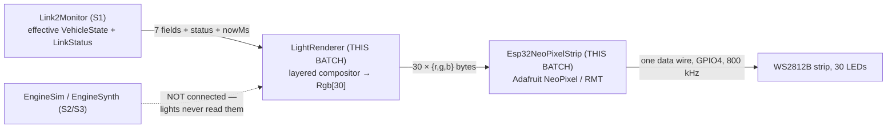

# S4 — LightRenderer + Esp32NeoPixelStrip: The Lights and the Light HAL

**Batch S4 of the source-code campaign** (see `../../source_code_explanation_plan.md`).
The lights are board #2's *visual* performance: every control tick, `LightRenderer` turns
the **effective `VehicleState`** (S1's monitor output) plus the **`LinkStatus`** into 30
RGB values for the WS2812B strip — brake bar, turn indicators, halo, F1 rain light,
low-battery pulse, and the all-amber failsafe hazard — composited in layers, gamma-
corrected, and capped under a computed power budget. A 20-line HAL
(`Esp32NeoPixelStrip`) then shifts those 30 values onto the physical strip.

**The headline finding:** `NeverConnected` does **not** show the hazard. Both chapter 07
§5 and (relaying it) the S1 batch doc claimed the amber hazard is "also shown for
NeverConnected" — the code renders a **calm teal 'waiting breathe'** instead, pinned by
its own test (`test_never_connected_is_calm_not_hazard`). The three-state `LinkStatus`
S1 explained is *rendered* three ways: breathe / normal / hazard. Chapter 07 and the S1
doc have been corrected (**new note #54**).

**Three more doc-vs-code findings (all in #54):** the config comments promise a
"minimum-on so a flick still completes one blink" for the indicators — **no minimum-on
is implemented** (hysteresis is; min-on isn't); the documented compositor priority puts
low-battery *above* the functional layer, but the code applies it *below* (moot with the
default non-overlapping segments); and the repo's CLAUDE.md/README/library.json say the
HAL sits "behind `ILedStrip`" — **no such interface exists anywhere in the repo** (the
pure renderer's `Rgb[30]` output array *is* the seam, so none is needed).

**And one measured bench flag (#55):** after the 43 % brightness cap *and* gamma 2.2,
the dim layers render astonishingly low — the disarmed halo and the idle tail light come
out at **1/255 PWM duty**, the NeverConnected breathe peaks at **{1,3,3}** — possibly
invisible in daylight. Numbers below; ears-and-eyes verdict is the bench's.

## Scope (files explained here)

| File (`w17-soundlight-fw/`) | Lines | What it is |
|---|---|---|
| `lib/lights/include/lights/LightRenderer.hpp` | 99 | Rgb/Segment/LightConfig + the compositor's interface |
| `lib/lights/src/LightRenderer.cpp` | 150 | palette, gamma LUT, and the layered render |
| `lib/lights/library.json` | 11 | real deps: `link2` + `link2monitor` (both exercised) |
| `lib/lights_hal_esp32/include/lights_hal_esp32/Esp32NeoPixelStrip.hpp` | 25 | the WS2812 HAL — interface |
| `lib/lights_hal_esp32/src/Esp32NeoPixelStrip.cpp` | 20 | …implementation (Adafruit NeoPixel wrapper) |
| `lib/lights_hal_esp32/library.json` | 10 | arduino/espressif32-only; Adafruit NeoPixel ^1.12.0 |
| `test/test_lights/test_main.cpp` | 183 | 9 tests |

**Prerequisites:** S1 (`01_link2_receiver_and_protocol_compatibility.md`) — the effective
`VehicleState` and the three-state `LinkStatus` are this module's *entire* input; the
lights are the consumer the monitor's header comment ("lights need the NeverConnected vs
Lost distinction") was written for. Chapter 07 §5 (the architecture claims this batch
checks — one needed correction). Chapter 03 (WS2812 electrical fixes). **S2/S3 are NOT
prerequisites**: the lights never read `EngineState`, the synth, or anything audio —
verified below.

**Test status: RUN AND PASSING (2026-07-05).**
`pio test -e native -f test_lights` → **9/9 PASSED** (1.18 s). Additionally, every color
and current figure quoted below (the gamma LUT's outputs, the rendered palette at the
brightness cap, the power-budget arithmetic) was **re-computed independently** with a
script replicating the exact integer semantics — labeled **VERIFIED (source +
computation)**. As always: native tests prove logic on this Mac; no LED lit up. Every
electrical/visual claim is bench.

> **S5-resolution note (2026-07-06,** `05_soundlight_main_integration.md`**):** the
> wiring PROVISIONALs are resolved — with one correction to this doc's guess. **The
> render cadence is ~30 Hz (33 ms), not the control loop's 50 Hz** — `loop()` runs a
> separate `kLightsPeriodMs = 33` tick guard; harmless to every conclusion here because
> all animations are free-running off `nowMs` (frame rate ≠ blink timing). Confirmed as
> presumed: `millis()` is the clock; the plumbing is *verbatim* "render → 30 ×
> `strip.setPixel` → `strip.show()`" with a fresh stack `px[30]` each frame;
> `strip.begin()` (boot-blank) runs early in `setup()` (the random-color window = power-
> on → static-init → setup, sub-second); GPIO4 + `kNumPixels` are injected from
> PinMap/`lib/lights`; everything lights-side lives on **core 1** (the audio task on
> core 0 touches none of it — audited). The `LightConfig` `static_assert` is at
> `main.cpp:35–36`. The lights receive the **same** `monitor.state()` as the engine,
> plus `monitor.status()` for the three-way rendering.

---

## 0. Where this sits — and what it does *not* read



- **Inputs (VERIFIED, from the `render` signature + every `state.` access in the
  `.cpp`):** the effective `link2::VehicleState`, the `link2monitor::LinkStatus`, and a
  caller-supplied `nowMs` (the same time-as-parameter seam as S1's monitor and S2's sim —
  no `hal::IClock`, tests just pass numbers).
- **Exactly seven `VehicleState` fields are read:** `failsafe`, `armed`, `lowBattery`,
  `braking`, `driveMode`, `ersPercent`, `steeringPercent`. **Notably NOT read:**
  `throttlePercent`, `reverse`, `drsOpen`, `ersDeploying`, `gear`, `rpm`, `batteryMv`.
  Three consequences worth stating loudly, since the campaign brief asks about each flag:
  - **There is no DRS light.** `drsOpen` has no consumer in the light system (VERIFIED
    absence — no `state.drsOpen` anywhere in `lib/lights`). The flag rides the wire and
    gates nothing visual.
  - **Deploying has no light.** `ersDeploying` is likewise unread here — ERS *deploy* is
    a sound (S3's whine); ERS *harvest* is the light (the rain light), and harvest is
    detected locally from `ersPercent` rising (§3.7), not from any flag.
  - **`batteryMv` is unread** — only the latched `lowBattery` judgment drives the pulse,
    exactly the "board #1 already qualified it" design S1 §5 explained.
- **The lights read no audio state.** `LightRenderer.hpp` includes only
  `link2/Link2Frame.hpp` and `link2monitor/Link2Monitor.hpp` — no enginesim, no
  soundsynth. Sound and light are parallel consumers of the same effective state, not a
  chain. (Confirms ch07 §1's pipeline split and S3 §0's diagram.) **VERIFIED.**
- **The output seam is a plain array.** `render(..., Rgb outPixels[kNumPixels])` fills 30
  structs of three bytes; `main.cpp` (S5) is expected to copy them into the HAL. There is
  **no interface class between renderer and HAL** — despite the repo docs' `ILedStrip`
  (§4.4, finding #54d). The pure-data array *is* the testability seam: tests read pixels
  directly; no mock strip needed.
- **Core placement:** lights are core-1-only per the cross-core rule (repo CLAUDE.md) —
  nothing here crosses to the audio core. Wiring is S5 (**PROVISIONAL**).

---

## 1. A short primer — the ideas this batch runs on

**WS2812B, the "one-wire" RGB LED.** Each LED package contains three tiny LEDs (red,
green, blue) *plus its own driver chip*. You don't wire each LED — you send a serial
stream down **one data line** at 800 kHz: the first 24 bits (8 per color) are absorbed by
LED 1, the next 24 by LED 2, and so on down the strip. Brightness per channel is a byte
0–255, which the LED chip turns into PWM *internally*. Consequences: (a) there is **no
"output polarity"** in the servo/PWM sense — a brightness is absolute data, not a duty
you could invert; (b) the ESP32 generates no per-LED PWM — it generates the *serial
waveform* (via the RMT peripheral, §4); (c) byte order on the wire is **GRB**, not RGB —
a classic gotcha the Adafruit library absorbs (§4.2).

**Compositing = painter's algorithm.** The renderer builds the frame in layers, each
layer simply *overwriting* pixels it owns: background first, urgent things last. Whoever
paints last wins the pixel. Priority is therefore *code order*.

**Gamma correction.** Human brightness perception is logarithmic-ish: going from PWM duty
1 → 2 looks like a big step; 254 → 255 is invisible. Raw byte-to-duty LEDs therefore look
wrong ("everything bright, no lows"). A **gamma curve** (here output = input^2.2, as a
256-entry lookup table) re-maps values so *perceived* brightness tracks the input
linearly. Cost: low inputs are crushed toward zero (measurably so here — §3.3).

**Hysteresis** — different on/off thresholds so a value hovering near one threshold
can't chatter the output. Third appearance in the project (C5 switch decode, C7 battery
warning); here it latches the turn indicators.

**Free-running blink phase.** A blinker can either restart its cycle every time it's
triggered, or derive on/off purely from the wall clock (`now % period`). The free-running
choice means every blinking segment shares phase (left and right indicators never
strobe out of step) and re-triggering can't reset a half-finished blink.

**LED power budgeting.** Each WS2812 channel draws up to ~20 mA at full duty; 30 LEDs ×
3 channels ≈ 1.8 A worst case — real power-supply money. The config *computes* its
worst case and refuses to compile (via `valid()` + static_assert) if it exceeds a 900 mA
budget.

---

## 2. `LightRenderer.hpp` — the contract

### 2.1 Lines 10–23: the pixel count and two tiny structs

```cpp
inline constexpr uint8_t kNumPixels = 30; // WS2812B strip length

struct Rgb {
    uint8_t r = 0;
    uint8_t g = 0;
    uint8_t b = 0;
    bool operator==(const Rgb& o) const { return r == o.r && g == o.g && b == o.b; }
};

// A contiguous run of pixels [start, start+len). len 0 = segment absent.
struct Segment {
    uint8_t start = 0;
    uint8_t len = 0;
};
```

- `kNumPixels = 30` — the physical strip length (matches the BOM's 30-LED strip and the
  hazard current math). House `inline constexpr` idiom (C1 §1).
- `Rgb` — three bytes, default black. The `operator==` exists so *tests* can compare
  pixels (`px[i] == Rgb{0,0,0}`); comparing member-by-member is what `==` on a struct
  needs to be told to do in C++ (no auto-generated equality pre-C++20). **VERIFIED.**
- `Segment` — half-open range `[start, start+len)`, the standard C++ convention (len 0 =
  nothing, no special case). Segments let the *layout* be config, not code: which pixels
  are "the brake bar" is a bench decision. **VERIFIED.**

### 2.2 Lines 25–57: `LightConfig` — the strip's layout and rhythm

```cpp
struct LightConfig {
    Segment brake{0, 6};       // rear brake bar
    Segment rainLight{6, 2};   // F1 rain light (flashes while ERS harvesting)
    Segment halo{8, 14};       // halo ring
    Segment leftIndicator{22, 4};
    Segment rightIndicator{26, 4};
```

- The default layout tiles the strip **completely and disjointly**: pixels 0–5 brake,
  6–7 rain, 8–21 halo, 22–25 left, 26–29 right = all 30, no overlaps. The comment allows
  overlaps ("the compositor's priority order decides who wins a shared pixel") — with
  the defaults that clause is dormant, which matters for finding #54c (§3.6).
  "Bench-tune to the physical build": the numbers will move once the strip is physically
  routed around the car. **VERIFIED** (values).

```cpp
    uint8_t maxBrightness = 110; // ~43%
```

- The global cap, applied to every pixel before gamma (§3.3). 110/255 ≈ 43 %. The comment
  names the sizing driver: the worst case is the all-amber hazard, not normal driving —
  and `valid()` (§2.3) enforces that arithmetic. **VERIFIED.**

```cpp
    int8_t indicatorOnPercent = 40;
    int8_t indicatorOffPercent = 20;
```

- The indicator thresholds against `steeringPercent` (−100…+100 on the wire, C8):
  |steer| ≥ 40 latches an indicator, |steer| < 20 clears both, and 20…39 *holds* whatever
  was latched — hysteresis (§3.8). The comment also promises "minimum-on so a flick
  still completes one blink" — **that part is not implemented** (finding #54b, §3.8).

```cpp
    uint16_t indicatorPeriodMs = 660; // ~1.5 Hz
    uint16_t hazardPeriodMs = 500;    // 2 Hz
    uint16_t rainPeriodMs = 250;      // ~4 Hz (rapid)
    uint16_t lowBatteryPeriodMs = 1600;
```

- Four rhythms, one per animation. Check the comments' arithmetic: 1/0.660 s ≈ 1.52 Hz ✓;
  1/0.5 = 2 Hz ✓; 1/0.25 = 4 Hz ✓; low-battery 1/1.6 ≈ 0.6 Hz (a slow *pulse*, not a
  blink — §3.6). The frequencies are legible design: indicators at car-blinker speed,
  hazard urgent, rain light rapid like the real F1 rain light, battery slow and calm.
  All are "derived from a free-running clock so segments stay phase-locked and
  re-triggering doesn't reset phase" — §1's free-running idea, implemented in §3.5.
  **VERIFIED** (values + arithmetic).

```cpp
    uint16_t harvestWindowMs = 400;
```

- The rain light's memory: how recently `ersPercent` must have *risen* to still count as
  "harvesting" (§3.7). 400 ms bridges the gaps between 50 ms frames and the coarse
  (integer-percent) resolution of `ersPercent` — a rise only appears when a whole
  percent boundary is crossed, so consecutive rises may be hundreds of ms apart at slow
  harvest rates. **VERIFIED** (value; the bridging rationale is **[I]**, consistent with
  C6's ERS rates).

### 2.3 Lines 53–66: the power budget — electricity checked at compile time

```cpp
    // Worst-case current budget: every LED at the brightness cap, all three
    // primaries. WS2812 ~ 20mA/channel at full; scale by cap. Kept well
    // under the 5A rail; hazard (single amber color) is the real worst case.
    static constexpr uint32_t kBudgetMilliamps = 900;

    constexpr bool valid() const {
        // Estimate worst case: all pixels amber (R+G) at the cap.
        const uint32_t perLedMa = (2u * 20u * maxBrightness) / 255u;
        return indicatorOnPercent > indicatorOffPercent && maxBrightness > 0 &&
               indicatorPeriodMs > 0 && hazardPeriodMs > 0 && rainPeriodMs > 0 &&
               lowBatteryPeriodMs > 0 &&
               (perLedMa * kNumPixels) <= kBudgetMilliamps;
    }
```

- **The idea:** the config can *compute its own worst-case current* and refuse to be
  valid if it exceeds the budget. The worst realistic frame is the failsafe hazard —
  **all 30 pixels amber** (amber = red + green, two channels). Per LED: 2 channels ×
  20 mA × cap/255. At the default cap 110: (2·20·110)/255 = **17 mA** (integer division),
  × 30 = **510 mA ≤ 900** ✓. At cap 255: 40 mA × 30 = **1200 > 900** ✗ — which is
  exactly what the first test pins (§5.1). **VERIFIED (source + computation + ran).**
- Two honest bounds on that estimate, both in the *safe* direction:
  1. It models both amber channels as *full* (the real amber is {255, 90, 0} — G at
     90/255), overestimating G's draw.
  2. It uses the **pre-gamma** cap. The actual duty sent to the LEDs passes through
     gamma 2.2 afterward (§3.3): rendered amber at cap 110 is {40, 4, 0}, so the true
     hazard draw is roughly (40+4)/510 × 40 mA ≈ **3.5 mA/LED ≈ 104 mA total** — about
     5× under the estimate. The budget is deliberately conservative; the 900 mA line
     itself sits "well under the 5A rail." **VERIFIED (computation)** for the numbers;
     actual LED current is bench (a datasheet's 20 mA is nominal).
- The other clauses: threshold ordering (on > off — hysteresis must have a gap),
  nonzero brightness, nonzero periods (a zero period would divide by zero in
  `blinkOn`'s `% periodMs` — this is the guard that makes §3.5 safe). **Not policed:**
  segment geometry (starts/lengths are unchecked — §3.4 shows why that's still
  memory-safe) and `harvestWindowMs` (a 0 window just disables the rain light —
  degradation, not danger). Where does the `static_assert` live? `main.cpp`, as with
  every config since C1 (**PROVISIONAL until S5**).

### 2.4 Lines 69–97: the class — deliberately *almost* stateless

```cpp
// Pure compositor: (effective VehicleState, LinkStatus, nowMs) -> pixels[N].
// Stateful only for indicator hysteresis + harvest edge detection; time is
// caller-supplied so blink phase and self-cancel are deterministic in tests.
//
// Priority (low to high, later overrides): base (halo + dim tail) ->
// functional (brake, indicators, rain) -> alert (low-battery halo pulse) ->
// FAILSAFE hazard (all amber, overrides everything).
class LightRenderer {
public:
    explicit LightRenderer(LightConfig config = LightConfig{});
    void render(const link2::VehicleState& state, link2monitor::LinkStatus link, uint32_t nowMs,
                Rgb outPixels[kNumPixels]);
private:
    void fill(Rgb* px, const Segment& seg, Rgb color);
    bool blinkOn(uint32_t nowMs, uint16_t periodMs) const;

    LightConfig config_;
    bool leftOn_ = false;
    bool rightOn_ = false;
    uint8_t lastErsPercent_ = 0;
    uint32_t lastHarvestMs_ = 0;
    bool harvestSeeded_ = false;
};
```

- **"Pure compositor … stateful only for"** — precise self-description. Given the same
  (state, link, nowMs) *history*, output is deterministic; but it is not literally a
  pure function: five members persist between calls — two indicator latches (§3.8) and
  three harvest-detector fields (§3.7). Everything else (blink phases!) is derived from
  `nowMs` each call, which is *why* blinks can be free-running with no stored phase.
  Compare S3: the synth needed persistent phase accumulators because audio phase must be
  continuous sample-to-sample; a light frame has no such continuity requirement, so time
  itself can be the phase. **VERIFIED.**
- **The priority comment vs the code (finding #54c):** the comment ranks low-battery
  ("alert") *above* the functional layer. The implementation applies low-battery
  **before** brake/rain/indicators (§3.6) — i.e. *below* them in painter's-algorithm
  terms. With the default disjoint segments the difference is invisible (they share no
  pixels); with a custom overlapping layout, the code's winner would contradict the
  documented one. Cosmetic today; logged.
- The output parameter `Rgb outPixels[kNumPixels]` — in C++ an array parameter decays to
  a pointer; the `[kNumPixels]` spelling is documentation for humans (the compiler
  doesn't enforce the length). The caller owns the buffer — no allocation inside
  (same real-time hygiene as S3, though the lights run on the control core where the
  deadline is 50 Hz, not 22 kHz).

---

## 3. `LightRenderer.cpp` — the mechanisms

### 3.1 Lines 5–14: the palette

```cpp
// Petronas teal, F1 palette.
constexpr Rgb kTeal{0, 130, 120};
constexpr Rgb kDimWhite{40, 40, 46};
constexpr Rgb kDimRed{40, 0, 0};
constexpr Rgb kBrightRed{255, 0, 0};
constexpr Rgb kAmber{255, 90, 0};
constexpr Rgb kWhite{255, 255, 255};
constexpr Rgb kOff{0, 0, 0};
```

- Seven named colors in an anonymous namespace (file-private, C4). "Petronas teal" is
  the Mercedes F1 livery color — the halo ring glows team-colored when armed. `kAmber`
  {255, 90, 0} is the universal hazard/indicator orange (pure red + a minority of
  green). `kDimWhite` has a whisper of extra blue (46 vs 40) — a cool white. These are
  *design-space* values: what actually reaches the LEDs is transformed by cap + gamma
  (§3.3), and the transformation is dramatic:

| Palette constant | Designed | **Rendered at cap 110** (computed) |
|---|---|---|
| kTeal | {0, 130, 120} | **{0, 9, 7}** |
| kDimWhite | {40, 40, 46} | **{1, 1, 1}** |
| kDimRed | {40, 0, 0} | **{1, 0, 0}** |
| kBrightRed | {255, 0, 0} | **{40, 0, 0}** |
| kAmber | {255, 90, 0} | **{40, 4, 0}** |
| kWhite | {255, 255, 255} | **{40, 40, 40}** |
| breathe peak (§3.4) | {42, 85, 85} | **{1, 3, 3}** |

  The right-hand column is the actual PWM duty commanded per channel. Note how the "dim"
  design values land at **1/255 duty** — flag **#55**: whether a 0.4 %-duty tail light
  and a {1,3,3} breathe are *visible* on the car is strictly a bench question (WS2812s
  are bright devices, and 1/255 in a dim room is perceptible, but daylight is another
  matter). **VERIFIED (computation)** for the numbers; visibility is bench.

### 3.2 Lines 16–27: the gamma LUT

```cpp
// Gamma-2.2 LUT (WS2812 look linear-perceptual). Built once.
struct GammaLut {
    uint8_t v[256];
    GammaLut() {
        for (int i = 0; i < 256; ++i) {
            double g = 255.0 * __builtin_pow(i / 255.0, 2.2);
            int val = static_cast<int>(g + 0.5);
            v[i] = static_cast<uint8_t>(val < 0 ? 0 : (val > 255 ? 255 : val));
        }
    }
};
const GammaLut kGamma;
```

- **Same build-once-look-up-forever pattern as S3's sine table** (S3 §4.1): a 256-entry
  table filled at static initialization, float allowed because it's one-time setup (the
  house rule, honored again). Entry i holds `255·(i/255)^2.2`, rounded half-up
  (`+ 0.5` then truncate) and clamped 0–255.
- `__builtin_pow` instead of `std::pow` — the compiler's built-in exponentiation, chosen
  (**[I]**) so the file needs *no* include beyond its own header (check line 1: it
  includes only `lights/LightRenderer.hpp` — not even `<cmath>`); the same
  dependency-avoidance instinct as S3's hand-rolled Taylor sine. One contrast worth
  teaching: `pow` may differ by ±1 ULP across platforms, so this LUT is *not* guaranteed
  bit-identical Mac↔ESP32 the way S3's polynomial table is — and that's fine here,
  because **no light test asserts exact channel values**; they assert *relations*
  (r > g, non-black, equality to {0,0,0}), which are robust to ±1 LUT wobble.
  Deliberate or lucky, the test style matches the math's portability. **VERIFIED**
  (source; the cross-platform ±1 point is **[I]**).
- Gamma-2.2 sample points (computed): in 9→out 0, 17→1, 42→5, 110→40, 255→255. The curve
  crushes the bottom (inputs below ~10 vanish entirely) and preserves the top — exactly
  the §1 perceptual trade.

### 3.3 Lines 29–36: `applyBrightnessAndGamma` — cap first, then gamma

```cpp
Rgb applyBrightnessAndGamma(Rgb c, uint8_t maxBrightness) {
    // Scale by the cap, then gamma-correct.
    auto ch = [&](uint8_t x) {
        uint16_t scaled = static_cast<uint16_t>(x) * maxBrightness / 255;
        return kGamma.v[scaled];
    };
    return Rgb{ch(c.r), ch(c.g), ch(c.b)};
}
```

- A lambda (`ch`) applied to each channel: scale into 0…cap (integer multiply-then-
  divide, overflow-safe: 255×255 = 65,025 fits the intermediate int), then push through
  the LUT. Worked example, amber R at cap 110: 255×110/255 = 110 → gamma → **40**.
  Amber G: 90×110/255 = 38 → gamma → **4**. Hence rendered amber {40, 4, 0}.
- **Order matters and is worth a beginner pause:** cap-then-gamma means the cap operates
  in *perceptual* (pre-gamma) space — "43 % cap" means "43 % as *bright-looking* as
  full," which after gamma is only ~16 % of the *electrical* duty (110→40). The
  alternative (gamma-then-cap) would make the cap electrical. The chosen order is the
  perceptually sensible one — and it's also why the power budget's pre-gamma estimate
  (§2.3) overshoots reality by ~5×, safely. **VERIFIED (source + computation).**
- This function runs **once per pixel per frame, at the very end** of `render` — every
  layer composes in design-space colors, and the cap+gamma transform is applied
  uniformly on the way out (you'll see the loop at each of the three exits, §3.4–3.9).

### 3.4 Lines 40–54 + 56–81: constructor, `fill`, `blinkOn`, and the NeverConnected breathe

```cpp
LightRenderer::LightRenderer(LightConfig config) : config_(config) {}

void LightRenderer::fill(Rgb* px, const Segment& seg, Rgb color) {
    for (uint8_t i = 0; i < seg.len; ++i) {
        const uint8_t idx = seg.start + i;
        if (idx < kNumPixels) {
            px[idx] = color;
        }
    }
}
```

- `fill` paints one segment one color — the compositor's only brush. The `idx <
  kNumPixels` guard makes any config **memory-safe**: a bogus segment can never write
  outside the 30-pixel frame. One pedantic footnote: `seg.start + i` promotes to `int`,
  then narrows back to `uint8_t` — so a nonsense segment like {200, 60} would *wrap*
  (indexes 200…255, 0…3) and repaint pixels 0–3 rather than fault. Odd pictures
  possible, memory corruption not. `valid()` doesn't police geometry (§2.3); the guard
  is the real safety line. **VERIFIED.**

```cpp
bool LightRenderer::blinkOn(uint32_t nowMs, uint16_t periodMs) const {
    // Free-running square wave: on for the first half of each period.
    return (nowMs % periodMs) < (periodMs / 2u);
}
```

- §1's free-running blink in one line: position within the period = `now % period`; on
  during the first half. No stored phase → all segments using the same period are
  automatically synchronized, and re-triggering an indicator can't reset a blink
  mid-cycle. (Odd periods round the half down — 661 would be on 330/off 331 ms;
  irrelevant at these values.) The `% periodMs` is why `valid()` demands nonzero
  periods. Conceptual cousin of S3's limiter gate (top bit of a phase accumulator = the
  same 50 % square, derived from state instead of wall time). **VERIFIED.**

Now `render` itself. It opens by clearing a *working frame* and classifying the link:

```cpp
    Rgb px[kNumPixels];
    for (uint8_t i = 0; i < kNumPixels; ++i) {
        px[i] = kOff;
    }

    const bool localFailsafe = state.failsafe || link == link2monitor::LinkStatus::Lost;
    const bool neverConnected = link == link2monitor::LinkStatus::NeverConnected;
```

- The frame is composed in a local `px[30]` (stack, no allocation) and copied out
  through cap+gamma at the end — so a partially-built frame is never observable.
- **`localFailsafe` ORs the two failsafe sources**: the *frame's* `failsafe` flag (board
  #1 reporting its own CRSF radio failsafe — C8) and the *link status* being `Lost`
  (board #2's own staleness verdict — S1). Both mean "show the hazard." Subtlety worth
  savoring: if the caller feeds this from `Link2Monitor` (as intended), a `Lost` link
  *already* comes with `failsafe = true` in the projected state (S1 §5) — the
  `|| Lost` is then redundant. It is **defense in depth**: the renderer refuses to
  assume its caller sanitized the state, and the unit test exploits exactly that
  (§5.3 feeds a raw non-failsafe frame with `Lost` and still gets the hazard).
  **VERIFIED (ran).**

```cpp
    // --- Never connected: a distinct "waiting" breathe ... ---
    if (neverConnected) {
        const uint32_t phase = nowMs % 2000;
        const uint32_t tri = phase < 1000 ? phase : (2000 - phase); // 0..1000..0
        const uint8_t lvl = static_cast<uint8_t>(tri * 255 / 1000);
        Rgb breathe{static_cast<uint8_t>(lvl / 6), static_cast<uint8_t>(lvl / 3),
                    static_cast<uint8_t>(lvl / 3)};
        fill(px, config_.halo, breathe);
        for (uint8_t i = 0; i < kNumPixels; ++i) {
            outPixels[i] = applyBrightnessAndGamma(px[i], config_.maxBrightness);
        }
        return;
    }
```

- **THE batch finding.** `NeverConnected` — no valid frame has *ever* arrived (S1's
  `everReceived_` gate) — renders a **calm 2-second "breathe"** on the halo: a triangle
  wave (0→1000→0 over 2000 ms, scaled to 0…255) coloring the halo a dim teal-ish
  {lvl/6, lvl/3, lvl/3} (green/blue dominant, max {42, 85, 85}), everything else dark.
  Early return — no hazard, no brake, nothing.
- This **contradicts chapter 07 §5** ("hazard … also shown for `NeverConnected`") and
  the S1 doc's relay of it. The code comment explains the intent: a *genuine* cut wire
  on a powered link reads as `Lost` → hazard (because board #1 spoke at least once);
  `NeverConnected` means "board #1 hasn't spoken yet — normal for seconds after
  power-on," and greeting the user with emergency amber at every boot would cry wolf.
  So the three-state `LinkStatus` S1 explained is *rendered* three ways: breathe /
  normal / hazard — the lights are precisely the consumer that S1's "lights need the
  NeverConnected vs Lost distinction" comment promised. Both docs corrected (**#54a**).
  **VERIFIED (ran)** — pinned by `test_never_connected_is_calm_not_hazard`.
- Two honest notes: (1) if board #1 *never* boots (dead board, broken solder), board #2
  breathes forever — there is no escalation timer; that's a deliberate design reading
  (**[I]** from the comment "escalating to hazard is handled by the caller/monitor
  status"), acceptable because a working install will always progress to Up or Lost.
  (2) The breathe's rendered peak is **{1, 3, 3}** after cap+gamma — the #55 visibility
  flag applies here most of all.

### 3.5 Lines 83–90: the failsafe hazard — all amber, overrides everything

```cpp
    // --- FAILSAFE hazard: all amber blink, overrides everything. ---
    if (localFailsafe) {
        Rgb c = blinkOn(nowMs, config_.hazardPeriodMs) ? kAmber : kOff;
        for (uint8_t i = 0; i < kNumPixels; ++i) {
            outPixels[i] = applyBrightnessAndGamma(c, config_.maxBrightness);
        }
        return;
    }
```

- The highest-priority layer, implemented as an **early return before any other layer is
  even computed**: all 30 pixels amber during the on-half of a 2 Hz blink, all dark
  during the off-half. Rendered amber: {40, 4, 0}. Brake, indicators, rain — none can
  leak through, because their code never runs. This is "override" in its strongest
  form. **VERIFIED (ran)** (§5.2 checks both blink phases across all 30 pixels; §5.3
  checks the Lost-only trigger).
- **A consequence of the early returns worth flagging:** while in hazard (or breathe),
  the *stateful* trackers below — indicator latches and the harvest detector — are
  frozen (their update code is skipped). After recovery, `lastErsPercent_` still holds
  its pre-failsafe value; if ERS *rose* during the outage (board #1 kept harvesting),
  the first recovered frame shows `ersPercent > lastErsPercent_` → a phantom ~400 ms
  rain-light flash. Compare S2, which tracked `lastGear_` *unconditionally* precisely
  to kill the analogous phantom blip — the lights did not replicate that guard.
  Cosmetic (a brief white flash, no safety content), unpinned by tests; noted here and
  in #54's log entry as an observation. **VERIFIED (source analysis)** — the code path
  is plain; no test exercises it.

### 3.6 Lines 92–103: base layer + low-battery pulse

```cpp
    // --- Base layer: halo (teal armed / dim white disarmed) + dim red tail. ---
    fill(px, config_.brake, kDimRed);
    fill(px, config_.halo, state.armed ? kTeal : kDimWhite);

    // --- Low-battery: slow red pulse on the halo (alert layer). ---
    if (state.lowBattery) {
        const uint32_t phase = nowMs % config_.lowBatteryPeriodMs;
        const uint32_t half = config_.lowBatteryPeriodMs / 2u;
        const uint32_t tri = phase < half ? phase : (config_.lowBatteryPeriodMs - phase);
        const uint8_t lvl = static_cast<uint8_t>(tri * 255 / half);
        fill(px, config_.halo, Rgb{lvl, 0, 0});
    }
```

- **Base:** the tail (brake segment) always glows dim red — a running light, so the car
  reads as "on" from behind even off-brake (rendered {1, 0, 0} — #55). The halo shows
  the arm state: **Petronas teal armed** ({0,9,7} rendered), **dim white disarmed**
  ({1,1,1}). This is the only *armed/disarmed indication* in the whole system, and note
  what drives it: the **effective** `armed` — so a link loss (which clears armed via
  S1's projection) never even reaches this line (the hazard returned early), and a
  *deliberate* disarm with a healthy link shows dim-white-not-black (§5.9's second
  half pins exactly that). **VERIFIED (ran).**
- **Low-battery:** when board #1's *latched judgment* `lowBattery` is true (3 s
  sustained below 7.0 V + hysteresis — C7; held across staleness — S1), the halo is
  *replaced* by a red triangle pulse: 0→255→0 over 1600 ms. Note "replaced," not
  blended: at the triangle's bottom the halo passes through {0,0,0} — while
  low-battery, the teal/white arm indication on the halo is gone entirely, traded for
  the alert. A design choice, coherent (the pulse *is* the halo's message now).
  Triangle math: `tri` ramps 0…800…0, `lvl = tri·255/800`. **VERIFIED** (source;
  no dedicated test — the low-battery pulse is one of two behaviors the suite doesn't
  cover, see §8.2).
- **Finding #54c lives here:** the comment calls this the "alert layer," documented
  *above* functional; in code it paints *before* brake/rain/indicators. Default
  segments are disjoint (halo shares nothing), so no pixel ever witnesses the
  contradiction — but the written priority and the executed priority disagree.

### 3.7 Lines 105–122: brake + the rain light's local harvest detector

```cpp
    // --- Functional layer: brake. ---
    if (state.braking) {
        fill(px, config_.brake, kBrightRed);
    }
```

- **The brake light**: the tail segment jumps dim→bright red ({1,0,0} → {40,0,0} — a
  40× duty step, unambiguous) whenever the frame's `braking` flag is set. The renderer
  adds **no hysteresis or filtering of its own** — deliberately, because the flag
  arrives *pre-filtered*: C8's `Link2Sender` computes it with −40 on / −20 off
  hysteresis on board #1, precisely so every consumer sees one coherent, non-flickery
  judgment. Board #2 just obeys (same pattern as `lowBattery`). During staleness the
  monitor zeroes `braking` (a command-class field, S1) — but that never gets here; Lost
  → hazard already returned. **VERIFIED (ran)** (§5.5).

```cpp
    // --- Rain light: flash while ERS is HARVESTING (ersPercent rising in
    // ERS mode) -- the real-F1 mapping, derived locally since the frame has
    // no explicit harvest flag. ---
    if (harvestSeeded_ && state.driveMode == 2 && state.ersPercent > lastErsPercent_) {
        lastHarvestMs_ = nowMs;
    }
    lastErsPercent_ = state.ersPercent;
    harvestSeeded_ = true;
    const bool harvesting = (nowMs - lastHarvestMs_) < config_.harvestWindowMs && lastHarvestMs_ != 0;
    if (harvesting) {
        Rgb c = blinkOn(nowMs, config_.rainPeriodMs) ? kWhite : kOff;
        fill(px, config_.rainLight, c);
    }
```

- **The cleverest lines in the file.** Real 2020s F1 cars flash their rain light while
  the ERS is **harvesting** (regenerating under braking) — that's the authentic cue this
  reproduces. Problem: the link2 frame has no "harvesting" flag (it has `ersDeploying`,
  the *opposite* activity). Solution: **derive harvest locally** — if `ersPercent` went
  *up* since the last frame while in ERS mode (`driveMode == 2`), energy is flowing in ⇒
  harvesting. Stamp the time; consider harvest active for `harvestWindowMs` (400 ms)
  after the last observed rise (bridging frame gaps and integer-percent granularity);
  while active, flash the 2-pixel rain segment white at 4 Hz.
- Piece by piece:
  - **`harvestSeeded_`** — the first frame ever only *establishes the baseline*; it can
    never register a rise (the flag is false until after the first pass). This kills the
    boot phantom: without it, a first frame carrying ersPercent 60 would compare against
    the member default 0 and "detect" a rise. Same first-decode-seeding move as C5's
    ChannelDecoder and S2's `everSeenState_`. **VERIFIED (ran)** — §5.7's first render
    is exactly this seeding.
  - **`driveMode == 2`** — harvest only exists in ERS mode (mode 2 = Gearbox+ERS, C10);
    in modes 0/1 `ersPercent` shouldn't move, but the gate makes the mapping explicit.
  - **Strictly `>`** — equal percent = no evidence. Deploying makes it *fall* — which is
    why deploy produces no rain light (§5.8 pins it), and why `ersDeploying` needn't be
    read at all.
  - **The window test** `(nowMs - lastHarvestMs_) < 400 && lastHarvestMs_ != 0` —
    unsigned elapsed-time subtraction (wrap-safe, the C7/S1 idiom), strict `<`, plus a
    `!= 0` guard so the never-stamped default (0) can't read as "harvested at t=0."
    Micro-edge: a *genuine* rise stamped at exactly `nowMs == 0` is suppressed by that
    guard — one impossible-in-practice millisecond (real `millis()` at first frame is
    well past 0). **VERIFIED** (source; edge noted for completeness).
  - White at 4 Hz on 2 pixels — rendered {40, 40, 40}, rapid — visually distinct from
    everything else on the strip. **VERIFIED (ran).**
- Cross-reference: S2 established `VehicleState.rpm` has no consumer (#51); here we can
  add precision — `ersPercent`'s *only* light-side use is this **derivative** (its
  changes, not its value: no gauge displays the number itself).

### 3.8 Lines 124–143: turn indicators — hysteresis, no minimum-on

```cpp
    // --- Indicators: steering-threshold with hysteresis + min-on (one full
    // blink cycle guaranteed via free-running phase). ---
    const int8_t steer = state.steeringPercent;
    if (steer >= config_.indicatorOnPercent) {
        rightOn_ = true;
        leftOn_ = false;
    } else if (steer <= -config_.indicatorOnPercent) {
        leftOn_ = true;
        rightOn_ = false;
    } else if (steer > -config_.indicatorOffPercent && steer < config_.indicatorOffPercent) {
        leftOn_ = false;
        rightOn_ = false;
    }
    const bool indBlink = blinkOn(nowMs, config_.indicatorPeriodMs);
    if (leftOn_ && indBlink) {
        fill(px, config_.leftIndicator, kAmber);
    }
    if (rightOn_ && indBlink) {
        fill(px, config_.rightIndicator, kAmber);
    }
```

- **The zone map** (defaults on=40, off=20), reading the three-branch chain carefully:

| steeringPercent | Effect |
|---|---|
| ≥ +40 | right latches ON, left forced off |
| ≤ −40 | left latches ON, right forced off |
| −19 … +19 (strictly inside ±20) | both cleared — **self-cancel** |
| +20 … +39 and −39 … −20 | *no branch taken* — **hold** whatever was latched |

  That middle do-nothing band **is** the hysteresis: steer to 60 (latch), ease back to
  30 (hold — still blinking), return under 20 (cancel). A driver holding a gentle curve
  at 30 % keeps the indicator; wheel jitter around 40 can't chatter it. Boundary
  precision: exactly +40 latches (`>=`); exactly ±20 *holds* (the clear band is strict
  `>`/`<`). Mutual exclusion is structural — each latch branch clears the other side,
  and one `steer` value can't hit both branches. **VERIFIED (ran)** (§5.6 walks
  60 → 30 → 10).
- **Finding #54b:** both the config comment ("hysteresis + minimum-on so a flick still
  completes one blink") and this block's own comment ("min-on (one full blink cycle
  guaranteed…)") promise a **minimum-on time. It does not exist.** A flick to 60 and
  back under 20 within two ticks lights the indicator for one 20 ms frame and cancels
  it — no timer, no completed blink. What the free-running phase *actually* guarantees
  is only that left/right/hazard blink in step and retriggering doesn't reset phase —
  not persistence. Hysteresis: implemented and tested; min-on: comment-ware. (Practical
  impact is mild — real steering returns *through* the 20–39 hold band, which acts as an
  accidental persistence — but the documented mechanism is absent.) **VERIFIED
  (absence, by reading every line of the block).**
- Indicators use the **effective** `steeringPercent`, which the monitor zeroes on
  staleness (command class) — academic here, since Lost → hazard early-returns first.
  On-phase amber renders {40, 4, 0}; off-phase leaves whatever the layer below painted —
  for the default layout, black.

### 3.9 Lines 145–148: the exit — one transform for the whole frame

```cpp
    for (uint8_t i = 0; i < kNumPixels; ++i) {
        outPixels[i] = applyBrightnessAndGamma(px[i], config_.maxBrightness);
    }
```

- The composed design-space frame goes out through cap+gamma, pixel by pixel — the third
  copy of this loop (breathe and hazard exits carry their own). Every path out of
  `render` passes through the transform; no raw design color can ever reach the strip.
  **VERIFIED.**

### 3.10 `lib/lights/library.json`

Name/version/description + `"dependencies": {"link2": "*", "link2monitor": "*"}` — both
real and exercised (`VehicleState` from link2, `LinkStatus` from link2monitor), unlike
the copied link2's dangling `hal` dep (#50). The description ("Pure WS2812 compositor …
Gamma LUT + static power budget") is accurate. 7 of soundlight's 8 `library.json`s now
covered — only `audio_hal_esp32`'s remains (S5). **VERIFIED.**

---

## 4. The HAL — `Esp32NeoPixelStrip`, 45 lines to the physical strip

### 4.1 The header (25 lines)

```cpp
#include <Adafruit_NeoPixel.h>

namespace lights_hal_esp32 {

// WS2812B strip via Adafruit NeoPixel (which uses the RMT peripheral on
// ESP32 core 2.0.x). Thin wrapper so the pure lights::LightRenderer never
// touches Arduino. Data pin goes through a 330R series resistor at the strip
// with a 1000uF reservoir + 1N5819 on strip VDD (build sheet fixes).
class Esp32NeoPixelStrip {
public:
    Esp32NeoPixelStrip(uint8_t pin, uint16_t numPixels);
    void begin();
    void setPixel(uint16_t i, uint8_t r, uint8_t g, uint8_t b);
    void show();
private:
    Adafruit_NeoPixel strip_;
};
```

- **The third-party library:** Adafruit NeoPixel is *the* standard Arduino WS2812
  driver. On ESP32 (Arduino core 2.0.x, per the comment) it generates the 800 kHz data
  waveform with the **RMT peripheral** — a hardware "remote control" pulse generator
  that produces exact pulse trains without CPU bit-banging, so WiFi/interrupt jitter
  can't corrupt LED timing. That claim lives in the library, below this seam —
  **PROVISIONAL (hardware/library behavior)**, like C7's `analogReadMilliVolts`
  internals.
- **The electrical recap** in the comment matches S1 §2's pin-map notes and the build
  sheet: 330 Ω series resistor at the strip end (edge-ringing damping), 1000 µF
  reservoir across strip power (inrush), 1N5819 diode dropping strip VDD (the
  level-shift trick that lets 3.3 V data drive a 5 V strip reliably — ch03). Comments,
  not code — the parts live on the bench. **VERIFIED (comment text)** / electrical
  reality is bench.
- **Interface shape — and finding #54d:** four methods, no base class.
  `w17-soundlight-fw/CLAUDE.md`, `README.md`, *and this library's own `library.json`*
  all say "Adafruit NeoPixel **behind `ILedStrip`**" — but a repo-wide grep finds
  `ILedStrip` **only in those three documentation strings; no such interface exists in
  any header**. Why is none needed? Because the *renderer's output is a plain `Rgb[30]`
  array* — the pure side never calls the HAL, so there's no call to abstract (contrast
  S3, where `EngineSynth` must be *called* by the audio task, hence a real
  `ISampleSource`). The docs describe an abstraction that was evidently planned and
  then correctly skipped. Cosmetic doc-lag; logged.
- **Pin injection:** the constructor takes `pin` — nothing here names GPIO4;
  `main.cpp` is expected to pass `config::kLedStripPin` (= 4, S1 §2). Same
  injected-pin discipline as every HAL since C2 (**PROVISIONAL until S5**).

### 4.2 The implementation (20 lines)

```cpp
Esp32NeoPixelStrip::Esp32NeoPixelStrip(uint8_t pin, uint16_t numPixels)
    : strip_(numPixels, pin, NEO_GRB + NEO_KHZ800) {}

void Esp32NeoPixelStrip::begin() {
    strip_.begin();
    strip_.clear();
    strip_.show();
}

void Esp32NeoPixelStrip::setPixel(uint16_t i, uint8_t r, uint8_t g, uint8_t b) {
    strip_.setPixelColor(i, strip_.Color(r, g, b));
}

void Esp32NeoPixelStrip::show() { strip_.show(); }
```

- **`NEO_GRB + NEO_KHZ800`** — the two facts a WS2812B needs declared: on the wire, each
  LED expects its 24 bits in **green-red-blue order** (not RGB!), at the 800 kHz data
  rate. The Adafruit library does the reordering: callers (and `strip_.Color(r,g,b)`)
  speak logical RGB; the library emits GRB. If this flag said `NEO_RGB` on a GRB strip,
  every red would light green — the classic first-strip surprise, absorbed here by one
  constant. **VERIFIED (source)** / that the physical strip is truly GRB-order is bench.
- **`begin()` = begin + clear + show — a boot-safety line worth noticing:** WS2812s
  power up with **undefined pixel contents** — a freshly powered strip can display
  random colors until told otherwise. Clearing and *immediately showing* blanks the
  strip at initialization, the visual analogue of C2's servo-neutral-at-boot (A4).
  Until S5 shows `begin()` is called early in `setup()`, the random-color window's
  length is unknown (**PROVISIONAL until S5** for the call site; the blanking behavior
  itself is **VERIFIED (source)**).
- `setPixel` / `show` — the WS2812 model in two calls: `setPixelColor` writes a RAM
  buffer inside the library; **nothing reaches the LEDs until `show()`** streams the
  whole buffer down the wire (30 LEDs × 24 bits at 800 kHz = 720 bits ≈ **0.9 ms** of
  wire time, plus a ≥50 µs reset latch). S5's loop will presumably do: render → 30 ×
  setPixel → show, once per control tick (a 0.9 ms blocking transmit at 50 Hz = ~4.5 %
  of the loop — fine; **PROVISIONAL until S5**).
- **What has no native test:** all of it. `lights_hal_esp32` is `platforms:
  espressif32` only (its `library.json`), excluded from the native build like every HAL
  since C2. The mapping renderer-output → `setPixel(i, r, g, b)` → photons is proven
  nowhere until hardware. **PROVISIONAL (bench)** across the board: colors correct
  (GRB), order along the strip matching the Segment layout, brightness/current reality,
  the 330 Ω/1000 µF/1N5819 fixes doing their jobs.

### 4.3 `lib/lights_hal_esp32/library.json`

`"frameworks": "arduino", "platforms": "espressif32"` — the HAL shape from C1's
comparison table (hardware-only, invisible to `[env:native]`), plus the repo's only
**external** LED dependency: `"adafruit/Adafruit NeoPixel": "^1.12.0"` — a *pinned-range*
third-party library (accepts 1.12.x and later 1.x, not 2.x). The description repeats the
`ILedStrip` phrase (#54d). **VERIFIED** (contents).

---

## 5. `test/test_lights/test_main.cpp` — nine tests, assertion by assertion

### Lines 1–33: fixtures and helpers

```cpp
using light_status = link2monitor::LinkStatus;
...
LightConfig cfg;

Rgb segFirst(Rgb* px, const lights::Segment& s) { return px[s.start]; }

bool anyNonBlack(Rgb* px) { ... }

VehicleState upState() {
    VehicleState s;
    s.armed = true;
    s.failsafe = false;
    return s;
}
```

- `cfg` is a file-scope **default** `LightConfig` used only to *locate segments and
  periods* in assertions (`cfg.brake.start`, `cfg.hazardPeriodMs`) — the renderers under
  test build their own identical defaults. `segFirst` samples a segment's first pixel —
  the tests' probe (one pixel stands for its segment; fine, since `fill` paints
  uniformly). `anyNonBlack` scans for any lit pixel. `upState()` is the canonical
  healthy frame: **armed, not failsafe** — note it must *explicitly clear* `failsafe`,
  because `VehicleState`'s boot-safe default is `failsafe = true` (S1); a
  default-constructed state fed to the renderer would hazard. Empty
  `setUp`/`tearDown` (C1 §7).

### 5.1 `test_config_valid_and_within_power_budget` (lines 38–44)

- `LightConfig{}.valid()` — the shipped defaults are sane (the same defaults-pass pin as
  every config batch). Then `tooBright.maxBrightness = 255` → per-LED 40 mA × 30 =
  1200 > 900 → `valid()` **false**. The one test in the repo where "invalid" means
  *"would draw too much current"* — electricity rejected at the logic level. What's not
  pinned: the boundary cap (the largest cap that passes is 191: (2·20·191)/255 = 29 mA
  → 899 wait — 29×30=870 ≤ 900 ✓; 192 → 30×30=900 ≤ 900 ✓; 195 → 30 — integer division
  makes the exact edge lumpy; nobody needs it pinned). **VERIFIED (ran).**

### 5.2 `test_failsafe_hazard_overrides_everything` (lines 46–63)

- Build `upState()` + `braking = true` (a layer that *would* paint) + `failsafe = true`.
  Render at `nowMs = 0` with link **Up**: 0 % 500 = 0 < 250 → blink-on phase. Assert
  **every one of the 30 pixels** has `r > 0 && g > 0 && b == 0` — the amber signature
  (rendered {40, 4, 0} matches: 40 > 0, 4 > 0, 0 == 0). The braking flag must leave no
  trace — and can't, since the hazard early-returns before the brake code exists.
  Then render at `nowMs = 250` (half the period): 250 % 500 = 250, not < 250 → off
  phase; assert all 30 pixels exactly `{0,0,0}`. Both blink phases pinned, whole-frame.
  Also quietly proves the frame flag *alone* (link still Up) triggers the hazard — the
  first of `localFailsafe`'s two OR-legs. **VERIFIED (ran).**

### 5.3 `test_link_lost_forces_hazard_even_if_frame_not_failsafe` (lines 65–73)

- The second OR-leg, isolated: a frame that says everything is *fine* (`upState()` —
  armed, failsafe false) but `LinkStatus::Lost`. All 30 pixels must be amber. This is
  the defense-in-depth proof from §3.4: the renderer hazards on staleness *even if its
  caller forgot to sanitize the state* (the real monitor would have forced
  `failsafe = true` already — the renderer doesn't rely on it). **VERIFIED (ran).**

### 5.4 `test_never_connected_is_calm_not_hazard` (lines 75–86)

- A default `VehicleState` (which has `failsafe = true`! — deliberately: even a
  failsafe-flagged state must not hazard when the link has *never* connected, because
  the branch order checks `neverConnected` first) rendered at t=500 with
  `NeverConnected`. The scan hunts for any "amber-like" pixel (`r > 0 && g > 0 &&
  b == 0 && r > 20`) and asserts there is none. At t=500 the breathe renders {0, 1, 1}
  (computed §3.1): r = 0 fails the very first clause. Even at the breathe's peak
  {1, 3, 3}, `b == 0` fails — the breathe always carries blue; amber never does. The
  `r > 20` clause adds margin (a rendered amber has r = 40). This is the test that
  pins finding #54a's correct behavior. **VERIFIED (ran).**

### 5.5 `test_brake_lights_on_braking` (lines 88–96)

- Healthy frame + `braking = true`, link Up, t=0. Sample the brake segment's first
  pixel: assert `r > g && r > b` — *dominant red*. Rendered bright red {40, 0, 0}
  passes trivially. Note the assertion style: not "equals {40,0,0}" but a *relation* —
  robust to gamma-LUT ±1 differences and to retuned brightness (the §3.2 portability
  point in action). What's not asserted: the dim-vs-bright distinction (an off-brake
  render showing {1,0,0} would also pass `r > g && r > b`.) The *step* is untested;
  the *presence* is tested. **VERIFIED (ran).**

### 5.6 `test_indicator_hysteresis_and_selfcancel` (lines 98–117)

- The §3.8 zone map, walked left to right at t=0 (always blink-on: 0 % 660 = 0 < 330):
  1. `steeringPercent = 60` (≥ 40) → right latches; assert right indicator's first
     pixel ≠ black. ✓
  2. `= 30` (inside the 20…39 hold band) → *no branch runs*; assert still lit —
     **hysteresis holds**. ✓
  3. `= 10` (inside the ±20 clear band) → both latches cleared; assert black —
     **self-cancel**. ✓
- Three renders, three assertions, the full latch lifecycle. Not covered: the left
  side (symmetric by structure), the left-clears-right takeover, and the *absent*
  minimum-on (#54b — no test claims it, consistent with it not existing).
  **VERIFIED (ran).**

### 5.7 `test_rain_light_flashes_only_while_harvesting_in_ers_mode` (lines 119–137)

- The harvest detector's whole lifecycle:
  1. Frame 1 (t=0): mode 2, ers 40 — **seeds** the baseline (`harvestSeeded_` was
     false; no rise possible; also `lastHarvestMs_ == 0` keeps `harvesting` false).
     No assertion — this render exists purely to establish state.
  2. Frame 2 (t=100): ers 42 > 40 → rise → stamp `lastHarvestMs_ = 100`; window test
     (100−100 = 0 < 400, stamp ≠ 0) → harvesting; blink check `100 % 250 = 100 < 125`
     → **on** (the test's own comment does this arithmetic). Assert rain segment lit. ✓
  3. Frame 3 (t=600): ers unchanged (42 = 42, not >) → no new stamp; 600−100 = 500 ≥
     400 → window expired. Assert rain segment black. ✓
- Proves: rise ⇒ flash, no-rise-for-400 ms ⇒ stop, and (implicitly) that the seeding
  frame didn't false-trigger. **VERIFIED (ran).**

### 5.8 `test_rain_light_ignores_deploy_only` (lines 139–152)

- Seed at ers 80 (mode 2), then `ersDeploying = true` with ers **falling** to 76.
  Assert the rain light stays black: deploying *drains* the store, percent falls, the
  strict `>` sees no rise, no stamp ever happens (`lastHarvestMs_` still 0 — the `!= 0`
  guard also holds). The rain light is a **harvest** cue, not an ERS-activity cue —
  the real-F1 mapping, pinned. Also demonstrates `ersDeploying` itself is inert to the
  lights (it's set and changes nothing). **VERIFIED (ran).**

### 5.9 `test_halo_teal_armed_dim_when_disarmed` (lines 154–169)

- Armed half: render `upState()`, sample the halo: assert `g >= r` — the teal signature
  (rendered {0, 9, 7}: 9 ≥ 0 ✓; a red-ish or amber halo would fail). Loose on purpose —
  relations, not exact channels.
- Disarmed half: a `VehicleState` with `armed = false` **and `failsafe`
  explicitly cleared** (the default would hazard — same subtlety as `upState()`), link
  Up ("board #1 can send disarmed-idle frames" — true to life: disarmed ≠ dead link).
  Assert `anyNonBlack(px)` — the frame shows *something* (halo dim-white {1,1,1} and
  tail {1,0,0} qualify). The weakest assertion in the suite: it proves disarmed-idle
  isn't blackout, but not that the halo specifically is white-ish (the dim tail alone
  would satisfy it). **VERIFIED (ran)**, weakness noted in §8.2.

### Lines 171–183: the runner

Nine `RUN_TEST`s in file order. Result 2026-07-05: **9/9 PASSED**, 1.18 s.

---

## 6. The complete state→light matrix

The batch brief asks after every flag; here is the whole truth in one table.

| Input | Light effect | Where |
|---|---|---|
| `LinkStatus::NeverConnected` | calm teal **breathe** on halo (2 s triangle), rest dark — *not* hazard | §3.4 |
| `LinkStatus::Lost` | **all-amber hazard blink**, 2 Hz, overrides everything | §3.5 |
| `failsafe` flag (frame) | same hazard (OR-ed with Lost) | §3.4–3.5 |
| `armed` | halo **teal** (armed) vs **dim white** (disarmed) | §3.6 |
| *(always, healthy)* | tail = dim red running light | §3.6 |
| `braking` | brake segment dim→**bright red** (flag pre-filtered on board #1, C8) | §3.7 |
| `lowBattery` | halo replaced by slow **red pulse** (1.6 s triangle) | §3.6 |
| `ersPercent` **rising** while `driveMode == 2` | **rain light**: 2 px white, 4 Hz, for 400 ms per rise | §3.7 |
| `steeringPercent` ≥ +40 / ≤ −40 | right/left indicator latched, **amber blink** ~1.5 Hz, hysteresis 40/20, self-cancel < 20 | §3.8 |
| `throttlePercent`, `reverse`, **`drsOpen`**, **`ersDeploying`**, `gear`, `rpm`, `batteryMv` | **no light effect — not read** | §0 |
| `EngineState` / synth / audio anything | **not connected to lights at all** | §0 |

Startup/default chain (safe-before-first-frame, twice over): the HAL's `begin()` blanks
the possibly-random strip immediately (§4.2); the monitor reports `NeverConnected` with
boot-safe defaults until a valid frame (S1); the renderer shows the breathe for that
status. Nothing can display a phantom "armed teal" or a stale command before board #1
actually speaks. (That `main.cpp` calls these in this order at boot — **PROVISIONAL
until S5**.)

---

## 7. Findings (logged in `open_questions.md`; ch07 §5 + S1 doc corrected)

1. **#54a — `NeverConnected` is a calm breathe, not the hazard.** Ch07 §5 claimed the
   all-amber hazard is "also shown for NeverConnected"; the S1 doc relayed the claim.
   The code renders a 2 s teal breathe on the halo and its own test pins the
   distinction. Both manual docs corrected. (The repo docs never made this mistake —
   this one was *ours*, from pre-code inference.)
2. **#54b — "minimum-on" is comment-ware.** Config and code comments both promise a
   flick completes one blink; no such timer exists — only hysteresis. Mild in practice
   (the 20–39 hold band gives accidental persistence on a returning stick).
3. **#54c — documented priority vs code order.** Low-battery is documented above the
   functional layer but painted below it. Moot with the default disjoint segments;
   would matter for overlapping custom layouts.
4. **#54d — `ILedStrip` does not exist.** CLAUDE.md, README, and the HAL's own
   `library.json` name an interface found nowhere in code. None is needed — the
   renderer's `Rgb[30]` output array is the seam.
5. **Observation (in #54's entry): phantom rain flash on failsafe recovery.** The
   harvest tracker freezes during hazard/breathe early-returns; if ERS rose during an
   outage, the first recovered frame can trigger a ≤400 ms rain flash. Cosmetic;
   contrast S2's unconditional `lastGear_` tracking, which guarded the analogous case
   for shift blips.
6. **#55 — post-cap-post-gamma dimness (bench).** Measured rendered values: disarmed
   halo {1,1,1}, running tail {1,0,0}, breathe peak {1,3,3}, armed teal {0,9,7} — the
   quiet layers sit at 0.4–3.5 % duty. Possibly perfect at night, possibly invisible in
   daylight. Also noted there: the power budget is ~5× conservative post-gamma
   (headroom, not error).

---

## 8. Closing accounting

### 8.1 What S4 proves (VERIFIED)

- The complete compositor logic: layer order with hazard-and-breathe early returns; the
  two-legged `localFailsafe` OR (frame flag, Lost status — each leg pinned by its own
  test); the three-way LinkStatus rendering (breathe / normal / hazard); halo
  arm-state colors; always-on tail; brake flag → bright red; the local ERS-harvest
  derivation (seeded, mode-gated, strictly-rising, 400 ms window) and its
  deploy-is-not-harvest counterpart; indicator hysteresis zones and self-cancel;
  free-running phase-locked blinks at 2 / ~1.5 / 4 Hz + the 1.6 s battery triangle —
  9/9 tests.
- The gamma-2.2 LUT and cap-then-gamma pipeline, with every quoted output value
  independently recomputed (amber → {40,4,0}, teal → {0,9,7}, dims → 1s).
- The power-budget arithmetic (default 510 ≤ 900 mA passes; cap 255 → 1200 fails) and
  its two safe-direction conservatisms.
- Memory safety of `fill` for arbitrary segments; determinism given (state, link,
  nowMs) history; zero audio/EngineSim coupling; the exact 7-field input surface —
  including the *absence* of any DRS, deploy, gear, rpm, or raw-battery light.
- The HAL's logic-level behavior: GRB+800 kHz declaration, boot-blank `begin()`,
  buffer-then-`show()` model.

### 8.2 What S4 does not prove

- **Untested even in logic:** the low-battery pulse (no test renders `lowBattery =
  true`); the NeverConnected breathe's *shape* (only "not amber" is pinned, not the
  triangle or the halo-only placement); left-indicator symmetry and the left↔right
  takeover; the brake *step* (dim vs bright — only "red dominates" is pinned); the
  phantom-rain-on-recovery path; segment boundary placement (tests probe first pixels
  only).
- Anything the HAL claims: that Adafruit's RMT timing holds, that the strip is truly
  GRB, that `setPixel` index i is the i-th physical LED.
- Any *visual* truth: colors as perceived, the #55 dimness question, blink rates
  feeling right.
- All of S5's wiring: who calls `render` at what cadence, with which clock, feeding
  which monitor; the render→setPixel→show loop; `begin()`'s place in boot;
  the config `static_assert` site.

### 8.3 What must wait for S5

`src/main.cpp` + `test_integration` + build configs: the render cadence (50 Hz tick?),
`millis()` as `nowMs`, monitor→renderer→HAL plumbing, `begin()` at boot,
`static_assert(lightConfig.valid())`, pin injection (GPIO4), core-1 placement per the
cross-core rule, soundlight's `platformio.ini`/`ci.yml` (also closes #50's esp32dev
question and the `audio_hal_esp32` library.json).

### 8.4 What must wait for real ESP32 / LED hardware

- Strip electrical reality: the 330 Ω / 1000 µF / 1N5819 fixes, GRB order, RMT timing
  under WiFi/load, actual current draw vs the 20 mA/channel nominal (and thus the real
  margin under the budget).
- **#55**: visibility of the 1-duty dim layers and the breathe; overall brightness
  balance; whether 43 % cap is right; color rendition (does {0,9,7} *read* as teal?).
- Physical layout: whether segments 0–5 etc. land on sensible car locations
  (bench-tune the `Segment` values), strip direction, hazard visibility in daylight.
- Human factors: blink frequencies, the rain light reading as "harvesting" to an
  observer, breathe-vs-hazard being distinguishable at a glance.

### 8.5 Understanding questions

1. The link goes stale mid-drive while the frame's own `failsafe` bit was false. Trace
   *both* mechanisms by which the hazard still appears, and name the test for each.
2. Why does `NeverConnected` show a breathe rather than the hazard? What real-world
   situation is each of the three LinkStatus renderings tuned for?
3. The frame has no "harvesting" flag. Explain how the rain light decides to flash,
   including the roles of `driveMode`, the strict `>`, the seeding flag, and the
   400 ms window. Why does deploying never trigger it?
4. Which seven `VehicleState` fields do the lights read? Name three flags that have
   *no* light and say where each one's effect actually lives (sound? nowhere?).
5. Steering goes 0 → 45 → 25 → 45 → 15. For each step, say whether the right indicator
   is latched and why.
6. Both a config comment and a code comment promise "minimum-on." What actually
   guarantees indicator persistence in practice, and how strong is that guarantee?
7. Amber is designed {255, 90, 0}. Walk it through cap 110 and gamma to the bytes the
   LED receives. Why is cap-before-gamma the perceptually sensible order?
8. The power budget passes at 510 ≤ 900 mA. Name the two ways that estimate
   over-counts, and why over-counting is the correct direction to err.
9. Why does the brake light need no hysteresis here, while the indicators do? Where
   does the brake flag's anti-flicker actually live?
10. A WS2812 strip shows random colors at power-up. Which two lines of which function
    fix that, and what control-firmware boot rule is it the twin of?
11. Why does `Esp32NeoPixelStrip` implement no interface while `EngineSynth` implements
    `ISampleSource`? What *is* the lights' testability seam?
12. After a 3-second link outage during which board #1 harvested ERS from 40 % to 60 %,
    what cosmetic artifact can appear at recovery, and which S2 design choice guarded
    against its sibling?

### 8.6 Concepts that deserve extra teaching later

- **Painter's-algorithm compositing** — priority as code order, early-return overrides,
  and why the documented layer list must match the executed one (#54c as case study).
- **Gamma correction & perceptual vs electrical brightness** — cap-then-gamma, the
  low-end crush, and how it interacts with power budgets (#55).
- **Deriving state locally from a data stream** (the harvest detector) — edge detection
  + seeding + a validity window; the third appearance of first-frame seeding (C5, S2,
  S4) and when *not* to freeze the tracker (the recovery phantom).
- **Hysteresis, third sighting** (C5 switches, C7 battery, S4 indicators) — worth one
  unified write-up with all three threshold pairs side by side.
- **Compile-time resource budgeting** — `valid()` computing worst-case *current*; the
  same pattern as S3's headroom (worst-case *amplitude*).
- **WS2812 protocol mechanics** — GRB order, the buffer/show model, RMT vs bit-banging,
  and why "polarity/PWM" intuitions from servo-land don't apply to addressable LEDs.

---

*S4 complete. Sources read read-only; tests run (`pio test -e native -f test_lights` →
9/9); arithmetic verified by an independent computation script (scratchpad only).
Written only in `learning-manual/`. Awaiting approval before S5 ("Audio HAL + dual-core
main + integration": the batch that closes the soundlight repo).*
