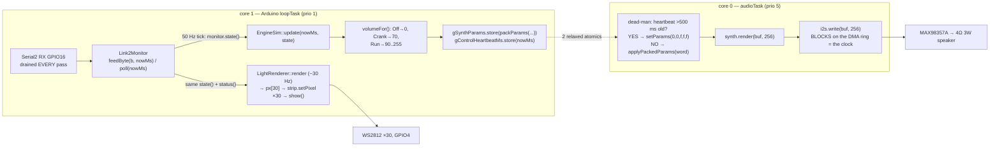

# S5 — main.cpp Integration: Audio HAL, the Dual-Core Conductor, the Sim Feeder, and the Build

**Batch S5 of the source-code campaign** (see `../../source_code_explanation_plan.md`) —
the **final soundlight batch**, the one that closes the `w17-soundlight-fw` explanation
phase. Every module from S1–S4 was pure logic with its wiring deliberately deferred;
this batch reads the wiring: the I2S audio HAL, the 142-line dual-core `main.cpp` that
composes everything, the scripted bench-demo feeder, the end-to-end integration test,
and the build/CI configuration.

**The headline results:**

1. **Open question #43 is now FULLY answered.** `main.cpp` packs the atomic word every
   50 Hz control tick with `packParams(engineRpm, volumeFor(e), ersWhine, limiter,
   overrun)`, and **`volume` is derived by `volumeFor()`** from `ignition` +
   `throttlePercent`: **Off → 0, Cranking → 70, Running → 90…255** linear in throttle.
   `Ignition::Off → volume = 0` — the load-bearing silence path — is real (§4.6).
2. **The dead-man is real, and it lives where the handoff predicted**: in `audioTask`
   on core 0. If the heartbeat atomic is older than 500 ms, the task forces
   `setParams(0, 0, false, false, false)` — and the synth's own per-sample smoother turns
   that into a ~3 ms fade (the "ramp"). **But note:** `main.cpp` is excluded from native
   tests (`test_build_src = no`), so the dead-man branch is **source+build-verified,
   never test-executed** (§4.7, §10).
3. **The light cadence is ~30 Hz, not 50 Hz** (33 ms period) — S4's "50 Hz tick?" guess
   was wrong; control and lights run on *separate* tick guards (§4.10).
4. **The two repos' `ci.yml` files are byte-identical** (`diff` empty) — C10 §9's
   line-by-line explanation transfers wholesale. **Closes #46's soundlight half** (§8).
5. **Open question #50 (dangling `hal` dep) is RESOLVED as benign**: both `esp32dev`
   and `esp32dev_sim` build **SUCCESS** this session, and the LDF dependency graph
   resolves `link2` with **no `hal` child** — the stale metadata line is never looked at
   (§7.4).
6. **The #53 smoother-parking quirk now has its practical impact pinned**: volume is a
   *continuum* (90…255 while Running), not a 0/255 binary — so every upward volume move
   parks **63 counts short**, full throttle plays at ≈75 % of full scale, and the
   cranking whir (target 70, approached from silence) renders at **7/255 ≈ 2.7 %** of
   full scale (§4.6). Whether that whir is audible at all is a bench question (**new
   #57**).
7. **Two small doc-lag findings** (**new #56**): the integration test's `volumeFor`
   helper says it maps volume "the way main.cpp will" but uses different constants
   (60 / 80+175 % vs main's 70 / 90+165 %); and `SIMULATION.md`'s "indicators sweep
   L/R" overstates the demo — the feeder's steering triangle never goes negative, so
   only one indicator side is ever exercised (§5.3, §6.5).

## Scope (files explained here)

| File (`w17-soundlight-fw/`) | Lines | What it is |
|---|---|---|
| `lib/audio_hal_esp32/include/audio_hal_esp32/Esp32I2sAudio.hpp` | 32 | the I2S audio HAL — interface |
| `lib/audio_hal_esp32/src/Esp32I2sAudio.cpp` | 50 | …implementation (IDF 4.4 legacy driver) |
| `lib/audio_hal_esp32/library.json` | 7 | the 8th and final soundlight library.json |
| `src/main.cpp` | 142 | the dual-core conductor |
| `src/SimLink2Feeder.hpp` | 24 | bench-demo frame feeder — interface |
| `src/SimLink2Feeder.cpp` | 106 | …implementation (scripted 14 s drive) |
| `test/test_integration/test_main.cpp` | 158 | the frames→audio+lights end-to-end test |
| `platformio.ini` | 45 | three environments + the native-exclusion mechanism |
| `.github/workflows/ci.yml` | 36 | CI — byte-identical to control's |

**Prerequisites:** all of S1–S4 (this batch is *their* composition), C10
(`../control_fw/10_main_integration.md` — the control board's conductor; same batch
*kind*, and several patterns repeat verbatim: tick guards, static-init asserts,
source+build-only verification of `main.cpp`). Chapter 07 §1/§6 (the architecture claims
this batch finally verifies in code). Chapter 04 §12 (atomics — extended here to *cross-
core*).

**Test/build status: RUN AND PASSING (2026-07-06).**
- `pio test -e native` → **40/40 PASSED** across all six suites (including the two
  `test_integration` cases explained in §6) — matching the handoff's expectation.
- `pio run -e esp32dev -e esp32dev_sim` → **both SUCCESS** (platform `espressif32 @
  7.0.1`, framework `arduino-esp32 core 2.0.17`, toolchain xtensa-esp32 8.4.0 — the
  pinned versions the `platformio.ini` comment promises; Adafruit NeoPixel resolved
  1.15.5 under `^1.12.0`).
- Repo clean at HEAD `db6fe92` before and after (read-only discipline held).

As always: native tests + builds prove *logic and compilation*. **Nothing in this batch
proves concurrency timing, I2S electrical behavior, DMA underrun handling, speaker
acoustics, or LED visuals on a physical ESP32** — every such claim below is explicitly
PROVISIONAL/bench.

---

## 0. The whole shape — the pipeline, now with its real plumbing



Everything chapter 07 §1 drew from the repo's CLAUDE.md is now **source-verified**: the
two-core split, the two-atomic-only shared surface, the monitor→sim→pack chain, the
monitor→lights branch, and the fact that **both consumers get the *same*
`monitor.state()`** (the handoff's "confirm main.cpp feeds the same effective state to
both paths" — confirmed, §4.10). What stays PROVISIONAL is *runtime* behavior on real
silicon: that the audio task actually meets its deadline, that I2S produces sound, that
the LEDs light. Native tests cannot touch `main.cpp` at all (§7.3), so the composition's
claims are **"VERIFIED (source + build)"** — exactly C10's evidence class — plus the
integration test's *analogue* of the chain (§6).

---

## 1. Primer — the platform machinery this batch runs on

Four ideas carry the whole batch. (Chapter 04 §12 covered atomics-vs-ISR; this extends
to two *cores*.)

**FreeRTOS under Arduino.** The ESP32 always runs FreeRTOS — a small real-time operating
system whose unit of execution is a **task** (like a thread: its own stack, a priority,
and a state). The Arduino framework is itself a task: on ESP32, `setup()` and `loop()`
run inside a task called `loopTask`. **VERIFIED (framework source):** the installed
framework's `cores/esp32/main.cpp` creates it with
`xTaskCreateUniversal(loopTask, "loopTask", …, 1, &loopTaskHandle,
ARDUINO_RUNNING_CORE)`, priority **1**, and the framework's `sdkconfig` sets
`CONFIG_ARDUINO_RUNNING_CORE=1` — so **`loop()` runs on core 1**, exactly as the
`main.cpp` comment claims ("Arduino loop owns core 1").

**Task pinning and priorities.** `xTaskCreatePinnedToCore(...)` creates a task that only
ever runs on one named core. Priorities: higher number = more urgent; a ready
higher-priority task preempts a lower one *on its core*. Priorities don't compete across
cores — a prio-5 task on core 0 never steals time from a prio-1 task on core 1. Each
core also runs an **IDLE task** (priority 0) that does housekeeping.

**The task watchdog (why a never-blocking `loop()` is safe).** ESP-IDF's task watchdog
resets the chip if a *subscribed* task starves. **VERIFIED (framework `sdkconfig`):**
`CONFIG_ESP_TASK_WDT_CHECK_IDLE_TASK_CPU0=y` but `…_CPU1 is not set` — the watchdog
watches core **0**'s IDLE task only. Consequences for this firmware: `loop()` may spin
forever without yielding (core 1's IDLE starving is not watched — the standard Arduino
arrangement), but the **audio task on core 0 must block regularly** or the chip resets.
It does — every `i2s.write` blocks on the DMA ring (§3.3), which is also what paces it.

**DMA and the I2S ring.** The I2S peripheral clocks samples out at exactly the sample
rate, fed by **DMA** (direct memory access — hardware copying memory to the peripheral
with no CPU involvement) from a **ring of buffers**. The CPU's job is only to keep the
ring topped up: `i2s_write` copies your samples into free ring space and **blocks until
there is room**. That blocking is the elegant trick: the hardware consumes exactly
22,050 frames/s, so a loop of `render → write` automatically runs at exactly real-time
speed — the DMA ring's backpressure *is* the audio clock. No timer, no scheduling math.
This is what the HAL comment means by "self-pacing the audio pump task."

---

## 2. `Esp32I2sAudio.hpp` — the audio HAL's interface (32 lines)

```cpp
#pragma once
#include <cstddef>
#include <cstdint>
namespace audio_hal_esp32 {
```

Standard header guard + the two freestanding-safe headers (`size_t`, fixed-width ints).
Note what is *not* included: no Arduino, no driver headers — the interface compiles
anywhere; only the `.cpp` touches the platform. (House HAL style since C2.) **VERIFIED.**

### Lines 8–14: the header comment — three design decisions stated up front

```cpp
// I2S output to the MAX98357A via the IDF 4.4 legacy driver (driver/i2s.h),
// which is what Arduino-ESP32 2.0.x ships. 16-bit, stereo frames at the
// synth's sample rate. We render mono and duplicate to L+R so the output is
// identical under every MAX98357A SD_MODE channel selection.
//
// begin() installs the driver + routes the pins; write() blocks until the
// samples are queued into the DMA ring (self-pacing the audio pump task).
```

- **"IDF 4.4 legacy driver"** — ESP-IDF v5 replaced `driver/i2s.h` with a new API; the
  Arduino 2.0.x core (what platform `espressif32 7.0.1` ships) still uses IDF 4.4, so
  the legacy API is the *current* one here. This is exactly why `platformio.ini` pins
  the platform version (§7.1): an unpinned platform bump to Arduino core 3.x would
  change the I2S API under this file's feet. **VERIFIED** (comment + the resolved
  package versions from the build).
- **"Render mono and duplicate to L+R"** — S3 explained the synth's mono→stereo
  duplication; this comment states the *reason*, and it's a hardware one (S1 §2 met it
  in the PinMap strap notes): the MAX98357A's SD_MODE strap selects left, right, or
  (L+R)/2 — and if L==R, all three selections produce the identical signal. A hardware
  configuration risk absorbed in software. **VERIFIED** (comment; acoustic result bench).
- **"write() blocks… self-pacing"** — the §1 backpressure idea, stated as the contract.

### Lines 15–30: the class

```cpp
class Esp32I2sAudio {
public:
    Esp32I2sAudio(uint8_t bclkPin, uint8_t lrclkPin, uint8_t dataPin, uint32_t sampleRateHz);
    void begin();
    size_t write(const int16_t* stereoFrames, size_t frameCount);
private:
    uint8_t bclkPin_;  uint8_t lrclkPin_;  uint8_t dataPin_;  uint32_t sampleRateHz_;
};
```

- **Pins + sample rate are constructor-injected** — the HAL hardcodes nothing;
  `main.cpp` passes `PinMap.hpp` constants and `soundsynth::kSampleRateHz` (§4.4). Same
  injected-pin discipline as every HAL since C2; the S1/S4 "pins injected, PROVISIONAL
  until S5" notes close here. **VERIFIED.**
- The constructor only *stores* the four values (see §3.1) — no hardware touched until
  `begin()`. That matters because the object is constructed during **static
  initialization**, before `setup()`, when drivers must not be poked (§4.4).
- `write(stereoFrames, frameCount)` — one **frame** = one L+R pair = 2 × `int16_t`
  (4 bytes). Returns frames actually written (with the blocking implementation this is
  always `frameCount`; the return value exists for API honesty). **VERIFIED** (source).
- Note there is **no `ISampleSource` here and no interface above this class** — the HAL
  is a concrete leaf, referenced only by `main.cpp`. The seam for *testability* is on
  the other side (the synth's `ISampleSource`); the HAL needs no seam because nothing
  pure depends on it. Same shape as S4's `Esp32NeoPixelStrip` (and the same reason
  `ILedStrip` never needed to exist — finding #54d).

---

## 3. `Esp32I2sAudio.cpp` — 50 lines of driver configuration

### 3.1 Lines 1–16: includes, file-local constants, constructor

```cpp
#include <Arduino.h>
#include <driver/i2s.h>
namespace {
constexpr i2s_port_t kPort = I2S_NUM_0;
constexpr int kDmaBufCount = 6;   // ~70ms of buffer at 22050Hz / 256 frames
constexpr int kDmaBufLen = 256;   // frames per DMA buffer
}
```

- `driver/i2s.h` is the legacy IDF driver — the only place in the repo it appears.
- `I2S_NUM_0`: the ESP32 has two I2S peripherals (0 and 1); this uses the first.
- **The DMA ring: 6 buffers × 256 frames = 1,536 frames ≈ 69.7 ms of audio** at
  22,050 Hz (1536 / 22050 = 0.06966 s) — the comment's "~70 ms" checks out.
  **VERIFIED (arithmetic)** — with one honesty caveat: the *unit* of `dma_buf_len` in
  the legacy driver ("samples" vs "frames") is a platform-documentation subtlety the
  native suite can't check; the repo's own comment says frames, the arithmetic is
  consistent with frames, and the bench will hear the difference if it's wrong (a 2×
  buffering error). **PROVISIONAL (platform semantics)**, flagged in new bench note #57.
- Why ~70 ms of buffer? Tolerance: core 0 can be late by up to ~70 ms (a burst of
  Wi-Fi/BT interrupts — none compiled here, but the margin is cheap) before the ring
  underruns. The cost: **latency** (§3.3).
- The constructor (lines 14–16) is a pure member-initializer list — stores four numbers,
  touches nothing. **VERIFIED.**

### 3.2 Lines 18–41: `begin()` — configure, install, route, zero

The legacy driver's setup is two structs and three calls. Field by field, because every
line is a decision:

```cpp
i2s_config_t cfg = {};
cfg.mode = static_cast<i2s_mode_t>(I2S_MODE_MASTER | I2S_MODE_TX);
```

- `= {}` zero-initializes every field first — so anything not explicitly set below is a
  deliberate 0/false, not garbage. (The same `{}` idiom as the structs in C1.)
- **MASTER**: the ESP32 generates the clocks (BCLK + LRCLK); the amp is a pure listener.
  **TX**: transmit only — this board never records audio.

```cpp
cfg.sample_rate = sampleRateHz_;                    // 22050, injected
cfg.bits_per_sample = I2S_BITS_PER_SAMPLE_16BIT;    // one int16 per channel-sample
cfg.channel_format = I2S_CHANNEL_FMT_RIGHT_LEFT;    // both channels transmitted
cfg.communication_format = I2S_COMM_FORMAT_STAND_I2S;
```

- `RIGHT_LEFT` = send both channels (as opposed to `ONLY_LEFT`/`ONLY_RIGHT` mono
  modes) — required because the synth hands over interleaved L,R,L,R… stereo (the
  duplicated mono from S3 §concept). The comment restates it: *"Transmit both channels;
  the synth duplicates mono into L+R."*
- `STAND_I2S` = the standard Philips I2S frame format (data one BCLK after the LRCLK
  edge) — what the MAX98357A datasheet expects. **VERIFIED (source)**; that the amp
  actually locks onto it is **bench** (SIMULATION.md checklist item 1).

```cpp
cfg.intr_alloc_flags = ESP_INTR_FLAG_LEVEL1;  // lowest-priority interrupt
cfg.dma_buf_count = kDmaBufCount;             // 6
cfg.dma_buf_len = kDmaBufLen;                 // 256
cfg.use_apll = false;
cfg.tx_desc_auto_clear = true;
```

- `ESP_INTR_FLAG_LEVEL1`: the I2S interrupt (which just advances the DMA ring) gets the
  lowest interrupt priority — it's not urgent; DMA itself needs no CPU.
- `use_apll = false`: the APLL is a dedicated audio PLL for *exact* sample-rate clocks;
  without it the rate is derived from the main clock and can be off by a tiny fraction.
  For a synthesized engine note (not music sync), a ~0.x % rate error is inaudible —
  skipping the APLL is the simple, right call. **[I]** reasoning; the false flag itself
  **VERIFIED**.
- **`tx_desc_auto_clear = true` — the quiet safety line.** If the ring ever *underruns*
  (CPU too late), the driver zero-fills instead of re-playing the last buffer. Underrun
  therefore sounds like a moment of **silence, not a stuck screaming loop** — the same
  fail-quiet philosophy as the dead-man, one layer lower. **VERIFIED (flag)**; actual
  underrun behavior is platform/bench.

```cpp
i2s_pin_config_t pins = {};
pins.bck_io_num = bclkPin_;        // 26
pins.ws_io_num = lrclkPin_;        // 25  ("WS" = word select = LRCLK)
pins.data_out_num = dataPin_;      // 22
pins.data_in_num = I2S_PIN_NO_CHANGE;  // no RX pin — TX only

i2s_driver_install(kPort, &cfg, 0, nullptr);  // no event queue (0, nullptr)
i2s_set_pin(kPort, &pins);
i2s_zero_dma_buffer(kPort);
```

- The pin struct maps the injected GPIO numbers onto the peripheral's three lines; the
  `I2S_PIN_NO_CHANGE` sentinel leaves the input line unrouted (the TX-only analogue of
  C8's `rxPin = -1` on the link2 UART).
- `i2s_driver_install(…, 0, nullptr)`: the last two arguments would create an event
  queue (underrun/overrun notifications); passing 0/nullptr opts out — nobody would
  listen anyway.
- **`i2s_zero_dma_buffer` — the audio boot-blank.** DMA memory starts as garbage;
  zeroing it means the amp's first ~70 ms is *silence*, not noise. The exact audio twin
  of S4's `strip.begin()` clearing the WS2812s (which power up random) and C2's A4 safe
  initial pulses. Three peripherals, one principle: **never let boot-garbage reach the
  physical world.** **VERIFIED (source)**; the audible/visible result is bench.
- Return values of all three calls are ignored (they return `esp_err_t`). With correct
  compile-time constants they can't fail in practice; still, a failed install would
  leave `write()` blocking forever on a dead driver — noted as a bring-up caveat (§11.5).
  **[I]**.

### 3.3 Lines 43–48: `write()` — the blocking pump stroke

```cpp
size_t Esp32I2sAudio::write(const int16_t* stereoFrames, size_t frameCount) {
    size_t bytesWritten = 0;
    const size_t bytes = frameCount * 2 * sizeof(int16_t);
    i2s_write(kPort, stereoFrames, bytes, &bytesWritten, portMAX_DELAY);
    return bytesWritten / (2 * sizeof(int16_t));
}
```

- Unit conversion in, unit conversion out: the class API speaks *frames*, the driver
  speaks *bytes*. One frame = 2 channels × 2 bytes = 4 bytes; 256 frames = 1,024 bytes.
- `portMAX_DELAY` = block **forever** until all bytes are queued. This is the §1
  self-pacing contract: the call returns only as fast as the hardware drains the ring.
  While blocked, the audio task sleeps — which is also what feeds the core-0 IDLE task
  and keeps the task watchdog happy (§1).
- **The latency consequence (worth understanding, INFERRED from the ring arithmetic):**
  because `write` only blocks when the ring is *full*, the pump naturally runs ahead
  until ~70 ms of audio is queued. A parameter change therefore reaches the speaker up
  to ≈ 70 ms (ring) + 11.6 ms (the block being rendered) + 20 ms (control tick) ≈
  **~100 ms worst case** after the triggering frame. For an engine sound tracking a
  throttle that is fine (F1 engines have inertia anyway — S2 *models* ~500 ms of it);
  for the *dead-man* it means up to ~70 ms of already-queued audio plays out after
  muting — still far inside the 500 ms failsafe scale. Logged in bench note #57 for a
  real-hardware measurement.

### 3.4 `library.json` — the 8th and final soundlight library metadata

```json
{ "name": "audio_hal_esp32", "version": "0.1.0",
  "description": "ESP32 (Arduino/IDF 4.4 legacy) I2S output for the MAX98357A. Hardware-only; referenced only from src/main.cpp.",
  "frameworks": "arduino", "platforms": "espressif32" }
```

7 lines; the hardware-only shape from C1's comparison table: framework/platform
restricted to `arduino`/`espressif32` (so the native platform never even considers it),
no `dependencies` key. Combined with `[env:native]`'s `lib_ignore` (§7.3) it is
double-locked out of the test build — same belt-and-braces as `lights_hal_esp32`
(S4 §4.3). **All 8 soundlight `library.json` files are now explained** (config, link2,
link2monitor — S1; enginesim — S2; soundsynth — S3; lights, lights_hal_esp32 — S4;
audio_hal_esp32 — here). **VERIFIED.**

---

## 4. `src/main.cpp` — the conductor, line by line (142 lines)

The same *kind* of file as C10's: **composition only** — construct, wire, schedule; no
mechanism of its own except `volumeFor` (12 lines) and the dead-man check (5 lines).
And the same evidence class as C10: `platformio.ini` sets `test_build_src = no`, so
**nothing in this file is ever exercised by a native test** — every claim below is
"VERIFIED (source + build)" unless it cites the integration test's *analogue* (§6).

### 4.1 Lines 1–16: includes

```cpp
#include <Arduino.h>
#include <atomic>
#include "audio_hal_esp32/Esp32I2sAudio.hpp"
#include "config/PinMap.hpp"
#include "enginesim/EngineSim.hpp"
#include "lights/LightRenderer.hpp"
#include "lights_hal_esp32/Esp32NeoPixelStrip.hpp"
#include "link2/Link2Codec.hpp"
#include "link2monitor/Link2Monitor.hpp"
#include "soundsynth/EngineSynth.hpp"
#ifdef W17_SIM_LINK2_FEEDER
#include "SimLink2Feeder.hpp"
#endif
```

- One include per module of the S1–S4 story plus the two HALs and `<atomic>` (the C++
  standard atomics header — first appearance outside a HAL; C7's ISR atomics were the
  single-core cousin). `Link2Codec.hpp` is included for `link2::kFrameLen` (used by the
  sim-feeder buffer, line 111).
- The `#ifdef` around `SimLink2Feeder.hpp` is the LDF-visible switch: in the plain
  `esp32dev` build the include (and the module, §5) vanishes — the same
  compile-time-subtraction pattern as control's `W17_SIM_CRSF_FEEDER` (C10 §5).
  **VERIFIED** (both builds succeed; the sim env differs only by this flag, §7.2).

### 4.2 Lines 18–26: the cross-core surface — the whole of it

```cpp
namespace {
// ---- Cross-core surface (the ONLY shared state; see CLAUDE.md) ----
// Packed synth params, written by the control loop (core 1), read by the
// audio pump (core 0). One atomic word => torn-free, lock-free.
std::atomic<uint32_t> gSynthParams{0};
// Heartbeat: control loop stamps millis() each tick; the audio task ramps to
// silence if it goes stale (a wedged control loop must not scream forever).
std::atomic<uint32_t> gControlHeartbeatMs{0};
```

- **This is the answer to chapter 07 §6's architecture claim, in the flesh.** Exactly
  two `std::atomic<uint32_t>` objects; nothing else is shared between cores (audited
  variable-by-variable in §4.11). The repo CLAUDE.md's "cross-core rule" is implemented
  as written. **VERIFIED (source).**
- `std::atomic<uint32_t>` guarantees every load/store is **indivisible**: a reader can
  never see half an update. On ESP32 (32-bit Xtensa), an aligned 32-bit store is a
  single instruction anyway, so the atomic costs nothing — but writing `std::atomic`
  makes the guarantee *portable and compiler-proof* (the compiler may not cache, split,
  or reorder the accesses in ways that break atomicity). Chapter 04 §12's
  volatile-vs-atomic lesson applies unchanged across cores.
- `{0}` initializes both words to zero at static-init. **Zero is a *safe* packed word:**
  `applyPackedParams(0)` decodes to rpm 0, volume 0, all flags false — silence. The boot
  state is safe by construction (§4.12 walks the timeline).
- Note the whole file body lives in an **anonymous namespace** (through line 84) — every
  global here is file-private (internal linkage), the same hygiene as the test files
  since C1. `setup()`/`loop()` sit *outside* it (they must have external linkage for the
  Arduino core to find them).

### 4.3 Lines 28–36: configs + the four deferred `static_assert`s — found

```cpp
// ---- Config (validated at compile time) ----
constexpr link2monitor::Link2MonitorConfig kMonitorConfig{};
static_assert(kMonitorConfig.valid(), "monitor config");
constexpr enginesim::EngineSimConfig kEngineConfig{};
static_assert(kEngineConfig.valid(), "engine config");
constexpr soundsynth::EngineSynthConfig kSynthConfig{};
static_assert(kSynthConfig.valid(), "synth config: partial sum exceeds headroom");
constexpr lights::LightConfig kLightConfig{};
static_assert(kLightConfig.valid(), "light config: power budget or thresholds");
```

- **This resolves the "where's the `static_assert`?" question every S-batch deferred**
  (S1 §4, S2 §1, S3 §3.4, S4 §2.x): the assert-at-definition-site pattern, exactly like
  control's `main.cpp` (C10 §2). All four configs are default-constructed `constexpr`
  instances, each immediately policed at **compile time** — an invalid default (a
  clipping partial stack, an over-budget LED config, a zero staleness window, an
  inverted rpm ordering) is a *build error*, not a runtime surprise. The two custom
  messages name the interesting failure modes (S3's headroom budget, S4's power budget).
  **VERIFIED (source + both firmware builds compiling proves all four asserts pass).**
- Because the instances are `constexpr` and all-default, the *values* are the ones S1–S4
  explained: staleness 500 ms, idle 3,500/redline 15,000, the 6-partial table, the
  110/255 brightness cap. No tuning happens here — board #2 has no settings/console/NVS
  subsystem at all (contrast C9/C10; one consequence: nothing like open question #49
  exists on this board — what you compile is exactly what you get). **VERIFIED**
  (no `settings`/`Preferences` anywhere in this repo).

### 4.4 Lines 38–48: the module instances — static lifetime, ownership by core

```cpp
// ---- Core-1 (control) objects ----
link2monitor::Link2Monitor monitor(kMonitorConfig);
enginesim::EngineSim engine(kEngineConfig);
lights::LightRenderer lightRenderer(kLightConfig);

// ---- Core-0 (audio) objects ----
soundsynth::EngineSynth synth(kSynthConfig);
audio_hal_esp32::Esp32I2sAudio i2s(pinmap::kI2sBclkPin, pinmap::kI2sLrclkPin,
                                    pinmap::kI2sDataPin, soundsynth::kSampleRateHz);

lights_hal_esp32::Esp32NeoPixelStrip strip(pinmap::kLedStripPin, lights::kNumPixels);
```

Six global objects. Everything a beginner should know about their lifetime:

- **Static storage duration:** file-scope objects are constructed during **static
  initialization**, *before* `setup()` runs (chapter 04; the C10 §2 "static-init
  globals" section applies verbatim). Within one translation unit, construction order =
  declaration order: monitor → engine → lightRenderer → synth → i2s → strip. None of
  the constructors reads another global, so the order carries no risk (no
  static-initialization-order fiasco here — and `main.cpp` is the only TU with
  namespace-scope objects; the feeder's statics are function-local, §5.2).
- **What the constructors do** (all previously explained): the monitor sets its
  boot-failsafe effective state (S1 §5); the sim seeds `rpm_ = idle` (S2 §2); the
  renderer builds its gamma LUT (S4 §3.9 — the one-time float exception); the synth
  builds its sine table (S3 §4.1 — same exception) and seeds the noise LFSR (default
  seed `0x1234`); `i2s` stores four numbers (§3.1); `strip` constructs the Adafruit
  NeoPixel object (S4 §4.1 — allocates its 90-byte pixel buffer; heap is initialized
  before C++ static constructors run in the ESP-IDF boot sequence **[I]** — standard
  platform behavior, not project source).
- **No hardware is touched at static-init.** Both HAL objects defer their peripheral
  work to `begin()`, called from `setup()` (§4.9). This is precisely the lesson of
  control finding A5 (static-init timing anchors) applied prophylactically.
- **The comments assign each object a core** — a *discipline*, not an enforcement. C++
  has no "this object belongs to core 0" mechanism; what makes it true is that the code
  only ever *touches* `synth` + `i2s` from `audioTask` and the rest from
  `setup()`/`loop()`. §4.11 audits that this discipline actually holds. One deliberate
  wrinkle: `i2s.begin()` is called from `setup()` — core **1** — before the audio task
  exists; safe because task creation gives a happens-before edge (§4.9).
- **The pin injections close S1's and S4's PROVISIONALs:** I2S gets 26/25/22 and the
  synth's 22,050 Hz; the strip gets GPIO4 and `kNumPixels` = 30. Cross-check with S1 §2's
  PinMap walk: every constant lands where the comments promised. The link2 RX pin
  (GPIO16) is injected into `Serial2.begin` instead (§4.9) — the UART is used directly
  as Arduino's `Serial2` object rather than through a HAL class (the same "no seam
  needed, main-only" choice as control's `Esp32CrsfUart` non-interface, C4).

### 4.5 Lines 50–52: the three numbers that schedule the board

```cpp
constexpr uint32_t kControlPeriodMs = 20; // 50Hz
constexpr uint32_t kLightsPeriodMs = 33;  // ~30Hz
constexpr uint32_t kAudioDeadmanMs = 500; // control-loop staleness -> mute
```

- **50 Hz control** — matches the sender's world (board #1 ticks at 50 Hz, transmits at
  20 Hz), and the 20 ms tick every S2 test assumed is now confirmed as the real cadence.
- **~30 Hz lights** — 33 ms ≈ 30.3 Hz. **This corrects S4's guess** ("the 50 Hz tick?"):
  lights run their own, slower guard. Why slower is fine: every animation in the
  renderer is free-running off `nowMs` (S4's glossary term), so frame *rate* affects
  only smoothness, not timing correctness; 30 Hz is ample for indicators/hazard
  (660/500 ms periods), and it spends less core-1 time on the ~0.9 ms `strip.show()`
  wire transfer. **[I]** rationale; the constant **VERIFIED**.
- **500 ms dead-man** — deliberately the *same magnitude* as the link2 staleness rule:
  the third failsafe layer (link staleness → ignition-off → dead-man) each watch a
  different failure (wire cut / commanded silence / wedged control loop) at the same
  half-second scale. Worth noticing: chapter 07 §6's "~500 ms" is now an exact 500.

### 4.6 Lines 54–60: `volumeFor` — open question #43, closed

```cpp
// Maps the engine state to a synth volume: silent Off, quiet crank, rising
// with throttle while Running.
uint8_t volumeFor(const enginesim::EngineState& e) {
    if (e.ignition == enginesim::Ignition::Off) return 0;
    if (e.ignition == enginesim::Ignition::Cranking) return 70;
    return static_cast<uint8_t>(90 + e.throttlePercent * 165 / 100); // 90..255
}
```

**This is the answer to #43's remaining half — where `volume` comes from.** The one
synth input with no `EngineState` source is derived right here, from the two
`EngineState` fields that *don't* cross the cores (`ignition` and `throttlePercent` —
S3 §0's table). Walk it:

- **`Off → 0`: the load-bearing silence path, confirmed.** S3 established (concept 17)
  that rpm 0 alone does NOT silence the synth — frozen phase accumulators output a DC
  hold, and only `volume = 0` truly mutes. The whole S1→S2 safety chain (stale link ⇒
  effective `armed=false` ⇒ ignition `Off`) *terminates in this line*: Off becomes
  volume 0 becomes (after the synth's downward-exact smoother, S3 #53) true digital
  silence. **VERIFIED (source; the chain's native-test analogue is §6.2's exact-zero
  assertion).**
- **`Cranking → 70`: a fixed "quiet" whir level.** Combined with S2 (crank target
  1,800 rpm) the starter is both low-pitched and quiet. **But #53 bites here** (see
  below): 70 approached from silence *parks at 7*.
- **`Running → 90 + throttle·165/100`**, integer math: throttle 0 → **90** (idle is
  audible but calm), 50 → 90+82 = **172**, 100 → 90+165 = **255** (endpoint-exact —
  165·100/100 divides cleanly; intermediate values truncate by at most 1). A
  **continuum**, not a binary — which settles the open hypothesis in #53 ("if main.cpp
  only sends 0 and 255, the quirk reduces to full=75 %"). It doesn't reduce; see next.
- `e.throttlePercent` is `uint8_t` 0…100 (S2 clamps negatives before publishing), so the
  arithmetic (promoted to `int`) never overflows and the cast back to `uint8_t` is safe.
  **VERIFIED (types).**

**The #53 interaction, now computable exactly.** S3 measured the smoother's behavior
(`smooth += (target − smooth) >> 6`, truncating): an *upward* approach stalls once the
remaining gap < 64 — it parks **63 counts below the target** — while a *downward*
approach converges exactly. Applying that to the real targets:

| Situation | volume target | rendered steady level | % of full scale |
|---|---|---|---|
| Off (disarm/failsafe/stale/boot) | 0 | **0 exactly** (downward converges) | silent ✓ |
| Cranking, from silence | 70 | parks at **7** | ≈ 2.7 % — *very* quiet |
| Idle, reached by revving up (from 7) | 90 | parks at **27** | ≈ 10.6 % |
| Idle, reached by lifting off (from above) | 90 | **90 exactly** | ≈ 35 % |
| Full throttle (from below) | 255 | parks at **192** | ≈ 75 % |

So in the real firmware: full throttle plays at ~75 % of design volume; the idle level
is **path-dependent** (27 after the first rev-up from cold, 90 after any lift-back);
and the 600 ms starter whir renders at ~2.7 % of full scale — plausibly near-inaudible
over ambient noise. None of this is a *new* code fact (S3 measured the mechanism); what
S5 adds is the **actual operating points**. Open question #53 is annotated accordingly
(it remains an owner question — intended voicing or off-by-shift?) and the whir
audibility joins bench note **#57**. **VERIFIED (arithmetic on S3's measured mechanism;
audibility = bench).**

One more observation for honesty: the *integration test's* copy of this function uses
**different constants** (Cranking 60; Running 80 + throttle·175/100) while its comment
claims it maps volume "the way main.cpp will." Same shape, same endpoints-at-full
(255), different mid-curve — the test predates or drifted from the final `main.cpp`.
Harmless (the test is self-contained and tests the *chain*, not main's constants), but
the comment overstates — logged as doc-consistency note **#56a** (§6.5).

### 4.7 Lines 62–79: `audioTask` — the core-0 pump and the dead-man

```cpp
// ---- Audio pump: core 0, blocks in i2s.write, self-paced ----
void audioTask(void*) {
    constexpr size_t kFrames = 256;
    static int16_t buf[kFrames * 2];
    for (;;) {
        // Dead-man: if the control loop hasn't ticked recently, force silent
        // params regardless of the last packed value.
        const uint32_t now = millis();
        const uint32_t hb = gControlHeartbeatMs.load(std::memory_order_relaxed);
        if (now - hb > kAudioDeadmanMs) {
            synth.setParams(0, 0, false, false, false);
        } else {
            synth.applyPackedParams(gSynthParams.load(std::memory_order_relaxed));
        }
        synth.render(buf, kFrames);
        i2s.write(buf, kFrames);
    }
}
```

Line by line — this is the batch's conceptual heart:

- **`void audioTask(void*)`** — the FreeRTOS task signature: takes an untyped context
  pointer (unused here — `nullptr` is passed at creation) and never returns. The
  `for (;;)` infinite loop *is* the task's life; a FreeRTOS task that returned would
  crash the scheduler (tasks must be deleted, not returned from). **VERIFIED.**
- **`static int16_t buf[512]`** — 256 frames × 2 channels = 512 samples = **1,024
  bytes**. `static` puts it in the `.bss` segment, NOT on the task's stack — crucial,
  because the task was created with only **4,096 bytes** of stack (§4.9); a 1 KiB local
  array would eat a quarter of it. (Function-local static = initialized once, persists
  across iterations — C10's glossary term; here it's also a memory-placement tool.)
  Safe because only this one task ever runs this function. **VERIFIED.**
- **256 frames per iteration = 11.61 ms of audio** (256/22050). This finally names the
  deadline S3 kept referencing: `render()` must compute 256 samples in under ~11.6 ms —
  measured on the Mac at far under that; the 240 MHz ESP32 margin is expected to be
  wide but is **bench-unproven (#57)**.
- **The dead-man, precisely:**
  - `millis()` — called *from core 0*. The Arduino `millis()` reads the ESP-IDF
    high-resolution timer, safe from any core (**[I]** framework fact).
  - `now - hb > 500` — unsigned wraparound-safe subtraction (the S1/C7 idiom). Note it
    is **strictly `>`**, an *exclusive* boundary — a 500-ms-exactly-old heartbeat is
    still fresh, whereas the monitor's staleness uses inclusive `>=` (S1 §5). A 1 ms
    cosmetic asymmetry between two mechanisms that never interact; noted for precision,
    not as a defect.
  - On staleness: **`setParams(0, 0, …)` — bypassing the packed word entirely.** The
    forced parameters are rpm 0, volume 0, all effects off. The synth's per-sample
    smoother turns the volume step into an exponential fade (τ ≈ 2.9 ms, downward =
    exact convergence — S3), so the mute is click-free. **This is what CLAUDE.md's
    "ramps volume to 0" means in code**: the ramp is the smoother, not a separate
    mechanism (precision note folded into #56d).
  - Otherwise: `applyPackedParams(word)` — the S3-explained unpacker, fed from the
    atomic. The word is (re-)applied before *every* 256-frame block, i.e. at ~86 Hz —
    faster than the 50 Hz producer, so no published tick is skipped for long.
- **`render` then `write`** — compute 11.6 ms of sound, hand it to the DMA ring, block
  until the ring has room (§3.3). The blocking is the pacing; there is no `vTaskDelay`,
  no timer. When `write` returns, roughly one buffer's worth of ring space just freed,
  and the loop goes again.
- **What can never happen here:** no allocation, no locks, no waiting on the control
  loop (only on the DMA). Even if core 1 wedges *hard*, this task keeps rendering
  (silence, after 500 ms) and keeps the amp fed — the speaker's fate is never chained
  to the control loop's health. That is the dead-man's whole point, and the design is
  visible in the code shape: the task's only inputs are two atomics and the clock.
- **Evidence status, stated bluntly:** this function is in `main.cpp` ⇒ **no native
  test ever runs it**. The dead-man branch, the 500 ms constant, the pump loop — all
  "VERIFIED (source + build)" only. The integration test (§6) exercises the *chain*
  (monitor→sim→synth silence) but NOT this task, NOT the atomics, NOT the dead-man.
  On-target proof requires the bench (wedge the loop deliberately, listen). Logged
  in #57.

### 4.8 Lines 81–84: the tick-guard state

```cpp
uint32_t lastControlMs = 0;
uint32_t lastLightsMs = 0;
} // namespace
```

Two zero-initialized file-scope timestamps — the memories of the two tick guards in
`loop()` (§4.10). Zero means both guards fire on the first pass through `loop()` (any
`nowMs ≥ 20`/`33` satisfies the check) — the first control tick and first light frame
happen essentially immediately at boot. The anonymous namespace closes here; everything
below has external linkage.

### 4.9 Lines 86–97: `setup()` — the boot order

```cpp
void setup() {
    Serial.begin(115200);

    // link2 in from board #1 on UART2 (RX only; TX reserved for future ack).
    Serial2.begin(115200, SERIAL_8N1, pinmap::kLink2UartRxPin, /*txPin=*/-1);

    i2s.begin();
    strip.begin();

    // Audio pump on core 0 (Arduino loop owns core 1; no WiFi/BT here).
    xTaskCreatePinnedToCore(audioTask, "audio", 4096, nullptr, 5, nullptr, 0);
}
```

Five statements, in an order that matters:

1. **`Serial.begin(115200)`** — UART0, the USB debug port. In the plain build nothing
   ever prints (grep-verified: the only `Serial.` writer in `src/` is the sim feeder's
   phase narration, §5.2); it's initialized so a bench engineer can attach a monitor,
   and so the sim build's narration works. Contrast board #1's tuning console — board
   #2 has **no console**; UART0 is narration-only.
2. **`Serial2.begin(115200, SERIAL_8N1, 16, -1)`** — **the S1 wiring claim, resolved.**
   UART2 opened at link2's 115200 8N1 with **RX = GPIO16** (PinMap's
   `kLink2UartRxPin`) and **TX = −1** — the "don't route a TX pin" sentinel. GPIO17
   (the reserved future-ack TX) is *never opened*, exactly as S1 §2 said the comment
   promised; the pin stays high-impedance, driving nothing into board #1's reserved
   GPIO26 (control open question #33's mirror). **VERIFIED (source).**
3. **`i2s.begin()`** — driver install + pin routing + DMA zeroing (§3.2). Runs on
   core 1 (setup's core), *before* the audio task exists — no concurrent access
   possible, and FreeRTOS task creation is a synchronization point (everything written
   before `xTaskCreatePinnedToCore` is visible to the new task — **[I]** standard
   FreeRTOS/IDF guarantee), so the audio task on core 0 sees a fully-installed driver.
4. **`strip.begin()`** — the S4 boot-blank (begin + clear + show): the WS2812s' random
   power-on colors are wiped as early as the program can manage. **Resolves S4's
   "PROVISIONAL: is begin() called early in setup()?"** — it is; the remaining
   random-color window is power-on → static-init → here, fractions of a second.
   **VERIFIED (source; window length + visuals = bench).**
5. **`xTaskCreatePinnedToCore(audioTask, "audio", 4096, nullptr, 5, nullptr, 0)`** —
   argument by argument: the function; a human-readable name (shows up in task lists /
   crash dumps); **4096 = stack size in BYTES** (an ESP-IDF quirk worth a flag: vanilla
   FreeRTOS counts this parameter in *words*, ESP-IDF in *bytes* — a ported-code
   gotcha); `nullptr` context; **priority 5** (comfortably above loopTask's 1 — though
   on different cores this mostly matters against other core-0 tasks); `nullptr` = no
   handle kept (nobody ever suspends/deletes it); **core 0**. After this line, both
   cores are live: core 0 pumps (silence — the packed word is still 0), core 1 falls
   through to `loop()`.
   - Why last? The task uses `i2s` and (via `synth`) the sine table — everything it
     needs exists and is initialized before it is born. Creating it earlier would race
     `i2s.begin()`. The ordering is load-bearing. **VERIFIED (order in source).**
   - "No WiFi/BT here" (comment): on many ESP32 projects core 0 is congested with the
     radio stacks; this firmware compiles neither in, so the audio task effectively
     owns core 0 (with the IDLE0 task it must keep feeding by blocking — §1, satisfied
     by `i2s.write`). **[I]** (framework behavior) + **VERIFIED** (no WiFi/BT includes).

**What setup() does NOT do**, each a deliberate absence worth noticing: no settings/NVS
(none exists on this board), no waiting for board #1 (the monitor's NeverConnected
state *is* the waiting), no test pattern on strip or speaker (boot must be dark and
silent — the gift's power-on should be calm).

### 4.10 Lines 99–142: `loop()` — drain, tick, render

`loop()` is called endlessly by the Arduino core's `loopTask` (priority 1, core 1 —
§1). One pass:

```cpp
const uint32_t nowMs = millis();
```

One clock read per pass, used for everything in the pass — the UART byte stamps, both
tick guards, the monitor's `poll`, the sim's `update`, and the light renderer's
animations. **This is the "`millis()` as `nowMs`" seam that S1, S2, and S4 all left
PROVISIONAL — resolved**: the caller-is-the-clock design terminates in this single
line; `millis()` is monotonic-until-wrap (49.7 days), which is precisely what the
modules' unsigned-subtraction idioms assumed. **VERIFIED (source).**

```cpp
// ---- Drain the link2 UART every pass (never let bytes back up). ----
while (Serial2.available() > 0) {
    monitor.feedByte(static_cast<uint8_t>(Serial2.read()), nowMs);
}
```

- The unconditional-drain pattern from C10 §4 (there: CRSF at 420k; here: link2 at
  115200). Every pass, *all* pending bytes go into the monitor's assembler. At 20 Hz ×
  14 bytes ≈ 280 bytes/s against a loop() running thousands of passes per second,
  the UART FIFO/serial buffer can essentially never back up; even a 100 ms stall (the
  sim's clamp case) accumulates only ~28 bytes against Arduino's 256-byte RX buffer
  (**[I]** default buffer size — framework fact).
- `Serial2.read()` returns an `int` (−1 if empty, but `available()` guards that — the
  same guarded-read C10 noted); the cast narrows it back to the byte value.
- All bytes drained in one pass share one `nowMs` stamp — at 115200 baud a frame's 14
  bytes span ~1.2 ms of wire time, so millisecond-stamp sharing is exact enough against
  a 500 ms window (S1 §4 made the same point about its test helper).
- **This closes S1's central PROVISIONAL**: real UART bytes *do* reach
  `Link2Monitor::feedByte`, with `millis()` time, on every pass. **VERIFIED (source).**

```cpp
#ifdef W17_SIM_LINK2_FEEDER
    {
        static uint8_t simFrame[link2::kFrameLen];
        const size_t n = simfeeder::tick(nowMs, simFrame);
        for (size_t i = 0; i < n; ++i) {
            monitor.feedByte(simFrame[i], nowMs);
        }
    }
#endif
```

- The sim hook (only in `esp32dev_sim`): ask the feeder if a frame is due (§5); if so
  (`n` = 14), feed its bytes **through the exact same `feedByte` path as the real
  UART** — the sim exercises the true assembler + monitor + staleness machinery, not a
  bypass. (Compare control's SimCrsfFeeder writing into the UART driver loopback — the
  soundlight version skips the wire and injects at the API; slightly less physical,
  same code coverage from the assembler down.) `simFrame` is a function-local static
  (persists, reused; 14 bytes). Note the sim build *also* still drains Serial2 — the
  demo is meant to run standalone, but nothing disables the real input path.
  **VERIFIED (source).**

```cpp
// ---- 50Hz control tick: monitor -> engine -> publish synth params. ----
if (nowMs - lastControlMs >= kControlPeriodMs) {
    lastControlMs = nowMs;
    monitor.poll(nowMs);
    engine.update(nowMs, monitor.state());
    const enginesim::EngineState& e = engine.engine();
    gSynthParams.store(
        soundsynth::packParams(e.engineRpm, volumeFor(e), e.ersWhine, e.limiterActive,
                               e.overrunActive),
        std::memory_order_relaxed);
    gControlHeartbeatMs.store(nowMs, std::memory_order_relaxed);
}
```

The five-line pipeline that S1→S2→S3 have been waiting for:

- **The tick guard** is the `last = now` (drop-lost-time) variant — C10's glossary
  term: after a stall, lost time is discarded, no burst of make-up ticks. With
  `lastControlMs = 0`, the first pass fires immediately.
- **`monitor.poll(nowMs)`** — the heartbeat that lets a *silent* link go Lost (S1 §4's
  "call every tick even when no bytes arrived" contract — honored, at 50 Hz). So the
  staleness edge is detected within 20 ms of the 500 ms boundary.
- **`engine.update(nowMs, monitor.state())`** — the S1→S2 seam, exactly as documented:
  the sim receives the **effective** (post-projection) state, never a raw frame. All
  of S2 §4's scenario table is now real wiring.
- **`packParams(e.engineRpm, volumeFor(e), e.ersWhine, e.limiterActive,
  e.overrunActive)`** — the S3 packer, fed exactly the advertised five values, in the
  argument order that lands them at bits 0–15 / 16–23 / 24 / 25 / 26. With this line,
  **every `EngineState` field has a consumer**: `engineRpm` + three flags go into the
  word; `ignition` + `throttlePercent` are consumed by `volumeFor` *before* the word
  (which is why they never needed bits — S3 §0's "notably absent" fields were not
  dropped, they were *pre-digested into volume*). A satisfying close to the S2→S3
  interface question.
- **The two stores**: params first, heartbeat second, both
  `std::memory_order_relaxed`. Why relaxed is enough — and the one reordering this
  permits — in §4.11.
- **50 Hz packing vs 86 Hz application**: the audio task re-reads the word before every
  block (§4.7), so each published tick is picked up within ≤ 11.6 ms. Between ticks the
  word simply holds — the synth's smoother glides through the 20 ms steps (its whole
  purpose, S3).

```cpp
// ---- ~30Hz lights ----
if (nowMs - lastLightsMs >= kLightsPeriodMs) {
    lastLightsMs = nowMs;
    lights::Rgb px[lights::kNumPixels];
    lightRenderer.render(monitor.state(), monitor.status(), nowMs, px);
    for (uint8_t i = 0; i < lights::kNumPixels; ++i) {
        strip.setPixel(i, px[i].r, px[i].g, px[i].b);
    }
    strip.show();
}
```

- **S4's presumed plumbing, confirmed verbatim** (S4 §4.2 guessed "render → 30 ×
  setPixel → show" — that is character-for-character what happens): the renderer fills
  a **stack-local** 90-byte `px` array (fresh each frame — the renderer's output needs
  no persistence; its *state* lives inside the object), the loop copies 30 pixels into
  the Adafruit buffer, `show()` shifts them onto the wire (~0.9 ms for 30 px, S4 §4.2).
- **The same `monitor.state()` and `monitor.status()`** feed the lights as fed the
  engine — one effective state, two parallel performers (the handoff's confirmation
  item ✓). The lights additionally get `status()` because they render the three-way
  `LinkStatus` distinction (breathe/normal/hazard — S4).
- Cadence: ~30.3 Hz, independent guard. On a pass where both guards fire, control runs
  first (code order) — the lights see the freshest possible projection. A Lost edge
  detected by `poll` at t is rendered as hazard within ≤ 33 ms. **VERIFIED (source).**
- Note `lightRenderer.render` is called with `nowMs` — the free-running animations
  (blink phases, breathe, rain-flash window) all derive from the same clock the monitor
  uses. No second clock, no drift.

**What `loop()` does NOT contain**, each notable: no `delay()` (the pass spins as fast
as core 1 allows; the tick guards do the rate limiting; §1 explains why the watchdog
tolerates this); no direct synth/i2s access (core discipline); no link2 *sending*
(one-way protocol — this board transmits nothing); no `state.rpm` read anywhere —
`main.cpp` passes the whole struct through and personally consumes none of it, so
**#51's "wheel rpm has no consumer on board #2" is now confirmed at every level of the
repo** (codec/monitor pass it, sim ignores it, lights ignore it, main ignores it).

### 4.11 The cross-core correctness audit — every shared thing, every ordering

The concurrency claims deserve their own section, because this is the file the whole
"cross-core rule" was written for. **Inventory of everything both cores can touch:**

| Item | Core-1 access | Core-0 access | Safe because |
|---|---|---|---|
| `gSynthParams` | `store` (50 Hz) | `load` (~86 Hz) | single aligned 32-bit atomic — indivisible; a reader sees the whole word from *some* tick, never a blend (this is why the five values share one word — chapter 07 §6's design, now in source) |
| `gControlHeartbeatMs` | `store` (50 Hz) | `load` (~86 Hz) | same |
| `millis()` | reads | reads | framework-safe from any core **[I]** |
| `synth`, `i2s` | **constructed** at static-init; `i2s.begin()` in `setup()` — both strictly *before* the audio task exists | everything after | task creation is a happens-before edge: pre-creation writes are visible to the new task **[I]** (standard FreeRTOS guarantee) |
| `monitor`, `engine`, `lightRenderer`, `strip`, `Serial2`, tick guards | everything | **nothing** | never referenced in `audioTask` — the discipline holds (grep the function: it names only `millis`, the two atomics, `synth`, `i2s`) |

**Why `memory_order_relaxed` is enough** (the subtle part, slowly):

- *Relaxed* guarantees atomicity (no torn values) but **no ordering between different
  atomics**: core 0 might observe the new heartbeat before the new params word (even
  though core 1 stored params first), or the new params with an old heartbeat.
- Does any interleaving break anything? Enumerate: (a) *new heartbeat, stale params* —
  the dead-man stays satisfied and the synth renders one ~11.6 ms block with parameters
  up to one tick (20 ms) old. Indistinguishable from ordinary scheduling jitter;
  the smoother eats it. (b) *new params, stale heartbeat* — the dead-man compares
  against a timestamp at most one tick old; it trips only if the heartbeat is > 500 ms
  old, and a reordering window (nanoseconds–microseconds of store propagation) can
  never fake 500 ms. (c) both stale — same as (a).
- The deep reason relaxed suffices: **no invariant spans the two atomics.** Each word
  is independently self-consistent (the packed word by construction; the heartbeat is
  just a timestamp), and the consumer's tolerance (500 ms; 20 ms parameter granularity)
  exceeds any possible reordering window by 4–7 orders of magnitude. This mirrors C7's
  relaxed ISR counters ("the pair may rarely be torn *across* variables and that's
  fine") — the same argument, promoted from ISR-vs-loop to core-vs-core.
- What would *not* be fine with relaxed: a flag meaning "the data in that OTHER
  variable is ready" — that's the classic acquire/release use case. The design
  deliberately avoids creating any such dependency; that's the real content of the
  "one packed word" rule. **[I]** (reasoning) over **VERIFIED** (source) — and honest
  scope: correctness arguments about memory ordering are *arguments*, not tests;
  nothing in the native suite exercises true concurrency (§10).

### 4.12 The boot-to-first-frame timeline — pre-first-frame behavior, end to end

The handoff flagged this as a "be especially careful" item. Assembling S1–S5 (all
source-verified, the chain natively demonstrated by §6.1's phase 1 start):

| When | What the board does | Why |
|---|---|---|
| power-on → static-init | globals constructed: monitor = NeverConnected + boot-failsafe effective state; sim = Off, `rpm_`=idle (output 0); synth = silent (targets 0); atomics = 0 | S1 §5, S2 §2, S3; §4.2 |
| `setup()` | UART0/UART2 up; **I2S DMA zeroed** (silence queued); **strip boot-blanked** (LEDs dark); audio task born | §4.9 — dark and silent by construction |
| first `loop()` passes | audio task pumping zeros (packed word 0 = rpm 0, vol 0; dead-man not yet relevant — and even if >500 ms passed before the first tick, the dead-man branch forces the *same* silent params: **both branches are silent at boot**) | §4.7 |
| first control tick (~immediately) | `poll` → still NeverConnected; `state()` = safe defaults (armed=false, failsafe=true); sim stays Off; `volumeFor` → **0**; word packed (rpm 0, vol 0); heartbeat stamped | the S1 projection's boot half, now wired |
| first light frame (~immediately) | `render(defaults, NeverConnected, …)` → the **teal breathe** (S4 #54a), not the hazard | "board #1 hasn't spoken yet" is calm, not an emergency |
| board #1's first valid frame | monitor → Up; effective state = the frame; if it says armed → sim Off→**Cranking** (600 ms whir at volume 70→renders ≈7, §4.6) → Running | S2's FSM; the performance begins |

**Every path to the speaker is silent until board #1 says otherwise, and every path to
the strip is dark-or-breathe.** No combination of boot timing changes that, because
silence is encoded in the *initial values* (atomics 0, monitor defaults, DMA zeros),
not in reaching some initialization step on time. **VERIFIED (source; the
NeverConnected → silent/breathe outputs are test-pinned in S1/S4's suites; on-hardware
boot behavior = bench).**

---

## 5. `SimLink2Feeder` — the scripted 14-second bench demo

### 5.1 `SimLink2Feeder.hpp` (24 lines)

The whole file is wrapped in `#ifdef W17_SIM_LINK2_FEEDER` (both header and `.cpp`) —
belt-and-braces with `main.cpp`'s guarded include: in the plain build, the module
contributes not a single byte. The header declares one function:

```cpp
namespace simfeeder {
size_t tick(uint32_t nowMs, uint8_t* out);
}
```

Free function, not a class — the feeder's state is function-local statics (§5.2). The
comment is the contract: call every loop pass; when a frame is due (~20 Hz, and not
during the scripted dropout) it fills `out` (≥ 14 bytes) and returns the length,
otherwise returns 0. "Prints phase transitions on Serial0." **VERIFIED (source).**

### 5.2 `SimLink2Feeder.cpp` (106 lines), block by block

```cpp
constexpr uint32_t kCycleMs = 14000;
```

The script loops every 14 s (`t = nowMs % kCycleMs`) — forever, seamlessly (see the
wrap note below).

**`triangle(t, periodMs, peak)`** (lines 18–23): a little waveform generator —
`phase` sweeps 0→period; the first half maps to 0→100, the second to 100→0 (integer
per-mille-style scaling: `phase·100/half`), then scaled by `peak/100`. So it returns
**0…peak…0 — never negative**. Used for throttle sweeps and the steering sweep. Note
the same triangle idea as S2's idle wobble, built differently (this one starts at 0,
the wobble's started at −100).

**`buildState(t, s)`** (lines 25–72): the script. First the baseline every phase
inherits:

```cpp
s = link2::VehicleState{};
s.armed = true;  s.failsafe = false;  s.gear = 1;  s.driveMode = 1;  s.batteryMv = 7800;
```

(Fresh default struct each call — then armed, healthy, first gear, plain Gearbox mode,
healthy battery.) Then the phase ladder — compare each row against
`docs/SIMULATION.md`'s table:

| t (s) | phase | script (source) | SIMULATION.md says | Match? |
|---|---|---|---|---|
| 0–2 | `IDLE` | throttle 0 | "starter crank → idle; halo teal" | ✓ (arm at t=0 ⇒ 600 ms crank, then idle) |
| 2–6 | `DRIVING` | throttle = triangle(2 s period, peak 100) — two full sweeps; gear = 1 + (t−2000)/1000 → climbs 1,2,3,4 | "revs sweep, gears climb" | ✓ (each gear step ⇒ upshift blip, S2) |
| 6–8 | `ERS_DEPLOY` | driveMode 2, gear 3, throttle 90, `ersDeploying=true`, ersPercent = 80 − (t−6000)/40 → **falls** 80→30 | "ERS whine layer" | ✓ (falling percent = deploy ⇒ whine, NO rain light — S4's deploy-vs-harvest split) |
| 8–9.5 | `BRAKE_HARVEST` | driveMode 2, gear 2 (downshift!), throttle 0, `braking=true`, ersPercent = 30 + (t−8000)/30 → **rises** 30→80 | "engine drops, overrun crackle; brake bar + rain light" | ✓ — and the overrun really fires: throttle 90→0 in one frame (drop ≥ 40) from ≈13,850 rpm (≥ 10,400) — S2's detector's exact conditions; rising percent in mode 2 = harvest ⇒ rain light (S4 §3.7) |
| 9.5–11 | `CORNERING` | throttle 40, gear 3, steering = triangle(1.5 s, peak **90**) | "indicators sweep L/R" | **partially** — see the finding below |
| 11–12 | `DROPOUT` | **emit nothing** | "engine to silence, amber hazard (staleness)" | ✓ (500 ms into it: monitor → Lost ⇒ projection ⇒ sim Off + hazard) |
| 12–14 | `RECOVERED` | throttle 30, gear 2 | "engine returns" | ✓ (recovery replays the 600 ms crank — S2's FSM has no shortcut) |

**The phase table matches SIMULATION.md** — the soundlight analogue of C10's #48 check
passes, with **one wording exception (new finding #56b):** the CORNERING steering is
`triangle(…, 90)`, which is **never negative** (triangle returns 0…peak) — so
`steeringPercent` sweeps 0→90→0 and only the **positive-side indicator ever lights**.
"Indicators sweep L/R" overstates the demo; the left indicator remains exercised only
by `test_lights`' hysteresis test (and S4 §8.2 already noted the *left* indicator has
no dedicated test either — the demo doesn't fill that gap). Cosmetic; the repo file is
read-only; logged in open_questions #56.

Other details worth a beginner's attention:

- **Phase identity by pointer:** `buildState` returns a string *literal* per phase; the
  caller compares `phase != lastPhase` — comparing **pointers**, not contents. It works
  because each phase's literal is a distinct static object with a stable address, and
  the same return site yields the same pointer every call. Idiomatic-but-subtle C: it
  detects *transitions* without `strcmp`. **VERIFIED (source).**
- **The dropout is encoded twice**: `buildState` returns "DROPOUT" for 11–12 s (by
  falling through the earlier `if`s), and `tick` *separately* recomputes
  `dropout = (t >= 11000 && t < 12000)` to suppress emission. Two copies of one
  boundary — consistent today; the kind of duplication that could drift under
  maintenance (minor observation, folded into #56c).
- **The 20 Hz emitter** (lines 97–100): `if (nowMs - lastFrameMs < 50) return 0;` —
  a minimum 50 ms spacing, the protocol's nominal rate. During DROPOUT the early
  return means `lastFrameMs` stays put; on recovery the next due frame flows
  immediately.
- **The wrap seam (t = 13,999 → 0):** armed stays true across the wrap, so the engine
  does **not** re-crank each cycle; throttle steps 30→0 and gear 2→1 (a legitimate
  downshift blip). The demo loops smoothly, one blip per lap. **[I]** (derived from
  the script; no narration of the wrap exists).
- `Serial.printf("[sim] phase: %s\n", …)` — the narration (why `setup()` opens
  `Serial`); same style as control's `[sim]`/`[state]` lines (C10 §5), minus the 2 Hz
  state dump (the soundlight demo's "state" is audible/visible instead).

**What the sim feeder proves / doesn't:** it exercises assembler→monitor→sim→synth-
params and lights **on real hardware** with no board #1 — including a true staleness
episode. It does NOT exercise the real UART electrical path (bytes are injected at the
API), and its state script is a *demo*, not a test (nothing asserts). **VERIFIED
(source); its on-device behavior = bench.**

---

## 6. `test/test_integration/test_main.cpp` — the end-to-end proof (158 lines)

The file header states the mission: *"Pure end-to-end chain, native: encoded link2
bytes → Link2Monitor → EngineSim → EngineSynth params + render, and → LightRenderer.
Everything here is hardware-free… the cheapest confidence available before the bench."*
Two tests, both **RUN AND PASSING** in this session's 40/40.

**What "integration" means here — and doesn't.** This test instantiates its own
monitor/sim/synth/lights and drives them in one thread, mimicking `main.cpp`'s control
tick. It proves the *modules compose* — S1's bytes-in really do become S3's samples and
S4's pixels with no impedance mismatch. It does **not** run `main.cpp` (excluded,
`test_build_src = no`), so: no atomics, no tasks, no dead-man, no `volumeFor` (it has
its own — see #56a), no cadence guards. Keep that boundary in mind for every assertion
below.

### 6.1 The helpers (lines 24–51)

- **`volumeFor(e)`** — same shape as main's (Off→0, Cranking→60, Running→80 +
  throttle·175/100 → 80…255) but **different constants** (main: 70 / 90+165 %). The
  comment "the way main.cpp will" overstates — **finding #56a**. What actually matters
  for the assertions: Off→0 (the silence test) and full-throttle→255 (the loudness
  test) — both match main's endpoints, so the *proofs* transfer conceptually even
  though the mid-curve doesn't.
- **`feedFrame(mon, s, nowMs)`** — encode a state with the trusted `encodeFrame` (the
  golden-frame-pinned factory, S1 §3) and feed all 14 bytes at one timestamp: the exact
  S1 test-suite helper, reused.
- **`blockPeak(buf, frames)`** — scans `frames*2` interleaved samples, returns the max
  |value| as `int32_t` (negation done in 32-bit, so even −32,768 is handled without
  overflow). A one-number loudness probe.

### 6.2 Test 1: `test_full_chain_arm_drive_then_link_loss` — the story test

Setup: fresh monitor/sim/lights; synth constructed with **seed 0x55** (any seed works —
determinism means reproducibility, and no assertion depends on specific noise); a
static 256-frame stereo buffer (1 KiB — static for the same stack-thrift as
`audioTask`'s, §4.7); a 30-pixel `px` array.

**Phase 1 — armed + full throttle, 60 ticks × 20 ms (t = 20…1200):** each tick feeds a
`driving` frame (armed, throttle 100, gear 3, wheel rpm 5000 — note the wheel rpm is
*carried* but will move nothing, #51), polls, updates the sim, sets synth params via
the helper, renders **two** 256-frame blocks ("audio runs faster" — mimicking the real
~86 Hz vs 50 Hz ratio), renders lights. Then four assertions:

1. `LinkStatus::Up` — frames every 20 ms ≪ 500 ms window. **Pins:** the monitor stays
   Up under a healthy stream (S1's behavior, re-proven in composition).
2. `Ignition::Running` — armed since t=20 ⇒ crank ends at t=620 (inclusive ≥600 ms,
   S2) ⇒ Running for the remaining ~29 ticks.
3. `engineRpm > 12000` — 29 full-throttle ticks from the idle snap: remaining gap
   fraction 0.88²⁹ ≈ 0.025 ⇒ rpm ≈ 3,500 + 11,500·0.975 ≈ **14,716** (minus ≤ wobble 0
   at full throttle, minus truncation residual) — comfortably > 12,000. The assertion
   deliberately leaves margin rather than pinning S2's exact inertia math (that's
   `test_enginesim`'s job); here it pins "the *chained* rpm actually revved."
4. `drivingPeak > 3000` — the last-rendered block's peak. Volume target 255, approached
   from 0 ⇒ the smoother parks at 192 (S3 #53), so the mix plays at ≈75 % of the
   ~17,900 full-scale peak S3's harness measured ⇒ ≈13,500 ≫ 3,000. **Pins:** "loud
   when driving" — with enough headroom that #53's parking can't fail it (worth
   noticing: a naive `> 17000` assertion would have *caught* #53; the wide margin is
   why the quirk survived to be found by S3's harness instead).

**Phase 2 — the wire goes silent, 60 ticks (t = 1220…2400), no frames fed:** the loop
still polls/updates/sets/renders each tick. Timeline inside it: until t < 1700 the
monitor is Up-but-aging (last frame t=1200; the state *holds* armed+throttle 100 — the
engine keeps roaring); at the tick where elapsed ≥ 500 (t = 1700) the monitor flips
**Lost**, projection zeroes commands and forces `armed=false` ⇒ sim → **Off** that same
tick ⇒ helper volume → 0 ⇒ synth volume target 0, rpm target 0. Then:

5. `LinkStatus::Lost` and 6. `Ignition::Off` — the S1→S2 failsafe chain, composed.
7. **The silence assertion — the one the whole safety story hangs on:**
   ```cpp
   synth.render(audio, 256);
   TEST_ASSERT_EQUAL_INT32(0, blockPeak(audio, 256));
   ```
   `EQUAL_INT32(0, …)` — the peak of a fresh block is **exactly zero**, not merely
   quiet. This works because the downward smoother converges *exactly* (S3 #53's good
   half: arithmetic shift keeps stepping on negative gaps), and 700 ms of Off ticks ×
   2 blocks each is vastly more than the ~20 ms the volume 192→0 glide needs. **Pins:
   link loss ⇒ true digital silence through the composed chain** — the native-testable
   core of "engine to silence" (the spec obligation from `link2_protocol.md`). What it
   does *not* pin: that the *real firmware's* volume mapping does the same (that's
   `volumeFor`'s Off→0, source-only) — but since both helpers share Off→0, the
   mechanism is proven and only the constant is trusted to source.
8. **The hazard, both blink phases:**
   ```cpp
   lights.render(mon.state(), mon.status(), 0, px);    // nowMs=0 → on-phase
   bool amber = px[0].r > 0 && px[0].g > 0 && px[0].b == 0;
   lights.render(mon.state(), mon.status(), 250, px);  // → off-phase
   bool off = (px[0] == Rgb{0, 0, 0});
   TEST_ASSERT_TRUE(amber && off);
   ```
   A neat trick enabled by S4's free-running blink: the hazard's on/off is a pure
   function of `nowMs % 500`, so the test *probes* both phases by just asking for
   nowMs 0 and 250 — no waiting, no stepping. `px[0]` (a brake-segment pixel — in
   hazard, ALL 30 are painted) must be amber (r>0, g>0, b==0 — gamma-crushed but
   nonzero) then black. Uses `Rgb::operator==` (member-wise, `LightRenderer.hpp:16`).
   **Pins: Lost ⇒ hazard, through the composition** (S4's own suite pinned it
   unit-level).

### 6.3 Test 2: `test_never_clips_across_a_full_drive_script` — the fuzz-ish sweep

400 ticks × 20 ms = 8 s of scripted chaos, every field churning on cheap modular
arithmetic: throttle `(step·7)%101` (0…100), gear `1+(step/40)%4` (1…4, shifting every
40 ticks), driveMode 2, `ersDeploying` every 5th tick, ersPercent `(step·3)%101`,
braking every 11th tick, steering `((step·13)%200)−100` (**−100…99 — both indicator
sides**, unlike the sim demo). Each tick: feed the frame (the monitor stays Up — 20 ms
spacing; note `poll` isn't needed since `feedByte` recomputes, S1 §5), update, set
params, render one block + the lights, and assert:

```cpp
TEST_ASSERT_TRUE(blockPeak(audio, 256) <= 32767);
```

**Honest accounting (the S3 §8.2 lesson applies):** `buf` is `int16_t`, so |sample| can
only exceed 32,767 at exactly −32,768 — which is a value the synth's final clamp *can*
produce (its lower rail is −32768, `EngineSynth.cpp:142`). So the assertion is
near-tautological but not empty: it pins **"the negative saturation rail is never hit
across 400 varied ticks"** — i.e. the headroom budget holds dynamically, not just in
`valid()`'s static sum. Its greater value is *implicit*: 400 ticks of the full chain
with adversarially-churning inputs run to completion without crashes, hangs, or Unity
timeouts — a smoke test of every S1–S4 module interacting. (No sanitizers run in this
native build, so memory-error detection is only what a crash reveals — **[I]**.)

### 6.4 The runner

`main(int, char**)` (native tests use a real `main`, not Arduino's), `UNITY_BEGIN`, the
two `RUN_TEST`s, `UNITY_END`. **2/2 PASSED** inside the 40/40.

### 6.5 What the integration suite does NOT cover (so nobody over-trusts "40/40")

- Anything in `main.cpp`: `volumeFor`'s real constants, the dead-man, the atomics, task
  creation, tick cadences, `setup()` order. (Source+build-verified only.)
- Anything concurrent: both tests are single-threaded; the packed word is exercised
  via `setParams`, not via `applyPackedParams`+atomic (S3's roundtrip test covered
  pack/apply purely).
- The HALs (excluded from native entirely).
- Cranking audio in composition (phase 1 asserts *after* the crank; the crank's
  quiet-whir level — the #53/#57 question — is probed by no test at any level).
- The `volumeFor`-drift finding #56a means the test's mid-curve loudness is not main's;
  only the endpoints (0, 255) transfer.

---

## 7. `platformio.ini` — three environments (45 lines)

### 7.1 `[env:esp32dev]` — the real firmware

```ini
[platformio]
default_envs = esp32dev

[env:esp32dev]
; Pinned so "Arduino core 2.0.17 / IDF 4.4 legacy I2S driver" stays a fact,
; not a hope (the audio HAL depends on driver/i2s.h semantics).
platform = espressif32 @ ~7.0.1
board = esp32dev
framework = arduino
monitor_speed = 115200
build_flags =
    -std=gnu++17
    -Wall
    -Wextra
build_unflags =
    -std=gnu++11
lib_deps =
    adafruit/Adafruit NeoPixel @ ^1.12.0
```

- **The platform pin is this repo's most consequential build line**, and its comment
  says exactly why: `~7.0.1` (≥7.0.1, <7.1) locks the toolchain that ships **Arduino
  core 2.0.17 on IDF 4.4** — the world in which `driver/i2s.h` exists. This session's
  build resolved precisely that: platform 7.0.1, framework 3.20017 (= core 2.0.17),
  xtensa toolchain 8.4.0. An unpinned bump to espressif32 8.x/Arduino 3.x (IDF 5)
  would **delete the legacy I2S API** and break `Esp32I2sAudio.cpp` at compile time —
  the pin converts a silent future breakage into a deliberate migration. Contrast
  control's repo, which has no such API dependency and pins less tightly. **VERIFIED
  (ini + resolved versions).**
- **One asymmetry worth noticing:** the *platform* is pinned tightly (`~`) but the LED
  library uses a caret (`^1.12.0` = any 1.x ≥1.12), and indeed resolved to **1.15.5**
  locally — a floating minor version. Benign for a mature library, but it means CI and
  a future fresh checkout may compile a different NeoPixel than today's (cache key
  depends only on `platformio.ini`, §8). Small reproducibility nuance, folded into
  #56e as an observation, not a defect.
- `gnu++17` / un-flagging `gnu++11`: the same C++17 upgrade as control (C10 §7);
  `-Wall -Wextra` = warnings on. `monitor_speed` matches the two 115200 UARTs.

### 7.2 `[env:esp32dev_sim]` — the demo build

```ini
[env:esp32dev_sim]
extends = env:esp32dev
build_flags =
    ${env:esp32dev.build_flags}
    -DW17_SIM_LINK2_FEEDER
```

`extends` inherits everything; `build_flags` **replaces** rather than appends, hence
the explicit re-interpolation of the parent's flags before adding the define — the
exact gotcha control's ini documents and chapter 11 §1 teaches. One flag = the feeder
module + hook exist (§4.1, §5). **VERIFIED (both builds this session).**

### 7.3 `[env:native]` — the test world

```ini
[env:native]
platform = native
build_flags = -std=gnu++17 -Wall -Wextra
test_framework = unity
test_build_src = no
lib_ignore =
    audio_hal_esp32
    lights_hal_esp32
```

- **`test_build_src = no`** — the single most epistemically important line in the
  repo: `src/` (main.cpp + feeder) is *not compiled* into tests. It's why every
  `main.cpp` claim in this document carries "source+build" evidence, never "ran" —
  identical to control's arrangement (C10 §7).
- **`lib_ignore`** of the two HAL libs — the hard override on top of their own
  `platforms: espressif32` restriction (double-locked, §3.4). Control ignored five HAL
  libs; soundlight has only these two (the link2 UART needs no HAL here — `Serial2` is
  used directly, §4.4).

### 7.4 What the builds proved about #50 (the dangling `hal` dependency)

S1 found the copied `lib/link2/library.json` still declares `"dependencies":
{"hal": "*"}` — pointing at a library that doesn't exist in this repo — and could only
verify it harmless for *native*. This session: `pio run -e esp32dev -e esp32dev_sim` →
**both SUCCESS**, and the LDF dependency graph lists `link2 @ 0.1.0` **with no
resolved child** — the LDF's include-driven resolution never chases the declared dep
because no compiled source includes a `hal` header. The stale metadata line is inert in
all three environments (and CI builds exactly these, §8). **Open question #50: RESOLVED
(benign), closed with this batch.** The do-not-fork discipline's cost stays one
harmless line. **VERIFIED (build output).**

---

## 8. `.github/workflows/ci.yml` — closing #46's soundlight half

`diff w17-control-fw/.github/workflows/ci.yml w17-soundlight-fw/.github/workflows/ci.yml`
→ **empty. The files are byte-identical.** So C10 §9's line-by-line explanation
transfers wholesale: push-to-main + all-PR triggers; ubuntu-latest; checkout@v4;
Python 3.11; a cache of `~/.platformio` + pip keyed on `hashFiles('platformio.ini')`
(so the toolchain re-downloads only when the ini changes — and note the soundlight ini
*differs* from control's, so the two repos maintain separate caches keyed by their own
files); `pip install platformio`; then the three proof steps:

1. `pio test -e native` — the 40 tests,
2. `pio run -e esp32dev` — the real firmware compiles,
3. `pio run -e esp32dev_sim` — the demo compiles.

The identity is itself informative: the workflow was written generically enough
("build the default + sim envs by name") that both repos share it without edits — and
it *works* here precisely because soundlight's env names match control's. Every CI
step was reproduced locally this session (same commands, all green), which chapter 11
§7 describes as "reproducing CI." **Open question #46: now fully answered** (control
half by C10, soundlight half here — annotated in open_questions.md). What CI still
proves nothing about: hardware (no ESP32 attached to a GitHub runner), and it never
runs `esp32dev` — it *builds* it. **VERIFIED (diff + local reproduction).**

---

## 9. Findings and corrections ledger (this batch)

| # | Finding | Action taken |
|---|---|---|
| **#43** | Fully closed: `main.cpp` packs the word each 50 Hz tick; **volume = `volumeFor(ignition, throttle)`**: Off→0, Crank→70, Run→90..255 | open_questions #43 annotated ANSWERED-in-full; S3 doc §0 resolution note; ch07 §6 updated |
| **#46** | soundlight `ci.yml` **byte-identical** to control's | #46 annotated fully answered; ch11 §7 updated |
| **#50** | Dangling `hal` dep **benign in all environments** — esp32dev/esp32dev_sim build SUCCESS, LDF never resolves it | #50 annotated RESOLVED; S1 doc §1.4 resolution note |
| **#51** | Confirmed at composition level: `main.cpp` reads no `VehicleState` field itself; wheel rpm's no-consumer status is now whole-repo-final | #51 annotated confirmed-final |
| **#53** | Practical impact pinned: volume is a **continuum** (90–255 + 70 crank), so upward moves park −63; **full = 75 %, crank whir ≈ 2.7 %**, idle path-dependent (27 vs 90) | #53 annotated with the operating-point table; owner question stands |
| **#56 (new)** | Doc-consistency bundle: (a) integration test's `volumeFor` constants ≠ main's despite "the way main.cpp will"; (b) SIMULATION.md "indicators sweep L/R" but the demo's steering never goes negative — only one side ever lights; (c) the dropout window is encoded in two places in the feeder; (d) CLAUDE.md's "volume *ramps* to 0" = the synth's ~3 ms smoother, not a separate ramp; (e) NeoPixel dep floats (`^`) while the platform is pinned (`~`) | filed as #56; repo files read-only, manual states the facts |
| **#57 (new, bench)** | Runtime facts no native test can reach: dead-man never executed by any test (wedge-the-loop bench check); render-per-block CPU cost on the 240 MHz core; DMA `dma_buf_len` unit semantics (the "~70 ms" claim); param→speaker latency (≈ up to ~100 ms by ring arithmetic); **crank-whir audibility at ≈2.7 % scale** | filed as #57; joins #32's bench session |

Corrections applied to earlier manual docs (none of these were repo errors): S4's
"50 Hz?" cadence guess → **~30 Hz** (S4 doc + ch07 updated); S1/S2/S3/S4 "PROVISIONAL
until S5" wiring claims → resolved via notes added in each doc (list in §11.3).

---

## 10. VERIFIED / INFERRED / PROVISIONAL summary

**VERIFIED (source + this session's 40/40 native run + both firmware builds):**

- The four config `static_assert`s at definition site; all-default configs.
- The cross-core surface is exactly two `std::atomic<uint32_t>`; packed word stored at
  50 Hz from the control tick; heartbeat stamped after it; both relaxed.
- `volumeFor`: Off→0 / Crank→70 / Run→90+throttle·165/100 (endpoint-exact 90/255).
- The dead-man's code: `millis() − hb > 500` ⇒ forced silent params (source-verified
  only — *never test-executed*, see PROVISIONAL).
- `audioTask`: 256-frame (11.6 ms) blocks, static 1 KiB buffer, apply-then-render-then-
  blocking-write, created pinned to core 0, 4096-byte stack, priority 5, after
  `i2s.begin()`.
- `setup()` order: UART0 → UART2 (RX 16, TX −1; GPIO17 never opened) → I2S
  (install/route/**zero DMA**) → strip boot-blank → audio task last.
- `loop()`: unconditional UART drain into `feedByte(byte, millis())`; 50 Hz control
  tick (`poll` → `update(monitor.state())` → pack → heartbeat); ~30 Hz light tick
  (render same `state()`+`status()` → 30 setPixels → show); drop-lost-time guards.
- The boot chain is silent/dark by initial values (word 0 = silence; monitor defaults;
  zeroed DMA; blanked strip).
- SimLink2Feeder: 14 s loop matching SIMULATION.md's phase table (one wording caveat,
  #56b); 20 Hz emission; 1 s true dropout; feeds the real assembler path.
- Integration tests: composed chain Up→Running→loud, Lost→Off→**exact-zero** blocks,
  hazard both phases; 400-tick churn never hits the −32768 rail.
- `platformio.ini`: platform pinned ~7.0.1 (resolved 7.0.1 / core 2.0.17 / IDF 4.4);
  `test_build_src = no`; 2-lib `lib_ignore`; sim env = one define.
- `ci.yml` byte-identical to control's; every CI step reproduced locally.
- LDF resolves link2 without the phantom `hal` dep in every environment (#50).
- Framework facts checked against the installed framework source: `loop()` runs in
  `loopTask` at priority 1 on core 1 (`CONFIG_ARDUINO_RUNNING_CORE=1`); task watchdog
  watches IDLE0 only (so the busy `loop()` is safe and the audio task's blocking write
  is what feeds IDLE0).

**INFERRED [I]:**

- The relaxed-memory-order sufficiency argument (§4.11) — sound reasoning over verified
  source, but reasoning nonetheless; no test exercises true cross-core interleavings.
- The latency budget (~70 ms ring ⇒ ≈100 ms worst-case param→speaker) — arithmetic on
  the source constants, contingent on legacy-driver buffer-unit semantics (#57).
- FreeRTOS/IDF platform behaviors: task-creation happens-before, cross-core `millis()`
  safety, heap-before-static-ctors, Arduino's 256-byte serial RX buffer.
- Design rationales as narrated (why 30 Hz lights, why no APLL, why the demo loops
  seamlessly).

**PROVISIONAL (bench/hardware — nothing in this batch can prove):**

- Everything electrical/acoustic/visual: I2S signal integrity on the pinned driver, the
  MAX98357A actually producing the synth's sound, DMA underrun behavior
  (`tx_desc_auto_clear` silence), WS2812 glitch-freedom while audio DMA runs (a
  SIMULATION.md checklist item), the GPIO25→GPIO16 wire + common ground (S1 §10).
- All real-time timing: render cost per block on the ESP32, loop-pass rate, tick jitter,
  the dead-man's end-to-end mute latency (code says ≤ ~500 ms + queued audio).
- **The dead-man branch has never executed anywhere** — the single most
  safety-relevant untested path in this repo (bench: wedge the control loop, expect
  silence within ~0.6 s; #57).
- Crank-whir audibility at its computed ≈2.7 % rendered level (#53 × #57).

---

## 11. Structured close-out

### 11.1 What S5 proves

1. **The composition is real and matches the architecture chapter**: monitor → sim →
   volumeFor+pack → atomic word → synth → I2S, and monitor → lights → strip, with the
   *same* effective state feeding both branches — chapter 07 §1's diagram is now
   source-verified line-for-line, and its §6 cross-core rule is implemented exactly
   (two atomics, nothing else shared; audited §4.11).
2. **Silence-when-Off is wired, and it's volume-based as S3 demanded**:
   `Ignition::Off → volumeFor = 0` (source), and the composed chain link-loss ⇒
   exact-zero output is *test-executed* natively (integration test phase 2). The three
   speaker-failsafe layers now all have verified homes: staleness (S1, 500 ms) →
   ignition-off (S2 via projection) → dead-man (S5, 500 ms, source-level).
3. **#43 is completely answered** — layout (S3) + packer site + volume derivation (S5).
4. **Boot is safe by initial values**, not by initialization racing: word 0 decodes to
   silence, the monitor boots failsafe, DMA is zeroed, the strip is blanked — no
   ordering of board #1's arrival vs boot can make noise or light (§4.12).
5. **The build/CI story is closed**: three environments explained, the platform pin's
   *reason* (legacy I2S API) verified against resolved versions, CI byte-identical to
   control's and reproduced locally, #50 retired.
6. **The whole `w17-soundlight-fw` repo is now explained** — all 8 libraries, `src/`,
   all 6 test suites, both configs. The explanation phase of the soundlight campaign is
   COMPLETE (review pass pending, like C-batches got).

### 11.2 What S5 does NOT prove

- That any of it *runs correctly on an ESP32*: `main.cpp` has no automated test in any
  environment; its claims are source+build class. The integration test proves the
  module chain, in one thread, with its own (slightly different, #56a) volume helper.
- Concurrency in the flesh: no test runs two cores, real atomics under contention, or
  the dead-man. The §4.11 safety argument is an argument.
- Real-time budgets: 11.6 ms deadline vs render cost, on-target (S3's Mac harness ≠
  Xtensa cycles).
- Any acoustic/photonic outcome: engine-ness on the speaker (#32), dim-layer visibility
  (#55), hazard visibility, crank audibility (#57).
- Electrical integrity of the three physical interfaces (UART wire, I2S bus, WS2812
  data line).

### 11.3 Previous PROVISIONAL claims now VERIFIED (by batch)

**From S1** (`01_…md`): main.cpp feeds real UART bytes to `feedByte` with `millis()`
(the central wiring claim); `poll()` called every 50 Hz tick; `Link2MonitorConfig`
static_assert site; the monotonic-clock caveat (millis()); composition-level
"consumers act on `state()`" — engine and lights both do; #50's esp32dev half.
**From S2**: `monitor.state()` → `update()` at 50 Hz with `millis()` on core 1;
`EngineSimConfig` assert site; which fields cross the cores (#43: rpm + 3 flags in the
word, ignition+throttle folded into volume); "does S3 fade the snap-to-zero" — yes,
via the smoother (≈3 ms), confirmed as the designed click-kill.
**From S3**: the *real* `std::atomic<uint32_t>` exists and is the only param channel;
who packs it (the 50 Hz tick), volume's origin (`volumeFor`); the dead-man's home (the
audio task) and constant (500 ms); the audio block size (256 frames) and the blocking-
write pacing; `EngineSynthConfig` assert site; silence arrives as volume 0 exactly as
§concept-17 required.
**From S4**: render cadence (**~30 Hz** — corrected from the 50 Hz guess), `millis()`
as the light clock, the render→setPixel×30→show plumbing (verbatim as presumed),
`strip.begin()` early in `setup()` (boot-blank window = boot-to-setup),
GPIO4/kNumPixels injection, lights on core 1 only, `LightConfig` assert site.

(Resolution notes have been added to each of the four batch docs; chapter 07 §§1, 5, 6,
7 updated; chapter 09 §2.4 wiring note; chapter 11 §7 CI note.)

### 11.4 Claims that remain hardware-validation-only

The full list lives in §10-PROVISIONAL; the compact register: UART wire + ground
(S1 §10) · I2S/MAX98357A signal + strap behavior + SD_MODE mono identity ·
DMA underrun = silence · render deadline on-target · dead-man execution ·
WS2812-vs-audio-DMA coexistence · crank/dim-layer perceptibility (#53/#55/#57) ·
engine-ness of the synthesis (#32) · LED power draw vs the ~5×-conservative budget
(S4) · boot-blank window visibility.

### 11.5 Highest-risk soundlight hardware bring-up assumptions (ranked)

1. **The legacy I2S driver's semantics on the pinned platform** — the one dependency
   the repo itself calls "a fact, not a hope" and pins for; if `dma_buf_len` units or
   `STAND_I2S` framing surprise, the symptom is silence/garble on day one
   (SIMULATION.md checklist #1). Mitigation exists: version pin + checklist.
2. **The dead-man has never run** — it's 5 lines of straightforward code, but it is
   *the* last-resort mute; a bench wedge test is cheap and closes it (#57).
3. **WS2812 writes vs audio DMA coexistence** — `show()` on core 1 (bit-banged RMT via
   the Adafruit lib) while I2S DMA streams on core 0; the repo pre-plans the fallback
   ("move show() timing or raw double-buffered RMT").
4. **Real-time render cost** — 6 partials + noise + whine per sample × 22,050/s on one
   240 MHz core; S3's integer-only design was built for it, unmeasured on Xtensa.
5. **Acoustic outcome** — the #53 parking (75 % full, ~3 % crank) *stacks* with speaker
   physics and the 9 dB GAIN strap; voicing may need the config knobs or the PCM
   fallback seam (#32).
6. **UART wire integrity** (lowest risk — plain 115200 between two grounds-shared
   boards; the monitor tolerates corruption by design).

### 11.6 Understanding questions

1. At boot, four independent mechanisms each guarantee the speaker starts silent. Name
   them (initial word value, monitor defaults, DMA zeroing, and the volume map) and
   explain which single one would already suffice.
2. Trace a wire cut at t=10,000 ms (engine at redline): give the latest possible times
   the monitor flips Lost, the sim goes Off, the packed word carries volume 0, the
   synth's smoothed volume reaches 0, and the last queued loud audio leaves the DMA
   ring. Which constants did you use?
3. Why does `audioTask` re-apply the packed word before *every* 256-frame block instead
   of only when it changes? What would a "changed?" check cost and save?
4. The dead-man compares `millis() − heartbeat > 500` with *relaxed* loads. Construct
   the worst reordering relaxed permits here and show why it changes the mute time by
   microseconds, not milliseconds.
5. Why is `buf` in `audioTask` declared `static`? Give both the stack arithmetic and
   the reason a second instance of the task would make it a bug.
6. `volumeFor` maps Running throttle 0 to 90, yet the engine at idle can play at
   rendered level 27 *or* 90 depending on history. Explain the mechanism (S3 #53) and
   why the integration test's assertions can't see it.
7. The light tick runs at ~30 Hz but the hazard blinks correctly at exactly 2 Hz.
   What property of the renderer makes frame rate and blink timing independent?
8. In the sim build, both the UART drain and the feeder inject into the same monitor.
   What would you observe if board #1 were also connected, and why is each individual
   frame still valid?
9. `test_build_src = no` appears in both firmware repos. State precisely which class of
   bug this choice makes *undetectable by CI* in each repo, and name the batch finding
   in the control repo that proves the class is real (hint: #49).
10. The two `ci.yml` files are byte-identical. Give one reason that's a feature and one
    latent risk if the repos' environment names ever diverge.

### 11.7 Concepts that deserve extra teaching later

- **Backpressure as a clock** (the blocking `i2s_write` pacing the pump) — the audio
  cousin of flow control; generalizes to every producer/consumer queue.
- **FreeRTOS task anatomy**: pinning, priorities-per-core, stack in bytes, IDLE tasks,
  and the task watchdog — first (and only) RTOS-explicit code in the project.
- **Relaxed atomics and the "one word, no cross-variable invariants" design rule** —
  third appearance of atomics (C7 ISR, S3 word design, S5 the real thing); ready for a
  unified writeup with the acquire/release contrast.
- **Fail-quiet defaults layered at every level** (zeroed DMA, `tx_desc_auto_clear`,
  word-0-is-silence, boot-blank strips, breathe-not-hazard) — a design language worth
  naming.
- **Derived control values at the composition layer** (`volumeFor`) — policy that
  belongs to neither producer nor consumer module, and where such glue should live.
- **Version pinning as API insurance** (`~7.0.1` because `driver/i2s.h` dies in IDF 5)
  — dependency hygiene made concrete.
- **Free-running (phase-locked) animation** — why probing nowMs=0/250 in a test works;
  pairs with C10's tick-guard discussion.

### 11.8 Is the soundlight firmware manual ready for standardization?

**Yes, with two explicit caveats.** All five batches (S1–S5) are written, internally
cross-referenced, and consistent with the corrected chapter 07; every file in the repo
inventory is explained; the native suite (40/40) and both firmware builds are green;
all soundlight-scoped open questions are either closed (#43, #46, #50) or precisely
parked (#51–#57, each with an owner: owner-decision, bench, or doc-note). The caveats:
(1) **S1–S5 are `explained`, not `reviewed`** — the C-batches each received an
adversarial second pass that caught real errors (C2's static_assert claim, C7's
top-speed misread); parity suggests the same pass before the manual is frozen.
(2) The **bench items** (#32, #55, #57 + §11.5) mean hardware-facing sections must keep
their PROVISIONAL labels through standardization — they are not omissions but the
honest state of a not-yet-built car.

---

## 12. Cross-references and updates made

- `source_code_progress.md` — S5 batch log added; all 9 S5 files → `explained`; the
  soundlight explanation phase marked COMPLETE.
- `open_questions.md` — #43 fully answered; #46 fully answered; #50 resolved; #51
  confirmed-final; #53 annotated with real operating points; **new #56** (doc-
  consistency bundle) and **#57** (bench: composition runtime facts).
- `07_soundlight_firmware_architecture.md` — S5-verified notes in §1 (pipeline +
  cadences), §5 (light plumbing/cadence), §6 (volume derivation, dead-man specifics,
  exact 500 ms), §7 (feeder verified vs SIMULATION.md).
- S1–S4 batch docs — S5-resolution notes added at their PROVISIONAL anchors.
- `09_communication_protocols.md` §2.4 — receiver-obligation wiring note (drain +
  50 Hz poll).
- `11_build_flash_debug_workflow.md` §7 — soundlight CI = byte-identical finding.
- `glossary.md` — new: audio pump / backpressure pacing, dead-man (updated with
  implementation), DMA ring, task pinning, volume map, W17_SIM_LINK2_FEEDER; updated:
  packed parameter word (S5 confirmation).
- No source file in any `w17-*` repo was modified (`git status` clean at `db6fe92`).

---

*Batch S5 complete — the `w17-soundlight-fw` explanation phase is COMPLETE (S1–S5
explained; review pass optional and recommended). Awaiting approval before any
standardization work or the first ground-station batch (G1).*
