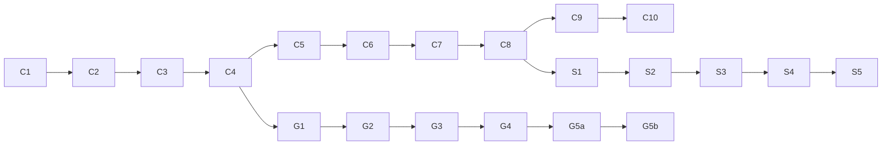

# Source Code Explanation Plan

The campaign: explain **every line of every project-authored code file** in the three
repos, in dependency order, saved into `learning-manual/code_explained/`. This plan is
the inventory + order; `source_code_progress.md` tracks status per file.

Inventory verified against the actual trees on 2026-07-03 (`wc -l` on every file).
Totals: **w17-control-fw ~6,790 lines** (incl. configs), **w17-soundlight-fw ~2,700**,
**w17-ground-station ~1,770** → **≈11,300 lines** of project-authored material.
*(Update 2026-07-09: the ground-station repo grew to ≈3,770 project-authored lines
with audit F2–F4 + iPhone-bridge W1–W3 — re-inventoried in the Repo 3 section below;
project total now ≈13,300.)*

## 1. Ground rules

- One **batch** per session (~400–800 lines of new material). Each batch produces one
  markdown file in `code_explained/<repo>/NN_<topic>.md`.
- Explanations are **line-by-line where lines carry meaning** (logic, config values,
  protocol math) and block-by-block where lines are boilerplate (include lists,
  brace-only lines) — with the boilerplate still named, never silently skipped.
- Headers are explained *with* their `.cpp` (interface first, then implementation).
- Each module's **test file is explained with the module** — tests are executable
  documentation and often the best teacher.
- Source repos stay read-only. Quotes go into the manual; nothing is edited in place.
- After each batch: update `source_code_progress.md`, and add any discovered terms /
  uncertainties to `glossary.md` / `open_questions.md`.

## 2. Files to skip or only summarize (with reasons)

| File(s) | Decision | Reason |
|---|---|---|
| `w17-ground-station/package-lock.json` | **Skip** (one-paragraph note when `package.json` is explained) | Generated lockfile — thousands of machine-written lines; its *concept* matters, its lines don't |
| `w17-ground-station/mediamtx/mediamtx` (29 MB) | **Skip** | Downloaded third-party binary (fetched by `scripts/fetch-mediamtx.js`), not project code |
| `node_modules/`, `.pio/` | **Skip** | External dependencies / build outputs |
| `library.json` ×19 (both fw repos) | **One exemplar line-by-line** (batch C1), rest summarized in a single comparison table | Near-identical 7–12-line PlatformIO metadata; the deviations (deps, build flags) are the only interesting content |
| `.gitignore`, `.DS_Store` | Summarize in one sentence / skip | Housekeeping; `.DS_Store` is macOS junk |
| `w17-soundlight-fw/lib/link2/*` | **Diff-verify against the control repo's copy, then reference** the control explanation | Documented as a verbatim copy ("do not fork"); the diff *is* the explanation. If the diff is non-empty, that's a finding → open_questions |
| `w17-control-fw/docs/*`, `CLAUDE.md`, READMEs | Not in this campaign | Documentation, already covered by manual chapter 05 |
| `docs/f1_hud.html` (479 lines) | **Summarize only** (historical mockup) | Superseded by the real renderer; only its feel-constants lineage matters (ch05 §10). Deep-dive available on request |
| `diagram.json`, `wokwi.toml` | Already explained in depth (ch05 §9) | Marked done in the progress table |
| `test/mocks/*.hpp` (7 files, control) | Explained **with the module that uses them**, not as a standalone batch | A mock is meaningless without its interface |

**Uncertain (project-authored vs generated?):** none found — every file above is
clearly one or the other. `mediamtx/mediamtx.yml` is **project-authored** (pinned,
hand-edited config) and is included.

## 3. Explanation order — batches, dependencies, difficulty

Order follows the dependency graph (a file is explained only after everything it
`#include`s/imports), which conveniently matches the learning order in
`06_learning_order.md`. Difficulty: ★ trivial → ★★★★★ hard. "Concepts" reference
manual chapters (03 = electronics, 04 = embedded C++, 07–10 = domain chapters).

### Repo 1: w17-control-fw (batches C1–C10)

| Batch | Files (lines) | Difficulty | Required concepts |
|---|---|---|---|
| **C1 — Foundations: pins, HAL seams, failsafe** | `lib/config/include/config/PinMap.hpp` (38) · all 7 `lib/hal/include/hal/I*.hpp` (146) · `lib/hal/library.json` exemplar + library.json comparison table · `lib/failsafe/…/FailsafeStateMachine.hpp` (68) + `.cpp` (42) · `test/mocks/FakeClock.hpp` (17) · `test/test_failsafe/test_main.cpp` (119) | ★★ | ch04 §1–§10 (headers, constexpr, structs, enum class, classes, interfaces); ch10 §1 (the FSM) |
| **C2 — Outputs: commands → microseconds** | `lib/outputs/…/ServoOutput.{hpp,cpp}` (80) · `EscOutput.{hpp,cpp}` (106) · `DrsOutput.{hpp,cpp}` (37) · `lib/outputs_hal_esp32/…/Esp32LedcPwm.{hpp,cpp}` (57) · `test/mocks/MockPwmOutput.hpp` (18) · `test/test_outputs/test_main.cpp` (173) | ★★ | ch03 §6 (servo PWM/LEDC); ch04 §9 (interfaces); integer scaling |
| **C3 — CRSF I: framing + channel decoding** | `lib/crsf/…/CrsfFrame.hpp` (104) · `CrsfFrameAssembler.{hpp,cpp}` (113) · `CrsfParser.{hpp,cpp}` (122) | ★★★★ | ch09 §1 (CRSF); ch04 §13 (bits/shifts); CRC-8 algorithm; 11-bit unpacking is the hardest bit-math in the repo |
| **C4 — CRSF II: receiver facade + frame building** | `CrsfReceiver.{hpp,cpp}` (108) · `CrsfFrameBuilder.hpp` (118) · `lib/crsf_hal_esp32/…/Esp32CrsfUart.{hpp,cpp}` (61) · `test/test_crsf/test_main.cpp` (541 — key tests line-by-line, rest catalogued) | ★★★ | C3; ch06 §2.1 (LQ latch / A8); big-endian telemetry payloads |
| **C5 — Channels: mapping + arm gate** | `lib/channels/…/ChannelDecoder.{hpp,cpp}` (224) · `ArmGate.{hpp,cpp}` (72) · `test/test_channels/test_main.cpp` (372) | ★★★ | C3–C4; hysteresis; edge detection; ch10 §2 |
| **C6 — Feel: gearbox + ERS** | `lib/gearbox/…/Gearbox.{hpp,cpp}` (173) · `lib/ers/…/ErsSystem.{hpp,cpp}` (160) · `test/test_gearbox/` (179) · `test/test_ers/` (198) | ★★★ | ch10 §3–4; integer expo math; micro-permille accounting |
| **C7 — Telemetry sensors** | `lib/telemetry/…/BatteryMonitor.{hpp,cpp}` (151) · `WheelSpeed.{hpp,cpp}` (118) · `lib/telemetry_hal_esp32/…/Esp32BatteryAdc.{hpp,cpp}` (49) · `Esp32HallPulseCounter.{hpp,cpp}` (84) · `test/mocks/FakeVoltageSensor.hpp` + `FakeWheelPulseSensor.hpp` (28) · `test/test_telemetry/` (286) | ★★★★ | ch03 §4–5 (ADC, Hall); ch04 §12 (ISR + atomics); ch10 §5 (EMA, hysteresis) — the ISR file is the repo's concurrency deep-end |
| **C8 — link2: the outbound protocol** | `lib/link2/…/Link2Frame.hpp` (76) · `Link2Codec.{hpp,cpp}` (162) · `Link2Sender.{hpp,cpp}` (102) · `lib/link2_hal_esp32/…/Esp32Link2Uart.{hpp,cpp}` (46) · `test/mocks/MockByteSink.hpp` (25) · `test/test_link2/` (317 incl. the golden frame) | ★★★ | ch09 §2 (the spec, byte-by-byte); C3's CRC |
| **C9 — Settings + console** | `lib/settings/…/Settings.{hpp,cpp}` (103) · `lib/console/…/Console.{hpp,cpp}` (249) · `ConsoleRunner.{hpp,cpp}` (122) · `lib/settings_hal_esp32/…` (87) · `test/mocks/MockCharIO.hpp` + `MockSettingsStore.hpp` (82) · `test/test_settings/` (96) · `test/test_console/` (227) | ★★★ | ch06 §2.8 (never-brick chain); string parsing in C++; largest batch — may split into C9a/C9b |
| **C10 — The conductor: main.cpp + sim + build configs** | `src/main.cpp` (403) · `src/SimCrsfFeeder.{hpp,cpp}` (215) · `platformio.ini` (58) · `.github/workflows/ci.yml` (36) · (`wokwi.toml`/`diagram.json` already done) | ★★★★ | Everything C1–C9; ch06 §4 (cadences); the sim script vs SIMULATION.md's phase table |

### Repo 2: w17-soundlight-fw (batches S1–S5)

| Batch | Files (lines) | Difficulty | Required concepts |
|---|---|---|---|
| **S1 — Input side: pins, link2 copy, monitor** | `lib/config/…/PinMap.hpp` (30) · `lib/link2/*` **diff-verify vs control** (238 — reference, not re-explain) · `lib/link2monitor/…/Link2Monitor.{hpp,cpp}` (121) · `test/test_link2monitor/` (123) · `test/test_link2/` (139, diff-check) | ★★ | C8; ch07 §2 (per-field staleness) |
| **S2 — The virtual engine** | `lib/enginesim/…/EngineSim.{hpp,cpp}` (238) · `test/test_enginesim/` (152) | ★★★ | ch07 §3; asymmetric inertia math; ignition FSM |
| **S3 — The synthesizer (DSP)** | `lib/soundsynth/…/ISampleSource.hpp` (24) · `EngineSynth.{hpp,cpp}` (270) · `test/test_soundsynth/` (186) | ★★★★★ | ch07 §4; wavetables, phase accumulators, LFSR — the hardest math in the project; budget a full session |
| **S4 — Lights** | `lib/lights/…/LightRenderer.{hpp,cpp}` (249) · `lib/lights_hal_esp32/…/Esp32NeoPixelStrip.{hpp,cpp}` (45) · `test/test_lights/` (183) | ★★★ | ch07 §5; compositing layers; gamma; power budget |
| **S5 — Audio HAL + dual-core main + integration** | `lib/audio_hal_esp32/…/Esp32I2sAudio.{hpp,cpp}` (82) · `src/main.cpp` (142) · `src/SimLink2Feeder.{hpp,cpp}` (130) · `test/test_integration/` (158) · `platformio.ini` (45) · `ci.yml` (36, diff vs control's) | ★★★★ | ch07 §6 (cores, the atomic word, dead-man — answers open question #43); FreeRTOS task pinning; I2S driver |

### Repo 3: w17-ground-station (batches G1–G5b)

> **Inventory re-verified 2026-07-09** (G0 pass: `wc -l` per file against the tree at
> commit `dab3039`; the earlier table matched the 2026-07-03 tree at `b5ed803` exactly,
> so all drift came from audit F2/F3/F4 + iPhone-bridge W1–W3, 2026-07-07/08). Changes
> absorbed below: **13 new files** (7 source, 5 test suites, 1 fixture), growth in 10
> pre-existing files (largest: `main.js` 106→159, `hud.js` 246→295, both CRSF test
> suites roughly +50 %), suite now **118 vitest tests / 8 files** (was 20/3; verified
> by running it). `.github/workflows/ci.yml` (31; package-smoke job added by F2) was
> **missing from the original inventory** — added to G4, matching the firmware repos
> where `ci.yml` was batched (C10/S5). The iPhone-bridge files form new batches
> **G5a/G5b** rather than growing G1/G2, because (a) they are a self-contained feature
> behind off-by-default env flags, and (b) their real-device validation is **pending**
> (open question #58) and the manual's iPhone-bridge chapter is deliberately deferred —
> keeping them last lets G1–G4 tell the complete viewer-app story first. New repo
> totals: ~2,255 lines runtime source + ~1,367 tests/fixture + ~150 config ≈ **3,770
> project-authored lines** (docs/README/CLAUDE.md excluded from line-by-line as in the
> other repos; `w17-ground-station/CLAUDE.md` is new 2026-07-09).

| Batch | Files (lines) | Difficulty | Required concepts |
|---|---|---|---|
| **G1 — Shared pure core (JS)** — **DONE 2026-07-09** | `shared/telemetry.js` (50) · `feelConstants.js` (13) · `crsf.js` (169) · `crsfAssembler.js` (45) · `crsfTelemetry.js` (51) · `linkState.mjs` (31, audit F2) · `test/fixtures/crsf_golden.json` (38, audit F3) · `test/crsf.test.js` (152) · `test/crsfTelemetry.test.js` (121) · `test/linkState.test.js` (72) | ★★★ | JS-for-C++-readers primer (opens the batch doc); ch09 (same protocol, third implementation); ch12 §4/§6 (why linkState + the golden fixture exist) |
| **G2 — Main process + telemetry sources** — **DONE 2026-07-09** | `main/main.js` (159) · `main/preload.cjs` (22) · `main/mediamtx.js` (54) · `main/CrsfSerialSource.js` (96) · `shared/replaySource.js` (93) · `test/replay.test.js` (84) | ★★★ | ch08 §1 (Electron anatomy); child processes; serial ports; answered open question #47's input half (renderer half → G3). main.js's bridge/receiver construction blocks summarized with forward refs to G5a/G5b, as planned |
| **G3 — The renderer (HUD + video)** — **DONE 2026-07-09** | `renderer/index.html` (97) · `hud.css` (137) · `hud.js` (295) · `whep.js` (89) | ★★★ | HTML/CSS/DOM basics (primer in the batch doc); Gamepad API; WebRTC/WHEP client flow; answered open question #47 fully; F4's gear-count alignment and the command-mirror IPC send explained here (a 4-gear-era leftover found → #61a) |
| **G4 — Scripts + packaging + CI** — **DONE 2026-07-09** | `scripts/run.js` (19) · `ensure-electron.js` (88) · `fetch-mediamtx.js` (57) · `package.json` (32) · `electron-builder.yml` (40) · `mediamtx/mediamtx.yml` (36) · `.github/workflows/ci.yml` (31, incl. F2's Windows package-smoke job) | ★★ | npm lifecycle; ch08 §6 gotchas; ch11 §7; ends the viewer-app story with the deployment story. Verified 118/118 vitest (CI's own `test` job reproduced); no G4 file is unit-tested — packaging/download/launch all runtime-PROVISIONAL. New note #62 (ensure-electron repairs from cache only) |
| **G5a — iPhone bridge W2: telemetry out (send-only)** | `shared/telemetrySnapshot.js` (136) · `main/IphoneTelemetryBridge.js` (142) · `main/iphoneBridgeConfig.js` (26) · `test/telemetrySnapshot.test.js` (262) · `test/iphoneBridge.test.js` (220) | ★★★ | ch08 + G1 linkState; the bridge contract (`docs/windows_bridge_contract.md`, implementation copy — canonical lives in Codex-owned `iPhone_rc`); **honesty rules: real-device validation PENDING (#58)** — the batch may claim unit-test truth only |
| **G5b — iPhone bridge W3: head-tracking in (LOG-ONLY) + no-control-path guards** | `shared/headTracking.js` (216) · `main/HeadTrackingReceiver.js` (152) · `main/headTrackingConfig.js` (28) · `test/headTracking.test.js` (326) · `test/noControlPath.test.js` (92) | ★★★ | G5a; the workspace safety boundaries (W3 is LOG-ONLY — no CRSF/servo/gimbal path, ever, until a separate safety milestone); `noControlPath` spans W2+W3 and is explained here where it completes |

G5a/G5b are additionally gated on a decision about the deferred **iPhone-bridge manual
chapter** (open question #58): write the chapter first (architecture before
line-by-line, as ch07/ch08 did for S/G) or fold the architecture into the G5 batch
docs. Either way the batches must not claim W3 real-device validation — it is
implemented + unit-tested, not validated.

### Dependency order, condensed

Repos 2 and 3 can be interleaved after their entry dependency (C8 for soundlight, C4
for ground station) if variety is wanted; the default is straight through C→S→G.

## 4. Effort estimate

21 batches (was 19; the 2026-07-09 re-inventory added G5a/G5b for the iPhone bridge)
≈ 21 sessions at one batch/session. Heavier batches (C4, C9, C10, S3) may
spill into two sittings; lighter ones (S1, G4) can pair up. Nothing blocks on hardware.

## 5. First recommended batch

**C1 — Foundations: pins, HAL seams, failsafe** (~430 lines):

1. `lib/config/include/config/PinMap.hpp` — gentlest possible start; every C++ token
   in it is already covered by chapter 04 §1–4.
2. `lib/hal/include/hal/` — all seven interface headers (`IClock`, `IPwmOutput`,
   `IByteSink`, `ICharIO`, `IVoltageSensor`, `IWheelPulseSensor`, `ISettingsStore`) —
   THE house pattern, seen whole.
3. `lib/hal/library.json` + the 19-file comparison table — build metadata demystified
   once.
4. `lib/failsafe/FailsafeStateMachine.hpp` + `.cpp` — the first real logic: the safety
   core, including the A1 latch.
5. `test/mocks/FakeClock.hpp` + `test/test_failsafe/test_main.cpp` — how the FSM is
   proven, test by test.

Output: `code_explained/control_fw/01_foundations_pins_hal_failsafe.md`.
Why this batch first: smallest real-logic module, zero dependencies, maximum
concept-per-line density, and it seeds the pattern every later batch reuses.
